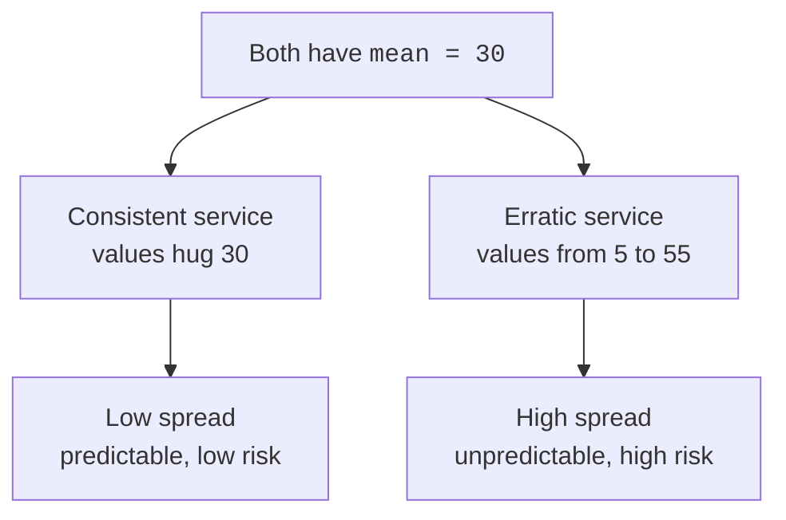
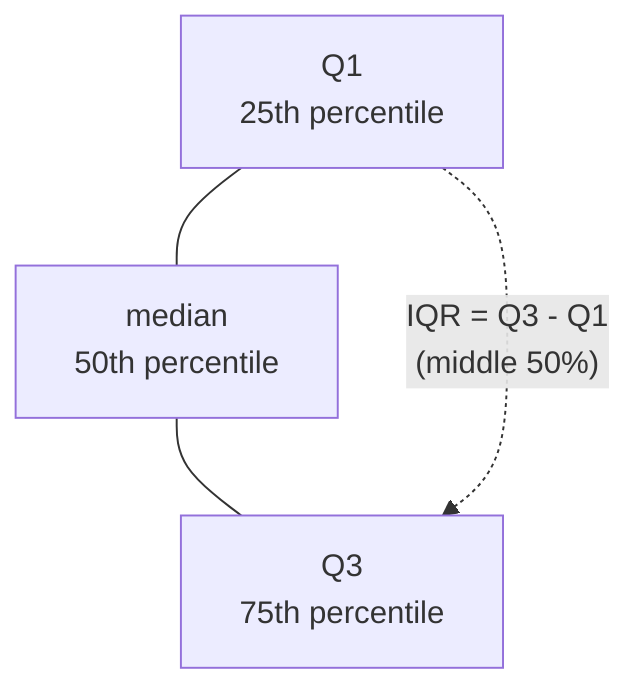

Two delivery services both average a 30-minute wait. One always
arrives between 28 and 32 minutes. The other swings from 5 minutes to
an hour. Same center, wildly different experience, and if you only
reported the average, you'd call them identical. A measure of
**center** tells you where the data sits; a measure of **spread** tells
you how much it *moves*. You almost never understand a column from its
center alone.

Spread is where risk, reliability, and surprise live. A model's error,
a process's consistency, a portfolio's volatility, a sensor's noise,
all of these are spread, not center. This page builds the vocabulary:
**range**, **variance**, **standard deviation**, the **IQR**, the
**MAD**, and the **coefficient of variation**, plus the one divisor
detail (`n−1`) that trips up almost everyone.

<svg
  viewBox="0 0 640 200"
  role="img"
  aria-label="Two rows of deliveries share one solid yellow average line: the top row's green dots huddle inside a tight capsule while the bottom row's blue dots scatter edge to edge inside a wide one, same center, completely different spread"
  style={{ display: "block", width: "100%", maxWidth: "640px", height: "auto", margin: "2.5rem auto" }}
>
  <g style={{ color: "var(--ds-yellow-500)" }} fill="currentColor">
    <rect x="318" y="24" width="4" height="152" rx="2" />
  </g>
  <g style={{ color: "var(--ds-green-500)" }} fill="currentColor">
    <rect x="286" y="54" width="70" height="28" rx="14" fillOpacity="0.15" />
    <circle cx="298" cy="68" r="6" />
    <circle cx="309" cy="68" r="6" />
    <circle cx="320" cy="68" r="6" />
    <circle cx="331" cy="68" r="6" />
    <circle cx="342" cy="68" r="6" />
  </g>
  <g style={{ color: "var(--ds-blue-500)" }} fill="currentColor">
    <rect x="96" y="124" width="448" height="28" rx="14" fillOpacity="0.1" />
    <circle cx="112" cy="138" r="6" />
    <circle cx="182" cy="138" r="6" />
    <circle cx="252" cy="138" r="6" />
    <circle cx="320" cy="138" r="6" />
    <circle cx="390" cy="138" r="6" />
    <circle cx="460" cy="138" r="6" />
    <circle cx="528" cy="138" r="6" />
  </g>
</svg>

## Same center, different spread

Let's make the delivery story concrete. Both services have a mean of
30, but everything that matters is in the spread.

<CodeBlock
  adapter="python"
  files={[
    {
      filename: "main.py",
      starterCode: `import numpy as np
import pandas as pd

# Two delivery services, both averaging 30 minutes.
consistent = pd.Series([28, 29, 30, 30, 31, 32, 30, 29, 31, 30])
erratic = pd.Series([5, 55, 12, 48, 30, 30, 8, 52, 31, 29])

for name, s in [("consistent", consistent), ("erratic", erratic)]:
    print(
        f"{name:>11}: mean={s.mean():.1f}  "
        f"min={s.min():2d}  max={s.max():2d}  std={s.std():.1f}"
    )

print("\\nIdentical means. The spread is the whole story.")
`,
    },
  ]}
/>

<Callout type="info" title="Center and spread are a package deal">
Reporting a mean without a spread is like giving a GPS location with no
accuracy radius. "Around 30 minutes, give or take 1" and "around 30
minutes, give or take 25" are completely different claims. Always pair
a center with a spread.
</Callout>

## Range: the quick-and-dirty spread

The **range** is just `max − min`. It's the easiest spread to compute
and explain, and it's genuinely useful as a first glance or a
sanity check (a range of 0 means a constant column; a range of 10,000
on what should be ages means a data-entry bug).

But the range has a fatal flaw for serious use: it depends on *only the
two most extreme points*, so a single outlier or typo can blow it up.
It also tends to grow as you collect more data, more observations mean
more chances to see an extreme, so it's not comparable across
different sample sizes.

<CodeBlock
  adapter="python"
  files={[
    {
      filename: "main.py",
      starterCode: `import numpy as np

rng = np.random.default_rng(0)
small = rng.normal(50, 5, size=20)
large = rng.normal(50, 5, size=20000)

print(f"Same process, n=20    -> range = {small.ptp():.1f}")
print(f"Same process, n=20000 -> range = {large.ptp():.1f}")
print("\\nThe range grows with sample size even though the spread did not.")
print("(np.ptp = 'peak to peak' = max - min)")
`,
    },
  ]}
/>

<Callout type="warn" title="The range is fragile">
Because it uses only two values, the range throws away everything in
between and is maximally sensitive to outliers. Use it for a quick
gut-check, never as your primary spread measure.
</Callout>

## Variance and standard deviation: spread around the mean

Most spread measures ask the same question: *on average, how far are
the points from the center?* The natural idea is to take each point's
distance from the mean and average those distances. But the raw
deviations sum to zero (positives and negatives cancel, that's what
"balance point" means). To stop the cancellation, we **square** each
deviation before averaging.

That average of squared deviations is the **variance**. It's a real,
honest spread number, but it's in *squared units*, square dollars,
square minutes, which nobody can interpret. So we take the square root
and get the **standard deviation**, which is back in the original units
and reads as a typical distance from the mean.

`s = √( Σ(xᵢ − x̄)² / (n − 1) )`

You will rarely compute this by hand, `numpy` and `pandas` do it, but
the shape matters: square the distances, average them, square-root back.

<CodeBlock
  adapter="python"
  files={[
    {
      filename: "main.py",
      starterCode: `import numpy as np

data = np.array([28, 29, 30, 30, 31, 32, 30, 29, 31, 30])

mean = data.mean()
deviations = data - mean
print("Deviations from the mean:", deviations)
print("They sum to (about):", round(deviations.sum(), 10), "-> cancellation")

variance = (deviations**2).mean()  # average squared deviation
std = np.sqrt(variance)
print(f"\\nVariance (squared units): {variance:.3f}")
print(f"Std dev  (original units): {std:.3f}")
print(f"NumPy std agrees:          {data.std():.3f}")
`,
    },
  ]}
/>

<Callout type="tip" title="How to read a standard deviation">
The standard deviation is in the **same units as your data** and means
roughly "the typical amount a value differs from the mean." If daily
sales average 100 with an SD of 12, a day of 112 or 88 is unremarkable;
a day of 150 is about four SDs out, genuinely unusual. For roughly
bell-shaped data, about two-thirds of values fall within one SD of the
mean and about 95% within two SDs (we'll make this precise in *The
Normal Distribution*).
</Callout>

## The `n−1` divisor: why sample spread uses `ddof=1`

Here is the detail that confuses everyone, so let's make it intuitive
rather than mathematical. When you compute spread from a **sample**
(not the whole population), you divide the sum of squared deviations by
`n−1`, not `n`.

Why? Because you measured the deviations from the **sample mean**, not
the true population mean, and the sample mean is, by construction, the
point that sits as close as possible to your sample's points. Your data
hugs its own mean a little more tightly than it hugs the real
population mean. So squared deviations from the sample mean are
*systematically a bit too small*, and dividing by `n` would
**underestimate** the true spread. Dividing by the smaller number
`n−1` nudges the estimate up to compensate. People say the sample mean
"uses up one degree of freedom", once you know the mean and `n−1` of
the values, the last value is determined, so only `n−1` deviations are
truly free to vary.

<svg
  viewBox="0 0 640 200"
  role="img"
  aria-label="Five scattered points joined by thin solid spokes to the blue ring of the center they define themselves, while the yellow true center floats a little way off to the side, data always hugs its own mean most tightly, which is why sample spread divides by n minus one to push the estimate back up"
  style={{ display: "block", width: "100%", maxWidth: "520px", height: "auto", margin: "2.5rem auto" }}
>
  <g stroke="var(--ds-gray-300)" strokeWidth="2">
    <line x1="185" y1="72" x2="251" y2="119" />
    <line x1="315" y1="80" x2="251" y2="119" />
    <line x1="195" y1="142" x2="251" y2="119" />
    <line x1="308" y1="138" x2="251" y2="119" />
    <line x1="252" y1="165" x2="251" y2="119" />
  </g>
  <g style={{ color: "var(--ds-blue-500)" }} fill="currentColor">
    <circle cx="185" cy="72" r="6" />
    <circle cx="315" cy="80" r="6" />
    <circle cx="195" cy="142" r="6" />
    <circle cx="308" cy="138" r="6" />
    <circle cx="252" cy="165" r="6" />
  </g>
  <circle cx="251" cy="119" r="10" fill="none" stroke="var(--ds-blue-500)" strokeWidth="4" />
  <g style={{ color: "var(--ds-yellow-500)" }} fill="currentColor">
    <circle cx="372" cy="90" r="16" fillOpacity="0.15" />
    <circle cx="372" cy="90" r="7" />
  </g>
</svg>

<Callout type="info" title="ddof = 'delta degrees of freedom'">
In NumPy, `ddof` is what gets subtracted from `n` in the divisor.
`ddof=0` divides by `n` (the **population** formula). `ddof=1` divides
by `n−1` (the **sample** formula). **pandas defaults to `ddof=1`**
(sample), while **NumPy defaults to `ddof=0`** (population), a classic
source of "why don't my numbers match?" bugs.
</Callout>

<CodeBlock
  adapter="python"
  files={[
    {
      filename: "main.py",
      starterCode: `import numpy as np
import pandas as pd

sample = np.array([42, 45, 48, 50, 52, 55, 58, 60, 62, 65])

print("NumPy default (ddof=0, divide by n) :", round(np.std(sample), 4))
print("Sample std    (ddof=1, divide by n-1):", round(np.std(sample, ddof=1), 4))
print("pandas Series default (ddof=1)       :", round(pd.Series(sample).std(), 4))

print("\\nVariance the same way:")
print("np.var ddof=0 :", round(np.var(sample), 4))
print("np.var ddof=1 :", round(np.var(sample, ddof=1), 4))

print("\\nThe ddof=1 values are LARGER, they correct the underestimate.")
print("pandas matches np with ddof=1, NOT np's default.")
`,
    },
  ]}
/>

<Callout type="warn" title="Misconception: NumPy and pandas give the same std">
They do not, by default. `np.std(x)` uses `ddof=0`; `x.std()` on a
pandas Series uses `ddof=1`. For real-world data, which is almost
always a *sample* of something larger, **`ddof=1` is the one you
usually want**. When you see a small discrepancy between two "standard
deviations," check the divisor first.
</Callout>

For large `n` the difference between dividing by `n` and `n−1` is tiny
(1000 vs 999 barely moves the answer). It matters most for small
samples, exactly when you're most at risk of underestimating spread.

## IQR: the robust spread

Just as the median is a robust center, the **interquartile range
(IQR)** is a robust spread. It's the range of the *middle 50%* of the
data: the 75th percentile minus the 25th percentile (`Q3 − Q1`).
Because it ignores the top and bottom 25%, no single outlier, however
extreme, can move it. That makes it the spread of choice for skewed,
outlier-prone data, and it's the engine behind box plots and the
`1.5×IQR` outlier rule we'll meet in *Shape and Outliers*.

<CodeBlock
  adapter="python"
  files={[
    {
      filename: "main.py",
      starterCode: `import numpy as np
import pandas as pd
from scipy import stats

# Right-skewed incomes with one extreme earner.
income = pd.Series([38, 41, 44, 47, 49, 52, 55, 60, 120, 9000])

q1, q3 = income.quantile(0.25), income.quantile(0.75)
print(f"Q1 = {q1:.1f}, Q3 = {q3:.1f}")
print(f"IQR (pandas)        : {q3 - q1:.1f}")
print(f"IQR (scipy.stats)   : {stats.iqr(income):.1f}")
print(f"Std dev (ddof=1)    : {income.std():.1f}  <- wrecked by the 9000")
print()
print("The lone 9000 barely touches the IQR but explodes the std.")
`,
    },
  ]}
/>

<svg
  viewBox="0 0 640 160"
  role="img"
  aria-label="Sorted dots on a line with the middle half wrapped in a green capsule that one far-flung red value cannot stretch, while the red band of the standard deviation below runs all the way out to reach it, the IQR shrugs off the outlier that wrecks the std"
  style={{ display: "block", width: "100%", maxWidth: "600px", height: "auto", margin: "2.5rem auto" }}
>
  <rect x="60" y="79" width="520" height="3" rx="1.5" fill="var(--ds-gray-300)" />
  <g style={{ color: "var(--ds-green-500)" }} fill="currentColor">
    <rect x="144" y="60" width="156" height="40" rx="20" fillOpacity="0.18" />
    <rect x="144" y="64" width="6" height="32" rx="3" />
    <rect x="294" y="64" width="6" height="32" rx="3" />
    <rect x="216" y="66" width="5" height="28" rx="2.5" />
  </g>
  <g fill="var(--ds-gray-400)">
    <circle cx="100" cy="80" r="6" />
    <circle cx="130" cy="80" r="6" />
    <circle cx="330" cy="80" r="6" />
  </g>
  <g style={{ color: "var(--ds-blue-500)" }} fill="currentColor">
    <circle cx="158" cy="80" r="6" />
    <circle cx="183" cy="80" r="6" />
    <circle cx="208" cy="80" r="6" />
    <circle cx="233" cy="80" r="6" />
    <circle cx="258" cy="80" r="6" />
    <circle cx="285" cy="80" r="6" />
  </g>
  <g style={{ color: "var(--ds-red-500)" }} fill="currentColor">
    <circle cx="560" cy="80" r="7" />
    <rect x="96" y="120" width="470" height="8" rx="4" fillOpacity="0.3" />
    <rect x="94" y="114" width="5" height="20" rx="2.5" />
    <rect x="561" y="114" width="5" height="20" rx="2.5" />
  </g>
</svg>

<Callout type="tip" title="Std vs IQR: which spread to report">
Mirror your center choice. If the data is roughly symmetric and you're
reporting the **mean**, report the **standard deviation** alongside it.
If the data is skewed and you're reporting the **median**, report the
**IQR**. Mixing a robust center with a non-robust spread (or vice
versa) sends mixed signals.
</Callout>

## MAD: another robust spread

The **median absolute deviation (MAD)** is a close cousin of the IQR.
Take each point's absolute distance from the median, then take the
median of *those* distances. Like the IQR, it shrugs off outliers
because medians do. You'll see it in outlier detection and robust
statistics; the idea is just "the typical distance from the middle,
measured robustly."

<CodeBlock
  adapter="python"
  files={[
    {
      filename: "main.py",
      starterCode: `import numpy as np
from scipy import stats

data = np.array([38, 41, 44, 47, 49, 52, 55, 60, 120, 9000])

# MAD by hand: median of absolute deviations from the median.
med = np.median(data)
mad_manual = np.median(np.abs(data - med))
print(f"MAD (by hand)           : {mad_manual:.1f}")

# scipy's median_abs_deviation; scale=1 gives the raw MAD.
print(f"MAD (scipy, raw)        : {stats.median_abs_deviation(data):.1f}")
print(f"Std dev for comparison  : {data.std(ddof=1):.1f}  <- outlier-driven")
`,
    },
  ]}
/>

## CV: comparing spread across different scales

Here's a trap. Is a standard deviation of 5 "big"? You can't say, it
depends entirely on the scale. An SD of 5 on human heights (cm) is
modest; an SD of 5 on a 1-to-10 satisfaction score is enormous. Raw
standard deviations are **not comparable across variables measured in
different units or at different magnitudes**.

The **coefficient of variation (CV)** fixes this by dividing the
standard deviation by the mean: `CV = std / mean`. It's a *unitless*,
relative measure of spread, "how big is the spread compared to the
typical value?", which lets you compare the variability of things on
totally different scales.

<CodeBlock
  adapter="python"
  files={[
    {
      filename: "main.py",
      starterCode: `import numpy as np
from scipy import stats

# Two metrics on completely different scales.
house_prices = np.array([310, 305, 322, 298, 315, 308, 330, 295])  # thousands $
daily_visits = np.array([12, 48, 9, 52, 30, 7, 55, 11])  # website hits

for name, x in [("house prices", house_prices), ("daily visits", daily_visits)]:
    sd = x.std(ddof=1)
    cv = stats.variation(x, ddof=1)  # CV = std / mean
    print(f"{name:>12}: mean={x.mean():7.1f}  std={sd:6.1f}  CV={cv:.3f}")

print("\\nHouse prices have a far LARGER std, but a much SMALLER CV.")
print("Relative to their size, visits are far more variable than prices.")
`,
    },
  ]}
/>

<Callout type="warn" title="Misconception: a bigger standard deviation means more spread, period">
Only within the *same* variable. Comparing the SD of revenue (millions)
to the SD of conversion rate (a fraction) tells you nothing, the
revenue SD is bigger purely because the numbers are bigger. To compare
variability across different scales, use the **CV**. (Caveat: the CV
needs a meaningful, positive mean; it's not appropriate when the mean is
near zero or the data can go negative, like temperatures in Celsius.)
</Callout>

<MultipleChoice
  markdown={`Stock A has a mean daily price of \\$500 with a standard deviation of \\$20. Stock B has a mean price of \\$10 with a standard deviation of \\$3. Which stock is *relatively* more volatile, and what should you compute to decide?

- Stock A, because its standard deviation (\\$20) is larger
  > A larger raw standard deviation reflects the larger price level, not greater relative volatility, \\$20 on a \\$500 stock is a small percentage move.
- [o] Stock B, because its coefficient of variation (3/10 = 0.30) is far higher than A's (20/500 = 0.04)
  > Dividing each standard deviation by its mean puts both on a comparable, unitless footing, and B's spread is 30% of its price versus 4% for A.
- They are equally volatile because volatility is absolute
  > Volatility experienced by an investor is relative to the price level, which is exactly why a unitless measure like the CV is needed to compare them.
- You cannot compare them without the raw price histories
  > The means and standard deviations are sufficient to compute each CV, which is all you need for a relative-volatility comparison.

Comparing standard deviations across different price levels is meaningless; the CV is the fix.`}
/>

## Putting it together: a spread summary

In practice you compute several spread measures together and read them
against each other, just like you did with centers. A big gap between
the standard deviation and the IQR is itself a clue that outliers or
skew are present.

<CodeBlock
  adapter="python"
  files={[
    {
      filename: "main.py",
      starterCode: `import numpy as np
import pandas as pd
from scipy import stats

rng = np.random.default_rng(7)

# Right-skewed response times (ms) with a heavy tail.
times = pd.Series(np.round(rng.lognormal(mean=4.0, sigma=0.5, size=500), 1))

summary = {
    "n": int(times.size),
    "range": round(float(times.max() - times.min()), 1),
    "std": round(float(times.std()), 1),  # ddof=1 by default
    "iqr": round(float(stats.iqr(times)), 1),
    "mad": round(float(stats.median_abs_deviation(times)), 1),
    "cv": round(float(stats.variation(times, ddof=1)), 3),
}

for k, v in summary.items():
    print(f"{k:>6}: {v}")

print("\\nstd >> iqr  =>  a heavy tail is inflating the std.")
print("Report median + IQR for skewed data like this.")
`,
    },
  ]}
/>

The same summary on real data tells a story about the world. The
**Palmer penguins** dataset measures body mass for three species. Group
by species and compare the spreads: do all three vary by the same
amount, or is one species far more uniform than another?

<CodeBlock
  adapter="python"
  datasets={[{ path: "palmer-penguins.csv", stageAs: "penguins.csv" }]}
  files={[
    {
      filename: "main.py",
      initCode: `import pandas as pd
from scipy import stats
penguins = pd.read_csv("penguins.csv")`,
      starterCode: `for species, group in penguins.groupby("species"):
    mass = group["body_mass_g"].dropna()
    print(
        f"{species:<10} mean={mass.mean():6.0f}g  "
        f"std={mass.std():5.0f}g  iqr={stats.iqr(mass):5.0f}g"
    )

print("\\nGentoo penguins are both heavier AND more spread out.")
print("A center alone ('Gentoo are bigger') would hide that.")
`,
    },
  ]}
/>

<ChallengeCard
  adapter="python"
  title="Compute and compare spread for two groups"
  instructions={`You're given two pandas Series, \`group_a\` and \`group_b\`, of measurements on the *same* scale.

**Part 1, spread of group A.** Build a dict **\`spread_a\`** with these keys (all values plain Python \`float\`):

- \`"std"\`, the **sample** standard deviation (\`ddof=1\`)
- \`"iqr"\`, the interquartile range, using \`scipy.stats.iqr\`
- \`"cv"\`, the coefficient of variation, using \`scipy.stats.variation\` with \`ddof=1\`

**Part 2, compare.** Set a string **\`more_variable\`** to \`"a"\` if \`group_a\` has the larger sample standard deviation, otherwise \`"b"\`.

Use the provided Series. Make sure every dict value is a \`float\` (not a NumPy scalar).`}
  files={[
    {
      filename: "main.py",
      initCode: `import numpy as np
import pandas as pd
from scipy import stats

rng = np.random.default_rng(2024)
group_a = pd.Series(rng.normal(100, 8, size=300))
group_b = pd.Series(rng.normal(100, 15, size=300))`,
      starterCode: `# TODO: build spread_a and set more_variable
spread_a = {
    "std": None,
    "iqr": None,
    "cv": None,
}
more_variable = None
`,
      solutionCode: `spread_a = {
    "std": float(group_a.std(ddof=1)),
    "iqr": float(stats.iqr(group_a)),
    "cv": float(stats.variation(group_a, ddof=1)),
}

more_variable = "a" if group_a.std(ddof=1) > group_b.std(ddof=1) else "b"

print(spread_a)
print("more_variable:", more_variable)
`,
    },
  ]}
  tests={[
    {
      id: "keys",
      name: "spread_a has the right keys",
      description: "Dict has std, iqr, cv",
      code: `assert isinstance(spread_a, dict)
assert set(spread_a.keys()) == {"std", "iqr", "cv"}`,
    },
    {
      id: "floats",
      name: "all values are floats",
      description: "Every value is a Python float",
      code: `assert all(isinstance(v, float) for v in spread_a.values())`,
    },
    {
      id: "std",
      name: "std uses ddof=1",
      description: "Sample standard deviation",
      code: `assert abs(spread_a["std"] - float(group_a.std(ddof=1))) < 1e-6
# guard against accidentally using the population (ddof=0) value
assert abs(spread_a["std"] - float(group_a.std(ddof=0))) > 1e-9`,
    },
    {
      id: "iqr_cv",
      name: "iqr and cv are correct",
      description: "Match scipy",
      code: `from scipy import stats
assert abs(spread_a["iqr"] - float(stats.iqr(group_a))) < 1e-6
assert abs(spread_a["cv"] - float(stats.variation(group_a, ddof=1))) < 1e-6`,
    },
    {
      id: "compare",
      name: "more_variable is correct",
      description: "Group with larger sample std",
      code: `expected = "a" if group_a.std(ddof=1) > group_b.std(ddof=1) else "b"
assert more_variable == expected`,
    },
  ]}
/>

## Check your understanding

<MultipleChoice
  markdown={`You compute a column's spread two ways and get \`np.std(x)\` = 11.8 and \`x.std()\` (on the same data as a pandas Series) = 12.0. What explains the difference?

- One of the two libraries has a bug
  > Both results are correct; they simply use different default divisors, which is expected behavior, not a bug.
- [o] NumPy's default uses \`ddof=0\` (divide by n) while pandas defaults to \`ddof=1\` (divide by n−1), so the pandas value is slightly larger
  > The \`n−1\` divisor produces a marginally larger estimate, and matching them just means passing \`ddof=1\` to NumPy or \`ddof=0\` to pandas.
- The data must contain missing values that pandas dropped
  > Dropping values would change the result unpredictably; this specific, small gap is the signature of the differing default \`ddof\`.
- pandas rounds and NumPy does not
  > Neither silently rounds; the gap comes from the divisor (\`n\` vs \`n−1\`), not from rounding.

Whenever two "standard deviations" differ slightly on identical data, suspect the \`ddof\` first.`}
/>

<MultipleChoice
  markdown={`Why do we divide by \`n−1\` instead of \`n\` when estimating spread from a *sample*?

- To make the standard deviation smaller and more conservative
  > Dividing by the smaller \`n−1\` makes the estimate *larger*, not smaller, the opposite of this claim.
- Because the population is always smaller than the sample
  > The population is the larger thing we're estimating; the \`n−1\` correction has nothing to do with population size.
- [o] Deviations are measured from the sample mean, which hugs the sample too tightly, so dividing by \`n\` would underestimate the true spread; \`n−1\` corrects for that
  > Because the sample mean sits closer to the sample's own points than the true mean does, the squared deviations run small, and the smaller divisor compensates.
- It is an arbitrary convention with no real justification
  > There is a concrete reason: it removes the systematic downward bias that arises from estimating deviations around the sample's own mean.

The phrase "one degree of freedom is used up by estimating the mean" is shorthand for exactly this correction.`}
/>

<MultipleChoice
  markdown={`A dataset of file sizes is strongly right-skewed with a few enormous files. You want a spread measure that the giant files won't dominate. Which is the best choice?

- The range (max − min)
  > The range is defined by the two most extreme points, so the giant files would dominate it completely, the worst choice here.
- The standard deviation
  > Squaring deviations makes the standard deviation especially sensitive to extreme values, so the giant files would inflate it heavily.
- [o] The interquartile range (IQR)
  > Spanning only the middle 50% of the data, the IQR ignores the extreme files entirely and reflects the spread of the bulk of the distribution.
- The variance
  > The variance is just the squared standard deviation, so it is even more sensitive to the extreme files, not less.

For skewed, outlier-prone data, the IQR (and MAD) give a spread that the tail can't hijack.`}
/>

<MultipleChoice
  markdown={`The standard deviation is preferred over the variance for *reporting* spread mainly because:

- It is always smaller than the variance
  > It is only smaller when the variance exceeds 1, and "smaller" isn't the reason anyway; interpretability is.
- It is more robust to outliers than the variance
  > Both are driven by squared deviations and are similarly sensitive to outliers; robustness isn't the distinction.
- [o] It is expressed in the same units as the data, whereas the variance is in squared units that are hard to interpret
  > Taking the square root returns the measure to the original units (dollars, minutes), so "give or take one SD" is directly meaningful in a way "give or take 144 square dollars" is not.
- The variance can be negative but the standard deviation cannot
  > The variance is an average of squared numbers and so is never negative; that is not the reason the SD is preferred.

Variance and SD carry the same information; the SD is just in human-readable units.`}
/>

<MultipleChoice
  markdown={`When is the **coefficient of variation** the appropriate spread measure?

- Whenever you want the most robust possible measure of spread
  > Robustness is the job of the IQR or MAD; the CV is built from the (non-robust) mean and standard deviation.
- For any data, since it always improves on the standard deviation
  > The CV is undefined or unstable when the mean is near zero and is meaningless for data that can be negative, so it is not universally applicable.
- [o] When comparing the *relative* variability of variables measured on different scales or in different units, and the mean is positive and meaningful
  > Dividing the standard deviation by the mean yields a unitless ratio, which is what lets you compare, say, price variability against visit-count variability on equal footing.
- Only when the data is perfectly symmetric
  > Symmetry is not a requirement for the CV; the binding requirement is a meaningful, positive mean.

The CV answers "how big is the spread relative to the typical value?", useful precisely across different scales.`}
/>

<Callout type="success" title="Key takeaways">
- **Spread matters as much as center**, risk, reliability, and surprise
  all live in how much the data moves, not where it sits.
- **Range** = max − min: quick but fragile and outlier-driven.
- **Variance** = average squared deviation (squared units);
  **standard deviation** = its square root, in the data's own units and
  readable as a typical distance from the mean.
- Use **`ddof=1`** for sample spread (pandas' default); NumPy defaults to
  `ddof=0`, a common mismatch.
- **IQR** and **MAD** are robust spreads (middle 50% / median distance):
  pair them with the median on skewed data.
- **CV = std / mean** is unitless, the right tool for comparing
  variability across different scales (when the mean is positive).
</Callout>
