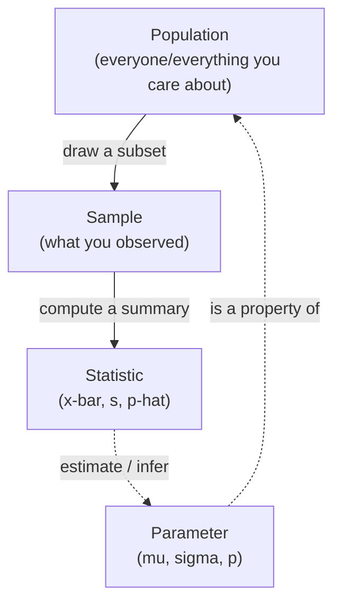

In *Statistical Thinking* we said your data is one noisy slice of a
larger reality. This page gives that idea its proper vocabulary,
**population** and **sample**, **parameter** and **statistic**, and
makes one arrow precise: you compute a statistic from a sample to
*estimate* a parameter of a population you can't fully see. Almost
every method in the rest of the course is a tool for drawing that arrow
honestly.

The distinction sounds almost too simple to dwell on, yet confusing
these four words is behind a huge share of real analytical mistakes:
reporting a sample average as if it were the population's, expecting a
bigger sample to "change" the answer, or forgetting that a statistic
wobbles every time you collect new data. Let's pin them down.

<svg
  viewBox="0 0 640 230"
  role="img"
  aria-label="A vast field of gray dots hides a yellow ring at its heart while nine scattered dots glow blue; past a solid arrow the same nine reappear in a small tray whose green summary dot is the only number you can actually compute, a sample statistic estimating a population parameter you never see"
  style={{ display: "block", width: "100%", maxWidth: "640px", height: "auto", margin: "2.5rem auto" }}
>
  <rect x="36" y="22" width="380" height="186" rx="18" fill="var(--ds-blue-500)" fillOpacity="0.06" />
  <g fill="var(--ds-gray-400)">
    <circle cx="60" cy="50" r="3.5" />
    <circle cx="92" cy="38" r="3.5" />
    <circle cx="124" cy="56" r="3.5" />
    <circle cx="156" cy="40" r="3.5" />
    <circle cx="188" cy="52" r="3.5" />
    <circle cx="220" cy="38" r="3.5" />
    <circle cx="252" cy="54" r="3.5" />
    <circle cx="284" cy="42" r="3.5" />
    <circle cx="316" cy="56" r="3.5" />
    <circle cx="348" cy="40" r="3.5" />
    <circle cx="380" cy="54" r="3.5" />
    <circle cx="56" cy="86" r="3.5" />
    <circle cx="88" cy="74" r="3.5" />
    <circle cx="120" cy="92" r="3.5" />
    <circle cx="152" cy="78" r="3.5" />
    <circle cx="216" cy="76" r="3.5" />
    <circle cx="248" cy="90" r="3.5" />
    <circle cx="312" cy="80" r="3.5" />
    <circle cx="344" cy="92" r="3.5" />
    <circle cx="376" cy="78" r="3.5" />
    <circle cx="64" cy="122" r="3.5" />
    <circle cx="96" cy="110" r="3.5" />
    <circle cx="128" cy="126" r="3.5" />
    <circle cx="192" cy="112" r="3.5" />
    <circle cx="256" cy="124" r="3.5" />
    <circle cx="288" cy="110" r="3.5" />
    <circle cx="320" cy="126" r="3.5" />
    <circle cx="384" cy="112" r="3.5" />
    <circle cx="58" cy="158" r="3.5" />
    <circle cx="90" cy="146" r="3.5" />
    <circle cx="122" cy="162" r="3.5" />
    <circle cx="154" cy="148" r="3.5" />
    <circle cx="186" cy="160" r="3.5" />
    <circle cx="218" cy="146" r="3.5" />
    <circle cx="250" cy="162" r="3.5" />
    <circle cx="282" cy="148" r="3.5" />
    <circle cx="314" cy="160" r="3.5" />
    <circle cx="346" cy="146" r="3.5" />
    <circle cx="378" cy="158" r="3.5" />
    <circle cx="72" cy="190" r="3.5" />
    <circle cx="104" cy="178" r="3.5" />
    <circle cx="168" cy="182" r="3.5" />
    <circle cx="200" cy="192" r="3.5" />
    <circle cx="232" cy="178" r="3.5" />
    <circle cx="264" cy="190" r="3.5" />
    <circle cx="296" cy="180" r="3.5" />
    <circle cx="328" cy="192" r="3.5" />
    <circle cx="360" cy="180" r="3.5" />
    <circle cx="392" cy="190" r="3.5" />
  </g>
  <g style={{ color: "var(--ds-yellow-500)" }} fill="currentColor">
    <path d="M210 112 a16 16 0 1 0 32 0 a16 16 0 1 0 -32 0 M218 112 a8 8 0 1 0 16 0 a8 8 0 1 0 -16 0" fillRule="evenodd" />
  </g>
  <g style={{ color: "var(--ds-blue-500)" }} fill="currentColor">
    <circle cx="110" cy="60" r="4.5" />
    <circle cx="300" cy="64" r="4.5" />
    <circle cx="76" cy="104" r="4.5" />
    <circle cx="360" cy="120" r="4.5" />
    <circle cx="170" cy="136" r="4.5" />
    <circle cx="264" cy="72" r="4.5" />
    <circle cx="140" cy="180" r="4.5" />
    <circle cx="330" cy="168" r="4.5" />
    <circle cx="212" cy="170" r="4.5" />
  </g>
  <g fill="var(--ds-gray-400)">
    <rect x="424" y="102.5" width="28" height="3" rx="1.5" />
    <polygon points="450,98.5 461,104 450,109.5" />
  </g>
  <g style={{ color: "var(--ds-blue-500)" }} fill="currentColor">
    <rect x="478" y="66" width="124" height="98" rx="14" fillOpacity="0.1" />
    <circle cx="504" cy="92" r="4.5" />
    <circle cx="540" cy="92" r="4.5" />
    <circle cx="576" cy="92" r="4.5" />
    <circle cx="504" cy="116" r="4.5" />
    <circle cx="540" cy="116" r="4.5" />
    <circle cx="576" cy="116" r="4.5" />
    <circle cx="504" cy="140" r="4.5" />
    <circle cx="540" cy="140" r="4.5" />
    <circle cx="576" cy="140" r="4.5" />
  </g>
  <g style={{ color: "var(--ds-green-500)" }} fill="currentColor">
    <rect x="478" y="178" width="124" height="6" rx="3" fillOpacity="0.3" />
    <circle cx="546" cy="181" r="6.5" />
  </g>
</svg>

## Population vs. sample

The **population** is the entire collection of units you actually care
about, every customer, every transaction this design could ever
generate, every wafer the machine could ever produce. The **sample** is
the subset you managed to observe and put in a DataFrame.

The loop is the whole idea: the parameter lives in the population (top
right), you can't see it directly, so you draw a sample, compute a
statistic, and use that statistic to estimate the parameter. The dotted
arrows are *inference*, uncertain by nature. The solid arrows are
*things you actually do* (sampling and computing), which are concrete
and exact.

<Callout type="info" title="The population is usually conceptual, not a list">
It's natural to imagine the population as a giant spreadsheet you could
download if only you had time. Sometimes it is (every employee on the
payroll right now). But far more often the population is **conceptual
and effectively infinite**: "all checkout sessions this flow could ever
produce," "every future sensor reading from this machine." You're
estimating a property of a *process*, not counting a finite pile. That's
why "just collect all of it" usually isn't even possible in principle.
</Callout>

## Why we sample instead of taking a census

A **census** measures every unit in the population. When you can do one
cheaply, do it, there's no uncertainty to estimate. But for most
data-science questions a census is impossible, impractical, or
pointless:

- **Cost and time.** Surveying all 4 million users, or load-testing
  every possible session, is wildly expensive when 2,000 well-chosen
  observations answer the question.
- **The population is infinite or future-facing.** You literally cannot
  measure "all sessions this design will ever serve", most of them
  haven't happened yet.
- **Measurement destroys the unit.** A factory testing battery
  lifetime to failure can't ship the batteries it tested. Destructive
  testing *forces* sampling.
- **A good sample is enough.** This is the punchline of the whole
  course: a modest, representative sample estimates a population
  parameter with quantifiable precision. You don't need everything,
  you need enough, collected well.

<svg
  viewBox="0 0 640 170"
  role="img"
  aria-label="A shelf of identical batteries, two of them snapped in half by lifetime testing with a small yellow data spark above each, when measurement destroys the unit, you can only ever test a sample, never the whole shipment"
  style={{ display: "block", width: "100%", maxWidth: "560px", height: "auto", margin: "2.5rem auto" }}
>
  <rect x="60" y="132" width="500" height="3" rx="1.5" fill="var(--ds-gray-400)" />
  <g style={{ color: "var(--ds-blue-500)" }} fill="currentColor" fillOpacity="0.6">
    <rect x="90" y="56" width="14" height="6" rx="2" />
    <rect x="80" y="62" width="34" height="64" rx="6" />
    <rect x="150" y="56" width="14" height="6" rx="2" />
    <rect x="140" y="62" width="34" height="64" rx="6" />
    <rect x="270" y="56" width="14" height="6" rx="2" />
    <rect x="260" y="62" width="34" height="64" rx="6" />
    <rect x="330" y="56" width="14" height="6" rx="2" />
    <rect x="320" y="62" width="34" height="64" rx="6" />
    <rect x="450" y="56" width="14" height="6" rx="2" />
    <rect x="440" y="62" width="34" height="64" rx="6" />
    <rect x="510" y="56" width="14" height="6" rx="2" />
    <rect x="500" y="62" width="34" height="64" rx="6" />
  </g>
  <g style={{ color: "var(--ds-red-500)" }} fill="currentColor">
    <rect x="210" y="56" width="14" height="6" rx="2" />
    <rect x="200" y="62" width="34" height="26" rx="6" />
    <rect x="208" y="98" width="34" height="28" rx="6" />
    <rect x="390" y="56" width="14" height="6" rx="2" />
    <rect x="380" y="62" width="34" height="26" rx="6" />
    <rect x="372" y="98" width="34" height="28" rx="6" />
  </g>
  <g style={{ color: "var(--ds-yellow-500)" }} fill="currentColor">
    <circle cx="217" cy="38" r="5" />
    <circle cx="397" cy="38" r="5" />
  </g>
</svg>

<Callout type="tip" title="Sampling is a feature, not a compromise">
Sampling isn't a sad approximation you settle for. It's the entire
basis of efficient measurement: a 1,500-person poll can speak for a
nation because statistics tells you *exactly how precise* that estimate
is. The catch is that the sample must be collected without bias, the
subject of *Sampling and Bias*.
</Callout>

## Parameters vs. statistics

This is the distinction to burn into memory.

- A **parameter** is a number that describes the **population**. It's
  fixed (the process has some true value) but **unknown**, you can't
  see it. Parameters get Greek letters.
- A **statistic** is a number you compute from the **sample**. It's
  **known** (you can calculate it) but **varies**, a different sample
  gives a different value. Statistics get Latin letters or "hats."

| Quantity | Population **parameter** (unknown, fixed) | Sample **statistic** (known, varies) |
| --- | --- | --- |
| Mean | μ ("mu") | x̄ ("x-bar") |
| Standard deviation | σ ("sigma") | `s` |
| Proportion | `p` | p̂ ("p-hat") |
| Size | `N` | `n` |
| Correlation | ρ ("rho") | `r` |

A clean way to keep them straight: **Greek = the truth you're after;
Latin/hat = your best guess from data.** The statistic is the
*estimator*; the parameter is the *estimand*. You use x̄ to
estimate μ, p̂ to estimate `p`, and so on.

<Callout type="danger" title="The #1 confusion: reporting a statistic as a parameter">
Writing "average revenue per user is \$48.20", full stop, quietly
claims you measured the *population*. You didn't. You measured
`x̄ = 48.20` from a sample, and the population μ is *near* it but
uncertain. The honest sentence names the estimate and its error:
"x̄ = \$48.20, and μ is plausibly within \$45–\$51." Collapsing
the statistic and the parameter into one number is how overconfident
claims are born.
</Callout>

<Callout type="info" title="A true story: the German tank problem">
In World War II the Allies wanted to know a hidden population parameter:
how many tanks Germany was producing. The population size `N` was a
military secret. But captured and destroyed tanks carried sequential
**serial numbers** on their gearboxes and chassis, a *sample* drawn
from that population. Statisticians reasoned that if the highest serial
number you've seen is `m` from a sample of `k` tanks, a good estimate of
the total is roughly `m + m/k − 1` (the largest observed value, nudged
up to account for the gap above it). The estimates this produced were
strikingly close to actual German production figures revealed after the
war, and far more accurate than conventional intelligence. It's a vivid
case of the whole game: a fixed unknown parameter (`N`), a sample
statistic (the serial numbers you happened to see), and an estimator
built to bridge the two.
</Callout>

## Seeing it in code: a known population

Here's the trick that makes this concrete. In the real world the
population is hidden, so you never get to check your estimate. But in
code we can *play god*: define a population with known parameters, then
draw samples and watch the statistics estimate the (now visible) truth.

<CodeBlock
  adapter="python"
  files={[
    {
      filename: "main.py",
      starterCode: `import numpy as np

rng = np.random.default_rng(42)

# We DEFINE the population, so we know the true parameters exactly.
# (In real life these are hidden, that's the whole problem.)
MU_TRUE = 100.0  # population mean       (parameter)
SIGMA_TRUE = 15.0  # population sd         (parameter)

# Draw ONE sample of 50 and compute statistics.
sample = rng.normal(MU_TRUE, SIGMA_TRUE, size=50)
x_bar = sample.mean()  # statistic estimating MU_TRUE
s = sample.std(ddof=1)  # statistic estimating SIGMA_TRUE (ddof=1 = sample sd)

print(f"Parameter  mu    = {MU_TRUE:.2f}   (truth, normally unseen)")
print(f"Statistic  x-bar = {x_bar:.2f}   (your estimate from n=50)")
print(f"Estimation error  = {x_bar - MU_TRUE:+.2f}")
print()
print(f"Parameter  sigma = {SIGMA_TRUE:.2f}")
print(f"Statistic  s     = {s:.2f}")
print()
print("Your statistic lands NEAR the parameter, but not exactly on it.")
`,
    },
  ]}
/>

The estimate misses by a little, that miss is *estimation error*, and
it's unavoidable from a finite sample. Crucially, the error isn't a
mistake you made; it's the price of not seeing the whole population.

<Callout type="warn" title="ddof=1 for a sample standard deviation">
NumPy's `.std()` defaults to `ddof=0` (the *population* formula,
dividing by `n`). When your data is a **sample** estimating a
population σ, use `ddof=1` (dividing by `n-1`). Pandas' `.std()`
already uses `ddof=1` by default. The correction matters most for small
samples; we explain *why* in *Measures of Spread*.
</Callout>

## A statistic is a random variable

Here's the idea that unlocks everything later. Because a statistic
depends on *which* sample you happened to draw, it **changes from
sample to sample**, which means a statistic is itself a **random
variable** with its own distribution. The sample mean isn't a fixed
number; it's a number that *would have come out differently* with a
different sample.

<CodeBlock
  adapter="python"
  files={[
    {
      filename: "main.py",
      starterCode: `import numpy as np
import plotly.express as px

rng = np.random.default_rng(7)

MU_TRUE, SIGMA_TRUE = 100.0, 15.0

# Draw 1000 separate samples of n=50, recording each sample's mean.
sample_means = np.array(
    [rng.normal(MU_TRUE, SIGMA_TRUE, 50).mean() for _ in range(1000)]
)

fig = px.histogram(
    sample_means,
    nbins=40,
    labels={"value": "Sample mean (x-bar)"},
    title="x-bar is a random variable: 1000 samples, 1000 means",
)
fig.add_vline(x=MU_TRUE, line_dash="dash", annotation_text="true mu = 100")
fig.show()

print(f"The sample means scatter around the true mu = {MU_TRUE}.")
print(f"Average of the 1000 sample means: {sample_means.mean():.2f}")
print(f"Spread of the sample means (std): {sample_means.std():.2f}")
`,
    },
  ]}
/>

Two things to notice, because they preview the next several pages.
First, the sample means **pile up around the true μ**, the
statistic is "aimed" at the parameter (it's *unbiased*). Second, they
have a **spread of their own**. That spread, how much an estimate
wobbles sample-to-sample, is the *standard error*, and the whole
distribution of a statistic across samples is a *sampling
distribution*. We devote entire pages to them: *Sampling Distributions*
and *Standard Error*.

<MultipleChoice
  markdown={`You compute the mean salary of a random sample of 200 employees and get \\$72,400. A teammate says "so the average salary at the company is \\$72,400." What's the precise issue?

- Nothing, the sample mean *is* the company average
  > The sample mean equals the average *of those 200 people*, not of the whole company. Treating $\\bar{x}$ as $\\mu$ skips over sampling error.
- The sample is too small for any conclusion
  > 200 is a respectable sample. The problem isn't the size; it's stating a sample statistic as if it were the population parameter, with no uncertainty attached.
- [o] \\$72,400 is the sample statistic $\\bar{x}$, an estimate of the unknown population parameter $\\mu$; the company's true average is near it but uncertain
  > Naming \\$72,400 as the estimate and the company mean as the uncertain target keeps the statistic and the parameter distinct, which is the core of honest inference.
- The number is wrong because salaries aren't normally distributed
  > $\\bar{x}$ is a valid estimate regardless of the salary distribution's shape. The issue is conflating the estimate with the parameter, not the distribution's form.

The sample mean estimates the population mean; it doesn't equal it.`}
/>

## Estimates have error, and it shrinks as n grows

Estimation error is unavoidable, but it's not uncontrollable. The most
important lever is **sample size**: as `n` grows, your statistic
homes in on the parameter. Watch the sample mean converge.

<CodeBlock
  adapter="python"
  files={[
    {
      filename: "main.py",
      starterCode: `import numpy as np
import plotly.express as px

rng = np.random.default_rng(1)

MU_TRUE, SIGMA_TRUE = 100.0, 15.0

# For a range of sample sizes, draw a sample and record |x-bar - mu|.
sizes = [5, 10, 25, 50, 100, 250, 500, 1000, 5000]
errors = []
for n in sizes:
    x_bar = rng.normal(MU_TRUE, SIGMA_TRUE, size=n).mean()
    errors.append(abs(x_bar - MU_TRUE))

fig = px.line(
    x=sizes,
    y=errors,
    markers=True,
    log_x=True,
    labels={"x": "Sample size n (log scale)", "y": "|x-bar - mu| (estimation error)"},
    title="Bigger samples sharpen the estimate",
)
fig.show()

for n, e in zip(sizes, errors):
    print(f"n = {n:5d}   |x-bar - mu| = {e:.3f}")
`,
    },
  ]}
/>

The error trends toward zero as `n` grows (it's jagged because each
sample is still random, but the envelope shrinks). A key, often-missed
detail: precision improves with √n, **not** `n`. To halve your
error you need roughly **four times** the data. That diminishing return
is exactly why a national poll uses ~1,500 people, not 1,500,000, past
a point, more data buys very little extra precision. We'll quantify this
with the standard error formula `σ / √n` in *Standard Error*.

<Callout type="danger" title="Misconception: a bigger sample changes the population">
A bigger sample does **not** change the population or its parameters,
μ, σ, and `p` are properties of the population and don't
care how much you sampled. What grows with `n` is the **precision of
your estimate**: x̄ clusters more tightly around the unchanged
μ. The target stays put; your aim gets steadier.
</Callout>

<MultipleChoice
  markdown={`You increase your survey from 500 to 5,000 respondents. Which statement is correct?

- The population proportion $p$ will move closer to your estimate
  > $p$ is a fixed property of the population; it doesn't move toward anything you do. It's your *estimate* $\\hat{p}$ that gets closer to $p$, not the reverse.
- [o] The population proportion $p$ is unchanged; your estimate $\\hat{p}$ becomes more precise (less sample-to-sample variability)
  > Increasing $n$ tightens the distribution of $\\hat{p}$ around the fixed $p$, improving precision without altering the population itself.
- Both $p$ and $\\hat{p}$ stay exactly the same
  > $p$ stays the same, but $\\hat{p}$ generally changes (and on average becomes more accurate) with a larger, freshly drawn sample. It doesn't stay fixed.
- The estimate's precision improves 10x because the sample grew 10x
  > Precision scales with $\\sqrt{n}$, so a 10x larger sample improves precision by about $\\sqrt{10} \\approx 3.2$x, not 10x.

More data sharpens the estimate of a fixed parameter, it doesn't change the parameter.`}
/>

## Practice the population–sample loop

<ChallengeCard
  adapter="python"
  title="Estimate population parameters from a sample"
  instructions={`A known population of daily order counts has been created for you with **true parameters** \`MU_TRUE\` and \`SIGMA_TRUE\` (you may use these only to *check* your work, not to compute your estimates).

A single \`sample\` of size 120 has been drawn. From **the sample only**, produce a dict named \`estimates\` with:

- \`"x_bar"\`, the sample mean (a float)
- \`"s"\`, the sample standard deviation using **ddof=1** (a float)
- \`"mean_error"\`, the signed estimation error \`x_bar - MU_TRUE\` (a float)

Use \`sample.mean()\` and \`sample.std(ddof=1)\`. All three values must be plain Python floats.`}
  files={[
    {
      filename: "main.py",
      initCode: `import numpy as np
rng = np.random.default_rng(2025)

MU_TRUE = 480.0      # true population mean (parameter)
SIGMA_TRUE = 60.0    # true population sd  (parameter)

sample = rng.normal(MU_TRUE, SIGMA_TRUE, size=120)`,
      starterCode: `# TODO: build the 'estimates' dict from the sample only
estimates = {
    "x_bar": None,
    "s": None,
    "mean_error": None,
}
`,
      solutionCode: `x_bar = float(sample.mean())
s = float(sample.std(ddof=1))
estimates = {
    "x_bar": x_bar,
    "s": s,
    "mean_error": float(x_bar - MU_TRUE),
}
print(estimates)
`,
    },
  ]}
  tests={[
    {
      id: "keys",
      name: "estimates has the right keys",
      description: "Dict contains x_bar, s, mean_error",
      code: `assert set(estimates.keys()) == {"x_bar", "s", "mean_error"}`,
    },
    {
      id: "floats",
      name: "all values are floats",
      description: "Each estimate is a plain float",
      code: `assert all(isinstance(estimates[k], float) for k in ("x_bar", "s", "mean_error"))`,
    },
    {
      id: "x_bar_value",
      name: "x_bar matches the sample mean",
      description: "Sample mean computed correctly",
      code: `import numpy as np
assert abs(estimates["x_bar"] - float(np.mean(sample))) < 1e-9`,
    },
    {
      id: "s_value",
      name: "s uses ddof=1",
      description: "Sample sd uses the n-1 correction",
      code: `import numpy as np
assert abs(estimates["s"] - float(np.std(sample, ddof=1))) < 1e-9`,
    },
    {
      id: "error_value",
      name: "mean_error is x_bar minus true mu",
      description: "Signed error relative to the true mean",
      code: `assert abs(estimates["mean_error"] - (estimates["x_bar"] - 480.0)) < 1e-9`,
    },
  ]}
/>

<ChallengeCard
  adapter="python"
  title="Estimate a proportion and its error"
  instructions={`A population of users either churned (1) or stayed (0). The **true churn proportion** is stored in \`P_TRUE\` (use it only to compute the error, not the estimate).

A \`sample\` of 400 users (an array of 0s and 1s) has been drawn. Produce:

- \`p_hat\`, the sample proportion of churners, i.e. the **mean** of the 0/1 sample (a float).
- \`abs_error\`, the absolute error \`abs(p_hat - P_TRUE)\` (a float).

For a 0/1 array, the proportion of 1s is just its mean. Make both values plain Python floats.`}
  files={[
    {
      filename: "main.py",
      initCode: `import numpy as np
rng = np.random.default_rng(99)

P_TRUE = 0.18   # true population churn proportion (parameter)

# A 0/1 sample drawn from the population.
sample = rng.binomial(1, P_TRUE, size=400)`,
      starterCode: `# TODO
p_hat = None
abs_error = None
`,
      solutionCode: `p_hat = float(sample.mean())
abs_error = float(abs(p_hat - P_TRUE))
print(f"p-hat = {p_hat:.3f}, true p = {P_TRUE}, abs error = {abs_error:.3f}")
`,
    },
  ]}
  tests={[
    {
      id: "p_hat_type",
      name: "p_hat is a float",
      description: "Sample proportion stored as a float",
      code: `assert isinstance(p_hat, float)`,
    },
    {
      id: "p_hat_value",
      name: "p_hat equals the sample mean",
      description: "Proportion of 1s computed correctly",
      code: `import numpy as np
assert abs(p_hat - float(np.mean(sample))) < 1e-9`,
    },
    {
      id: "p_hat_range",
      name: "p_hat is a valid proportion",
      description: "Lies between 0 and 1",
      code: `assert 0.0 <= p_hat <= 1.0`,
    },
    {
      id: "error_value",
      name: "abs_error is correct",
      description: "Absolute distance from the true proportion",
      code: `assert abs(abs_error - abs(p_hat - 0.18)) < 1e-9`,
    },
  ]}
/>

<Callout type="tip" title="What both challenges quietly demonstrate">
You computed statistics (x̄, `s`, p̂) from a sample and
compared them to parameters (μ, σ, `p`) you'd normally never
see. In real work the parameter stays hidden, so instead of measuring
the error directly, you *estimate* it with a standard error or a
confidence interval. That's the leap we make in *Standard Error* and
*Confidence Intervals*.
</Callout>

## Check your understanding

<MultipleChoice
  markdown={`Which of these is a **parameter** (as opposed to a statistic)?

- The mean of the 1,200 rows in your loaded DataFrame
  > That's a value you computed from a sample, which makes it a statistic ($\\bar{x}$), not a parameter.
- [o] The true average lifetime of *every* battery this factory will ever produce
  > A property of the entire (here, conceptual and infinite) population is a parameter, fixed but unobservable, exactly the thing a sample statistic estimates.
- The proportion of survey respondents who answered "yes"
  > Computed from the respondents you sampled, this is a statistic ($\\hat{p}$). Respondents are a sample, not the whole population.
- The standard deviation of last week's recorded sensor readings
  > Those readings are a sample of the sensor's output, so their standard deviation is a statistic ($s$), not the population $\\sigma$.

Parameters describe the whole population and are unknown; statistics are computed from a sample.`}
/>

<MultipleChoice
  markdown={`Why is it usually impossible, even in principle, to compute a population parameter directly for a data-science question like "does this checkout flow convert well"?

- Because parameters are always irrational numbers
  > The numeric type of a parameter is irrelevant. The obstacle is access to the population, not arithmetic.
- Because Pandas can't hold that many rows
  > Tooling limits aren't the fundamental issue; even with unlimited compute you couldn't observe the population here. The population is conceptual.
- [o] Because the population is conceptual and partly in the future, it includes all sessions the flow *could* generate, most of which haven't happened
  > Recognizing that the population is an unbounded, future-facing process explains why you can only ever sample from it and must estimate its parameters.
- Because measurement always changes the parameter's value
  > Observing data doesn't generally alter the underlying parameter. The reason you can't compute it directly is that you can't observe the whole population, not that you disturb it.

Many populations are processes, not finite lists, so their parameters can only be estimated from samples.`}
/>

<MultipleChoice
  markdown={`A statistic like the sample mean is best described as:

- A fixed constant that's the same for any sample from the population
  > If it were the same for every sample, it would carry no sampling variability, but a different sample gives a different mean. That variability is the whole reason inference is uncertain.
- [o] A random variable: its value depends on which sample you drew, so it has a distribution across possible samples
  > Treating the statistic as a quantity that varies sample-to-sample, with its own spread (the sampling distribution), is what underlies standard errors and confidence intervals.
- An exact copy of the population parameter it estimates
  > It's an *estimate* of the parameter, generally close but not exactly equal. The gap is estimation error.
- A value that only exists once you've measured the entire population
  > You compute a statistic precisely *because* you can't measure the whole population; it's calculated from the sample you do have.

Seeing statistics as random variables is the foundation for everything in the sampling and inference chapters.`}
/>

<MultipleChoice
  markdown={`Your estimate of a population mean isn't precise enough. You quadruple the sample size from 250 to 1,000. Roughly how much does the typical estimation error shrink, and why?

- It shrinks to zero, because 1,000 is large enough to equal the population
  > A finite sample never eliminates error entirely, and 1,000 is still a sample, not the population. Error shrinks but doesn't vanish.
- It shrinks by a factor of 4, in proportion to the sample size
  > Precision improves with $\\sqrt{n}$, not $n$, so a 4x larger sample doesn't give a 4x reduction in error. That overstates the gain.
- [o] It shrinks by about a factor of 2, because precision scales with $\\sqrt{n}$ and $\\sqrt{4} = 2$
  > Tying the error reduction to $\\sqrt{n}$ captures the diminishing returns of more data, quadrupling $n$ only halves the typical error.
- It doesn't change, because the population mean is fixed
  > The population mean being fixed is true but unrelated; the *estimate's* precision still improves as $n$ grows. The fixed target is what you're getting better at hitting.

The $\\sqrt{n}$ rule is why huge samples bring only modest extra precision.`}
/>

<MultipleChoice
  markdown={`Pick the statement that correctly uses the notation.

- $\\bar{x}$ is the population mean and $\\mu$ is the sample mean
  > These are swapped. $\\mu$ (Greek) is the population mean; $\\bar{x}$ (Latin) is the sample mean. Greek letters denote parameters.
- [o] $\\hat{p}$ is the sample proportion and $p$ is the population proportion it estimates
  > Pairing the hatted Latin symbol with the sample and the plain symbol with the population matches the convention: statistics estimate parameters.
- $\\sigma$ is computed from your sample and $s$ is the unknown population value
  > Reversed. $s$ is the sample standard deviation you compute; $\\sigma$ is the unknown population standard deviation.
- $N$ is your sample size and $n$ is the population size
  > Conventionally $N$ denotes the population size and $n$ the sample size, the opposite of what's stated here.

Greek letters (and plain symbols) name unknown population parameters; Latin letters and hats name the sample statistics that estimate them.`}
/>

<Callout type="success" title="Key takeaways">
- The **population** is everything you care about (often conceptual/infinite); the **sample** is what you observed.
- A **parameter** (μ, σ, `p`) describes the population, fixed but unknown. A **statistic** (x̄, `s`, p̂) is computed from the sample, known but varies.
- You **estimate** parameters with statistics; the gap between them is unavoidable **estimation error**.
- A statistic is a **random variable**: it changes sample to sample and has its own distribution.
- Bigger `n` **sharpens the estimate** (precision ∝ √n); it does **not** change the population or its parameters.
- We **sample** because a census is usually impossible, costly, or unnecessary, a well-collected sample is enough.
</Callout>

Next, *Sampling and Bias* tackles the part this page assumed away,
getting a sample that actually represents the population. Then *Standard
Error* quantifies how much an estimate wobbles, and *Confidence
Intervals* turns that wobble into an honest range for the parameter you
can't see.
