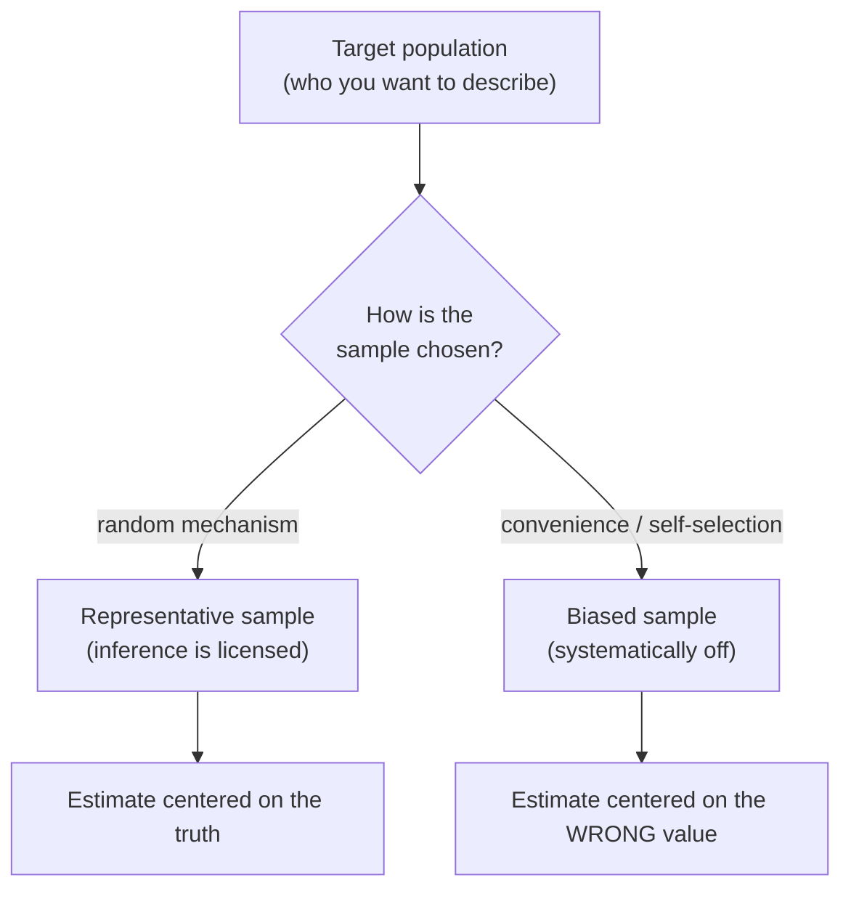
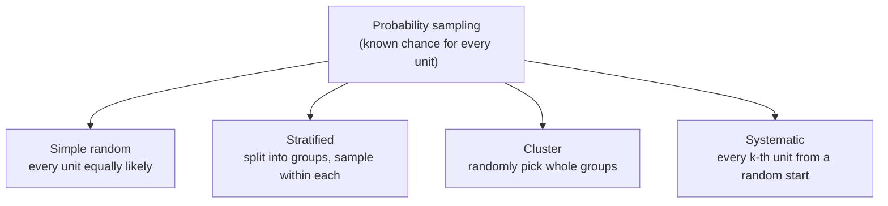
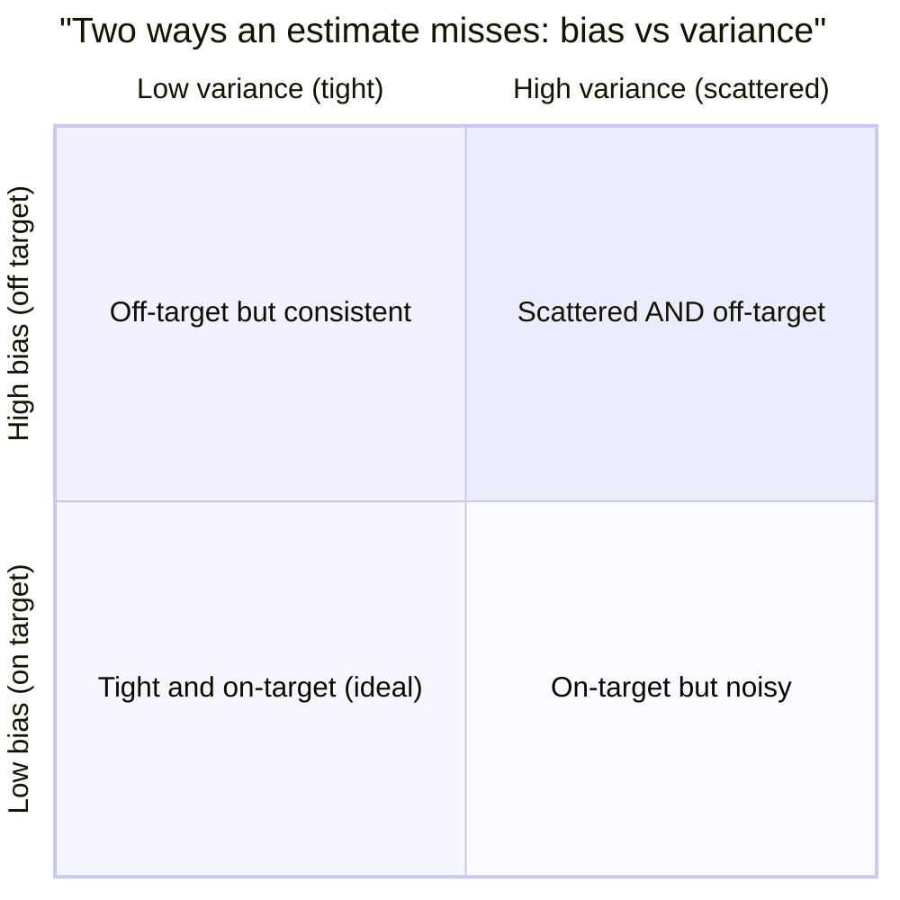
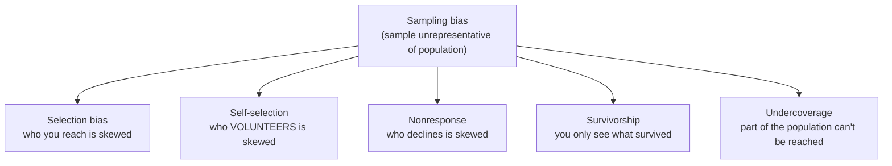
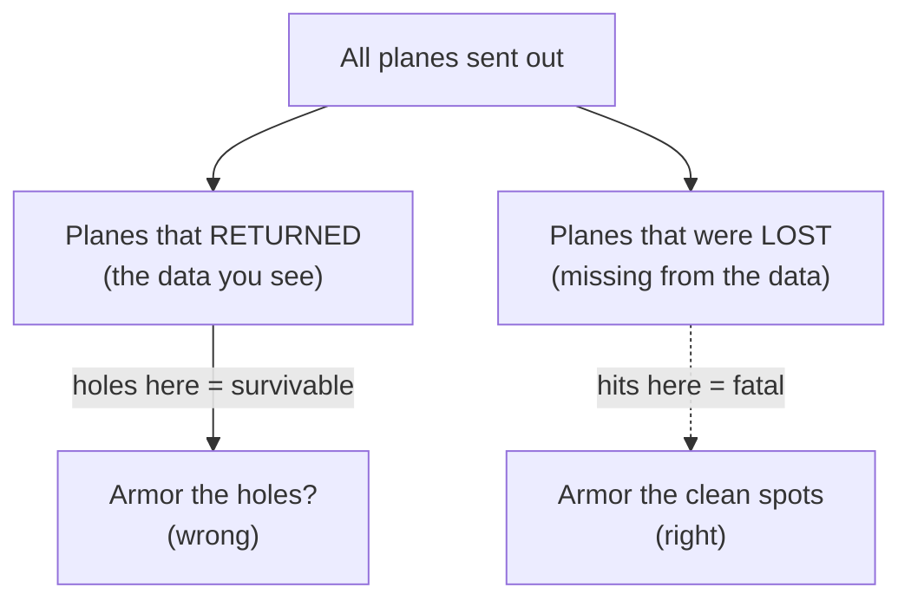

In *Populations and Samples* we drew samples with `rng.normal(...)` and
quietly assumed each one *represented* the population. This page is about
that assumption, the one that licenses everything else in the course.
**How you pick the sample decides whether your estimate is honest.** Pick
it well and a few thousand observations can speak for millions. Pick it
badly and a *million* observations can still point you confidently in the
wrong direction.

That last sentence is the whole point, and it surprises people: more data
does not rescue a badly chosen sample. A flawed sampling method bakes in
an error that *no amount of extra rows removes*. Learning to see that
error, and to choose samples that avoid it, is one of the highest-value
skills in applied statistics.

<Figure
  slug="stat-sampling-bias-cutout"
  alt="Two scoops drawing from a mixed bin, one reaching across the whole bin and one only skimming a single corner"
/>

## Why the sampling method is everything

Almost every method in this course assumes your sample is a *fair draw*
from the population. Confidence intervals, p-values, the central limit
theorem, all of them are statements about what happens when you sample
**randomly**. Randomness is not a nicety here; it is the mathematical
contract that connects the sample you have to the population you care
about.

When the sampling mechanism is random, the laws of probability take over
and let you say *how close* your estimate is to the truth. When it isn't
random, when the sample is chosen by convenience, by who volunteered, or
by who survived, those laws no longer apply, and your tidy confidence
interval is quietly measuring the wrong thing.

<Callout type="info" title="The word that does all the work: representative">
A sample is **representative** when its composition mirrors the
population's on the features that matter. Random sampling doesn't
*guarantee* a representative sample on any single draw, but it makes
representativeness the expected outcome and, crucially, lets you quantify
how far off you might be. That quantification is the entire game.
</Callout>

## Probability sampling methods

The good methods share one trait: **every unit has a known, nonzero
chance of being selected**, set by a random mechanism rather than by you,
the respondent, or circumstance. These are called *probability sampling*
methods. Here are the four you'll meet most.

- **Simple random sampling (SRS).** Every unit is equally likely, and
  every *subset* of size `n` is equally likely. This is the gold standard
  the math assumes. In code it's `rng.choice(population, size=n,
  replace=False)`.
- **Stratified sampling.** Split the population into non-overlapping
  groups (*strata*), say age bands or regions, then sample *within
  each* stratum, usually in proportion to its size. Because you guarantee
  every group is represented, stratification removes the risk of a random
  draw accidentally missing a subgroup, and it usually gives a *more
  precise* estimate than SRS.
- **Cluster sampling.** Split the population into many small groups
  (*clusters*), city blocks, schools, stores, then randomly pick whole
  clusters and measure *everyone* in the chosen ones. It's cheaper when
  units are geographically scattered, at the cost of some precision.
- **Systematic sampling.** Order the population, pick a random starting
  point, then take every `k`-th unit. Simple and often fine, but
  dangerous if the ordering has a hidden cycle that lines up with `k`.

<Callout type="tip" title="Stratified vs cluster, don't mix them up">
Both split the population into groups, but they do opposite things.
**Stratified**: sample *within every* group (you want all groups
represented) → more precise. **Cluster**: randomly choose *some* whole
groups and skip the rest (you want lower cost) → usually less precise.
Stratified divides to include; cluster divides to economize.
</Callout>

## The bad one: convenience sampling

**Convenience sampling** means taking whoever is easiest to reach: the
users who happened to be online, the customers who answered the phone,
the friends you texted. There's no random mechanism, so the chance of
being selected is unknown and unequal, and almost always *correlated
with the thing you're measuring*. That correlation is what turns "easy"
into "wrong."

This is the single most common sampling mistake in real data work,
precisely because convenience samples are so cheap. Web analytics,
opt-in surveys, app-store reviews, and "we asked our power users" studies
are all convenience samples wearing a data-science costume.

<CodeBlock
  adapter="python"
  files={[
    {
      filename: "main.py",
      starterCode: `import numpy as np

rng = np.random.default_rng(42)

# A known population: customer satisfaction scores (0-100).
# The TRUE population mean is what we're trying to estimate.
population = rng.normal(loc=70, scale=12, size=200_000).clip(0, 100)
true_mean = population.mean()

# --- A proper SIMPLE RANDOM SAMPLE of 500 ---
random_sample = rng.choice(population, size=500, replace=False)

# --- A CONVENIENCE SAMPLE of 500 ---
# Suppose the people easiest to reach are happier customers: we
# preferentially draw from the high-satisfaction end of the population.
weights = (population > 75).astype(float) + 0.1  # happy folks ~10x likelier
weights /= weights.sum()
convenience_sample = rng.choice(population, size=500, replace=False, p=weights)

print(f"TRUE population mean:        {true_mean:6.2f}")
print(f"Random sample mean:          {random_sample.mean():6.2f}   (close)")
print(f"Convenience sample mean:     {convenience_sample.mean():6.2f}   (too high)")
print()
print("The random sample lands near the truth.")
print("The convenience sample is systematically too optimistic.")
`,
    },
  ]}
/>

The random sample misses the truth by a little, that's ordinary sampling
*noise*, and it shrinks if you collect more. The convenience sample
misses by a lot *in a consistent direction*: it overstates satisfaction
because happy customers were overrepresented. That consistent,
directional miss is **bias**, and the next demo shows why you can't
outrun it.

## The punchline: a bigger biased sample does not help

Here is the idea that separates people who understand sampling from
people who don't. **Noise shrinks as `n` grows; bias does not.** If your
selection method is skewed, growing the sample just gives you a sharper,
more confident estimate of the *wrong* number.

<CodeBlock
  adapter="python"
  files={[
    {
      filename: "main.py",
      starterCode: `import numpy as np
import plotly.express as px

rng = np.random.default_rng(7)

population = rng.normal(70, 12, size=500_000).clip(0, 100)
true_mean = population.mean()

# Happy customers are far easier to reach -> convenience bias.
weights = (population > 75).astype(float) + 0.1
weights /= weights.sum()

sizes = [50, 200, 1_000, 5_000, 20_000, 100_000]
rows = []
for n in sizes:
    rand = rng.choice(population, size=n, replace=False).mean()
    conv = rng.choice(population, size=n, replace=False, p=weights).mean()
    rows.append({"n": n, "estimate": rand, "method": "random"})
    rows.append({"n": n, "estimate": conv, "method": "convenience"})

import pandas as pd

df = pd.DataFrame(rows)

fig = px.line(
    df,
    x="n",
    y="estimate",
    color="method",
    markers=True,
    log_x=True,
    title="More data fixes noise, not bias",
    labels={"n": "Sample size n (log scale)", "estimate": "Estimated mean"},
)
fig.add_hline(y=true_mean, line_dash="dash", annotation_text="true mean")
fig.show()

print(f"True mean: {true_mean:.2f}")
print("Random estimate converges TO the truth as n grows.")
print("Convenience estimate converges to a WRONG value and stays there.")
`,
    },
  ]}
/>

Watch the two lines. The random estimate homes in on the dashed truth
line as `n` grows. The convenience estimate also *stabilizes*, but on the
wrong value. At `n = 100,000` the biased estimate is rock-steady and
badly wrong. It looks precise; it is precisely misleading.

<Callout type="danger" title="Misconception: 'we have tons of data, so it must be accurate'">
Sample **size** controls *noise* (variance); sampling **method** controls
*bias*. A huge sample with a biased method is a high-confidence wrong
answer, arguably worse than a small honest one, because its size *feels*
authoritative. The famous 1936 *Literary Digest* poll mailed **2.4
million** responses and still called the U.S. presidential election
wrong, because its list (car and telephone owners during the Depression)
oversampled the wealthy. Size did not save it. Method sinks it.
</Callout>

## Bias vs. variance: the central distinction

Every estimate misses the truth in two fundamentally different ways, and
keeping them separate is one of the most important habits in statistics.

- **Bias** is a *systematic* miss, the estimate is centered on the wrong
  value. Averaging many biased samples does **not** converge to the truth.
  Bias comes from *how you sample* (or how you measure). **You cannot fix
  it with more data.**
- **Variance** is a *random* miss, the estimate scatters around its
  center from sample to sample. Variance comes from *finite sample size*.
  **You fix it with more data** (it shrinks like `1/√n`).

The classic picture is a dartboard: bias is *where the cluster of darts
is centered relative to the bullseye*; variance is *how spread out the
cluster is*.

The bottom-left is the dream: a tight cluster on the bullseye. More data
moves you *leftward* (less variance) but **cannot move you downward**
(less bias). Only a better sampling method does that. This is why "just
collect more data" is the right instinct for noise and the *wrong*
instinct for bias.

<CodeBlock
  adapter="python"
  files={[
    {
      filename: "main.py",
      starterCode: `import numpy as np

rng = np.random.default_rng(0)

population = rng.normal(70, 12, size=300_000).clip(0, 100)
true_mean = population.mean()

weights = (population > 75).astype(float) + 0.1
weights /= weights.sum()

# Repeat each sampling method MANY times to see its CENTER and SPREAD.
def repeat(method, n, reps=400):
    out = []
    for _ in range(reps):
        if method == "random":
            out.append(rng.choice(population, size=n, replace=False).mean())
        else:
            out.append(rng.choice(population, size=n, replace=False, p=weights).mean())
    return np.array(out)

for n in [200, 5000]:
    r = repeat("random", n)
    c = repeat("convenience", n)
    print(f"n = {n}")
    print(
        f"  random:      center={r.mean():.2f}  spread={r.std():.2f}  "
        f"bias={r.mean() - true_mean:+.2f}"
    )
    print(
        f"  convenience: center={c.mean():.2f}  spread={c.std():.2f}  "
        f"bias={c.mean() - true_mean:+.2f}"
    )
    print()

print(f"true mean = {true_mean:.2f}")
print("As n grows: SPREAD shrinks for both, but the convenience BIAS stays.")
`,
    },
  ]}
/>

Run it and compare the rows. Going from `n=200` to `n=5000` shrinks the
*spread* of both methods dramatically, that's variance falling. But the
convenience method's *bias* (its center minus the truth) barely budges.
Variance is a sample-size problem; bias is a method problem. They do not
trade off, and one will not fix the other.

<MultipleChoice
  markdown={`An online retailer estimates average customer satisfaction from an **opt-in pop-up survey** that 0.5% of visitors complete. They worry the estimate is too noisy, so they run the survey for a year and collect **800,000 responses**. What's the most likely outcome?

- The extra data makes the estimate worse than a small sample would be in every respect
  > The extra data genuinely reduces variance, so it's not worse in *every* respect, it's just that the dominant error (bias) is untouched, so the precision is misleading.
- The estimate is both unbiased and precise, since a full year covers all customer types
  > Running longer collects more *opt-in* responses, not a representative cross-section. Duration doesn't convert a self-selected sample into a random one.
- The estimate is now accurate because 800,000 is an enormous sample
  > A large sample shrinks *variance*, but opt-in surveys suffer *self-selection bias*: people with strong opinions respond more. That bias is unaffected by sample size.
- [o] The estimate is now very precise but still systematically biased, because opt-in respondents differ from typical customers
  > The large $n$ pins down the mean of *responders*, who are not representative of all customers; precision rose while the bias stayed, giving a confidently wrong number.

The fix for self-selection bias is a better sampling mechanism, not a bigger self-selected sample.`}
/>

## A field guide to sampling bias

Bias has named patterns, and recognizing them by name is half the battle.
All of them break the "every unit has a known, fair chance" contract in
some specific way.

- **Selection bias.** The sampling frame itself favors some units. A phone
  survey at 2pm on a weekday oversamples people who are home at 2pm.
- **Self-selection bias.** Participants choose themselves in. Online polls,
  product reviews, and "click here to rate us" all capture people with
  *unusually strong* opinions, not typical ones.
- **Nonresponse bias.** You sampled fairly, but the people who *decline*
  differ systematically from those who answer. If busy or dissatisfied
  customers skip your survey, your responders skew toward the content and
  available.
- **Survivorship bias.** You only observe the units that "made it,"
  silently dropping the ones that failed. This one is so important and so
  sneaky it gets its own section.
- **Undercoverage.** Part of the population has *no chance* of being
  sampled at all, e.g., a web-only survey excludes everyone offline.

<Callout type="warn" title="Misconception: 'random' means 'haphazard' or 'whatever's handy'">
In everyday speech "random" means casual or arbitrary, *"I grabbed a
random sample of reviews."* In statistics, **random sampling is the
opposite of haphazard**: it requires a deliberate chance mechanism (a
random number generator, a lottery, `rng.choice`) where each unit's
probability of selection is *known and controlled*. Grabbing whatever's
convenient is precisely *not* random, it's a convenience sample, the
thing that produces bias.
</Callout>

## Survivorship bias: the most famous trap

In World War II, the statistician Abraham Wald was asked where to add
armor to bombers. The military had data on returning planes and mapped
where they were riddled with bullet holes, concentrated on the wings and
fuselage. The obvious move: armor the spots with the most holes.

Wald saw the trap. The data came *only from planes that returned*. The
planes hit in the engines and cockpit weren't in the dataset, they
**didn't come back**. The holes showed where a plane could be hit and
*survive*. The armor belonged on the *undamaged* areas, the places that,
when hit, were fatal.

Survivorship bias is everywhere in business data. Mutual-fund
performance tables look fantastic partly because funds that did badly get
*closed and removed* from the database, you're seeing only the
survivors. "Successful founders dropped out of college" ignores the vast
graveyard of dropouts whose startups failed and who were never
interviewed. Any time your dataset is "the ones still here," ask what the
*absent* ones would have told you.

<CodeBlock
  adapter="python"
  files={[
    {
      filename: "main.py",
      starterCode: `import numpy as np

rng = np.random.default_rng(3)

# 5000 mutual funds. True average annual return across ALL of them:
returns = rng.normal(loc=6.0, scale=8.0, size=5000)  # percent
true_avg = returns.mean()

# Reality: funds with poor returns get shut down and vanish from the database.
# Suppose any fund returning below -4% this period is closed and delisted.
survivors = returns[returns > -4.0]
survivor_avg = survivors.mean()

print(f"True average across ALL 5000 funds:        {true_avg:5.2f}%")
print(f"Average across SURVIVING funds only:        {survivor_avg:5.2f}%")
print(
    f"Survivorship inflation:                     {survivor_avg - true_avg:+.2f} points"
)
print()
print(f"Funds that 'disappeared' from the data: {5000 - len(survivors)}")
print("The database looks better than reality because the losers are gone.")
`,
    },
  ]}
/>

The survivors' average is inflated not because the funds got better, but
because the bad ones were *deleted from the dataset*. No statistical test
on the surviving funds can recover the truth, the missing data is missing
in a *systematic*, outcome-dependent way. Survivorship bias is a missing
data problem disguised as a sampling problem.

<MultipleChoice
  markdown={`A fitness app reports that users who've been active for **2+ years** lost an average of 18 pounds. The marketing team wants to claim "our app helps people lose 18 pounds." What's the core problem?

- Nothing, long-term users are the most reliable evidence of effectiveness
  > Long-term users are exactly the ones for whom the app *worked*; people who saw no results tend to quit. Looking only at them is survivorship bias.
- [o] It's survivorship bias: people for whom the app didn't work mostly quit, so the surviving long-term users overstate the typical effect
  > Restricting to people who *stuck around* selects for success and silently drops the dropouts, inflating the apparent benefit relative to a typical new user.
- The 18-pound figure must be a measurement error
  > The number can be perfectly measured among survivors and still mislead, because the survivors are a non-representative slice, the bias is in *who's counted*, not in the measurement.
- The sample is too small to generalize
  > The issue isn't size. Even with millions of 2-year users, conditioning on "still active" filters out everyone the app didn't help.

To estimate the app's typical effect, you'd need everyone who started, including the people who left.`}
/>

## Designing the sample: practice

The first challenge makes the bias-vs-noise point quantitatively: you'll
*measure* how much a convenience method is systematically off. The second
implements stratified sampling and checks that it estimates the true mean.

<ChallengeCard
  adapter="python"
  title="Quantify the systematic error of a convenience sample"
  instructions={`A known \`population\` of 200,000 satisfaction scores has been created, with its true mean in \`true_mean\`. Two sampling schemes are available:

- a **simple random sample**, and
- a **convenience sample** that oversamples high scorers (weights \`conv_weights\` are provided).

To separate *bias* from *noise*, draw **each** method **300 times** at sample size \`n = 800\`, recording the mean of every sample. Then compute a dict named \`result\` with:

- \`"random_bias"\`, (mean of the 300 random-sample means) minus \`true_mean\` (a float)
- \`"conv_bias"\`, (mean of the 300 convenience-sample means) minus \`true_mean\` (a float)

Use the provided \`rng\` for all draws. Both values must be plain Python floats. The convenience bias should be clearly positive (the method systematically overestimates); the random bias should be near zero.`}
  files={[
    {
      filename: "main.py",
      initCode: `import numpy as np
rng = np.random.default_rng(2024)

population = rng.normal(70, 12, size=200_000).clip(0, 100)
true_mean = float(population.mean())

# Convenience scheme: high scorers (>75) are ~10x more likely to be sampled.
conv_weights = (population > 75).astype(float) + 0.1
conv_weights /= conv_weights.sum()`,
      starterCode: `# TODO: draw each method 300 times at n=800, record sample means,
# then compute the bias of each method's average estimate.
n = 800
reps = 300

result = {
    "random_bias": None,
    "conv_bias": None,
}
`,
      solutionCode: `n = 800
reps = 300

random_means = np.array(
    [rng.choice(population, size=n, replace=False).mean() for _ in range(reps)]
)
conv_means = np.array(
    [
        rng.choice(population, size=n, replace=False, p=conv_weights).mean()
        for _ in range(reps)
    ]
)

result = {
    "random_bias": float(random_means.mean() - true_mean),
    "conv_bias": float(conv_means.mean() - true_mean),
}
print(result)
`,
    },
  ]}
  tests={[
    {
      id: "keys",
      name: "result has the right keys",
      description: "Dict contains random_bias and conv_bias",
      code: `assert set(result.keys()) == {"random_bias", "conv_bias"}`,
    },
    {
      id: "floats",
      name: "both values are floats",
      description: "Each bias is a plain float",
      code: `assert all(isinstance(result[k], float) for k in ("random_bias", "conv_bias"))`,
    },
    {
      id: "random_unbiased",
      name: "random sampling is approximately unbiased",
      description: "Random bias is close to zero",
      code: `assert abs(result["random_bias"]) < 0.6`,
    },
    {
      id: "conv_biased",
      name: "convenience sampling is systematically high",
      description: "Convenience bias is clearly positive",
      code: `assert result["conv_bias"] > 2.0`,
    },
    {
      id: "ordering",
      name: "convenience bias exceeds random bias",
      description: "The biased method misses by much more",
      code: `assert result["conv_bias"] > abs(result["random_bias"]) + 1.0`,
    },
  ]}
/>

<ChallengeCard
  adapter="python"
  title="Estimate a mean with proportional stratified sampling"
  instructions={`A company has three regions of very different sizes and very different average spend. A DataFrame \`pop\` (columns \`region\` and \`spend\`) holds the **entire population**, and \`true_mean\` is the true overall average spend.

Implement **proportional stratified sampling** to estimate the overall mean with a total budget of \`total_n = 600\` observations:

1. For each region, sample a number of rows **proportional to that region's share of the population** (use \`round\` and the provided \`rng.choice\` on the region's row indices, \`replace=False\`).
2. The proportional stratified estimate of the overall mean is simply the **mean of all the sampled \`spend\` values pooled together** (because the per-stratum sample sizes already mirror the population shares).

Produce:

- \`strat_estimate\`, the pooled mean spend of your stratified sample (a float).
- \`abs_error\`, \`abs(strat_estimate - true_mean)\` (a float).

The estimate should land close to \`true_mean\` (within about 30).`}
  files={[
    {
      filename: "main.py",
      initCode: `import numpy as np
import pandas as pd
rng = np.random.default_rng(11)

# Three regions: very different sizes AND very different mean spend.
specs = {"North": (60_000, 120, 25),
         "South": (30_000, 200, 30),
         "West":  (10_000, 320, 40)}
frames = []
for name, (size, mu, sd) in specs.items():
    frames.append(pd.DataFrame({
        "region": name,
        "spend": rng.normal(mu, sd, size).clip(0, None),
    }))
pop = pd.concat(frames, ignore_index=True)
true_mean = float(pop["spend"].mean())
total_n = 600`,
      starterCode: `# TODO: proportional stratified sampling, pooled estimate, and error.
# Hint: for each region, n_region = round(total_n * region_share);
# sample that many rows without replacement, collect their spend values.
sampled_spend = []

# ... fill sampled_spend ...

strat_estimate = None
abs_error = None
`,
      solutionCode: `sampled_spend = []
N = len(pop)
for name, grp in pop.groupby("region"):
    share = len(grp) / N
    n_region = int(round(total_n * share))
    idx = rng.choice(grp.index.to_numpy(), size=n_region, replace=False)
    sampled_spend.extend(pop.loc[idx, "spend"].tolist())

strat_estimate = float(np.mean(sampled_spend))
abs_error = float(abs(strat_estimate - true_mean))
print(
    f"stratified estimate = {strat_estimate:.2f}, true = {true_mean:.2f}, "
    f"abs error = {abs_error:.2f}"
)
`,
    },
  ]}
  tests={[
    {
      id: "types",
      name: "estimate and error are floats",
      description: "Both outputs are plain floats",
      code: `assert isinstance(strat_estimate, float) and isinstance(abs_error, float)`,
    },
    {
      id: "size",
      name: "sampled roughly the budget",
      description: "Total sampled size is near total_n",
      code: `assert 590 <= len(sampled_spend) <= 610`,
    },
    {
      id: "accurate",
      name: "estimate is close to the truth",
      description: "Stratified estimate is within ~30 of the true mean",
      code: `assert abs_error < 30.0`,
    },
    {
      id: "error_consistent",
      name: "abs_error matches the estimate",
      description: "Error equals |estimate - true_mean|",
      code: `assert abs(abs_error - abs(strat_estimate - true_mean)) < 1e-9`,
    },
  ]}
/>

<Callout type="tip" title="Why stratified sampling shines here">
The three regions have very different mean spend (120 vs 200 vs 320). A
*simple* random sample could, by bad luck, grab too few high-spending West
customers and skew low. Proportional stratification **guarantees** each
region appears in its correct proportion, eliminating that source of
variability. Same honesty as SRS, usually better precision, which is why
pollsters and survey teams stratify by design.
</Callout>

## When sampling design matters most

- **It matters enormously** for surveys, polls, user research, A/B test
  enrollment, and any time your data is collected by *who shows up*. These
  are exactly the situations where self-selection and nonresponse creep
  in.
- **It's subtler but still critical** for "found" data, server logs, CRM
  exports, scraped data. Ask: *who or what is missing from this table, and
  is their absence related to what I'm measuring?* (That question catches
  survivorship and undercoverage.)
- **It matters less** when you genuinely observe the whole population (a
  true census), but then ask whether your "population" is really the one
  you care about, or just the slice your systems happen to log.

<Callout type="danger" title="The two-sentence summary of this page">
**Variance is a sample-size problem you fix with more data. Bias is a
sampling-method problem you cannot fix with any amount of data.** When an
estimate feels off, your first question shouldn't be "do I have enough
rows?", it should be "*how was this sample selected, and who's missing?*"
</Callout>

## Check your understanding

<MultipleChoice
  markdown={`Which scenario describes **bias** rather than **variance**?

- A poll of 50 random voters gives a wide margin of error
  > A wide margin from a small *random* sample is variance, it shrinks as you add more randomly chosen voters. The estimate is still centered on the truth.
- A sample mean happens to fall a bit above the population mean this time
  > A single draw landing above the truth is ordinary random variation (variance). It would land below just as easily on another draw.
- Two random samples from the same population give slightly different means
  > Sample-to-sample fluctuation around the true value is the definition of variance, not bias. Neither estimate is systematically off.
- [o] An opt-in web survey consistently overestimates customer satisfaction no matter how many responses come in
  > A consistent miss in one direction that doesn't disappear with more data is bias, caused here by self-selection in the sampling method.

Bias is a *systematic, directional* error tied to method; variance is *random scatter* tied to sample size.`}
/>

<MultipleChoice
  markdown={`A data scientist says: "Our sample of 5 million log events is so large that it's basically the whole population, so there's no sampling concern." When is this reasoning **most dangerous**?

- When the events were collected over a full calendar year
  > A full year is generally a *plus* for coverage. The danger is non-representativeness of *who/what* generates the events, not the time span.
- [o] When the 5 million events come only from a non-representative subgroup (e.g., only logged-in power users)
  > Size hides the real risk: if the events are a biased slice, the huge $n$ produces a precise estimate of the wrong population. Volume doesn't fix selection bias.
- When the 5 million events are a true random draw from all events
  > A genuine random draw of 5 million is both large *and* unbiased, exactly the safe case. The reasoning isn't dangerous here.
- When all events are identical
  > If events were identical there'd be no variability to worry about at all, so the reasoning, while odd, wouldn't mislead.

"Big data" removes variance, not bias, a non-representative billion is still non-representative.`}
/>

<MultipleChoice
  markdown={`You want to estimate average household income in a country with distinct regions of differing wealth, and you want to *guarantee* every region is represented in proportion to its population. Which method fits best?

- Systematic sampling from an alphabetical list of surnames
  > Systematic sampling can work but doesn't *guarantee* proportional regional representation, and surname ordering may hide cultural or regional cycles.
- Convenience sampling at the busiest train station
  > A single location oversamples commuters from nearby (likely wealthier) areas and guarantees no representation, the opposite of what's wanted.
- Cluster sampling that randomly keeps only 2 of the regions
  > Cluster sampling would *drop* most regions entirely, which directly violates the requirement that every region be represented.
- [o] Stratified sampling with regions as strata, sampling each in proportion to its size
  > Defining regions as strata and sampling each proportionally guarantees representation and typically improves precision over a simple random sample.

When you must ensure subgroups appear in their true proportions, stratify on those subgroups.`}
/>

<MultipleChoice
  markdown={`An investor looks at a database of currently-listed mutual funds, sees an average historical return of 9%, and concludes the typical fund returns 9%. What bias is at play, and can a larger database fix it?

- Nonresponse bias, fixable by following up with fund managers
  > Funds aren't *declining to respond*; the poor performers were closed and removed. That's survivorship, not nonresponse, and following up can't resurrect delisted funds.
- Pure variance, fixable by averaging over more years
  > This is a systematic, directional inflation from missing failures, not random scatter. Averaging more years of *survivor* data won't remove it.
- [o] Survivorship bias, and a larger database of surviving funds cannot fix it because the failed funds are systematically absent
  > The database only contains funds that lasted; the underperformers were delisted, so the missing data is outcome-dependent and no quantity of survivors recovers it.
- Selection bias, fixable by sampling more current funds
  > More *current* funds repeats the same filter, they're all survivors. Adding survivors can't represent the funds that already vanished.

Survivorship bias is missing data tied to the outcome, more of the same survivors won't undo it.`}
/>

<MultipleChoice
  markdown={`Why does **random** sampling (a deliberate chance mechanism) license statistical inference, while **haphazard** convenience sampling does not?

- [o] Because a known random mechanism gives every unit a known selection probability, which is what the math of inference (margins of error, p-values) is built on
  > Inference theory assumes selection probabilities are known and unrelated to the measured outcome; a random mechanism provides exactly that, so the resulting error formulas are valid.
- Because random samples never contain bias of any kind
  > Random sampling controls *selection* bias, but other biases (e.g., a badly worded question, or nonresponse) can still intrude. Its key virtue is the known selection probability.
- Because convenience samples always contain measurement errors
  > Convenience samples can be measured perfectly accurately and still mislead; the problem is *who's in them*, not how the values were recorded.
- Because random samples are always larger than convenience samples
  > Size isn't the distinction, a convenience sample can be huge and a random sample small. The difference is the *mechanism* of selection, not its size.

The chance mechanism, not effort or size, is what connects the sample to the population mathematically.`}
/>

<Callout type="success" title="Key takeaways">
- **How you sample** decides whether inference is honest; the math assumes a random mechanism.
- **Probability methods** (simple random, stratified, cluster, systematic) give every unit a known selection chance. **Convenience sampling** does not, and usually introduces bias.
- **Bias** is a systematic, directional miss from *method*, it does **not** shrink with more data. **Variance** is random scatter from *sample size*, it **does** shrink (like `1/√n`).
- Classic biases: **selection**, **self-selection**, **nonresponse**, **survivorship**, **undercoverage**. Always ask *who is missing*.
- A bigger biased sample is a *more confident wrong answer*. "Random" means a deliberate chance mechanism, never "haphazard."
</Callout>

With an honest sample in hand, we can finally study how a *statistic*
behaves across many such samples. That's *Sampling Distributions*, the
single most important idea in the course, and the bridge to the *Central
Limit Theorem*, *Standard Error*, and *Confidence Intervals*.
