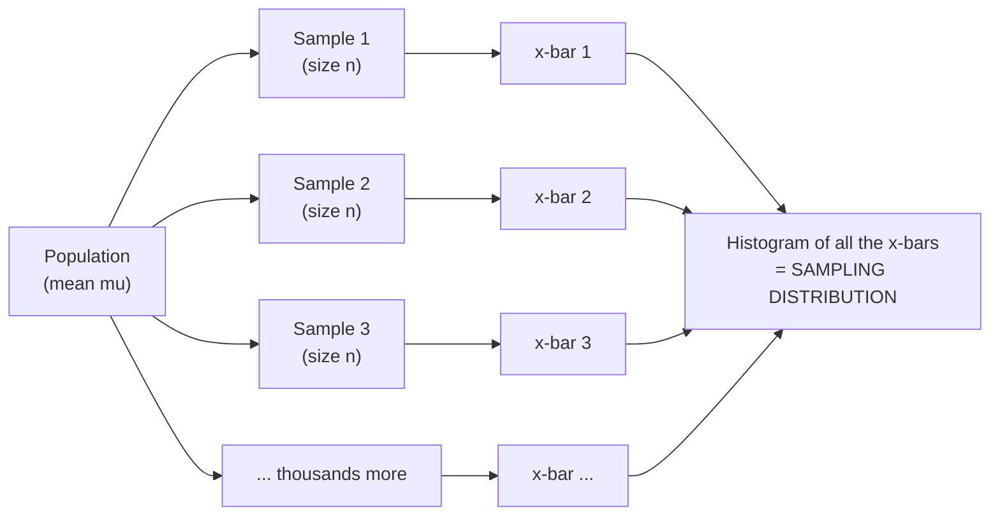

If there is one idea to truly *get* in this entire course, it is this
one. Every confidence interval you'll ever build, every p-value you'll
ever interpret, every "margin of error" you'll ever quote rests on a
single concept: the **sampling distribution**, the distribution of a
*statistic* (like x̄) computed over *many repeated samples*.

It is also the most confused idea in statistics, because three different
distributions are floating around at once, and they look superficially
alike. Students collapse them constantly, and almost every deep confusion
about inference traces back to that collapse. So we're going to slow
down, name all three, and build the third one with our own hands in code
until it's concrete.

<Figure
  slug="stat-sampling-distributions-cutout"
  alt="Three stacked platforms, a wide population mound, one small sample mound, and a narrow mound of repeated averages on top"
/>

## The three distributions you must keep separate

Here are the three. Read them slowly, the differences are the whole
lesson.

| Distribution | What spreads | Key fact |
| --- | --- | --- |
| (a) Population | raw values across the whole population | Fixed, with mean μ and sd σ. Usually unknown. |
| (b) One sample | raw values in the `n` points you collected | A noisy snapshot of (a); looks more like (a) as `n` grows. |
| (c) Sampling distribution of a statistic | a statistic (e.g. x̄) across many samples of size `n` | Centered near μ but much narrower. This is what inference uses. |

1. **The population distribution** is the spread of the raw values across
   the *entire population*: every customer's spend, every part's
   diameter. It has a mean μ and standard deviation σ. It is
   fixed and usually unknown.
2. **The distribution of one sample** is the spread of the raw values in
   the `n` data points you actually collected. It's a noisy snapshot of
   the population distribution, same general shape, and it looks *more
   like* the population as `n` grows. This is what a histogram of your
   DataFrame shows.
3. **The sampling distribution of a statistic** is something else
   entirely. It is the distribution of *a single summary number*, say
   the sample mean x̄, computed over **many different samples**,
   each of size `n`. It does **not** describe raw data at all. It
   describes how your *estimate* bounces around from sample to sample.

<Callout type="danger" title="The confusion that breaks everything">
(a) and (b) describe **individual data values**. (c) describes a
**statistic**, one number per sample. A histogram of your 200 data
points is **(b)**, not (c). To see (c), you'd have to collect 200 data
points, compute their mean, then do that *again and again*, and histogram
the resulting *means*. (b) and (c) have totally different widths: (c) is
always tighter, because averaging cancels out noise. Mixing them up is
the root of most misread confidence intervals.
</Callout>

## Building the sampling distribution by hand

In real life you collect *one* sample, compute *one* mean, and stop, you
never see the sampling distribution directly. But in code we can do the
impossible: draw thousands of samples from a known population and watch
the sampling distribution materialize. This single simulation is the
mental model to keep forever.

<Figure
  slug="stat-sampling-distributions-inline-cutout"
  alt="Many small scoops taken from one bin, each scoop's summary block set on a rail that builds into a narrow mound"
  caption="Take many samples and their summaries form a distribution of their own."
/>

<CodeBlock
  adapter="python"
  files={[
    {
      filename: "main.py",
      starterCode: `import numpy as np
import plotly.express as px

rng = np.random.default_rng(42)

# A known population of customer spend (right-ish, but shape doesn't matter here).
MU, SIGMA = 50.0, 18.0
population = rng.normal(MU, SIGMA, size=1_000_000)

n = 40  # size of EACH sample
n_samples = 5000  # how many samples we draw

# Draw n_samples samples of size n, recording the MEAN of each one.
means = np.array(
    [rng.choice(population, size=n, replace=False).mean() for _ in range(n_samples)]
)

fig = px.histogram(
    means,
    nbins=50,
    title=f"Sampling distribution of x-bar  (n={n}, {n_samples} samples)",
    labels={"value": "Sample mean (x-bar)"},
    template="simple_white",
)
fig.add_vline(x=MU, line_dash="dash", annotation_text="true mu = 50")
fig.show()

print(f"Population mean mu               = {MU:.2f}")
print(f"Mean of the {n_samples} sample means    = {means.mean():.2f}   (centers on mu)")
print(f"Population sd sigma              = {SIGMA:.2f}")
print(
    f"SD of the sample means          = {means.std():.2f}   (MUCH smaller than sigma)"
)
`,
    },
  ]}
/>

Two facts jump out, and they are the two pillars of inference:

<Chart slug="sampling-distribution-build" />

- **The sampling distribution is centered on μ.** The mean of all the
  sample means lands right on the population mean. The sample mean is
  *unbiased*, aimed at the truth.
- **The sampling distribution is much narrower than the population.** Its
  spread (here ~3) is far smaller than σ (here 18). Averaging `n`
  values cancels out a lot of individual noise, so the *estimate* is much
  more stable than any single data point.

That second spread, the standard deviation of the sampling distribution,
is so important it gets its own name, the **standard error**, and its
own page (*Standard Error*).

## Comparing the three side by side

Let's put all three distributions on screen at once so the difference in
*width* is impossible to miss. Same population, same `n`, but three
fundamentally different things.

<Figure
  slug="stat-sampling-distributions-three-distributions-must-inline-cutout"
  alt="Three mounds on separate shelves, one of the whole bin, one of a single scoop, and one built from many scoops' averages"
  caption="Population, sample, and sampling distribution are three different widths."
/>

<CodeBlock
  adapter="python"
  files={[
    {
      filename: "main.py",
      starterCode: `import numpy as np
import pandas as pd
import plotly.express as px

rng = np.random.default_rng(0)

MU, SIGMA = 50.0, 18.0
population = rng.normal(MU, SIGMA, size=1_000_000)
n = 40

# (a) the population itself (a big sample of it, to visualize its shape)
pop_vals = rng.choice(population, size=5000, replace=False)

# (b) ONE sample of size n: its raw values
one_sample = rng.choice(population, size=n, replace=False)

# (c) the sampling distribution of x-bar: many samples, each summarized by its mean
many_means = np.array(
    [rng.choice(population, size=n, replace=False).mean() for _ in range(5000)]
)

df = pd.concat(
    [
        pd.DataFrame({"value": pop_vals, "what": "(a) population: raw values"}),
        pd.DataFrame({"value": one_sample, "what": "(b) one sample: raw values"}),
        pd.DataFrame({"value": many_means, "what": "(c) sampling dist: x-bar"}),
    ]
)

fig = px.histogram(
    df,
    x="value",
    facet_row="what",
    nbins=50,
    height=650,
    title="Three different distributions on the same axis",
    template="simple_white",
)
fig.add_vline(x=MU, line_dash="dash")
fig.show()

print(f"(a) population raw values   -> sd = {pop_vals.std():5.2f}")
print(
    f"(b) one sample raw values   -> sd = {one_sample.std():5.2f}  (~ matches population)"
)
print(f"(c) sampling dist of x-bar  -> sd = {many_means.std():5.2f}  (FAR narrower)")
`,
    },
  ]}
/>

Look at the widths. (a) and (b) are roughly the *same* width, because
(b) is just a small, noisy sample of (a), so its raw values spread out
about as much as the population's. But (c) is *dramatically* narrower,
hugging μ. The raw data spreads over tens of units; the *mean*
barely moves. That gap in width is the entire reason a sample of 40 can
estimate a population mean precisely even when individual values are all
over the place.

<MultipleChoice
  markdown={`You collect one sample of \`n = 100\` reaction times and make a histogram of those 100 values. It's right-skewed with a long tail. Which distribution have you just drawn?

- The standard error distribution
  > "Standard error" is a single number (the sd of the sampling distribution), not a distribution of raw data values. A histogram of 100 raw times isn't this.
- The sampling distribution of the mean
  > The sampling distribution of the mean is a histogram of many *sample means*, not of raw values. A histogram of your 100 data points shows raw values, so it's not this.
- [o] The distribution of one sample (a noisy snapshot of the population distribution)
  > Plotting the raw values of a single collected sample shows distribution (b): it mirrors the population's shape, complete with the skew and tail.
- The population distribution exactly
  > It *resembles* the population distribution but isn't exactly it, it's a finite, noisy sample. With only 100 points it will differ from the true population shape by chance.

A histogram of your collected data points is *one sample*, distribution (b), no matter how many points it has.`}
/>

## Watch the spread shrink as n grows

The center of the sampling distribution doesn't move with `n`, it sits
on μ regardless. What changes is the **spread**: bigger samples
produce sample means that cluster more tightly around μ. Let's vary
`n` and overlay the sampling distributions.

<CodeBlock
  adapter="python"
  files={[
    {
      filename: "main.py",
      starterCode: `import numpy as np
import pandas as pd
import plotly.express as px

rng = np.random.default_rng(7)

MU, SIGMA = 50.0, 18.0
population = rng.normal(MU, SIGMA, size=1_000_000)

rows = []
for n in [5, 20, 80, 320]:
    means = np.array(
        [rng.choice(population, size=n, replace=False).mean() for _ in range(4000)]
    )
    for m in means:
        rows.append({"x_bar": m, "n": f"n = {n}"})
    print(f"n = {n:4d}  ->  SD of x-bar = {means.std():.2f}")

df = pd.DataFrame(rows)
fig = px.histogram(
    df,
    x="x_bar",
    color="n",
    barmode="overlay",
    nbins=70,
    opacity=0.6,
    title="Bigger n -> narrower sampling distribution (same center)",
    labels={"x_bar": "Sample mean (x-bar)"},
    template="simple_white",
)
fig.add_vline(x=MU, line_dash="dash", annotation_text="mu = 50")
fig.show()

print()
print("All four pile up on mu = 50. Larger n -> tighter pile.")
print("Notice: SD roughly HALVES when n goes up 4x (5->20, 20->80, 80->320).")
`,
    },
  ]}
/>

Two things to internalize. First, **every** curve is centered on 50,
more data doesn't move the target, it sharpens your aim at it. Second,
look at the printed standard deviations: each time $n$ quadruples
(5→20→80→320), the spread roughly *halves*. That's the $1/\sqrt{n}$ law
peeking through; it's the protagonist of *Standard Error*.

<Callout type="warn" title="Misconception: a wide sample means a wide sampling distribution">
The spread of the **sampling distribution** has very little to do with
how spread out any *one* sample looks. A single sample of skewed,
high-variance data still produces a *mean* that's quite stable across
repeats. People glance at one wide histogram of raw data and conclude
"my estimate must be very uncertain", but the estimate's uncertainty is
governed by $\sigma / \sqrt{n}$, which shrinks fast. Wide data, narrow
estimate.
</Callout>

## More samples vs. larger samples, a crucial difference

Here's a subtle trap. There are two "more" levers in the simulation: the
number of samples we draw (`n_samples`) and the size of each sample
(`n`). They do completely different things, and confusing them is a
classic error.

- Drawing **more samples** just renders the sampling distribution more
  smoothly. It does **not** make the sampling distribution narrower, and
  it does **not** improve any single real-world estimate. In real life you
  only ever get *one* sample anyway, the thousands of samples are a
  simulation device.
- Using a **larger sample size `n`** genuinely narrows the sampling
  distribution and makes each estimate more precise. This is the lever
  that actually buys you precision.

<CodeBlock
  adapter="python"
  files={[
    {
      filename: "main.py",
      starterCode: `import numpy as np

rng = np.random.default_rng(1)
MU, SIGMA = 50.0, 18.0
population = rng.normal(MU, SIGMA, size=1_000_000)

def sd_of_means(n, n_samples):
    means = np.array(
        [rng.choice(population, size=n, replace=False).mean() for _ in range(n_samples)]
    )
    return means.std()

print("Lever 1: MORE SAMPLES (fix n=40, grow the number of samples)")
for k in [500, 2000, 8000, 32000]:
    print(f"  n=40, n_samples={k:6d}  ->  SD of x-bar = {sd_of_means(40, k):.2f}")
print("  -> SD barely changes. More samples only smooths the picture.\\n")

print("Lever 2: LARGER SAMPLE SIZE (fix n_samples=4000, grow n)")
for n in [10, 40, 160, 640]:
    print(f"  n={n:4d}, n_samples=4000  ->  SD of x-bar = {sd_of_means(n, 4000):.2f}")
print("  -> SD shrinks steadily. Larger n is what sharpens the estimate.")
`,
    },
  ]}
/>

The first block holds `n=40` and cranks the number of samples from 500 to
32,000, and the spread of the sampling distribution *barely moves*. The
second block holds the number of samples and grows `n`, and the spread
falls steadily. **Precision comes from bigger samples, not from more of
them.** In the real world you get one sample; its size is the lever you
actually control.

<MultipleChoice
  markdown={`In a simulation building a sampling distribution of the mean, a student wants their *real-world* estimate of $\\mu$ to be more precise. They consider two changes. Which one actually helps?

- Neither change affects precision; precision is fixed by the population
  > Precision is not fixed by the population alone, it depends on $n$ through $\\sigma/\\sqrt{n}$. A larger sample demonstrably tightens the estimate.
- Increase \`n_samples\` (draw 50,000 samples instead of 5,000)
  > Drawing more samples only renders the simulated sampling distribution more smoothly. It doesn't narrow it, and in real life you only ever collect one sample, so this changes nothing about real precision.
- [o] Increase \`n\` (make each sample 4x larger)
  > A larger sample size narrows the sampling distribution (its sd is $\\sigma/\\sqrt{n}$), so each individual estimate is more precise, the lever that genuinely improves real-world precision.
- Keep \`n\` the same but average the 5,000 sample means together
  > Averaging all 5,000 means is a simulation artifact you could never do with one real sample; it estimates $\\mu$ well only because you secretly collected $5000 \\times n$ data points.

The size of each sample drives precision; the number of samples is just how clearly you can *see* the sampling distribution in a simulation.`}
/>

## It works for any statistic, not just the mean

"Sampling distribution" is a general idea: *any* statistic you compute
from a sample has one. The median has a sampling distribution, the
maximum has a sampling distribution, the standard deviation has one, a
proportion has one. Whenever you summarize a sample into a number and
imagine repeating the sampling, you get a sampling distribution for that
number.

<CodeBlock
  adapter="python"
  files={[
    {
      filename: "main.py",
      starterCode: `import numpy as np
import pandas as pd
import plotly.express as px

rng = np.random.default_rng(5)

# A right-skewed population (incomes, say).
population = rng.gamma(shape=2.0, scale=20.0, size=1_000_000)
n = 60

rows = []
for stat_name, fn in [("mean", np.mean), ("median", np.median), ("max", np.max)]:
    vals = np.array(
        [fn(rng.choice(population, size=n, replace=False)) for _ in range(4000)]
    )
    for v in vals:
        rows.append({"value": v, "statistic": stat_name})
    print(f"{stat_name:>6}: center={vals.mean():7.2f}  spread(sd)={vals.std():6.2f}")

df = pd.DataFrame(rows)
fig = px.histogram(
    df,
    x="value",
    facet_col="statistic",
    nbins=50,
    facet_col_wrap=3,
    height=400,
    title=f"Each statistic has its OWN sampling distribution (n={n})",
    template="simple_white",
)
fig.update_xaxes(matches=None)
fig.show()

print()
print("Different statistics -> different centers, spreads, AND shapes.")
print("The max's sampling distribution is skewed and sits far from the mean's.")
`,
    },
  ]}
/>

Each statistic gets a different sampling distribution, with its own
center, spread, and even shape. The mean's and median's are roughly
bell-shaped; the maximum's is lopsided and lives way out in the right
tail. The key takeaway: *sampling distribution* is not a fact about the
mean specifically, it's a fact about **any** quantity you estimate from
a sample. That generality is what lets us attach uncertainty to medians,
proportions, regression slopes, and more.

<Callout type="info" title="Why this idea unlocks the whole course">
A confidence interval is just a range read off a sampling distribution. A
p-value is just a tail probability read off a sampling distribution
(computed *as if* a null hypothesis were true). A standard error is just
its standard deviation. Once you can picture "the distribution of my
statistic over repeated samples," the rest of inference is reading values
off that picture. We'll formalize the bell shape of the mean's version in
*The Central Limit Theorem*, turn its width into a standard error in
*Standard Error*, and turn that into a range in *Confidence Intervals*.
</Callout>

## Build one yourself

<ChallengeCard
  adapter="python"
  title="Build a sampling distribution of the mean"
  instructions={`A known \`population\` (1,000,000 values) has been created. Build the **sampling distribution of the mean** for sample size \`n = 50\` using \`n_samples = 3000\` repeated samples drawn with the provided \`rng\`.

1. Draw 3000 samples of size 50 (use \`rng.choice(population, size=n, replace=False)\`), computing the **mean** of each.
2. Store the 3000 means in a NumPy array named \`means\`.
3. Compute a dict \`summary\` with:
   - \`"center"\`, the mean of \`means\` (a float)
   - \`"spread"\`, the standard deviation of \`means\` (a float)

The \`center\` should land very close to the population mean (~50), and the \`spread\` should be far **smaller** than the population's own standard deviation (~12).`}
  files={[
    {
      filename: "main.py",
      initCode: `import numpy as np
rng = np.random.default_rng(321)

# Known population (you may inspect it, but build the sampling dist by sampling).
population = rng.normal(50, 12, size=1_000_000)
pop_sd = float(population.std())   # ~12, for your reference
n = 50
n_samples = 3000`,
      starterCode: `# TODO: build 'means' (array of 3000 sample means) and 'summary' dict.
means = None

summary = {
    "center": None,
    "spread": None,
}
`,
      solutionCode: `means = np.array(
    [rng.choice(population, size=n, replace=False).mean() for _ in range(n_samples)]
)

summary = {
    "center": float(means.mean()),
    "spread": float(means.std()),
}
print(summary, "  population sd =", round(pop_sd, 2))
`,
    },
  ]}
  tests={[
    {
      id: "means_shape",
      name: "means has 3000 values",
      description: "One mean per sample",
      code: `import numpy as np
assert isinstance(means, np.ndarray) and means.shape == (3000,)`,
    },
    {
      id: "summary_keys",
      name: "summary has center and spread",
      description: "Dict has the right keys",
      code: `assert set(summary.keys()) == {"center", "spread"}`,
    },
    {
      id: "center_near_mu",
      name: "center sits on the population mean",
      description: "Mean of sample means is ~50",
      code: `assert abs(summary["center"] - 50.0) < 1.0`,
    },
    {
      id: "spread_small",
      name: "spread is much smaller than the population sd",
      description: "Sampling distribution is far narrower than the data",
      code: `assert summary["spread"] < 3.0`,
    },
    {
      id: "spread_matches_means",
      name: "spread equals std of means",
      description: "Spread is the sd of the sample means",
      code: `import numpy as np
assert abs(summary["spread"] - float(np.std(means))) < 1e-9`,
    },
  ]}
/>

<ChallengeCard
  adapter="python"
  title="Show the spread shrink between two sample sizes"
  instructions={`Using the same known \`population\`, build the sampling distribution of the **mean** at **two** sample sizes, \`n_small = 25\` and \`n_big = 100\`, using \`n_samples = 2000\` samples each (with the provided \`rng\`).

Produce a dict \`result\` with:

- \`"sd_small"\`, sd of the 2000 sample means at \`n = 25\` (a float)
- \`"sd_big"\`, sd of the 2000 sample means at \`n = 100\` (a float)
- \`"ratio"\`, \`sd_small / sd_big\` (a float)

Because \`n_big\` is **4x** \`n_small\`, the spread should roughly **halve**, so \`ratio\` should be near 2 (the $\\sqrt{4}=2$ rule). Tests allow a generous window around 2.`}
  files={[
    {
      filename: "main.py",
      initCode: `import numpy as np
rng = np.random.default_rng(808)

population = rng.normal(100, 20, size=1_000_000)
n_small, n_big = 25, 100
n_samples = 2000`,
      starterCode: `# TODO: compute sd of sample means at each n, and their ratio.
result = {
    "sd_small": None,
    "sd_big": None,
    "ratio": None,
}
`,
      solutionCode: `def sd_of_means(n):
    means = np.array(
        [rng.choice(population, size=n, replace=False).mean() for _ in range(n_samples)]
    )
    return float(means.std())

sd_small = sd_of_means(n_small)
sd_big = sd_of_means(n_big)
result = {
    "sd_small": sd_small,
    "sd_big": sd_big,
    "ratio": sd_small / sd_big,
}
print(result)
`,
    },
  ]}
  tests={[
    {
      id: "keys",
      name: "result has the right keys",
      description: "Dict has sd_small, sd_big, ratio",
      code: `assert set(result.keys()) == {"sd_small", "sd_big", "ratio"}`,
    },
    {
      id: "floats",
      name: "all values are floats",
      description: "Each output is a plain float",
      code: `assert all(isinstance(result[k], float) for k in result)`,
    },
    {
      id: "big_tighter",
      name: "larger n gives a tighter sampling distribution",
      description: "sd_big is smaller than sd_small",
      code: `assert result["sd_big"] < result["sd_small"]`,
    },
    {
      id: "ratio_near_2",
      name: "spread roughly halves for 4x the data",
      description: "ratio is near 2 (the sqrt(4) rule)",
      code: `assert 1.6 < result["ratio"] < 2.5`,
    },
    {
      id: "ratio_consistent",
      name: "ratio matches the two sds",
      description: "ratio equals sd_small / sd_big",
      code: `assert abs(result["ratio"] - result["sd_small"] / result["sd_big"]) < 1e-9`,
    },
  ]}
/>

## Check your understanding

<MultipleChoice
  markdown={`In one sentence, what *is* a sampling distribution?

- The distribution you'd get by collecting one enormous sample
  > One enormous sample gives you a better picture of the *population* distribution, not a sampling distribution. The sampling distribution requires imagining *many* samples and one statistic each.
- [o] The distribution of a statistic (e.g., the mean) computed over many repeated samples of size n
  > Defining it as the spread of a *statistic* across many size-$n$ samples is exactly right and is what every margin of error and p-value is built on.
- The histogram of the raw values in the sample you collected
  > That's the distribution of *one sample*, a picture of raw data values. A sampling distribution is about a *statistic*, not raw values.
- The distribution of all the values in the population
  > That's the *population* distribution. A sampling distribution describes a computed statistic across repeated samples, not the population's raw values.

It's the distribution of an *estimate* across hypothetical repeated samples, the foundation of all inference.`}
/>

<MultipleChoice
  markdown={`Your population of incomes is heavily right-skewed with sd \`sigma = 30000\`. You take samples of \`n = 100\`. Compared to the population distribution, the **sampling distribution of the mean** will be:

- Identical to the distribution of one sample of 100 incomes
  > One sample of 100 incomes is raw data (~$\\sigma$ wide). The sampling distribution of the *mean* is the distribution of the *average* of such samples, about $\\sqrt{100}=10$ times narrower.
- About the same width (sd ≈ 30000) and same skew
  > The sampling distribution of the mean is far narrower than the population, averaging cancels noise. Its sd is roughly $\\sigma/\\sqrt{n} = 30000/10 = 3000$, not 30000.
- Wider than the population, because skew adds uncertainty
  > Averaging reduces, not increases, spread. The sampling distribution of the mean is always narrower than the population for $n>1$, regardless of skew.
- [o] Much narrower (sd ≈ 3000, i.e., $\\sigma/\\sqrt{n}$) and centered on the true mean
  > The mean's sampling distribution has spread $\\sigma/\\sqrt{n}$, here $30000/\\sqrt{100}=3000$, and sits on $\\mu$, far tighter than the raw-income spread.

The mean's sampling distribution is centered on $\\mu$ with spread $\\sigma/\\sqrt{n}$, much tighter than the raw data.`}
/>

<MultipleChoice
  markdown={`A teammate says: "I plotted my 500 data points and they're clearly not normal, so I can't trust the sample mean." What's the most accurate response?

- [o] The shape of the raw data (one sample) is a different thing from the sampling distribution of the mean, which is what governs the mean's reliability
  > Distinguishing the distribution of *raw values* from the sampling distribution of the *statistic* is the key point: the mean's reliability is about the latter, which is much narrower and (for large $n$) bell-shaped.
- They should normalize the data first so the mean becomes valid
  > Transforming raw data isn't required to estimate a mean. The mean's sampling distribution behaves well for reasonable $n$ even when the raw data is skewed.
- The sample mean is only valid if all 500 points are normal
  > Individual data points needn't be normal for the sample mean to be a good estimate. Confusing the raw-data shape with the estimate's behavior is the underlying error.
- They're right; non-normal data makes the sample mean untrustworthy
  > The trustworthiness of the *mean* depends on the *sampling distribution* of the mean, not on the shape of the raw data. Non-normal raw data is fine for estimating a mean.

Judging an estimate by the raw-data histogram confuses distribution (b) with distribution (c).`}
/>

<MultipleChoice
  markdown={`Which change makes the sampling distribution of the mean **narrower**?

- Choosing a statistic with a higher value, like the max instead of the mean
  > Switching statistics changes the sampling distribution's center and shape, but a "higher value" doesn't make it narrower, the max's sampling distribution is actually quite wide and skewed.
- Recentering the data to have mean zero
  > Shifting all values by a constant moves the center but leaves every spread unchanged. It doesn't narrow the sampling distribution.
- [o] Increasing the size n of each sample
  > The sampling distribution's spread is $\\sigma/\\sqrt{n}$, so a larger $n$ directly narrows it, this is the lever that improves estimate precision.
- Drawing 10x as many samples in your simulation
  > More simulated samples only render the sampling distribution more smoothly; its width is unchanged. (In real life you collect just one sample anyway.)

Only a larger sample size shrinks the spread of the sampling distribution.`}
/>

<MultipleChoice
  markdown={`Does the **median** have a sampling distribution?

- Only for samples larger than 30
  > There's no size threshold for *having* a sampling distribution. Any $n \\ge 1$ statistic has one; sample size affects its spread, not its existence.
- No; only the mean has a sampling distribution
  > Every statistic computed from a sample has a sampling distribution. The mean is just the most common example, not the only one.
- [o] Yes; any statistic computed from a sample (median, max, sd, proportion, …) has its own sampling distribution
  > Recognizing that the concept applies to *any* statistic, each with its own center, spread, and shape, is what lets us attach uncertainty to medians, proportions, slopes, and more.
- Only if the data is normally distributed
  > The existence of a sampling distribution doesn't depend on the data being normal. The median's sampling distribution exists for any population; its shape just varies.

"Sampling distribution" is a property of *any* statistic, not a special feature of the mean.`}
/>

<MultipleChoice
  markdown={`Why can a poll of 1,500 people report a small "margin of error" for an entire country?

- Because more people would not change the result at all
  > More people *would* tighten the estimate somewhat (precision $\\propto \\sqrt{n}$). The point is that even 1,500 already gives a narrow sampling distribution, not that $n$ is irrelevant.
- Because 1,500 is close to the size of the population
  > 1,500 is a tiny fraction of a national population; the precision doesn't come from covering most people. It comes from the narrowness of the sampling distribution.
- [o] Because the sampling distribution of the estimate is narrow (its spread is governed by $\\sigma/\\sqrt{n}$), so the estimate barely moves from sample to sample
  > The margin of error is read off the sampling distribution, whose spread scales as $1/\\sqrt{n}$ and is independent of how large the *population* is, so a modest $n$ already yields a tight estimate.
- Because everyone in the country answers roughly the same way
  > Respondents differ a lot; the population can be highly variable. The estimate is still precise because *averaging* a random sample yields a tight sampling distribution.

A small margin of error reflects a narrow *sampling distribution*, which depends on $n$, not on the population's size.`}
/>

<Callout type="success" title="Key takeaways">
- Keep three things separate: **(a)** the population distribution of raw values, **(b)** one sample's distribution of raw values, **(c)** the **sampling distribution** of a *statistic* over many samples.
- A histogram of your data is **(b)**, not (c). The sampling distribution describes an *estimate*, not raw data, and is **much narrower**.
- The sampling distribution of the mean is **centered on $\mu$** and has spread $\sigma / \sqrt{n}$, it tightens as $n$ grows.
- **Larger samples** sharpen the estimate; **more samples** only smooth the simulated picture (in real life you collect just one).
- *Every* statistic, mean, median, max, proportion, has its own sampling distribution. This single idea underlies standard errors, confidence intervals, and p-values.
</Callout>

We saw the mean's sampling distribution come out roughly bell-shaped even
when the population wasn't. That's not a coincidence, it's the **Central
Limit Theorem**, the engine of classical inference, and it's next.
