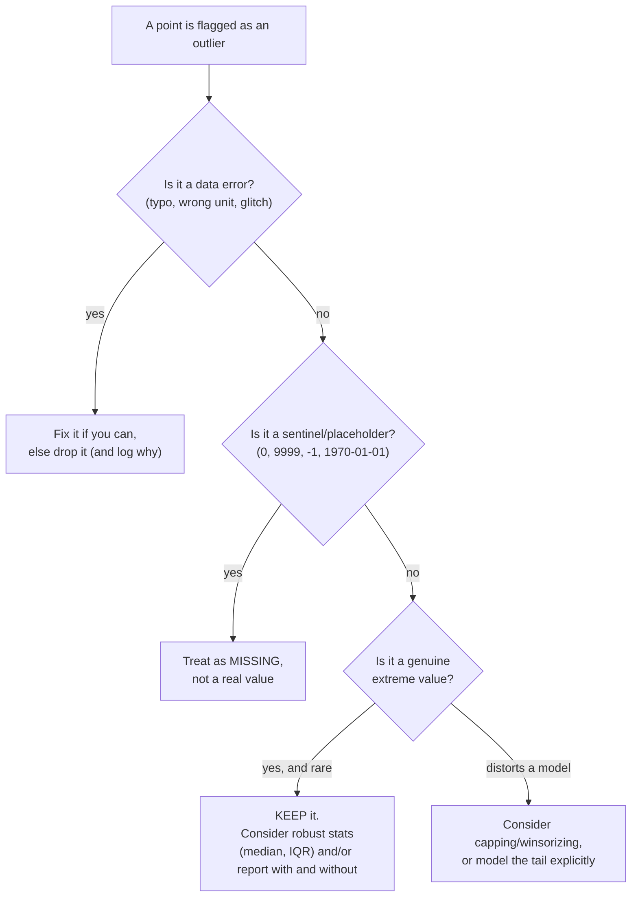

Center and spread compress a distribution into two numbers, but they
can't tell you what it *looks* like. Is it a tidy hill? A long tail
dragging to the right? Two separate humps that got mixed together? Does
it throw out the occasional wild value? Those questions are about
**shape**, and shape decides which statistics are even valid to use.
This page reads shape three ways, **skewness**, **modality**, and
**tail heaviness**, and then tackles the most misunderstood topic in
applied statistics: **outliers**, and what to actually do about them.

The headline you should carry in: an outlier is a *question*, not a
verdict. "This point is far from the others" tells you to look, not to
delete.

<Figure
  slug="stat-shape-outliers-cutout"
  alt="A long-tailed mound on a platform with two lone dots stranded far out along its tail, a flag marking each"
/>

## Skewness: which way the tail leans

A distribution is **symmetric** if its left and right halves mirror
each other. It's **skewed** when one tail is stretched longer than the
other. The naming trips people up, so anchor it firmly: skew is named
for the direction of the **long tail**, not where the bulk of the data
sits.

<Chart slug="skew-shapes" />

- **Right-skewed (positive skew):** a long tail toward *high* values.
  The bulk is on the left, a few large values stretch right. The
  **mean is pulled above the median**. This is the default for money,
  durations, counts, and sizes.
- **Left-skewed (negative skew):** a long tail toward *low* values. The
  bulk is on the right, a few small values stretch left. The **mean is
  pulled below the median**. Think exam scores with a ceiling, or age
  at death.

| Shape | Long tail | Mean vs median |
| --- | --- | --- |
| Left-skewed (negative) | to the left | mean &lt; median |
| Symmetric | balanced tails | mean &asymp; median |
| Right-skewed (positive) | to the right | mean &gt; median |

<Callout type="warn" title="Misconception: 'right-skewed' means the peak is on the right">
It's the opposite. Right-skewed means the *tail* points right, so the
**peak sits on the left**. The trick that always works: the skew points
the way the *tail* (and the mean) gets dragged. Mean above median →
right skew; mean below median → left skew.
</Callout>

`scipy.stats.skew` puts a number on this. Zero is symmetric, positive
is right-skewed, negative is left-skewed.

<CodeBlock
  adapter="python"
  files={[
    {
      filename: "main.py",
      starterCode: `import numpy as np
from scipy import stats

rng = np.random.default_rng(0)

symmetric = rng.normal(50, 10, size=5000)  # bell-shaped
right = rng.lognormal(mean=3, sigma=0.6, size=5000)  # long right tail
left = 100 - rng.exponential(scale=10, size=5000)  # long left tail

for name, x in [("symmetric", symmetric), ("right-skew", right), ("left-skew", left)]:
    print(
        f"{name:>11}: skew={stats.skew(x):+.2f}  "
        f"mean={x.mean():6.1f}  median={np.median(x):6.1f}  "
        f"(mean - median = {x.mean() - np.median(x):+.1f})"
    )

print("\\nPositive skew -> mean above median. Negative -> mean below.")
`,
    },
  ]}
/>

Notice the `mean − median` column tracks the skew sign exactly. That's
the cheap field test from *Measures of Center*: you don't need to
compute a skewness coefficient to suspect skew, just compare the mean
and median.

## Modality: how many peaks

**Modality** counts the peaks (modes) in a distribution.
**Unimodal** data has one hump. **Bimodal** data has two, and
**multimodal** more, and a second peak is almost always a *story*: two
populations got mixed into one column. Heights of a mixed-gender group,
response times split between cache-hit and cache-miss, purchase amounts
from two customer segments. When you see two peaks, the right move is
usually to *split the groups*, because no single center or spread
honestly describes a two-humped distribution.

<CodeBlock
  adapter="python"
  files={[
    {
      filename: "main.py",
      starterCode: `import numpy as np
import plotly.express as px

rng = np.random.default_rng(1)

# A column that secretly contains two groups.
group_a = rng.normal(165, 6, size=1500)  # one subpopulation
group_b = rng.normal(185, 6, size=1500)  # another subpopulation
mixed = np.concatenate([group_a, group_b])

fig = px.histogram(
    mixed,
    nbins=50,
    title="One column, two hidden groups (bimodal)",
    labels={"value": "height (cm)"},
)
fig.update_layout(showlegend=False)
fig.show()

print(f"Mean of the mixed column: {mixed.mean():.1f} cm")
print("...which lands in the VALLEY between the peaks, describing nobody.")
`,
    },
  ]}
/>

<Callout type="danger" title="A single center can describe nobody">
The mean of that bimodal column falls in the empty valley *between* the
two humps, no actual person is near it, exactly like the "average of a
teacher and a billionaire." Bimodality is the clearest case where
summarizing before plotting misleads you. When a mean lands where the
data is sparse, suspect mixed groups.
</Callout>

## Tail heaviness: kurtosis (lightly)

The last shape question is how **heavy the tails** are, how often you
get values far from the center. **Kurtosis** measures this. You rarely
need the exact number; what matters is the intuition: heavy-tailed
distributions produce extreme values *far more often* than a normal
distribution would, so "rare" events aren't actually that rare.

`scipy.stats.kurtosis` reports **excess** kurtosis by default (it
subtracts 3, so a normal distribution reads ~0). Positive means heavier
tails than normal; negative means lighter.

<CodeBlock
  adapter="python"
  files={[
    {
      filename: "main.py",
      starterCode: `import numpy as np
from scipy import stats

rng = np.random.default_rng(3)

normal_data = rng.normal(0, 1, size=20000)
heavy_tail = rng.standard_t(df=3, size=20000)  # Student's t, fat tails

for name, x in [("normal", normal_data), ("heavy-tailed", heavy_tail)]:
    far_out = np.mean(np.abs(x - x.mean()) > 4 * x.std())
    print(
        f"{name:>13}: excess kurtosis={stats.kurtosis(x):+.2f}  "
        f"share beyond 4 SD = {far_out:.4%}"
    )

print("\\nHeavier tails -> many more 'far out' values than normal predicts.")
`,
    },
  ]}
/>

<Callout type="info" title="Why heavy tails matter in practice">
Financial returns, insurance losses, network delays, and file sizes
often have heavy tails. If you assume normal-sized wiggles, you'll be
blindsided by "impossible" extremes that are actually routine for the
distribution. Heavy tails are also why a single robust spread (IQR) can
beat the standard deviation, one fat-tailed draw can dominate the SD.
</Callout>

## Outliers: what they are (and aren't)

What one of them costs each summary. The mean and the standard deviation
move a long way; the median barely notices.

<Chart slug="outlier-influence" />

An **outlier** is a value that sits far from the rest of the data. That
is *all* the definition says, "far away." It does **not** say "wrong,"
"error," or "delete me." Outliers come in three flavors, and they call
for opposite responses:

1. **Errors:** a typo, a unit mix-up (kg vs lb), a sensor glitch, a
   `-999` sentinel someone used for "missing." These should be fixed or
   removed, *once you've confirmed they're errors*.
2. **Sentinels / structural junk:** placeholder values like `0`,
   `9999`, or `1970-01-01` standing in for "unknown." Handle them as
   missing data, not as real measurements.
3. **Genuine extreme values:** a real whale customer, a real fraud
   case, a real record-breaking day. These are often the **most
   important rows in the dataset**, deleting them throws away the
   signal you're being paid to find.

<Callout type="danger" title="Misconception: outliers are errors you should delete">
The single most damaging habit in data cleaning. Auto-deleting outliers
hides fraud, removes your best customers, erases the rare events you
most need to model, and quietly biases every downstream estimate. The
correct default is **investigate, then decide**, never delete on sight.
</Callout>

### Two rules for *flagging* outliers

Flagging is mechanical; deciding is human. Two standard rules flag
candidates:

**The 1.5×IQR rule (box-plot fences).** Compute `Q1`, `Q3`, and
`IQR = Q3 − Q1`. Anything below `Q1 − 1.5×IQR` or above
`Q3 + 1.5×IQR` is flagged. Because it's built on quartiles, it's
**robust**, the outliers themselves don't move the fences, so it
works on skewed data.

**The z-score rule.** Compute each point's `z = (x − mean) / std` and
flag anything with `|z| > 3` (sometimes 2). It asks "how many standard
deviations from the mean?" But it's built on the **mean and standard
deviation**, which the outliers *themselves* inflate, so on skewed or
contaminated data it can hide the very points it's meant to catch.

| Rule | Built on | Behavior |
| --- | --- | --- |
| 1.5×IQR | `Q1`, `Q3`, `IQR` | Robust, outliers don't move the fences. Good on skewed data. |
| z-score (`\|z\| > 3`) | mean and std | Outliers inflate both; assumes roughly normal, so it can miss or over-flag on skew. |

The two rules **often disagree**, and seeing how is genuinely
clarifying.

<CodeBlock
  adapter="python"
  files={[
    {
      filename: "main.py",
      starterCode: `import numpy as np
import pandas as pd
from scipy import stats

rng = np.random.default_rng(7)

# Right-skewed data (incomes) plus a couple of genuine extremes.
data = pd.Series(
    np.concatenate(
        [
            rng.lognormal(mean=3.0, sigma=0.5, size=200),
            [120, 200],  # two real high earners
        ]
    )
)

# --- IQR fences (robust) ---
q1, q3 = data.quantile(0.25), data.quantile(0.75)
iqr = q3 - q1
lo, hi = q1 - 1.5 * iqr, q3 + 1.5 * iqr
iqr_flags = data[(data < lo) | (data > hi)]

# --- z-score rule (mean/std based) ---
z = (data - data.mean()) / data.std(ddof=0)
z_flags = data[z.abs() > 3]

print(f"IQR fence:  [{lo:.1f}, {hi:.1f}]")
print(f"IQR rule flags {len(iqr_flags)} points: {sorted(iqr_flags.round(1).tolist())}")
print(f"z>3 rule flags {len(z_flags)} points: {sorted(z_flags.round(1).tolist())}")
print()
print("On right-skewed data the two rules DISAGREE: the IQR rule flags")
print("more, because the extremes inflate the std the z-rule depends on.")
`,
    },
  ]}
/>

A box plot draws those IQR fences for you, the "whiskers" extend to
the last point inside the fence, and anything beyond is plotted as an
individual outlier dot.

<CodeBlock
  adapter="python"
  files={[
    {
      filename: "main.py",
      starterCode: `import numpy as np
import pandas as pd
import plotly.express as px

rng = np.random.default_rng(7)
data = pd.DataFrame(
    {
        "income": np.concatenate(
            [
                rng.lognormal(mean=3.0, sigma=0.5, size=200),
                [120, 200],
            ]
        )
    }
)

fig = px.box(
    data,
    y="income",
    points="outliers",
    title="Box plot: whiskers = 1.5xIQR fences, dots = flagged outliers",
)
fig.show()

print("The dots above the upper whisker are the 1.5xIQR-flagged points.")
`,
    },
  ]}
/>

### From flag to decision

Once a point is flagged, the real work begins: *why* is it out there?

<Callout type="tip" title="Practical outlier hygiene">
1. **Always look** at the flagged rows individually, pull them up and
   read them. 2. **Diagnose** the cause before acting. 3. If they're
   real, **keep them and switch to robust statistics** (median, IQR,
   MAD) rather than deleting. 4. If you must remove or cap, **report
   results both with and without** so the decision is transparent. 5.
   **Document** every exclusion. "I dropped 3 rows" with no reason is a
   red flag in any analysis.
</Callout>

<MultipleChoice
  markdown={`A column of purchase amounts has a few values near \\$50,000 while most are under \\$200. Investigation shows these are real bulk orders from genuine wholesale customers. What's the appropriate action?

- Assume they are data-entry errors because they are so large
  > "Large" is not evidence of an error, and the investigation already confirmed they are legitimate, so treating them as errors would be wrong.
- Delete them so they don't distort the average purchase amount
  > These are real, important customers, not errors, deleting them discards genuine revenue signal and biases your summaries downward.
- [o] Keep them, and report robust summaries (median, IQR) alongside the mean so the bulk orders don't dominate the headline number
  > Since the values are genuine, the right move is to retain them and lean on outlier-resistant statistics so a few large orders don't distort the typical-customer picture.
- Replace them with the mean of the other values
  > Overwriting real measurements with the mean fabricates data and erases the very wholesale behavior you'd want to understand.

Genuine extremes are kept; you change the *statistics* you report, not the data.`}
/>

## Putting it together: an outlier flagger

A reusable IQR-based flagger is something you'll write constantly in
EDA. The pattern: compute the fences, return which values fall outside,
and how many.

<CodeBlock
  adapter="python"
  files={[
    {
      filename: "main.py",
      starterCode: `import numpy as np
import pandas as pd

def flag_outliers_iqr(series, k=1.5):
    q1, q3 = series.quantile(0.25), series.quantile(0.75)
    iqr = q3 - q1
    lower, upper = q1 - k * iqr, q3 + k * iqr
    mask = (series < lower) | (series > upper)
    return {
        "lower_fence": float(lower),
        "upper_fence": float(upper),
        "n_outliers": int(mask.sum()),
        "outliers": series[mask].tolist(),
    }

rng = np.random.default_rng(0)
s = pd.Series(np.concatenate([rng.normal(50, 5, 100), [5, 95, 110]]))
print(flag_outliers_iqr(s))
`,
    },
  ]}
/>

<ChallengeCard
  adapter="python"
  title="Build a 1.5xIQR outlier flagger"
  instructions={`Implement the standard **1.5×IQR** outlier rule on the provided pandas Series \`readings\`.

Compute (using the 25th and 75th percentiles):

- \`q1\`, \`q3\`, the lower and upper quartiles
- \`iqr\` = \`q3 - q1\`
- \`lower_fence\` = \`q1 - 1.5 * iqr\`
- \`upper_fence\` = \`q3 + 1.5 * iqr\`

Then produce:

- **\`outliers\`**, a Python \`list\` of the values in \`readings\` that fall **below \`lower_fence\` or above \`upper_fence\`** (strictly outside the fences).
- **\`n_outliers\`**, an \`int\`, the count of those outliers.

Use the provided \`readings\` Series.`}
  files={[
    {
      filename: "main.py",
      initCode: `import numpy as np
import pandas as pd

rng = np.random.default_rng(99)
readings = pd.Series(np.concatenate([
    rng.normal(20, 3, size=200),   # normal sensor readings
    [40, 42, -5],                  # three genuine anomalies
]))`,
      starterCode: `# TODO: apply the 1.5xIQR rule
q1 = None
q3 = None
iqr = None
lower_fence = None
upper_fence = None
outliers = None  # list of values outside the fences
n_outliers = None  # int count
`,
      solutionCode: `q1 = readings.quantile(0.25)
q3 = readings.quantile(0.75)
iqr = q3 - q1
lower_fence = q1 - 1.5 * iqr
upper_fence = q3 + 1.5 * iqr

mask = (readings < lower_fence) | (readings > upper_fence)
outliers = readings[mask].tolist()
n_outliers = int(mask.sum())

print("fences:", lower_fence, upper_fence)
print("n_outliers:", n_outliers)
print("outliers:", outliers)
`,
    },
  ]}
  tests={[
    {
      id: "fences",
      name: "fences computed correctly",
      description: "lower/upper fence match the 1.5xIQR rule",
      code: `_q1 = readings.quantile(0.25)
_q3 = readings.quantile(0.75)
_iqr = _q3 - _q1
assert abs(lower_fence - (_q1 - 1.5 * _iqr)) < 1e-6
assert abs(upper_fence - (_q3 + 1.5 * _iqr)) < 1e-6`,
    },
    {
      id: "count_type",
      name: "n_outliers is an int",
      description: "Count is a Python int",
      code: `assert isinstance(n_outliers, int)`,
    },
    {
      id: "outliers_list",
      name: "outliers is a list of the right values",
      description: "Exactly the values outside the fences",
      code: `_q1 = readings.quantile(0.25)
_q3 = readings.quantile(0.75)
_iqr = _q3 - _q1
_lo = _q1 - 1.5 * _iqr
_hi = _q3 + 1.5 * _iqr
_expected = readings[(readings < _lo) | (readings > _hi)].tolist()
assert isinstance(outliers, list)
assert sorted(outliers) == sorted(_expected)`,
    },
    {
      id: "count_matches",
      name: "n_outliers matches len(outliers)",
      description: "Count is consistent with the list",
      code: `assert n_outliers == len(outliers)`,
    },
  ]}
/>

## Check your understanding

<MultipleChoice
  markdown={`A distribution has a long tail stretching toward *high* values and most of its mass on the left. How is it described, and how do the mean and median compare?

- Bimodal, because the mass and the tail are separated
  > A single peak with one stretched tail is unimodal and skewed; bimodality means two distinct peaks, which isn't described here.
- [o] Right-skewed, with the mean above the median
  > The long tail points toward the high values, which defines a right (positive) skew and drags the mean above the median.
- Left-skewed, with the mean below the median
  > A tail toward high values is a *right* skew, and it pulls the mean above the median, this option has both the name and the direction reversed.
- Symmetric, since the peak is on one side
  > A peak on one side with a long tail on the other is the definition of skew, not symmetry; symmetric data has mirror-image tails.

Skew is named for the tail's direction, and the mean always gets dragged toward that tail.`}
/>

<MultipleChoice
  markdown={`On strongly right-skewed data, the **z-score rule** (|z| > 3) flags *fewer* points than the **1.5×IQR rule**. Why?

- The IQR rule ignores the median, making it flag more points
  > The IQR rule is built on the quartiles (Q1 and Q3); the explanation is the std-inflation affecting the z-rule, not anything about the median.
- The z-score rule only works on integer data
  > The z-score is defined for any numeric data regardless of whether it's integer or continuous; data type isn't the issue.
- The IQR rule is simply more sensitive by design and always flags more
  > It isn't a fixed "always more" relationship; the difference here comes specifically from how skew affects each rule's inputs.
- [o] The extreme high values inflate the mean and standard deviation that the z-score uses, raising the |z| > 3 threshold so those very points fall short of it
  > Because the outliers pull up the std the z-rule depends on, the cutoff stretches outward and can fail to flag the points that created the stretch, while the quartile-based IQR fences stay put.

This is why the robust, quartile-based fences are preferred for skewed data.`}
/>

<MultipleChoice
  markdown={`You find three values of exactly \`-999\` in a temperature column that otherwise ranges from −20 to 45. What is the most likely explanation and correct handling?

- They are genuine record-cold readings worth keeping
  > A clean, repeated \`-999\` far outside the plausible range is the classic signature of a placeholder, not three identical real measurements.
- They prove the sensor is broken and the whole column should be discarded
  > A few placeholder rows don't invalidate the thousands of valid readings; you handle the sentinels as missing and keep the real data.
- [o] They are almost certainly a sentinel value for "missing," and should be treated as missing data rather than as real temperatures
  > A repeated, implausible round number like \`-999\` is a standard "no reading" placeholder, so converting these to missing prevents them from corrupting every summary.
- They are random outliers to flag with the z-score rule and keep
  > These aren't random extremes from the process; they're an encoded "missing" marker, so flag-and-keep would feed garbage into your statistics.

Sentinel codes masquerade as outliers; recognizing them as "missing" is part of basic data hygiene.`}
/>

<MultipleChoice
  markdown={`Which statement about **kurtosis** is accurate?

- It measures how many peaks (modes) a distribution has
  > Counting peaks is *modality*; kurtosis instead describes how often values land far out in the tails.
- A normal distribution has an excess kurtosis of 3
  > By the excess-kurtosis convention (\`scipy.stats.kurtosis\` default), a normal distribution reads ~0; the value 3 is the *raw* kurtosis before subtracting 3.
- High (positive excess) kurtosis means the data is strongly skewed
  > Kurtosis is about *tail heaviness*, not asymmetry; a perfectly symmetric distribution can still have very heavy tails. Skew is a separate measure.
- [o] Positive excess kurtosis indicates heavier tails than a normal distribution, extreme values occur more often than a normal model predicts
  > Heavy tails mean "rare" large deviations show up more frequently than the normal distribution would suggest, which is exactly what positive excess kurtosis flags.

Kurtosis is about the tails; skew is about asymmetry, don't conflate them.`}
/>

<Callout type="success" title="Key takeaways">
- **Shape** decides which statistics are valid; center and spread alone
  can't reveal it, plot the distribution.
- **Skew** is named for the long tail: right-skew → mean above median;
  left-skew → mean below median.
- A second peak (**bimodality**) usually means two groups mixed
  together, split them; no single center fits.
- **Kurtosis** is tail heaviness: heavy tails make "rare" extremes
  routine.
- **Outliers are questions, not verdicts.** Flag with the robust
  **1.5×IQR** rule (or z-scores, cautiously); then **investigate and
  decide**, fix errors, treat sentinels as missing, and *keep* genuine
  extremes while switching to robust statistics. Never auto-delete.
</Callout>
