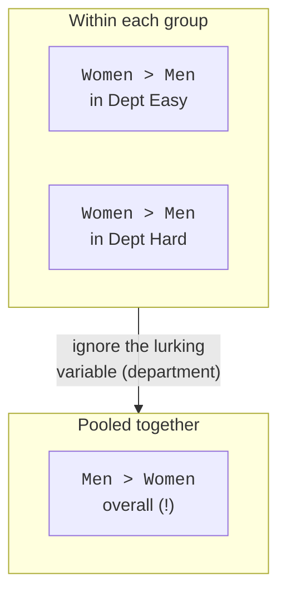
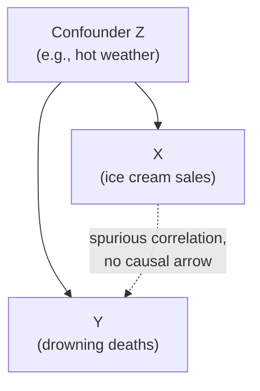
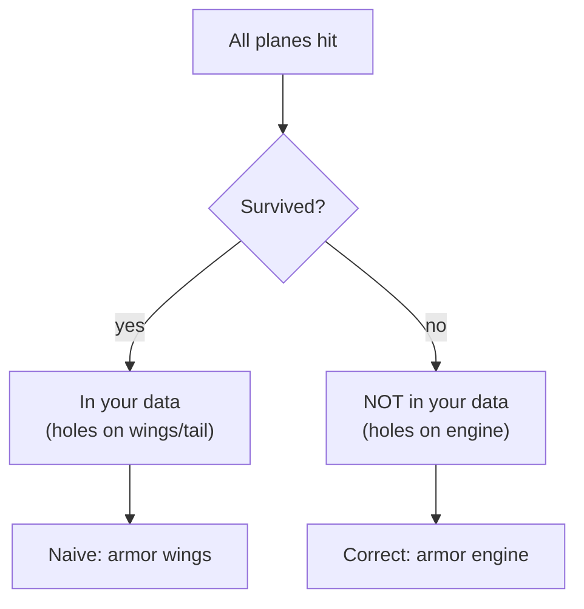
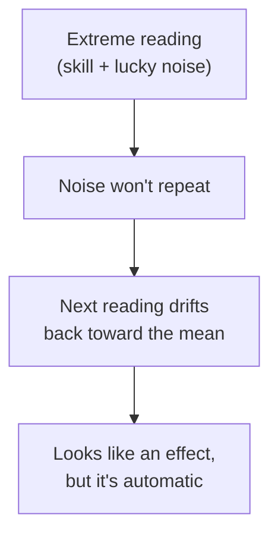
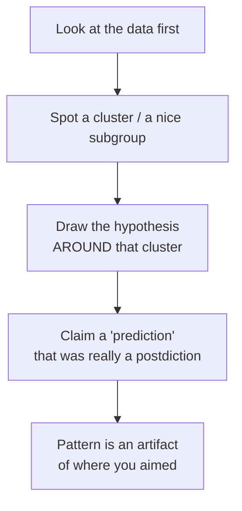

Most bad data science isn't a coding bug. The code runs, the numbers are
correct, the chart is beautiful, and the conclusion is *wrong* anyway,
because the reasoning had a hole in it. These holes are old, named, and
recurring. Learning their names is one of the highest-leverage things you
can do, because once you can *name* a trap you start spotting it in the
wild, in your colleagues' analyses, and, the hard part, in your own.

This page is a field guide to the classics. For each one: **what it is**,
**a concrete example**, and **how to avoid it**. None of them require
fancy math to understand. All of them have ended real projects, shipped
real bad features, and made it into real headlines.

<Figure
  slug="stat-fallacies-cutout"
  alt="A trend arrow rising on a platform that reverses direction when the platform splits into two stacked sub-groups"
/>

Even with a correct calculation, the reasoning can still spring one of
these leaks:

| The mistake | The fallacy |
| --- | --- |
| Forgot a lurking group | Simpson's paradox |
| A third cause | Confounding |
| Tested many things | P-hacking / multiple comparisons |
| Ignored the prior | Base-rate neglect |
| Only saw survivors | Survivorship bias |
| Extreme bounces back | Regression to the mean |
| Picked the nice data | Cherry-picking |
| Drew the target after | Texas sharpshooter |

## Simpson's paradox: a trend that reverses when you split the data

**What it is.** A relationship that holds in the *aggregated* data can
**reverse** when you break the data into subgroups, or vice versa. The
overall trend and the within-group trend point in opposite directions.
It happens when a lurking variable is distributed unevenly across the
groups you're comparing.

**Concrete example.** A classic real case: the 1973 UC Berkeley graduate
admissions. Overall, men were admitted at a higher rate than women,
which looked like bias against women. But department by department, women
were admitted at *equal or higher* rates than men. The catch: women
applied disproportionately to the most competitive departments (low
admit rates for everyone), while men applied to easier ones. The
department was the lurking variable.

Let's build a dataset where exactly this reversal happens, and watch it
flip when we disaggregate.

<CodeBlock
  adapter="python"
  files={[
    {
      filename: "main.py",
      starterCode: `import pandas as pd

# Two departments. "Easy" admits ~60%, "Hard" admits ~25%, for EVERYONE.
# Within each department, women are admitted at a HIGHER rate than men.
# But women mostly apply to the Hard department; men to the Easy one.
data = pd.DataFrame(
    [
        # dept,   gender,   applicants, admitted
        ["Easy", "Men", 600, 360],  # 60% admit
        ["Easy", "Women", 100, 65],  # 65% admit  (higher!)
        ["Hard", "Men", 100, 25],  # 25% admit
        ["Hard", "Women", 600, 165],  # 27.5% admit (higher!)
    ],
    columns=["dept", "gender", "applicants", "admitted"],
)

# Within-department admit rates: women win in BOTH.
within = data.assign(rate=lambda d: d.admitted / d.applicants)
print("Within each department (women admitted at a HIGHER rate in both):")
print(within.pivot(index="dept", columns="gender", values="rate").round(3))

# Aggregate admit rates: now MEN look favored. The trend reversed.
agg = data.groupby("gender")[["applicants", "admitted"]].sum()
agg["rate"] = agg["admitted"] / agg["applicants"]
print("\\nAggregated across departments (now MEN look favored):")
print(agg["rate"].round(3))
`,
    },
  ]}
/>

Read the two tables against each other. Within every department, women
are admitted more often, yet pooled together, men come out ahead,
purely because women concentrated in the hard-to-enter department. Same
numbers, opposite story.

It is not a quirk of admissions data either. Here is the same reversal in
a published kidney-stone study, where the treatment that wins in both
subgroups loses once the subgroups are pooled:

<Chart slug="simpsons-paradox" />

**How to avoid it.** Before trusting an aggregate comparison, ask: *is
there a grouping variable distributed unevenly across the things I'm
comparing?* Break the data down by plausible lurking variables and check
whether the story survives. If the aggregate and the subgroups disagree,
the subgroups are usually the more honest answer, but which one is
"right" depends on the causal question you're actually asking.

<Callout type="warn" title="Simpson's paradox in dashboards">
This is not an exotic textbook curiosity, it bites in routine work.
"Conversion went up overall but down in every single segment" is a real
thing that happens when traffic mix shifts. Whenever an overall metric
moves, glance at the segment breakdown before you celebrate or panic.
</Callout>

<MultipleChoice
  markdown={`A hospital reports a **higher** overall death rate than its rival, yet has a **lower** death rate for both "low-risk" and "high-risk" patients separately. What is the most likely explanation?

- The hospital is genuinely worse, because the overall rate is what matters
  > The overall rate is confounded by case mix here; the within-risk-group comparison is the fairer measure of the hospital's actual performance.
- [o] The hospital treats a larger share of high-risk patients, dragging up its overall rate despite better performance within each risk group
  > An uneven mix of the lurking variable (patient risk) across hospitals produces exactly this reversal; the better-within-each-group hospital can still have a worse pooled rate.
- Risk level is irrelevant to death rates
  > Risk level is precisely the lurking variable driving the reversal, so it is highly relevant rather than irrelevant.
- The hospital's data is wrong, since the numbers contradict each other
  > The numbers do not contradict each other; an aggregate and its subgroups can legitimately point in opposite directions. This is Simpson's paradox, not an error.

Always check whether a lurking variable's distribution differs across the groups you compare.`}
/>

## Confounding and correlation vs causation

**What it is.** Two variables move together (they correlate), and it's
tempting to conclude one *causes* the other. But a **confounder**, a
third variable Z that influences *both* X and Y, can manufacture the
correlation with no causal link between X and Y at all.

**Concrete example.** Ice cream sales correlate with drowning deaths.
Banning ice cream will not save swimmers, *hot weather* drives both:
people buy more ice cream **and** swim more when it's hot. Weather is the
confounder. The X–Y correlation is real; the causal story is fake.

**How to avoid it.** Treat "X correlates with Y" as the *start* of a
question, never the answer. Ask what else could drive both. The gold
standard for breaking confounding is a **randomized experiment**:
randomly assigning who gets X severs the link from any confounder to X,
which is exactly why A/B tests license causal claims (we lean on this in
*A/B Testing*). Without randomization, control for confounders you can
measure, but you can never be sure you've caught them all.

<Callout type="danger" title="The phrase to delete from your vocabulary">
"The data shows X causes Y", from observational data alone, it almost
never does. Correlation is necessary for causation but nowhere near
sufficient. We explore this whole tangle in *Correlation and
Nonparametric Tests*; here the point is just to make "could a confounder
explain this?" an automatic reflex.
</Callout>

A confounder does not merely blur a result; it can reverse it, and not only
when the numbers are rates. Every group here trends one way and the single
line fitted to all of them trends the other:

<Chart slug="simpsons-paradox-trend" />

## P-hacking, multiple comparisons, and the garden of forking paths

**What it is.** If you run *one* test at α = 0.05, there's a 5%
chance of a false positive when nothing is real. But if you run *twenty*
such tests, you'd *expect* about one "significant" result by pure chance.
Hunting through many comparisons (or many model specifications, or many
subgroups) and reporting only the ones that "worked" is **p-hacking**.
The "**garden of forking paths**" is the subtler cousin: even without
consciously fishing, the many small analysis choices you'd have made
*differently* had the data looked different inflate your false-positive
rate.

**Concrete example.** Test whether each of 20 unrelated variables
predicts churn. Even if none truly does, roughly one will come back
`p < 0.05`, and if you publish *that* one as "the finding," you've
reported noise as signal. Let's watch it happen.

<CodeBlock
  adapter="python"
  files={[
    {
      filename: "main.py",
      starterCode: `import numpy as np
from scipy import stats

rng = np.random.default_rng(1)

# An outcome with NO real relationship to anything.
n = 200
outcome = rng.normal(0, 1, size=n)

# Test 20 unrelated random "features" against it.
hits = []
for i in range(20):
    feature = rng.normal(0, 1, size=n)  # pure noise, unrelated to outcome
    r, p = stats.pearsonr(feature, outcome)
    if p < 0.05:
        hits.append((i, round(r, 3), round(p, 4)))

print(f"Tested 20 unrelated features against pure-noise outcome.")
print(f"'Significant' at p < 0.05: {len(hits)} of 20")
for i, r, p in hits:
    print(f"  feature {i:>2}:  r = {r:+.3f},  p = {p:.4f}  <- a FALSE positive")
print()
print("None of these relationships are real. With 20 tests, ~1 'wins' by luck.")
`,
    },
  ]}
/>

About one of twenty fires even though nothing is real. Report just that
one and you've laundered chance into a "discovery."

**How to avoid it.**

- **Pre-register** your primary hypothesis and analysis *before* seeing
  the data, so the analysis isn't chosen to fit the noise.
- **Correct for multiple comparisons** (e.g., Bonferroni: use
  α / m for `m` tests; or control the false discovery rate).
- Treat results found by exploration as **hypotheses to confirm on fresh
  data**, not conclusions, the central discipline of *Exploratory
  Statistical Analysis*.

<Callout type="warn" title="Bonferroni in one line">
Running `m` tests and want an overall 5% error rate? Compare each
p-value to `0.05 / m` instead of `0.05`. For 20 tests that's `0.0025`,
which would have killed every false positive in the simulation above.
It's conservative, but it's a safe default.
</Callout>

## Base-rate neglect

**What it is.** Ignoring how *rare* something is when interpreting a
test. Even an accurate test for a rare condition produces mostly **false
positives**, because there are so many more true negatives than true
positives to begin with. Forgetting the base rate makes a positive
result feel far more conclusive than it is.

**Concrete example.** A disease affects 1 in 1,000 people. A test is 99%
accurate (1% false-positive rate, catches all true cases). You test
positive. Your chance of actually having the disease is *not* 99%, it's
about **9%**. Run the numbers on 100,000 people:

<CodeBlock
  adapter="python"
  files={[
    {
      filename: "main.py",
      starterCode: `# Disease prevalence and test accuracy.
prevalence = 1 / 1000  # 0.1% of people have it
false_pos_rate = 0.01  # 1% of healthy people test positive
sensitivity = 1.00  # catches every true case

population = 100_000
sick = population * prevalence
healthy = population - sick

true_positives = sick * sensitivity  # sick AND test positive
false_positives = healthy * false_pos_rate  # healthy BUT test positive

prob_sick_given_positive = true_positives / (true_positives + false_positives)

print(f"Out of {population:,} people:")
print(f"  Truly sick           : {sick:.0f}")
print(f"  True positives       : {true_positives:.0f}")
print(f"  False positives      : {false_positives:.0f}")
print()
print(f"P(actually sick | tested positive) = {prob_sick_given_positive:.1%}")
print("A 99%-accurate test, yet a positive means only ~9% chance of disease.")
`,
    },
  ]}
/>

The 1,000 false positives drown out the 100 true ones. We derived this
formally with Bayes' rule in *Conditional Probability*; the *fallacy*
here is forgetting to do it at all.

**How to avoid it.** Always ask "how common is this in the first place?"
before trusting a positive result. For rare events, a single positive is
weak evidence, confirm with a second, independent test.

<MultipleChoice
  markdown={`A fraud detector flags 2% of all transactions and is "95% accurate." Most transactions are legitimate. A flagged transaction is most likely to be:

- Equally likely to be fraud or legitimate
  > Whether it is 50/50 depends entirely on the base rate and error rates; with rare fraud it skews heavily toward false positive, not an even split.
- [o] More likely legitimate than fraudulent, because fraud is rare and false positives pile up
  > With a low base rate, the large pool of legitimate transactions generates many false positives that can outnumber the genuine catches.
- Definitely fraud, since the detector is 95% accurate
  > "95% accurate" does not equal "95% of flags are fraud." When the base rate of fraud is low, most flags are false positives despite high accuracy.
- Impossible to assess without knowing the time of day
  > The missing ingredient is the base rate of fraud, not the time of day; prevalence is what determines how to read a positive flag.

For rare events, even accurate detectors produce mostly false alarms, that's base-rate neglect.`}
/>

## Survivorship bias

The whole effect in one histogram: a piece of the distribution is
missing, and the average of what remains is a true statement about the
wrong population.

<Chart slug="survivorship-bias" />

**What it is.** Drawing conclusions from only the cases that "survived"
some selection, while the ones that didn't make it are invisible,
silently dropped from your data. The survivors are a biased sample, so
any pattern you find in them may be an artifact of *what got filtered
out*, not a real effect.

**Concrete example.** In WWII, analysts examined returning bombers to
decide where to add armor, and found bullet holes concentrated on the
wings and tail. The instinct was to armor those spots. The
statistician Abraham Wald pointed out the opposite: armor the
*untouched* areas (engines, cockpit). The planes hit *there* never came
back, so the holes you *see* mark the survivable hits. The data was
literally the survivors.

**How to avoid it.** Ask "what's *missing* from this dataset, and why?"
Whenever your data is the result of a selection ("successful startups,"
"customers who stayed," "students who graduated," "stocks still in the
index"), the dropouts carry information you can't see. Mutual-fund
"average returns" that quietly exclude funds that shut down are the
modern, financial version of the bullet-hole map.

## Regression to the mean

Two noisy measurements of the same unchanging thing, with nothing done
in between. The extremes move toward the middle anyway, which is what
makes useless interventions look effective.

<Chart slug="regression-to-the-mean" />

**What it is.** Extreme measurements tend to be followed by less extreme
ones, simply because part of any extreme value was *luck*, and luck
doesn't repeat. An unusually high reading is high partly because the
random component happened to be high that time; next time, the random
part is typically closer to average, so the value drifts back toward the
mean, **with no intervention required**. The very word "regression"
comes from this phenomenon: Francis Galton, studying the heights of
parents and their children in the 1880s, noticed that exceptionally tall
parents tended to have children closer to average height, and called it
"regression toward mediocrity."

**Concrete example.** The "Sports Illustrated jinx": athletes featured on
the cover often slump afterward. No curse, they made the cover after a
career-best stretch (partly luck), and ordinary performance afterward
looks like a decline. The same logic explains why "punishing the worst
performers seems to work" and "rewarding the best seems to backfire":
both groups were partly lucky/unlucky and drift back regardless.

<CodeBlock
  adapter="python"
  files={[
    {
      filename: "main.py",
      starterCode: `import numpy as np

rng = np.random.default_rng(3)

# Each salesperson has a true skill, plus monthly luck. Measured = skill + luck.
n = 500
skill = rng.normal(100, 10, size=n)
month1 = skill + rng.normal(0, 15, size=n)  # luck differs each month
month2 = skill + rng.normal(0, 15, size=n)

# Take the TOP 10% of month 1 ("our best reps!") and see how they do next month.
top = month1 >= np.quantile(month1, 0.90)
print(f"Top performers in month 1: avg = {month1[top].mean():.1f}")
print(f"...the SAME people in month 2: avg = {month2[top].mean():.1f}")
print()
# And the bottom 10%.
bottom = month1 <= np.quantile(month1, 0.10)
print(f"Bottom performers in month 1: avg = {month1[bottom].mean():.1f}")
print(f"...the SAME people in month 2: avg = {month2[bottom].mean():.1f}")
print()
print("Top group drops, bottom group rises -- with NO intervention at all.")
print("It's just luck not repeating. Don't credit (or blame) a program for this.")
`,
    },
  ]}
/>

The top group falls and the bottom group rises automatically. If you'd
run a "coaching program" on the bottom 10%, you'd wrongly credit it for
the rebound.

**How to avoid it.** Whenever you select a group *because* it was
extreme and then re-measure, expect a drift toward the mean even if
nothing was done. To attribute a change to an intervention, you need a
**control group** that was equally extreme but untreated, only the gap
*between* the groups isolates the real effect.

<Callout type="danger" title="Regression to the mean masquerades as success">
Interventions targeted at the worst cases (failing students, sick
patients, underperforming stores) almost always *look* effective,
because those cases would have improved on their own. Without a control
group, you can't separate the treatment from the inevitable bounce-back.
</Callout>

## Cherry-picking and the Texas sharpshooter

Ten years of a series that goes nowhere, and the four months inside it
that someone would show you instead. Nothing in the second chart is
false.

<Chart slug="cherry-picked-window" />

<Chart slug="cherry-picked-window-zoom" />

**Cherry-picking** is reporting only the data points, time windows, or
subgroups that support your conclusion and quietly dropping the rest.
"Sales are up!", measured from the one low month you chose as the
starting point.

The **Texas sharpshooter fallacy** is its formal cousin: fire a gun at a
barn, *then* paint the target around the tightest cluster of holes, and
declare yourself a marksman. In data terms, find a pattern in the data
*first*, then construct the hypothesis to fit that exact pattern, and
present it as if you'd predicted it. The cluster looks meaningful only
because you drew the target after seeing where the bullets landed.

**Concrete example.** A "cancer cluster" near a factory looks alarming,
but if you scan thousands of neighborhoods, some will show high counts by
chance, and zooming in on the worst one *after the fact* (drawing the
target around it) manufactures a story from noise. The same logic powers
"this stock-picking strategy would have crushed the market" when the
strategy was tuned on the very history it's tested against.

**How to avoid it.** State the hypothesis and the analysis window
*before* looking, report *all* the comparisons you ran (not just the
flattering ones), and confirm any data-discovered pattern on **new,
independent data**. If the target was painted after the shots, the
bullseye proves nothing.

<Callout type="info" title="The thread connecting half of these">
Simpson's paradox, p-hacking, the garden of forking paths, cherry-picking,
and the Texas sharpshooter are all variations on one theme: *the analysis
was shaped by the data instead of decided in advance.* The antidote is
always the same, decide first, then look, then **confirm on fresh
data**. That discipline is the heart of *Exploratory Statistical
Analysis*.
</Callout>

## Trusting a summary without looking

Every fallacy above is a way of reasoning past the data. The simplest
one of all is reasoning past the *picture*: trusting summary statistics
without ever plotting. We met **Anscombe's quartet** earlier, four
datasets with the same mean, variance, and correlation but four
different shapes. In 2017, Justin Matejka and George Fitzmaurice at
Autodesk pushed the joke to its limit. Starting from Alberto Cairo's
"Datasaurus", a scatter of points that forms a cartoon dinosaur yet has
unremarkable summary statistics, they generated **twelve more**
datasets that share the *same* mean, standard deviation, and correlation
to two decimal places, while looking like stars, circles, lines, and
slanted clouds.

<Figure
  slug="stat-fallacies-datasaurus-cutout"
  alt="The same scatter of points arranged as a dinosaur, a star and a ring, with one identical tile beneath all three"
  caption="Matejka and Fitzmaurice, 2017: twelve datasets sharing summary statistics to two decimal places, all shaped differently."
/>

Run this on the real **Datasaurus Dozen**: thirteen datasets, one set of
summary statistics.

<CodeBlock
  adapter="python"
  datasets={[{ path: "datasaurus_dozen.csv", stageAs: "datasaurus.csv" }]}
  files={[
    {
      filename: "main.py",
      initCode: `import pandas as pd
dd = pd.read_csv("datasaurus.csv")`,
      starterCode: `summary = dd.groupby("dataset").agg(
    mean_x=("x", "mean"), mean_y=("y", "mean"),
    std_x=("x", "std"), std_y=("y", "std"),
).round(1)
summary["corr"] = dd.groupby("dataset").apply(
    lambda g: g["x"].corr(g["y"])
).round(2)

print(summary)
print("\\n13 datasets. The summary statistics are essentially identical.")
`,
    },
  ]}
/>

The means hover around 54 and 48, the standard deviations around 17 and
26, the correlation near −0.06, for every single one, including the
dinosaur. Now plot them and the summaries fall apart completely:

<CodeBlock
  adapter="python"
  datasets={[{ path: "datasaurus_dozen.csv", stageAs: "datasaurus.csv" }]}
  files={[
    {
      filename: "main.py",
      initCode: `import pandas as pd
import plotly.express as px
dd = pd.read_csv("datasaurus.csv")`,
      starterCode: `# Same stats in every panel. Find the dinosaur.
fig = px.scatter(
    dd, x="x", y="y", facet_col="dataset", facet_col_wrap=4,
    height=700, title="The Datasaurus Dozen, identical statistics, wildly different shapes",
    template="simple_white",
)
fig.update_xaxes(matches=None, showticklabels=False)
fig.update_yaxes(matches=None, showticklabels=False)
fig.show()
`,
    },
  ]}
/>

<Callout type="warn" title="The cheapest fallacy to avoid">
Of every trap on this page, this is the one a single line of code
prevents. Mean, standard deviation, and correlation are a three-number
summary of a cloud that may contain a dinosaur. Before you summarize,
before you test, **scatter the data and look at it.** The shapes you'd
otherwise miss, curves, clusters, outliers, two populations mixed
together, are exactly the ones that change the conclusion.
</Callout>

## Practice

<ChallengeCard
  adapter="python"
  title="Detect Simpson's paradox"
  instructions={`A DataFrame \`df\` of A/B test results by \`device\` has been created. Each row has \`device\`, \`group\` ("A" or "B"), \`visitors\`, and \`conversions\`.

Determine whether **Simpson's paradox** is present by comparing the **aggregate** winner to the **within-device** winner.

Produce two variables:

- \`agg_winner\`: the string \`"A"\` or \`"B"\`, whichever group has the higher **overall** conversion rate (pooled across devices).
- \`within_winner\`: the string \`"A"\` or \`"B"\`, the group that has the higher conversion rate **within both** devices (the same group wins on each device in this data).

Conversion rate = \`conversions / visitors\`. A paradox exists when \`agg_winner != within_winner\`.`}
  files={[
    {
      filename: "main.py",
      initCode: `import pandas as pd
df = pd.DataFrame([
    ["mobile",  "A",  100,  30],   # 30.0%
    ["mobile",  "B",  900, 297],   # 33.0%  (B higher)
    ["desktop", "A",  900, 630],   # 70.0%
    ["desktop", "B",  100,  73],   # 73.0%  (B higher)
], columns=["device", "group", "visitors", "conversions"])`,
      starterCode: `import pandas as pd

# TODO: compute agg_winner and within_winner (each "A" or "B")
agg_winner = None
within_winner = None
`,
      solutionCode: `import pandas as pd

# Aggregate (pooled) rates.
agg = df.groupby("group")[["visitors", "conversions"]].sum()
agg["rate"] = agg["conversions"] / agg["visitors"]
agg_winner = agg["rate"].idxmax()

# Within-device rates: B is higher on BOTH devices here.
d = df.assign(rate=df["conversions"] / df["visitors"])
per_device = d.pivot(index="device", columns="group", values="rate")
within_winner = "B" if (per_device["B"] > per_device["A"]).all() else "A"

print("agg_winner   =", agg_winner)
print("within_winner=", within_winner)
print("Paradox?", agg_winner != within_winner)
`,
    },
  ]}
  tests={[
    {
      id: "types",
      name: "both winners are 'A' or 'B'",
      description: "Returns valid group labels",
      code: `assert agg_winner in ("A", "B")
assert within_winner in ("A", "B")`,
    },
    {
      id: "agg",
      name: "aggregate winner is A",
      description: "Pooled, group A has the higher rate",
      code: `agg = df.groupby("group")[["visitors","conversions"]].sum()
agg["rate"] = agg["conversions"]/agg["visitors"]
assert agg_winner == agg["rate"].idxmax()
assert agg_winner == "A"`,
    },
    {
      id: "within",
      name: "within-device winner is B",
      description: "B wins on each device",
      code: `assert within_winner == "B"`,
    },
    {
      id: "paradox",
      name: "the two disagree (paradox detected)",
      description: "Aggregate and within-group winners differ",
      code: `assert agg_winner != within_winner`,
    },
  ]}
/>

<ChallengeCard
  adapter="python"
  title="Count false positives from multiple comparisons"
  instructions={`Simulate the multiple-comparisons trap. An \`outcome\` array (pure noise, no real signal) has been created.

Run **100 independent tests**: for each, generate a fresh unrelated random feature of the same length, correlate it with \`outcome\` using \`scipy.stats.pearsonr\`, and count how many come back "significant" at \`alpha = 0.05\`.

- Use the provided \`rng\` so results are reproducible.
- Store the count of significant tests (p < 0.05) in an \`int\` variable named \`false_positives\`.

Since nothing is real, **every** significant result is a false positive. Expect roughly 5 out of 100.`}
  files={[
    {
      filename: "main.py",
      initCode: `import numpy as np
from scipy import stats
rng = np.random.default_rng(42)
n = 150
outcome = rng.normal(0, 1, size=n)`,
      starterCode: `import numpy as np
from scipy import stats

alpha = 0.05
# TODO: run 100 tests of fresh noise features vs outcome; count p < alpha
false_positives = None
`,
      solutionCode: `import numpy as np
from scipy import stats

alpha = 0.05
false_positives = 0
for _ in range(100):
    feature = rng.normal(0, 1, size=n)
    _, p = stats.pearsonr(feature, outcome)
    if p < alpha:
        false_positives += 1

false_positives = int(false_positives)
print("False positives out of 100:", false_positives)
`,
    },
  ]}
  tests={[
    {
      id: "type",
      name: "false_positives is an int",
      description: "Returns an integer count",
      code: `assert isinstance(false_positives, int)`,
    },
    {
      id: "range",
      name: "count is in a plausible range",
      description: "Around 5 out of 100, with sampling variation",
      code: `assert 0 <= false_positives <= 20`,
    },
    {
      id: "ballpark",
      name: "not absurdly high",
      description: "Most of the 100 tests are correctly non-significant",
      code: `assert false_positives < 15`,
    },
  ]}
/>

## Check your understanding

<MultipleChoice
  markdown={`Overall, your app's checkout conversion rose from last quarter, but it **fell** within every individual marketing channel. What happened?

- The aggregate number is wrong and should be ignored
  > Both the aggregate and the per-channel numbers can be correct simultaneously; their disagreement is Simpson's paradox, not a computational error.
- Conversion genuinely improved, so the channel breakdown is misleading
  > The channel breakdown is the more diagnostic view here; the aggregate is flattered by the shift in traffic mix and can hide a real per-channel decline.
- This is impossible without a bug
  > It is a well-known and entirely possible pattern (Simpson's paradox) that arises from an uneven shift in the underlying groups.
- [o] The mix of traffic shifted toward higher-converting channels, lifting the overall rate even as each channel declined
  > A change in the weighting of channels (the lurking variable) can raise the pooled rate while every channel individually drops.

When an aggregate and its segments disagree, suspect a shift in the segment mix.`}
/>

<MultipleChoice
  markdown={`Cities with more police officers per capita tend to have more reported crime. A council member concludes police *cause* crime. The flaw is:

- Survivorship bias
  > Survivorship bias is about analyzing only cases that passed a selection filter; nothing here is being filtered out of the data.
- Base-rate neglect
  > Base-rate neglect is about ignoring prevalence when reading a test result, which is not the issue in this correlation-versus-causation example.
- Regression to the mean
  > Regression to the mean concerns extreme measurements drifting back over time, not a third variable linking two quantities.
- [o] A confounder (city size / population density) drives both police numbers and crime, creating a non-causal correlation
  > Larger, denser cities tend to have both more police and more crime, so a third variable produces the correlation without police causing crime.

A confounder can manufacture a correlation with no causal arrow between the two variables.`}
/>

<MultipleChoice
  markdown={`A team tests 40 features for an effect on retention at alpha = 0.05, finds 3 with p < 0.05, and reports those 3 as discoveries. What's the danger?

- [o] With 40 tests, about 2 false positives are expected by chance, so the 3 "hits" may be noise unless corrected and confirmed
  > Running many tests inflates the family-wise error rate; without a multiple-comparison correction or confirmation on fresh data, the hits are not trustworthy.
- Nothing; p < 0.05 means each is a real effect
  > A single p < 0.05 has a 5% false-positive rate; across 40 tests you expect about 2 false positives, so some "discoveries" are likely noise.
- They should have used a one-sided test
  > Test sidedness does not address the multiple-comparisons problem; the false-positive inflation comes from the number of tests, not their direction.
- The sample was too small
  > The issue is the number of simultaneous tests, not the per-test sample size; even large samples suffer this if you run enough tests.

Correct for multiple comparisons (e.g., Bonferroni) and confirm discoveries on new data.`}
/>

<MultipleChoice
  markdown={`A study of successful entrepreneurs finds most dropped out of college, and concludes dropping out boosts success. The fatal flaw is:

- Simpson's paradox
  > Simpson's paradox is about an aggregate trend reversing across subgroups; this error is about analyzing only the survivors of a selection.
- [o] Survivorship bias, it only looks at successful people and ignores the far larger number of dropouts who failed
  > Sampling only on the outcome (success) hides the dropouts who did not succeed, so the "pattern" reflects the selection filter, not a real advantage.
- Regression to the mean
  > Regression to the mean involves extreme values drifting toward average on re-measurement, which is not what is happening in this selected sample.
- P-hacking
  > P-hacking is about running many tests and reporting the lucky ones; the flaw here is the biased sample of only-successful people.

To judge dropping out, you must compare success rates among dropouts AND non-dropouts, including the failures.`}
/>

<MultipleChoice
  markdown={`A clinic enrolls the patients with the **highest** blood pressure, treats them, and finds their average pressure dropped at the next visit. Before crediting the treatment, the biggest concern is:

- Base-rate neglect
  > Base-rate neglect concerns the prevalence of a condition when reading a test, not the re-measurement of an extreme group.
- Cherry-picking the data
  > The clinic measured everyone it enrolled rather than selectively reporting points; the concern is the statistical tendency of extremes to regress.
- Survivorship bias
  > No cases are being filtered out by survival here; everyone enrolled is re-measured, so the issue is the extreme-selection rebound, not survivorship.
- [o] Regression to the mean, the most extreme readings tend to fall toward average on re-measurement even with no treatment
  > Selecting the highest values captures people whose reading was partly unlucky-high; on re-measurement those readings drift down regardless of treatment.

A control group that was equally extreme but untreated is what isolates the treatment's real effect.`}
/>

<MultipleChoice
  markdown={`An analyst scans 500 variables, finds one oddly predictive subgroup, and writes a hypothesis specifically describing that subgroup as if it had been predicted in advance. This is:

- Confounding
  > Confounding involves a third variable driving two others; here the problem is constructing the hypothesis after seeing where the pattern landed.
- [o] The Texas sharpshooter fallacy, drawing the target around the cluster after seeing where the shots landed
  > Forming the hypothesis to fit a pattern discovered in the data, then presenting it as a prediction, treats a postdiction as if it were a forecast.
- Regression to the mean
  > Regression to the mean is about extremes drifting back on re-measurement, unrelated to retrofitting a hypothesis to a discovered cluster.
- Base-rate neglect
  > Base-rate neglect is about ignoring prevalence when interpreting a positive result, not about drawing a hypothesis around a found pattern.

Patterns found by searching must be confirmed on fresh, independent data before they count.`}
/>

<Callout type="success" title="Key takeaways">
- **Simpson's paradox:** an aggregate trend can reverse within subgroups, check for an uneven lurking variable.
- **Confounding:** a third variable can create a correlation with no causal link, randomization breaks it.
- **P-hacking / multiple comparisons:** run enough tests and chance hands you "significance", correct and confirm.
- **Base-rate neglect:** for rare events, even accurate tests yield mostly false positives.
- **Survivorship bias:** the cases that dropped out carry information you can't see, ask what's missing.
- **Regression to the mean:** extremes drift back on their own, you need a control group to credit an intervention.
- **Cherry-picking / Texas sharpshooter:** decide the hypothesis *before* you look, report everything, and confirm on new data.
</Callout>
