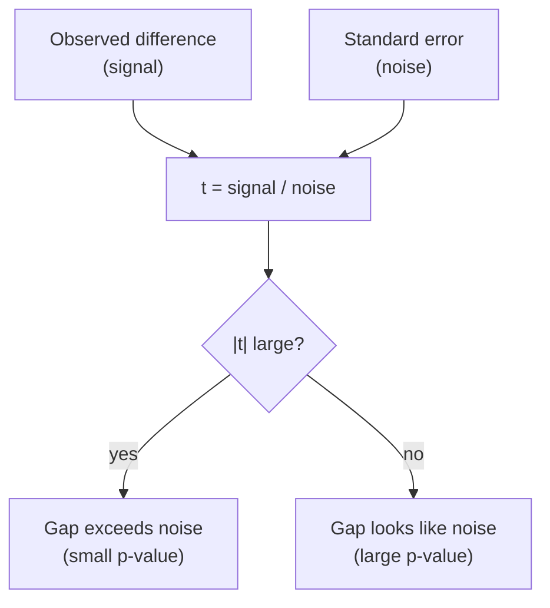
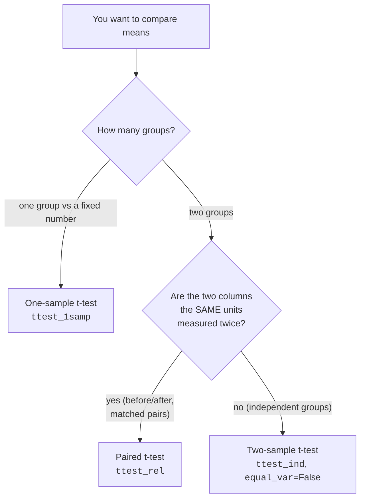
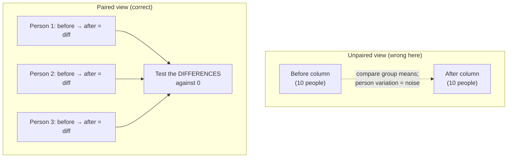

You already know the big idea from *Hypothesis Testing*: a difference
between two averages might be real, or it might be the kind of wiggle
random sampling hands you for free. The **t-test** is the workhorse for
deciding which, specifically, for questions about **means**.

Three flavors cover almost everything you'll meet as a data scientist:

- **One-sample**, is this group's average different from a fixed target?
  ("Do our servers really respond in 200 ms on average?")
- **Two-sample (independent)**, do two *separate* groups have different
  averages? ("Did the new onboarding flow change average revenue per
  user?")
- **Paired**, did the *same* units change between two conditions?
  ("Did each patient's blood pressure drop after the drug?")

This page is about picking the right one, running it with `scipy.stats`,
and, the part that actually matters, reading the result like a careful
analyst instead of a p-value vending machine.

<Figure
  slug="stat-t-tests-cutout"
  alt="A fraction machine on a platform with a signal block on top and a noise block beneath, emitting one statistic token"
/>

## The t-statistic is signal divided by noise

Every t-test boils your data down to a single number, the **t-statistic**.
Strip away the bookkeeping and it's just a ratio:

`t = (difference you observed) / (noise in that difference)`

The numerator is the **signal**, how far the means are apart. The
denominator is the **standard error**, the typical size of the random
wobble you'd expect even if nothing were going on (you met the standard
error in *Standard Error*). So:

<Chart slug="t-vs-normal" />

- **Big |t|** → the gap dwarfs the noise → surprising if there were no
  real difference.
- **Small |t|** → the gap is the size of ordinary noise → nothing to see.

The t-distribution then translates that ratio into a **p-value**: if
there were truly no difference, how often would noise alone produce a
|t| at least this big? Small p-value, surprising-under-the-null, you
reject. That's the whole machine, the three tests below differ only in
*what difference* goes on top and *what noise* goes on the bottom.

<Callout type="info" title="Why 't' and not just a z-score?">
When you don't know the true population spread (you almost never do) you
estimate it from the sample. That estimate is itself noisy, especially
for small samples, so the t-distribution has slightly fatter tails than
the normal to stay honest about that extra uncertainty. With large
samples the t-distribution is indistinguishable from the normal, the
fat tails only matter when n is small.
</Callout>

## Which t-test? A decision flowchart

Before any code, answer one question: **what is the structure of your
data?** Getting this wrong is the single most common t-test mistake.

We'll take them one at a time.

## One-sample t-test: a mean versus a target

**The question it answers:** is the true average of *one* group different
from some fixed value you care about?

A cloud team promises a **200 ms** average API response time. You pull a
random sample of 50 real requests. The sample averages a bit above 200,
but is that a genuine breach of the promise, or just a slow afternoon?

<CodeBlock
  adapter="python"
  files={[
    {
      filename: "main.py",
      starterCode: `import numpy as np
from scipy import stats

rng = np.random.default_rng(7)

# 50 sampled response times (ms). The promised average is 200.
latency = rng.normal(loc=212, scale=40, size=50)
target = 200
alpha = 0.05

# One-sample, two-sided: is the mean different from 200 (either way)?
t_stat, p_value = stats.ttest_1samp(latency, popmean=target)

print(f"Sample mean : {latency.mean():.1f} ms")
print(f"Target (H0) : {target} ms")
print(f"t-statistic : {t_stat:.3f}")
print(f"p-value     : {p_value:.4f}")
print()
if p_value <= alpha:
    print("REJECT H0: the average response time differs from 200 ms.")
else:
    print("FAIL TO REJECT H0: consistent with a 200 ms average.")
`,
    },
  ]}
/>

**How to read it.** A positive `t_stat` means the sample mean sits *above*
the target; its size says how many standard errors above. The p-value is
the probability of a sample mean at least this far from 200 if the true
average really were 200. Below 0.05 and you doubt the 200 ms claim; above
and you can't distinguish the data from that claim.

But "significant" doesn't tell you *how far off* the promise is. For
that, pair the test with a **confidence interval** for the mean.

<CodeBlock
  adapter="python"
  files={[
    {
      filename: "main.py",
      starterCode: `import numpy as np
from scipy import stats

rng = np.random.default_rng(7)
latency = rng.normal(loc=212, scale=40, size=50)

# A 95% confidence interval for the TRUE mean latency.
res = stats.ttest_1samp(latency, popmean=200)
ci = res.confidence_interval(confidence_level=0.95)

print(f"Sample mean : {latency.mean():.1f} ms")
print(f"95% CI for the true mean: ({ci.low:.1f}, {ci.high:.1f}) ms")
print()
print("If 200 is OUTSIDE this interval, the data is hard to square")
print("with a 200 ms average. The interval also tells you the plausible")
print("RANGE of the true mean, far more useful than a yes/no verdict.")
`,
    },
  ]}
/>

<Callout type="tip" title="Always report the interval, not just the p-value">
A p-value answers "is it different from the target?" A confidence
interval answers "different by *how much*, and how precisely do I know
that?" The interval contains strictly more information, it even tells
you the test's verdict (reject exactly when the target falls outside the
interval). We dig into intervals in *Confidence Intervals* and into
"how big is the effect?" in *Effect Sizes*.
</Callout>

## Two-sample t-test: comparing two independent groups

**The question it answers:** do two *separate* groups have different
average values? The groups contain **different units**, different users,
different customers, different machines, with no natural pairing between
them.

This is the engine of most A/B tests. Group A saw the old page, group B
saw the new one; did average revenue per user differ?

### Default to Welch's t-test (`equal_var=False`)

There are two versions of the two-sample t-test:

- **Student's** t-test assumes the two groups have the **same variance**.
- **Welch's** t-test does **not**, it allows the groups to have different
  spreads.

In real data the variances are basically never identical, and Welch's
test barely costs you anything when they happen to be equal while
protecting you when they aren't. So the modern recommendation is simple:
**use Welch's by default.** In `scipy.stats` that means passing
`equal_var=False`.

<Callout type="warn" title="scipy's default is the OLD default, override it">
`stats.ttest_ind(a, b)` defaults to `equal_var=True` (Student's), which
quietly assumes equal variances. Unless you have a strong reason to
believe the spreads are equal, pass **`equal_var=False`** to get Welch's
test. It's the safer choice and what most statisticians now recommend.
</Callout>

<CodeBlock
  adapter="python"
  files={[
    {
      filename: "main.py",
      starterCode: `import numpy as np
from scipy import stats

rng = np.random.default_rng(0)

# Revenue per user ($). The two groups have DIFFERENT spreads on purpose.
control = rng.normal(loc=50.0, scale=12.0, size=180)  # old page
treatment = rng.normal(loc=53.5, scale=20.0, size=160)  # new page
alpha = 0.05

# Welch's t-test: does NOT assume equal variances. This is the default.
welch = stats.ttest_ind(control, treatment, equal_var=False)

# For contrast, the (riskier) equal-variance version.
student = stats.ttest_ind(control, treatment, equal_var=True)

print(f"Control mean   : {control.mean():.2f}  (sd {control.std(ddof=1):.1f})")
print(f"Treatment mean : {treatment.mean():.2f}  (sd {treatment.std(ddof=1):.1f})")
print()
print(f"Welch   : t = {welch.statistic:+.3f}, p = {welch.pvalue:.4f}")
print(f"Student : t = {student.statistic:+.3f}, p = {student.pvalue:.4f}")
print()
decision = "REJECT H0" if welch.pvalue <= alpha else "FAIL TO REJECT H0"
print(f"Using Welch: {decision}")
`,
    },
  ]}
/>

Notice the two p-values differ. When the spreads and group sizes are
unequal, Student's test can be *miscalibrated*, its p-value is not quite
the error rate it claims. Welch's stays honest. The cost of using Welch
when variances really are equal is negligible, which is why it's the
sensible default.

**How to read the two-sample result.** The sign of `t` tells you which
group is higher (here, with `control` first, a negative t means treatment
> control). The p-value asks: if the two groups truly had the same mean,
how often would noise produce a gap at least this big? Below `alpha`, you
conclude the means differ. As always, follow up with an interval and an
effect size to learn *how much*.

<CodeBlock
  adapter="python"
  files={[
    {
      filename: "main.py",
      starterCode: `import numpy as np
from scipy import stats

rng = np.random.default_rng(0)
control = rng.normal(loc=50.0, scale=12.0, size=180)
treatment = rng.normal(loc=53.5, scale=20.0, size=160)

res = stats.ttest_ind(control, treatment, equal_var=False)
ci = res.confidence_interval(confidence_level=0.95)
diff = control.mean() - treatment.mean()

# A rough standardized effect size (Cohen's d, pooled sd). More in *Effect Sizes*.
n1, n2 = len(control), len(treatment)
s1, s2 = control.std(ddof=1), treatment.std(ddof=1)
pooled_sd = np.sqrt(((n1 - 1) * s1**2 + (n2 - 1) * s2**2) / (n1 + n2 - 2))
cohens_d = (control.mean() - treatment.mean()) / pooled_sd

print(f"Difference (control - treatment): {diff:+.2f} dollars")
print(f"95% CI for the difference       : ({ci.low:+.2f}, {ci.high:+.2f})")
print(f"Cohen's d (standardized effect) : {cohens_d:+.2f}")
print()
print("The p-value says whether the gap is real; the CI and d say how big.")
`,
    },
  ]}
/>

<Callout type="info" title="Effect size, briefly">
**Cohen's d** rescales the difference in means into units of standard
deviation, so |d| ≈ 0.2 is small, 0.5 medium, 0.8 large, independent of
your measurement units. A microscopic difference can be "significant" in
a huge sample yet have a tiny d. We treat effect sizes properly in
*Effect Sizes*; for now, just remember a p-value alone never tells you if
a difference *matters*.
</Callout>

### The same test on real data: do two penguin species differ?

Synthetic A/B numbers are convenient, but the test works identically on
real measurements. The **Palmer penguins** dataset records body
measurements for 344 penguins of three species. A natural question: do
**Adelie** and **Gentoo** penguins have different average flipper
lengths? We drop the missing values, then run the exact same Welch's
test.

<CodeBlock
  adapter="python"
  datasets={[{ path: "palmer-penguins.csv", stageAs: "penguins.csv" }]}
  files={[
    {
      filename: "main.py",
      initCode: `import pandas as pd
from scipy import stats
penguins = pd.read_csv("penguins.csv")`,
      starterCode: `# Flipper length (mm), one group per species. dropna() removes missing rows.
adelie = penguins.loc[penguins["species"] == "Adelie", "flipper_length_mm"].dropna()
gentoo = penguins.loc[penguins["species"] == "Gentoo", "flipper_length_mm"].dropna()

res = stats.ttest_ind(adelie, gentoo, equal_var=False)  # Welch's

print(f"Adelie mean : {adelie.mean():.1f} mm  (n = {len(adelie)})")
print(f"Gentoo mean : {gentoo.mean():.1f} mm  (n = {len(gentoo)})")
print(f"Welch t = {res.statistic:.1f},  p = {res.pvalue:.2e}")
`,
    },
  ]}
/>

The gap is enormous, Gentoo flippers average about 27 mm longer, and
the p-value is so small it's printed in scientific notation. This is the
*easy* case: a difference this large in samples this size leaves no doubt
the species differ. Real analyses are rarely this clean, which is exactly
why we needed a test rather than eyeballing the means.

<Chart slug="penguin-flipper-ttest" />

## Paired t-test: the same units, measured twice

**The question it answers:** when you measure the *same* unit under two
conditions, did it change?

This is the before/after design: the same patient's weight before and
after a program, the same server's latency before and after a config
change, the same user's spend last month and this month. The two columns
line up **row by row**, each row is one unit.

### Why pairing is a superpower

Here's the key insight. People differ enormously from one another. If you
treat before/after as two independent groups, all that person-to-person
variation lands in the denominator as noise and *drowns out* the change
you care about. A paired test sidesteps it: it looks at each unit's
**own** change (after − before), so every person serves as their own
control. The big between-person variation cancels, the noise shrinks, and
the test gains **power** to detect a real effect.

A paired t-test is *literally* a one-sample t-test on the column of
differences, with the target being **zero** ("no change"). Let's prove
that to ourselves.

<CodeBlock
  adapter="python"
  files={[
    {
      filename: "main.py",
      starterCode: `import numpy as np
from scipy import stats

rng = np.random.default_rng(42)

# Same 25 patients, systolic blood pressure before and after a program.
n = 25
before = rng.normal(loc=150, scale=18, size=n)
# Each patient drops ~6 on average, plus their own random response.
after = before - rng.normal(loc=6, scale=5, size=n)
alpha = 0.05

# Paired t-test: did each patient's value change?
paired = stats.ttest_rel(before, after)

# Equivalent: a one-sample t-test on the differences vs 0.
diffs = before - after
one_samp = stats.ttest_1samp(diffs, popmean=0)

print(f"Mean change (before - after): {diffs.mean():.2f} mmHg")
print(f"Paired t-test     : t = {paired.statistic:.3f}, p = {paired.pvalue:.5f}")
print(f"1-sample on diffs : t = {one_samp.statistic:.3f}, p = {one_samp.pvalue:.5f}")
print()
print("The two are identical -> a paired test IS a one-sample test on diffs.")
decision = "REJECT H0" if paired.pvalue <= alpha else "FAIL TO REJECT H0"
print(
    decision, "- the program changed blood pressure." if paired.pvalue <= alpha else ""
)
`,
    },
  ]}
/>

Now watch the power gain. Same numbers, but analyzed the *wrong* way, as
two independent groups, the person-to-person spread swamps the signal.

<CodeBlock
  adapter="python"
  files={[
    {
      filename: "main.py",
      starterCode: `import numpy as np
from scipy import stats

rng = np.random.default_rng(42)
n = 25
before = rng.normal(loc=150, scale=18, size=n)
after = before - rng.normal(loc=6, scale=5, size=n)

paired = stats.ttest_rel(before, after)  # correct
unpaired = stats.ttest_ind(before, after, equal_var=False)  # WRONG here

print(f"Paired   (correct): t = {paired.statistic:6.3f}, p = {paired.pvalue:.5f}")
print(f"Unpaired (wrong)  : t = {unpaired.statistic:6.3f}, p = {unpaired.pvalue:.5f}")
print()
print("Same data, same real effect. The unpaired test buries the signal")
print("under person-to-person variation and may MISS the effect entirely.")
print("When the data is paired, IGNORING the pairing throws away power.")
`,
    },
  ]}
/>

<Callout type="danger" title="Misconception: pairing vs independence is interchangeable">
It is not. Using an **unpaired** test on paired data discards the
matching and usually *loses* power (you may miss a real effect). Using a
**paired** test on data that isn't actually matched is worse, it's
simply invalid, because you'd be pairing rows that have no relationship.
The rule: if each row is one unit measured under both conditions, pair it
(`ttest_rel`). If the two groups are different units, don't
(`ttest_ind`).
</Callout>

## The assumptions, and how much they matter

Every t-test rests on three assumptions. They are not equally fragile.

| Assumption | What it means | How fragile? |
| --- | --- | --- |
| **Independence** | Observations don't influence each other (within a group / across pairs) | **Critical.** No test fixes broken independence. |
| **Approximate normality** | The *sampling distribution of the mean* is roughly normal | Forgiving, thanks to the CLT, large n rescues it. |
| **Equal variances** | The two groups have the same spread | Only for Student's. **Use Welch's and stop worrying.** |

### The normality assumption is widely misunderstood

The t-test does **not** require your *raw data* to be normally
distributed. It requires the **sampling distribution of the mean** to be
approximately normal, and the **central limit theorem** (see *Central
Limit Theorem*) makes that happen automatically as the sample grows,
*even for skewed data*. The cell below shows it: clearly non-normal raw
data, yet the one-sample t-test behaves correctly because n is large
enough.

<CodeBlock
  adapter="python"
  files={[
    {
      filename: "main.py",
      starterCode: `import numpy as np
from scipy import stats

rng = np.random.default_rng(3)

# Strongly right-skewed RAW data (exponential) -- nothing like a bell curve.
n = 200
sample = rng.exponential(scale=10.0, size=n)  # true mean = 10
print(f"Raw-data skewness: {stats.skew(sample):.2f}  (0 = symmetric; this is skewed)")

# A one-sample t-test against the true mean still behaves well,
# because with n=200 the sampling distribution of the MEAN is ~normal (CLT).
t, p = stats.ttest_1samp(sample, popmean=10.0)
print(f"Test vs the true mean (10): t = {t:.3f}, p = {p:.3f}")
print()
print("The data is wildly non-normal, yet the test on the MEAN is fine.")
print("It's the sampling distribution of the mean that must be ~normal,")
print("and the CLT delivers that for large n.")
`,
    },
  ]}
/>

<Callout type="warn" title="When normality DOES bite">
The CLT needs enough data to work. With a **small** sample (say n < 15)
that is **heavily skewed or has extreme outliers**, the t-test can be
unreliable, the sampling distribution hasn't had a chance to become
normal. That's exactly when you reach for a **nonparametric** alternative
like the Mann–Whitney U or Wilcoxon signed-rank test, covered in
*Correlation and Nonparametric Tests*.
</Callout>

## When to use a t-test, and when not to

**Reach for a t-test when:**

- You're comparing **means** (averages), and
- The data is numeric/continuous, and
- The sample is reasonably sized **or** roughly symmetric, and
- You can match the design to the right flavor (one / two / paired).

**Look elsewhere when:**

- You're comparing **3 or more** group means → one-way **ANOVA** (running
  many t-tests inflates false positives, see *ANOVA and Chi-Square*).
- Your outcome is **categorical** (counts, yes/no) → **chi-square**
  (*ANOVA and Chi-Square*), not a t-test.
- The sample is **small and badly skewed / outlier-ridden**, or the data
  is **ordinal** (ranks) → a **nonparametric** test (*Correlation and
  Nonparametric Tests*).
- You really want **effect size or a range**, not a yes/no → an interval
  and a *d* (*Confidence Intervals*, *Effect Sizes*).

<MultipleChoice
  markdown={`A fitness study records each participant's resting heart rate **before** and **after** an 8-week program, the same people both times. Which t-test fits, and why?

- It doesn't matter; paired and unpaired give the same answer
  > They generally do not. Ignoring the pairing usually loses power and can hide a real effect, so the choice matters.
- A two-sample independent t-test, because there are two columns of numbers
  > Two columns does not mean two independent groups. Here each row is the *same person* measured twice, so the columns are matched, not independent.
- A one-sample t-test on the "after" column against 0
  > Testing "after" against 0 ignores each person's baseline entirely; the relevant quantity is the *change*, which the paired test captures.
- [o] A paired t-test, because each participant is measured under both conditions, so the before/after values are matched row by row
  > Matched measurements on the same units call for a paired test, which analyzes each person's own change and removes person-to-person variation from the noise.

When the same units are measured twice, pair the test to harness each unit as its own control.`}
/>

## Challenge 1, Run the right two-sample test

<ChallengeCard
  adapter="python"
  title="Welch's t-test on an A/B experiment"
  instructions={`An e-commerce team A/B tests a new product page. You have **session durations** (in seconds) for the **control** and **treatment** groups. The groups are *different* users (independent), and you should **not** assume their variances are equal.

- Run the appropriate **two-sample, two-sided** t-test that does **not** assume equal variances (Welch's test).
- Store the p-value as a float named **\`p_value\`**.
- Set a boolean **\`reject\`** to whether the result is significant at \`alpha = 0.05\` (reject when \`p_value <= alpha\`).

Pick the right \`scipy.stats\` function and the right keyword argument, you should not compute anything by hand.`}
  files={[
    {
      filename: "main.py",
      initCode: `import numpy as np
from scipy import stats

rng = np.random.default_rng(101)
control   = rng.normal(140, 35, size=200)   # seconds on page
treatment = rng.normal(150, 55, size=190)   # different spread on purpose
alpha = 0.05`,
      starterCode: `# TODO: run Welch's two-sample t-test; set p_value (float) and reject (bool)
p_value = None
reject = None
`,
      solutionCode: `res = stats.ttest_ind(control, treatment, equal_var=False)
p_value = float(res.pvalue)
reject = bool(p_value <= alpha)
print(f"p = {p_value:.4f}, reject = {reject}")
`,
    },
  ]}
  tests={[
    {
      id: "type",
      name: "p_value is a float",
      description: "Returns a numeric p-value",
      code: `assert isinstance(p_value, float)`,
    },
    {
      id: "welch",
      name: "p_value matches Welch's t-test",
      description: "Used ttest_ind with equal_var=False",
      code: `from scipy import stats
expected = float(stats.ttest_ind(control, treatment, equal_var=False).pvalue)
assert abs(p_value - expected) < 1e-9`,
    },
    {
      id: "not_student",
      name: "did not use the equal-variance default",
      description: "Should be Welch's, not Student's",
      code: `from scipy import stats
student = float(stats.ttest_ind(control, treatment, equal_var=True).pvalue)
welch = float(stats.ttest_ind(control, treatment, equal_var=False).pvalue)
# These differ here; make sure p_value matches Welch, not Student.
assert abs(p_value - welch) < 1e-9
assert abs(p_value - student) > 1e-9`,
    },
    {
      id: "reject_flag",
      name: "reject is the correct boolean",
      description: "p_value <= alpha",
      code: `assert isinstance(reject, bool)
assert reject == bool(p_value <= alpha)`,
    },
  ]}
/>

## Challenge 2, Decide from a paired test

<ChallengeCard
  adapter="python"
  title="Paired t-test on before/after data"
  instructions={`A team measures **page load time** (in seconds) on the same 30 pages, **before** and **after** a caching change. Because it's the same pages both times, the data is paired.

- Run the correct **paired, two-sided** t-test on \`before\` vs \`after\`.
- Store the p-value as a float named **\`p_value\`**.
- Store the **mean improvement** (\`before - after\`, so a positive number means it got faster) as a float named **\`mean_improvement\`**.
- Set a string **\`verdict\`** to **\`"faster"\`** if the test is significant at \`alpha = 0.05\` **and** \`mean_improvement > 0\`; otherwise **\`"no clear change"\`**.

Use the paired \`scipy.stats\` function, do not treat the two columns as independent groups.`}
  files={[
    {
      filename: "main.py",
      initCode: `import numpy as np
from scipy import stats

rng = np.random.default_rng(202)
before = rng.normal(2.4, 0.6, size=30)            # seconds, per page
after = before - rng.normal(0.25, 0.3, size=30)   # caching shaves time off
alpha = 0.05`,
      starterCode: `# TODO: paired t-test; set p_value (float), mean_improvement (float), verdict (str)
p_value = None
mean_improvement = None
verdict = None
`,
      solutionCode: `res = stats.ttest_rel(before, after)
p_value = float(res.pvalue)
mean_improvement = float((before - after).mean())
verdict = "faster" if (p_value <= alpha and mean_improvement > 0) else "no clear change"
print(p_value, mean_improvement, verdict)
`,
    },
  ]}
  tests={[
    {
      id: "types",
      name: "p_value and mean_improvement are floats",
      description: "Both numeric",
      code: `assert isinstance(p_value, float) and isinstance(mean_improvement, float)`,
    },
    {
      id: "paired_p",
      name: "p_value matches the paired t-test",
      description: "Used ttest_rel on before vs after",
      code: `from scipy import stats
expected = float(stats.ttest_rel(before, after).pvalue)
assert abs(p_value - expected) < 1e-9`,
    },
    {
      id: "improvement",
      name: "mean_improvement is mean(before - after)",
      description: "Positive means faster",
      code: `import numpy as np
assert abs(mean_improvement - float(np.mean(before - after))) < 1e-9`,
    },
    {
      id: "verdict",
      name: "verdict follows the rule",
      description: "faster only if significant and improvement > 0",
      code: `expected = "faster" if (p_value <= alpha and mean_improvement > 0) else "no clear change"
assert verdict == expected`,
    },
  ]}
/>

## Common misconceptions, gathered

<Callout type="danger" title="Five t-test traps">
1. **Unpaired when the data is paired (or vice versa).** Match the test
   to the design, same units twice means paired.
2. **Assuming equal variances by default.** Real groups rarely have
   identical spreads; use Welch's (`equal_var=False`).
3. **"The data must be normal."** It's the *sampling distribution of the
   mean* that needs to be roughly normal; the CLT handles that for
   decent sample sizes. Raw skew is usually fine if n is large enough.
4. **Significance = importance.** A tiny, meaningless difference becomes
   "significant" with enough data. Report an effect size and an interval.
5. **A non-significant result proves "no difference."** It means you
   couldn't detect one, the effect may be real but small. (The
   not-guilty verdict from *Hypothesis Testing*.)
</Callout>

## Check your understanding

<MultipleChoice
  markdown={`The t-statistic in a two-sample t-test is best described as which ratio?

- The variance of group A divided by the variance of group B
  > That ratio is the F-statistic used to compare variances, not the t-statistic used to compare means.
- [o] The observed difference in means divided by the standard error of that difference (signal divided by noise)
  > The numerator is the signal (how far apart the means are) and the denominator is the noise (the typical random wobble), so a large |t| means the gap exceeds ordinary noise.
- The p-value divided by the significance level
  > The p-value is computed *from* the t-statistic via the t-distribution; it is not an input to it. This reverses the relationship.
- The difference in means divided by the total sample size
  > Sample size enters through the standard error, but the statistic is not "difference over n." Dividing by n directly is not what the t-statistic does.

Think "signal over noise": how big is the difference relative to the wobble you'd expect by chance?`}
/>

<MultipleChoice
  markdown={`Why is **Welch's** t-test (\`equal_var=False\`) the recommended default for two independent samples?

- It works even when the data is categorical
  > Categorical outcomes call for a chi-square test, not any version of the t-test. Welch's is still a test about means of numeric data.
- It removes the need for the independence assumption
  > No two-sample t-test removes independence; that assumption is still required. Welch's only relaxes the *equal-variance* assumption.
- [o] It does not assume the two groups have equal variances, so it stays well-calibrated when spreads differ while costing little when they don't
  > Because real groups rarely share a variance, allowing unequal spreads keeps the error rate honest, and the penalty when variances happen to be equal is negligible.
- It always produces a smaller p-value, making effects easier to detect
  > Welch's does not systematically shrink p-values; depending on the data its p-value can be larger or smaller than Student's. Ease of "winning" is not the rationale.

Welch's is the safe default precisely because it drops a fragile assumption at almost no cost.`}
/>

<MultipleChoice
  markdown={`Your raw measurements are clearly right-skewed (a long tail), but you have n = 500 observations. Can you still use a t-test on the mean?

- Only if you first delete the long tail as outliers
  > Deleting the tail would distort the very quantity you're estimating. Legitimate skew is not the same as bad data points to remove.
- No, skewed data always requires a nonparametric test regardless of sample size
  > Skew matters mainly for *small* samples; with large n the CLT rescues the mean, so a nonparametric test is not mandatory here.
- [o] Yes, with a large sample the central limit theorem makes the sampling distribution of the mean approximately normal, which is what the test actually needs
  > The relevant quantity is the sampling distribution of the *mean*, not the raw values, and the CLT makes that approximately normal for large n even when the data is skewed.
- No, the t-test requires the raw data itself to be normally distributed
  > The t-test does not require the raw data to be normal. This is the most common misconception about its assumptions.

The t-test cares about the sampling distribution of the mean, and the CLT delivers approximate normality there for large samples.`}
/>

<MultipleChoice
  markdown={`A nutrition trial weighs the same 40 people before and after a diet. An analyst runs an **independent** two-sample t-test on the before and after columns and finds no significant difference. What's the most likely problem?

- [o] An independent test ignores the pairing, dumping large person-to-person variation into the noise and likely hiding a real effect
  > Each person is their own baseline, so the matched design should be analyzed with a paired test; ignoring the pairing inflates the noise term and can mask a genuine change.
- The sample is too small for any t-test
  > Forty paired observations is a perfectly workable size; the issue is the *type* of test, not the amount of data.
- Independent t-tests can never detect weight change
  > Independent t-tests are valid for genuinely independent groups; they are simply the wrong tool when the data is matched. They are not inherently incapable.
- The p-value should have been doubled
  > The fix is to use the paired test, not to manipulate the p-value. Doubling it would not recover the lost power.

Matched data demands a paired test; using an unpaired test throws away the power that pairing provides.`}
/>

<MultipleChoice
  markdown={`A two-sample t-test on 2 million users returns p < 0.0001 for a difference in average session length of **0.4 seconds**. What is the right interpretation?

- [o] The difference is almost certainly real but probably too small to matter; report an effect size and a confidence interval to judge importance
  > Significance and practical importance are different questions, so pairing the test with an effect size and an interval is what reveals whether a real difference is worth acting on.
- The effect is large because the p-value is so small
  > A tiny p-value reflects how *confidently* the difference is distinguishable from zero, not how *big* it is. Massive samples make minuscule effects highly significant.
- We should rerun with fewer users so the result becomes non-significant
  > Deliberately shrinking the sample to erase a real effect weakens the analysis on purpose, which is not a legitimate response.
- The result must be a mistake because nothing changes session length by under a second
  > A sub-second average change is entirely plausible and the analysis can be perfectly valid; the question is whether such a change *matters*, not whether it exists.

A p-value tells you whether a difference is distinguishable from zero, never whether it is big enough to act on.`}
/>

## Key takeaways

<Callout type="success" title="What to carry forward">
- A t-test compares **means**; its statistic is **signal ÷ noise**
  (difference ÷ standard error), and the p-value asks how surprising that
  ratio is if there's no real difference.
- Match the **design**: one group vs a target → `ttest_1samp`; two
  independent groups → `ttest_ind(..., equal_var=False)` (Welch's); same
  units measured twice → `ttest_rel` (paired).
- **Default to Welch's** for two independent samples, it drops the
  fragile equal-variance assumption at almost no cost.
- **Pair when the data is paired.** Pairing removes between-unit
  variation and buys power; mismatching the design wastes it or invalidates
  the test.
- The t-test needs the **sampling distribution of the mean** to be
  roughly normal (the CLT helps), *not* the raw data. Small + skewed →
  go nonparametric (*Correlation and Nonparametric Tests*).
- Always pair the verdict with a **confidence interval** and an **effect
  size**, significance is not importance.
</Callout>
