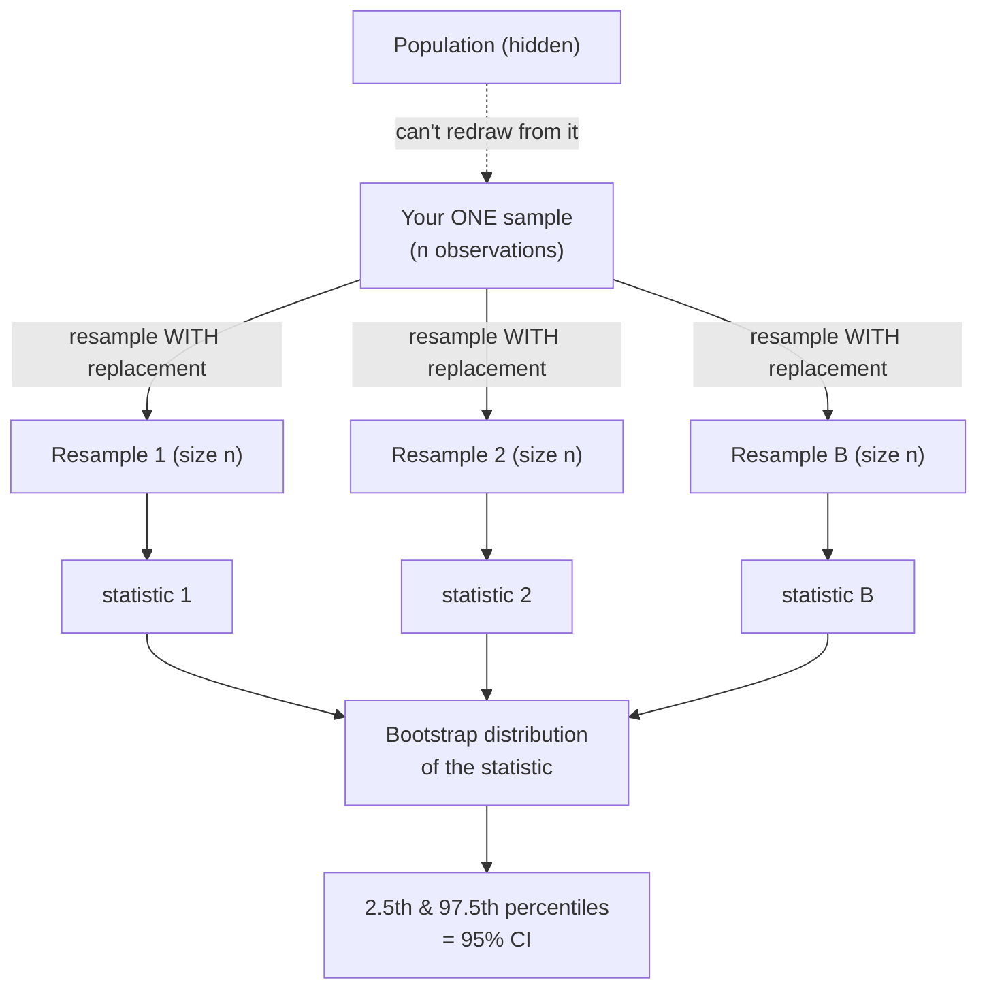
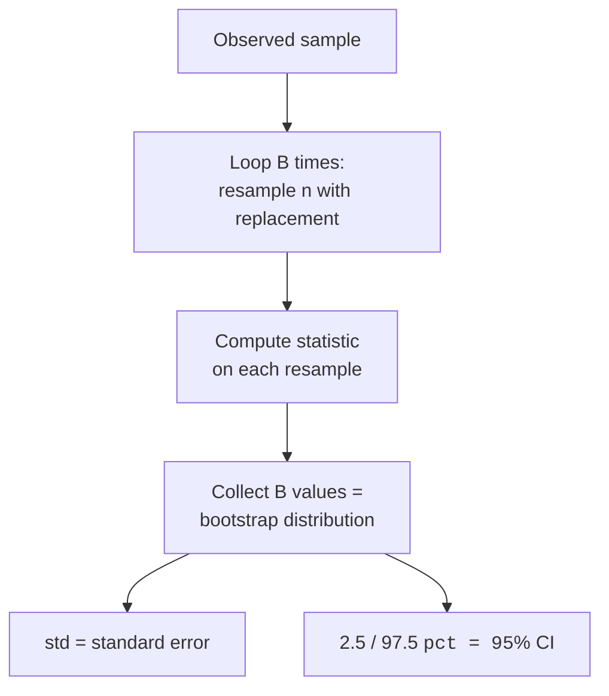
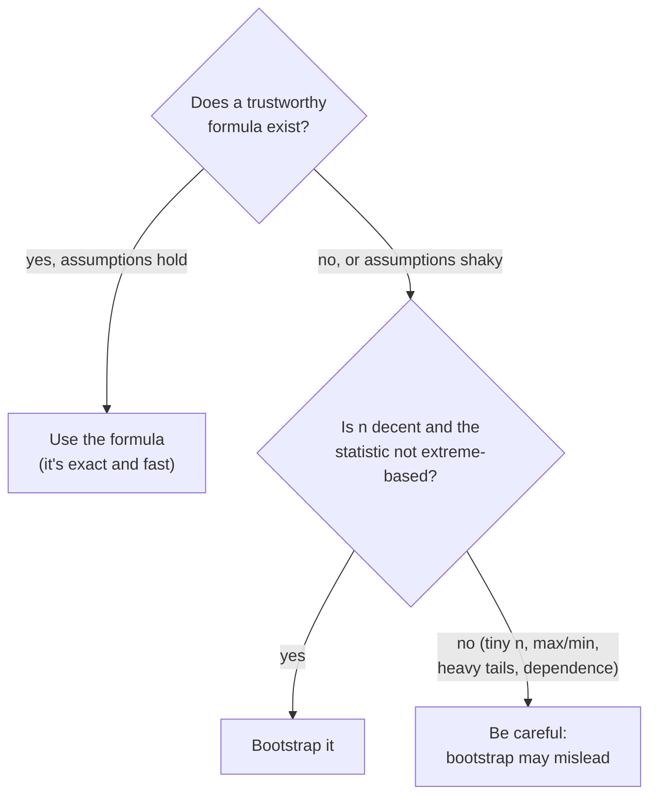

In *Confidence Intervals* every interval leaned on a formula: a known
standard error and a critical value from the t or normal distribution.
That works beautifully for the mean. But what's the standard error of a
**median**? A **trimmed mean**? A **correlation**, a **ratio of two
quantities**, the **90th percentile**? For most interesting statistics
the textbook formula is ugly, fragile, or simply doesn't exist, and
the normality assumptions behind the clean formulas may not hold for
your messy data anyway.

The **bootstrap** is the workaround, and it's one of the most liberating
ideas in modern statistics: instead of deriving a formula, you let the
computer *simulate* the sampling distribution by **resampling your own
data with replacement**. With a few lines of NumPy you get a standard
error and a confidence interval for almost any statistic, no calculus,
no distributional assumptions, no lookup tables.

<Figure
  slug="stat-bootstrap-cutout"
  alt="One sample tray on a platform being re-drawn from repeatedly with replacement, the copies stacking into a small mound"
/>

## The core idea: your sample stands in for the population

Recall the fundamental problem from *Sampling Distributions*: to know how
much a statistic wobbles, you'd want to draw many fresh samples from the
population and watch the statistic vary. But you can't, you only have
*one* sample, and the population is hidden.

<Figure
  slug="stat-the-bootstrap-inline-cutout"
  alt="One bucket of blocks being scooped from repeatedly with replacement, each scoop producing a summary tile, the tiles piling into a spread"
/>

The bootstrap's trick is a bold substitution: **treat your sample as if
it were the population.** Your sample is your single best picture of the
population, so drawing new samples *from your sample* mimics drawing new
samples from the population. The only wrinkle is that to keep each
resample the same size as the original, you must draw **with
replacement**, the same observation can appear more than once (and some
won't appear at all). That's what makes each resample *different* and
recreates the sampling variability.

The dashed arrow is the move you *can't* make (redraw from the
population); every solid arrow is something you *can* do on your laptop.
The spread of the bootstrap distribution estimates the standard error,
and its percentiles give a confidence interval directly.

<Callout type="info" title="Why 'with replacement' is non-negotiable">
If you resampled *without* replacement at the original size, you'd just
shuffle the same values and get the identical statistic every time, zero
variability, useless. Sampling **with replacement** lets some points
repeat and others drop out, so each resample is a slightly different
"plausible world." That variation across resamples is exactly what
mimics drawing fresh samples from the population.
</Callout>

## The algorithm in plain words

The percentile bootstrap is short enough to state in full:

1. Start with your observed sample of `n` values.
2. Draw a **resample**: pick `n` values from it *with replacement*.
3. Compute your statistic (mean, median, whatever) on that resample and
   record it.
4. Repeat steps 2-3 a large number of times, call it `B` (often
   2,000-10,000).
5. The recorded values form the **bootstrap distribution**. Its
   **standard deviation** estimates the standard error; its **2.5th and
   97.5th percentiles** are a **95% confidence interval**.

That's it. The same five steps work for any statistic, you only change
the function in step 3.

## Bootstrapping a mean (and checking it)

Let's implement it from scratch with NumPy. `rng.choice(data,
size=len(data), replace=True)` draws one resample. We loop `B` times,
take the mean each time, and read off the percentiles. As a sanity
check, we'll compare the bootstrap CI for the mean against the classic
t-interval from *Confidence Intervals*, they should land in nearly the
same place, which is reassuring evidence the bootstrap isn't magic, just
simulation.

<CodeBlock
  adapter="python"
  files={[
    {
      filename: "main.py",
      starterCode: `import numpy as np
from scipy import stats

rng = np.random.default_rng(42)

# One observed sample of 60 customer wait times (minutes).
data = rng.gamma(shape=2.0, scale=4.0, size=60)  # skewed, not normal

B = 5000
boot_means = np.empty(B)
for i in range(B):
    resample = rng.choice(data, size=len(data), replace=True)
    boot_means[i] = resample.mean()

# Percentile 95% CI: just read the 2.5th and 97.5th percentiles.
ci_low, ci_high = np.percentile(boot_means, [2.5, 97.5])
boot_se = boot_means.std(ddof=1)

# Compare to the textbook t-interval for the mean.
se_formula = data.std(ddof=1) / np.sqrt(len(data))
t_low, t_high = stats.t.interval(
    0.95, df=len(data) - 1, loc=data.mean(), scale=se_formula
)

print(f"observed mean        = {data.mean():.3f}")
print(f"bootstrap SE         = {boot_se:.3f}")
print(f"formula SE (s/sqrt n)= {se_formula:.3f}")
print()
print(f"bootstrap 95% CI = ({ci_low:.3f}, {ci_high:.3f})")
print(f"t-based   95% CI = ({t_low:.3f}, {t_high:.3f})")
print()
print("The two CIs nearly agree, the bootstrap reproduces the formula")
print("for the mean, then generalizes to statistics that HAVE no formula.")
`,
    },
  ]}
/>

The bootstrap standard error and the $s / \sqrt{n}$ formula match closely,
and the two intervals overlap almost exactly. For the mean, the
bootstrap is just a more roundabout way to get the familiar answer, the
payoff comes when there *is* no familiar answer.

<Callout type="tip" title="Vectorize when B is large">
The explicit loop is the clearest way to learn the bootstrap, and it's
fast enough for these examples. When you need speed, draw all resamples
at once: `idx = rng.integers(0, n, size=(B, n))` then
`stats[i] = data[idx].mean(axis=1)`. Same idea, no Python loop. Start
with the loop for understanding; reach for the vectorized form in
production.
</Callout>

## The payoff: a CI for the median, which has no easy formula

The mean has a tidy standard error. The **median** does not, its
formula is awkward and depends on the unknown density of the data at the
median. With the bootstrap you don't care: you resample, take the
*median* of each resample, and read off the percentiles. The procedure
is *identical* to the mean case except for one word.

<CodeBlock
  adapter="python"
  files={[
    {
      filename: "main.py",
      starterCode: `import numpy as np
import plotly.express as px

rng = np.random.default_rng(7)

# Skewed income-like data where the median is the honest summary.
data = rng.lognormal(mean=10.5, sigma=0.6, size=120)

B = 5000
boot_medians = np.empty(B)
for i in range(B):
    resample = rng.choice(data, size=len(data), replace=True)
    boot_medians[i] = np.median(resample)  # <-- only change vs. the mean

ci_low, ci_high = np.percentile(boot_medians, [2.5, 97.5])
boot_se = boot_medians.std(ddof=1)

fig = px.histogram(
    boot_medians,
    nbins=50,
    labels={"value": "bootstrap median"},
    title="Bootstrap distribution of the median",
    template="simple_white",
)
fig.add_vline(x=np.median(data), line_dash="dash", annotation_text="observed median")
fig.add_vline(x=ci_low, line_color="red")
fig.add_vline(x=ci_high, line_color="red")
fig.show()

print(f"observed median  = {np.median(data):,.0f}")
print(f"bootstrap SE     = {boot_se:,.0f}")
print(f"95% percentile CI= ({ci_low:,.0f}, {ci_high:,.0f})")
print()
print("No median-SE formula needed, the resampling did the work.")
`,
    },
  ]}
/>

The histogram *is* the sampling distribution of the median,
reconstructed from a single dataset. The red lines mark the 2.5th and
97.5th percentiles, the 95% CI. You'll often notice the bootstrap
distribution of the median looks chunky or stepped; that's a real
property of the median on a finite sample (it can only land on actual
data values), and it's a hint about one of the bootstrap's limits, which
we'll get to.

<Chart slug="bootstrap-distribution" />

<Callout type="success" title="One engine, any statistic">
The same five lines compute a CI for the mean, the median, a trimmed
mean, the 90th percentile, a correlation, or a ratio, swap the function
in the resample loop and nothing else changes. That generality is why
the bootstrap is a data scientist's Swiss-army knife: when you can't find
(or trust) a formula, you can almost always bootstrap.
</Callout>

### On real data: a CI for a median penguin

The synthetic income data made the point; a real dataset makes it stick.
The **Palmer penguins** dataset records body mass for 123 Gentoo
penguins. What's a 95% confidence interval for their *median* mass? No
formula required, resample and read off the percentiles.

<CodeBlock
  adapter="python"
  datasets={[{ path: "palmer-penguins.csv", stageAs: "penguins.csv" }]}
  files={[
    {
      filename: "main.py",
      initCode: `import numpy as np
import pandas as pd
rng = np.random.default_rng(0)
penguins = pd.read_csv("penguins.csv")`,
      starterCode: `gentoo_mass = penguins.loc[
    penguins["species"] == "Gentoo", "body_mass_g"
].dropna().to_numpy()

B = 5000
boot_medians = np.array([
    np.median(rng.choice(gentoo_mass, size=len(gentoo_mass), replace=True))
    for _ in range(B)
])
ci_low, ci_high = np.percentile(boot_medians, [2.5, 97.5])

print(f"observed median mass : {np.median(gentoo_mass):,.0f} g")
print(f"95% bootstrap CI     : ({ci_low:,.0f} g, {ci_high:,.0f} g)")
print(f"based on n = {len(gentoo_mass)} Gentoo penguins")
`,
    },
  ]}
/>

The interval is the honest version of "the typical Gentoo weighs about
5 kg": a range that accounts for the fact that these 123 penguins are
just a sample of all Gentoo penguins. Notice the CI is narrow because the
sample is decent-sized and body mass isn't wildly skewed, exactly the
conditions where the bootstrap behaves well.

## When to use the bootstrap, and when to be careful

The bootstrap is general, but it is **not** magic. It estimates
sampling variability *by reusing the data you have*, so it inherits that
data's flaws and runs out of information when the sample is thin.

**Reach for it when:**

- Your statistic has **no clean standard-error formula** (median,
  trimmed mean, ratio, correlation, percentile, Gini, etc.).
- The **assumptions behind a formula are shaky**, skewed data, unknown
  shape, and you'd rather not trust a normal approximation.
- You want a quick, assumption-light **sanity check** on a formula-based
  interval.

**Be cautious, or don't, when:**

- **`n` is very small.** With, say, 8 points, your sample is a poor
  stand-in for the population, so the bootstrap distribution is built on
  too little information. It can't conjure detail that isn't there.
- **The statistic depends on extremes**, like the **maximum** or
  **minimum**. Resampling can never produce a value larger than the
  biggest observation, so the bootstrap badly misrepresents the
  distribution of a max. Heavy-tailed data hurts for the same reason.
- **The data aren't independent** (time series, clustered/grouped data).
  Plain resampling scrambles the structure; you'd need a specialized
  variant (block bootstrap), which is beyond this page.

<Callout type="danger" title="The bootstrap cannot create information">
The single most important caveat: the bootstrap **does not add new data
and does not fix a bad sample.** If your sample is biased, collected
unfairly, or too small to represent the population, every resample
carries that same bias, and the bootstrap will hand you a confident
interval around the *wrong* center. Resampling estimates *precision*
(how much the statistic wobbles), not *accuracy* (whether you're aimed
at the truth). Garbage in, confidently-quantified garbage out.
</Callout>

## Practice the bootstrap

<ChallengeCard
  adapter="python"
  title="Bootstrap a 95% CI for the median"
  instructions={`A single \`data\` sample has been created for you. Build a **percentile bootstrap 95% confidence interval for the median** and store it as a tuple \`ci = (low, high)\`.

Steps:
- Use the provided \`rng\` and \`B = 4000\` resamples.
- Each iteration: \`resample = rng.choice(data, size=len(data), replace=True)\`, then record \`np.median(resample)\`.
- \`ci\` = the **2.5th and 97.5th percentiles** of the recorded medians, as a tuple of two floats with \`ci[0] < ci[1]\`.

Use \`np.percentile(boot, [2.5, 97.5])\`.`}
  files={[
    {
      filename: "main.py",
      initCode: `import numpy as np
rng = np.random.default_rng(123)
data = rng.lognormal(mean=3.0, sigma=0.5, size=80)
B = 4000`,
      starterCode: `import numpy as np

# TODO: fill boot with B bootstrap medians, then take the 2.5/97.5 percentiles
boot = np.empty(B)
ci = None
`,
      solutionCode: `import numpy as np

boot = np.empty(B)
for i in range(B):
    resample = rng.choice(data, size=len(data), replace=True)
    boot[i] = np.median(resample)

low, high = np.percentile(boot, [2.5, 97.5])
ci = (float(low), float(high))
print(ci)
`,
    },
  ]}
  tests={[
    {
      id: "shape",
      name: "ci is a 2-tuple of floats",
      description: "Returns (low, high)",
      code: `assert isinstance(ci, tuple) and len(ci) == 2
assert all(isinstance(v, float) for v in ci)`,
    },
    {
      id: "ordered",
      name: "low is below high",
      description: "Endpoints are ordered",
      code: `assert ci[0] < ci[1]`,
    },
    {
      id: "brackets_median",
      name: "interval brackets the observed median",
      description: "Observed median lies inside the CI",
      code: `import numpy as np
m = float(np.median(data))
assert ci[0] <= m <= ci[1]`,
    },
    {
      id: "plausible",
      name: "CI width is reasonable",
      description: "Roughly matches a bootstrap of the median",
      code: `import numpy as np
rng2 = np.random.default_rng(999)
b = np.array([np.median(rng2.choice(data, size=len(data), replace=True)) for _ in range(4000)])
lo, hi = np.percentile(b, [2.5, 97.5])
ref = hi - lo
got = ci[1] - ci[0]
assert 0.5 * ref < got < 2.0 * ref`,
    },
  ]}
/>

<ChallengeCard
  adapter="python"
  title="Bootstrap standard error of the mean"
  instructions={`Using the provided \`data\` and \`rng\`, build the bootstrap distribution of the **mean** with \`B = 4000\` resamples, then return the **bootstrap standard error**, the **standard deviation of the bootstrap means**, in a float variable named \`boot_se\`.

- Each iteration resamples \`len(data)\` values **with replacement** and records the mean.
- \`boot_se = float(np.std(boot_means, ddof=1))\`.

The bootstrap SE should land close to the textbook \`data.std(ddof=1) / sqrt(len(data))\`.`}
  files={[
    {
      filename: "main.py",
      initCode: `import numpy as np
rng = np.random.default_rng(7)
data = rng.normal(50.0, 8.0, size=100)
B = 4000`,
      starterCode: `import numpy as np

# TODO: collect B bootstrap means, then set boot_se = their std (ddof=1)
boot_means = np.empty(B)
boot_se = None
`,
      solutionCode: `import numpy as np

boot_means = np.empty(B)
for i in range(B):
    resample = rng.choice(data, size=len(data), replace=True)
    boot_means[i] = resample.mean()

boot_se = float(np.std(boot_means, ddof=1))
print(boot_se)
`,
    },
  ]}
  tests={[
    {
      id: "type",
      name: "boot_se is a float",
      description: "Returns a numeric standard error",
      code: `assert isinstance(boot_se, float)`,
    },
    {
      id: "positive",
      name: "boot_se is positive",
      description: "A standard error must be > 0",
      code: `assert boot_se > 0`,
    },
    {
      id: "matches_formula",
      name: "close to s/sqrt(n)",
      description: "Bootstrap SE approximates the formula SE",
      code: `import numpy as np
formula_se = float(np.std(data, ddof=1) / np.sqrt(len(data)))
assert abs(boot_se - formula_se) < 0.30 * formula_se`,
    },
  ]}
/>

<Callout type="tip" title="More resamples reduces simulation noise (not sampling noise)">
`B`, the number of resamples, controls only the **Monte Carlo** noise
of the bootstrap itself: a bigger `B` makes your estimated SE and CI
*stable* across reruns, but it does **not** make your estimate more
*accurate*. The accuracy is capped by your original sample size `n`.
Increasing `B` from 1,000 to 100,000 smooths the answer; only collecting
more real data (`n`) actually sharpens it. A few thousand resamples is
usually plenty.
</Callout>

## Check your understanding

<MultipleChoice
  markdown={`What is the defining mechanic of the bootstrap?

- Fitting a normal distribution to the data and reading off percentiles
  > That's a parametric, assumption-heavy approach. The bootstrap is prized precisely because it avoids assuming a distributional shape.
- [o] Repeatedly resampling your observed data **with replacement** and recomputing the statistic on each resample
  > Treating the sample as a stand-in for the population and resampling it with replacement reconstructs the statistic's sampling variability without any formula.
- Removing one observation at a time and refitting
  > That describes the jackknife, a different (leave-one-out) resampling method. The bootstrap draws full-size resamples with replacement instead.
- Drawing many fresh samples directly from the population
  > That's the procedure you *wish* you could run but can't, the population is hidden and you can't redraw from it. The bootstrap's whole point is to substitute for this with the data you already have.

The engine is resampling-with-replacement plus recomputing the statistic each time.`}
/>

<MultipleChoice
  markdown={`Why must bootstrap resampling be done **with replacement** (at the original sample size)?

- [o] Without replacement at size $n$ you'd just reorder the same values and get the identical statistic every time, producing zero variability
  > Replacement lets observations repeat or drop out, so each resample differs, that variation is what recreates the sampling distribution.
- Because sampling without replacement would be too slow to compute
  > Speed isn't the issue. The problem with sampling the full size *without* replacement is statistical, not computational.
- Because replacement guarantees each resample contains every original value
  > Replacement does the opposite: some values appear multiple times and others not at all. It doesn't guarantee full coverage of the original data.
- Because it makes the resamples larger than the original sample
  > Resamples are the *same* size $n$ as the original. Replacement changes which values appear, not the resample's size.

Replacement is what injects the variability that mimics drawing new samples.`}
/>

<MultipleChoice
  markdown={`The bootstrap is especially valuable for a statistic like the **median** mainly because:

- The median is impossible to compute without resampling
  > The median itself is trivial to compute directly. What's hard is its *standard error* and confidence interval, that's where the bootstrap helps.
- The bootstrap makes the median more accurate than the mean
  > The bootstrap estimates the *uncertainty* of a statistic; it doesn't make one statistic more accurate than another. Accuracy depends on the data and which summary you need.
- [o] The median has no simple standard-error formula, yet the bootstrap gives it a CI with the same procedure used for any other statistic
  > Statistics without clean variance formulas are exactly where the bootstrap shines, since you only swap the function computed on each resample.
- The median is always normally distributed, so the formula is easy
  > The sampling distribution of the median is generally not normal, which is part of why a tidy formula is hard, the opposite of this claim.

Awkward statistics with no easy formula are the bootstrap's home turf.`}
/>

<MultipleChoice
  markdown={`For which statistic is the ordinary bootstrap **least** trustworthy?

- The sample mean of 500 observations
  > With a healthy sample size, the bootstrap handles the mean very well, it closely matches the formula-based interval. This is a comfortable case, not a problem case.
- [o] The maximum of the sample
  > A resample can never exceed the largest observed value, so the bootstrap cannot reconstruct the distribution of the maximum, which lives in the extreme tail, it systematically misrepresents it.
- A trimmed mean of 300 observations
  > Trimmed means are smooth, formula-resistant statistics that the bootstrap estimates well. They're a good fit, not a failure case.
- The median of 200 observations
  > The bootstrap handles the median well at this sample size; in fact it's a flagship use case. This isn't where it breaks down.

Extreme-order statistics like the max (and heavy tails generally) are where plain bootstrapping fails.`}
/>

<MultipleChoice
  markdown={`Your sample of 40 sessions was accidentally drawn only from power users, so it's biased toward heavy usage. You bootstrap a 95% CI for mean session length. What does that interval tell you?

- A larger number of resamples B would remove the bias
  > Increasing $B$ only reduces the bootstrap's own simulation noise. Bias comes from how the original data were collected and is untouched by more resampling.
- [o] It quantifies the **precision** of the mean for *this biased sample*, but it's centered on the wrong value, the bootstrap estimates wobble, not whether you're aimed at the truth
  > Resampling captures sampling variability, not sampling bias, so a tight interval can sit confidently around a biased estimate; only better data fixes the aim.
- The interval corrects for the sampling bias and recovers the true population mean
  > The bootstrap can't fix a biased sample. Every resample is drawn from the same skewed data, so the bias is baked into all of them and into the interval's center.
- The interval is invalid and cannot be computed
  > It computes fine and is a valid interval *for the biased sampling process*. The issue isn't that it errors out; it's what the interval is centered on.

The bootstrap measures precision, not accuracy, it can't rescue a sample that was collected unfairly.`}
/>

<Callout type="success" title="Key takeaways">
- The bootstrap **resamples your data with replacement**, treating the sample as a stand-in for the population, to approximate a statistic's **sampling distribution**, no formula, no normality assumption.
- The **standard deviation** of the bootstrap distribution estimates the **standard error**; its **2.5th and 97.5th percentiles** give a **95% percentile confidence interval**.
- It works for **any statistic**, median, trimmed mean, ratio, correlation, percentile, by swapping one function in the resample loop.
- It struggles with **very small `n`**, **extreme-based statistics** (max/min), **heavy tails**, and **dependent data**.
- It estimates **precision, not accuracy**: it does **not** create new information or fix a **biased** sample. `B` controls only simulation noise; only more real data improves the estimate.
</Callout>

You now have two complementary routes to a confidence interval: the
formula-based intervals of *Confidence Intervals* when assumptions hold,
and the assumption-light bootstrap when they don't. Both rest on the
same foundation, the *Sampling Distributions* and *Standard Error* ideas
that describe how a statistic varies from sample to sample.
