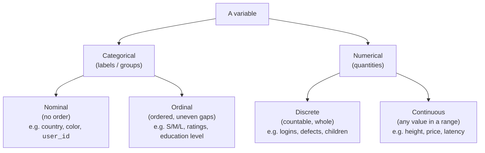
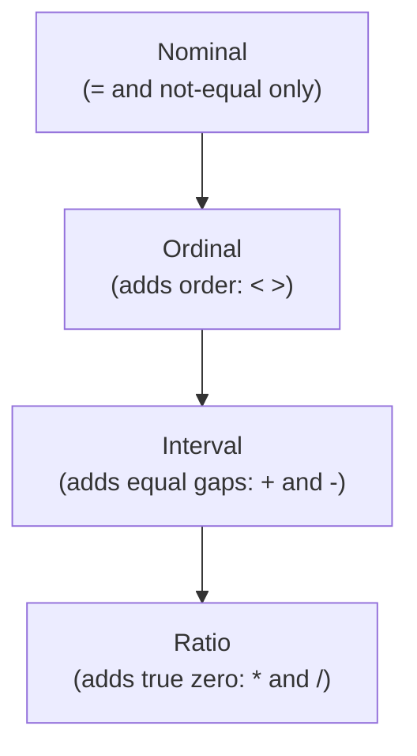
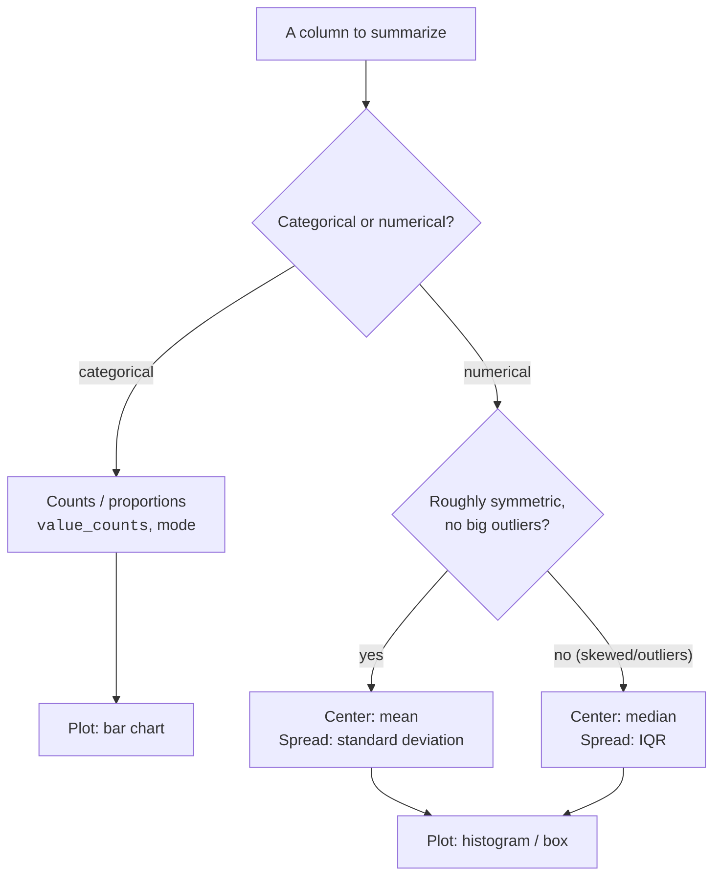

Before you compute a single statistic, you have to answer a question
that sounds trivial but quietly governs everything: *what kind of data
is this?* The type of a variable decides which summaries make sense,
which charts are honest, and which tests are even legal. Take the mean
of the wrong kind of column and you'll get a number, a clean,
confident, completely meaningless number.

The classic example: a survey stores favorite-flavor responses as `1 =
vanilla, 2 = chocolate, 3 = strawberry`. Average them and you might get
`1.8`. There is no flavor 1.8. The arithmetic ran fine; the *meaning*
is nonsense, because those numbers are labels, not quantities. This
page is about telling those apart, by eye and in pandas, so you never
ship a 1.8-flavored conclusion.

<Figure
  slug="stat-types-of-data-cutout"
  alt="Four sorting bins on a platform, two holding graded measuring rods and two holding unordered label plates"
/>

<Callout type="info" title="Why this page comes before the statistics">
Every later technique assumes you've classified your variables
correctly. *Measures of Center* asks "mean or mode?", the answer is a
type question. *Visualizing Distributions* asks "histogram or bar
chart?", also a type question. Pick the right type once and a dozen
downstream choices become obvious.
</Callout>

## The big split: categorical vs. numerical

At the top level, every variable is either **categorical** (it labels
*which group* something belongs to) or **numerical** (it measures *how
much* or *how many*). Each splits once more:

- **Nominal**, pure labels with **no inherent order**: country,
  payment method, color, `user_id`. You can count how many fall in each
  category, but "greater than" is meaningless.
- **Ordinal**, categories with a **meaningful order but unknown,
  uneven gaps**: shirt sizes S < M < L, a 1–5 satisfaction rating,
  education level. You can rank them, but the distance between
  "satisfied" and "very satisfied" isn't guaranteed equal to the
  distance between "neutral" and "satisfied."
- **Discrete numerical**, counts you get by tallying whole things:
  number of logins, defects per batch, children per household. Usually
  non-negative integers.
- **Continuous numerical**, measurements that can take any value in a
  range (limited only by instrument precision): height, temperature,
  price, response time.

<Callout type="tip" title="A fast field test">
Ask two questions. **(1) Can you order the values?** No → nominal.
**(2) If ordered, are the gaps equal and is arithmetic meaningful?** No
→ ordinal. Yes → numerical (then ask if it's a count → discrete, or a
measurement → continuous). Most classification mistakes come from
skipping question 2 and treating ordered labels as real numbers.
</Callout>

## The four measurement scales (the intuition)

A slightly finer lens, due to S.S. Stevens, splits data into four
**measurement scales**. You don't need the theory, you need the
practical rule each scale implies: *which operations are meaningful.*

| Scale | What it adds | Example | Mean OK? | "True zero"? |
| --- | --- | --- | --- | --- |
| **Nominal** | Names only | eye color, country | No | No |
| **Ordinal** | Order | S/M/L, Likert 1–5 | No (use median/mode) | No |
| **Interval** | Equal gaps | temperature in °C, calendar year | Yes (differences) | No |
| **Ratio** | True zero | height, price, count, duration | Yes (and ratios) | Yes |

The ladder is cumulative: each scale keeps the powers of the ones above
it and adds one. The two boundaries that trip people up:

- **Ordinal → interval.** Ordinal tells you the *order* but not the
  *spacing*. Averaging it pretends the gaps are equal when they aren't.
- **Interval → ratio.** Interval has equal gaps but **no true zero**,
  so *ratios* are meaningless. 20 °C is not "twice as hot" as 10 °C
  (the zero is arbitrary). Ratio scales have a real zero, so "twice as
  long" or "half the price" are valid.

<Callout type="warn" title="Common misconception: treating ordinal as interval">
The single most common scale error in data work is averaging an
ordinal variable. A 1–5 star rating *looks* numeric, so people report
"average rating 4.2." But the gap from 1 to 2 may not equal the gap
from 4 to 5, so the mean is built on an assumption you can't justify.
The honest summaries are the **median**, the **mode**, and the **full
distribution of counts** (how many 1s, 2s, …, 5s). Means of Likert
items are common in practice and sometimes defensible, but treat them
as a convenient approximation, not a rigorous summary, and never for
nominal codes.
</Callout>

## Choosing summaries by type

The payoff of all this taxonomy is a simple lookup: once you know the
type, the right summary and chart almost pick themselves.

- **Categorical (nominal or ordinal):** count categories with
  `value_counts()`; report the **mode** (most frequent) and
  proportions; visualize with a **bar chart**. For ordinal, the
  **median** category is also meaningful.
- **Numerical:** report **center** (mean if roughly symmetric, median
  if skewed) and **spread** (standard deviation or IQR); visualize with
  a **histogram** or **box plot**. We dig into these choices in
  *Measures of Center* and *Visualizing Distributions*.

<CodeBlock
  adapter="python"
  files={[
    {
      filename: "main.py",
      starterCode: `import pandas as pd

# A small mixed-type dataset: each column is a different data type.
df = pd.DataFrame(
    {
        "user_id": [101, 102, 103, 104, 105, 106],  # nominal (label!)
        "country": ["US", "UK", "US", "CA", "UK", "US"],  # nominal
        "plan": ["S", "L", "M", "M", "L", "S"],  # ordinal (S<M<L)
        "logins": [3, 0, 7, 2, 5, 1],  # discrete numeric
        "monthly_spend": [48.2, 0.0, 91.5, 33.1, 75.9, 12.0],  # continuous numeric
    }
)

print("dtypes (pandas' guess, not the same as statistical type!):")
print(df.dtypes)
print()

# Categorical -> counts / mode
print("country (nominal) value_counts:")
print(df["country"].value_counts())
print(f"\\nmost common plan (mode): {df['plan'].mode()[0]}")
print()

# Numerical -> mean / median / spread
print(f"mean logins (discrete):        {df['logins'].mean():.2f}")
print(f"median monthly_spend:          {df['monthly_spend'].median():.2f}")
print(f"std  monthly_spend:            {df['monthly_spend'].std():.2f}")
`,
    },
  ]}
/>

Notice that `user_id` is stored as an integer, so pandas reports its
dtype as `int64`, but it is **nominal**: the IDs are names that happen
to look like numbers. The next section is about exactly that trap.

## Encoding traps: when numbers aren't quantities

The most dangerous columns are the ones that *look* numerical but
aren't. pandas will happily compute `df["zip_code"].mean()` and hand
you a number. The dtype is `int64`; the meaning is gibberish.

<CodeBlock
  adapter="python"
  files={[
    {
      filename: "main.py",
      starterCode: `import pandas as pd

df = pd.DataFrame(
    {
        "zip_code": [10001, 60614, 94105, 30301],  # nominal, stored as int
        "rating_1to5": [5, 3, 4, 2],  # ordinal, stored as int
        "price_usd": [19.99, 5.00, 42.50, 8.25],  # ratio, genuinely numeric
    }
)

# pandas computes a "mean" for all three, only ONE of them means anything.
print("Mean of zip_code:    ", df["zip_code"].mean(), "  <- NONSENSE (zips are labels)")
print(
    "Mean of rating_1to5: ",
    df["rating_1to5"].mean(),
    "      <- shaky (ordinal: gaps not equal)",
)
print(
    "Mean of price_usd:   ",
    round(df["price_usd"].mean(), 2),
    "  <- valid (ratio scale)",
)
print()
print("Correct summaries instead:")
print("  zip_code     -> count distinct / mode:", df["zip_code"].mode().tolist())
print("  rating_1to5  -> median:", df["rating_1to5"].median())
print("  price_usd    -> mean is fine:", round(df["price_usd"].mean(), 2))
`,
    },
  ]}
/>

The averaged zip code (~48,705) isn't a place; it's the centroid of
four arbitrary labels. The rating mean is *less* wrong but still rests
on assuming equal spacing. Only `price_usd`, a true ratio quantity,
earns its mean.

<Callout type="danger" title="The numeric-looking ID trap">
If a column's numbers are **identifiers or codes**, `user_id`,
`zip_code`, `store_number`, `product_sku`, encoded categories like
`1=vanilla`, then **arithmetic on them is meaningless** no matter what
the dtype says. A reliable tell: would `value + value` or `value / 2`
mean anything? For a zip code or a flavor code, no. Cast these to
`category` (or `str`) so you don't accidentally average a label. The
computer can't tell a quantity from a code, that judgment is yours.
</Callout>

<MultipleChoice
  markdown={`A \`postal_code\` column is stored as integers. A teammate computes its mean to "find the typical region." What's the problem?

- [o] Postal code is nominal (a label that happens to look numeric), so averaging it is meaningless; count or mode is appropriate
  > Recognizing the column as a nominal identifier, where addition and division carry no meaning, leads to the right summaries: distinct counts or the most common code.
- The mean is fine; it gives the geographic center
  > A postal code's digits are an arbitrary label, not a coordinate, so their average doesn't correspond to any location or "center." The numeric storage is incidental.
- The mean is only valid if the codes are sorted first
  > Sorting changes nothing about whether the values are quantities. They're labels, so no ordering or arrangement makes their mean meaningful.
- Postal codes should be floats, not integers
  > Changing the numeric subtype wouldn't help, the issue isn't precision, it's that arithmetic on a nominal label is meaningless regardless of how it's stored.

Numeric-looking IDs are nominal; treat them as categories, not quantities.`}
/>

## pandas dtypes vs. statistical type

A crucial habit: **a pandas dtype is not a statistical type.** The
dtype tells you how the bytes are stored (`int64`, `float64`, `object`,
`category`); the statistical type is a judgment about *meaning* that
only you can make. They often disagree.

| Statistical type | Typical pandas dtype | But watch out |
| --- | --- | --- |
| Nominal | `object`, `category` | …or `int64` for ID/zip codes |
| Ordinal | `category` (ordered) | …often a bare `int64` for ratings |
| Discrete numeric | `int64` | …genuinely counts, arithmetic OK |
| Continuous numeric | `float64` | usually trustworthy |

Two practical moves. First, convert genuine categoricals to the
`category` dtype, it saves memory and signals intent. Second, for
**ordinal** data, make an *ordered* categorical so pandas knows
`S < M < L`, which unlocks a correct `.median()` and proper sorting.

<CodeBlock
  adapter="python"
  files={[
    {
      filename: "main.py",
      starterCode: `import pandas as pd
from pandas.api.types import CategoricalDtype

df = pd.DataFrame(
    {
        "plan": ["S", "L", "M", "M", "L", "S", "M"],  # ordinal
        "region_code": [12, 7, 12, 3, 7, 3, 12],  # nominal, looks numeric
    }
)

# 1) Nominal: make it an (unordered) category so no one averages the code.
df["region_code"] = df["region_code"].astype("category")

# 2) Ordinal: declare the order so comparisons and median are meaningful.
plan_order = CategoricalDtype(categories=["S", "M", "L"], ordered=True)
df["plan"] = df["plan"].astype(plan_order)

print("Now plan is ORDERED:", df["plan"].cat.ordered)
print("S < M is", df["plan"].iloc[0] < df["plan"].iloc[1])  # S < L -> True
print()
print("Median plan (valid because ordinal+ordered):", df["plan"].median())
print()
print(
    "region_code dtype is now:",
    df["region_code"].dtype,
    "-> averaging it is off the table",
)
print(df["region_code"].value_counts())
`,
    },
  ]}
/>

<Callout type="info" title="Likert scales: the gray zone">
Survey scales ("Strongly disagree" … "Strongly agree", coded 1–5) are
**ordinal**. Purists summarize them with the median, mode, and the
distribution of responses. In practice, analysts very often average
Likert items (and treat sums of many items as roughly interval), it's
a widespread, useful approximation. Just know you're *assuming* equal
spacing when you do, report it honestly, and never extend the habit to
**nominal** codes, where a mean has no meaning at all.
</Callout>

## Classify and summarize correctly

<ChallengeCard
  adapter="python"
  title="Classify each column's statistical type"
  instructions={`A DataFrame \`df\` has several columns. Build a dict named \`types\` mapping **each column name** to its statistical type as one of these exact lowercase strings:

- \`"nominal"\`, unordered label (including numeric-looking IDs/codes)
- \`"ordinal"\`, ordered categories with uneven gaps
- \`"discrete"\`, countable whole-number quantity
- \`"continuous"\`, measured quantity that can take any value in a range

Classify by **meaning**, not by dtype. The columns are:
- \`customer_id\` (an identifier), \`country\` (a label), \`satisfaction\` (1–5 rating), \`num_purchases\` (a count), \`account_balance\` (a dollar amount).

\`types\` must have exactly those 5 keys.`}
  files={[
    {
      filename: "main.py",
      initCode: `import pandas as pd

df = pd.DataFrame({
    "customer_id":    [501, 502, 503, 504],
    "country":        ["US", "CA", "US", "MX"],
    "satisfaction":   [4, 5, 2, 3],
    "num_purchases":  [1, 0, 7, 3],
    "account_balance":[120.50, 0.0, 980.25, 45.10],
})`,
      starterCode: `# TODO: classify each column by its STATISTICAL type (not its dtype)
types = {
    "customer_id": None,
    "country": None,
    "satisfaction": None,
    "num_purchases": None,
    "account_balance": None,
}
`,
      solutionCode: `types = {
    "customer_id": "nominal",  # an ID that looks numeric
    "country": "nominal",  # unordered label
    "satisfaction": "ordinal",  # ordered 1-5 rating, uneven gaps
    "num_purchases": "discrete",  # a count
    "account_balance": "continuous",  # a measured dollar amount
}
print(types)
`,
    },
  ]}
  tests={[
    {
      id: "keys",
      name: "all five columns are classified",
      description: "Dict has exactly the five column names",
      code: `assert set(types.keys()) == {"customer_id", "country", "satisfaction", "num_purchases", "account_balance"}`,
    },
    {
      id: "valid_labels",
      name: "labels are from the allowed set",
      description: "Every value is one of the four type strings",
      code: `allowed = {"nominal", "ordinal", "discrete", "continuous"}
assert all(v in allowed for v in types.values()), "use only the four allowed lowercase strings"`,
    },
    {
      id: "id_nominal",
      name: "the ID is nominal",
      description: "Numeric-looking identifier classified as nominal",
      code: `assert types["customer_id"] == "nominal"`,
    },
    {
      id: "ordinal_rating",
      name: "the rating is ordinal",
      description: "1-5 satisfaction is ordinal",
      code: `assert types["satisfaction"] == "ordinal"`,
    },
    {
      id: "numeric_split",
      name: "count vs measurement split correctly",
      description: "Purchases discrete, balance continuous",
      code: `assert types["num_purchases"] == "discrete"
assert types["account_balance"] == "continuous"
assert types["country"] == "nominal"`,
    },
  ]}
/>

<ChallengeCard
  adapter="python"
  title="Compute the right summary for the type"
  instructions={`You're given three columns of different types. Compute the **type-appropriate** summary for each into a dict named \`summary\`:

- \`"country_mode"\`, the **mode** (most common value) of the nominal \`country\` column, as a string. Use \`df["country"].mode()[0]\`.
- \`"rating_median"\`, the **median** of the ordinal \`rating\` column, as a float.
- \`"price_mean"\`, the **mean** of the continuous \`price\` column, as a float.

The point: mode for nominal, median for ordinal, mean for continuous, *not* a mean for all three.`}
  files={[
    {
      filename: "main.py",
      initCode: `import pandas as pd

df = pd.DataFrame({
    "country": ["US", "US", "UK", "CA", "US", "UK"],  # nominal
    "rating":  [5, 3, 4, 4, 2, 5],                     # ordinal (1-5)
    "price":   [19.99, 5.0, 42.5, 8.25, 30.0, 12.0],   # continuous
})`,
      starterCode: `# TODO: pick the summary that MATCHES each column's type
summary = {
    "country_mode": None,
    "rating_median": None,
    "price_mean": None,
}
`,
      solutionCode: `summary = {
    "country_mode": str(df["country"].mode()[0]),
    "rating_median": float(df["rating"].median()),
    "price_mean": float(df["price"].mean()),
}
print(summary)
`,
    },
  ]}
  tests={[
    {
      id: "keys",
      name: "summary has the right keys",
      description: "Three expected keys present",
      code: `assert set(summary.keys()) == {"country_mode", "rating_median", "price_mean"}`,
    },
    {
      id: "mode_value",
      name: "country_mode is the correct mode",
      description: "Most frequent country is US",
      code: `assert summary["country_mode"] == "US"`,
    },
    {
      id: "median_value",
      name: "rating_median is correct",
      description: "Median of the ordinal rating",
      code: `import pandas as pd
s = pd.Series([5, 3, 4, 4, 2, 5])
assert isinstance(summary["rating_median"], float)
assert abs(summary["rating_median"] - float(s.median())) < 1e-9`,
    },
    {
      id: "mean_value",
      name: "price_mean is correct",
      description: "Mean of the continuous price",
      code: `import pandas as pd
s = pd.Series([19.99, 5.0, 42.5, 8.25, 30.0, 12.0])
assert isinstance(summary["price_mean"], float)
assert abs(summary["price_mean"] - float(s.mean())) < 1e-9`,
    },
  ]}
/>

<Callout type="tip" title="The reflex to build">
Before you call `.mean()` on any column, ask: *is this column a
quantity, or a label/rank wearing a number costume?* Quantities
(discrete, continuous, ratio/interval) can be averaged. Labels
(nominal) and ranks (ordinal) want counts, modes, and medians instead.
</Callout>

## Why type also decides which tests are valid

This page is the gateway to the inference chapters, because the *type*
of your variables decides which statistical **test** is appropriate,
not just which summary. A quick preview of where this leads:

- Comparing a **numerical** outcome across two groups → a **t-test**
  (see *T-Tests*).
- Comparing a **numerical** outcome across three or more groups →
  **ANOVA**.
- Testing whether two **categorical** variables are associated → a
  **chi-square** test.
- Measuring the relationship between two **numerical** variables →
  **correlation**.

We cover these in *ANOVA and Chi-Square* and *Correlation and
Nonparametric*. For now, just register the pattern: **getting the
variable type right is the first step of choosing a valid test**, long
before any p-value appears.

## Check your understanding

<MultipleChoice
  markdown={`Which variable is **ordinal** (ordered categories with possibly uneven gaps), rather than nominal or numerical?

- A randomly assigned account number
  > An account number is a nominal label; its numeric appearance doesn't give it a meaningful order.
- The exact price paid in dollars
  > Price is a continuous ratio quantity with equal gaps and a true zero, fully numerical, not ordinal.
- A user's country of residence
  > Countries have no inherent order, so this is nominal, you can't say one country is "greater than" another.
- [o] T-shirt size recorded as S, M, L, XL
  > Sizes have a clear order (S < M < L < XL) but the gaps between them aren't guaranteed equal, which is exactly the ordinal case.

Ordinal data can be ranked but its spacing is unknown, so it sits between nominal and numerical.`}
/>

<MultipleChoice
  markdown={`Why is "20 °C is twice as warm as 10 °C" an incorrect statement, statistically speaking?

- Because the values should be averaged first
  > Averaging is unrelated to whether a ratio statement is valid. The problem is the scale, not a missing calculation.
- Because 10 and 20 are too close together to compare
  > The numeric closeness is irrelevant; the same ratio claim fails for 10 °C and 40 °C too. The reason is the missing true zero, not the gap size.
- [o] Because Celsius is an interval scale with an arbitrary zero, so ratios like "twice as warm" aren't meaningful
  > Recognizing that the Celsius zero is a convention (not an absence of heat) is why differences are valid but ratios are not, the defining limitation of an interval scale.
- Because temperature is nominal and can't be compared at all
  > Temperature can certainly be ordered and its differences are meaningful, so it isn't nominal. The issue is specifically about ratios, not comparison.

Interval scales support differences but not ratios; only ratio scales (with a true zero) support "twice as much."`}
/>

<MultipleChoice
  markdown={`A dataset codes survey answers as \`1=Disagree, 2=Neutral, 3=Agree\`. Someone reports the **mean** of this column as the headline summary. What's the most accurate critique?

- Nothing is wrong as long as the sample is large
  > Sample size doesn't repair an ordinal-as-interval assumption; a large sample just gives a precise estimate of a quantity whose meaning is already shaky.
- [o] The codes are ordinal, so the gaps between them may not be equal; the median or the distribution of responses is a more defensible summary than the mean
  > Treating the codes as ordinal, where the mean rests on an unverified equal-spacing assumption, points to the median and the response counts as the safer summaries.
- The mean is perfectly valid because the codes are numbers
  > The values being stored as numbers doesn't make them quantities. They're ordered labels, so the equal-spacing the mean assumes isn't justified.
- The column should have been continuous
  > The underlying construct is inherently an ordered category, not a measured quantity; it can't simply be redefined as continuous. The fix is the summary, not the data type.

Averaging ordinal codes silently assumes equal spacing; medians and count distributions avoid that assumption.`}
/>

<MultipleChoice
  markdown={`A column \`store_id\` has dtype \`int64\` in pandas. What does that tell you about its statistical type?

- It means the column is ordinal
  > Nothing about the \`int64\` dtype implies an order among store IDs. They're labels; the dtype is silent on statistical type.
- [o] Almost nothing, dtype is about storage, and an integer column can be a nominal ID where arithmetic is meaningless
  > Separating the storage dtype from the statistical type is the key insight: a numeric dtype doesn't license a mean, and IDs are nominal despite looking numeric.
- It confirms the column is numerical and can be averaged
  > A dtype describes storage, not meaning. An \`int64\` column can easily be a nominal label, in which case averaging it is meaningless.
- It guarantees there are no missing values
  > The dtype says nothing about completeness, and historically integer columns couldn't even hold missing values cleanly. It's unrelated to the statistical type.

The pandas dtype tells you how values are stored, never whether arithmetic on them is meaningful, that's your call.`}
/>

<Callout type="success" title="Key takeaways">
- Every variable is **categorical** (nominal/ordinal) or **numerical** (discrete/continuous); the type governs valid summaries, charts, and tests.
- The four **measurement scales**, nominal, ordinal, interval, ratio, each unlock more operations; interval lacks a true zero (no ratios), ratio has one.
- **Don't average labels or ranks**: nominal → counts/mode, ordinal → median/mode/distribution, numerical → mean (or median if skewed).
- **pandas dtype is not statistical type**: numeric-looking IDs, zip codes, and category codes are nominal even when stored as `int64`.
- Getting the type right is the **first step** in choosing a valid statistical test.
</Callout>

With variable types straight, you're ready to summarize them honestly.
*Measures of Center* picks the right "typical value" for each type,
*Visualizing Distributions* matches charts to types, and *ANOVA and
Chi-Square* shows how categorical variables get tested for real.
