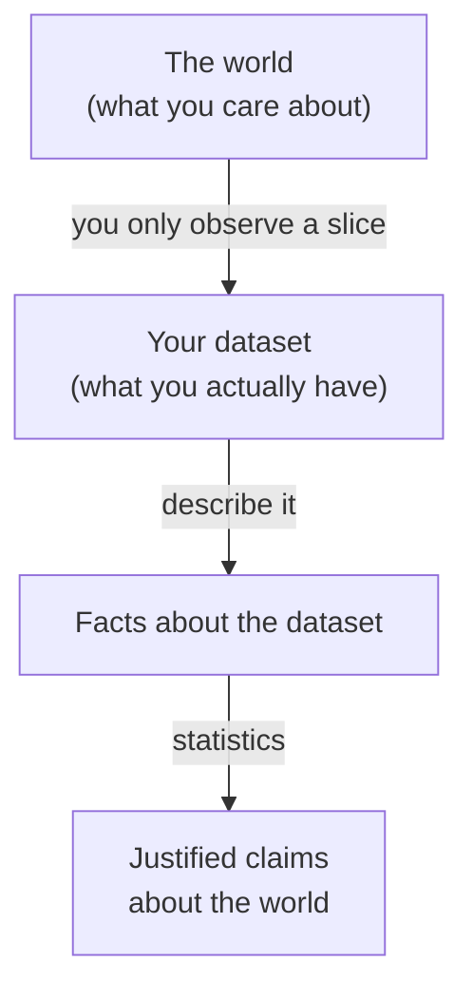
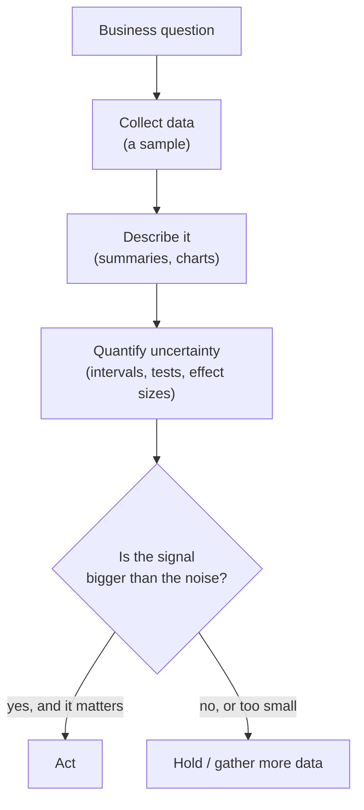

You have the data. It's clean, it's in a DataFrame, the chart renders.
So why do you need statistics at all — can't you just *read off the
answer*?

Sometimes, yes. If you want to know *how many orders shipped
yesterday*, you count them. Done. But almost every interesting
question in data science isn't about the rows you have — it's about a
larger reality you can't see directly. "Will this checkout redesign
increase conversion?" "Are our two warehouses really performing
differently?" "Is churn going up, or did we just have a noisy month?"
For those, the data in front of you is a *clue*, not the answer. This
short page is about why.

<svg
  viewBox="0 0 640 220"
  role="img"
  aria-label="A small bright window frames a handful of solid blue dots inside a vast faint field of dots; a red dot waits just outside the frame and the ringed yellow point you actually care about sits far away — your dataset is one lit slice of a much larger world"
  style={{ display: "block", width: "100%", maxWidth: "640px", height: "auto", margin: "2.5rem auto" }}
>
  <rect x="40" y="24" width="560" height="172" rx="16" fill="currentColor" opacity="0.06" />
  <g fill="var(--ds-gray-400)">
    <circle cx="70" cy="50" r="3" />
    <circle cx="90" cy="110" r="3" />
    <circle cx="70" cy="170" r="3" />
    <circle cx="270" cy="50" r="3" />
    <circle cx="300" cy="95" r="3" />
    <circle cx="282" cy="152" r="3" />
    <circle cx="330" cy="180" r="3" />
    <circle cx="360" cy="62" r="3" />
    <circle cx="390" cy="122" r="3" />
    <circle cx="420" cy="172" r="3" />
    <circle cx="450" cy="45" r="3" />
    <circle cx="472" cy="148" r="3" />
    <circle cx="530" cy="62" r="3" />
    <circle cx="556" cy="124" r="3" />
    <circle cx="574" cy="176" r="3" />
    <circle cx="170" cy="42" r="3" />
    <circle cx="220" cy="44" r="3" />
    <circle cx="132" cy="182" r="3" />
    <circle cx="196" cy="184" r="3" />
    <circle cx="496" cy="92" r="3" />
  </g>
  <g style={{ color: "var(--ds-blue-500)" }} fill="currentColor">
    <rect x="108" y="66" width="134" height="98" rx="10" fillOpacity="0.12" />
    <rect x="108" y="66" width="134" height="5" rx="2.5" fillOpacity="0.8" />
    <rect x="108" y="159" width="134" height="5" rx="2.5" fillOpacity="0.8" />
    <rect x="108" y="66" width="5" height="98" rx="2.5" fillOpacity="0.8" />
    <rect x="237" y="66" width="5" height="98" rx="2.5" fillOpacity="0.8" />
    <circle cx="130" cy="95" r="4" />
    <circle cx="155" cy="85" r="4" />
    <circle cx="180" cy="105" r="4" />
    <circle cx="205" cy="90" r="4" />
    <circle cx="140" cy="130" r="4" />
    <circle cx="170" cy="140" r="4" />
    <circle cx="200" cy="125" r="4" />
    <circle cx="220" cy="147" r="4" />
  </g>
  <g style={{ color: "var(--ds-red-500)" }} fill="currentColor">
    <circle cx="258" cy="112" r="4" fillOpacity="0.9" />
  </g>
  <g style={{ color: "var(--ds-yellow-500)" }} fill="currentColor">
    <circle cx="520" cy="108" r="14" fillOpacity="0.18" />
    <circle cx="520" cy="108" r="7" />
  </g>
</svg>

## Why data alone is often not enough

Raw data answers questions about *itself*. Statistics answers
questions about the *world the data came from*. Those are different
things, and the gap between them is where careers are made or wrecked.

A spreadsheet of 500 surveyed customers can tell you, exactly, how
those 500 people answered. But you don't care about those 500 people —
you care about the *hundreds of thousands* you didn't survey. Crossing
from "what these 500 said" to "what our customers think" is not a
Pandas operation. It's a *statistical* one, and it can only be done
with an honest accounting of uncertainty.

<Callout type="info" title="Description vs. inference">
Counting, averaging, and charting what you have is **description** —
it's always exactly true about your data. Using that data to make
claims about something bigger is **inference** — and inference is
never certain. This course is mostly about doing inference *honestly*.
</Callout>

## Why uncertainty exists in real datasets

Uncertainty isn't a sign that you collected the data badly. It's
baked into the situation. It comes from at least three unavoidable
sources:

- **You measured a sample, not everything.** You surveyed 500 of
  300,000 customers. A different 500 would have given different
  numbers. That wobble is *sampling uncertainty*.
- **Measurement is imperfect.** Sensors drift, people round their
  answers, timestamps get logged in the wrong timezone, a survey
  question is read two different ways.
- **The world itself is variable.** Real processes have natural
  spread. Daily sales aren't a constant 100 — they're 95, 110, 88,
  130, even if *nothing* about the business changed.

<CodeBlock
  adapter="python"
  files={[
    {
      filename: "main.py",
      starterCode: `import numpy as np

rng = np.random.default_rng(42)

# Imagine the "true" average daily sales is exactly 100 — nothing changes.
# But each day, ordinary randomness pushes the number around.
week = rng.normal(loc=100, scale=12, size=7).round(0)

print("Seven days of sales from an unchanging process:")
print(week)
print(f"\\nHighest day is {week.max():.0f}, lowest is {week.min():.0f}.")
print("If you only saw two of these days, you might invent a 'trend'")
print("that isn't there.")
`,
    },
  ]}
/>

Nothing in that business changed, yet the numbers swing by 30+ units.
If you cherry-pick the high day and the low day, you can tell any
story you like. Statistics is what stops you.

## Why randomness matters

Randomness is the reason a difference between two numbers might mean
**nothing**. This is the single most important habit this course will
build: when you see that Group A's average is higher than Group B's,
your first thought should not be "*A is better*" — it should be
"*could this gap just be luck?*"

<CodeBlock
  adapter="python"
  files={[
    {
      filename: "main.py",
      starterCode: `import numpy as np

rng = np.random.default_rng(0)

# Two groups drawn from the SAME process. Any difference is pure chance.
# We repeat the "experiment" 5 times and watch the gap jump around.
for trial in range(5):
    a = rng.normal(50, 10, size=40)
    b = rng.normal(50, 10, size=40)
    print(
        f"Trial {trial + 1}: A={a.mean():5.2f}  B={b.mean():5.2f}  "
        f"gap={a.mean() - b.mean():+5.2f}"
    )

print("\\nSame underlying truth every time — the gap is just noise.")
`,
    },
  ]}
/>

Watch the `gap` column: +2, then −3, then +1... There's no real
difference anywhere, yet the gap is never exactly zero. **Random
variation manufactures fake differences for free.** Your job is to
tell those apart from real ones — and that requires a model of how big
"normal" random wiggles can get. That model is what probability and
sampling distributions give you.

<svg
  viewBox="0 0 640 210"
  role="img"
  aria-label="Five repeated experiments drawn from one identical process: paired blue and green dots wobble around the same center line, their yellow gaps flipping direction at random, and one run's red gap looks big enough to be a discovery — random variation manufactures differences for free"
  style={{ display: "block", width: "100%", maxWidth: "560px", height: "auto", margin: "2.5rem auto" }}
>
  <rect x="318" y="24" width="4" height="164" rx="2" fill="var(--ds-gray-400)" />
  <g fill="var(--ds-gray-200)">
    <rect x="170" y="38" width="300" height="3" rx="1.5" />
    <rect x="170" y="70" width="300" height="3" rx="1.5" />
    <rect x="170" y="102" width="300" height="3" rx="1.5" />
    <rect x="170" y="134" width="300" height="3" rx="1.5" />
    <rect x="170" y="166" width="300" height="3" rx="1.5" />
  </g>
  <g style={{ color: "var(--ds-yellow-500)" }} fill="currentColor">
    <rect x="306" y="38.5" width="24" height="3" rx="1.5" />
    <rect x="314" y="70.5" width="26" height="3" rx="1.5" />
    <rect x="320" y="102.5" width="6" height="3" rx="1.5" />
    <rect x="324" y="166.5" width="8" height="3" rx="1.5" />
  </g>
  <g style={{ color: "var(--ds-red-500)" }} fill="currentColor">
    <rect x="282" y="134.5" width="84" height="3" rx="1.5" />
  </g>
  <g style={{ color: "var(--ds-blue-500)" }} fill="currentColor">
    <circle cx="300" cy="40" r="5.5" />
    <circle cx="346" cy="72" r="5.5" />
    <circle cx="326" cy="104" r="5.5" />
    <circle cx="276" cy="136" r="5.5" />
    <circle cx="338" cy="168" r="5.5" />
  </g>
  <g style={{ color: "var(--ds-green-500)" }} fill="currentColor">
    <circle cx="336" cy="40" r="5.5" />
    <circle cx="308" cy="72" r="5.5" />
    <circle cx="314" cy="104" r="5.5" />
    <circle cx="372" cy="136" r="5.5" />
    <circle cx="318" cy="168" r="5.5" />
  </g>
</svg>

<Callout type="warn" title="The most common mistake in data work">
Treating any difference as meaningful just because it's nonzero. With
real data, two groups *always* differ a little. The question is never
"are they different?" — it's "are they different by *more than chance
can explain*?"
</Callout>

## Why analysts need statistics: it supports decisions

Data science exists to support **decisions**: ship or don't ship,
investigate or move on, invest more or cut losses. Decisions made on
noise are expensive. Statistics is the layer that turns "here's a
number" into "here's a number, here's how confident we are, and here's
what could still go wrong."

Notice that "describe it" is just one box. A huge share of the value —
and almost everything that separates a senior data scientist from a
dashboard — lives in the "quantify uncertainty" step. That's the step
this course is about.

## Why data science leans so heavily on statistical reasoning

Machine learning, experimentation, forecasting, and analytics all rest
on the same foundation: reasoning from a limited, noisy sample to a
general conclusion. A model trained on last year's data is a *sample*;
asking whether it'll work next year is a *statistical* question. An
A/B test is a textbook hypothesis test. "Is this metric trending or
just noisy?" is a question about sampling variability.

<Callout type="success" title="The throughline">
Nearly every hard question in data science reduces to the same shape:
*"I observed something in a noisy, partial sample. How much of it is
real, and how confident can I be?"* Statistical reasoning is the
general-purpose tool for that shape — which is why it shows up
everywhere.
</Callout>

## Check your understanding

<MultipleChoice
  markdown={`You survey 500 customers and find 62% prefer the new design. What is the *honest* way to describe this result?

- Exactly 62% of all our customers prefer the new design
  > The 62% is exactly true only of the 500 people you surveyed. Extending it to all customers requires accounting for sampling uncertainty — a different 500 would give a different number.
- [o] In this sample, 62% preferred it; the true population preference is probably near 62% but uncertain, and we'd want to quantify that uncertainty
  > This separates what the data literally says (a fact about the sample) from the claim about the population (an inference that carries uncertainty).
- The survey proves the new design is better
  > "Proves" is far too strong, and "better" is a different question from "preferred." A single sample with no uncertainty estimate proves nothing.
- 62% is meaningless because it's only 500 people
  > 500 is actually a useful sample size. The number isn't meaningless — it just needs an honest uncertainty estimate attached, which is exactly what statistics provides.

The whole course is about attaching honest uncertainty to numbers like this.`}
/>

<MultipleChoice
  markdown={`Daily sales for an unchanged business are 95, 110, 88, 130, 102. A manager points at 88 and 130 and says "something happened mid-week!" What's the best statistical response?

- They're right — a 42-unit swing must have a cause
  > A swing existing doesn't mean a *cause* exists. Stable processes routinely produce swings this size purely from natural variation.
- [o] That swing is well within the normal random variation of a stable process, so there's no reason to invent a cause yet
  > Recognizing that ordinary processes have spread — and that picking the extremes exaggerates it — is the core instinct this page is building.
- We should remove 88 and 130 as outliers
  > These aren't errors to delete; they're ordinary draws from a variable process. Deleting them would hide the real variability.
- We can't say anything without more data
  > We can say something useful right now: a swing of this size is unremarkable for a process with this much natural spread.

Cherry-picking the highest and lowest points is how noise gets mistaken for signal.`}
/>

<MultipleChoice
  markdown={`Which of these is a question that *description alone* can answer, with no statistical inference needed?

- Will next month's revenue beat this month's?
  > This is about the future/unobserved — it requires inference and uncertainty, not just description.
- Do our premium users churn less than free users in general?
  > "In general" reaches beyond your data to the broader population, which is inference.
- [o] How many orders are in this table that shipped yesterday?
  > This is a fact entirely contained in the data you already have — you just count it. No leap to a larger population is involved.
- Is the new layout better than the old one?
  > Comparing "better" generalizes from a sample to future users — an inferential, statistical question.

Description is exact but limited to the rows you have; inference is uncertain but answers the questions you usually care about.`}
/>

<Callout type="tip" title="Carry this forward">
For the rest of the course, train one reflex: whenever you see a
number, ask *"this is a fact about my sample — what is it trying to
tell me about the world, and how sure can I be?"* Everything else is
machinery in service of that question.
</Callout>
