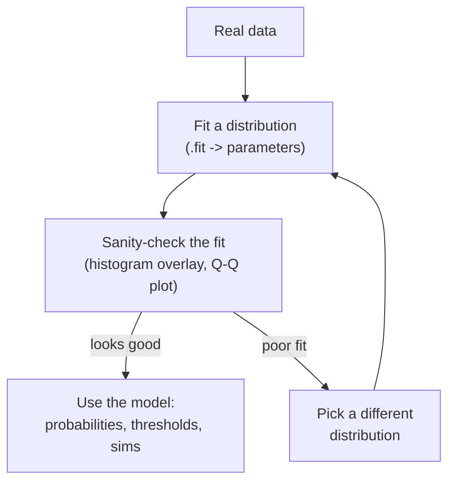
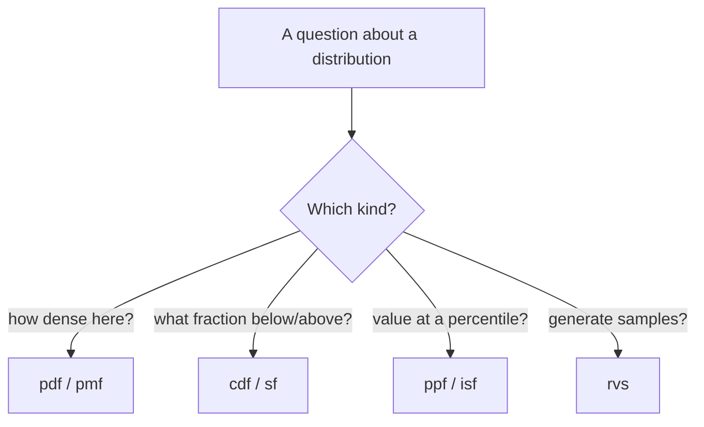
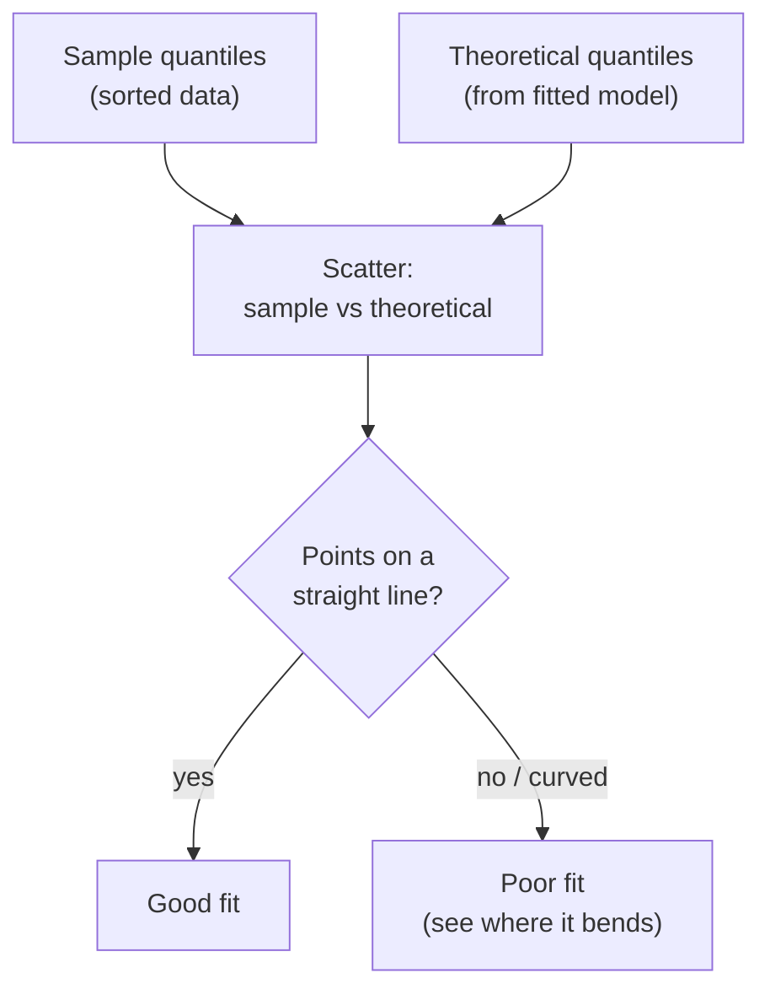

You've now met the main distributions individually. This page is about
the **workflow**, the small, reusable set of moves that turns *any*
distribution in `scipy.stats` into concrete answers, and the discipline
of **fitting** a distribution to real data and then *checking whether it
actually fits* before you trust it. Master this and a new distribution
is never intimidating again: it's just the same four methods with
different parameters.

The mindset is a two-step loop you'll use constantly as a data
scientist: **model the data** (pick a distribution and estimate its
parameters), then **use the model to answer questions** (probabilities,
thresholds, simulations). The catch, and the part people skip, is the
sanity check in between. A model that doesn't fit gives precise,
authoritative, *wrong* answers.

<Figure
  slug="stat-working-with-distributions-cutout"
  alt="A four-dial control panel on a platform beside a curve being nudged to sit over a histogram silhouette"
/>

## Four questions, four methods

Almost everything you'll ask of a distribution is one of four questions,
and each maps to a method (or a pair) on the frozen distribution object.
This table is the whole API in a nutshell:

| You want to know... | Method | Returns |
| --- | --- | --- |
| **Density / mass** at a value, how concentrated is the distribution here? | `.pdf(x)` (continuous), `.pmf(k)` (discrete) | height / point probability |
| **Accumulation**, what fraction is below (or above) a value? | `.cdf(x)` = P(X ≤ x); `.sf(x)` = P(X > x) | a probability |
| **Quantile**, what value sits at a given percentile? | `.ppf(p)`; `.isf(p)` (upper tail) | a value |
| **Simulation**, draw random samples | `.rvs(size=...)` | random data |

Plus the summaries `.mean()`, `.var()`, `.std()`, and `.median()`. That's
it, learn these once and every distribution behaves the same way.

<Callout type="info" title="cdf and ppf are inverses; sf and isf are their upper-tail twins">
`cdf` (value → left-tail probability) and `ppf` (probability → value)
undo each other. For the *upper* tail, `sf(x) = 1 - cdf(x)` gives
P(X > x), and `isf(p)` returns the value with upper-tail probability `p`,
handy for "what threshold leaves only 5% above it?" (`isf(0.05)`).
Using `sf`/`isf` instead of `1 - cdf` is also more numerically accurate
deep in the tail.
</Callout>

### One distribution, all four questions

Here's the entire toolkit exercised on a single frozen normal, so you
can see how the pieces relate.

<CodeBlock
  adapter="python"
  files={[
    {
      filename: "main.py",
      starterCode: `from scipy import stats

# Delivery times: Normal, mean 30 min, sd 6 min.
d = stats.norm(loc=30, scale=6)

# 1) Density at a value (a height, not a probability).
print("pdf(30)          =", round(float(d.pdf(30)), 4))

# 2) Accumulation: fraction below / above a value.
print("cdf(36) P(X<=36) =", round(float(d.cdf(36)), 4))
print("sf(36)  P(X>36)  =", round(float(d.sf(36)), 4))

# 3) Quantiles: value at a percentile.
print("ppf(0.5) median  =", round(float(d.ppf(0.5)), 2))
print("isf(0.05) top 5% =", round(float(d.isf(0.05)), 2))

# 4) Simulation: draw samples.
print("rvs sample       =", d.rvs(size=5, random_state=0).round(1))
`,
    },
  ]}
/>

## The loc/scale convention and frozen distributions

Two habits make `scipy.stats` painless:

**The `loc`/`scale` convention.** Nearly every distribution takes `loc`
(a shift) and `scale` (a stretch). For the normal, `loc` is the mean and
`scale` is the standard deviation. For the exponential, `scale` is the
mean. For the uniform, `loc` is the left edge and `scale` is the width.
The *meaning* changes per distribution, but the *interface* is identical.

**Frozen distributions.** Calling `stats.norm(loc=30, scale=6)` once
returns an object with the parameters baked in. Pass that object around
and call methods on it, instead of repeating `loc=` and `scale=` on every
call. It's cleaner and prevents parameter-mismatch bugs.

<CodeBlock
  adapter="python"
  files={[
    {
      filename: "main.py",
      starterCode: `from scipy import stats

# Frozen (preferred): bake parameters in once, reuse everywhere.
d = stats.norm(loc=30, scale=6)
print("frozen:", round(float(d.cdf(36)), 4), round(float(d.ppf(0.9)), 2))

# Unfrozen (equivalent, but you repeat parameters every call, error-prone).
print(
    "unfrozen:",
    round(float(stats.norm.cdf(36, loc=30, scale=6)), 4),
    round(float(stats.norm.ppf(0.9, loc=30, scale=6)), 2),
)

# Same numbers, the frozen form is just tidier and safer.
`,
    },
  ]}
/>

## Fitting a distribution to data

So far we've *assumed* the parameters. With real data you usually
**estimate** them: hand the data to `.fit()` and scipy returns the
parameters that best match it (by maximum likelihood). For the normal,
`.fit()` returns `(loc, scale)`, essentially the sample mean and
standard deviation.

<CodeBlock
  adapter="python"
  files={[
    {
      filename: "main.py",
      starterCode: `import numpy as np
from scipy import stats

rng = np.random.default_rng(42)

# Pretend this is a real measured sample (we generated it so we can check).
sample = rng.normal(loc=72, scale=6, size=500)

# Fit a normal: estimate (loc, scale) from the data.
loc, scale = stats.norm.fit(sample)
print(f"Fitted loc (mean) = {loc:.3f}   (sample mean = {sample.mean():.3f})")
print(f"Fitted scale (sd) = {scale:.3f} (sample std  = {sample.std():.3f})")

# Now USE the fitted model to answer questions the raw data can't directly.
fitted = stats.norm(loc=loc, scale=scale)
print(f"\\nModel says P(X > 85)      = {fitted.sf(85):.4f}")
print(f"Model says 95th pct cutoff = {fitted.ppf(0.95):.2f}")
`,
    },
  ]}
/>

<Callout type="tip" title="Fitting bounded distributions: fix loc with floc">
Some distributions have a location parameter that doesn't belong in your
problem. For positive-only data like incomes or wait times, you usually
want the distribution anchored at zero, so fix it during the fit:
`stats.lognorm.fit(data, floc=0)` or `stats.expon.fit(data, floc=0)`.
Without `floc=0`, scipy may slide `loc` to a small nonzero value that
fits the sample's minimum but makes the parameters hard to interpret.
</Callout>

## Sanity-checking the fit

Fitting *always* returns parameters, even for a distribution that's
completely wrong for your data. The numbers don't tell you the fit is
good; **you** have to check. Two standard checks:

1. **Histogram overlay**: plot the data's histogram (as a density) and
   draw the fitted PDF on top. Do they have the same shape, same center,
   spread, skew, and tails?
2. **Q–Q plot**: plot the data's quantiles against the fitted
   distribution's quantiles. If the fit is good, the points fall on a
   straight line. Systematic curving away from the line reveals exactly
   *how* the fit fails (heavy tails, skew, etc.).

### Histogram overlay

<CodeBlock
  adapter="python"
  files={[
    {
      filename: "main.py",
      starterCode: `import numpy as np
import plotly.graph_objects as go
from scipy import stats

rng = np.random.default_rng(1)

# Roughly bell-shaped sample (e.g., standardized test scores).
sample = rng.normal(loc=72, scale=6, size=800)

# Fit and overlay.
loc, scale = stats.norm.fit(sample)
fitted = stats.norm(loc=loc, scale=scale)
x = np.linspace(sample.min(), sample.max(), 300)

fig = go.Figure()
fig.add_trace(
    go.Histogram(x=sample, histnorm="probability density", nbinsx=40, name="data")
)
fig.add_trace(go.Scatter(x=x, y=fitted.pdf(x), mode="lines", name="fitted normal"))
fig.update_layout(
    title="Histogram with fitted normal overlay, shapes match well",
    xaxis_title="score",
    yaxis_title="density",
)
fig.show()
`,
    },
  ]}
/>

### Q–Q plot intuition

A **Q–Q (quantile–quantile) plot** is the sharper check. The idea:

- Sort the data, these are the **sample quantiles**.
- For each, compute where the **fitted distribution** says that quantile
  should fall, the **theoretical quantiles**.
- Plot sample-vs-theoretical. A good fit makes the points hug the
  diagonal line `y = x`. Curvature, or tails that peel off the line,
  means the model misses the data's shape there.

<CodeBlock
  adapter="python"
  files={[
    {
      filename: "main.py",
      starterCode: `import numpy as np
import plotly.express as px
from scipy import stats

rng = np.random.default_rng(7)

# Compare a good fit vs a bad fit using Q-Q intuition.
# Case A: data really is normal -> points should hug the line.
# Case B: data is skewed (lognormal) but we fit a NORMAL -> points bend.
normal_data = rng.normal(loc=50, scale=8, size=400)
skewed_data = rng.lognormal(mean=3.5, sigma=0.5, size=400)

def qq_points(data):
    n = len(data)
    probs = (np.arange(1, n + 1) - 0.5) / n  # plotting positions
    loc, scale = stats.norm.fit(data)  # fit a normal
    theoretical = stats.norm(loc=loc, scale=scale).ppf(probs)
    sample = np.sort(data)
    return theoretical, sample

for label, data in [
    ("normal data (good fit)", normal_data),
    ("skewed data (bad fit)", skewed_data),
]:
    theo, samp = qq_points(data)
    corr = np.corrcoef(theo, samp)[0, 1]
    print(f"{label:>24}: Q-Q correlation = {corr:.4f}")

# Plot the skewed case to SEE the bend at the tails.
theo, samp = qq_points(skewed_data)
fig = px.scatter(
    x=theo,
    y=samp,
    labels={"x": "theoretical quantiles (fitted normal)", "y": "sample quantiles"},
    title="Q-Q plot: skewed data vs a fitted normal, note the curve",
)
lo, hi = min(theo.min(), samp.min()), max(theo.max(), samp.max())
fig.add_shape(type="line", x0=lo, y0=lo, x1=hi, y1=hi, line=dict(dash="dash"))
fig.show()
`,
    },
  ]}
/>

<Callout type="warn" title="A high Q-Q correlation is suggestive, not proof">
Points hugging the line is *evidence* the chosen distribution is
plausible, not a guarantee the data "follows" it. Real data is never
*exactly* any textbook distribution. Treat the Q–Q plot as a diagnostic
for spotting *how* a model fails (heavy tails, skew), and as a check that
the model is *good enough* for the decision at hand, not as a proof of
the true data-generating process.
</Callout>

<ChallengeCard
  adapter="python"
  title="Fit a normal and compute a tail probability"
  instructions={`You're given a sample of measured values in \`data\` (a NumPy array). Assume a **Normal** model.

1. Fit a normal with \`stats.norm.fit(data)\`, which returns \`(loc, scale)\`. Store them in **\`loc\`** and **\`scale\`** (both \`float\`).
2. Build the fitted distribution and compute **\`p_above_100\`**, the probability the value **exceeds 100**, \`P(X > 100)\`, as a \`float\`.

Hints:

- \`loc, scale = stats.norm.fit(data)\`.
- A frozen fitted distribution: \`fitted = stats.norm(loc=loc, scale=scale)\`.
- \`P(X > 100)\` is \`fitted.sf(100)\`.`}
  files={[
    {
      filename: "main.py",
      initCode: `import numpy as np
from scipy import stats
rng = np.random.default_rng(7)
data = rng.normal(80, 12, size=400)`,
      starterCode: `# TODO: fit the normal and compute the tail probability
loc = None
scale = None
p_above_100 = None

print("loc, scale:", loc, scale)
print("P(X > 100):", p_above_100)
`,
      solutionCode: `loc, scale = stats.norm.fit(data)
loc, scale = float(loc), float(scale)

fitted = stats.norm(loc=loc, scale=scale)
p_above_100 = float(fitted.sf(100))

print("loc, scale:", loc, scale)
print("P(X > 100):", p_above_100)
`,
    },
  ]}
  tests={[
    {
      id: "params_type",
      name: "loc and scale are floats",
      description: "Fitted parameters returned",
      code: `assert isinstance(loc, float) and isinstance(scale, float)`,
    },
    {
      id: "params_value",
      name: "loc and scale match the fit",
      description: "Maximum-likelihood normal fit",
      code: `from scipy import stats
exp_loc, exp_scale = stats.norm.fit(data)
assert abs(loc - float(exp_loc)) < 1e-6
assert abs(scale - float(exp_scale)) < 1e-6`,
    },
    {
      id: "prob_type",
      name: "p_above_100 is a float",
      description: "Returns a numeric value",
      code: `assert isinstance(p_above_100, float)`,
    },
    {
      id: "prob_value",
      name: "tail probability is correct",
      description: "Matches sf(100) of the fitted model",
      code: `from scipy import stats
l, s = stats.norm.fit(data)
expected = float(stats.norm(loc=l, scale=s).sf(100))
assert abs(p_above_100 - expected) < 1e-9`,
    },
  ]}
/>

<ChallengeCard
  adapter="python"
  title="Set a threshold from a fitted model"
  instructions={`Using the same sample in \`data\`, fit a **Normal** model and use it to set a capacity threshold.

Compute **\`cutoff_95\`**, the **95th-percentile** value of the fitted distribution (the value with 95% of outcomes at or below it), as a \`float\`.

Hints:

- Fit with \`loc, scale = stats.norm.fit(data)\`.
- The 95th percentile is \`stats.norm(loc=loc, scale=scale).ppf(0.95)\`.`}
  files={[
    {
      filename: "main.py",
      initCode: `import numpy as np
from scipy import stats
rng = np.random.default_rng(7)
data = rng.normal(80, 12, size=400)`,
      starterCode: `# TODO: fit the model and find the 95th-percentile cutoff
cutoff_95 = None

print("95th-percentile cutoff:", cutoff_95)
`,
      solutionCode: `loc, scale = stats.norm.fit(data)
cutoff_95 = float(stats.norm(loc=loc, scale=scale).ppf(0.95))

print("95th-percentile cutoff:", cutoff_95)
`,
    },
  ]}
  tests={[
    {
      id: "type",
      name: "cutoff_95 is a float",
      description: "Returns a numeric value",
      code: `assert isinstance(cutoff_95, float)`,
    },
    {
      id: "value",
      name: "cutoff_95 is the fitted 95th percentile",
      description: "Matches ppf(0.95) of the fitted model",
      code: `from scipy import stats
l, s = stats.norm.fit(data)
expected = float(stats.norm(loc=l, scale=s).ppf(0.95))
assert abs(cutoff_95 - expected) < 1e-6`,
    },
    {
      id: "tail",
      name: "about 5% of the fitted model lies above the cutoff",
      description: "sf(cutoff) is approximately 0.05",
      code: `from scipy import stats
l, s = stats.norm.fit(data)
d = stats.norm(loc=l, scale=s)
assert abs(d.sf(cutoff_95) - 0.05) < 1e-6`,
    },
  ]}
/>

## Don't extrapolate a fitted model past your data

A fitted model is only trustworthy in the **range where you have data**.
The tails of a fitted distribution are an *extrapolation*, they're
governed by the assumed shape, not by observations you actually made. If
your data tops out around 120, asking the fitted normal for P(X > 300) is
answering a question the data never spoke to.

<CodeBlock
  adapter="python"
  files={[
    {
      filename: "main.py",
      starterCode: `import numpy as np
from scipy import stats

rng = np.random.default_rng(0)
data = rng.normal(80, 12, size=400)
fitted = stats.norm(*stats.norm.fit(data))

print(f"Data range: {data.min():.1f} to {data.max():.1f}")
print(f"In-range question  P(X > 100): {fitted.sf(100):.4f}  <- supported by data")
print(f"Far-tail question  P(X > 200): {fitted.sf(200):.2e}  <- pure extrapolation")
print("\\nThe second number comes entirely from the assumed normal shape,")
print("not from anything the data actually observed. Treat it with caution.")
`,
    },
  ]}
/>

<Callout type="danger" title="Two misconceptions to retire">
**(1) Fitting proves the data follows the distribution.** It doesn't.
`.fit()` returns parameters for *any* distribution you ask, fit or not,
you must verify with an overlay or Q–Q plot, and even a good fit only
means "plausible and good enough," never "this is the true law."
**(2) A fitted model is valid everywhere.** It's only credible within the
observed range. Extreme-tail probabilities are extrapolations driven by
the assumed shape; for genuine tail risk, that shape assumption is doing
*all* the work, so choose it carefully (heavy-tailed data needs a
heavy-tailed model).
</Callout>

## Check your understanding

<MultipleChoice
  markdown={`You want the value with only **5%** of the distribution **above** it (the upper-tail threshold). Which single method gives it most directly?

- [o] \`.isf(0.05)\`
  > The inverse-survival function returns the value whose upper-tail probability equals 0.05, exactly the threshold with 5% of the distribution above it (equivalently \`ppf(0.95)\`).
- \`.sf(0.05)\`
  > \`sf\` takes a value and returns its upper-tail probability, not a value at a given tail level.
- \`.cdf(0.05)\`
  > \`cdf\` maps a value to a left-tail probability; passing 0.05 treats it as a value, not a tail level.
- \`.ppf(0.05)\`
  > \`ppf(0.05)\` returns the value with 5% *below* it (lower tail), the opposite end from what's asked.

\`isf(p)\` and \`sf(x)\` are the upper-tail twins of \`ppf(p)\` and \`cdf(x)\`.`}
/>

<MultipleChoice
  markdown={`You run \`stats.norm.fit(data)\` on a strongly right-skewed dataset and get back \`(loc, scale)\`. What can you conclude?

- The skew will be automatically corrected by the fit
  > Fitting a normal cannot remove skew; it just centers and scales a symmetric bell that ignores the data's asymmetry.
- The data follows a normal distribution, since the fit succeeded
  > \`.fit\` always returns parameters regardless of fit quality; a successful call says nothing about whether the model is appropriate.
- [o] You have the best-fitting *normal* parameters, but you must still check (overlay/Q-Q) whether a normal is appropriate, and for skewed data it likely isn't
  > Fitting only estimates parameters for the distribution you chose; verifying the shape actually matches is a separate, required step, and skew is a sign a normal is the wrong family.
- The fit failed because the data is skewed
  > The fit doesn't "fail" on skewed data, it silently returns the best-matching normal, which simply won't describe the data well.

Fitting estimates parameters; it never validates the choice of distribution.`}
/>

<MultipleChoice
  markdown={`In a **Q–Q plot** comparing your data to a fitted distribution, the points follow the diagonal line in the middle but **curve upward sharply at the right end**. What does this indicate?

- The data has fewer values than the model assumes
  > A Q–Q plot compares quantile *positions*, not counts; sample size isn't what the bend reveals.
- [o] The data has a heavier right tail than the fitted distribution, extreme high values occur more often than the model predicts
  > Points peeling above the line at the upper end mean the sample's large quantiles exceed what the model expects, the signature of a heavier-than-modeled right tail.
- The fit is perfect
  > A perfect fit keeps points on the line throughout; a systematic departure at one end signals a specific mismatch.
- The loc parameter was estimated incorrectly
  > A wrong center would shift the whole line, not bend only the upper tail; tail curvature is about shape, not location.

Where and how the points leave the line tells you exactly how the model misfits, here, an under-modeled right tail.`}
/>

<MultipleChoice
  markdown={`You fit a normal to response times that range from 50 to 130 ms, then use the model to report \`P(X > 400)\`. Why should you be skeptical of that number?

- Because \`sf\` is inaccurate for large values
  > \`sf\` is actually the numerically *preferred* way to compute far-tail probabilities; precision isn't the issue.
- [o] Because 400 is far outside the observed data range, so that probability is an extrapolation governed entirely by the assumed normal shape, not by any observations
  > With no data anywhere near 400, the reported probability rests solely on the assumption that the true distribution is normal in a region you never measured, making it unreliable.
- Because fitted models can only answer questions about the mean
  > Fitted models answer probability and quantile questions across their range; the problem is specifically reasoning *outside* the observed range.
- Because the normal can't produce values above its mean
  > A normal extends infinitely in both directions, so it certainly can produce values above the mean; that's not the concern.

A fitted model is trustworthy within the data's range; its far tails are assumption, not evidence.`}
/>

<Callout type="success" title="Key takeaways">
- Every distribution answers the same **four questions**: density
  (`pdf`/`pmf`), accumulation (`cdf`/`sf`), quantile (`ppf`/`isf`), and
  simulation (`rvs`), plus `.mean`/`.var`/`.std`.
- The **`loc`/`scale`** convention and **frozen distributions** give one
  consistent, tidy interface across all of `scipy.stats`.
- **`.fit()`** estimates parameters from data; for bounded data, fix the
  location with **`floc=0`**.
- *Always* **sanity-check the fit** with a **histogram overlay** and a
  **Q–Q plot**, points on a line means a plausible fit, curvature shows
  how it fails.
- Fitting **does not prove** the data follows the distribution, and a
  fitted model is only trustworthy **within the observed range**, its
  far tails are extrapolation.
- This model-then-question loop underpins the inference ahead: we'll lean
  on these methods in *The Normal Distribution* recap and throughout
  *Confidence Intervals* and the testing chapters.
</Callout>
