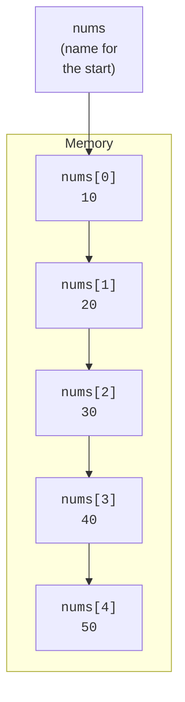

C arrays are the most direct expression of "contiguous bytes in
memory with a name." They are also surprisingly subtle: an array is
not quite a pointer, but it *becomes* one almost any time you use it.

<Figure
  slug="sysc-arrays-pointers-cutout"
  alt="A contiguous row of cells on a platform with a pointer marker stepping along it in fixed-width hops"
/>

## A C array is contiguous memory

`int nums[5] = {10, 20, 30, 40, 50};` reserves enough room for five
ints, side by side, and names the start `nums`.

<CodeBlock
  adapter="c"
  files={[
    {
      filename: "main.c",
      starterCode: `#include <stdio.h>

int main(void) {
  int nums[5] = {10, 20, 30, 40, 50};

  for (int i = 0; i < 5; i++) {
    printf("nums[%d] = %d  at %p\\n", i, nums[i], (void *)&nums[i]);
  }
  return 0;
}
`,
    },
  ]}
/>

The addresses should grow by exactly `sizeof(int)` per element (4 on
WASI). That is what we mean by "contiguous": no gaps, no indirection,
no per-element header.



## `a[i]` *is* `*(a + i)`

Indexing in C is sugar for pointer arithmetic. The expression `a[i]`
is defined as `*(a + i)`. The `+ i` part is *typed*, it advances by
`i * sizeof(*a)` bytes, not by `i` bytes.

<CodeBlock
  adapter="c"
  files={[
    {
      filename: "main.c",
      starterCode: `#include <stdio.h>

int main(void) {
  int a[4] = {10, 20, 30, 40};

  printf("a[2]      = %d\\n", a[2]);
  printf("*(a + 2)  = %d\\n", *(a + 2));
  printf("2[a]      = %d  (yes, this is legal!)\\n", 2 [a]);
  return 0;
}
`,
    },
  ]}
/>

Yes, `2[a]` is valid C: by definition `i[a] == *(i + a) == *(a + i)
== a[i]`. Do not write that in real code, but knowing it explains
*why* arrays and pointers feel so interchangeable.

It also explains a question every beginner asks: why does indexing
start at 0 instead of 1? Because the index is not a position, it is
an **offset**. `a[0]` means "zero elements past the start," which is
the start itself. Edsger Dijkstra wrote a famously opinionated 1982
note, *"Why numbering should start at zero"* (EWD831), defending the
convention on mathematical grounds, but in C the justification is
mechanical: the index is literally the number the compiler multiplies
by `sizeof` and adds to the base address. Starting at 1 would mean
paying for a subtraction on every single array access.

## Array decay

Almost every time you *use* an array (pass it to a function, assign
it to a pointer, use it in arithmetic), the expression of array type
is implicitly converted to a pointer to its first element. This is
called *array-to-pointer decay*.

<CodeBlock
  adapter="c"
  files={[
    {
      filename: "main.c",
      starterCode: `#include <stdio.h>

void show_size_inside(int a[]) {
  // Inside the function, a is just int *.
  printf("inside  sizeof(a) = %zu (size of a pointer)\\n", sizeof(a));
}

int main(void) {
  int a[10] = {0};
  printf("outside sizeof(a) = %zu (10 * sizeof(int))\\n", sizeof(a));
  show_size_inside(a);
  return 0;
}
`,
    },
  ]}
/>

Inside a function, `int a[]` is *exactly the same* as `int *a`. The
size information is lost. That is why C functions that take arrays
almost always also take a length parameter.

<Callout type="warn" title="Always pass the length">
There is no portable, automatic way to ask a `T *` "how many elements
do you point at?", you have to track it yourself. This is the
single most important convention to internalize in C.
</Callout>

## Pointer arithmetic in detail

If `p` is a pointer to a `T`, then:

| Expression | Meaning |
| --- | --- |
| `p + n` | address of element `n` past `p` (n × sizeof(T) bytes ahead) |
| `p - n` | address of element `n` before `p` |
| `p - q` | number of elements between two pointers into the *same* array |
| `*p++` | dereference `p`, then advance `p` |
| `*++p` | advance `p`, then dereference |
| `p[n]` | shorthand for `*(p + n)` |

<CodeBlock
  adapter="c"
  files={[
    {
      filename: "main.c",
      starterCode: `#include <stdio.h>

int main(void) {
  int a[] = {10, 20, 30, 40, 50};
  int *p = a;     // p points at a[0]
  int *q = &a[4]; // q points at a[4]

  printf("p[0] = %d, q[0] = %d\\n", p[0], q[0]);
  printf("distance q - p = %td elements\\n", q - p);

  // Walk through the array with a moving pointer.
  for (int *it = a; it < a + 5; ++it) {
    printf("  *it = %d\\n", *it);
  }
  return 0;
}
`,
    },
  ]}
/>

<Callout type="warn" title="Pointers may only be compared within the same allocation">
Subtracting or comparing pointers that point into *different* arrays
is undefined behavior. The "one-past-the-end" pointer (`a + 5` for an
array of length 5) is a legal sentinel but must not be dereferenced.
</Callout>

## Functions that take arrays

The classic signature is `void f(T *arr, size_t n)`. Inside the
function, treat `arr` and `n` as inseparable.

<CodeBlock
  adapter="c"
  files={[
    {
      filename: "main.c",
      starterCode: `#include <stddef.h>
#include <stdio.h>

long sum(const int *arr, size_t n) {
  long total = 0;
  for (size_t i = 0; i < n; i++) {
    total += arr[i];
  }
  return total;
}

int main(void) {
  int data[] = {3, 1, 4, 1, 5, 9, 2, 6, 5, 3};
  size_t n = sizeof(data) / sizeof(data[0]);
  printf("sum = %ld\\n", sum(data, n));
  return 0;
}
`,
    },
  ]}
/>

The idiom `sizeof(array) / sizeof(array[0])` works *only* where the
array's type is in scope, that is, where it has *not* yet decayed.
Hence we compute `n` in `main` and pass it down, never inside `sum`.

## 2D arrays vs arrays of pointers

Two ways to represent a matrix. They look similar; they are not the
same in memory.

```c
int grid[3][4];           // 12 ints in one contiguous block
int *rows[3];             // 3 pointers, each pointing at its own row
```

The first is one allocation of `3 * 4 * sizeof(int) = 48` bytes laid
out in row-major order. The second is three separate allocations
(plus an array of three pointers), flexible but with poorer cache
behavior.

<CodeBlock
  adapter="c"
  files={[
    {
      filename: "main.c",
      starterCode: `#include <stdio.h>

int main(void) {
  int grid[3][4] = {
      {1, 2, 3, 4},
      {5, 6, 7, 8},
      {9, 10, 11, 12},
  };

  for (int r = 0; r < 3; r++) {
    for (int c = 0; c < 4; c++) {
      printf("%3d ", grid[r][c]);
    }
    printf("\\n");
  }
  return 0;
}
`,
    },
  ]}
/>

Row-major layout means `grid[r][c]` lives at offset
`(r * 4 + c) * sizeof(int)` from `grid`. Iterating in row-major order
(outer loop over rows, inner loop over columns) walks memory linearly
and is cache-friendly.

## Bounds checking, there isn't any

C arrays do not check bounds. Writing `a[100]` for a 10-element array
will quietly stomp on whatever memory follows the array, a heap
metadata structure, another variable, the return address on the
stack. That is *the* C bug.

<CodeBlock
  adapter="c"
  files={[
    {
      filename: "main.c",
      starterCode: `#include <stdio.h>

int main(void) {
  int a[3] = {1, 2, 3};
  int sentinel = 999;
  int *p = a;

  printf("Before: sentinel = %d\\n", sentinel);
  // Deliberate out-of-bounds write, undefined behavior!
  // The result depends entirely on what the compiler chose to place after \`a\`.
  p[3] = 42;
  printf("After:  sentinel = %d\\n", sentinel);
  return 0;
}
`,
    },
  ]}
/>

On the WASI target you may see `sentinel` change to `42`, stay at
`999`, or get something else entirely. We will return to bugs like
this in the *Memory Bugs* chapter.

## Practice: rotate an array left by one

<ChallengeCard
  adapter="c"
  title="Rotate left in-place"
  instructions={`Implement \`void rotate_left(int *arr, size_t n)\` so that the element at index 0 moves to the end and every other element shifts one position to the left. For \`{1,2,3,4,5}\` the result is \`{2,3,4,5,1}\`. The provided \`main\` prints the array space-separated on one line.`}
  files={[
    {
      filename: "main.c",
      starterCode: `#include <stddef.h>
#include <stdio.h>

void rotate_left(int *arr, size_t n) {
  // your code here
}

int main(void) {
  int a[] = {1, 2, 3, 4, 5};
  size_t n = sizeof(a) / sizeof(a[0]);
  rotate_left(a, n);
  for (size_t i = 0; i < n; i++) {
    if (i)
      printf(" ");
    printf("%d", a[i]);
  }
  printf("\\n");
  return 0;
}
`,
      solutionCode: `#include <stddef.h>
#include <stdio.h>

void rotate_left(int *arr, size_t n) {
  if (n < 2)
    return;
  int first = arr[0];
  for (size_t i = 0; i + 1 < n; i++) {
    arr[i] = arr[i + 1];
  }
  arr[n - 1] = first;
}

int main(void) {
  int a[] = {1, 2, 3, 4, 5};
  size_t n = sizeof(a) / sizeof(a[0]);
  rotate_left(a, n);
  for (size_t i = 0; i < n; i++) {
    if (i)
      printf(" ");
    printf("%d", a[i]);
  }
  printf("\\n");
  return 0;
}
`,
    },
  ]}
  tests={[
    {
      id: "rotated",
      name: "Array rotated left by one",
      expect: { stdoutEquals: "2 3 4 5 1" },
    },
  ]}
/>

## Practice: matrix diagonal sum

<ChallengeCard
  adapter="c"
  title="Sum the main diagonal of a 4x4 matrix"
  instructions={`Implement \`int diag_sum(int m[4][4])\` that returns \`m[0][0] + m[1][1] + m[2][2] + m[3][3]\`. The provided \`main\` defines a 4x4 matrix and prints the result followed by a newline.`}
  files={[
    {
      filename: "main.c",
      starterCode: `#include <stdio.h>

int diag_sum(int m[4][4]) {
  // your code here
  return 0;
}

int main(void) {
  int m[4][4] = {
      {1, 2, 3, 4},
      {5, 6, 7, 8},
      {9, 10, 11, 12},
      {13, 14, 15, 16},
  };
  printf("%d\\n", diag_sum(m));
  return 0;
}
`,
      solutionCode: `#include <stdio.h>

int diag_sum(int m[4][4]) {
  int s = 0;
  for (int i = 0; i < 4; i++)
    s += m[i][i];
  return s;
}

int main(void) {
  int m[4][4] = {
      {1, 2, 3, 4},
      {5, 6, 7, 8},
      {9, 10, 11, 12},
      {13, 14, 15, 16},
  };
  printf("%d\\n", diag_sum(m));
  return 0;
}
`,
    },
  ]}
  tests={[
    {
      id: "diag",
      name: "Diagonal sum is 1+6+11+16 = 34",
      expect: { stdoutEquals: "34" },
    },
  ]}
/>

## Test your understanding

<MultipleChoice
  markdown={`Inside \`void f(int a[], size_t n)\`, what does \`sizeof(a)\` give you?

- The total number of bytes in the original array.
  > That information is lost on the way in, the array has decayed.
- [o] The size of a pointer (because \`a\` has decayed to \`int *\`).
  > This is why you must pass the length as a separate parameter.
- The number of elements in the array.
  > That would be \`n\` (which you must pass in), not \`sizeof(a)\`.
- Always zero.
  > Pointers are never zero-sized.`}
/>

<MultipleChoice
  markdown={`Given \`int a[10];\` and \`int *p = a + 3;\`, what is \`p - a\`?

- 3 bytes
  > Pointer subtraction is measured in *elements*, not bytes.
- \`3 * sizeof(int)\`
  > Same, that would be the byte distance, not the element count.
- [o] 3 elements
  > \`p\` points three ints past the start of \`a\`.
- Undefined behavior
  > Subtracting two pointers into the same array (within bounds) is well-defined.`}
/>

<MultipleChoice
  markdown={`What happens if you write past the end of a C array, e.g. \`a[100] = 0\` for an array of length 10?

- The compiler refuses to build the program.
  > C compilers do not check this; the program will compile.
- The runtime throws an \`ArrayIndexOutOfBoundsException\`.
  > There is no such exception in C; that is a Java behavior.
- The write silently fails and leaves memory unchanged.
  > The write goes through; what it stomps on depends on the layout.
- [o] It is undefined behavior, it may crash, may overwrite unrelated data, or may appear to work.
  > Out-of-bounds memory access is one of the most dangerous C bugs.`}
/>
