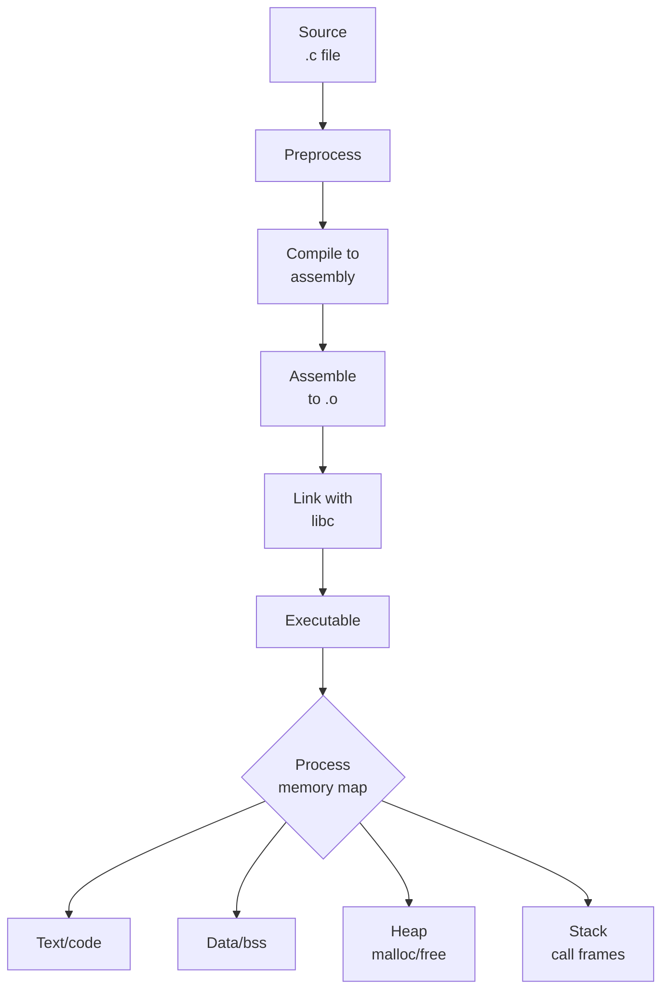

Welcome to **Systems Programming &amp; Memory Management in C**, a course
that takes you from your very first `int main(void)` all the way to
hand-rolled memory allocators, structs with carefully chosen padding,
and the kinds of memory bugs that have powered half the CVEs of the
last forty years.

<Figure
  slug="systems-programming-c-thumbnail-cutout"
  alt="A cutaway of stacked memory layers with a small crane lifting one block out of the heap"
  priority
/>

C is the lingua franca of systems software. Operating system kernels,
databases, language runtimes (CPython, V8, the JVM, Go's runtime),
web servers, embedded firmware, and even other compilers are written
in C or in C-like dialects. Learning C teaches you not just a
language but a *model of the machine*, a small, honest model in which
every byte has an address, every variable has a type with a known
size, and every allocation is yours to manage.

## This course runs in your browser, try it

Before anything else, here is the most important fact about this
course: **every C snippet on every page is live.** Click *Run* below
and a real `clang` compiler, running as WebAssembly inside your
browser tab, will compile this program and execute it. No
installation, no setup, no account.

<CodeBlock
  adapter="c"
  files={[
    {
      filename: "main.c",
      starterCode: `#include <stdio.h>

int main(void) {
  int height = 5; // try changing this, then press Run again

  for (int row = 1; row <= height; row++) {
    for (int i = 0; i < row; i++) {
      putchar('#');
    }
    putchar('\\n');
  }
  printf("Compiled with clang, in your browser.\\n");
  return 0;
}
`,
    },
  ]}
/>

Change `height` to `8` and run it again. That edit–run–observe loop
is how the whole course works: the prose explains an idea, a code
block makes it concrete, and you are expected to poke at it. The
pages where you break things on purpose, and there will be several,
are where C actually sinks in.
## What you will learn

Each page mixes prose with three kinds of interactive widgets:

1. **Executable code blocks.** Every C snippet compiles to
   WebAssembly with `clang` in your browser and runs as a tiny WASI
   binary. No installation, no toolchain setup. Edit any block and
   click *Run*.
2. **Challenge cards.** Test-backed coding problems. Some are
   single-file, some span multiple translation units so you can
   practice header/implementation splitting just like a real project.
3. **Multiple choice questions.** Quick checks at the end of most
   pages. Each option has its own explanation, so a wrong answer
   still teaches you something.

<Callout type="info" title="How to use the interactive widgets">
Every code block runs in a fresh process, so a variable defined in one
block is not visible in the next. This keeps examples self-contained
and easy to reason about. For a persistent multi-file workspace, open
the [C Playground](/playground/c) in a new tab.
</Callout>

<Callout type="warn" title="Sandbox limits">
The browser runtime is a **WASI** sandbox, not a real Unix process.
System calls like `fork`, `exec`, `pthread_create`, raw sockets, and
direct device I/O are unavailable. We will *describe* those topics
honestly but reserve the runnable examples for things WASI supports:
arithmetic, pointers, `malloc`/`free`, structs, strings, formatted
I/O, and tiny in-memory simulations.
</Callout>

## Why "systems programming *and* memory management"?

In application languages, Python, Java, JavaScript, the runtime
hides most of the machine from you. Strings have a length, lists grow
on their own, garbage is collected silently, and a "null pointer
exception" is the worst that usually happens.

In C, you see the cost of every decision. A string is a `char*` to a
sequence of bytes that you must remember to null-terminate. An array
decays into a pointer when you pass it to a function. Memory you
allocate with `malloc` stays alive until *you* free it, and if you
free it twice, or read from it after, or write past its end, the
program may crash, leak, or silently corrupt unrelated data.

That's why this course pairs *systems programming* (the toolchain,
the process address space, the contracts between your program and
the operating system) with *memory management* (stack vs heap,
pointer arithmetic, allocators, common bugs and how to spot them).
The two are inseparable.

## Course outline

The pages are ordered so each chapter builds on earlier material, but
each one stands alone if you want to jump to a specific topic.

### 1. Getting started
Why C still matters for systems work, the compilation pipeline
(preprocessor → compiler → assembler → linker), and the fundamental
types, sizes, ranges, signedness, and how integers actually sit in
memory (endianness).

### 2. Pointers and arrays
The pointer is the soul of C. We will start from raw addresses and
build up to pointer arithmetic, array decay, string literals, and the
`<string.h>` toolkit (`strlen`, `strcpy`, `memcpy`, `strncpy`'s
infamous footgun).

### 3. Memory layout
The four segments of a Unix-style process, text, data/bss, heap, and
stack, what lives in each, how function calls build and tear down
stack frames, and how `malloc`/`free`/`calloc`/`realloc` interact with
the heap.

### 4. Composite types and bugs
Structs (with padding and alignment), unions, bitfields, and then a
long, honest look at the bug classes that haunt C code:
use-after-free, double-free, buffer overflow, off-by-one,
uninitialized reads, and memory leaks. We will reproduce several of
them in the browser sandbox.

### 5. Going further
A roadmap for what to study after this course: signals and processes,
threads and synchronization, sockets and protocols, `mmap` and shared
memory, sanitizers (ASan/UBSan/MSan), Valgrind, custom allocators,
embedded toolchains, and Rust as a "modern C" alternative.
