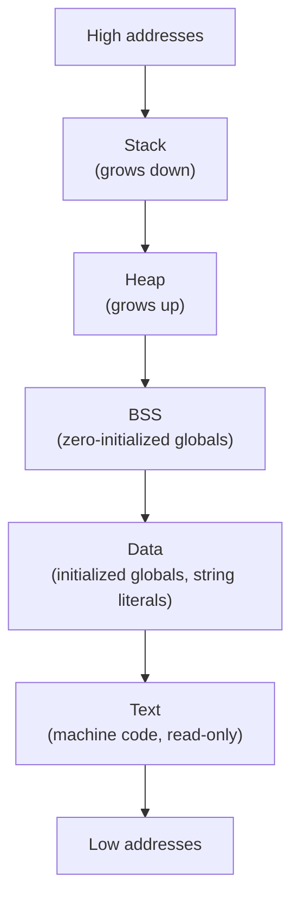
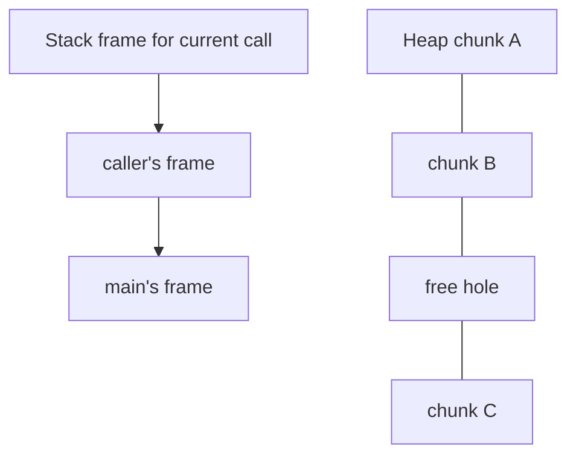

A running C program is not just "code." Its address space is
partitioned into several regions, each with different rules about
*who can write*, *how it grows*, and *when its memory is reclaimed*.
Understanding the map is the foundation for understanding `malloc`,
the stack, and every memory bug class.

## The classic four-segment map

On a typical Unix-style process the layout looks like this:

| Region | What lives here | Lifetime | Writable? |
| --- | --- | --- | --- |
| Text (code) | Compiled machine instructions, often string literals | program lifetime | no |
| Data | Globals / `static` with non-zero initializers | program lifetime | yes |
| BSS | Globals / `static` initialized to zero | program lifetime | yes |
| Heap | `malloc` / `calloc` / `realloc` allocations | until `free` | yes |
| Stack | Function parameters and local variables | function call lifetime | yes |

The WASI runtime uses a similar layout in linear memory; the
addresses just happen to be inside the WebAssembly module's memory
rather than your laptop's physical RAM.

<svg
  viewBox="0 0 640 250"
  role="img"
  aria-label="A cave cross-section of a process address space: read-only code bedrock and globals strata form the floor, green heap stalagmites grow upward, yellow stack stalactites grow down from the high-address ceiling, and a red spark marks the narrowing gap where the two would meet"
  style={{ display: "block", width: "100%", maxWidth: "640px", height: "auto", margin: "2.5rem auto" }}
>
  <rect x="40" y="28" width="560" height="14" rx="6" fill="currentColor" opacity="0.15" />
  <g style={{ color: "var(--ds-yellow-500)" }} fill="currentColor">
    <path d="M316 42 L344 42 L330 116 Z" fillOpacity="0.8" />
    <path d="M380 42 L408 42 L394 100 Z" fillOpacity="0.65" />
    <path d="M422 42 L448 42 L435 78 Z" fillOpacity="0.5" />
    <path d="M462 42 L490 42 L476 108 Z" fillOpacity="0.7" />
    <path d="M504 42 L530 42 L517 70 Z" fillOpacity="0.45" />
    <path d="M544 42 L570 42 L557 90 Z" fillOpacity="0.6" />
  </g>
  <g style={{ color: "var(--ds-green-500)" }} fill="currentColor">
    <path d="M76 158 L91 100 L106 158 Z" fillOpacity="0.6" />
    <path d="M118 158 L131 124 L144 158 Z" fillOpacity="0.45" />
    <path d="M156 158 L171 84 L186 158 Z" fillOpacity="0.7" />
    <path d="M198 158 L210 132 L222 158 Z" fillOpacity="0.4" />
    <path d="M236 158 L250 108 L264 158 Z" fillOpacity="0.55" />
    <path d="M286 158 L302 80 L318 158 Z" fillOpacity="0.8" />
  </g>
  <g style={{ color: "var(--ds-red-500)" }} fill="currentColor">
    <circle cx="320" cy="97" r="4" />
    <path d="M310 88 L316 92 L308 96 Z" fillOpacity="0.7" />
    <path d="M330 102 L336 99 L334 108 Z" fillOpacity="0.7" />
  </g>
  <g style={{ color: "var(--ds-blue-500)" }} fill="currentColor">
    <rect x="40" y="158" width="560" height="22" rx="4" fillOpacity="0.12" />
    <circle cx="370" cy="169" r="3" fillOpacity="0.3" />
    <circle cx="430" cy="169" r="3" fillOpacity="0.3" />
    <circle cx="490" cy="169" r="3" fillOpacity="0.3" />
    <circle cx="550" cy="169" r="3" fillOpacity="0.3" />
    <rect x="40" y="182" width="560" height="22" rx="4" fillOpacity="0.3" />
    <circle cx="140" cy="193" r="3.5" />
    <circle cx="240" cy="193" r="3.5" />
    <circle cx="340" cy="193" r="3.5" />
    <circle cx="460" cy="193" r="3.5" />
  </g>
  <g fill="currentColor">
    <rect x="40" y="206" width="560" height="26" rx="6" opacity="0.3" />
    <rect x="100" y="217" width="16" height="4" rx="2" opacity="0.5" />
    <rect x="132" y="217" width="10" height="4" rx="2" opacity="0.5" />
    <rect x="170" y="217" width="20" height="4" rx="2" opacity="0.5" />
    <rect x="240" y="217" width="12" height="4" rx="2" opacity="0.5" />
    <rect x="300" y="217" width="18" height="4" rx="2" opacity="0.5" />
    <rect x="380" y="217" width="14" height="4" rx="2" opacity="0.5" />
    <rect x="450" y="217" width="20" height="4" rx="2" opacity="0.5" />
    <rect x="520" y="217" width="12" height="4" rx="2" opacity="0.5" />
  </g>
</svg>

## Seeing the regions

You can roughly identify which region a variable lives in by printing
its address.

<CodeBlock
  adapter="c"
  files={[
    {
      filename: "main.c",
      starterCode: `#include <stdio.h>
#include <stdlib.h>

int g_init = 42; // .data    (initialized global)
int g_zero;      // .bss     (zero-initialized global)
static const char *g_literal =
    "hello"; // pointer in .data, "hello" in .rodata/.text

void show(void) {} // .text    (code)

int main(void) {
  int local = 7;                   // stack
  int *heap = malloc(sizeof(int)); // heap
  *heap = 99;

  printf("Code (function show):  %p\\n", (void *)&show);
  printf("Literal \\"hello\\":      %p\\n", (void *)g_literal);
  printf("Initialized global:    %p\\n", (void *)&g_init);
  printf("Zero global:           %p\\n", (void *)&g_zero);
  printf("Heap allocation:       %p\\n", (void *)heap);
  printf("Stack local:           %p\\n", (void *)&local);

  free(heap);
  return 0;
}
`,
    },
  ]}
/>

The exact addresses will differ run to run (modern OSes randomize
them with ASLR), but you should see a rough ordering: code and
literals at the lowest addresses, then globals, then the heap
allocation somewhere higher, and the stack local at the highest
address of all.

## Text and read-only data

The text segment holds the compiled instructions of every function in
your program. It is typically mapped *read-only* — the CPU will fault
if you try to write to it. Many systems also put string literals and
other `const` data in a read-only segment called `.rodata`.

This is why writing through `char *s = "hello"; s[0] = 'X';` is
undefined behavior: the literal `"hello"` lives in `.rodata`, and the
OS will not let you modify it.

## Data and BSS — the globals

C splits globals into two pieces purely as a file-size optimization:

- `.data` holds globals with explicit non-zero initializers. Those
  initial bytes have to be stored in the executable file.
- `.bss` ("Block Started by Symbol") holds globals initialized to
  zero. They take *no space in the executable file* — the OS just
  zeroes a region of memory at load time.

<CodeBlock
  adapter="c"
  files={[
    {
      filename: "main.c",
      starterCode: `#include <stdio.h>

int counter = 0; // BSS (zero init takes no file bytes)
int answer = 42; // DATA (must store the 42 in the binary)
int big[10000];  // BSS — does NOT bloat the binary by 40 KB

int main(void) {
  counter++;
  printf("counter=%d answer=%d big[0]=%d\\n", counter, answer, big[0]);
  return 0;
}
`,
    },
  ]}
/>

A common surprise: declaring a 10-million-element zero-initialized
global does **not** make your binary 40 MB larger, because BSS is
"described by metadata" rather than stored as bytes.

The name, by the way, is one of computing's oldest living fossils.
"Block Started by Symbol" was an assembler directive on the IBM 704
in the mid-1950s — a machine programmed with punched cards, a decade
before C existed. The directive reserved a block of memory without
storing its contents, which is exactly what the segment still does.
Like `a.out` from the toolchain chapter, it is a name that outlived
every machine, operating system, and programmer fashion of its era
because the *idea* it names never stopped being useful.

<svg
  viewBox="0 0 640 180"
  role="img"
  aria-label="On the cargo deck of the executable, initialized globals travel as solid crates with real contents, while zeroed globals are just ghost outlines plus one small yellow manifest tag — BSS ships as metadata, not bytes"
  style={{ display: "block", width: "100%", maxWidth: "520px", height: "auto", margin: "2.5rem auto" }}
>
  <rect x="60" y="136" width="520" height="8" rx="4" fill="currentColor" opacity="0.18" />
  <g style={{ color: "var(--ds-blue-500)" }} fill="currentColor">
    <rect x="92" y="76" width="56" height="56" rx="8" fillOpacity="0.55" />
    <rect x="156" y="76" width="56" height="56" rx="8" fillOpacity="0.4" />
    <rect x="124" y="42" width="56" height="56" rx="8" fillOpacity="0.7" />
    <circle cx="120" cy="104" r="5" />
    <circle cx="184" cy="104" r="5" />
    <circle cx="152" cy="70" r="5" />
  </g>
  <g fill="currentColor" opacity="0.16">
    <path d="M330 76 h56 v56 h-56 Z M336 82 h44 v44 h-44 Z" fillRule="evenodd" />
    <path d="M394 76 h56 v56 h-56 Z M400 82 h44 v44 h-44 Z" fillRule="evenodd" />
    <path d="M458 76 h56 v56 h-56 Z M464 82 h44 v44 h-44 Z" fillRule="evenodd" />
    <path d="M362 42 h56 v56 h-56 Z M368 48 h44 v44 h-44 Z" fillRule="evenodd" />
  </g>
  <g style={{ color: "var(--ds-yellow-500)" }} fill="currentColor">
    <rect x="496" y="36" width="58" height="34" rx="6" fillOpacity="0.9" />
  </g>
  <g fill="currentColor" opacity="0.55">
    <circle cx="512" cy="48" r="2.5" />
    <circle cx="525" cy="48" r="2.5" />
    <circle cx="538" cy="48" r="2.5" />
    <rect x="508" y="57" width="34" height="3" rx="1.5" />
  </g>
  <g fill="currentColor" opacity="0.3">
    <circle cx="524" cy="78" r="2" />
    <circle cx="520" cy="88" r="2" />
    <circle cx="514" cy="98" r="2" />
  </g>
</svg>

## Storage classes for variables

C has several ways to control where a variable lives:

| Declaration | Where it lives | Lifetime |
| --- | --- | --- |
| `int x;` inside a function | Stack | until function returns |
| `int x;` at file scope | BSS (or .data if initialized) | program |
| `static int x;` inside a function | BSS / .data | program (but only visible to that function) |
| `static int x;` at file scope | Like a global, but only visible to that file | program |
| `int *p = malloc(...);` | Heap (the bytes) + wherever `p` is declared (the pointer) | until `free` |
| `register int x;` | Hint to keep in a CPU register | until function returns |

`static` inside a function is a great way to give a function its own
private "memory across calls":

<CodeBlock
  adapter="c"
  files={[
    {
      filename: "main.c",
      starterCode: `#include <stdio.h>

int next_id(void) {
  static int counter = 0; // initialized once, lives in BSS/.data
  return ++counter;
}

int main(void) {
  for (int i = 0; i < 5; i++) {
    printf("id = %d\\n", next_id());
  }
  return 0;
}
`,
    },
  ]}
/>

The `counter` is *not* on the stack — if it were, it would be reset
to zero on every call.

## Stack and heap: the two dynamic regions

The two regions you will think about most are the **stack** and the
**heap**. They are also the two that grow and shrink at runtime.

| | Stack | Heap |
| --- | --- | --- |
| Allocates with | function call (push frame) | `malloc`/`calloc`/`realloc` |
| Frees with | `return` (pop frame) | `free` |
| Speed | very fast (just move a pointer) | slower (bookkeeping) |
| Size limit | small (usually a few MB) | large (gigabytes) |
| Lives across function calls? | no | yes |
| Risk class | stack overflow, dangling pointer to local | leaks, double-free, use-after-free |

The next two pages explore the stack and heap in detail. Before then,
one critical rule:

<Callout type="warn" title="Never return the address of a local variable">
A local variable lives in your stack frame. When you return, the
frame is gone. A pointer to it now refers to whatever the next
function call uses — almost always *not* what you wanted.
</Callout>

<CodeBlock
  adapter="c"
  files={[
    {
      filename: "main.c",
      starterCode: `#include <stdio.h>

int *bad(void) {
  int x = 42; // lives on the stack
  return &x;  // returning the address of a soon-to-die local — UB!
}

int main(void) {
  int *p = bad();
  // Reading *p here is undefined. It may print 42 or anything else.
  printf("*p = %d  (undefined; may be garbage)\\n", *p);
  return 0;
}
`,
    },
  ]}
/>

The correct fix is to either (a) allocate on the heap and let the
caller `free` it, or (b) have the caller pass in a buffer.

## Practice: place variables in the right region

<ChallengeCard
  adapter="c"
  title="Make next_id persist across calls"
  instructions={`Implement \`int next_id(void)\` so that calling it five times in a row returns \`1 2 3 4 5\` (one per line). Use a function-local variable, not a global. Hint: \`static\` changes the storage class.`}
  files={[
    {
      filename: "main.c",
      starterCode: `#include <stdio.h>

int next_id(void) {
  // your code here — make the counter persist across calls
  int counter = 0;
  return ++counter;
}

int main(void) {
  for (int i = 0; i < 5; i++) {
    printf("%d\\n", next_id());
  }
  return 0;
}
`,
      solutionCode: `#include <stdio.h>

int next_id(void) {
  static int counter = 0;
  return ++counter;
}

int main(void) {
  for (int i = 0; i < 5; i++) {
    printf("%d\\n", next_id());
  }
  return 0;
}
`,
    },
  ]}
  tests={[
    {
      id: "ids",
      name: "Counter persists across calls",
      expect: { stdoutLines: ["1", "2", "3", "4", "5"], stdoutLinesExact: true },
    },
  ]}
/>

## Test your understanding

<MultipleChoice
  markdown={`In which segment does a large zero-initialized global like \`int big[100000];\` live, and what does that mean for the executable file size?

- \`.data\` — the binary grows by ~400 KB to store the zeros.
  > That would be true if the array were *non-zero* initialized.
- [o] \`.bss\` — only metadata is stored; the OS zeroes the region at load time, so the binary stays small.
  > BSS exists precisely so zero-initialized globals do not bloat your binary.
- The heap — \`malloc\` is called implicitly at program start.
  > Globals are not heap-allocated; they have static storage duration.
- The stack — the runtime pushes the array on entry to \`main\`.
  > The stack is for function locals, not globals.`}
/>

<MultipleChoice
  markdown={`Why is it dangerous to return \`&local_variable\` from a function?

- Because the address may be the same as another local on the heap.
  > Locals do not live on the heap.
- [o] The local lives in the function's stack frame, which is destroyed when the function returns; the returned address is now dangling.
  > Reading or writing through that pointer is undefined behavior.
- Because the compiler aliases it to \`NULL\` automatically.
  > It does not.
- Because the OS swaps the variable out of memory to disk.
  > That would just be paging; the address would still be valid.`}
/>

<MultipleChoice
  markdown={`What changes if you add \`static\` to a variable declared *inside* a function, like \`static int counter = 0;\`?

- The variable becomes shared across threads.
  > It does not, unless you add synchronization yourself.
- It becomes \`const\` and cannot be modified.
  > \`static\` does not imply \`const\`.
- [o] Its storage class changes from automatic (stack) to static (BSS/.data); it is initialized once and keeps its value across calls.
  > The variable's *visibility* stays local to the function, but its *lifetime* becomes the whole program.
- The variable is moved to the heap.
  > Static variables live in BSS or .data, not on the heap.`}
/>
