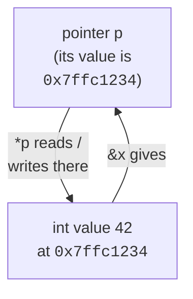

A pointer is just a variable whose value is the address of another
piece of memory. That one sentence is the whole concept, and also
the source of half the things that make C feel hard.

If the sentence feels slippery, try the postal version. Every house
on a street has an address. A pointer is a slip of paper with an
address written on it. The slip is not the house: you can copy the
slip, lose the slip, or write a different address on it, all without
touching the house. But if you *walk to* the address on the slip,
that's dereferencing, you arrive at the actual house and can look
inside or repaint the door. Everything on this page is a precise
version of that picture: `&` writes a house's address onto a slip,
`*` walks to whatever address a slip currently holds.

<Figure
  slug="sysc-pointers-cutout"
  alt="A small slip of paper on a platform carrying an address, a thin arrow running from it to a distant storage cell"
/>

## Variables live at addresses

When you write `int x = 42;`, the compiler picks a memory address for
`x`, makes sure that address holds the four bytes of `42`, and from
then on the *name* `x` refers to that address.

The `&` operator gives you the address itself. The `%p` format
specifier prints it in hex (after a cast to `void *`).

<CodeBlock
  adapter="c"
  files={[
    {
      filename: "main.c",
      starterCode: `#include <stdio.h>

int main(void) {
  int x = 42;
  double y = 3.14;
  char c = 'Q';

  printf("x = %d  at address %p\\n", x, (void *)&x);
  printf("y = %g  at address %p\\n", y, (void *)&y);
  printf("c = %c  at address %p\\n", c, (void *)&c);
  return 0;
}
`,
    },
  ]}
/>

The addresses you see are inside the WASI sandbox's virtual address
space; they are not your laptop's RAM addresses. But the *idea* is
universal.

## Declaring and dereferencing pointers

A pointer's type tells the compiler what it points to:

```c
int    *pi;   // pi is a pointer to int
double *pd;   // pd is a pointer to double
char   *ps;   // ps is a pointer to char (often the start of a string)
```

Two operators move between values and addresses:

| Operator | Reads as | Returns |
| --- | --- | --- |
| `&x` | "address of `x`" | a pointer |
| `*p` | "value at `p`" | the thing it points to (dereference) |



<CodeBlock
  adapter="c"
  files={[
    {
      filename: "main.c",
      starterCode: `#include <stdio.h>

int main(void) {
  int x = 10;
  int *p = &x; // p now holds the address of x

  printf("x is %d\\n", x);
  printf("*p is %d\\n", *p);

  *p = 99; // write through the pointer
  printf("After *p = 99, x is %d\\n", x);
  return 0;
}
`,
    },
  ]}
/>

## NULL: the "points to nothing" pointer

A pointer that does not point anywhere meaningful should be `NULL`
(defined in `<stddef.h>`, usually as `((void*)0)`). Dereferencing a
`NULL` pointer is undefined behavior, usually a crash.

The idea of a special "points at nothing" value is older than C, and
its inventor regrets it. Tony Hoare added the null reference to the
ALGOL W language in 1965, in his words, "simply because it was so
easy to implement." At a conference in 2009 he formally apologized,
calling it his **billion-dollar mistake**: his estimate of what null
dereferences have cost the industry in crashes, vulnerabilities, and
debugging time over four decades. C inherited the idea wholesale, so
you will be living with Hoare's mistake for the rest of this course.
The discipline that keeps it survivable is simple and non-negotiable:
*check before you dereference.*

<CodeBlock
  adapter="c"
  files={[
    {
      filename: "main.c",
      starterCode: `#include <stddef.h>
#include <stdio.h>

void print_if_some(int *p) {
  if (p == NULL) {
    printf("(nothing)\\n");
  } else {
    printf("value: %d\\n", *p);
  }
}

int main(void) {
  int x = 7;
  print_if_some(&x);
  print_if_some(NULL);
  return 0;
}
`,
    },
  ]}
/>

<Callout type="warn" title="Always initialize pointers">
An uninitialized pointer holds *garbage*, whatever bytes happened to
be in that memory before. Dereferencing it is undefined behavior.
Either give it a real address or set it to `NULL`.
</Callout>

## Why pointers matter: pass-by-pointer

C passes arguments **by value**. If a function takes an `int`, it
gets a copy. Modifying that copy does nothing to the caller.

<CodeBlock
  adapter="c"
  files={[
    {
      filename: "main.c",
      starterCode: `#include <stdio.h>

void try_to_swap(int a, int b) {
  int t = a;
  a = b;
  b = t;
  printf("inside: a=%d b=%d\\n", a, b);
}

int main(void) {
  int x = 1, y = 2;
  try_to_swap(x, y);
  printf("outside: x=%d y=%d\\n", x, y);
  return 0;
}
`,
    },
  ]}
/>

The `try_to_swap` function does swap its *local copies*, but the
caller's `x` and `y` are untouched. To actually modify the caller's
variables, pass their addresses:

<CodeBlock
  adapter="c"
  files={[
    {
      filename: "main.c",
      starterCode: `#include <stdio.h>

void swap(int *a, int *b) {
  int t = *a;
  *a = *b;
  *b = t;
}

int main(void) {
  int x = 1, y = 2;
  swap(&x, &y);
  printf("x=%d y=%d\\n", x, y);
  return 0;
}
`,
    },
  ]}
/>

This is also how functions can "return" multiple values, give them
output pointers.

<CodeBlock
  adapter="c"
  files={[
    {
      filename: "main.c",
      starterCode: `#include <stdio.h>

// Returns 0 on success and fills *quot and *rem.
// Returns -1 if denom is zero.
int divmod(int num, int denom, int *quot, int *rem) {
  if (denom == 0) {
    return -1;
  }
  *quot = num / denom;
  *rem = num % denom;
  return 0;
}

int main(void) {
  int q, r;
  if (divmod(17, 5, &q, &r) == 0) {
    printf("17 / 5 = %d remainder %d\\n", q, r);
  }
  return 0;
}
`,
    },
  ]}
/>

## `const` pointers vs pointers to `const`

Two `const` positions, two meanings:

| Declaration | Can you change the pointer? | Can you change what it points to? |
| --- | --- | --- |
| `int *p` | yes | yes |
| `const int *p` (pointer to const) | yes | no |
| `int *const p` (const pointer) | no | yes |
| `const int *const p` | no | no |

Read right-to-left: "p is a const pointer to a const int."

<Figure
  slug="sysc-pointers-inline-cutout"
  alt="A strip of lockers with a card in one locker whose arrow reaches across to another, and a cord following that arrow"
/>

<Callout type="info" title="Library convention: const pointers for read-only inputs">
When a function only reads through a pointer, declare it
`const T *`. It signals intent, lets callers pass pointers to
read-only data, and helps the compiler optimize.
</Callout>

## `void *`: the type-erased pointer

A `void *` is a pointer with no element type. It can hold the address
of *anything*, but you cannot dereference it directly, the compiler
does not know how many bytes to read or how to interpret them.

`malloc` returns `void *`. So do many generic library functions like
`memcpy`. You assign or cast it back to a typed pointer to use it.

<CodeBlock
  adapter="c"
  files={[
    {
      filename: "main.c",
      starterCode: `#include <stdio.h>
#include <string.h>

int main(void) {
  int a = 0xDEADBEEF;
  int b = 0;

  // memcpy takes void *, works with any types.
  memcpy(&b, &a, sizeof(int));
  printf("b = 0x%X\\n", b);
  return 0;
}
`,
    },
  ]}
/>

## Pointers to pointers

A pointer is a value, so you can take *its* address too. Patterns
like this are how you write functions that allocate memory on behalf
of the caller and store the new pointer in one of the caller's
variables.

<CodeBlock
  adapter="c"
  files={[
    {
      filename: "main.c",
      starterCode: `#include <stdio.h>

int main(void) {
  int x = 7;
  int *p = &x;   // p points to x
  int **pp = &p; // pp points to p

  printf("x  = %d\\n", x);
  printf("*p = %d\\n", *p);
  printf("**pp = %d\\n", **pp);

  **pp = 99;
  printf("after **pp = 99, x = %d\\n", x);
  return 0;
}
`,
    },
  ]}
/>

We will see this pattern again in the heap chapter when a function
needs to *replace* the caller's pointer with a new allocation.

## Practice: swap two integers

<ChallengeCard
  adapter="c"
  title="Implement swap()"
  instructions={`Implement \`void swap(int *a, int *b)\` so that, after the call, the values pointed to by \`a\` and \`b\` are exchanged. The provided \`main\` calls \`swap\` and prints the result.`}
  files={[
    {
      filename: "main.c",
      starterCode: `#include <stdio.h>

void swap(int *a, int *b) {
  // your code here
}

int main(void) {
  int x = 11, y = 22;
  swap(&x, &y);
  printf("%d %d\\n", x, y);
  return 0;
}
`,
      solutionCode: `#include <stdio.h>

void swap(int *a, int *b) {
  int t = *a;
  *a = *b;
  *b = t;
}

int main(void) {
  int x = 11, y = 22;
  swap(&x, &y);
  printf("%d %d\\n", x, y);
  return 0;
}
`,
    },
  ]}
  tests={[
    {
      id: "swapped",
      name: "Values are swapped",
      expect: { stdoutEquals: "22 11" },
    },
  ]}
/>

## Practice: min and max via output pointers

<ChallengeCard
  adapter="c"
  title="Return two values via output pointers"
  instructions={`Implement \`void min_max(int a, int b, int c, int *out_min, int *out_max)\` so it writes the minimum of \`a, b, c\` to \`*out_min\` and the maximum to \`*out_max\`. The provided \`main\` calls it for \`(7, 2, 9)\` and prints \`min=2 max=9\`.`}
  files={[
    {
      filename: "main.c",
      starterCode: `#include <stdio.h>

void min_max(int a, int b, int c, int *out_min, int *out_max) {
  // your code here
}

int main(void) {
  int lo = 0, hi = 0;
  min_max(7, 2, 9, &lo, &hi);
  printf("min=%d max=%d\\n", lo, hi);
  return 0;
}
`,
      solutionCode: `#include <stdio.h>

void min_max(int a, int b, int c, int *out_min, int *out_max) {
  int lo = a;
  if (b < lo)
    lo = b;
  if (c < lo)
    lo = c;
  int hi = a;
  if (b > hi)
    hi = b;
  if (c > hi)
    hi = c;
  *out_min = lo;
  *out_max = hi;
}

int main(void) {
  int lo = 0, hi = 0;
  min_max(7, 2, 9, &lo, &hi);
  printf("min=%d max=%d\\n", lo, hi);
  return 0;
}
`,
    },
  ]}
  tests={[
    {
      id: "min_max_basic",
      name: "Correct min and max",
      expect: { stdoutEquals: "min=2 max=9" },
    },
  ]}
/>

## Test your understanding

<MultipleChoice
  markdown={`What does the expression \`*p\` do when \`p\` is an \`int *\`?

- It marks \`p\` as a pointer in the declaration.
  > That meaning of \`*\` only applies in declarations, not in expressions.
- It takes the address of \`p\`.
  > That is the unary \`&\` operator.
- It computes the product of \`p\` with itself.
  > That would only be true if \`p\` were a number being multiplied.
- [o] It reads (or assigns to) the \`int\` value stored at the address \`p\` holds.
  > \`*\` is the *dereference* operator.`}
/>

<MultipleChoice
  markdown={`Why does the function \`void try_to_swap(int a, int b)\` fail to actually swap the caller's variables?

- [o] Because C passes arguments **by value**, the function gets copies of the caller's ints, and modifying the copies leaves the originals untouched.
  > To modify the caller's variables you must pass *pointers* to them.
- Because C does not support swapping at all.
  > C absolutely supports swapping; you just need pointers.
- Because \`int\` is not large enough to be swapped on this machine.
  > Size has nothing to do with it.
- Because the compiler optimizes the swap away.
  > Even with optimization disabled, the function still cannot affect the caller's variables.`}
/>

<MultipleChoice
  markdown={`Given \`const int *p\`, which statement is true?

- The pointer is automatically initialized to \`NULL\`.
  > Initialization is unrelated to \`const\`.
- [o] You cannot modify the \`int\` that \`p\` currently points at through \`p\`.
  > \`const int *p\` is a pointer to a *const* int; the pointer itself can be reassigned, but writes through it are forbidden.
- The compiler stores the int in read-only memory.
  > \`const\` is a promise about access through this pointer, not a statement about where the int lives.
- You cannot change \`p\` to point at a different \`int\`.
  > That would require \`int *const p\` (a const *pointer*, not a pointer to const).`}
/>
