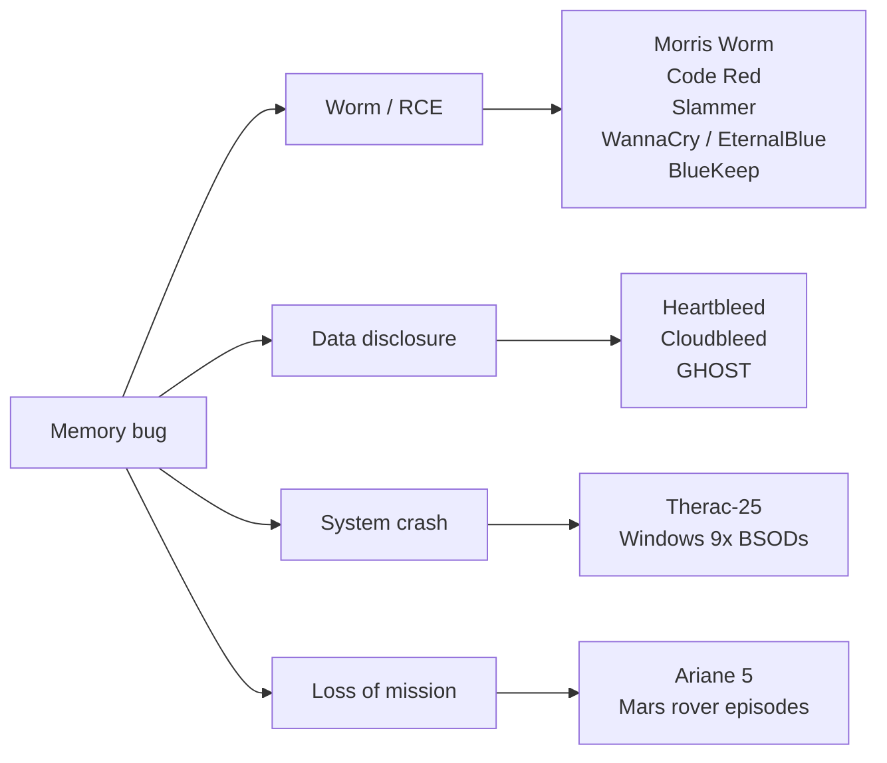

The bug classes from the last page are not academic curiosities.
They are the root cause of an enormous share of real-world software
failures, from research-lab incidents to internet-scale security
catastrophes that affected hundreds of millions of users and cost
billions of dollars.

This page is a tour of the most instructive incidents. For each one
we identify *which* bug class from the previous page caused it, and
what the world learned (or should have learned).



## 1. The Morris Worm (1988), gets() and a buffer overflow

In November 1988, a graduate student named Robert Morris released a
self-replicating program that within hours infected an estimated 10%
of all computers on the internet, roughly 6,000 machines at the
time. It was the world's first major internet worm and led directly
to the creation of CERT/CC, the first computer-emergency response
team.

<Figure
  slug="sysc-disasters-cutout"
  alt="A toppled satellite model and a cracked server block on a platform, one small overflowing buffer strip between them"
/>

One of its key propagation vectors exploited a *stack buffer
overflow* in the BSD `fingerd` daemon. `fingerd` read a request into
a fixed-size local buffer using `gets()`:

```c
char line[512];
gets(line);            // reads until newline, no length check at all
```

`gets()` has no way to know how big `line` is. By sending a longer
request, the worm overwrote the function's return address on the
stack and redirected execution into shellcode it had injected as
part of the input.

<Figure
  slug="sysc-disasters-morris-worm-cutout"
  alt="A row of small desktop computers along a bench with a coil threading out of the first and into each of the others, the last two toppled"
  caption="November 1988: roughly 6,000 machines, about a tenth of the internet, and the reason CERT exists."
/>

**Bug class:** stack buffer overflow.
**Fallout:** Morris received the first conviction under the U.S.
Computer Fraud and Abuse Act. `gets()` was deprecated in C99 and
*removed* from C11. Decades later, `-fstack-protector`, ASLR, and
non-executable stacks are all responses to this attack pattern.

<Callout type="warn" title="`gets()` is so dangerous it was removed from the language">
If you see `gets(buf)` in any code, replace it immediately with
`fgets(buf, sizeof buf, stdin)`. There is no safe way to use the
original.
</Callout>

## 2. Code Red (2001), IIS, .ida, and one bad URL

In July 2001, a worm called Code Red infected over 350,000 Microsoft
IIS web servers in under 14 hours and defaced their home pages with
the message *"HELLO! Welcome to http://www.worm.com! Hacked by
Chinese!"*. It also tried to launch a DDoS against the White House
web server.

The vulnerability: a *stack buffer overflow* in the `.ida` (Indexing
Service) ISAPI extension. A specially crafted URL of about 240
"`N`"s in the ISAPI parameter overran a fixed-size buffer that
copied URL-decoded input with no length check, overwriting the
return address.

**Bug class:** stack buffer overflow (again).
**Fallout:** estimated $2.6 billion in cleanup and lost productivity.
Microsoft turned the Indexing Service off by default and the
incident became a textbook example used in every secure-coding
course since.

## 3. SQL Slammer (2003), 376 bytes, the whole internet

Slammer is famous for two things: it was tiny (the entire payload
fit in a single 376-byte UDP packet) and it was *fast*, it doubled
the infected population every 8.5 seconds and effectively saturated
the global internet's routing capacity within ten minutes.

<Figure
  slug="sysc-disasters-sql-slammer-cutout"
  alt="One tiny packet block multiplying into a spreading fan of identical packets that swamps two small server racks"
  caption="January 2003: 376 bytes, no disk write, and most of its damage done inside ten minutes."
/>

The bug: a *stack buffer overflow* in the SQL Server 2000 Resolution
Service that listened on UDP port 1434. The worm sent one carefully
crafted packet; the vulnerable server's stack got smashed; the
overwritten return address pointed back into the packet payload,
which then ran as shellcode and re-sent itself to randomly chosen IP
addresses.

**Bug class:** stack buffer overflow in a UDP service.
**Fallout:** ATMs offline, Continental Airlines cancellations, 911
call centers degraded, large parts of South Korea's internet went
dark for hours.

## 4. Heartbleed (2014), a two-byte length field, half a million sites

Heartbleed (CVE-2014-0160) was a vulnerability in OpenSSL's
implementation of the TLS Heartbeat extension. It did not corrupt
memory or crash the server, it did something arguably worse: it
let any attacker read up to ~64 KB of the server's process memory
*per request*, with no authentication and no log trace.

<Figure
  slug="sysc-disasters-heartbleed-cutout"
  alt="A padlock split open around a heart-shaped valve, with a ribbon of memory unspooling out of the crack carrying keys and cards away"
  caption="CVE-2014-0160: a heartbeat that answered with 64 KB of whatever was next to the buffer."
/>

The bug, distilled:

```c
// payload_length comes from the network, attacker-controlled.
memcpy(response, request->data, payload_length);
// Then send `response` (with that length) back to the attacker.
```

If the attacker claimed `payload_length = 65535` but only actually
sent a few bytes of `data`, OpenSSL happily read 65535 bytes
*starting at the buffer's address* and shipped them back. Those
bytes contained anything that happened to be in the process, TLS
private keys, session cookies, user passwords, fragments of other
users' HTTP requests.

**Bug class:** *buffer over-read* (closely related to overflow, same
"trust attacker-supplied length" mistake, but reading rather than
writing).
**Fallout:** roughly 17% of all "secure" web servers in the world
were vulnerable on the day of disclosure. Every TLS certificate that
might have been exposed had to be reissued. The xkcd cartoon
explaining it became one of the most-shared technical comics ever.

<Callout type="info" title="Lesson: never trust a length field from the network">
Always cross-check declared lengths against what you actually
received. This is the most important sentence in network parser
code.
</Callout>

## 5. Cloudbleed (2017), one missing `=`, a months-long leak

In February 2017, Google's Project Zero discovered that Cloudflare's
edge servers, which sit in front of an enormous fraction of the
web, had been intermittently injecting fragments of *random other
customers' traffic* into HTTP responses. Sensitive data showed up in
search engine caches: private messages, OAuth tokens, password
manager hints, hotel booking details.

The cause: an HTML-rewriting parser written in Ragel (which
generates C). The end-of-buffer check used `==` where it should have
used `>=`:

```c
/* roughly */
if (++p == pe) goto _test_eof;        /* WRONG: misses by one byte */
/* should have been:               */
if (++p >= pe) goto _test_eof;
```

When a page ended exactly one byte short of an expected boundary,
the parser would skip the end-of-buffer test and read past the end
of the page buffer, into whatever happened to be in the next memory
region.

**Bug class:** *off-by-one*, leading to a buffer over-read.
**Fallout:** during the worst stretch, Cloudflare estimated that
roughly 1 in every 3.3 million HTTP requests passing through its
edge leaked memory, a tiny rate multiplied by an enormous volume of
traffic, over a period of months. The fix was a single character;
the cleanup, hunting down and purging leaked fragments from search
engine caches across the entire web, took weeks of coordinated
work with Google, Bing, and others.

## 6. Stagefright (2015), Android, a media file, and one integer overflow

Stagefright was a family of vulnerabilities in Android's media
framework. The headline bug allowed remote code execution on roughly
**95% of all Android devices** simply by sending a malicious MMS
message. The phone would parse the attached video automatically, no
user interaction required.

The core defect was an *integer overflow* in a 32-bit `size` value
inside the MP4 parser. When the parser computed `size + something`
to allocate a buffer, the addition wrapped around to a small number;
the parser allocated a tiny buffer, then merrily wrote attacker-
controlled data into it as if it were huge, a classic
*overflow-then-heap-buffer-overflow* combination.

**Bug class:** integer overflow → heap buffer overflow.
**Fallout:** an estimated 950 million Android phones were
vulnerable. The incident pushed Google to adopt monthly security
patches and accelerated the rewrite of media parsing into
memory-safer languages.

## 7. GHOST (2015), `gethostbyname` and a forgotten `+ 1`

CVE-2015-0235 was a buffer overflow in glibc's `__nss_hostname_digits_dots`
helper, reached via the venerable `gethostbyname` family. The bug:
a length calculation forgot to include one byte for the null
terminator, allowing a carefully sized hostname to overflow a heap
buffer by a few bytes, enough to corrupt allocator metadata and
hand control to the attacker.

**Bug class:** *off-by-one* (the `+ 1` for the null terminator,
again) → heap buffer overflow.
**Fallout:** every Linux distribution had to push an emergency
glibc update. Because `gethostbyname` is reached by an enormous
range of code, mail servers, web servers, login services, anything
that resolves a hostname, the attack surface was huge.

## 8. EternalBlue / WannaCry (2017), SMB and the NSA's leaked exploit

EternalBlue was an exploit developed by the NSA's Tailored Access
Operations group and leaked publicly by the *Shadow Brokers* in
April 2017. It targeted a *buffer overflow* in Microsoft's SMBv1
file-sharing protocol, specifically, an integer truncation in the
handling of crafted FEA (File Extended Attributes) lists let
attacker data spill out of a heap buffer.

A month later, the WannaCry ransomware worm picked up EternalBlue
and used it to encrypt files on hundreds of thousands of computers
in 150+ countries. The UK's National Health Service had to cancel
operations. FedEx, Renault, Deutsche Bahn, and Telefónica were all
disrupted.

**Bug class:** integer truncation / underflow → heap buffer overflow
in a network service.
**Fallout:** estimated $4–8 billion in total damages. The episode
hardened the case for getting old C network services out of the
trust path entirely.

## 9. BlueKeep (2019), RDP and use-after-free

CVE-2019-0708, nicknamed BlueKeep, was a *use-after-free* in
Microsoft's Remote Desktop Protocol. A pre-authentication attacker
could trigger an RDP channel-rebinding code path that freed a
structure but kept a dangling pointer to it; subsequent operations
through that pointer were attacker-controllable.

Microsoft considered BlueKeep severe enough to release patches even
for unsupported operating systems (XP, Server 2003), something it
almost never does.

**Bug class:** use-after-free.
**Fallout:** over a million machines were estimated to still be
vulnerable months after disclosure. Worm-grade RDP exposure became
a board-level conversation at many enterprises.

## 10. The Therac-25 (1985–87), race conditions, reused state, six deaths

The Therac-25 was a radiation therapy machine produced by Atomic
Energy of Canada Limited. Between 1985 and 1987 it gave at least six
patients massive radiation overdoses, hundreds of times the
intended dose. At least three died as a direct result.

<Figure
  slug="sysc-disasters-therac-25-cutout"
  alt="A radiation therapy machine aiming a beam at an empty couch, an operator at a console across the room, and a safety latch lying detached on the floor"
  caption="Therac-25, 1985 to 1987: the hardware interlock earlier models carried was removed, leaving the software alone."
/>

The Therac-25's software was written in PDP-11 assembly (not C), but
its failure modes are the systems-programming nightmare scenarios
this course has been preparing you to recognize. They included:

- **Race conditions** between operator input and the machine setup
  routines, fast typing could "skip ahead" of internal state
  changes.
- **Stale, reused state** in a one-byte flag variable (`Class3`) that
  overflowed back to 0 every 256 setup runs, silently disabling a
  safety check.
- **No hardware interlock** to back up the software, earlier models
  had one; the Therac-25 removed it because "the software was now
  good enough."

**Bug classes:** concurrency bugs, integer overflow used as a flag,
and over-reliance on unverified software.
**Fallout:** the case became the canonical "killer software" study
taught in every software-engineering ethics course. It is the
clearest possible argument for defense in depth, and for not
removing safety hardware on the assumption that the code is correct.

## 11. Ariane 5 Flight 501 (1996), a 64→16-bit cast, $370 million

On its maiden flight, the European Space Agency's Ariane 5 rocket
self-destructed 37 seconds after launch, taking with it four
scientific satellites and roughly $370 million.

The cause was not, strictly, a memory bug, but it is a textbook
example of the kind of UB-adjacent disaster C programmers are
trained to fear. The Inertial Reference System reused code from the
Ariane 4. A 64-bit floating-point value representing "horizontal
bias" was converted to a 16-bit signed integer. On Ariane 4 the
value never exceeded the 16-bit range. On Ariane 5, which had a
faster trajectory, it did. The conversion *overflowed*, the IRS
raised an exception, both redundant IRS computers (running the
*same* code) shut down, the autopilot lost attitude data, the
rocket veered off course, and the range safety system destroyed it.

**Bug class:** unchecked integer conversion / overflow (very close
to the `(int16_t)x` truncation patterns we have seen on the data
types page).
**Fallout:** the formal investigation produced one of the most
widely studied accident reports in software engineering. The lesson,
*"the same code is not safe just because it was safe in a
different environment"*, applies directly to porting C code across
architectures.

## 12. PlayStation 3 hypervisor break (2010), a glitch and a dangling mapping

In January 2010, George Hotz (geohot) published an attack on the
PS3's hypervisor, the privileged layer that kept the console's
"OtherOS" Linux feature safely caged. His technique combined
software and a literal hardware glitch: he had Linux ask the
hypervisor to create and then tear down memory mappings while he
pulsed a wire on the memory bus at precisely the wrong moment, so
the hypervisor's *deallocation write was lost in transit*. The
hypervisor believed a mapping was gone; the page tables still
contained it. Through that dangling, stale mapping he could read
and write hypervisor-owned memory, in effect, a use-after-free
where the "free" itself was sabotaged from outside the software.

**Bug class:** use-after-free across a privilege boundary.
**Fallout:** "OtherOS" Linux support on the PS3 was permanently
removed by Sony; a class-action lawsuit followed; the broader
console-hacking community took the techniques and applied them to
later consoles for years.

## What the pattern looks like

If you re-read this page in one sitting, a small number of root
causes account for most of the catastrophes:

| Root cause | Examples in this list |
| --- | --- |
| Stack/heap buffer overflow from a missing length check | Morris, Code Red, Slammer, Stagefright, EternalBlue, GHOST |
| Buffer **over-read** from a missing length check | Heartbleed, Cloudbleed |
| Use-after-free across a trust boundary | BlueKeep, PS3 hypervisor |
| Integer overflow / unchecked conversion preceding the above | Stagefright, EternalBlue, Ariane 5 |
| Off-by-one (forgotten `+ 1` for terminator or `<` vs `<=`) | GHOST, Cloudbleed |
| Stale / reused state across operations | Therac-25 |

Notice that the **bug classes are the same handful we covered on
the previous page**. The catastrophes differ in the size of the
audience, not in the technique.

## How modern systems push back

Every disaster on this list has shaped the defensive layers we now
take for granted:

| Defense | Inspired largely by |
| --- | --- |
| `gets()` removal, `snprintf`, `fgets` | Morris Worm |
| Stack canaries (`-fstack-protector`) | Code Red, Slammer |
| ASLR, non-executable stacks/heaps (NX/DEP), W^X | Code Red, Slammer, EternalBlue |
| Mandatory monthly security patching (Android, iOS) | Stagefright |
| AddressSanitizer / UBSan / MSan on every commit | Heartbleed, BlueKeep |
| Memory-safe languages for new system software (Rust in Android, Linux, Windows) | All of the above |
| TLS certificate transparency, post-Heartbleed mass rotation | Heartbleed |
| Sandboxing of network parsers (process isolation, seccomp) | EternalBlue, BlueKeep |
| Formal verification of safety-critical code (SCADE, Frama-C) | Therac-25, Ariane 5 |

You will rarely write the next OpenSSL, but you will probably write
some C or C-FFI'd code in your career. The right mindset is:

> *Every length came from somewhere, and somewhere is sometimes an
> attacker.*

If you can hold that thought every time you compute an index, write
a `memcpy`, or pass a buffer across a trust boundary, you have
already absorbed the most important lesson of this chapter.

## Test your understanding

<MultipleChoice
  markdown={`Heartbleed (2014) allowed attackers to read large slices of OpenSSL server memory without authentication. What bug class did it exploit?

- A stack overflow during certificate parsing.
  > Heartbleed was a *read* past a heap buffer; no stack frame was overwritten.
- [o] A buffer **over-read**: the server trusted an attacker-supplied length field and \`memcpy\`'d that many bytes out of its own memory back to the attacker.
  > The defensive lesson is "never trust a length field from the network without checking it against what you actually received."
- A use-after-free in the TLS session cache.
  > That would be a different bug class; Heartbleed was a length-trust problem.
- A double-free during certificate rotation.
  > Not Heartbleed.`}
/>

<MultipleChoice
  markdown={`The 1988 Morris Worm propagated in part by exploiting a stack buffer overflow in the BSD \`fingerd\` daemon. Which single C standard library function is most directly responsible?

- \`strncpy\`
  > \`strncpy\` has its own footguns but did not cause this incident.
- \`printf\`
  > \`printf\` formatting bugs are dangerous but were not the Morris Worm vector.
- \`malloc\`
  > \`malloc\` itself was not the issue.
- [o] \`gets\`, which reads input into a buffer with no length check at all.
  > \`gets\` is so dangerous it was deprecated in C99 and removed in C11.`}
/>

<MultipleChoice
  markdown={`Cloudbleed (2017) leaked private data from many websites because of a single-character bug. Which bug class from the previous page was it an instance of?

- Use-after-free.
  > Cloudbleed did not free memory and then reuse it.
- An integer overflow during certificate signing.
  > Cloudbleed was an HTML-rewriting parser bug, unrelated to certificates.
- Double-free.
  > Same, no double free was involved.
- [o] An *off-by-one* error (the end-of-buffer test used \`==\` instead of \`>=\`), causing a buffer over-read.
  > A one-character fix; weeks of cache purging to clean up.`}
/>

<MultipleChoice
  markdown={`What single defensive habit, applied consistently, would have prevented or significantly contained Morris, Code Red, Slammer, Heartbleed, Stagefright, GHOST, and EternalBlue?

- Always free pointers immediately after allocating them.
  > That would just guarantee use-after-free bugs.
- Always use \`gets()\` because it is the simplest input function.
  > Never use \`gets()\`, it is the canonical example of *what not to do*.
- [o] Cross-check every length that comes from outside the program (network, file, user) against the size of the buffer it will be written to or read from.
  > Almost every catastrophe on the page reduces to "trusted a length field that should have been validated."
- Always cast \`size_t\` to \`int\` to keep types simple.
  > The opposite, that is a common source of integer-truncation bugs.`}
/>

<Callout type="success" title="The most important takeaway">
Every bug on this page was, at the time, written by a competent
engineer who believed the code was correct. The defensive habits
this course teaches, bounds checks, owned buffers, length
validation, sanitizers in CI, are not paranoia. They are the
accumulated lessons of decades of expensive failures. Internalize
them now, and you join a small group of C programmers who do not
have to learn them the hard way.
</Callout>
