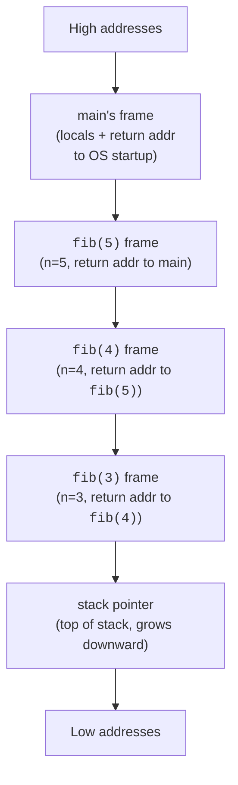

Every time you call a function in C, the runtime pushes a **stack
frame** that holds the function's parameters, local variables, and
the return address it needs to come back to its caller. When the
function returns, that frame is popped, and every local in it is
gone.

This page makes that mechanism concrete enough that you can predict
how recursion uses memory and where local pointers stop being safe to
read.

<Figure
  slug="sysc-stack-functions-cutout"
  alt="A vertical column of stacked frame plates on a platform, the topmost being lifted away and discarded"
/>

## Anatomy of a stack frame

A typical frame contains:

- the **return address** (where to resume in the caller)
- the **saved frame pointer** (so debuggers can walk the call chain)
- the function's **parameters** (or in many ABIs, copies of register
  arguments)
- the function's **local variables**
- on some platforms, **padding** to keep alignment



The stack typically grows from high addresses to low, every call
*subtracts* from the stack pointer, every return adds back. On WASI
the direction is the same conceptually even if the linear memory
layout differs.

## See the stack with addresses

You can see the call chain by printing addresses of local variables.

<CodeBlock
  adapter="c"
  files={[
    {
      filename: "main.c",
      starterCode: `#include <stdio.h>

void inner(void) {
  int x = 0;
  printf("inner  : &x = %p\\n", (void *)&x);
}

void middle(void) {
  int x = 0;
  printf("middle : &x = %p\\n", (void *)&x);
  inner();
}

int main(void) {
  int x = 0;
  printf("main   : &x = %p\\n", (void *)&x);
  middle();
  return 0;
}
`,
    },
  ]}
/>

The addresses of `x` in `main`, `middle`, and `inner` should be
decreasing (or sometimes increasing, the direction is
platform-dependent), and the difference between consecutive frames
shows roughly how big each frame is.

## Recursion uses the stack

Each recursive call pushes a new frame. A function that recurses `n`
times uses `n` frames at peak, so a recursion depth limit is really
a *stack size* limit.

<CodeBlock
  adapter="c"
  files={[
    {
      filename: "main.c",
      starterCode: `#include <stdio.h>

long fib(int n) {
  if (n < 2)
    return n;
  return fib(n - 1) + fib(n - 2);
}

int main(void) {
  for (int i = 0; i < 10; i++) {
    printf("fib(%d) = %ld\\n", i, fib(i));
  }
  return 0;
}
`,
    },
  ]}
/>

`fib(40)` would push roughly 2 × 10⁸ frames in total over its run
(though only ~40 are alive at once because the calls return between
them). The total *work* explodes; the peak *stack depth* is only `n`.

## Stack overflow

Where it happens is the stack budget divided by the frame size, and the
frame size is set by the locals rather than by the algorithm:

<Chart slug="stack-depth-overflow" />

When recursion is too deep, or a function declares a huge local
array, you hit the end of the stack region and the program crashes
with a stack overflow.

The error is common enough to have a website named after it. When
Jeff Atwood and Joel Spolsky launched their programming Q&A site in
2008, they let readers vote on the name, and *Stack Overflow* won,
a knowing joke that the place you go when your program crashes
should be named after one of the crashes. The bug earned that fame
honestly: it is one of the few failures that can happen *before
your first line of code runs* (a too-large local array can blow the
stack during function entry) and one of the few that recursion makes
trivially easy to write.

<Callout type="warn" title="Beware huge stack arrays">
A local declaration like `char buf[16 * 1024 * 1024];` allocates 16 MB
on the stack. On many platforms the entire stack is only 1 MB, and
this will crash before `main` runs a single line. Use the heap
(`malloc`) for large buffers.
</Callout>

<CodeBlock
  adapter="c"
  files={[
    {
      filename: "main.c",
      starterCode: `#include <stdio.h>

// Run this and watch how deep the recursion gets before stack overflow.
// We print a count once per 1000 levels so output stays readable.
int recurse(int depth) {
  if (depth % 1000 == 0) {
    printf("at depth %d\\n", depth);
  }
  return recurse(depth + 1) + 1;
}

int main(void) {
  // Beware: this will eventually crash with a stack overflow.
  // Comment the next line out if you'd rather not see the crash.
  recurse(0);
  return 0;
}
`,
    },
  ]}
/>

## Iteration vs recursion, same algorithm, different memory shape

Many recursive algorithms have iterative equivalents that use O(1)
stack instead of O(n). Compare:

<CodeBlock
  adapter="c"
  files={[
    {
      filename: "main.c",
      starterCode: `#include <stdio.h>

// Recursive, uses n stack frames.
long fact_rec(int n) {
  if (n <= 1)
    return 1;
  return n * fact_rec(n - 1);
}

// Iterative, uses one stack frame regardless of n.
long fact_iter(int n) {
  long product = 1;
  for (int i = 2; i <= n; i++)
    product *= i;
  return product;
}

int main(void) {
  printf("fact_rec(10)  = %ld\\n", fact_rec(10));
  printf("fact_iter(10) = %ld\\n", fact_iter(10));
  return 0;
}
`,
    },
  ]}
/>

Both compute the same value. The iterative version is friendlier on
the stack and easier for an optimizer to reduce to a tight loop.

## Tail calls

In `return f(...)`, where the recursive call is the *very last*
thing the function does, a sufficiently aggressive optimizer can
**reuse the current frame** instead of pushing a new one. This is
called *tail-call optimization* (TCO). C compilers will sometimes
perform it at higher optimization levels but the language does not
*guarantee* it.

```c
// Tail-recursive form of factorial: every recursive call is the function's
// last action, with the accumulated product passed as a parameter.
long fact_tail(int n, long acc) {
    if (n <= 1) return acc;
    return fact_tail(n - 1, n * acc);
}
```

If you depend on tail calls (e.g. for an interpreter loop), measure
with `-O2`. Otherwise prefer an explicit loop.

## Lifetimes: when a local stops being valid

The single most important stack rule:

> A local variable lives only between the matching `{` and `}`. Any
> pointer to it becomes invalid the instant control leaves that
> scope.

<CodeBlock
  adapter="c"
  files={[
    {
      filename: "main.c",
      starterCode: `#include <stdio.h>

int *bad(void) {
  int x = 42;
  return &x; // x dies as this function returns!
}

int *bad_inner_scope(void) {
  int *p = NULL;
  {
    int x = 7;
    p = &x; // x dies at the closing }, even though we are still in the function
  }
  return p; // p is dangling
}

int main(void) {
  int *p1 = bad();
  int *p2 = bad_inner_scope();
  printf("*p1 = %d (UB!)\\n", *p1);
  printf("*p2 = %d (UB!)\\n", *p2);
  return 0;
}
`,
    },
  ]}
/>

The pattern that *is* safe: write into a buffer the caller owns.

<CodeBlock
  adapter="c"
  files={[
    {
      filename: "main.c",
      starterCode: `#include <stddef.h>
#include <stdio.h>

// Fill the caller's buffer; never returns a pointer to our own locals.
void fill_squares(int *out, size_t n) {
  for (size_t i = 0; i < n; i++) {
    out[i] = (int)(i * i);
  }
}

int main(void) {
  int buf[6];
  fill_squares(buf, 6);
  for (int i = 0; i < 6; i++) {
    printf("%d ", buf[i]);
  }
  printf("\\n");
  return 0;
}
`,
    },
  ]}
/>

This *caller owns the buffer* idiom is everywhere in C APIs: think
`fgets(buf, sizeof buf, stdin)` or `snprintf(buf, sizeof buf, ...)`.

## Practice: iterative power

<ChallengeCard
  adapter="c"
  title="Compute base^exp iteratively"
  instructions={`Implement \`long my_pow(int base, int exp)\` for non-negative \`exp\` using a loop, not recursion. \`my_pow(2, 10)\` must return \`1024\`. The provided \`main\` prints results.`}
  files={[
    {
      filename: "main.c",
      starterCode: `#include <stdio.h>

long my_pow(int base, int exp) {
  // your code here
  return 0;
}

int main(void) {
  printf("%ld\\n", my_pow(2, 0));
  printf("%ld\\n", my_pow(2, 10));
  printf("%ld\\n", my_pow(3, 5));
  return 0;
}
`,
      solutionCode: `#include <stdio.h>

long my_pow(int base, int exp) {
  long result = 1;
  for (int i = 0; i < exp; i++) {
    result *= base;
  }
  return result;
}

int main(void) {
  printf("%ld\\n", my_pow(2, 0));
  printf("%ld\\n", my_pow(2, 10));
  printf("%ld\\n", my_pow(3, 5));
  return 0;
}
`,
    },
  ]}
  tests={[
    {
      id: "pow_outputs",
      name: "Powers computed correctly",
      expect: { stdoutLines: ["1", "1024", "243"], stdoutLinesExact: true },
    },
  ]}
/>

## Practice: greatest common divisor (iterative)

<ChallengeCard
  adapter="c"
  title="Implement gcd iteratively"
  instructions={`Implement \`int gcd(int a, int b)\` using the iterative Euclidean algorithm so that it uses O(1) stack frames regardless of input size. The provided \`main\` calls it for three pairs.`}
  files={[
    {
      filename: "main.c",
      starterCode: `#include <stdio.h>

int gcd(int a, int b) {
  // your code here
  return 0;
}

int main(void) {
  printf("%d\\n", gcd(48, 18));
  printf("%d\\n", gcd(101, 103));
  printf("%d\\n", gcd(1000000, 250000));
  return 0;
}
`,
      solutionCode: `#include <stdio.h>

int gcd(int a, int b) {
  if (a < 0)
    a = -a;
  if (b < 0)
    b = -b;
  while (b != 0) {
    int t = a % b;
    a = b;
    b = t;
  }
  return a;
}

int main(void) {
  printf("%d\\n", gcd(48, 18));
  printf("%d\\n", gcd(101, 103));
  printf("%d\\n", gcd(1000000, 250000));
  return 0;
}
`,
    },
  ]}
  tests={[
    {
      id: "gcd",
      name: "gcd values are correct",
      expect: { stdoutLines: ["6", "1", "250000"], stdoutLinesExact: true },
    },
  ]}
/>

## Test your understanding

<MultipleChoice
  markdown={`A function declares \`char buf[8 * 1024 * 1024];\` as a local variable on a platform with a 1 MB stack. What is the most likely outcome?

- The variable is allocated successfully but slowly.
  > The allocation is just a stack-pointer adjustment; size, not speed, is the issue.
- The OS automatically grows the stack to fit.
  > Most OSes have a fixed stack limit per thread.
- [o] The program runs out of stack and crashes (stack overflow).
  > Large buffers belong on the heap (\`malloc\`), not on the stack.
- The compiler silently moves the array to the heap.
  > Compilers do not silently change storage class.`}
/>

<MultipleChoice
  markdown={`What is wrong with this function?

\`\`\`c
char *greeting(void) {
    char buf[16] = "Hello";
    return buf;
}
\`\`\`

- It forgets to null-terminate.
  > The literal "Hello" is already null-terminated.
- It returns a string in the wrong encoding.
  > Encoding is unrelated.
- [o] It returns a pointer to a local array whose stack frame is destroyed the moment the function returns; the caller dereferences a dangling pointer.
  > Either let the caller pass in a buffer or allocate on the heap and document the ownership.
- It allocates too few bytes for "Hello".
  > 16 bytes is plenty.`}
/>

<MultipleChoice
  markdown={`Compared to the recursive \`fact_rec(n)\`, why is \`fact_iter(n)\` usually preferred in C?

- [o] It uses a constant number of stack frames regardless of \`n\`, eliminating the risk of stack overflow for large inputs.
  > Without guaranteed tail-call optimization, deep recursion is a real risk in C.
- The recursive version is undefined behavior in standard C.
  > It is perfectly well-defined.
- It computes a different value (the iterative version is more accurate).
  > Both compute the same value.
- The compiler can vectorize iteration but never recursion.
  > Vectorization is unrelated.`}
/>
