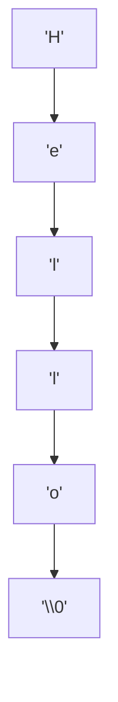

A C string is not a type. It is a **convention**: a contiguous
sequence of `char` ending in a zero byte (`'\0'`). Every function in
`<string.h>` relies on that single byte to know where the string
stops.

It did not have to be this way. The other classic design,
used by Pascal, and by many languages since, stores the *length*
in front of the characters, so the runtime always knows where a
string ends without scanning it. Thompson, Ritchie, and Kernighan
chose the terminator instead, probably because it made strings of
any length cost exactly one extra byte on the tiny machines Unix
ran on. In 2011, veteran FreeBSD developer Poul-Henning Kamp wrote
an ACM Queue essay calling that choice
*"The Most Expensive One-Byte Mistake"*: four decades of buffer
overflows, `strlen` scans, and security advisories, all downstream
of one byte saved per string in 1970. Whether or not you accept his
accounting, the lesson of this page is that the terminator is a
**convention enforced by nothing**. The language will not stop you
from losing it, and the moment a string loses its `'\0'`, every
function in `<string.h>` becomes a loaded gun.

## Null-terminated character arrays

The character `'\0'` is the byte `0`, *not* the digit `'0'` (which is
`0x30` in ASCII). Until the runtime finds it, every byte is still
"part of the string."

<Figure
  slug="sysc-strings-cutout"
  alt="A row of character cells on a platform ending in a single distinct zero-byte cap block"
/>

<CodeBlock
  adapter="c"
  files={[
    {
      filename: "main.c",
      starterCode: `#include <stdio.h>

int main(void) {
  char s[6] = {'H', 'e', 'l', 'l', 'o', '\\0'};
  printf("%s\\n", s);

  // Show the bytes including the terminator.
  for (int i = 0; i < 6; i++) {
    printf("  s[%d] = %d ('%c')\\n", i, s[i], s[i] ? s[i] : ' ');
  }
  return 0;
}
`,
    },
  ]}
/>

`printf("%s", s)` walks `s` starting at the address you pass, printing
characters until it hits `'\0'`. If the terminator is missing, it
will happily keep walking into unrelated memory.

<Figure
  slug="sysc-strings-string-literals-inline-cutout"
  alt="A ribbon of tiles fixed under a clamped bar, unable to be lifted or altered"
/>

## String literals

`"hello"` in C is a string literal, an *anonymous array* of `char`
with an automatically appended `'\0'`. The compiler usually places
literals in read-only memory.

| Form | What it is | Mutable? |
| --- | --- | --- |
| `char s[] = "hi";` | A *copy* of the literal in a local array | yes |
| `char *s = "hi";` | A pointer to the literal in read-only memory | **no**, writing through it is UB |
| `const char *s = "hi";` | The right way to spell the second form | n/a |

<Callout type="warn" title="Do not write through a string literal pointer">
`char *s = "hi"; s[0] = 'H';` compiles but is undefined behavior, on
many platforms it crashes because the literal lives in read-only
memory. Use `const char *` for literal pointers, or `char s[] = "hi";`
when you need to modify the contents.
</Callout>

<CodeBlock
  adapter="c"
  files={[
    {
      filename: "main.c",
      starterCode: `#include <stdio.h>

int main(void) {
  char mutable_copy[] = "hi"; // copy of "hi" plus '\\0'
  const char *literal = "hi"; // pointer to read-only literal

  mutable_copy[0] = 'H'; // ok
  printf("%s\\n", mutable_copy);

  // literal[0] = 'H';               // would be undefined behavior
  printf("%s\\n", literal);
  return 0;
}
`,
    },
  ]}
/>

## The `<string.h>` toolkit

| Function | Purpose | Notes |
| --- | --- | --- |
| `strlen(s)` | Number of bytes before `'\0'` | O(n) |
| `strcpy(dst, src)` | Copy null-terminated `src` to `dst` | No length check, unsafe |
| `strncpy(dst, src, n)` | Copy at most `n` bytes | May *not* null-terminate; see below |
| `strcat(dst, src)` | Append `src` to `dst` | No length check, unsafe |
| `strcmp(a, b)` | Compare two strings | negative / 0 / positive |
| `strncmp(a, b, n)` | Compare first `n` bytes | |
| `strchr(s, c)` | First occurrence of `c` | Returns pointer or `NULL` |
| `strstr(haystack, needle)` | First occurrence of substring | |
| `memcpy(dst, src, n)` | Copy `n` bytes (no terminator) | Buffers must not overlap |
| `memmove(dst, src, n)` | Like `memcpy` but overlap-safe | |
| `memset(dst, b, n)` | Fill `n` bytes with byte `b` | |

The "unsafe" functions are unsafe because they have no way to know
how big `dst` is. You are responsible for that.

<Figure
  slug="sysc-strings-inline-cutout"
  alt="A ribbon of letter tiles ending in a small stop block, and a second ribbon whose stop block is missing"
/>

<CodeBlock
  adapter="c"
  files={[
    {
      filename: "main.c",
      starterCode: `#include <stdio.h>
#include <string.h>

int main(void) {
  char hello[16] = "Hello";
  printf("len = %zu\\n", strlen(hello));

  strcat(hello, ", world!");
  printf("%s\\n", hello);

  if (strstr(hello, "world") != NULL) {
    printf("found 'world'\\n");
  }

  char copy[16];
  strcpy(copy, hello);
  printf("copy: %s\\n", copy);

  return 0;
}
`,
    },
  ]}
/>

## The `strncpy` footgun

`strncpy(dst, src, n)` looks like a "safer `strcpy`." It is not.

<Figure
  slug="sysc-strings-strncpy-footgun-inline-cutout"
  alt="A ribbon copied into a shorter holder, its stop block left behind outside the holder"
/>

1. If `src` is *shorter* than `n` bytes, it pads `dst` with extra
   `'\0'`s out to `n` bytes.
2. If `src` is *longer* than `n` bytes, it copies exactly `n` bytes
   and **does not null-terminate** `dst`.

That second case is the bug factory. Many codebases now use
`snprintf(dst, sizeof dst, "%s", src)` or platform-specific
`strlcpy` instead.

<CodeBlock
  adapter="c"
  files={[
    {
      filename: "main.c",
      starterCode: `#include <stdio.h>
#include <string.h>

int main(void) {
  char buf[5];

  // Pretend buf has trash so we can see if strncpy terminates.
  memset(buf, 'X', sizeof buf);
  strncpy(buf, "hello!", 5); // 6 chars + '\\0' would not fit
  // buf now contains 'h','e','l','l','o', no '\\0'!

  // The safer pattern: force termination.
  char safe[5];
  memset(safe, 'X', sizeof safe);
  snprintf(safe, sizeof safe, "%s", "hello!");
  printf("safe = %s (len %zu)\\n", safe, strlen(safe));
  return 0;
}
`,
    },
  ]}
/>

## Counting your own `strlen`

Writing string functions by hand is a great way to internalize
null-termination.

<CodeBlock
  adapter="c"
  files={[
    {
      filename: "main.c",
      starterCode: `#include <stddef.h>
#include <stdio.h>

size_t my_strlen(const char *s) {
  size_t n = 0;
  while (s[n] != '\\0') {
    n++;
  }
  return n;
}

int main(void) {
  printf("%zu\\n", my_strlen("Hello, systems!"));
  printf("%zu\\n", my_strlen(""));
  return 0;
}
`,
    },
  ]}
/>

The idiomatic version uses a moving pointer:

<CodeBlock
  adapter="c"
  files={[
    {
      filename: "main.c",
      starterCode: `#include <stddef.h>
#include <stdio.h>

size_t my_strlen(const char *s) {
  const char *p = s;
  while (*p)
    p++;
  return (size_t)(p - s);
}

int main(void) {
  printf("%zu\\n", my_strlen("Hello, systems!"));
  return 0;
}
`,
    },
  ]}
/>

## Buffer sizes are the API

Every C string function is part of a contract: "I will read until I
find a `'\0'`," or "I will write at most `n` bytes." Whenever you
write a new function that takes a string, document and enforce the
buffer size.

<CodeBlock
  adapter="c"
  files={[
    {
      filename: "main.c",
      starterCode: `#include <ctype.h>
#include <stddef.h>
#include <stdio.h>

// Uppercases up to dst_cap-1 chars of src into dst, always null-terminates.
// Returns the number of bytes written (excluding the terminator), or 0 on bad
// inputs.
size_t to_upper_safe(char *dst, size_t dst_cap, const char *src) {
  if (dst == NULL || dst_cap == 0 || src == NULL)
    return 0;
  size_t i = 0;
  for (; src[i] != '\\0' && i + 1 < dst_cap; i++) {
    dst[i] = (char)toupper((unsigned char)src[i]);
  }
  dst[i] = '\\0';
  return i;
}

int main(void) {
  char out[32];
  size_t n = to_upper_safe(out, sizeof out, "Hello, world!");
  printf("(%zu) %s\\n", n, out);
  return 0;
}
`,
    },
  ]}
/>

Note the `(unsigned char)` cast before passing to `toupper`. The
`<ctype.h>` functions are only defined for non-negative ints, and
plain `char` is signed on some platforms.

## Practice: implement strcmp

<ChallengeCard
  adapter="c"
  title="Implement your own strcmp"
  instructions={`Implement \`int my_strcmp(const char *a, const char *b)\` that returns a negative value if \`a < b\`, zero if equal, and positive if \`a > b\`, using byte-wise comparison. The provided \`main\` prints \`<\`, \`=\`, or \`>\` for a few pairs.`}
  files={[
    {
      filename: "main.c",
      starterCode: `#include <stdio.h>

int my_strcmp(const char *a, const char *b) {
  // your code here
  return 0;
}

static const char *sign(int x) {
  if (x < 0)
    return "<";
  if (x > 0)
    return ">";
  return "=";
}

int main(void) {
  printf("%s\\n", sign(my_strcmp("apple", "banana")));
  printf("%s\\n", sign(my_strcmp("hello", "hello")));
  printf("%s\\n", sign(my_strcmp("zebra", "apple")));
  return 0;
}
`,
      solutionCode: `#include <stdio.h>

int my_strcmp(const char *a, const char *b) {
  while (*a && *a == *b) {
    a++;
    b++;
  }
  return (unsigned char)*a - (unsigned char)*b;
}

static const char *sign(int x) {
  if (x < 0)
    return "<";
  if (x > 0)
    return ">";
  return "=";
}

int main(void) {
  printf("%s\\n", sign(my_strcmp("apple", "banana")));
  printf("%s\\n", sign(my_strcmp("hello", "hello")));
  printf("%s\\n", sign(my_strcmp("zebra", "apple")));
  return 0;
}
`,
    },
  ]}
  tests={[
    {
      id: "strcmp_signs",
      name: "Correct comparison signs",
      expect: { stdoutLines: ["<", "=", ">"], stdoutLinesExact: true },
    },
  ]}
/>

## Practice: reverse a string in place

<ChallengeCard
  adapter="c"
  title="Reverse a C string in place"
  instructions={`Implement \`void reverse_str(char *s)\` so that the string \`s\` is reversed without using any helper buffer. The provided \`main\` calls it on \`"systems"\` and prints the result on one line.`}
  files={[
    {
      filename: "main.c",
      starterCode: `#include <stdio.h>
#include <string.h>

void reverse_str(char *s) {
  // your code here
}

int main(void) {
  char s[] = "systems";
  reverse_str(s);
  printf("%s\\n", s);
  return 0;
}
`,
      solutionCode: `#include <stdio.h>
#include <string.h>

void reverse_str(char *s) {
  if (s == NULL)
    return;
  size_t n = strlen(s);
  if (n < 2)
    return;
  size_t lo = 0, hi = n - 1;
  while (lo < hi) {
    char t = s[lo];
    s[lo] = s[hi];
    s[hi] = t;
    lo++;
    hi--;
  }
}

int main(void) {
  char s[] = "systems";
  reverse_str(s);
  printf("%s\\n", s);
  return 0;
}
`,
    },
  ]}
  tests={[
    {
      id: "reversed",
      name: "String is reversed",
      expect: { stdoutEquals: "smetsys" },
    },
  ]}
/>

## Test your understanding

<MultipleChoice
  markdown={`What is the *length* of the C string literal \`"hello"\` in memory (in bytes)?

- It depends on the encoding; cannot be determined.
  > Plain string literals are bytes; the null terminator is always counted.
- [o] 6 bytes (5 characters + the trailing \`'\\0'\`)
  > Every string literal has an implicit null terminator.
- 5 bytes
  > Close, but it forgets the terminator.
- 4 bytes
  > Too few, even the visible characters are 5.`}
/>

<MultipleChoice
  markdown={`Why is the function \`char *s = "hello"; s[0] = 'H';\` dangerous?

- It overflows the buffer.
  > It writes within the literal's bounds; the problem is not overflow.
- It corrupts the system clock.
  > That is not how memory works.
- It always crashes the program in a controlled way.
  > It is undefined behavior; the crash is *possible* but not guaranteed.
- [o] String literals may live in read-only memory; writing through a non-\`const\` pointer to a literal is undefined behavior.
  > Use \`char s[] = "hello";\` to get a writable copy.`}
/>

<MultipleChoice
  markdown={`Which is the safest way to copy a string into a fixed-size buffer?

- \`memcpy(dst, src, strlen(src));\`
  > Also unsafe (no terminator) and does not check destination size.
- \`strcpy(dst, src);\`
  > No length check, overflows silently if \`src\` is longer than \`dst\`.
- \`strncpy(dst, src, sizeof dst);\`
  > Subtle bug: if \`src\` is too long, \`dst\` will not be null-terminated.
- [o] \`snprintf(dst, sizeof dst, "%s", src);\`
  > \`snprintf\` always writes a terminator and tells you how many bytes it would have written.`}
/>
