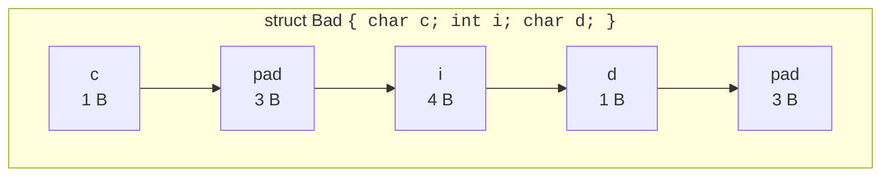

A `struct` is C's way of bundling several values into one named
record. Underneath the syntax, a struct is just a block of bytes —
its members live one after another in memory, possibly with **padding**
bytes inserted to keep each member at a properly aligned address.

This page is about both the language feature and the byte-level
reality.

<svg
  viewBox="0 0 640 200"
  role="img"
  aria-label="Two courses of the same bricks: declared char-int-char the top wall needs six ghost padding bricks and runs twelve bytes long; reordered largest-first below, it packs into eight, with the four saved bytes highlighted in yellow"
  style={{ display: "block", width: "100%", maxWidth: "640px", height: "auto", margin: "2.5rem auto" }}
>
  <g style={{ color: "var(--ds-blue-500)" }} fill="currentColor" fillOpacity="0.6">
    <rect x="176" y="56" width="22" height="34" rx="4" />
    <rect x="368" y="56" width="22" height="34" rx="4" />
    <rect x="272" y="130" width="22" height="34" rx="4" />
    <rect x="296" y="130" width="22" height="34" rx="4" />
  </g>
  <g style={{ color: "var(--ds-green-500)" }} fill="currentColor" fillOpacity="0.65">
    <rect x="272" y="56" width="94" height="34" rx="4" />
    <rect x="176" y="130" width="94" height="34" rx="4" />
  </g>
  <g fill="currentColor" opacity="0.15">
    <path d="M200 56 h22 v34 h-22 Z M204 60 h14 v26 h-14 Z" fillRule="evenodd" />
    <path d="M224 56 h22 v34 h-22 Z M228 60 h14 v26 h-14 Z" fillRule="evenodd" />
    <path d="M248 56 h22 v34 h-22 Z M252 60 h14 v26 h-14 Z" fillRule="evenodd" />
    <path d="M392 56 h22 v34 h-22 Z M396 60 h14 v26 h-14 Z" fillRule="evenodd" />
    <path d="M416 56 h22 v34 h-22 Z M420 60 h14 v26 h-14 Z" fillRule="evenodd" />
    <path d="M440 56 h22 v34 h-22 Z M444 60 h14 v26 h-14 Z" fillRule="evenodd" />
    <path d="M320 130 h22 v34 h-22 Z M324 134 h14 v26 h-14 Z" fillRule="evenodd" />
    <path d="M344 130 h22 v34 h-22 Z M348 134 h14 v26 h-14 Z" fillRule="evenodd" />
  </g>
  <g fill="currentColor" opacity="0.25">
    <rect x="176" y="96" width="288" height="3" rx="1.5" />
    <rect x="176" y="91" width="2" height="8" />
    <rect x="272" y="91" width="2" height="8" />
    <rect x="368" y="91" width="2" height="8" />
    <rect x="462" y="91" width="2" height="8" />
    <rect x="176" y="170" width="192" height="3" rx="1.5" />
    <rect x="176" y="165" width="2" height="8" />
    <rect x="272" y="165" width="2" height="8" />
    <rect x="366" y="165" width="2" height="8" />
  </g>
  <g style={{ color: "var(--ds-yellow-500)" }} fill="currentColor">
    <rect x="372" y="130" width="92" height="34" rx="6" fillOpacity="0.15" />
    <rect x="372" y="170" width="92" height="3" rx="1.5" fillOpacity="0.8" />
  </g>
</svg>

## Defining and using a struct

<CodeBlock
  adapter="c"
  files={[
    {
      filename: "main.c",
      starterCode: `#include <stdio.h>

struct Point {
  double x;
  double y;
};

int main(void) {
  struct Point p = {3.0, 4.0};
  printf("p = (%.1f, %.1f)\\n", p.x, p.y);

  struct Point *pp = &p;
  printf("via pointer: (%.1f, %.1f)\\n", pp->x, pp->y); // pp->x == (*pp).x
  return 0;
}
`,
    },
  ]}
/>

The `->` operator is just shorthand for "dereference then dot."

## `typedef` to drop the `struct` keyword

Most modern C codebases `typedef` their structs so callers can write
`Point` instead of `struct Point`.

<CodeBlock
  adapter="c"
  files={[
    {
      filename: "main.c",
      starterCode: `#include <stdio.h>

typedef struct {
  double x;
  double y;
} Point;

Point midpoint(Point a, Point b) {
  Point m = {(a.x + b.x) / 2.0, (a.y + b.y) / 2.0};
  return m;
}

int main(void) {
  Point a = {0.0, 0.0};
  Point b = {10.0, 4.0};
  Point m = midpoint(a, b);
  printf("midpoint: (%.1f, %.1f)\\n", m.x, m.y);
  return 0;
}
`,
    },
  ]}
/>

## Memory layout and padding

Members of a struct are laid out in declaration order, but the
compiler may insert *padding bytes* so each member starts at an
address that satisfies its alignment requirement. The struct itself
is also padded to a multiple of its strictest member's alignment, so
that arrays of the struct stay aligned.

The `int i` must sit at a 4-byte-aligned offset, so the compiler
slips three padding bytes after `c`. After `d`, three more padding
bytes round the struct up to 12 bytes (so that `Bad bads[10]` keeps
every `i` aligned).

<CodeBlock
  adapter="c"
  files={[
    {
      filename: "main.c",
      starterCode: `#include <stddef.h>
#include <stdio.h>

struct Bad {
  char c; // offset 0
  int i;  // offset 4 (padding 1..3)
  char d; // offset 8
}; // size 12 (padding 9..11)

struct Good {
  int i;  // offset 0
  char c; // offset 4
  char d; // offset 5
}; // size 8 (padding 6..7)

int main(void) {
  printf("sizeof(struct Bad)  = %zu\\n", sizeof(struct Bad));
  printf("sizeof(struct Good) = %zu\\n", sizeof(struct Good));
  printf("offsetof Bad.c = %zu\\n", offsetof(struct Bad, c));
  printf("offsetof Bad.i = %zu\\n", offsetof(struct Bad, i));
  printf("offsetof Bad.d = %zu\\n", offsetof(struct Bad, d));
  return 0;
}
`,
    },
  ]}
/>

<Callout type="info" title="Layout tip: order members from largest to smallest">
Sorting fields by descending alignment (largest types first) usually
minimizes padding. \`Good\` above is 8 bytes; \`Bad\` is 12.
</Callout>

## `offsetof` and pointer arithmetic on members

`offsetof(type, member)` from `<stddef.h>` returns the byte offset of
a member inside a struct. It is widely used in kernels, networking
code, and any "container of" macro.

<CodeBlock
  adapter="c"
  files={[
    {
      filename: "main.c",
      starterCode: `#include <stddef.h>
#include <stdio.h>

typedef struct {
  int id;
  char name[16];
  double balance;
} Account;

int main(void) {
  printf("sizeof Account   = %zu\\n", sizeof(Account));
  printf("offset id        = %zu\\n", offsetof(Account, id));
  printf("offset name      = %zu\\n", offsetof(Account, name));
  printf("offset balance   = %zu\\n", offsetof(Account, balance));
  return 0;
}
`,
    },
  ]}
/>

## Nested structs

Structs compose naturally; the layout rules apply recursively.

<CodeBlock
  adapter="c"
  files={[
    {
      filename: "main.c",
      starterCode: `#include <stdio.h>

typedef struct {
  double x, y;
} Point;

typedef struct {
  Point top_left;
  Point bottom_right;
} Rect;

double area(Rect r) {
  double w = r.bottom_right.x - r.top_left.x;
  double h = r.bottom_right.y - r.top_left.y;
  if (w < 0)
    w = -w;
  if (h < 0)
    h = -h;
  return w * h;
}

int main(void) {
  Rect r = {{0.0, 0.0}, {3.0, 4.0}};
  printf("area = %.1f\\n", area(r));
  return 0;
}
`,
    },
  ]}
/>

## Struct pointers and heap structs

Big structs are usually passed by pointer so you do not copy them.

<CodeBlock
  adapter="c"
  files={[
    {
      filename: "main.c",
      starterCode: `#include <stdio.h>
#include <stdlib.h>
#include <string.h>

typedef struct {
  int id;
  char name[32];
} User;

User *user_new(int id, const char *name) {
  User *u = malloc(sizeof *u);
  if (!u)
    return NULL;
  u->id = id;
  snprintf(u->name, sizeof u->name, "%s", name);
  return u;
}

void user_free(User *u) { free(u); }

int main(void) {
  User *u = user_new(7, "Ada");
  if (!u)
    return 1;
  printf("user %d: %s\\n", u->id, u->name);
  user_free(u);
  return 0;
}
`,
    },
  ]}
/>

The pair `user_new` / `user_free` is the standard C "constructor /
destructor" pattern — they are just regular functions, but they
document the ownership rule clearly.

## Linked list node — a self-referential struct

A struct can contain a pointer to *its own type*. This is how linked
lists, trees, and graphs are built.

<CodeBlock
  adapter="c"
  files={[
    {
      filename: "main.c",
      starterCode: `#include <stdio.h>
#include <stdlib.h>

typedef struct Node {
  int value;
  struct Node *next;
} Node;

Node *push(Node *head, int value) {
  Node *n = malloc(sizeof *n);
  if (!n)
    return head;
  n->value = value;
  n->next = head;
  return n;
}

void print_list(const Node *head) {
  for (const Node *p = head; p != NULL; p = p->next) {
    printf("%d -> ", p->value);
  }
  printf("(nil)\\n");
}

void free_list(Node *head) {
  while (head) {
    Node *next = head->next;
    free(head);
    head = next;
  }
}

int main(void) {
  Node *list = NULL;
  list = push(list, 3);
  list = push(list, 2);
  list = push(list, 1);
  print_list(list);
  free_list(list);
  return 0;
}
`,
    },
  ]}
/>

## Unions

A `union` is a value that can hold *any one of* several types — but
only one at a time. Every member shares the same storage; the
union's size is the size of its largest member.

<svg
  viewBox="0 0 640 190"
  role="img"
  aria-label="Three translucent rooms of different sizes share one corner and the same floor space, a single occupant dot inside and only one roof tab active — a union stores any one member at a time in storage sized for the largest"
  style={{ display: "block", width: "100%", maxWidth: "500px", height: "auto", margin: "2.5rem auto" }}
>
  <g style={{ color: "var(--ds-blue-500)" }} fill="currentColor">
    <rect x="180" y="48" width="230" height="100" rx="10" fillOpacity="0.15" />
  </g>
  <g style={{ color: "var(--ds-green-500)" }} fill="currentColor">
    <rect x="180" y="74" width="150" height="74" rx="10" fillOpacity="0.18" />
  </g>
  <g style={{ color: "var(--ds-yellow-500)" }} fill="currentColor">
    <rect x="180" y="98" width="90" height="50" rx="10" fillOpacity="0.2" />
  </g>
  <g style={{ color: "var(--ds-blue-500)" }} fill="currentColor">
    <rect x="196" y="36" width="36" height="12" rx="5" fillOpacity="0.2" />
  </g>
  <g style={{ color: "var(--ds-green-500)" }} fill="currentColor">
    <rect x="240" y="36" width="36" height="12" rx="5" />
  </g>
  <g style={{ color: "var(--ds-yellow-500)" }} fill="currentColor">
    <rect x="284" y="36" width="36" height="12" rx="5" fillOpacity="0.2" />
  </g>
  <g style={{ color: "var(--ds-green-500)" }} fill="currentColor">
    <circle cx="224" cy="122" r="9" />
  </g>
  <g fill="currentColor" opacity="0.3">
    <rect x="180" y="158" width="230" height="3" rx="1.5" />
    <rect x="180" y="153" width="2" height="8" />
    <rect x="408" y="153" width="2" height="8" />
  </g>
  <g fill="currentColor" opacity="0.2">
    <circle cx="455" cy="70" r="3" />
    <circle cx="120" cy="130" r="3" />
  </g>
</svg>

<CodeBlock
  adapter="c"
  files={[
    {
      filename: "main.c",
      starterCode: `#include <stdint.h>
#include <stdio.h>

union FloatBits {
  float f;
  uint32_t bits;
};

int main(void) {
  union FloatBits u;
  u.f = 1.0f;
  printf("1.0f as uint32 bits = 0x%08X\\n", u.bits);

  u.bits = 0x40490FDB; // close approximation of pi as float bits
  printf("0x40490FDB as float = %f\\n", u.f);
  return 0;
}
`,
    },
  ]}
/>

This *type punning* pattern is common in low-level code (graphics,
serialization), and it has one genuinely legendary appearance. When
id Software released the *Quake III Arena* source code in 2005,
readers found a function that computes 1/√x — needed constantly for
normalizing 3D vectors — by reinterpreting a float's bits as an
integer, shifting them right, and subtracting them from the magic
constant `0x5f3759df`. The technique exploits exactly what the code
block above shows: an IEEE 754 float's bit pattern, read as an
integer, approximates its logarithm. The routine became famous both
for its near-sorcery and for its bewildered comments (the politest
of which is "evil floating point bit level hacking"). John Carmack,
to whom the internet immediately attributed it, said he didn't write
it; later sleuthing traced its lineage back through earlier graphics
companies. The lesson for you: understanding *exactly* how your
bytes are laid out occasionally lets you do things that look like
magic.

A "tagged union" — a struct with an enum tag and a
union of payloads — is how C encodes sum types like `Result<Ok, Err>`.

<CodeBlock
  adapter="c"
  files={[
    {
      filename: "main.c",
      starterCode: `#include <stdio.h>

typedef enum { JSON_NULL, JSON_INT, JSON_STR } JsonKind;

typedef struct {
  JsonKind kind;
  union {
    long i;        // when kind == JSON_INT
    const char *s; // when kind == JSON_STR
  } v;
} JsonValue;

void print_json(JsonValue v) {
  switch (v.kind) {
  case JSON_NULL:
    printf("null\\n");
    break;
  case JSON_INT:
    printf("%ld\\n", v.v.i);
    break;
  case JSON_STR:
    printf("\\"%s\\"\\n", v.v.s);
    break;
  }
}

int main(void) {
  JsonValue values[] = {
      {JSON_NULL, {.i = 0}},
      {JSON_INT, {.i = 42}},
      {JSON_STR, {.s = "hello"}},
  };
  for (size_t i = 0; i < sizeof values / sizeof *values; i++) {
    print_json(values[i]);
  }
  return 0;
}
`,
    },
  ]}
/>

## Bitfields

Sometimes you need to pack several small fields into a single
integer — say, flags on a packet header or per-pixel data. C's
*bitfield* syntax lets you declare members in widths smaller than a
byte.

<svg
  viewBox="0 0 640 150"
  role="img"
  aria-label="A single byte bar split into eight thin slots: three carry tiny flags — read raised, write lowered, execute raised — and the rest sit unused, the way bitfields pack booleans into one integer"
  style={{ display: "block", width: "100%", maxWidth: "480px", height: "auto", margin: "2.5rem auto" }}
>
  <rect x="140" y="88" width="360" height="34" rx="9" fill="currentColor" opacity="0.1" />
  <g fill="currentColor" opacity="0.18">
    <rect x="184" y="92" width="2" height="26" />
    <rect x="229" y="92" width="2" height="26" />
    <rect x="274" y="92" width="2" height="26" />
    <rect x="319" y="92" width="2" height="26" />
    <rect x="364" y="92" width="2" height="26" />
    <rect x="409" y="92" width="2" height="26" />
    <rect x="454" y="92" width="2" height="26" />
  </g>
  <g style={{ color: "var(--ds-blue-500)" }} fill="currentColor">
    <rect x="140" y="88" width="44" height="34" rx="9" fillOpacity="0.35" />
    <rect x="160" y="34" width="3" height="54" fillOpacity="0.7" />
    <path d="M163 34 L189 42 L163 50 Z" />
  </g>
  <g style={{ color: "var(--ds-green-500)" }} fill="currentColor">
    <rect x="186" y="88" width="43" height="34" rx="0" fillOpacity="0.18" />
    <rect x="205" y="64" width="3" height="24" fillOpacity="0.5" />
    <path d="M208 64 L230 71 L208 78 Z" fillOpacity="0.45" />
  </g>
  <g style={{ color: "var(--ds-yellow-500)" }} fill="currentColor">
    <rect x="231" y="88" width="43" height="34" fillOpacity="0.35" />
    <rect x="250" y="34" width="3" height="54" fillOpacity="0.7" />
    <path d="M253 34 L279 42 L253 50 Z" />
  </g>
  <g fill="currentColor" opacity="0.25">
    <circle cx="297" cy="105" r="2.5" />
    <circle cx="342" cy="105" r="2.5" />
    <circle cx="387" cy="105" r="2.5" />
    <circle cx="432" cy="105" r="2.5" />
    <circle cx="477" cy="105" r="2.5" />
  </g>
</svg>

<CodeBlock
  adapter="c"
  files={[
    {
      filename: "main.c",
      starterCode: `#include <stdio.h>

typedef struct {
  unsigned int read : 1; // 1 bit
  unsigned int write : 1;
  unsigned int execute : 1;
  unsigned int padding : 5;
} Permissions;

int main(void) {
  Permissions p = {0};
  p.read = 1;
  p.execute = 1;
  printf("sizeof(Permissions) = %zu\\n", sizeof(Permissions));
  printf("rwx = %u%u%u\\n", p.read, p.write, p.execute);
  return 0;
}
`,
    },
  ]}
/>

<Callout type="warn" title="Bitfields are not portable for wire formats">
The order in which bitfields are packed into the underlying integer —
and the integer's size — is *implementation-defined*. They are great
for in-memory flags but a poor choice for cross-platform binary
formats; use explicit bit masks for those.
</Callout>

## Flexible array members

A struct may end with a "flexible array member" — an array of
unspecified size that lets you allocate the struct and its data in
*one* `malloc`.

<CodeBlock
  adapter="c"
  files={[
    {
      filename: "main.c",
      starterCode: `#include <stdio.h>
#include <stdlib.h>
#include <string.h>

typedef struct {
  size_t len;
  char data[]; // flexible array member
} Buffer;

Buffer *buffer_new(const char *s) {
  size_t n = strlen(s);
  Buffer *b = malloc(sizeof *b + n + 1);
  if (!b)
    return NULL;
  b->len = n;
  memcpy(b->data, s, n + 1); // includes terminator
  return b;
}

int main(void) {
  Buffer *b = buffer_new("flexible!");
  if (!b)
    return 1;
  printf("(%zu) %s\\n", b->len, b->data);
  free(b);
  return 0;
}
`,
    },
  ]}
/>

One allocation, one free, contiguous storage — friendlier to the
allocator and the CPU cache than `Buffer { size_t len; char *data; }`
where `data` is its own allocation.

## Practice: pack RGBA bytes into a 32-bit pixel

<ChallengeCard
  adapter="c"
  title="Pack and unpack a pixel"
  instructions={`Implement \`uint32_t pack_rgba(uint8_t r, uint8_t g, uint8_t b, uint8_t a)\` so the bytes are laid out with \`r\` in the *highest* byte and \`a\` in the *lowest* byte. The provided \`main\` prints the result in hex; \`pack_rgba(0xAA, 0xBB, 0xCC, 0xDD)\` must print \`AABBCCDD\`.`}
  files={[
    {
      filename: "main.c",
      starterCode: `#include <stdint.h>
#include <stdio.h>

uint32_t pack_rgba(uint8_t r, uint8_t g, uint8_t b, uint8_t a) {
  // your code here
  return 0;
}

int main(void) {
  uint32_t px = pack_rgba(0xAA, 0xBB, 0xCC, 0xDD);
  printf("%08X\\n", px);
  return 0;
}
`,
      solutionCode: `#include <stdint.h>
#include <stdio.h>

uint32_t pack_rgba(uint8_t r, uint8_t g, uint8_t b, uint8_t a) {
  return ((uint32_t)r << 24) | ((uint32_t)g << 16) | ((uint32_t)b << 8) |
         (uint32_t)a;
}

int main(void) {
  uint32_t px = pack_rgba(0xAA, 0xBB, 0xCC, 0xDD);
  printf("%08X\\n", px);
  return 0;
}
`,
    },
  ]}
  tests={[
    {
      id: "packed",
      name: "Pixel packed correctly",
      expect: { stdoutEquals: "AABBCCDD" },
    },
  ]}
/>

## Practice: count the nodes in a linked list

<ChallengeCard
  adapter="c"
  title="Length of a singly linked list"
  instructions={`Implement \`size_t list_length(const Node *head)\` that returns the number of nodes in the list. The provided \`main\` builds a 5-node list and prints the length on one line. Do not free the list — \`main\` handles that.`}
  files={[
    {
      filename: "main.c",
      starterCode: `#include <stdio.h>
#include <stdlib.h>

typedef struct Node {
  int value;
  struct Node *next;
} Node;

size_t list_length(const Node *head) {
  // your code here
  return 0;
}

int main(void) {
  Node *head = NULL;
  for (int i = 0; i < 5; i++) {
    Node *n = malloc(sizeof *n);
    n->value = i;
    n->next = head;
    head = n;
  }

  printf("%zu\\n", list_length(head));

  while (head) {
    Node *next = head->next;
    free(head);
    head = next;
  }
  return 0;
}
`,
      solutionCode: `#include <stdio.h>
#include <stdlib.h>

typedef struct Node {
  int value;
  struct Node *next;
} Node;

size_t list_length(const Node *head) {
  size_t n = 0;
  for (const Node *p = head; p != NULL; p = p->next)
    n++;
  return n;
}

int main(void) {
  Node *head = NULL;
  for (int i = 0; i < 5; i++) {
    Node *n = malloc(sizeof *n);
    n->value = i;
    n->next = head;
    head = n;
  }

  printf("%zu\\n", list_length(head));

  while (head) {
    Node *next = head->next;
    free(head);
    head = next;
  }
  return 0;
}
`,
    },
  ]}
  tests={[
    {
      id: "len_5",
      name: "Length is 5",
      expect: { stdoutEquals: "5" },
    },
  ]}
/>

## Test your understanding

<MultipleChoice
  markdown={`Why does the struct \`struct Bad { char c; int i; char d; };\` have size 12 on a 4-byte-aligned target instead of the obvious 6?

- The compiler inserts random bytes for security.
  > Padding is for alignment, not for security.
- [o] The compiler inserts padding so each member sits at a properly aligned offset and so arrays of the struct keep their members aligned.
  > Reordering fields by descending alignment usually shrinks the struct.
- The struct must always be a multiple of 12 bytes by language rule.
  > There is no such rule.
- \`char\` is actually 4 bytes on most platforms.
  > \`char\` is always exactly 1 byte by definition.`}
/>

<MultipleChoice
  markdown={`What is the key property of a \`union\`?

- All members live at consecutive offsets, like a struct.
  > That is how a struct works, not a union.
- The union always uses the sum of its members' sizes.
  > A union uses the size of its *largest* member.
- [o] All members share the same storage; the union holds at most one of them at a time, and its size is the size of the largest member (plus padding).
  > Writing one member overwrites the others.
- Unions are always initialized to zero on declaration.
  > Initialization rules are the same as for any other variable.`}
/>

<MultipleChoice
  markdown={`Which pattern lets you store a variable-length payload inline with a struct using a single allocation?

- A \`void *data\` member that you malloc separately.
  > That works but requires *two* allocations.
- A nested struct.
  > Nested structs do not change allocation count.
- [o] A flexible array member declared as the last field, e.g. \`char data[];\`, allocated via \`malloc(sizeof *s + n)\`.
  > One allocation holds the header and the payload contiguously.
- A bitfield.
  > Bitfields pack small integers, not variable-length data.`}
/>
