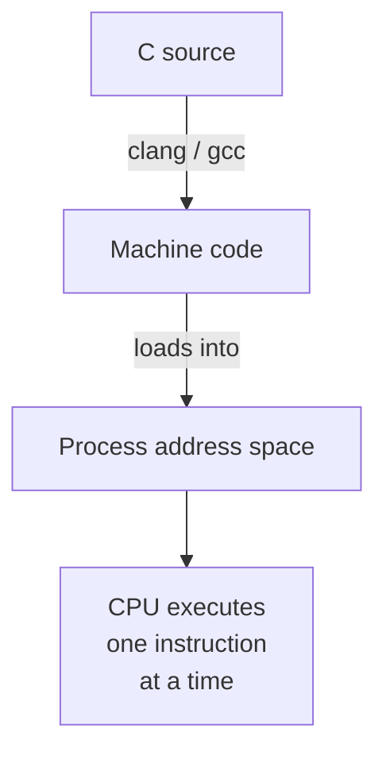

C was designed in 1972 by Dennis Ritchie at Bell Labs as a portable
language for rewriting the Unix kernel. More than fifty years later,
it is still the language that the world's most important systems are
written in. Knowing why will help you understand what to expect from
the language — and what *not* to expect.

<svg
  viewBox="0 0 640 220"
  role="img"
  aria-label="A skyline of software towers — kernels, runtimes, databases — every one standing on a single thin solid blue bedrock layer of C, with silicon substrate dots beneath and one green tower still under construction"
  style={{ display: "block", width: "100%", maxWidth: "640px", height: "auto", margin: "2.5rem auto" }}
>
  <g fill="currentColor" opacity="0.2">
    <circle cx="600" cy="40" r="3" />
    <circle cx="38" cy="98" r="3" />
  </g>
  <g style={{ color: "var(--ds-yellow-500)" }} fill="currentColor">
    <circle cx="76" cy="52" r="15" />
  </g>
  <g fill="currentColor">
    <rect x="110" y="96" width="52" height="78" opacity="0.18" />
    <rect x="176" y="64" width="40" height="110" opacity="0.28" />
    <rect x="194" y="40" width="4" height="24" opacity="0.28" />
    <rect x="230" y="110" width="64" height="64" opacity="0.14" />
    <rect x="308" y="48" width="46" height="126" opacity="0.33" />
    <rect x="368" y="92" width="58" height="82" opacity="0.2" />
    <rect x="440" y="70" width="42" height="104" opacity="0.26" />
  </g>
  <g style={{ color: "var(--ds-red-500)" }} fill="currentColor">
    <circle cx="196" cy="36" r="4" />
  </g>
  <g style={{ color: "var(--ds-blue-500)" }} fill="currentColor">
    <circle cx="188" cy="84" r="3" />
    <circle cx="204" cy="84" r="3" />
    <circle cx="188" cy="104" r="3" />
    <circle cx="204" cy="104" r="3" />
    <circle cx="322" cy="70" r="3" />
    <circle cx="340" cy="70" r="3" />
    <circle cx="322" cy="92" r="3" />
    <circle cx="340" cy="92" r="3" />
    <circle cx="454" cy="90" r="3" />
    <circle cx="468" cy="90" r="3" />
    <circle cx="454" cy="112" r="3" />
  </g>
  <g style={{ color: "var(--ds-yellow-500)" }} fill="currentColor">
    <circle cx="322" cy="114" r="3" />
    <circle cx="124" cy="116" r="3" />
  </g>
  <g style={{ color: "var(--ds-green-500)" }} fill="currentColor">
    <rect x="498" y="132" width="44" height="42" fillOpacity="0.5" />
    <rect x="523" y="108" width="13" height="12" rx="2" />
  </g>
  <g style={{ color: "var(--ds-yellow-500)" }} fill="currentColor">
    <rect x="556" y="84" width="6" height="90" rx="2" />
    <rect x="520" y="84" width="42" height="6" rx="3" />
    <rect x="528" y="90" width="3" height="16" fillOpacity="0.7" />
  </g>
  <g style={{ color: "var(--ds-blue-500)" }} fill="currentColor">
    <rect x="72" y="174" width="500" height="14" rx="7" fillOpacity="0.9" />
  </g>
  <g fill="currentColor">
    <rect x="88" y="196" width="468" height="8" rx="4" opacity="0.1" />
    <circle cx="140" cy="212" r="2.5" opacity="0.25" />
    <circle cx="220" cy="210" r="2.5" opacity="0.25" />
    <circle cx="320" cy="213" r="2.5" opacity="0.25" />
    <circle cx="420" cy="210" r="2.5" opacity="0.25" />
    <circle cx="500" cy="212" r="2.5" opacity="0.25" />
  </g>
</svg>

## A language named after its predecessor

<IllustrationPrompt subject="Ken Thompson" photo />

C did not appear from nowhere — it is the third draft of an idea.
At Bell Labs in the late 1960s, Ken Thompson wrote **B**, a
stripped-down descendant of the British language BCPL, to program a
cast-off PDP-7 minicomputer. B had a fatal limitation: it knew only
one data type, the machine word. That was tolerable on the
word-addressed PDP-7, but the new PDP-11 the Unix group acquired in
1970 was *byte*-addressed, and B simply could not express "a byte"
or "a structure." So Ritchie extended B with types and structs, and
the extended language needed a name. After B came **C** — the joke
writes itself, and yes, people immediately began asking whether the
successor would be called D or P (the next letter in "BCPL").

The payoff came in 1973, when Thompson and Ritchie rewrote the Unix
kernel itself in C. This was a radical act: operating systems were
written in assembly, period, because nothing else was believed fast
enough. A kernel in a high-level language meant the *operating
system itself* became portable — and when Unix spread to new
machines in the late 1970s, C went everywhere with it. Twenty years
later, Ritchie summed up his creation with characteristic dryness:
*"C is quirky, flawed, and an enormous success."*

## C runs the world

| Software | Written in |
| --- | --- |
| Linux, BSD, XNU (macOS), Windows NT kernels | C (with bits of C++ / assembly) |
| Python's reference interpreter (CPython) | C |
| Node.js (V8, libuv) | C / C++ |
| SQLite, Redis, PostgreSQL | C |
| nginx, OpenSSH, OpenSSL, curl, FFmpeg, Git | C |
| Most embedded firmware (microcontrollers, routers, cars) | C |

When you `pip install` a wheel, `apt-get` a package, or open a TLS
connection, you are almost certainly running C code that someone
compiled years ago.

## A small language, close to the machine

The C language itself is *tiny*. The whole grammar fits in a thin
book. There are no classes, no exceptions, no garbage collector, no
generics, no built-in dictionaries, no string type — just integers,
floats, pointers, arrays, structs, functions, and a preprocessor for
text substitution.

That smallness is a feature. It means a compiler is small enough to
exist for any chip you can name, and the runtime overhead of a C
program can be measured in *kilobytes*.

<CodeBlock
  adapter="c"
  files={[
    {
      filename: "main.c",
      starterCode: `#include <stdio.h>

int main(void) {
  printf("Hello, systems world!\\n");
  return 0;
}
`,
    },
  ]}
/>

That program, once compiled for a real CPU, is a few kilobytes of
machine code and a handful of `printf` calls in libc. There is no
virtual machine. There is no interpreter. The operating system
loads it and jumps to `main`.

## "Portable assembly"

People sometimes call C *portable assembly* because the language
exposes the same model of computation that the underlying hardware
does:

- Memory is a flat array of bytes addressed by integers.
- Every value has a fixed size in bytes.
- You can take the address of almost anything with `&`.
- You can ask "what is at this address?" with `*`.
- Function calls push a frame on the stack and `return` pops it.

Compare to Python, where `a + b` may involve attribute lookups, type
coercions, reference counts, and a method dispatch through a hash
table. In C, `a + b` for two `int`s usually compiles to a single CPU
instruction.

<CodeBlock
  adapter="c"
  files={[
    {
      filename: "main.c",
      starterCode: `#include <stdio.h>

int main(void) {
  int a = 7;
  int b = 35;
  int c = a + b;
  printf("%d + %d = %d\\n", a, b, c);
  return 0;
}
`,
    },
  ]}
/>

## What C gives you that other languages do not

| Capability | C | Python / JS / Java |
| --- | --- | --- |
| Take the address of a variable | yes (`&x`) | no |
| Lay out memory exactly as you want | yes (`struct`, `union`) | no |
| Talk to hardware registers | yes (volatile pointers, MMIO) | no |
| Run with no operating system | yes (freestanding mode) | no |
| Predictable, jitter-free latency | yes (no GC) | no |
| Compile to almost any chip | yes | usually no |

## What C *doesn't* give you

A pragmatic course must be honest about C's costs:

- **No memory safety.** Out-of-bounds writes are undefined behavior.
- **No bounds-checked strings or arrays.** You manage lengths yourself.
- **No built-in containers.** You write or import a vector / hash map.
- **No namespaces / modules.** Just `#include` and the linker.
- **No exceptions.** Errors are usually returned as `int` codes.
- **Very little type safety for void pointers.** `void*` casts are easy.
- **Undefined behavior is everywhere.** Signed overflow, reading
  uninitialized memory, strict aliasing violations — the compiler is
  allowed to do *anything* in response.

<svg
  viewBox="0 0 640 190"
  role="img"
  aria-label="A blue walker balances along a thin high beam between two pylons with only a faint ghost of a safety net and a row of red spikes below — C's speed comes without bounds checks or a runtime to catch you"
  style={{ display: "block", width: "100%", maxWidth: "480px", height: "auto", margin: "2.5rem auto" }}
>
  <g fill="currentColor" opacity="0.3">
    <rect x="86" y="58" width="14" height="104" rx="4" />
    <rect x="540" y="58" width="14" height="104" rx="4" />
    <rect x="80" y="52" width="26" height="8" rx="4" />
    <rect x="534" y="52" width="26" height="8" rx="4" />
  </g>
  <rect x="100" y="62" width="440" height="5" rx="2.5" fill="currentColor" opacity="0.35" />
  <g style={{ color: "var(--ds-blue-500)" }} fill="currentColor">
    <circle cx="140" cy="58" r="2" fillOpacity="0.15" />
    <circle cx="180" cy="58" r="2" fillOpacity="0.25" />
    <circle cx="225" cy="58" r="2" fillOpacity="0.35" />
    <circle cx="264" cy="58" r="2" fillOpacity="0.45" />
    <rect x="258" y="56" width="84" height="4" rx="2" fillOpacity="0.7" />
    <circle cx="300" cy="50" r="8" />
  </g>
  <g fill="currentColor" opacity="0.12">
    <circle cx="140" cy="120" r="3" />
    <circle cx="190" cy="134" r="3" />
    <circle cx="240" cy="144" r="3" />
    <circle cx="290" cy="148" r="3" />
    <circle cx="340" cy="148" r="3" />
    <circle cx="390" cy="144" r="3" />
    <circle cx="440" cy="134" r="3" />
    <circle cx="490" cy="120" r="3" />
  </g>
  <g style={{ color: "var(--ds-red-500)" }} fill="currentColor" fillOpacity="0.65">
    <path d="M150 168 L168 142 L186 168 Z" />
    <path d="M196 168 L214 142 L232 168 Z" />
    <path d="M242 168 L260 142 L278 168 Z" />
    <path d="M288 168 L306 142 L324 168 Z" />
    <path d="M334 168 L352 142 L370 168 Z" />
    <path d="M380 168 L398 142 L416 168 Z" />
    <path d="M426 168 L444 142 L462 168 Z" />
  </g>
  <rect x="100" y="168" width="440" height="6" rx="3" fill="currentColor" opacity="0.15" />
</svg>

<Callout type="warn" title="Undefined behavior is not just &quot;crashes&quot;">
"Undefined behavior" (UB) means the C standard imposes no
requirements. The program might crash, print garbage, behave
correctly on one machine and wrong on another, or — most dangerously —
*appear to work in testing and fail in production*. A serious chunk
of this course is teaching you to recognize and avoid UB.
</Callout>

## Where C shines today

You should reach for C (or a C-compatible language) when you need:

1. **Predictable performance.** No GC pauses, no JIT warm-up.
2. **Tiny binaries.** Embedded systems with kilobytes of flash.
3. **Direct hardware access.** Drivers, firmware, OS kernels.
4. **A stable ABI.** Almost every language can call C, so C is the
   universal glue for FFI (`ctypes`, JNI, P/Invoke, Node addons).
5. **Long-lived infrastructure.** Code written in C in 1990 still
   compiles and runs today.

## A taste of "systems thinking" in C

The program below prints the size of every fundamental type *on this
machine*. The answers are not standardized — they depend on the
target architecture. On the WASI target you are about to run, ints
are 32 bits and pointers are 32 bits.

<CodeBlock
  adapter="c"
  files={[
    {
      filename: "main.c",
      starterCode: `#include <stdio.h>

int main(void) {
  printf("char       : %zu byte(s)\\n", sizeof(char));
  printf("short      : %zu byte(s)\\n", sizeof(short));
  printf("int        : %zu byte(s)\\n", sizeof(int));
  printf("long       : %zu byte(s)\\n", sizeof(long));
  printf("long long  : %zu byte(s)\\n", sizeof(long long));
  printf("float      : %zu byte(s)\\n", sizeof(float));
  printf("double     : %zu byte(s)\\n", sizeof(double));
  printf("void *     : %zu byte(s)\\n", sizeof(void *));
  return 0;
}
`,
    },
  ]}
/>

That single program tells you a great deal about the target: integer
widths, pointer width (and therefore the size of the address space),
and floating-point representation. We will return to these numbers
constantly.

## Test your understanding

<MultipleChoice
  markdown={`Which of the following is **not** a typical reason to choose C over a higher-level language like Python or Java?

- Predictable execution with no garbage collector pauses
  > That is a real C advantage, especially for embedded and real-time work.
- Ability to run on a microcontroller with kilobytes of memory
  > That is also a real C advantage; C is the dominant embedded language.
- Direct access to hardware addresses and registers
  > That is a real C advantage; volatile pointers map to MMIO.
- [o] Built-in safety against out-of-bounds memory access
  > C deliberately does **not** check array bounds; that's why memory bugs are such a recurring theme in this course.`}
/>

<MultipleChoice
  markdown={`What does "undefined behavior" (UB) mean in the C standard?

- The behavior is platform-specific but always well defined per platform.
  > That describes *implementation-defined* behavior, not undefined behavior.
- The program will reliably crash with a clear error message.
  > UB has no required behavior; "appears to work" is a frequent and dangerous outcome.
- [o] The standard imposes no requirements: the compiler may produce any code at all, including code that appears to work in testing.
  > UB is the root cause of many silent C bugs.
- It is only a problem in debug builds; optimizers ignore it.
  > Optimizers actively assume UB never happens, which can make the symptoms worse, not better.`}
/>

<MultipleChoice
  markdown={`Why is C often called "portable assembly"?

- Because every C compiler emits the same assembly language.
  > Different targets emit completely different assembly.
- [o] Because C exposes the underlying machine model — flat addressable memory, fixed-size values, and direct pointer arithmetic — while still letting you retarget the compiler to many CPUs.
  > C is high enough to be portable but low enough to map closely to hardware.
- Because C programs are written in mnemonics like \`MOV\` and \`ADD\`.
  > Those are assembly mnemonics; C is a higher-level language than assembly.
- Because every C statement maps to exactly one CPU instruction.
  > Many C statements compile to several instructions, and the optimizer can collapse or reorder them.`}
/>
