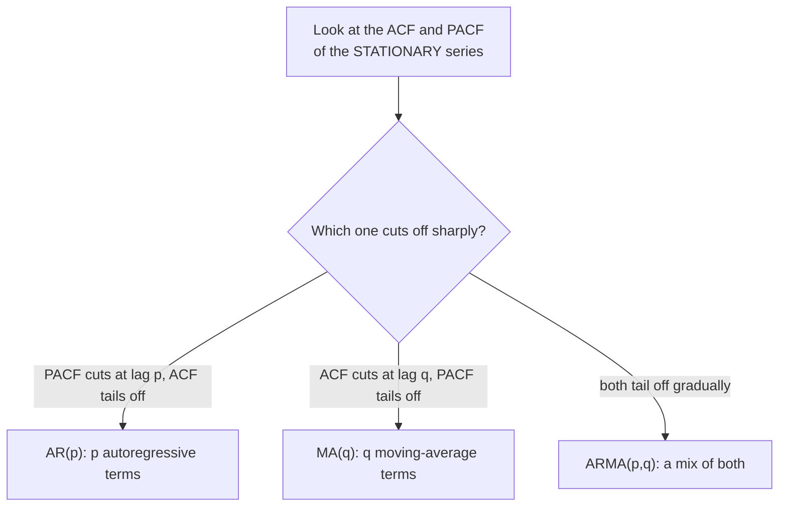

A stationary series still has a personality: each value echoes the ones
before it in a particular way. Two plots are how we *listen* to those
echoes, the **autocorrelation function** and the **partial
autocorrelation function**, and reading them is how forecasters propose
model orders without brute-force search. Master these two plots and the
otherwise-mysterious `(p, d, q)` of an ARIMA model becomes something you
can often *read off a chart*.

<Figure
  slug="tsa-acf-pacf-cutout"
  alt="Two stem-plot panels on a platform, one with spikes tapering gradually and one with spikes stopping abruptly, dashed bands on both"
/>

## Two kinds of correlation with the past

- The **autocorrelation function** (ACF) measures the correlation between
  the series and itself `k` steps earlier, for each lag `k`. It captures the
  **total** relationship at that lag, direct *and* indirect.
- The **partial autocorrelation function** (PACF) measures the correlation
  at lag `k` **after removing** the influence of all the shorter lags in
  between. It captures only the **direct** relationship.

Why does "direct vs total" matter so much? Picture an autoregressive
series where each value is $0.7 \times$ the previous one. Then $y(t)$ is
directly tied to $y(t-1)$. But $y(t-1)$ is tied to $y(t-2)$, so $y(t)$ is
*indirectly* correlated with $y(t-2)$ too, through the chain, even though
there's no direct link. The autocorrelation at lag 2 sees that indirect
echo and is nonzero; the partial autocorrelation at lag 2 strips the chain
away and reveals the truth: no direct lag-2 relationship.

<Callout type="tip" title="The intuition in one line">
Autocorrelation asks "how related are values `k` apart, *however* that
relationship arises?" Partial autocorrelation asks "how related are they
*directly*, once the middlemen are removed?" The gap between those two
questions is exactly what lets us tell an **autoregressive** process from a
**moving-average** one.
</Callout>

Both plots for one series, where we know the answer because we built it,
make the difference concrete. This is an AR(2): every value comes from the
two before it and nothing else.

<Chart slug="pacf-cuts-acf-decays" />

The lag-2 bar is where you can check the arithmetic yourself. The total
correlation is 0.82, and squaring the lag-1 correlation, which is what a
pure chain through the middleman would give you, accounts for 0.73 of it.
Only the small remainder is a genuinely direct link, and it is that
remainder the PACF is reporting. Past lag 2 there is nothing direct left to
report, so the PACF drops into the noise band while the ACF keeps decaying
on chain effects alone.

<Callout type="warn" title="One bar poking out is not a finding">
The shaded band is a 5% envelope, so on a plot of fourteen lags you should
*expect* roughly one bar to escape it by chance, and the PACF above obliges
at lag 5. Read the plots for the shape (where does it cut, where does it
decay) rather than for individual bars, and treat an isolated spike far out
in the lags as arithmetic until something else corroborates it.
</Callout>

## The cheat-sheet

Three series, three signatures. The shaded band is where a bar is
indistinguishable from noise:

<Chart slug="acf-shapes" />

<Figure
  slug="tsa-acf-and-pacf-cheat-sheet-inline-cutout"
  alt="A small card of four shapes pinned above a bench, each shape matched to one of four wave patterns below"
  caption="We build each wave ourselves, so we already know which shape on the card it should match."
/>

Here is the single most useful table in classical forecasting. Two
families of model appear in it, and the next lesson builds both: an
**autoregressive** model of order `p`, written AR(p), predicts each value
from the `p` values before it, and a **moving-average** model of order
`q`, written MA(q), predicts it from the last `q` shocks. A model with
both parts is an ARMA(p,q). For a **stationary** series:

| Pattern | Autocorrelation | Partial autocorrelation | Read it as |
| --- | --- | --- | --- |
| **AR(p)** | tails off (gradual decay) | **cuts off** after lag `p` | order `p` = number of partial-autocorrelation spikes |
| **MA(q)** | **cuts off** after lag `q` | tails off (gradual decay) | order `q` = number of autocorrelation spikes |
| **ARMA(p,q)** | tails off | tails off | neither cuts cleanly, try small `p`, `q` |
| **white noise** | all ~0 (within bands) | all ~0 | nothing to model |
| **non-stationary** | decays *very slowly* / lingers | (irrelevant) | **difference first**, then re-read |

<Callout type="info" title="The mnemonic that sticks">
**PACF identifies the AR order; ACF identifies the MA order.** The plot that
*cuts off sharply* names its model, and the number of spikes before the cut
is the order. AR → PACF cut → `p`. MA → ACF cut → `q`.
</Callout>

## Watch the cheat-sheet hold on data we built

Let's *manufacture* an AR(1), an AR(2), and an MA(1) with known coefficients,
then confirm their plots match the table exactly.

<Figure
  slug="tsa-acf-and-pacf-watch-cheat-sheet-inline-cutout"
  alt="A wave laid over the four reference shapes, one of them matching it exactly"
  caption="Identifying a model means matching your plot's shape against a small set of known signatures."
/>

### AR(1): PACF cuts off at lag 1

<CodeBlock
  adapter="python"
  files={[
    {
      filename: "main.py",
      initCode: `import numpy as np
import pandas as pd
import warnings
warnings.filterwarnings("ignore")
import matplotlib.pyplot as plt
from statsmodels.graphics.tsaplots import plot_acf, plot_pacf

rng = np.random.default_rng(0)
n = 500
e = rng.normal(0, 1, n)

# AR(1): each value is 0.7 * the previous, plus a shock.
y = np.zeros(n)
for t in range(1, n):
    y[t] = 0.7 * y[t-1] + e[t]
ar1 = pd.Series(y[50:])   # drop a burn-in so it's settled`,
      starterCode: `from statsmodels.graphics.tsaplots import plot_acf, plot_pacf
import matplotlib.pyplot as plt

fig, (a1, a2) = plt.subplots(1, 2, figsize=(11, 3.6))
plot_acf(ar1, lags=20, ax=a1, title="AR(1) ACF: TAILS OFF (geometric decay)")
plot_pacf(ar1, lags=20, ax=a2, method="ywm", title="AR(1) PACF: CUTS OFF after lag 1")
plt.tight_layout()
plt.show()

print("ACF: a smooth decaying staircase (each value echoes through the chain).")
print("PACF: one big spike at lag 1, then nothing -> the DIRECT dependence is")
print("only on the immediately previous value. PACF cut at 1 => AR order p = 1.")
`,
    },
  ]}
/>

The ACF decays gradually (the indirect echoes fade out), while the PACF has a
single spike at lag 1 and collapses inside the significance band afterward.
One PACF spike → `p = 1`. Exactly the cheat-sheet.

### AR(2): PACF cuts off at lag 2

<CodeBlock
  adapter="python"
  files={[
    {
      filename: "main.py",
      initCode: `import numpy as np
import pandas as pd
import warnings
warnings.filterwarnings("ignore")
import matplotlib.pyplot as plt
from statsmodels.graphics.tsaplots import plot_acf, plot_pacf

rng = np.random.default_rng(1)
n = 500
e = rng.normal(0, 1, n)
y = np.zeros(n)
for t in range(2, n):
    y[t] = 0.5 * y[t-1] + 0.3 * y[t-2] + e[t]   # AR(2), stationary (0.5+0.3<1)
ar2 = pd.Series(y[50:])`,
      starterCode: `from statsmodels.graphics.tsaplots import plot_acf, plot_pacf
import matplotlib.pyplot as plt

fig, (a1, a2) = plt.subplots(1, 2, figsize=(11, 3.6))
plot_acf(ar2, lags=20, ax=a1, title="AR(2) ACF: tails off")
plot_pacf(ar2, lags=20, ax=a2, method="ywm", title="AR(2) PACF: CUTS OFF after lag 2")
plt.tight_layout()
plt.show()

print("Now the PACF has TWO significant spikes (lags 1 and 2), then nothing.")
print("Two PACF spikes => AR order p = 2. The ACF still just tails off.")
`,
    },
  ]}
/>

### MA(1): the mirror image, ACF cuts off at lag 1

<CodeBlock
  adapter="python"
  files={[
    {
      filename: "main.py",
      initCode: `import numpy as np
import pandas as pd
import warnings
warnings.filterwarnings("ignore")
import matplotlib.pyplot as plt
from statsmodels.graphics.tsaplots import plot_acf, plot_pacf

rng = np.random.default_rng(2)
n = 500
e = rng.normal(0, 1, n)
y = np.zeros(n)
for t in range(1, n):
    y[t] = e[t] + 0.8 * e[t-1]   # MA(1): a value is this shock plus 0.8 of the last shock
ma1 = pd.Series(y[50:])`,
      starterCode: `from statsmodels.graphics.tsaplots import plot_acf, plot_pacf
import matplotlib.pyplot as plt

fig, (a1, a2) = plt.subplots(1, 2, figsize=(11, 3.6))
plot_acf(ma1, lags=20, ax=a1, title="MA(1) ACF: CUTS OFF after lag 1")
plot_pacf(ma1, lags=20, ax=a2, method="ywm", title="MA(1) PACF: tails off")
plt.tight_layout()
plt.show()

print("The roles SWAP for an MA process: the ACF has one spike then cuts off,")
print("and the PACF is the one that tails off. One ACF spike => MA order q = 1.")
`,
    },
  ]}
/>

<MultipleChoice
  markdown={`The ACF of a stationary series **tails off** gradually, while the PACF shows two strong spikes (lags 1 and 2) and then drops inside the bands. Which model does the cheat-sheet suggest?

- ARMA(2,2)
  > ARMA shows *both* plots tailing off with no clean cut. Here the PACF clearly cuts off at 2, pointing to a pure AR(2).
- MA(2)
  > For an MA(q), the *ACF* cuts off and the PACF tails off, the reverse of what's described. Here the PACF cuts off, so it isn't MA.
- [o] AR(2)
  > A PACF that cuts off after lag 2 (with the ACF tailing off) is the signature of an autoregressive process of order 2, two direct lag dependencies.
- White noise
  > White noise has no significant spikes in either plot. Two clear PACF spikes rule that out.

A sharp PACF cut-off (with a tailing ACF) names an AR model, and two spikes means order 2 -> AR(2).`}
/>

## The significance bands: which spikes are real?

Both plots draw a shaded band, roughly $\pm 1.96/\sqrt{n}$. Spikes *inside*
the band are statistically indistinguishable from zero, noise. Spikes
*poking outside* are "significant." When we say a plot "cuts off after lag
`p`," we mean the spikes are significant up through lag `p` and then duck
inside the band.

<Figure
  slug="tsa-acf-and-pacf-inline-cutout"
  alt="One wave laid over a copy of itself shifted along by a few steps, with a gauge reading how well the two still line up"
  caption="Autocorrelation: slide a copy of the series k steps along, and measure how well the two still line up."
/>

<Callout type="warn" title="Don't over-read the bands">
With many lags plotted, a few spikes will breach the band *by chance* alone
(plot 40 lags and ~2 false alarms at the 5% level are expected). So don't
seize on a lone significant spike at lag 17. Look for the *overall pattern*,
a clean cut-off or a smooth decay, and treat an isolated far-out spike with
suspicion unless it's at a meaningful lag (like the seasonal period).
</Callout>

## You must difference FIRST

The cheat-sheet's fine print, "of the **stationary** series", is not
optional. On a **non-stationary** (trending) series, the autocorrelation
decays *very slowly*, lingering near 1 across many lags. That slow decay
is not an autoregressive signature; it's the plot *screaming "I'm
non-stationary, difference me."* Reading model orders off an
undifferenced series is the most common mistake these two plots invite.

<CodeBlock
  adapter="python"
  files={[
    {
      filename: "main.py",
      initCode: `import numpy as np
import pandas as pd
import warnings
warnings.filterwarnings("ignore")
import matplotlib.pyplot as plt
from statsmodels.graphics.tsaplots import plot_acf
_passengers = [
    112,118,132,129,121,135,148,148,136,119,104,118,
    115,126,141,135,125,149,170,170,158,133,114,140,
    145,150,178,163,172,178,199,199,184,162,146,166,
    171,180,193,181,183,218,230,242,209,191,172,194,
    196,196,236,235,229,243,264,272,237,211,180,201,
    204,188,235,227,234,264,302,293,259,229,203,229,
    242,233,267,269,270,315,364,347,312,274,237,278,
    284,277,317,313,318,374,413,405,355,306,271,306,
    315,301,356,348,355,422,465,467,404,347,305,336,
    340,318,362,348,363,435,491,505,404,359,310,337,
    360,342,406,396,420,472,548,559,463,407,362,405,
    417,391,419,461,472,535,622,606,508,461,390,432,
]
idx = pd.date_range("1949-01-01", periods=len(_passengers), freq="MS")
air = pd.Series(_passengers, index=idx, name="passengers")`,
      starterCode: `from statsmodels.graphics.tsaplots import plot_acf
import matplotlib.pyplot as plt
import numpy as np

fig, (a1, a2) = plt.subplots(1, 2, figsize=(11, 3.6))
plot_acf(air, lags=36, ax=a1, title="RAW airline ACF: decays painfully slowly")
plot_acf(
    np.log(air).diff().diff(12).dropna(),
    lags=36,
    ax=a2,
    title="After log + diff + seasonal diff: interpretable",
)
plt.tight_layout()
plt.show()

print("Left: nearly every lag is 'significant' and the decay is glacial -- the")
print("classic look of a NON-stationary series, NOT a high-order AR model.")
print("Right: once stationary, the ACF has structure you can actually read,")
print("including a spike near lag 12 -- the leftover SEASONAL signal.")
`,
    },
  ]}
/>

The raw ACF's slow linear-ish decay is a non-stationarity alarm, not a model
order. Only after making the series stationary do the spikes mean what the
cheat-sheet says, and notice the lingering spike near lag 12, the
fingerprint of seasonality you'd address with a seasonal term.

<MultipleChoice
  markdown={`You plot the ACF of a series and almost every lag out to 30 is large and positive, decaying only very gradually. What is the plot most likely telling you?

- The series is an AR(30) process
  > A genuine AR(30) would show a *PACF* cutting off at 30, not an ACF that lingers near 1 for dozens of lags. A slow ACF decay is a different message.
- The series is white noise
  > White noise has an ACF near zero at every lag except 0. Large, persistent autocorrelations are the opposite of white noise.
- [o] The series is non-stationary; you should difference it before interpreting ACF/PACF
  > A very slowly decaying ACF that stays high across many lags is the classic signature of a trend (non-stationarity). The fix is to difference to stationarity and re-plot.
- The data has been over-differenced
  > Over-differencing produces a strong *negative* lag-1 autocorrelation, not many large *positive* ones. This pattern points to *under*-differencing (still non-stationary).

A slowly decaying, persistently high ACF signals non-stationarity, difference first, then read the plots.`}
/>

## Practice

<ChallengeCard
  adapter="python"
  title="Compute the ACF by hand"
  instructions={`Implement the autocorrelation yourself and check it against statsmodels. Given the loaded array \`y\`, write \`acf_at(lag)\` returning the lag-\`k\` autocorrelation using the standard definition (mean-centered, normalized by the lag-0 variance term):

For lag k: \`sum((y[t]-ybar)*(y[t-k]-ybar) for t=k..n-1) / sum((y[t]-ybar)**2 for t=0..n-1)\`.

Fill a list \`my_acf\` with \`acf_at(k)\` for k = 0..5, and set \`matches\` to \`True\` if it agrees (within 1e-6) with \`statsmodels.tsa.stattools.acf(y, nlags=5)\`. By construction \`acf_at(0)\` must equal \`1.0\`.`}
  files={[
    {
      filename: "main.py",
      initCode: `import numpy as np
from statsmodels.tsa.stattools import acf
rng = np.random.default_rng(4)
n = 300
e = rng.normal(0, 1, n)
y = np.zeros(n)
for t in range(1, n):
    y[t] = 0.6 * y[t-1] + e[t]
y = y[20:]`,
      starterCode: `def acf_at(lag):
    # TODO: mean-centered autocorrelation at the given lag
    return None

my_acf = None  # list of acf_at(0..5)
matches = None  # True if it matches statsmodels acf(y, nlags=5)
print(my_acf)
print("matches statsmodels:", matches)
`,
      solutionCode: `import numpy as np
from statsmodels.tsa.stattools import acf

ybar = y.mean()
denom = np.sum((y - ybar) ** 2)

def acf_at(lag):
    if lag == 0:
        return 1.0
    num = np.sum((y[lag:] - ybar) * (y[:-lag] - ybar))
    return float(num / denom)

my_acf = [acf_at(k) for k in range(6)]
ref = acf(y, nlags=5)
matches = bool(np.allclose(my_acf, ref, atol=1e-6))
print([round(v, 4) for v in my_acf])
print("matches statsmodels:", matches)
`,
    },
  ]}
  tests={[
    {
      id: "lag0",
      name: "acf_at(0) == 1.0",
      description: "Self-correlation is always 1",
      code: `assert abs(my_acf[0] - 1.0) < 1e-9, "ACF at lag 0 must be exactly 1.0"`,
    },
    {
      id: "len",
      name: "six values (lags 0..5)",
      description: "Right length",
      code: `assert len(my_acf) == 6`,
    },
    {
      id: "decay",
      name: "AR(1) ACF decays",
      description: "Each lag is smaller than the last for this AR(1)",
      code: `assert my_acf[1] > my_acf[2] > my_acf[3] > 0, "AR(1) ACF should decay positively"`,
    },
    {
      id: "matches",
      name: "matches statsmodels acf",
      description: "Hand computation agrees with the library",
      code: `assert matches is True`,
    },
  ]}
/>

<ChallengeCard
  adapter="python"
  title="Read the AR order off the PACF"
  instructions={`A stationary series \`s\` was generated as a pure AR process. Use the **PACF** to identify its order. Compute the PACF at lags 1..8 (via \`statsmodels.tsa.stattools.pacf(s, nlags=8, method="ywm")\`) and the significance band \`±1.96/sqrt(len(s))\`. Then produce:

- \`sig_lags\`, the list of lags in 1..8 whose \`|PACF|\` exceeds the band
- \`p_hat\`, the AR order, taken as the number of the **leading** lags (1 and 2) that are significant

The PACF here is significant at lags 1 and 2 and then cuts off (later lags fall within the band, give or take the occasional chance spike), so this is an **AR(2)** and \`p_hat\` should be 2.`}
  files={[
    {
      filename: "main.py",
      initCode: `import numpy as np
from statsmodels.tsa.stattools import pacf
rng = np.random.default_rng(9)
n = 600
e = rng.normal(0, 1, n)
y = np.zeros(n)
for t in range(2, n):
    y[t] = 0.6 * y[t-1] - 0.3 * y[t-2] + e[t]   # AR(2)
s = y[50:]`,
      starterCode: `sig_lags = None  # significant lags in 1..8
p_hat = None  # AR order from the leading significant spikes
print("significant lags:", sig_lags, " estimated AR order:", p_hat)
`,
      solutionCode: `import numpy as np
from statsmodels.tsa.stattools import pacf

vals = pacf(s, nlags=8, method="ywm")
band = 1.96 / np.sqrt(len(s))
sig_lags = [k for k in range(1, 9) if abs(vals[k]) > band]
p_hat = sum(1 for k in (1, 2) if abs(vals[k]) > band)
print("significant lags:", sig_lags, " estimated AR order:", p_hat)
`,
    },
  ]}
  tests={[
    {
      id: "leading_two",
      name: "lags 1 and 2 are significant",
      description: "The AR(2) signature in the PACF",
      code: `assert 1 in sig_lags and 2 in sig_lags, f"Expected lags 1 and 2 significant, got {sig_lags}"`,
    },
    {
      id: "order",
      name: "PACF identifies AR(2)",
      description: "Two leading significant spikes -> p_hat = 2",
      code: `assert p_hat == 2, f"Expected p_hat=2, got {p_hat}"`,
    },
    {
      id: "cutoff",
      name: "PACF cuts off after lag 2",
      description: "At most one chance spike beyond lag 2",
      code: `beyond = [k for k in sig_lags if k >= 3]
assert len(beyond) <= 1, f"Expected the PACF to cut off after lag 2, but found significant lags {beyond}"`,
    },
  ]}
/>

## Check your understanding

<MultipleChoice
  markdown={`What does the **partial** autocorrelation at lag \`k\` measure that the ordinary autocorrelation does not?

- The correlation after differencing the series
  > Differencing is a separate transform. PACF is computed on whatever (ideally stationary) series you give it and concerns direct vs indirect correlation, not differencing.
- The correlation including seasonal effects only
  > PACF isn't about seasonality specifically. It's about isolating the *direct* relationship at a lag from the indirect ones.
- The average of all autocorrelations up to lag k
  > PACF is not an average of ACF values. It's the partial correlation at a specific lag, holding the intermediate lags fixed.
- [o] The *direct* correlation at lag \`k\` with the influence of the intermediate lags (1..k-1) removed
  > PACF controls for the shorter lags, exposing only the direct dependence at lag k. The ACF, by contrast, includes indirect correlations that pass through the in-between lags.

PACF strips out the chain-of-middlemen (indirect) correlations, leaving only the direct dependence at lag k.`}
/>

<MultipleChoice
  markdown={`For an **MA(q)** process, what do the ACF and PACF look like?

- Both cut off after lag q
  > If both cut off cleanly you wouldn't have a pure MA; that pattern doesn't match any standard single-order process. MA cuts the ACF and tails the PACF.
- [o] ACF cuts off after lag q; PACF tails off
  > A moving-average process correlates only with the most recent \`q\` shocks, so the ACF drops to ~0 past lag q, while the PACF decays gradually, the mirror image of an AR process.
- Both tail off
  > Both tailing off is the *ARMA* signature, not pure MA. For MA, the ACF specifically cuts off.
- ACF tails off; PACF cuts off after lag q
  > That's the *AR* signature, reversed. For MA the ACF cuts off and the PACF tails off.

MA(q): the ACF cuts off after lag q and the PACF tails off, the reverse of AR(p).`}
/>

<MultipleChoice
  markdown={`Why must you difference a trending series to stationarity *before* reading its ACF/PACF for model orders?

- [o] On a non-stationary series the ACF decays very slowly and stays high across many lags, masking the real short-lag structure the cheat-sheet relies on
  > A trend makes nearly every lag look strongly correlated, so the clean cut-off / tail-off patterns are buried. Only after differencing do the spikes carry the AR/MA meaning the cheat-sheet assumes.
- Because differencing always improves forecast accuracy
  > Differencing isn't universally beneficial (over-differencing hurts). The specific reason to difference *here* is to make the ACF/PACF interpretable.
- Because the PACF cannot be computed otherwise
  > The PACF can be computed on non-stationary data; it just won't mean what the cheat-sheet says. Stationarity is about valid interpretation, not computability.
- Because statsmodels refuses to plot non-stationary data
  > statsmodels will happily plot it; the problem is *interpretation*, not a software restriction.

A non-stationary ACF lingers near 1 and hides the short-lag pattern, so the cheat-sheet only applies after differencing to stationarity.`}
/>

<Callout type="success" title="Key takeaways">
- **Autocorrelation** measures the total correlation at each lag (direct +
  indirect); **partial autocorrelation** measures only the **direct**
  correlation, with intermediate lags removed.
- **Cheat-sheet:** **AR(p)** → autocorrelation tails off, **partial
  autocorrelation cuts off at `p`**. **MA(q)** → **autocorrelation cuts off
  at `q`**, partial autocorrelation tails off. **ARMA** → both tail off.
- Mnemonic: **the partial plot names the autoregressive order; the ordinary
  plot names the moving-average order**. The plot that *cuts off* names the
  model; the number of spikes is the order.
- Spikes inside the $\mathbf{\pm 1.96/\sqrt{n}}$ band are noise; don't over-read a lone
  far-out spike (some are false alarms).
- **Always difference to stationarity first**, a slowly-decaying
  autocorrelation means "non-stationary," not "high-order autoregressive."
</Callout>

You can now propose `(p, d, q)` by eye: `d` from how many differences reach
stationarity, `p` from the partial-autocorrelation cut-off, `q` from the
autocorrelation cut-off. Time to hand those orders to an actual model and
make a forecast: the autoregressive and moving-average families, and their
union, ARIMA.
