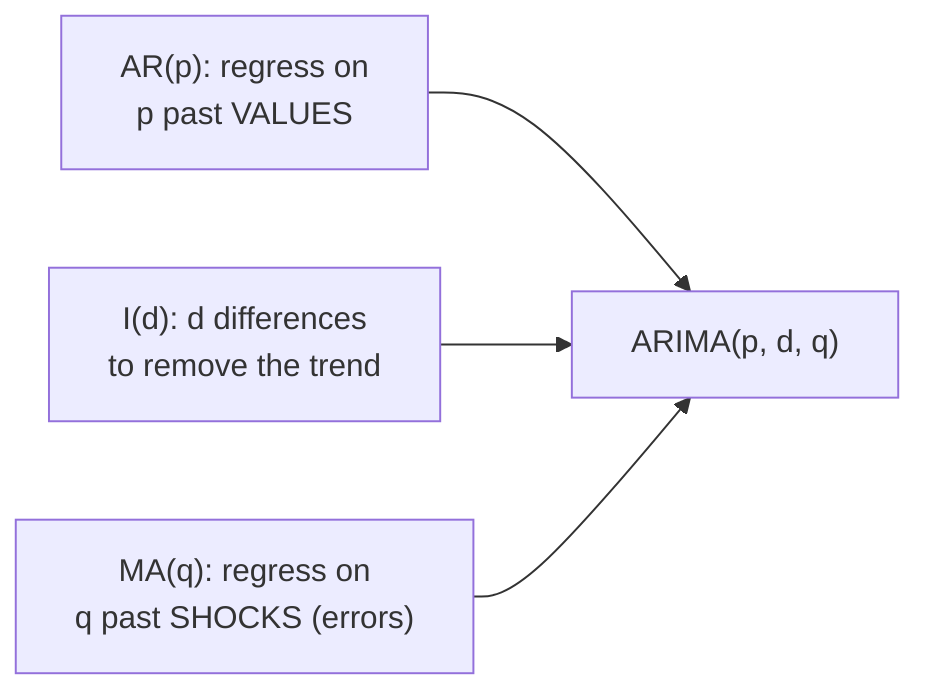
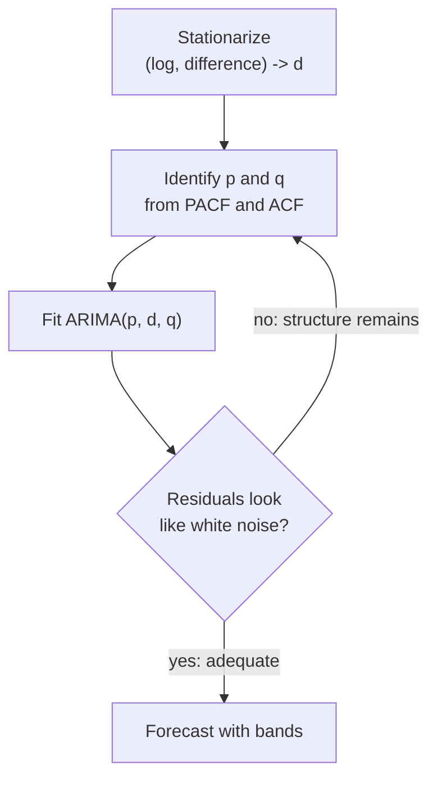

Everything so far has been preparation. We learned to make a series
stationary (differencing) and to read its echoes (ACF/PACF). Now we assemble
those skills into the workhorses of classical forecasting: **AR**, **MA**,
**ARMA**, and their union **ARIMA**. By the end you'll fit one, read its
output, and produce a forecast with honest uncertainty bands.

<Figure
  slug="tsa-arima-cutout"
  alt="Three interlocking gear blocks on a platform feeding one forecast ribbon that fans into a widening uncertainty cone"
/>

## The two ingredients: AR and MA

An ARIMA model is built from two simple ideas about where the next value
comes from.

**AR(p), autoregressive.** "Regress the series on its own recent *values*."
Each value is a weighted sum of the last `p` values plus a random shock:

`y(t) = c + φ₁·y(t-1) + φ₂·y(t-2) + ... + φₚ·y(t-p) + ε(t)`

This captures **momentum / persistence**: a high value tends to be followed
by another high value. The `φ` weights say how strongly the past pulls the
present.

**MA(q), moving average.** "Regress the series on its own recent *shocks*."
Each value is the current shock plus a weighted sum of the last `q` shocks
(the past forecast errors):

`y(t) = c + ε(t) + θ₁·ε(t-1) + ... + θ_q·ε(t-q)`

This captures **how long a surprise echoes**: an unexpected jump last month
nudges this month, then fades after `q` steps.

<Callout type="danger" title="An MA MODEL is NOT a moving-average smoother">
This is the single most confusing name collision in time series. The
**moving average** from the rolling-windows page (`rolling(7).mean()`) is a
*smoother of past values*. The **MA(q) model** here is a forecasting model
built from past *shocks* (errors), and it has nothing to do with averaging a
window. Same two words, completely different objects. When someone says "MA"
in a modeling context, they mean the shock-based model, not a rolling mean.
</Callout>

Let's confirm AR and MA models *recover* the coefficients we baked into
simulated data:

<CodeBlock
  adapter="python"
  files={[
    {
      filename: "main.py",
      initCode: `import numpy as np
import pandas as pd
import warnings
warnings.filterwarnings("ignore")
from statsmodels.tsa.arima.model import ARIMA

rng = np.random.default_rng(0)
n = 600
e = rng.normal(0, 1, n)

# AR(1) with phi = 0.7
ar = np.zeros(n)
for t in range(1, n):
    ar[t] = 0.7 * ar[t-1] + e[t]
ar1 = pd.Series(ar[100:])

# MA(1) with theta = 0.8
ma = np.zeros(n)
for t in range(1, n):
    ma[t] = e[t] + 0.8 * e[t-1]
ma1 = pd.Series(ma[100:])`,
      starterCode: `from statsmodels.tsa.arima.model import ARIMA

ar_fit = ARIMA(ar1, order=(1, 0, 0)).fit()  # one AR term, no differencing, no MA
ma_fit = ARIMA(ma1, order=(0, 0, 1)).fit()  # no AR, no differencing, one MA term

print("AR(1) model -- we built it with phi = 0.7:")
print(f"   estimated ar.L1 = {ar_fit.params['ar.L1']:.3f}")
print()
print("MA(1) model -- we built it with theta = 0.8:")
print(f"   estimated ma.L1 = {ma_fit.params['ma.L1']:.3f}")
print()
print("Both recovered the true coefficients closely. The model 'learned the rule'.")
`,
    },
  ]}
/>

## Putting it together: ARIMA(p, d, q)

- **ARMA(p, q)** simply uses AR *and* MA terms together, on a **stationary**
  series.
- **ARIMA(p, d, q)** is ARMA applied to a series that has been **differenced
  `d` times**, with forecasts integrated back. That `d` is what lets ARIMA
  handle the non-stationary, trending series we actually have.

So the three numbers are exactly the three skills from the last pages:

| Parameter | Meaning | How you choose it |
| --- | --- | --- |
| **`p`** | AR order (past values) | the **PACF** cut-off lag |
| **`d`** | differences for stationarity | how many differences make ADF pass |
| **`q`** | MA order (past shocks) | the **ACF** cut-off lag |

<Callout type="info" title="The Box-Jenkins workflow">
The classical recipe for building an ARIMA, named after the statisticians
who formalized it:

1. **Stationarize**, transform (log) and difference until stationary → `d`.
2. **Identify**, read the ACF/PACF of the stationary series → `p`, `q`.
3. **Fit**, estimate the model.
4. **Diagnose**, check the residuals are white noise; if not, revise.
5. **Forecast**, project forward with uncertainty.

</Callout>

## Fitting and forecasting

Time for a real forecast. We'll use a simulated series with a trend and
autoregressive noise, deliberately *non-seasonal*, so a plain ARIMA can
handle it well, fit on a training portion, and forecast the rest.

<CodeBlock
  adapter="python"
  files={[
    {
      filename: "main.py",
      initCode: `import numpy as np
import pandas as pd
import warnings
warnings.filterwarnings("ignore")
from statsmodels.tsa.arima.model import ARIMA
import matplotlib.pyplot as plt

rng = np.random.default_rng(3)
n = 132
e = rng.normal(0, 1.0, n)
ar = np.zeros(n)
for t in range(1, n):
    ar[t] = 0.6 * ar[t-1] + e[t]
idx = pd.date_range("2010-01-01", periods=n, freq="MS")
series = pd.Series(50 + 0.3*np.arange(n) + ar, index=idx, name="y")

train, test = series.iloc[:-24], series.iloc[-24:]   # hold out the last 24 months`,
      starterCode: `from statsmodels.tsa.arima.model import ARIMA
import matplotlib.pyplot as plt

# Fit on TRAIN only. (p,d,q) = (1,1,1): one AR term, one difference, one MA term.
res = ARIMA(train, order=(1, 1, 1)).fit()

# Forecast the 24 held-out months, with uncertainty.
fc = res.get_forecast(steps=24)
mean = fc.predicted_mean
ci = fc.conf_int()

fig, ax = plt.subplots(figsize=(10, 4.5))
train.plot(ax=ax, label="train")
test.plot(ax=ax, label="actual (held out)", color="black")
mean.plot(ax=ax, label="forecast", color="crimson")
ax.fill_between(
    ci.index,
    ci.iloc[:, 0],
    ci.iloc[:, 1],
    color="crimson",
    alpha=0.15,
    label="95% interval",
)
ax.legend()
ax.set_title("ARIMA(1,1,1): fit on train, forecast the held-out future")
plt.tight_layout()
plt.show()

print("The forecast tracks the trend, and the red band WIDENS as it reaches")
print("further out -- uncertainty compounds the further ahead you predict.")
`,
    },
  ]}
/>

Two things to notice. First, we fit on **train** and forecast the
**held-out** months, never touching the test data during fitting. Second,
the uncertainty band **fans out** with the horizon: predicting next month is
far easier than predicting two years out, and an honest forecast says so.

<Callout type="warn" title="Confidence intervals widen for a reason">
A forecast's uncertainty *compounds* with distance. Each step ahead is built
on the predicted (uncertain) steps before it, so errors accumulate. A
forecast reported without widening intervals, a single confident line
stretching years into the future, is hiding how little it really knows.
Always look at the bands, not just the central line.
</Callout>

## Choosing orders with AIC (and its limits)

ACF/PACF suggest candidate orders, but often several are plausible. The
**AIC** (Akaike Information Criterion) scores a fitted model by its fit
*penalized* for complexity, **lower is better**. It's a fast way to compare
candidate `(p, d, q)` orders.

<CodeBlock
  adapter="python"
  files={[
    {
      filename: "main.py",
      initCode: `import numpy as np
import pandas as pd
import warnings
warnings.filterwarnings("ignore")
from statsmodels.tsa.arima.model import ARIMA

rng = np.random.default_rng(3)
n = 132
e = rng.normal(0, 1.0, n)
ar = np.zeros(n)
for t in range(1, n):
    ar[t] = 0.6 * ar[t-1] + e[t]
idx = pd.date_range("2010-01-01", periods=n, freq="MS")
series = pd.Series(50 + 0.3*np.arange(n) + ar, index=idx, name="y")
train = series.iloc[:-24]`,
      starterCode: `from statsmodels.tsa.arima.model import ARIMA

print(f"{'order':>10} | {'AIC':>9}")
print("-" * 24)
for order in [(0, 1, 1), (1, 1, 0), (1, 1, 1), (2, 1, 1), (2, 1, 2)]:
    aic = ARIMA(train, order=order).fit().aic
    print(f"{str(order):>10} | {aic:9.2f}")

print()
print("Lower AIC = better fit-vs-complexity balance. But AIC is computed")
print("IN-SAMPLE -- it rewards fitting the training data, which is NOT the same")
print("as forecasting unseen data well. Use it to shortlist, then VALIDATE.")
`,
    },
  ]}
/>

<Callout type="danger" title="AIC is not out-of-sample accuracy">
AIC is an *in-sample* criterion: it measures how well the model fits the data
it was trained on, with a complexity penalty. A model can have the best AIC
and still forecast the future poorly (it tuned itself to the training noise).
AIC is a fine way to *shortlist* orders, but it is **no substitute for
testing on held-out future data**, which is the entire subject of the next
page. Never report AIC as if it were forecast accuracy.
</Callout>

## Diagnose the residuals

A fitted model's residuals (`actual - fitted`) should look like **white
noise**, no leftover autocorrelation, roughly normal, constant variance. If
the residuals still have structure, the model missed something. statsmodels
bundles the standard four-panel check.

<CodeBlock
  adapter="python"
  files={[
    {
      filename: "main.py",
      initCode: `import numpy as np
import pandas as pd
import warnings
warnings.filterwarnings("ignore")
from statsmodels.tsa.arima.model import ARIMA
import matplotlib.pyplot as plt
_passengers = [
    112,118,132,129,121,135,148,148,136,119,104,118,
    115,126,141,135,125,149,170,170,158,133,114,140,
    145,150,178,163,172,178,199,199,184,162,146,166,
    171,180,193,181,183,218,230,242,209,191,172,194,
    196,196,236,235,229,243,264,272,237,211,180,201,
    204,188,235,227,234,264,302,293,259,229,203,229,
    242,233,267,269,270,315,364,347,312,274,237,278,
    284,277,317,313,318,374,413,405,355,306,271,306,
    315,301,356,348,355,422,465,467,404,347,305,336,
    340,318,362,348,363,435,491,505,404,359,310,337,
    360,342,406,396,420,472,548,559,463,407,362,405,
    417,391,419,461,472,535,622,606,508,461,390,432,
]
idx = pd.date_range("1949-01-01", periods=len(_passengers), freq="MS")
air = pd.Series(_passengers, index=idx, name="passengers")`,
      starterCode: `from statsmodels.tsa.arima.model import ARIMA
import numpy as np
import matplotlib.pyplot as plt

# Plain ARIMA on log(air): it can take the trend, but NOT the yearly season.
res = ARIMA(np.log(air), order=(2, 1, 2)).fit()
res.plot_diagnostics(figsize=(10, 7))
plt.tight_layout()
plt.show()

print("Look at the bottom-left CORRELOGRAM (residual ACF): a spike still pokes")
print("out around lag 12. That leftover SEASONAL structure means plain ARIMA")
print("under-fits this series -- a SEASONAL model (SARIMA) is what it's asking for.")
`,
    },
  ]}
/>

The residual ACF still has a spike near lag 12, the yearly seasonality plain
ARIMA can't capture. That's the residual diagnostic doing its job: telling
you the model is incomplete and pointing at *seasonality* as the culprit.
The fix is a **seasonal** ARIMA (SARIMA), which adds seasonal AR/I/MA terms
at the period, conceptually just "do the AR/I/MA trick at lag 12 too."

<MultipleChoice
  markdown={`A teammate says, "I'll use an MA(2) model, that's just a 2-period moving average of the data, right?" What's the correction?

- They're right; MA(2) is a 2-period rolling mean
  > These are different objects that unfortunately share a name. A rolling mean averages past *values*; an MA(2) *model* is built from past *shocks*.
- [o] No, an MA(q) *model* expresses each value as a function of past *shocks* (forecast errors), which is unrelated to a rolling average of past values
  > The MA in "MA model" refers to a moving average *of the error terms*, a forecasting construct. The \`rolling(2).mean()\` smoother averages observed values. Confusing them is a classic trap.
- They're right, but only if the window is centered
  > Centering is a property of a rolling-mean smoother and irrelevant to an MA model. The two aren't the same thing under any windowing choice.
- MA(2) means two differences
  > Differences are the "I"/\`d\` part of ARIMA, not the MA part. MA(2) means two moving-average (shock) terms.

An MA(q) model is built from past shocks/errors; it is not a rolling average of the observed values despite the shared name.`}
/>

<MultipleChoice
  markdown={`In \`ARIMA(p, d, q)\`, which parameter do you read from the **PACF**, and which from the **ACF**?

- \`p\` from the ACF, \`q\` from the PACF
  > This is reversed. The PACF cut-off gives the AR order \`p\`; the ACF cut-off gives the MA order \`q\`.
- [o] \`p\` (AR order) from the PACF cut-off; \`q\` (MA order) from the ACF cut-off; \`d\` from how many differences achieve stationarity
  > PACF -> AR order \`p\`, ACF -> MA order \`q\`, and \`d\` is the number of differences needed for stationarity. That mapping is the heart of order identification.
- Both \`p\` and \`q\` from the ACF
  > The ACF alone can't separate AR from MA order; that's exactly why the PACF exists. \`p\` comes from the PACF, \`q\` from the ACF.
- \`d\` from the ACF and \`p\`, \`q\` from AIC only
  > \`d\` comes from stationarity testing (differencing), not the ACF shape directly; and \`p\`/\`q\` are identified from PACF/ACF (with AIC as a tie-breaker), not AIC alone.

PACF cut-off -> \`p\`, ACF cut-off -> \`q\`, and the number of differences for stationarity -> \`d\`.`}
/>

## Practice

<ChallengeCard
  adapter="python"
  title="Fit an ARIMA and forecast the horizon"
  instructions={`The \`train\` series (108 monthly points) is loaded. Fit an \`ARIMA\` with order \`(1, 1, 1)\` and produce a **12-step** forecast.

Set:
- \`fitted\`, the fitted results object (from \`ARIMA(train, order=(1,1,1)).fit()\`)
- \`forecast\`, the 12-step point forecast as a Series (use \`fitted.forecast(steps=12)\`)

The forecast should have exactly 12 values, all finite, continuing monthly after the last training date.`}
  files={[
    {
      filename: "main.py",
      initCode: `import numpy as np
import pandas as pd
import warnings
warnings.filterwarnings("ignore")
from statsmodels.tsa.arima.model import ARIMA
rng = np.random.default_rng(8)
n = 108
e = rng.normal(0, 1.0, n)
ar = np.zeros(n)
for t in range(1, n):
    ar[t] = 0.5 * ar[t-1] + e[t]
idx = pd.date_range("2012-01-01", periods=n, freq="MS")
train = pd.Series(20 + 0.4*np.arange(n) + ar, index=idx, name="y")`,
      starterCode: `fitted = None
forecast = None
print(forecast)
`,
      solutionCode: `fitted = ARIMA(train, order=(1, 1, 1)).fit()
forecast = fitted.forecast(steps=12)
print(forecast)
`,
    },
  ]}
  tests={[
    {
      id: "length",
      name: "forecast has 12 steps",
      description: "One per future month",
      code: `assert len(forecast) == 12, f"Expected 12, got {len(forecast)}"`,
    },
    {
      id: "finite",
      name: "all forecast values are finite",
      description: "No NaN or inf",
      code: `import numpy as np
assert np.all(np.isfinite(forecast.values)), "Forecast contains non-finite values"`,
    },
    {
      id: "continues",
      name: "forecast continues after training",
      description: "First forecast month follows the last train month",
      code: `import pandas as pd
assert forecast.index[0] == train.index[-1] + pd.offsets.MonthBegin(1)`,
    },
    {
      id: "trending_up",
      name: "forecast reflects the upward trend",
      description: "A rising series should forecast above the last training level",
      code: `assert forecast.iloc[-1] > train.iloc[-1] - 5, "12-month-ahead forecast should not collapse for a trending series"`,
    },
  ]}
/>

<ChallengeCard
  adapter="python"
  title="Pick the better order by AIC"
  instructions={`Compare two candidate models for the loaded \`train\` series by their **AIC** (lower is better). Compute the AIC of \`ARIMA(train, order=(1,1,1))\` and \`ARIMA(train, order=(0,1,1))\`, then choose the better order.

Produce a dict \`pick\`:
- \`"aic_111"\`, AIC of the (1,1,1) model (float)
- \`"aic_011"\`, AIC of the (0,1,1) model (float)
- \`"best_order"\`, the tuple with the **lower** AIC (either \`(1,1,1)\` or \`(0,1,1)\`)

Decide \`best_order\` consistently from your two AICs (lower wins).`}
  files={[
    {
      filename: "main.py",
      initCode: `import numpy as np
import pandas as pd
import warnings
warnings.filterwarnings("ignore")
from statsmodels.tsa.arima.model import ARIMA
rng = np.random.default_rng(2)
n = 120
e = rng.normal(0, 1.0, n)
ma = np.zeros(n)
for t in range(1, n):
    ma[t] = e[t] + 0.7 * e[t-1]   # an MA-flavored series
idx = pd.date_range("2011-01-01", periods=n, freq="MS")
train = pd.Series(10 + np.cumsum(ma) * 0.0 + ma, index=idx, name="y")`,
      starterCode: `pick = {
    "aic_111": None,
    "aic_011": None,
    "best_order": None,
}
print(pick)
`,
      solutionCode: `a111 = float(ARIMA(train, order=(1, 1, 1)).fit().aic)
a011 = float(ARIMA(train, order=(0, 1, 1)).fit().aic)
pick = {
    "aic_111": a111,
    "aic_011": a011,
    "best_order": (1, 1, 1) if a111 < a011 else (0, 1, 1),
}
print(pick)
`,
    },
  ]}
  tests={[
    {
      id: "floats",
      name: "both AICs are floats",
      description: "Computed for each candidate",
      code: `assert isinstance(pick["aic_111"], float) and isinstance(pick["aic_011"], float)`,
    },
    {
      id: "consistent",
      name: "best_order has the lower AIC",
      description: "Selection matches the numbers",
      code: `lower = (1,1,1) if pick["aic_111"] < pick["aic_011"] else (0,1,1)
assert pick["best_order"] == lower, "best_order must be the lower-AIC model"`,
    },
  ]}
/>

## Check your understanding

<MultipleChoice
  markdown={`What does the **AR** part of an ARIMA model use to predict the next value?

- The next few future values
  > Using future values would be leakage and is impossible at prediction time. AR uses only the *past*.
- [o] A weighted sum of the series' own recent past *values*
  > "Autoregressive" means regressing the series on its own lagged values, each prediction is a weighted combination of recent observations plus a shock.
- A weighted sum of recent forecast *errors*
  > That describes the *MA* part (past shocks), not the AR part. AR uses past values; MA uses past errors.
- A rolling average of the data
  > A rolling average is a smoother, not the AR component. AR estimates specific coefficients on lagged values, not a simple window mean.

The AR component predicts from a weighted sum of recent past *values* (the MA component is the one that uses past errors).`}
/>

<MultipleChoice
  markdown={`Why does an honest ARIMA forecast show **widening** confidence intervals as the horizon grows?

- Because the model gets lazier over time
  > Models don't fatigue. The widening reflects genuinely growing uncertainty, not a defect in effort.
- [o] Because each step ahead builds on the uncertain steps before it, so prediction errors accumulate with distance
  > Forecasting many steps out chains predictions on top of predictions, compounding uncertainty. The interval must widen to honestly represent how much less is known further ahead.
- Because the training data runs out
  > The training data is fixed; that's not what drives the widening. It's the *compounding* of forecast uncertainty step by step.
- Because of a plotting artifact
  > The widening is a real statistical property of multi-step forecasts, computed from the model, not a quirk of the chart.

Multi-step forecasts compound uncertainty, so intervals must widen the further ahead you predict.`}
/>

<MultipleChoice
  markdown={`A model has the **lowest AIC** among your candidates. Can you conclude it will forecast the future most accurately?

- Yes, lowest AIC always means best forecasts
  > AIC measures *in-sample* fit with a complexity penalty, not out-of-sample accuracy. The lowest-AIC model can still forecast worse on unseen data.
- [o] No, AIC is an in-sample criterion; the only way to judge forecast accuracy is to test on held-out future data
  > AIC is a useful shortlisting tool, but it rewards fitting the training data. Genuine forecast skill must be measured out-of-sample, on data the model never saw.
- Yes, as long as the AIC is negative
  > The sign of AIC is meaningless on its own (it depends on scale); negativity says nothing about forecast accuracy. Only out-of-sample testing settles that.
- No, because AIC can't be computed for ARIMA
  > AIC is routinely reported for ARIMA fits. The issue isn't computability, it's that in-sample AIC isn't the same as out-of-sample accuracy.

AIC compares in-sample fit-vs-complexity; forecast accuracy requires out-of-sample validation, which AIC cannot replace.`}
/>

<Callout type="success" title="Key takeaways">
- **AR(p)** predicts from past **values**; **MA(q)** predicts from past
  **shocks** (errors). An **MA model is *not* a rolling mean**, same name,
  different thing.
- **ARIMA(p, d, q)** = AR + `d` differences + MA, integrating forecasts back
  to the original scale. Read **`p` from the PACF**, **`q` from the ACF**,
  **`d` from differencing**.
- Fit with `ARIMA(series, order=(p,d,q)).fit()`; forecast with
  `.forecast(steps)` or `.get_forecast(steps).conf_int()`. Intervals
  **widen** with the horizon, uncertainty compounds.
- **AIC** (lower is better) shortlists orders but is **in-sample**, never a
  substitute for out-of-sample testing.
- **Check residuals**: leftover structure (e.g. a lag-12 spike) means the
  model is incomplete, seasonality calls for a **seasonal** ARIMA.
</Callout>

We just did something subtly important: we fit on a *training* slice and
forecast a *held-out* future slice. That discipline, and the ways analysts
accidentally break it, is the most important topic in this entire course.
Let's give it the attention it deserves.
