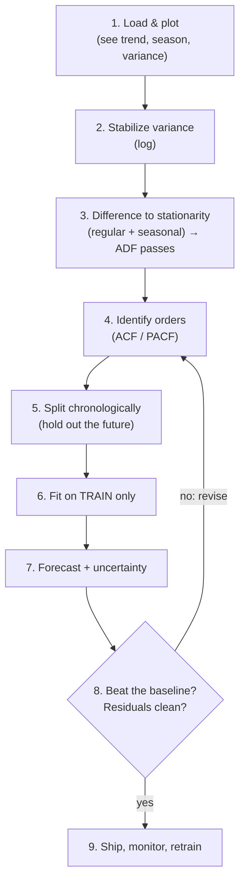

This is where it all comes together. Across the course you collected a
toolkit, datetime indexing, resampling, gap-filling, decomposition,
stationarity testing, differencing, ACF/PACF reading, ARIMA, and honest
validation. Here we run the *entire* pipeline, start to finish, on the
airline series, and end with the only question that matters: **does our model
actually beat a trivial baseline on data it has never seen?**

Before the code, here is the whole pipeline as a walkthrough, what each stage
does and why:

<Steps>
<Step>

**Load and look**

Plot the raw series to see its trend, its seasonality, and its changing
variance.

</Step>
<Step>

**Stabilize the variance**

Take logs so the seasonal swings stop growing with the level of the series.

</Step>
<Step>

**Difference to stationarity**

Apply regular and seasonal differencing until an ADF test says the series is
stationary.

</Step>
<Step>

**Identify the orders**

Read the ACF and PACF of the stationary series to choose the ARIMA terms.

</Step>
<Step>

**Split chronologically**

Hold out the most recent stretch as the "future", never shuffle a time
series.

</Step>
<Step>

**Fit on the training set only**

Estimate the model on the past, leaving the held-out future completely
untouched.

</Step>
<Step>

**Forecast with uncertainty**

Project forward and carry prediction intervals, not just a single point line.

</Step>
<Step>

**Beat the baseline?**

Compare honest out-of-sample error against a trivial baseline and check the
residuals, if it fails, revise the orders.

</Step>
<Step>

**Ship, monitor, retrain**

Put the model to work, watch it on new data, and refit as the series evolves.

</Step>
</Steps>

## Step 1, Load and look

Every forecast starts with eyes on the data. We name what we see *before*
touching a model.

<Figure
  slug="tsa-capstone-cutout"
  alt="Eight stepped platforms rising in order from a raw jagged ribbon to a forecast cone measured against a baseline marker"
/>

<CodeBlock
  adapter="python"
  files={[
    {
      filename: "main.py",
      initCode: `import pandas as pd
import numpy as np
_passengers = [
    112,118,132,129,121,135,148,148,136,119,104,118,
    115,126,141,135,125,149,170,170,158,133,114,140,
    145,150,178,163,172,178,199,199,184,162,146,166,
    171,180,193,181,183,218,230,242,209,191,172,194,
    196,196,236,235,229,243,264,272,237,211,180,201,
    204,188,235,227,234,264,302,293,259,229,203,229,
    242,233,267,269,270,315,364,347,312,274,237,278,
    284,277,317,313,318,374,413,405,355,306,271,306,
    315,301,356,348,355,422,465,467,404,347,305,336,
    340,318,362,348,363,435,491,505,404,359,310,337,
    360,342,406,396,420,472,548,559,463,407,362,405,
    417,391,419,461,472,535,622,606,508,461,390,432,
]
idx = pd.date_range("1949-01-01", periods=len(_passengers), freq="MS")
air = pd.Series(_passengers, index=idx, name="passengers")`,
      starterCode: `import matplotlib.pyplot as plt

fig, ax = plt.subplots(figsize=(10, 4))
air.plot(ax=ax, title="Monthly airline passengers, 1949-1960")
ax.set_ylabel("passengers (thousands)")
plt.tight_layout()
plt.show()

print(
    f"Span      : {air.index.min().date()} to {air.index.max().date()}  ({len(air)} months)"
)
print(f"Range     : {air.min()} to {air.max()}")
print()
print("Three features to plan around:")
print(" - TREND: a steady climb in air travel.")
print(" - SEASONALITY: a summer peak every 12 months.")
print(" - GROWING VARIANCE: the summer-winter swing widens over time (-> log).")
`,
    },
  ]}
/>

## Step 2, Confirm non-stationarity, then plan the transforms

We don't guess; we test. The raw series should fail the ADF test, and the
fix-up sequence (log for variance, a regular difference for trend, a seasonal
difference for the yearly cycle) should drive it to stationarity.

<CodeBlock
  adapter="python"
  files={[
    {
      filename: "main.py",
      initCode: `import pandas as pd
import numpy as np
import warnings
warnings.filterwarnings("ignore")
from statsmodels.tsa.stattools import adfuller
_passengers = [
    112,118,132,129,121,135,148,148,136,119,104,118,
    115,126,141,135,125,149,170,170,158,133,114,140,
    145,150,178,163,172,178,199,199,184,162,146,166,
    171,180,193,181,183,218,230,242,209,191,172,194,
    196,196,236,235,229,243,264,272,237,211,180,201,
    204,188,235,227,234,264,302,293,259,229,203,229,
    242,233,267,269,270,315,364,347,312,274,237,278,
    284,277,317,313,318,374,413,405,355,306,271,306,
    315,301,356,348,355,422,465,467,404,347,305,336,
    340,318,362,348,363,435,491,505,404,359,310,337,
    360,342,406,396,420,472,548,559,463,407,362,405,
    417,391,419,461,472,535,622,606,508,461,390,432,
]
idx = pd.date_range("1949-01-01", periods=len(_passengers), freq="MS")
air = pd.Series(_passengers, index=idx, name="passengers")`,
      starterCode: `import numpy as np
from statsmodels.tsa.stattools import adfuller

def p(series):
    return adfuller(series.dropna())[1]

print("ADF p-values (low = stationary):")
print(f"  raw air                       : {p(air):.4f}  -> non-stationary")
print(
    f"  log(air)                      : {p(np.log(air)):.4f}  -> still non-stationary (log fixes variance, not trend)"
)
print(
    f"  log + first difference        : {p(np.log(air).diff()):.4f}  -> trend gone, season remains"
)
print(
    f"  log + first + seasonal(12) diff: {p(np.log(air).diff().diff(12)):.4f}  -> STATIONARY"
)
print()
print("Verdict: we need a log, one regular difference (d=1), and one seasonal")
print("difference at lag 12 (D=1). That's the recipe the data itself prescribed.")
`,
    },
  ]}
/>

## Step 3, Decompose to understand the structure

A multiplicative decomposition confirms what the eye saw and gives us a clean
picture of each component, useful for sanity-checking and for explaining the
forecast to stakeholders.

<CodeBlock
  adapter="python"
  files={[
    {
      filename: "main.py",
      initCode: `import pandas as pd
import numpy as np
_passengers = [
    112,118,132,129,121,135,148,148,136,119,104,118,
    115,126,141,135,125,149,170,170,158,133,114,140,
    145,150,178,163,172,178,199,199,184,162,146,166,
    171,180,193,181,183,218,230,242,209,191,172,194,
    196,196,236,235,229,243,264,272,237,211,180,201,
    204,188,235,227,234,264,302,293,259,229,203,229,
    242,233,267,269,270,315,364,347,312,274,237,278,
    284,277,317,313,318,374,413,405,355,306,271,306,
    315,301,356,348,355,422,465,467,404,347,305,336,
    340,318,362,348,363,435,491,505,404,359,310,337,
    360,342,406,396,420,472,548,559,463,407,362,405,
    417,391,419,461,472,535,622,606,508,461,390,432,
]
idx = pd.date_range("1949-01-01", periods=len(_passengers), freq="MS")
air = pd.Series(_passengers, index=idx, name="passengers")`,
      starterCode: `from statsmodels.tsa.seasonal import seasonal_decompose
import matplotlib.pyplot as plt

dec = seasonal_decompose(air, model="multiplicative", period=12)
fig = dec.plot()
fig.set_size_inches(9, 7)
plt.tight_layout()
plt.show()

# The seasonal factor tells us the shape of a typical year:
season = dec.seasonal.iloc[:12]
peak = season.idxmax()
trough = season.idxmin()
print(f"Busiest month factor ~ {season.max():.2f} (around {peak.strftime('%B')})")
print(f"Quietest month factor ~ {season.min():.2f} (around {trough.strftime('%B')})")
print("Multiplicative: summer runs ~+25-30% above trend, winter dips below.")
`,
    },
  ]}
/>

## Step 4, Identify orders from the stationary series

With the series made stationary, the ACF/PACF become readable. We're looking
for the regular short-lag structure (for `p`, `q`) and any leftover spike at
the seasonal lag 12 (which tells us we need *seasonal* terms).

<CodeBlock
  adapter="python"
  files={[
    {
      filename: "main.py",
      initCode: `import pandas as pd
import numpy as np
import warnings
warnings.filterwarnings("ignore")
_passengers = [
    112,118,132,129,121,135,148,148,136,119,104,118,
    115,126,141,135,125,149,170,170,158,133,114,140,
    145,150,178,163,172,178,199,199,184,162,146,166,
    171,180,193,181,183,218,230,242,209,191,172,194,
    196,196,236,235,229,243,264,272,237,211,180,201,
    204,188,235,227,234,264,302,293,259,229,203,229,
    242,233,267,269,270,315,364,347,312,274,237,278,
    284,277,317,313,318,374,413,405,355,306,271,306,
    315,301,356,348,355,422,465,467,404,347,305,336,
    340,318,362,348,363,435,491,505,404,359,310,337,
    360,342,406,396,420,472,548,559,463,407,362,405,
    417,391,419,461,472,535,622,606,508,461,390,432,
]
idx = pd.date_range("1949-01-01", periods=len(_passengers), freq="MS")
air = pd.Series(_passengers, index=idx, name="passengers")`,
      starterCode: `import numpy as np
import matplotlib.pyplot as plt
from statsmodels.graphics.tsaplots import plot_acf, plot_pacf

stationary = np.log(air).diff().diff(12).dropna()

fig, (a1, a2) = plt.subplots(1, 2, figsize=(11, 3.6))
plot_acf(stationary, lags=24, ax=a1, title="ACF of the stationary series")
plot_pacf(
    stationary, lags=24, ax=a2, method="ywm", title="PACF of the stationary series"
)
plt.tight_layout()
plt.show()

print("Small significant spikes at the short lags (1) suggest modest p and q.")
print("A spike near lag 12 confirms a SEASONAL term is needed (period 12).")
print("Reasonable starting orders: ARIMA(1,1,1) with a seasonal (1,1,1,12) part.")
`,
    },
  ]}
/>

## Step 5-7, Split, fit, and forecast (honestly)

Now the part everything else was for. We **hold out the last 24 months**,
fit on the past only, and forecast that held-out future. We fit two models,
a **seasonal** ARIMA (the extra terms at lag 12 we just justified) and a
**plain** ARIMA (no seasonal terms), and we keep a **seasonal-naive
baseline**. Then we score all three on the held-out months with honest
out-of-sample metrics.

<Callout type="info" title="What 'seasonal ARIMA' adds">
A seasonal ARIMA is just ARIMA with the *same AR/I/MA machinery repeated at
the seasonal lag*. `order=(1,1,1)` handles the month-to-month dynamics;
`seasonal_order=(1,1,1,12)` handles the year-to-year dynamics, including the
seasonal difference we found we needed. It's the natural home for the
lag-12 structure plain ARIMA left in its residuals.
</Callout>

<CodeBlock
  adapter="python"
  files={[
    {
      filename: "main.py",
      initCode: `import pandas as pd
import numpy as np
import warnings
warnings.filterwarnings("ignore")
from statsmodels.tsa.arima.model import ARIMA
from statsmodels.tsa.statespace.sarimax import SARIMAX
_passengers = [
    112,118,132,129,121,135,148,148,136,119,104,118,
    115,126,141,135,125,149,170,170,158,133,114,140,
    145,150,178,163,172,178,199,199,184,162,146,166,
    171,180,193,181,183,218,230,242,209,191,172,194,
    196,196,236,235,229,243,264,272,237,211,180,201,
    204,188,235,227,234,264,302,293,259,229,203,229,
    242,233,267,269,270,315,364,347,312,274,237,278,
    284,277,317,313,318,374,413,405,355,306,271,306,
    315,301,356,348,355,422,465,467,404,347,305,336,
    340,318,362,348,363,435,491,505,404,359,310,337,
    360,342,406,396,420,472,548,559,463,407,362,405,
    417,391,419,461,472,535,622,606,508,461,390,432,
]
idx = pd.date_range("1949-01-01", periods=len(_passengers), freq="MS")
air = pd.Series(_passengers, index=idx, name="passengers")

def mae(a, b):  return float(np.mean(np.abs(np.asarray(a) - np.asarray(b))))
def rmse(a, b): return float(np.sqrt(np.mean((np.asarray(a) - np.asarray(b)) ** 2)))
def mape(a, b): return float(np.mean(np.abs((np.asarray(a) - np.asarray(b)) / np.asarray(a))) * 100)`,
      starterCode: `import numpy as np
from statsmodels.tsa.arima.model import ARIMA
from statsmodels.tsa.statespace.sarimax import SARIMAX

H = 24
train, test = air.iloc[:-H], air.iloc[-H:]  # past vs held-out future
log_train = np.log(train)

# Seasonal ARIMA on the log series (forecast back via exp).
sarima = SARIMAX(
    log_train,
    order=(1, 1, 1),
    seasonal_order=(1, 1, 1, 12),
    enforce_stationarity=False,
    enforce_invertibility=False,
).fit(disp=False)
fc_sarima = np.exp(sarima.get_forecast(H).predicted_mean)

# Plain ARIMA on the log series (no seasonal terms).
plain = ARIMA(log_train, order=(2, 1, 2)).fit()
fc_plain = np.exp(plain.forecast(H))

# Baseline: seasonal-naive (each month = same month last year -> last 12, repeated).
fc_snaive = np.tile(train.values[-12:], H // 12)

yt = test.values
print(f"{'forecaster':30s}{'MAE':>8}{'RMSE':>8}{'MAPE':>8}")
print("-" * 54)
for name, pred in [
    ("Seasonal-naive (BASELINE)", fc_snaive),
    ("Plain ARIMA(2,1,2)", fc_plain.values),
    ("Seasonal ARIMA (1,1,1)(1,1,1,12)", fc_sarima.values),
]:
    print(f"{name:30s}{mae(yt, pred):8.1f}{rmse(yt, pred):8.1f}{mape(yt, pred):7.1f}%")

print()
print("The SEASONAL model wins clearly -- it captures both the trend AND the")
print("yearly cycle. Plain ARIMA handles the trend but leaves the seasonality in")
print("its errors, so it trails the seasonal model -- exactly what its lag-12")
print("residual spike warned about on the ARIMA page.")
`,
    },
  ]}
/>

The seasonal model posts the lowest error on data it never saw, and it
**beats the baseline**, which is the bar every model must clear. Plain ARIMA
captures the trend but, lacking seasonal terms, leaves the yearly cycle in its
errors, so it trails the seasonal model. The gap between them is precisely the
seasonality that plain ARIMA's lag-12 residual spike warned about on the ARIMA
page, the residual diagnostic, paid off in hard numbers.

## Step 8, Visualize the forecast against reality

<CodeBlock
  adapter="python"
  files={[
    {
      filename: "main.py",
      initCode: `import pandas as pd
import numpy as np
import warnings
warnings.filterwarnings("ignore")
from statsmodels.tsa.statespace.sarimax import SARIMAX
_passengers = [
    112,118,132,129,121,135,148,148,136,119,104,118,
    115,126,141,135,125,149,170,170,158,133,114,140,
    145,150,178,163,172,178,199,199,184,162,146,166,
    171,180,193,181,183,218,230,242,209,191,172,194,
    196,196,236,235,229,243,264,272,237,211,180,201,
    204,188,235,227,234,264,302,293,259,229,203,229,
    242,233,267,269,270,315,364,347,312,274,237,278,
    284,277,317,313,318,374,413,405,355,306,271,306,
    315,301,356,348,355,422,465,467,404,347,305,336,
    340,318,362,348,363,435,491,505,404,359,310,337,
    360,342,406,396,420,472,548,559,463,407,362,405,
    417,391,419,461,472,535,622,606,508,461,390,432,
]
idx = pd.date_range("1949-01-01", periods=len(_passengers), freq="MS")
air = pd.Series(_passengers, index=idx, name="passengers")`,
      starterCode: `import numpy as np
import matplotlib.pyplot as plt
from statsmodels.tsa.statespace.sarimax import SARIMAX

H = 24
train, test = air.iloc[:-H], air.iloc[-H:]
res = SARIMAX(
    np.log(train),
    order=(1, 1, 1),
    seasonal_order=(1, 1, 1, 12),
    enforce_stationarity=False,
    enforce_invertibility=False,
).fit(disp=False)

fc = res.get_forecast(H)
mean = np.exp(fc.predicted_mean)
ci = np.exp(fc.conf_int())

fig, ax = plt.subplots(figsize=(10, 4.5))
train.plot(ax=ax, label="train")
test.plot(ax=ax, label="actual (held out)", color="black")
mean.plot(ax=ax, label="seasonal forecast", color="crimson")
ax.fill_between(
    ci.index,
    ci.iloc[:, 0],
    ci.iloc[:, 1],
    color="crimson",
    alpha=0.15,
    label="95% interval",
)
ax.legend()
ax.set_title("End-to-end forecast vs reality (last 24 months held out)")
plt.tight_layout()
plt.show()

print("The forecast reproduces the rising trend AND the summer peaks, and the")
print("actual values land inside the uncertainty band. That is what an honest,")
print("validated forecast looks like.")
`,
    },
  ]}
/>

<Callout type="success" title="What 'done' looks like">
A finished forecast is not just a line into the future. It is: a model whose
assumptions you *checked* (stationarity), whose orders you *justified*
(ACF/PACF), evaluated on data it *never saw* (chronological split), that
*beats a baseline* on honest metrics (MAE/RMSE/MAPE), with *uncertainty bands*
that the actuals fall inside. Anything less is a guess wearing a lab coat.
</Callout>

## Step 9, Real life: it doesn't end at the notebook

In production, a forecast is a living thing:

- **Retrain on a schedule.** As new months arrive, refit so the model learns
  the latest dynamics. A model trained once and frozen slowly goes stale.
- **Monitor the error.** Track the live forecast error over time; if it drifts
  up, the world has changed (a *regime shift*) and the model needs attention.
- **Keep the baseline running.** If the fancy model ever stops beating
  seasonal-naive in production, fall back to the baseline, it's cheaper and,
  in that moment, better.
- **Respect the horizon.** Short-horizon forecasts are trustworthy; far-out
  ones come with wide bands for a reason. Don't promise precision the
  uncertainty doesn't support.

## Practice

<ChallengeCard
  adapter="python"
  title="Run the stationarity pipeline end to end"
  instructions={`Reproduce the diagnosis stage on the loaded \`air\` series. Build a dict \`report\` recording the ADF p-value at each stage of the standard airline recipe:

- \`"raw"\`, ADF p-value of \`air\`
- \`"log"\`, ADF p-value of \`np.log(air)\`
- \`"log_diff"\`, ADF p-value of \`np.log(air).diff()\`
- \`"log_diff_sdiff"\`, ADF p-value of \`np.log(air).diff().diff(12)\`

Drop NaNs before each test. Also set \`is_stationary_final\` to \`True\` if the final stage's p-value is below 0.05. The full recipe should reach stationarity.`}
  files={[
    {
      filename: "main.py",
      initCode: `import pandas as pd
import numpy as np
import warnings
warnings.filterwarnings("ignore")
from statsmodels.tsa.stattools import adfuller
_passengers = [
    112,118,132,129,121,135,148,148,136,119,104,118,
    115,126,141,135,125,149,170,170,158,133,114,140,
    145,150,178,163,172,178,199,199,184,162,146,166,
    171,180,193,181,183,218,230,242,209,191,172,194,
    196,196,236,235,229,243,264,272,237,211,180,201,
    204,188,235,227,234,264,302,293,259,229,203,229,
    242,233,267,269,270,315,364,347,312,274,237,278,
    284,277,317,313,318,374,413,405,355,306,271,306,
    315,301,356,348,355,422,465,467,404,347,305,336,
    340,318,362,348,363,435,491,505,404,359,310,337,
    360,342,406,396,420,472,548,559,463,407,362,405,
    417,391,419,461,472,535,622,606,508,461,390,432,
]
idx = pd.date_range("1949-01-01", periods=len(_passengers), freq="MS")
air = pd.Series(_passengers, index=idx, name="passengers")`,
      starterCode: `import numpy as np
from statsmodels.tsa.stattools import adfuller

report = {
    "raw": None,
    "log": None,
    "log_diff": None,
    "log_diff_sdiff": None,
}
is_stationary_final = None
print(report)
print("final stationary:", is_stationary_final)
`,
      solutionCode: `import numpy as np
from statsmodels.tsa.stattools import adfuller

def p(s):
    return float(adfuller(s.dropna())[1])

loga = np.log(air)
report = {
    "raw": p(air),
    "log": p(loga),
    "log_diff": p(loga.diff()),
    "log_diff_sdiff": p(loga.diff().diff(12)),
}
is_stationary_final = report["log_diff_sdiff"] < 0.05
print(report)
print("final stationary:", is_stationary_final)
`,
    },
  ]}
  tests={[
    {
      id: "keys",
      name: "report has all four stages",
      description: "Correct keys, all floats",
      code: `assert set(report.keys()) == {"raw", "log", "log_diff", "log_diff_sdiff"}
assert all(isinstance(v, float) for v in report.values())`,
    },
    {
      id: "raw_nonstationary",
      name: "raw series is non-stationary",
      description: "High p-value before transforms",
      code: `assert report["raw"] > 0.05, "Raw airline series should be non-stationary"`,
    },
    {
      id: "final_stationary",
      name: "full recipe reaches stationarity",
      description: "log + diff + seasonal diff passes ADF",
      code: `assert report["log_diff_sdiff"] < 0.05 and is_stationary_final is True`,
    },
    {
      id: "improves",
      name: "differencing helps",
      description: "Differenced p-value is far below the raw one",
      code: `assert report["log_diff"] < report["raw"]`,
    },
  ]}
/>

<ChallengeCard
  adapter="python"
  title="Honest evaluation: does the seasonal baseline beat a flat forecast?"
  instructions={`Do a clean chronological evaluation. Hold out the **last 12 months** of \`air\` as the test set (train = the rest). Forecast those 12 months two ways and score each by **MAE** and **RMSE** on the held-out actuals:

- seasonal-naive: each test month = the value 12 months earlier (the last 12 of \`train\`)
- flat mean: every test month = the mean of \`train\`

Produce a dict \`evaluation\` with these exact key names:
- \`"snaive_mae"\`, \`"snaive_rmse"\`, \`"mean_mae"\`, \`"mean_rmse"\` (all floats)
- \`"snaive_better"\`, \`True\` if seasonal-naive has the lower MAE

Use only \`train\` to build both forecasts, never peek at the test set.`}
  files={[
    {
      filename: "main.py",
      initCode: `import pandas as pd
import numpy as np
_passengers = [
    112,118,132,129,121,135,148,148,136,119,104,118,
    115,126,141,135,125,149,170,170,158,133,114,140,
    145,150,178,163,172,178,199,199,184,162,146,166,
    171,180,193,181,183,218,230,242,209,191,172,194,
    196,196,236,235,229,243,264,272,237,211,180,201,
    204,188,235,227,234,264,302,293,259,229,203,229,
    242,233,267,269,270,315,364,347,312,274,237,278,
    284,277,317,313,318,374,413,405,355,306,271,306,
    315,301,356,348,355,422,465,467,404,347,305,336,
    340,318,362,348,363,435,491,505,404,359,310,337,
    360,342,406,396,420,472,548,559,463,407,362,405,
    417,391,419,461,472,535,622,606,508,461,390,432,
]
idx = pd.date_range("1949-01-01", periods=len(_passengers), freq="MS")
air = pd.Series(_passengers, index=idx, name="passengers")`,
      starterCode: `import numpy as np

evaluation = {
    "snaive_mae": None,
    "snaive_rmse": None,
    "mean_mae": None,
    "mean_rmse": None,
    "snaive_better": None,
}
print(evaluation)
`,
      solutionCode: `import numpy as np

H = 12
train, test = air.iloc[:-H], air.iloc[-H:]
yt = test.values

snaive = train.values[-H:]
flat = np.full(H, train.mean())

def mae(a, b):
    return float(np.mean(np.abs(a - b)))

def rmse(a, b):
    return float(np.sqrt(np.mean((a - b) ** 2)))

evaluation = {
    "snaive_mae": mae(yt, snaive),
    "snaive_rmse": rmse(yt, snaive),
    "mean_mae": mae(yt, flat),
    "mean_rmse": rmse(yt, flat),
}
evaluation["snaive_better"] = evaluation["snaive_mae"] < evaluation["mean_mae"]
print(evaluation)
`,
    },
  ]}
  tests={[
    {
      id: "keys",
      name: "all five outputs present",
      description: "Four floats and a bool",
      code: `need = {"snaive_mae","snaive_rmse","mean_mae","mean_rmse","snaive_better"}
assert need.issubset(evaluation.keys())
assert all(isinstance(evaluation[k], float) for k in ["snaive_mae","snaive_rmse","mean_mae","mean_rmse"])`,
    },
    {
      id: "snaive_wins",
      name: "seasonal-naive beats the flat mean",
      description: "Seasonality carries real signal here",
      code: `assert evaluation["snaive_mae"] < evaluation["mean_mae"]
assert evaluation["snaive_better"] is True`,
    },
    {
      id: "rmse_ge_mae",
      name: "RMSE >= MAE for both",
      description: "A basic metric sanity check",
      code: `assert evaluation["snaive_rmse"] >= evaluation["snaive_mae"] - 1e-9
assert evaluation["mean_rmse"] >= evaluation["mean_mae"] - 1e-9`,
    },
  ]}
/>

## Check your understanding

<MultipleChoice
  markdown={`In the pipeline, **why fit the model on \`log(train)\` and exponentiate the forecasts** rather than modeling the raw passengers directly?

- Because the log removes the trend
  > A log does not remove a trend (differencing does). It specifically stabilizes the *variance*; the trend is handled separately by the differencing term.
- Because ARIMA cannot accept positive numbers
  > ARIMA handles positive data fine. The log is about taming *growing variance*, not a restriction on sign or magnitude.
- Because logs make the numbers smaller and faster to compute
  > Speed isn't the reason, and the magnitude of the numbers is irrelevant to the model. The log addresses a statistical property.
- [o] The log stabilizes the series' variance, which grows with the level (multiplicative seasonality), making it suitable for the additive, constant-variance assumptions of ARIMA
  > The airline series' swings widen as the level rises. A log compresses that growing variance into a roughly constant one, matching what ARIMA expects; exponentiating returns forecasts to the original scale.

Logging stabilizes the variance that grows with the level, aligning the series with ARIMA's constant-variance assumptions; exponentiating undoes it.`}
/>

<MultipleChoice
  markdown={`The seasonal model scored the lowest error on the held-out months. What single comparison makes that result *meaningful* rather than just a number?

- That its forecast line looked smooth
  > Visual smoothness says nothing about accuracy. A smooth, confident, wrong forecast is still wrong; the baseline comparison on held-out data is the real test.
- That its AIC was the lowest
  > AIC is an in-sample criterion and wasn't even computed here. What makes the out-of-sample number meaningful is beating a baseline on that same held-out data.
- That it used more parameters than the alternatives
  > More parameters is a cost, not evidence of value, it raises overfitting risk. Skill is shown by out-of-sample performance versus a baseline, not by complexity.
- [o] That it beat the seasonal-naive **baseline** on the same honest, held-out test
  > An error figure only has meaning relative to a reference. Beating "same as last year" on data the model never saw is what proves the model added real skill.

An out-of-sample error is meaningful only against a baseline on the same honest test, beating seasonal-naive is the proof of added skill.`}
/>

<MultipleChoice
  markdown={`Which sequence correctly orders the core pipeline steps?

- Fit model -> check stationarity -> split chronologically -> evaluate
  > Fitting before checking stationarity or splitting risks modeling a non-stationary series and leaking the future. Diagnosis and the split must come first.
- Split randomly -> fit -> exponentiate -> done
  > A random split leaks the future, and "done" skips stationarity, order identification, uncertainty, and the baseline comparison that make a forecast trustworthy.
- [o] Explore -> stabilize/difference to stationarity -> identify orders -> split chronologically -> fit on train -> forecast -> compare to baseline
  > You diagnose and prepare the series, identify orders, hold out the future, fit only on the past, forecast, and finally judge against a baseline. Each step depends on the ones before it.
- Decompose -> forecast the trend component -> stop
  > The decomposition trend is a backward-looking smoother, not a forecast, and this skips stationarity, fitting, the chronological split, and validation entirely.

Diagnose and prepare first, hold out the future before fitting, and finish by proving skill against a baseline, order matters.`}
/>

<Callout type="success" title="Course wrap-up">
You can now take a raw, messy, seasonal, non-stationary series and:

- get it onto a clean **timeline**, **resample** it, and fill its **gaps**;
- **decompose** it and recognize trend, seasonality, and noise;
- test and engineer **stationarity** with the ADF test and **differencing**;
- read **ACF/PACF** to propose **ARIMA** orders;
- **fit** a model and forecast with honest **uncertainty**;
- and, most importantly, **validate chronologically**, measure with
  **MAE/RMSE/MAPE**, and prove your model **beats a baseline** without leaking
  the future.

That last skill is the one that separates forecasts you can stake decisions
on from numbers that merely look impressive. Keep the discipline, keep a
baseline running, and keep your training set firmly in the past.
</Callout>
