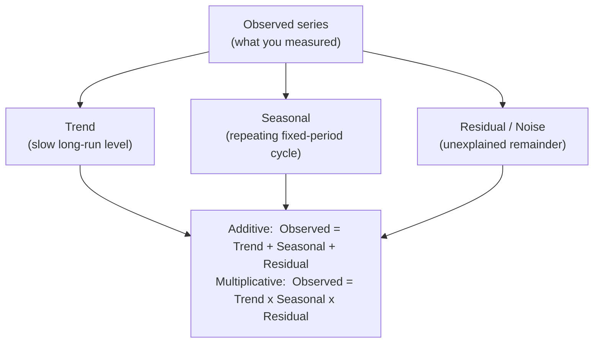

A real time series is several stories told at once: a slow climb, a yearly
rhythm, and a haze of randomness on top. **Decomposition** pulls those
apart so you can study each on its own. It's both a *diagnostic* (what is
this series actually made of?) and a *preparation step* (strip the
seasonality so you can see the real growth). The mental model is one line:

## See it recover components we built ourselves

The honest way to trust a tool is to feed it data whose answer you already
know. We'll *construct* a series from a known trend, a known seasonal sine,
and known noise, then ask `seasonal_decompose` to hand the pieces back.

<svg
  viewBox="0 0 640 250"
  role="img"
  aria-label="A blue observed ridge sits above the steady yellow seasonal wave it contains, decomposition pulls one series apart into components like trend and season"
  style={{ display: "block", width: "100%", maxWidth: "640px", height: "auto", margin: "2.5rem auto" }}
>
  <g style={{ color: "var(--ds-blue-500)" }} fill="currentColor">
    <path d="M 90 92 C 105 80 118 62 140 62 C 162 62 168 80 190 80 C 212 80 218 52 240 52 C 262 52 268 72 290 72 C 312 72 318 44 340 44 C 362 44 368 64 390 64 C 412 64 418 34 440 34 C 462 34 470 56 492 56 C 514 56 530 40 550 36 L 550 92 Z" fillOpacity="0.28" />
  </g>
  <g style={{ color: "var(--ds-yellow-500)" }} fill="currentColor">
    <path d="M 90 176 C 113 158 136 158 159 176 C 182 194 205 194 228 176 C 251 158 274 158 297 176 C 320 194 343 194 366 176 C 389 158 412 158 435 176 C 458 194 481 194 504 176 C 527 158 538 158 550 166 L 550 176 C 538 168 527 168 504 186 C 481 204 458 204 435 186 C 412 168 389 168 366 186 C 343 204 320 204 297 186 C 274 168 251 168 228 186 C 205 204 182 204 159 186 C 136 168 113 168 90 186 Z" fillOpacity="0.55" />
  </g>
</svg>

<CodeBlock
  adapter="python"
  files={[
    {
      filename: "main.py",
      initCode: `import numpy as np
import pandas as pd
import matplotlib.pyplot as plt
from statsmodels.tsa.seasonal import seasonal_decompose

rng = np.random.default_rng(0)
n = 96                                   # 8 years of monthly data
idx = pd.date_range("2014-01-01", periods=n, freq="MS")
t = np.arange(n)
true_trend    = 50 + 0.8 * t             # a straight climb we put in by hand
true_seasonal = 12 * np.sin(2*np.pi*t/12)  # a yearly wave, constant size
true_noise    = rng.normal(0, 3, n)      # random haze
y = pd.Series(true_trend + true_seasonal + true_noise, index=idx, name="y")`,
      starterCode: `from statsmodels.tsa.seasonal import seasonal_decompose
import matplotlib.pyplot as plt

# period=12 tells it the seasonal cycle is 12 months long.
result = seasonal_decompose(y, model="additive", period=12)

fig = result.plot()
fig.set_size_inches(9, 7)
plt.tight_layout()
plt.show()

print("Top to bottom: Observed, Trend, Seasonal, Residual.")
print("The recovered Trend is our straight climb; the Seasonal panel is our")
print("yearly wave repeated 8 times; the Residual is just the leftover noise.")
`,
    },
  ]}
/>

Four panels: the original on top, then the smooth **trend** it extracted,
the repeating **seasonal** wave, and the **residual**, what's left when you
subtract the other two. For data we built additively, the residual is
shapeless noise, exactly as it should be.

<Callout type="info" title="How seasonal_decompose actually works (the short version)">
1. **Trend**, estimate it with a centered moving average whose window is
   the seasonal period (so the season averages out). This is why the trend
   has `NaN`s at both ends: the moving average needs a full window.
2. **Seasonal**, subtract the trend, then *average* the leftovers at each
   position in the cycle (all Januaries together, all Februaries, ...). That
   average shape is repeated across the whole span.
3. **Residual**, whatever remains after removing trend and seasonal.

It's a deliberately simple recipe, which makes it fast, transparent, and a
great first look, not a forecasting model.
</Callout>

## Additive or multiplicative? Read the seasonal swings

The choice between the two models isn't a coin flip, the data tells you:

- **Additive** (`Observed = Trend + Seasonal + Residual`): use it when the
  seasonal swings are **roughly the same size** regardless of the level. The
  summer bump is "+30" whether the series sits at 100 or at 500.
- **Multiplicative** (`Observed = Trend x Seasonal x Residual`): use it when
  the seasonal swings **grow with the level**. The summer bump is "+30%", so
  it's small when the series is low and large when it's high.

<svg
  viewBox="0 0 640 200"
  role="img"
  aria-label="Two waves climb side by side: the green one swings by the same amount all the way up, while the blue one swings wider and wider inside a faint light-blue funnel as its level rises, constant-size swings are additive, swings that grow with the level are multiplicative"
  style={{ display: "block", width: "100%", maxWidth: "640px", height: "auto", margin: "2.5rem auto" }}
>
  <g style={{ color: "var(--ds-green-500)" }} fill="currentColor">
    <path d="M 60 150 C 68 138 74 132 82 132 C 94 132 112 152 127 152 C 142 152 158 116 172 116 C 186 116 202 137 217 137 C 232 137 248 101 262 101 C 272 101 280 104 288 108 L 288 117 C 280 113 272 110 262 110 C 248 110 232 146 217 146 C 202 146 186 125 172 125 C 158 125 142 161 127 161 C 112 161 94 141 82 141 C 74 141 68 147 60 159 Z" fillOpacity="0.6" />
  </g>
  <g style={{ color: "var(--ds-blue-500)" }} fill="currentColor">
    <path d="M 350 142 L 580 66 L 580 166 L 350 158 Z" fillOpacity="0.15" />
  </g>
  <g style={{ color: "var(--ds-blue-500)" }} fill="currentColor">
    <path d="M 350 150 C 358 142 364 138 372 138 C 384 138 402 152 417 152 C 432 152 446 109 462 109 C 478 109 492 153 507 153 C 522 153 536 77 552 77 C 562 77 570 82 580 88 L 580 97 C 570 91 562 86 552 86 C 536 86 522 162 507 162 C 492 162 478 118 462 118 C 446 118 432 161 417 161 C 402 161 384 147 372 147 C 364 147 358 151 350 159 Z" fillOpacity="0.6" />
  </g>
</svg>

The airline series is the textbook multiplicative case: its summer-to-winter
swing is tiny in 1949 and huge by 1960. Watch what additive does with that.

<CodeBlock
  adapter="python"
  files={[
    {
      filename: "main.py",
      initCode: `import pandas as pd
import numpy as np
_passengers = [
    112,118,132,129,121,135,148,148,136,119,104,118,
    115,126,141,135,125,149,170,170,158,133,114,140,
    145,150,178,163,172,178,199,199,184,162,146,166,
    171,180,193,181,183,218,230,242,209,191,172,194,
    196,196,236,235,229,243,264,272,237,211,180,201,
    204,188,235,227,234,264,302,293,259,229,203,229,
    242,233,267,269,270,315,364,347,312,274,237,278,
    284,277,317,313,318,374,413,405,355,306,271,306,
    315,301,356,348,355,422,465,467,404,347,305,336,
    340,318,362,348,363,435,491,505,404,359,310,337,
    360,342,406,396,420,472,548,559,463,407,362,405,
    417,391,419,461,472,535,622,606,508,461,390,432,
]
idx = pd.date_range("1949-01-01", periods=len(_passengers), freq="MS")
air = pd.Series(_passengers, index=idx, name="passengers")`,
      starterCode: `from statsmodels.tsa.seasonal import seasonal_decompose
import matplotlib.pyplot as plt

# Decompose the airline series BOTH ways and compare the RESIDUALS.
res_add = seasonal_decompose(air, model="additive", period=12).resid.dropna()
res_mul = seasonal_decompose(air, model="multiplicative", period=12).resid.dropna()

fig, (a1, a2) = plt.subplots(2, 1, figsize=(10, 6), sharex=True)
res_add.plot(ax=a1, title="Additive residual: leftover STRUCTURE remains (misfit)")
a1.axhline(0, color="grey", lw=0.8)
res_mul.plot(ax=a2, title="Multiplicative residual: flat band around 1.0 (good fit)")
a2.axhline(1, color="grey", lw=0.8)
plt.tight_layout()
plt.show()

# The multiplicative residual is tight, featureless noise around 1.0.
print(f"Multiplicative residual: std = {res_mul.std():.3f} around 1.0 -> clean noise.")
print("The ADDITIVE residual (top panel) is NOT clean noise: it has visible")
print("structure, swelling where the level sits farthest from its average,")
print("because a fixed-size additive season can't track a swing that grows.")
`,
    },
  ]}
/>

The additive residual carries **visible leftover structure**, its swings are
largest where the level sits farthest from its average, because an additive
model insists the seasonal swing is a fixed size and *can't* represent a swing
that grows with the level. That structure is the model telling you "wrong
assumption." The multiplicative residual, by contrast, is a flat, featureless
band around 1.0: the right model leaves behind nothing but noise.

<Callout type="tip" title="The residual is your report card">
A good decomposition leaves a residual that looks like **structureless
noise**, no trend, no repeating wave, no funnel. *Any* leftover pattern
means a component was mis-estimated or the wrong model was chosen. You'll
use this exact instinct later to judge forecasting models: fit is good when
the residuals are boring.
</Callout>

### The Keeling Curve is the opposite case: additive

Not every real series is multiplicative. The airline swing grows with the
level; the **CO₂** swing does not. The atmosphere's annual breath is a roughly
**constant ±3 ppm** whether CO₂ sits at 320 or at 420, the seasonal
amplitude barely changes across sixty years. That constant-size swing is the
signature of an **additive** series, so CO₂ decomposes cleanly with
`model="additive"`.

<CodeBlock
  adapter="python"
  datasets={[{ path: "NOAA_mauna_loa_co2_monthly.csv", stageAs: "co2.csv" }]}
  files={[
    {
      filename: "main.py",
      initCode: `import pandas as pd
df = pd.read_csv("co2.csv")
df["date"] = pd.to_datetime(df[["year", "month"]].assign(day=1))
co2 = df.set_index("date")["average"]`,
      starterCode: `from statsmodels.tsa.seasonal import seasonal_decompose
import matplotlib.pyplot as plt

result = seasonal_decompose(co2, model="additive", period=12)
fig = result.plot()
fig.set_size_inches(9, 7)
plt.tight_layout()
plt.show()

# The seasonal panel repeats the SAME shape every year - its size never grows.
season = result.seasonal.iloc[:12]
print(f"Seasonal swing (max - min): {season.max() - season.min():.2f} ppm")
print(f"Peak month  : {season.idxmax().strftime('%B')} (CO2 highest, before plants draw it down)")
print(f"Trough month: {season.idxmin().strftime('%B')} (CO2 lowest, end of the growing season)")
print()
print("The swing is a fixed ~6 ppm peak-to-trough across the whole record,")
print("regardless of the level -> ADDITIVE, no log needed (unlike the airline data).")
`,
    },
  ]}
/>

The seasonal component is the same few-ppm wave repeated identically every
year, Northern-Hemisphere forests pulling CO₂ down through summer and
releasing it through winter. Because that swing does not scale with the
rising level, an *additive* model fits without a log. Two real series, two
different answers: always let the data tell you which model it wants.

<MultipleChoice
  markdown={`A monthly series sits near 200 in its early years with a summer peak about +20 above trend, and near 1000 in its later years with a summer peak about +100 above trend. Additive or multiplicative?

- Additive, because the peaks are always above the trend
  > "Above the trend" doesn't decide it; the *size* of the swing does. Here the swing grows from ~20 to ~100, which an additive model (fixed-size season) can't represent.
- [o] Multiplicative, because the seasonal swing grows in proportion to the level (~10% of the level in both eras)
  > +20 on 200 and +100 on 1000 are both about 10%, a constant *percentage*, which is exactly multiplicative seasonality. The swing scales with the level.
- Neither; the series has no seasonality
  > It clearly has a repeating summer peak, that's seasonality. The only question is whether its size is constant (additive) or proportional (multiplicative).
- It doesn't matter which you pick
  > It matters a lot: an additive fit here leaves a funnel-shaped residual (visible misfit), while multiplicative leaves clean noise. The wrong choice corrupts every downstream component.

When the seasonal swing scales with the level (constant percentage), the model is multiplicative; constant absolute swing means additive.`}
/>

## The log trick: turn multiplicative into additive

There's an elegant shortcut. Taking the **logarithm** of a multiplicative
series makes it *additive*, because `log(T x S x R) = log T + log S + log R`.
A log compresses the big late-period swings and stretches the small early
ones until they're the same size, exactly what an additive model wants.

<svg
  viewBox="0 0 640 220"
  role="img"
  aria-label="Blue swings that grow ever larger around a midline pass through a hollow yellow lens and come out as calm green swings of equal size, the log transform turns multiplicative growth into the additive world classical models live in"
  style={{ display: "block", width: "100%", maxWidth: "600px", height: "auto", margin: "2.5rem auto" }}
>
  <g style={{ color: "var(--ds-gray-300)" }} fill="currentColor">
    <rect x="60" y="108" width="520" height="4" rx="2" />
  </g>
  <g style={{ color: "var(--ds-blue-500)" }} fill="currentColor">
    <rect x="70" y="96" width="10" height="12" rx="5" />
    <rect x="100" y="112" width="10" height="18" rx="5" />
    <rect x="130" y="84" width="10" height="24" rx="5" />
    <rect x="160" y="112" width="10" height="34" rx="5" />
    <rect x="190" y="64" width="10" height="44" rx="5" />
    <rect x="220" y="112" width="10" height="54" rx="5" />
  </g>
  <g style={{ color: "var(--ds-yellow-500)" }}>
    <circle
      cx="300"
      cy="110"
      r="26"
      fill="none"
      stroke="currentColor"
      strokeWidth="7"
    />
  </g>
  <g style={{ color: "var(--ds-green-500)" }} fill="currentColor">
    <rect x="370" y="90" width="10" height="18" rx="5" />
    <rect x="400" y="112" width="10" height="18" rx="5" />
    <rect x="430" y="90" width="10" height="18" rx="5" />
    <rect x="460" y="112" width="10" height="18" rx="5" />
    <rect x="490" y="90" width="10" height="18" rx="5" />
    <rect x="520" y="112" width="10" height="18" rx="5" />
  </g>
</svg>

<CodeBlock
  adapter="python"
  files={[
    {
      filename: "main.py",
      initCode: `import pandas as pd
import numpy as np
_passengers = [
    112,118,132,129,121,135,148,148,136,119,104,118,
    115,126,141,135,125,149,170,170,158,133,114,140,
    145,150,178,163,172,178,199,199,184,162,146,166,
    171,180,193,181,183,218,230,242,209,191,172,194,
    196,196,236,235,229,243,264,272,237,211,180,201,
    204,188,235,227,234,264,302,293,259,229,203,229,
    242,233,267,269,270,315,364,347,312,274,237,278,
    284,277,317,313,318,374,413,405,355,306,271,306,
    315,301,356,348,355,422,465,467,404,347,305,336,
    340,318,362,348,363,435,491,505,404,359,310,337,
    360,342,406,396,420,472,548,559,463,407,362,405,
    417,391,419,461,472,535,622,606,508,461,390,432,
]
idx = pd.date_range("1949-01-01", periods=len(_passengers), freq="MS")
air = pd.Series(_passengers, index=idx, name="passengers")`,
      starterCode: `import numpy as np
import matplotlib.pyplot as plt

fig, (a1, a2) = plt.subplots(1, 2, figsize=(11, 4))
air.plot(ax=a1, title="Original: seasonal swings GROW with the level")
np.log(air).plot(ax=a2, title="log(passengers): swings now ROUGHLY CONSTANT")
plt.tight_layout()
plt.show()

print("On the log scale the early and late seasonal swings are about equal,")
print("so an ADDITIVE decomposition of log(air) == a MULTIPLICATIVE one of air.")
print("The log also tames the growing variance -- a preview of stationarity.")
`,
    },
  ]}
/>

<Callout type="info" title="Why we'll keep reaching for the log">
Stabilizing a growing variance with a log shows up again and again: it's
step one for the airline series before differencing, and it's why
forecasters so often model `log(sales)` instead of `sales`. A log turns
"multiplies by" into "adds to," which is the linear world our classical
models live in.
</Callout>

## Deseasonalizing: revealing the real growth

One of decomposition's most practical payoffs is **seasonal adjustment**,
removing the seasonal component so the underlying trend isn't drowned out by
the yearly wave. "Are sales *really* up, or is it just December?" is a
deseasonalizing question.

<CodeBlock
  adapter="python"
  files={[
    {
      filename: "main.py",
      initCode: `import pandas as pd
import numpy as np
_passengers = [
    112,118,132,129,121,135,148,148,136,119,104,118,
    115,126,141,135,125,149,170,170,158,133,114,140,
    145,150,178,163,172,178,199,199,184,162,146,166,
    171,180,193,181,183,218,230,242,209,191,172,194,
    196,196,236,235,229,243,264,272,237,211,180,201,
    204,188,235,227,234,264,302,293,259,229,203,229,
    242,233,267,269,270,315,364,347,312,274,237,278,
    284,277,317,313,318,374,413,405,355,306,271,306,
    315,301,356,348,355,422,465,467,404,347,305,336,
    340,318,362,348,363,435,491,505,404,359,310,337,
    360,342,406,396,420,472,548,559,463,407,362,405,
    417,391,419,461,472,535,622,606,508,461,390,432,
]
idx = pd.date_range("1949-01-01", periods=len(_passengers), freq="MS")
air = pd.Series(_passengers, index=idx, name="passengers")`,
      starterCode: `from statsmodels.tsa.seasonal import seasonal_decompose
import matplotlib.pyplot as plt

dec = seasonal_decompose(air, model="multiplicative", period=12)

# For a MULTIPLICATIVE model, deseasonalize by DIVIDING out the seasonal factor.
deseasonalized = air / dec.seasonal

fig, ax = plt.subplots(figsize=(10, 4))
air.plot(ax=ax, alpha=0.4, label="original (seasonal wobble)")
deseasonalized.plot(ax=ax, linewidth=2, label="seasonally adjusted")
ax.legend()
ax.set_title("Removing the seasonal factor exposes the underlying growth")
plt.tight_layout()
plt.show()

print("The adjusted line is smooth: with December's spike and November's dip")
print("divided out, the steady climb in demand is unmistakable.")
`,
    },
  ]}
/>

<Callout type="danger" title="The decomposition 'trend' is not a forecast">
Just like a rolling mean, the **trend** component is a *backward-looking
smoother* of data you already have, it even has `NaN`s at both ends where
the moving average runs out. It describes the past; it does not project the
future. To forecast, you still need a model (ARIMA is coming). Seeing the
trend curve and imagining it "continuing" is the same misconception we
flagged for moving averages, in a new costume.
</Callout>

## Practice

<ChallengeCard
  adapter="python"
  title="Decompose and rebuild (additive reconstruction)"
  instructions={`An additively-built monthly series \`y\` is loaded. Run an **additive** \`seasonal_decompose\` with \`period=12\` and store it in \`dec\`. Then verify the additive identity by reconstructing the series:

- \`recon\` = \`dec.trend + dec.seasonal + dec.resid\`
- \`max_err\` = the maximum absolute difference between \`recon\` and \`y\`, computed only where \`recon\` is not \`NaN\` (the trend/residual are \`NaN\` at the ends).

For a true additive decomposition, the pieces must add back to the original, so \`max_err\` should be tiny (below \`1e-6\`).`}
  files={[
    {
      filename: "main.py",
      initCode: `import numpy as np
import pandas as pd
rng = np.random.default_rng(1)
n = 72
idx = pd.date_range("2015-01-01", periods=n, freq="MS")
t = np.arange(n)
y = pd.Series(40 + 0.5*t + 8*np.sin(2*np.pi*t/12) + rng.normal(0, 2, n),
              index=idx, name="y")`,
      starterCode: `from statsmodels.tsa.seasonal import seasonal_decompose

dec = None
recon = None
max_err = None
print("max reconstruction error:", max_err)
`,
      solutionCode: `from statsmodels.tsa.seasonal import seasonal_decompose

dec = seasonal_decompose(y, model="additive", period=12)
recon = dec.trend + dec.seasonal + dec.resid
mask = recon.notna()
max_err = float((recon[mask] - y[mask]).abs().max())
print("max reconstruction error:", max_err)
`,
    },
  ]}
  tests={[
    {
      id: "has_components",
      name: "dec exposes trend, seasonal, resid",
      description: "It's a real decomposition result",
      code: `assert all(hasattr(dec, a) for a in ["trend", "seasonal", "resid"])`,
    },
    {
      id: "reconstructs",
      name: "components add back to the original",
      description: "Additive identity holds where defined",
      code: `assert max_err is not None and max_err < 1e-6, f"Reconstruction error too large: {max_err}"`,
    },
    {
      id: "trend_has_nans",
      name: "trend has NaNs at the ends",
      description: "Moving-average edges are undefined",
      code: `assert dec.trend.isna().sum() >= 12, "Classical trend should be NaN for ~one period at each end"`,
    },
  ]}
/>

<ChallengeCard
  adapter="python"
  title="Detect multiplicative seasonality from the data"
  instructions={`The decision between additive and multiplicative comes down to one question: **do the seasonal swings grow with the level?** Measure that directly on the airline \`air\` series.

For each calendar year, compute two numbers: the year's **mean** level and the year's **range** (its max minus its min, a proxy for the size of the seasonal swing). Then compute the correlation between the yearly means and the yearly ranges.

Produce:

- \`yearly_mean\`, a Series of each year's mean (use \`air.resample("YE").mean()\`)
- \`yearly_range\`, a Series of each year's (max - min)
- \`swing_level_corr\`, the correlation between \`yearly_mean\` and \`yearly_range\` (a float)
- \`is_multiplicative\`, \`True\` if \`swing_level_corr > 0.7\`

A strong positive correlation means the swing scales with the level, so the series is **multiplicative** (which the airline data clearly is).`}
  files={[
    {
      filename: "main.py",
      initCode: `import pandas as pd
import numpy as np
_passengers = [
    112,118,132,129,121,135,148,148,136,119,104,118,
    115,126,141,135,125,149,170,170,158,133,114,140,
    145,150,178,163,172,178,199,199,184,162,146,166,
    171,180,193,181,183,218,230,242,209,191,172,194,
    196,196,236,235,229,243,264,272,237,211,180,201,
    204,188,235,227,234,264,302,293,259,229,203,229,
    242,233,267,269,270,315,364,347,312,274,237,278,
    284,277,317,313,318,374,413,405,355,306,271,306,
    315,301,356,348,355,422,465,467,404,347,305,336,
    340,318,362,348,363,435,491,505,404,359,310,337,
    360,342,406,396,420,472,548,559,463,407,362,405,
    417,391,419,461,472,535,622,606,508,461,390,432,
]
idx = pd.date_range("1949-01-01", periods=len(_passengers), freq="MS")
air = pd.Series(_passengers, index=idx, name="passengers")`,
      starterCode: `yearly_mean = None
yearly_range = None
swing_level_corr = None
is_multiplicative = None
print("corr:", swing_level_corr, " multiplicative:", is_multiplicative)
`,
      solutionCode: `yearly_mean = air.resample("YE").mean()
yearly_range = air.resample("YE").agg(lambda x: x.max() - x.min())
swing_level_corr = float(yearly_mean.corr(yearly_range))
is_multiplicative = swing_level_corr > 0.7
print("corr:", round(swing_level_corr, 3), " multiplicative:", is_multiplicative)
`,
    },
  ]}
  tests={[
    {
      id: "series",
      name: "yearly aggregates are Series of length 12",
      description: "One value per year, 1949-1960",
      code: `import pandas as pd
assert isinstance(yearly_mean, pd.Series) and isinstance(yearly_range, pd.Series)
assert len(yearly_mean) == 12 and len(yearly_range) == 12`,
    },
    {
      id: "corr_float",
      name: "swing_level_corr is a float",
      description: "Correlation computed",
      code: `assert isinstance(swing_level_corr, float)`,
    },
    {
      id: "strong_positive",
      name: "swing scales with level (strong positive correlation)",
      description: "The defining property of multiplicative seasonality",
      code: `assert swing_level_corr > 0.7, f"Expected strong positive correlation, got {swing_level_corr}"`,
    },
    {
      id: "flag",
      name: "classified as multiplicative",
      description: "The airline series is multiplicative",
      code: `assert is_multiplicative is True`,
    },
  ]}
/>

## Check your understanding

<MultipleChoice
  markdown={`In the equation \`Observed = Trend + Seasonal + Residual\`, what should the **residual** ideally look like?

- A clean repeating wave
  > A repeating wave in the residual means *leftover seasonality*, the seasonal component was under-estimated. A good residual has no such pattern.
- A steady upward slope
  > A slope in the residual means *leftover trend*. The trend component should have absorbed it; its presence signals a misfit.
- [o] Structureless noise with no visible trend, cycle, or funnel
  > The residual is what's left after the structured parts are removed, so ideally it's pure randomness. Any remaining pattern indicates a component was mis-estimated or the wrong model was used.
- Exactly zero everywhere
  > Real data has genuine randomness, so a perfectly flat-zero residual would be suspicious (or overfit). "Boring noise," not "nothing," is the goal.

A well-specified decomposition leaves only patternless noise in the residual; any structure is a red flag.`}
/>

<MultipleChoice
  markdown={`Why does the classical \`seasonal_decompose\` **trend** component have \`NaN\` values at the very start and end of the series?

- Because the data is missing there
  > The observed data exists at the ends; it's the *trend estimate* that's undefined there, not the raw data.
- [o] Because the trend is a centered moving average over the seasonal period, and a full window isn't available at the edges
  > Estimating the trend needs a full-period window centered on each point. Near the boundaries there aren't enough neighbours on one side, so the moving average, and thus the trend, is undefined.
- Because seasonality cannot be computed at the edges
  > The *seasonal* component is defined everywhere (it's a repeated average shape). It's specifically the moving-average *trend* that runs out of window at the ends.
- Because of a bug in statsmodels
  > It's expected behavior, not a bug: a centered moving average mathematically cannot reach the edges. (STL and model-based methods handle ends differently.)

The trend is a centered moving average, which has no full window at the boundaries, leaving \`NaN\`s there.`}
/>

<MultipleChoice
  markdown={`Taking \`log\` of a series before an **additive** decomposition is equivalent to what?

- Removing the trend entirely
  > A log doesn't remove the trend; it rescales the values. The trend remains (now on a log scale).
- [o] A **multiplicative** decomposition of the original series, because \`log(T x S x R) = log T + log S + log R\`
  > The logarithm turns products into sums, so additive structure on the log scale corresponds to multiplicative structure on the original scale. That's why a log + additive fit handles growing seasonal swings.
- Converting the data to percentages
  > A log is not a percentage transform. It does compress proportional changes, but the result is log-units, not percents.
- Making the series perfectly stationary
  > A log stabilizes growing *variance* but does nothing about trend or seasonality, so the result is generally still non-stationary. Differencing handles those, as we'll see next.

Because logs turn multiplication into addition, an additive decomposition of \`log(y)\` is a multiplicative decomposition of \`y\`.`}
/>

<Callout type="success" title="Key takeaways">
- Decomposition splits a series into **Trend + Seasonal + Residual**
  (additive) or **Trend x Seasonal x Residual** (multiplicative).
- Use **additive** when seasonal swings are a constant *size*,
  **multiplicative** when they grow with the *level* (e.g. AirPassengers).
- `seasonal_decompose(series, model=..., period=...)` estimates the trend by
  a centered moving average (hence the end `NaN`s), the seasonal by averaging
  per cycle-position, and the residual as the remainder.
- A **`log`** turns a multiplicative series additive and tames growing
  variance, a step we'll reuse for stationarity.
- The **residual is a diagnostic**: a funnel or leftover wave means the wrong
  model or a mis-estimated component.
- **Deseasonalizing** (subtract or divide out the seasonal) reveals the true
  underlying growth, but the trend component is still a *smoother*, not a
  forecast.
</Callout>

We keep bumping into the same words, the airline series' growing variance
and persistent trend make it "non-stationary," and we keep promising to fix
that. It's time to make that idea precise: what stationarity *is*, why
classical models demand it, and how to test for it.
