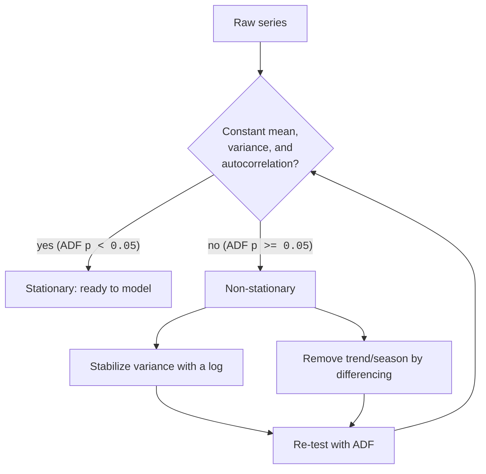

Stationarity is the gatekeeper concept of classical forecasting. Almost
every model on the pages ahead, AR, MA, ARMA, ARIMA, *assumes* it, and if
you skip the check, you'll fit a model to conditions that won't hold and get
a confident, wrong forecast. The good news: the idea is far more intuitive
than its intimidating name.

<Figure
  slug="tsa-stationarity-cutout"
  alt="Two rails on a platform, one where the mound sits at a fixed height throughout and one where it drifts steadily upward"
/>

## What "stationary" actually means

A series is **stationary** when its *statistical properties don't change
over time*. The mean stays put, the variance stays roughly constant, and
the way each value relates to its recent past (the autocorrelation
structure) is the same in 1949 as in 1960. The series might wiggle wildly,
but the **rules generating the wiggles never change**.

<Callout type="tip" title="The 'rules of the game' analogy">
You can only learn the rules of a game by watching it played, *if the rules
stay the same*. A stationary series is a fair game with fixed rules: what you
learn from the first half still applies to the second. A non-stationary
series keeps changing the rules mid-play (the average drifts, the swings
grow), so what you learned from the past no longer describes the future.
Forecasting needs the rules to hold still.
</Callout>

The formal ("weak" / covariance) definition is just that intuition in three
bullets:

1. **Constant mean**, no trend; the series hovers around a fixed level.
2. **Constant variance**, the size of the fluctuations doesn't grow or
   shrink over time.
3. **Autocovariance depends only on the lag**, how related two points are
   depends only on *how far apart* they are, not on *when* they occur.

## Seeing non-stationarity

The two most common violations are easy to *see*: a drifting mean (a trend)
and a changing variance (a widening or narrowing band). Let's put a
stationary series next to both.

<CodeBlock
  adapter="python"
  files={[
    {
      filename: "main.py",
      initCode: `import numpy as np
import pandas as pd
import matplotlib.pyplot as plt

rng = np.random.default_rng(0)
n = 200
idx = pd.date_range("2014-01-01", periods=n, freq="D")

stationary    = pd.Series(rng.normal(0, 1, n), index=idx)                       # fixed rules
moving_mean   = pd.Series(rng.normal(0, 1, n) + np.linspace(0, 8, n), index=idx) # mean drifts up
moving_var    = pd.Series(rng.normal(0, 1, n) * np.linspace(0.3, 5, n), index=idx) # spread grows`,
      starterCode: `fig, axes = plt.subplots(3, 1, figsize=(10, 8), sharex=True)

for ax, s, title in zip(
    axes,
    [stationary, moving_mean, moving_var],
    [
        "STATIONARY: constant mean and variance",
        "NON-stationary: the MEAN drifts upward (a trend)",
        "NON-stationary: the VARIANCE grows (a widening funnel)",
    ],
):
    s.plot(ax=ax, color="steelblue", lw=0.9)
    s.rolling(20).mean().plot(ax=ax, color="crimson", lw=2)  # rolling mean
    ax.set_title(title)

plt.tight_layout()
plt.show()

print("Top: the red rolling mean stays flat and the band keeps a fixed width.")
print("Middle: the rolling mean climbs -> the mean is time-dependent.")
print("Bottom: the mean is flat but the band fans out -> variance is time-dependent.")
print("Only the top series is stationary.")
`,
    },
  ]}
/>

Watch the red rolling mean. In the stationary panel it stays flat and the
spread is constant. In the second it *climbs*, the mean depends on time. In
the third the mean is flat but the band *fans out*, the variance depends on
time. Either kind of drift breaks stationarity.

<MultipleChoice
  markdown={`Which series is **stationary**?

- A stock's daily *price*, which wanders up over years
  > A price that drifts has a time-dependent mean (and often growing variance), the hallmark of non-stationarity. Prices are the classic non-stationary ("random walk") example.
- Monthly *retail sales* with a rising trend and a December spike every year
  > A rising trend means a drifting mean and the yearly spike means the distribution depends on the season, two violations at once. Clearly non-stationary.
- [o] Daily *changes* in a stock's price, hovering around zero with a roughly constant spread
  > Differencing a price into day-to-day changes typically yields a series with a fixed (near-zero) mean and stable variance, approximately stationary. This is exactly why we model *returns* rather than *prices*.
- A sensor reading whose fluctuations grow larger every year
  > Growing fluctuations are a time-dependent variance, which violates stationarity even if the mean stays flat.

A flat mean *and* a stable variance (like price *changes*) is stationary; trends, seasonal spikes, and growing variance are not.`}
/>

## Why models demand it

Here's the crux. A model like AR learns a *fixed* rule, "this value is
about 0.7 times the previous value, plus a shock." Those coefficients are
**constants**. They can only be true if the relationship they describe stays
the same through time, which is exactly what stationarity guarantees. Point
a fixed-coefficient model at a trending series and it's like fitting one
straight line through data whose true level keeps moving, the coefficients
describe an average of conditions that never actually occur.

<Callout type="info" title="Stationarity is what makes the past usable">
Forecasting is, at bottom, the bet that *the future will behave like the
past*. Stationarity is the precise statement of when that bet is fair: when
the generating rules are constant, the patterns you estimate from history
keep holding. That's why we transform a non-stationary series into a
stationary one *before* modeling, we're manufacturing the very condition
that makes learning from the past valid.
</Callout>

## Testing for it: the Augmented Dickey-Fuller (ADF) test

Eyeballing is essential but subjective. The **Augmented Dickey-Fuller**
test makes it quantitative. It checks for a **unit root**, the signature of
a "random walk" style non-stationarity where the series has no fixed level
to return to. Its hypotheses are where everyone trips:

<Callout type="danger" title="The ADF null hypothesis is BACKWARDS from intuition">
- **H0 (null):** the series **has a unit root** → it is **NON-stationary**.
- **H1 (alternative):** the series is **stationary**.

So a **small p-value (< 0.05) means STATIONARY** (you reject the
non-stationary null), and a **large p-value means you could NOT show
stationarity** (treat it as non-stationary). This is the reverse of the
"small p = something interesting" reflex from most other tests. Read it
slowly: **low p → stationary, high p → non-stationary.**
</Callout>

<CodeBlock
  adapter="python"
  files={[
    {
      filename: "main.py",
      initCode: `import numpy as np
import pandas as pd
import warnings
warnings.filterwarnings("ignore")
from statsmodels.tsa.stattools import adfuller

def adf_report(series, name):
    s = pd.Series(series).dropna()
    stat, p, used_lag, nobs, crit, _ = adfuller(s)
    verdict = "STATIONARY (reject the unit-root null)" if p < 0.05 \
              else "NON-stationary (cannot reject the null)"
    print(f"{name}")
    print(f"   ADF statistic : {stat:8.3f}")
    print(f"   p-value       : {p:8.4f}")
    print(f"   5% crit value : {crit['5%']:8.3f}  (reject H0 when ADF stat < this)")
    print(f"   verdict       : {verdict}\\n")

rng = np.random.default_rng(0)`,
      starterCode: `# A genuinely stationary series: white noise around 0.
white = rng.normal(0, 1, 300)
adf_report(white, "White noise (should be STATIONARY)")

# A random walk: each step adds a shock, so it wanders with no fixed level.
walk = np.cumsum(rng.normal(0, 1, 300))
adf_report(walk, "Random walk (should be NON-stationary)")
`,
    },
  ]}
/>

White noise gives a tiny p-value (reject the null → stationary). The random
walk gives a large p-value (can't reject → non-stationary). The ADF
*statistic* tells the same story: it's very negative for the stationary
series and near zero for the walk. The rule of thumb, **more negative than
the 5% critical value → stationary**, agrees with the p-value.

Now the airline series, which we've been calling non-stationary all along:

<CodeBlock
  adapter="python"
  files={[
    {
      filename: "main.py",
      initCode: `import numpy as np
import pandas as pd
import warnings
warnings.filterwarnings("ignore")
from statsmodels.tsa.stattools import adfuller
_passengers = [
    112,118,132,129,121,135,148,148,136,119,104,118,
    115,126,141,135,125,149,170,170,158,133,114,140,
    145,150,178,163,172,178,199,199,184,162,146,166,
    171,180,193,181,183,218,230,242,209,191,172,194,
    196,196,236,235,229,243,264,272,237,211,180,201,
    204,188,235,227,234,264,302,293,259,229,203,229,
    242,233,267,269,270,315,364,347,312,274,237,278,
    284,277,317,313,318,374,413,405,355,306,271,306,
    315,301,356,348,355,422,465,467,404,347,305,336,
    340,318,362,348,363,435,491,505,404,359,310,337,
    360,342,406,396,420,472,548,559,463,407,362,405,
    417,391,419,461,472,535,622,606,508,461,390,432,
]
idx = pd.date_range("1949-01-01", periods=len(_passengers), freq="MS")
air = pd.Series(_passengers, index=idx, name="passengers")

def adf_report(series, name):
    s = pd.Series(series).dropna()
    stat, p, *_ = adfuller(s)
    verdict = "STATIONARY" if p < 0.05 else "NON-stationary"
    print(f"{name:38s} p-value = {p:7.4f}  ->  {verdict}")`,
      starterCode: `adf_report(air, "Raw airline passengers")
adf_report(np.log(air), "log(passengers)")
adf_report(air.diff(), "First difference of passengers")
adf_report(np.log(air).diff(), "First difference of log(passengers)")

print()
print("Raw series: high p (~0.99) -> non-stationary (the trend dominates).")
print("A log alone doesn't fix it (log tames variance, not the trend).")
print("One difference collapses p from ~0.99 to ~0.05-0.07 -- ALMOST there.")
print("This series is famously BORDERLINE: the seasonal difference (next page)")
print("is what finally tips it firmly below 0.05.")
`,
    },
  ]}
/>

The raw series has a large p-value, non-stationary, as promised. A log
alone barely helps (it fixes *variance*, not the *trend*). A single
**difference** drops the p-value dramatically, from about 0.99 to roughly
0.05–0.07, but this series is a famous *borderline* case that hovers right
at the threshold because strong seasonality remains. It takes a **seasonal**
difference, on the next page, to push it firmly into stationary territory.
That preview is the entire motivation for what comes next.

The real **Keeling Curve** makes a cleaner contrast. Its trend is so
overwhelming that the raw ADF p-value is essentially 1.0, about as
non-stationary as a series gets, yet a single ordinary difference is
enough to collapse it well below 0.05. Run it and watch.

<CodeBlock
  adapter="python"
  datasets={[{ path: "NOAA_mauna_loa_co2_monthly.csv", stageAs: "co2.csv" }]}
  files={[
    {
      filename: "main.py",
      initCode: `import numpy as np
import pandas as pd
import warnings
warnings.filterwarnings("ignore")
from statsmodels.tsa.stattools import adfuller
df = pd.read_csv("co2.csv")
df["date"] = pd.to_datetime(df[["year", "month"]].assign(day=1))
co2 = df.set_index("date")["average"]

def adf_report(series, name):
    p = adfuller(pd.Series(series).dropna())[1]
    verdict = "STATIONARY" if p < 0.05 else "NON-stationary"
    print(f"{name:34s} p-value = {p:7.4f}  ->  {verdict}")`,
      starterCode: `adf_report(co2, "Raw CO2 (the rising trend)")
adf_report(co2.diff(), "First difference of CO2")

print()
print("Raw CO2: p ~ 1.0 -> emphatically non-stationary (the trend dominates).")
print("One ordinary difference is enough to make it stationary here -- the trend")
print("is steady and near-linear, so 'monthly change in CO2' has a stable mean.")
print("(A seasonal difference would also tidy up the leftover 12-month wiggle.)")
`,
    },
  ]}
/>

So the *amount* of differencing a series needs is itself a property of the
series. CO₂'s steady, near-linear climb yields to one difference; the
airline series' growing, strongly seasonal swing needs more work. Same
test, same logic, different answers, because the data is different.

<MultipleChoice
  markdown={`You run \`adfuller\` on a series and get a p-value of **0.78**. What do you conclude?

- The series is stationary, because the p-value is high
  > This reverses the ADF logic. A *high* p-value means you could *not* reject the non-stationary null, it points to non-stationarity, not stationarity.
- [o] You cannot reject the unit-root null, so you treat the series as non-stationary
  > With p = 0.78 there's no evidence against the null (which *is* non-stationarity), so the series is treated as non-stationary and likely needs differencing.
- The test failed and the result is unusable
  > A p-value of 0.78 is a perfectly valid result; it simply indicates non-stationarity. Nothing failed.
- The series is definitely a random walk
  > High p is *consistent* with a random walk but doesn't prove that specific model, only that stationarity couldn't be established. "Non-stationary" is the right, careful conclusion.

In the ADF test the null is non-stationarity, so a high p-value (here 0.78) means you can't reject it, treat the series as non-stationary.`}
/>

<MultipleChoice
  markdown={`A colleague says: "My ADF p-value is 0.001, so I should difference the series to make it stationary." What's wrong?

- Nothing, differencing is always a good idea
  > Differencing a series that's *already* stationary ("over-differencing") adds noise and can hurt your model. It isn't free or always beneficial.
- [o] A p-value of 0.001 already indicates the series IS stationary, so no differencing is needed, differencing it would over-difference
  > Low p means reject the non-stationary null: the series is stationary as-is. Differencing it anyway introduces artifacts (often a strong negative lag-1 autocorrelation) and is a mistake.
- The p-value should be compared to 0.5, not 0.05
  > The conventional threshold is 0.05 (sometimes 0.01), not 0.5. But the deeper error is the direction: p = 0.001 means *stop*, you're already stationary.
- ADF p-values can't be that small
  > They absolutely can, a strongly stationary series produces very small p-values. The issue is interpreting it, not its magnitude.

A tiny ADF p-value means the series is already stationary; differencing it would over-difference and add noise.`}
/>

## The honest caveats

ADF is a tool, not an oracle. Use it *with* your eyes and rolling
statistics, never instead of them:

- It tests for a **unit root** specifically. It is **not** a direct test of
  *seasonality* or *changing variance*. A strongly seasonal series can give
  confusing ADF results, and a series with a stable mean but exploding
  variance can still look "stationary" to ADF.
- **Failing to reject is not proof of non-stationarity.** Like all such
  tests, ADF has limited *power* on short series, it may simply lack the
  evidence to reject, which is weaker than proving the null.
- There are companion tests (KPSS flips the hypotheses; running both and
  cross-checking is common practice). For this course, ADF plus a careful
  look at the plot and rolling mean/variance is enough.

## Practice

<ChallengeCard
  adapter="python"
  title="Run the ADF test and read it correctly"
  instructions={`Two series are loaded: \`noise\` (white noise) and \`walk\` (a random walk). Use \`adfuller\` to fill a dict \`adf\` with:

- \`"noise_p"\`, the ADF p-value for \`noise\` (a float)
- \`"walk_p"\`, the ADF p-value for \`walk\` (a float)
- \`"noise_is_stationary"\`, \`True\` if \`noise_p < 0.05\`, else \`False\`
- \`"walk_is_stationary"\`, \`True\` if \`walk_p < 0.05\`, else \`False\`

Remember the ADF direction: **low p-value means stationary**. The white noise should test stationary; the random walk should not.`}
  files={[
    {
      filename: "main.py",
      initCode: `import numpy as np
from statsmodels.tsa.stattools import adfuller
rng = np.random.default_rng(123)
noise = rng.normal(0, 1, 400)
walk = np.cumsum(rng.normal(0, 1, 400))`,
      starterCode: `adf = {
    "noise_p": None,
    "walk_p": None,
    "noise_is_stationary": None,
    "walk_is_stationary": None,
}
print(adf)
`,
      solutionCode: `noise_p = float(adfuller(noise)[1])
walk_p = float(adfuller(walk)[1])
adf = {
    "noise_p": noise_p,
    "walk_p": walk_p,
    "noise_is_stationary": noise_p < 0.05,
    "walk_is_stationary": walk_p < 0.05,
}
print(adf)
`,
    },
  ]}
  tests={[
    {
      id: "keys",
      name: "all four keys present and typed",
      description: "Two floats, two bools",
      code: `assert set(adf.keys()) == {"noise_p", "walk_p", "noise_is_stationary", "walk_is_stationary"}
assert isinstance(adf["noise_p"], float) and isinstance(adf["walk_p"], float)
assert isinstance(adf["noise_is_stationary"], bool) and isinstance(adf["walk_is_stationary"], bool)`,
    },
    {
      id: "noise_stationary",
      name: "white noise tests stationary",
      description: "Low p-value for noise",
      code: `assert adf["noise_p"] < 0.05 and adf["noise_is_stationary"] is True`,
    },
    {
      id: "walk_nonstationary",
      name: "random walk tests non-stationary",
      description: "High p-value for the walk",
      code: `assert adf["walk_p"] > 0.05 and adf["walk_is_stationary"] is False`,
    },
    {
      id: "direction",
      name: "flags follow the low-p-means-stationary rule",
      description: "Booleans match their p-values",
      code: `assert adf["noise_is_stationary"] == (adf["noise_p"] < 0.05)
assert adf["walk_is_stationary"] == (adf["walk_p"] < 0.05)`,
    },
  ]}
/>

<ChallengeCard
  adapter="python"
  title="Confirm the transform pipeline reaches stationarity"
  instructions={`The airline \`air\` series is non-stationary. Build the fully transformed series and show it becomes stationary. Compute:

- \`stationary\` = \`np.log(air).diff().diff(12)\`, a log to tame the growing variance, a first difference for the trend, and a seasonal difference at lag 12 for the yearly cycle.
- \`p_raw\` = the ADF p-value of the raw \`air\` (a float).
- \`p_stationary\` = the ADF p-value of \`stationary\` after dropping NaNs (a float).

The raw series should be non-stationary (\`p_raw\` > 0.05) while the transformed series should be stationary (\`p_stationary\` < 0.05). (Note: a *single* difference of this series is famously borderline on the ADF test, the seasonal difference is what tips it firmly into stationarity.)`}
  files={[
    {
      filename: "main.py",
      initCode: `import numpy as np
import pandas as pd
import warnings
warnings.filterwarnings("ignore")
from statsmodels.tsa.stattools import adfuller
_passengers = [
    112,118,132,129,121,135,148,148,136,119,104,118,
    115,126,141,135,125,149,170,170,158,133,114,140,
    145,150,178,163,172,178,199,199,184,162,146,166,
    171,180,193,181,183,218,230,242,209,191,172,194,
    196,196,236,235,229,243,264,272,237,211,180,201,
    204,188,235,227,234,264,302,293,259,229,203,229,
    242,233,267,269,270,315,364,347,312,274,237,278,
    284,277,317,313,318,374,413,405,355,306,271,306,
    315,301,356,348,355,422,465,467,404,347,305,336,
    340,318,362,348,363,435,491,505,404,359,310,337,
    360,342,406,396,420,472,548,559,463,407,362,405,
    417,391,419,461,472,535,622,606,508,461,390,432,
]
idx = pd.date_range("1949-01-01", periods=len(_passengers), freq="MS")
air = pd.Series(_passengers, index=idx, name="passengers")`,
      starterCode: `stationary = None
p_raw = None
p_stationary = None
print("p_raw:", p_raw, " p_stationary:", p_stationary)
`,
      solutionCode: `stationary = np.log(air).diff().diff(12)
p_raw = float(adfuller(air.dropna())[1])
p_stationary = float(adfuller(stationary.dropna())[1])
print("p_raw:", round(p_raw, 4), " p_stationary:", round(p_stationary, 4))
`,
    },
  ]}
  tests={[
    {
      id: "set",
      name: "p_raw and p_stationary are floats",
      description: "Both ADF p-values computed",
      code: `assert isinstance(p_raw, float) and isinstance(p_stationary, float)`,
    },
    {
      id: "raw_nonstationary",
      name: "raw air is non-stationary",
      description: "High ADF p-value before transforming",
      code: `assert p_raw > 0.05, f"Raw series should be non-stationary, got p={p_raw}"`,
    },
    {
      id: "transformed_stationary",
      name: "transformed series is stationary",
      description: "log + diff + seasonal diff passes ADF",
      code: `assert p_stationary < 0.05, f"Transformed series should be stationary, got p={p_stationary}"`,
    },
    {
      id: "improved",
      name: "transforming lowered the p-value",
      description: "The pipeline moved toward stationarity",
      code: `assert p_stationary < p_raw`,
    },
  ]}
/>

## Check your understanding

<MultipleChoice
  markdown={`In plain terms, a series is **stationary** when:

- Its values never change
  > Stationary series fluctuate freely, often a lot. What stays fixed is the *statistical behavior* (mean, variance, autocorrelation), not the individual values.
- It is always increasing at a steady rate
  > A steady increase is a *trend*, a drifting mean, which is the opposite of stationary.
- [o] Its statistical properties (mean, variance, autocorrelation) stay constant over time, the rules generating it don't change
  > Constant mean and variance plus a lag-only autocorrelation structure is exactly stationarity: the data-generating "rules" hold still, so the past is representative of the future.
- It has no random component at all
  > Stationary series are typically *full* of randomness (white noise is the purest example). Stationarity constrains how that randomness behaves over time, not whether it exists.

Stationarity is about constant statistical behavior over time, not constant values or the absence of randomness.`}
/>

<MultipleChoice
  markdown={`Why do classical models like AR and ARIMA *require* (approximate) stationarity?

- Because they run faster on stationary data
  > Speed isn't the reason. The requirement is about validity: the model's assumptions, not its runtime.
- [o] They estimate fixed coefficients describing how a value relates to its past; those constants are only meaningful if that relationship doesn't drift over time
  > A fixed rule ("each value is ~0.7 of the previous plus a shock") can only be correct if the rule holds throughout. A trending mean or growing variance makes the "constant" relationship a moving target the coefficients can't capture.
- Because stationary data has no noise to model
  > Stationary data is typically *mostly* noise; the models exist precisely to describe that noise's structure. Stationarity is about constancy, not the absence of noise.
- Because non-stationary data cannot be stored in pandas
  > pandas stores any series fine. The constraint is statistical, fixed-coefficient models need stable generating rules, not a storage limitation.

Fixed-coefficient models assume a stable relationship through time, which is exactly what stationarity provides.`}
/>

<MultipleChoice
  markdown={`Which is the correct ADF decision rule at the 5% level?

- p-value > 0.05 -> stationary; p-value < 0.05 -> non-stationary
  > This is backwards. The ADF *null* is non-stationarity, so a *small* p rejects it (stationary) and a *large* p fails to reject it (non-stationary).
- [o] p-value < 0.05 -> reject the unit-root null -> stationary; p-value >= 0.05 -> fail to reject -> non-stationary
  > Because the null is "has a unit root (non-stationary)," a small p-value is evidence *for* stationarity, and a large one leaves you treating the series as non-stationary.
- Any p-value means the series is stationary
  > The p-value's *magnitude* is the whole point; it discriminates between the two conclusions rather than always pointing one way.
- The ADF test ignores p-values and uses only the mean
  > ADF produces a test statistic and p-value (and critical values). It does not decide based on the raw mean.

Low p rejects the non-stationary null (stationary); high p fails to reject it (non-stationary).`}
/>

<MultipleChoice
  markdown={`You fail to reject the ADF null (p = 0.30) on a short series of 24 points. Which statement is most accurate?

- This proves the series is non-stationary
  > "Fail to reject" is not "prove." On a short series the test may simply lack the *power* to detect stationarity; absence of evidence isn't proof of the null.
- [o] You couldn't establish stationarity; treat it as non-stationary, but note that on only 24 points the test has low power, so confirm with plots and rolling statistics
  > A high p-value means no evidence against non-stationarity, so you act as if non-stationary, while remembering that short series make the test weak, so corroborating with eyes and rolling stats is essential.
- The series must be differenced exactly twice
  > Nothing in a single p-value prescribes a specific number of differences. You'd test after each difference, and often one (or zero) is right.
- The test is invalid below 30 points
  > There's no hard cutoff that invalidates ADF; rather, *power* degrades on short series, making conclusions less reliable, a reason for caution, not invalidity.

Failing to reject means stationarity wasn't established (act as non-stationary), but low power on short series demands corroboration.`}
/>

<Callout type="success" title="Key takeaways">
- A series is **stationary** when its mean, variance, and autocorrelation
  structure are **constant over time**, the generating rules hold still.
- Models like **ARIMA require it** because they fit *fixed coefficients* that
  only make sense when the relationship they describe doesn't drift.
- Common violations: a **trend** (drifting mean) and **changing variance**
  (widening band). See them with a plot plus a rolling mean/std.
- The **ADF test**'s null is **non-stationarity** (a unit root). **Low p
  (< 0.05) → stationary; high p → non-stationary.** This is the reverse of
  the usual p-value reflex.
- ADF tests a *unit root* specifically, pair it with your eyes; "fail to
  reject" is not proof, especially on short series.
- The cures are a **log** (for variance) and **differencing** (for trend and
  seasonality), next.
</Callout>

The ADF test kept pointing at the same fix: differencing. Let's make that
precise, what differencing does, why subtracting consecutive values
annihilates a trend, and how to avoid the trap of doing it one time too many.
