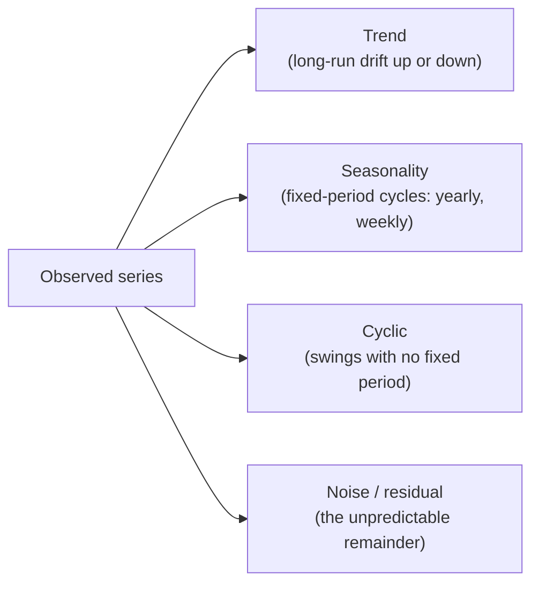

Before a single forecast, before `resample` or `ARIMA`, you need one idea
in your bones: **a time series is not an ordinary table that happens to
have a date column.** It is a fundamentally different object, and almost
every mistake beginners make comes from forgetting that. This page is the
"why" the rest of the course rests on.

<Figure
  slug="tsa-what-makes-unique-cutout"
  alt="An ordered row of blocks on a rail with each block linked to the one before it, a shuffled loose pile of the same blocks beside it"
/>

## What actually is a time series?

A **time series** is a sequence of observations recorded in time order,
written $y_1, y_2, y_3, \ldots, y_t, \ldots$, where the *order carries meaning*.

The subscript is not a row number you could reshuffle, it is a
**timestamp**. $y_t$ is "the value *at time* $t$," and it sits between
$y_{t-1}$ (its past) and $y_{t+1}$ (its future). Examples are everywhere:

- Monthly airline passengers, electricity demand every hour, daily website
  visits, a store's weekly sales, a patient's heart rate per second.

Contrast that with **cross-sectional data**: the heights of 500 people, or
one row per customer with their lifetime spend. There, each row is a
separate, self-contained unit. Row 7 and row 200 have no relationship just
because one is printed above the other. You can sort the table any way you
like and *nothing is lost*.

<Callout type="info" title="The one-line definition">
Cross-sectional data is a **set** of independent observations. A time
series is a **sequence** of dependent ones. The difference between a set
and a sequence is the whole game.
</Callout>

## The defining property: temporal dependence

Here is what makes a time series special, stated plainly: **the value now
is related to the values just before it.** Hot days cluster near hot days.
A busy traffic week tends to follow a busy traffic week. Today's stock
price is yesterday's price plus a nudge. This "a value remembers its
recent past" property is called **temporal dependence**, and when we
measure it as a correlation, we call it **autocorrelation**, a series
correlated *with itself* at an earlier time.

Let's see it directly. We plot each month's airline-passenger count
against the *previous* month's count. If there were no temporal
dependence, this would be a shapeless cloud. Watch what actually happens.

<CodeBlock
  adapter="python"
  files={[
    {
      filename: "main.py",
      initCode: `import pandas as pd
import numpy as np

# Monthly international airline passengers (thousands), 1949-1960.
_passengers = [
    112,118,132,129,121,135,148,148,136,119,104,118,
    115,126,141,135,125,149,170,170,158,133,114,140,
    145,150,178,163,172,178,199,199,184,162,146,166,
    171,180,193,181,183,218,230,242,209,191,172,194,
    196,196,236,235,229,243,264,272,237,211,180,201,
    204,188,235,227,234,264,302,293,259,229,203,229,
    242,233,267,269,270,315,364,347,312,274,237,278,
    284,277,317,313,318,374,413,405,355,306,271,306,
    315,301,356,348,355,422,465,467,404,347,305,336,
    340,318,362,348,363,435,491,505,404,359,310,337,
    360,342,406,396,420,472,548,559,463,407,362,405,
    417,391,419,461,472,535,622,606,508,461,390,432,
]
idx = pd.date_range("1949-01-01", periods=len(_passengers), freq="MS")
air = pd.Series(_passengers, index=idx, name="passengers")`,
      starterCode: `import matplotlib.pyplot as plt

fig, (ax1, ax2) = plt.subplots(1, 2, figsize=(10, 4))

# Left: this month vs last month. Tight diagonal = strong dependence.
ax1.scatter(air.shift(1), air, s=18)
ax1.set_xlabel("passengers last month  (y at t-1)")
ax1.set_ylabel("passengers this month  (y at t)")
ax1.set_title("Time order INTACT")

# Right: shuffle first, breaking the time order, then do the same plot.
shuffled = air.sample(frac=1.0, random_state=1).reset_index(drop=True)
ax2.scatter(shuffled.shift(1), shuffled, s=18, color="crimson")
ax2.set_xlabel("'previous' value (meaningless now)")
ax2.set_ylabel("value")
ax2.set_title("After SHUFFLING")

plt.tight_layout()
plt.show()

print("Left: a tight upward band, each month is close to the one before it.")
print("Right: a formless cloud, shuffling deleted the relationship entirely.")
`,
    },
  ]}
/>

The left panel is a tight diagonal band: this month is almost always close
to last month. The right panel, *the exact same numbers*, just shuffled,
is a structureless blob. **The information did not live in the values. It
lived in their order.** That single picture is the reason this course
exists.

<Callout type="tip" title="Autocorrelation in one sentence">
Autocorrelation is just *correlation a series has with a time-shifted copy
of itself*. High lag-1 autocorrelation means "this value is a good guess
for the next value", which is exactly what makes forecasting possible at
all. A series with **zero** autocorrelation at every lag is pure noise:
unpredictable by definition.
</Callout>

## Why this breaks your usual statistical instincts

Most introductory statistics and machine learning quietly assume your
observations are **i.i.d.**, *independent and identically distributed*.
"Independent" means knowing one observation tells you nothing about
another. "Identically distributed" means every observation is drawn from
the same fixed distribution (same mean, same variance, forever).

<Figure
  slug="tsa-what-makes-time-series-unique-inline-cutout"
  alt="A row of chips being shuffled on the left and losing its meaning, and kept in order on the right where it forms a shape"
/>

A time series violates **both** halves, on purpose:

| | Cross-sectional data (i.i.d.) | Time series (dependent, evolving) |
| --- | --- | --- |
| The rows | independent islands: `obs 1`, `obs 2`, `obs 3`, … | a chain: `y` at `t-1` → `y` at `t` → `y` at `t+1` → … |
| Each value | stands alone | leans on the one before it |
| Distribution | the same for every row | mean and variance drift over time |
| Order | does not matter, shuffle freely | is everything, shuffling destroys it |

- **Not independent:** `y_t` depends on `y_{t-1}`. That's temporal
  dependence, the thing we just plotted.
- **Not identically distributed:** the airline series' average in 1949 is
  nowhere near its average in 1960 (the **trend**), and its month-to-month
  swings get *bigger* over time (changing **variance**). The distribution
  is a moving target.

So the comfortable tools that assume i.i.d. data, a plain mean as "the"
value, a standard error of $s/\sqrt{n}$, a random train/test split, are not
just less accurate on a time series. They are **answering the wrong
question**, and they often fail silently, handing you a confident number
that is wrong.

<MultipleChoice
  markdown={`A dataset has one row per hospital patient: age, blood pressure, and whether they were readmitted. A colleague calls it "time series data" because it was collected over several months. Are they right?

- Yes, any data collected over time is time series data
  > The *collection* spanning time doesn't make it a time series. What matters is whether the **order of the rows carries meaning** and whether each value depends on the previous one. Here the rows are independent patients.
- [o] No, this is cross-sectional data; each patient is an independent unit and reordering the rows loses nothing
  > Each row is a self-contained observation with no dependence on the row above it. You could sort by age or shuffle randomly and lose no information, the hallmark of cross-sectional, not time series, data.
- Yes, because there is a time element in "several months"
  > A vague time span in the background isn't the same as an ordered index where $y_t$ depends on $y_{t-1}$. These patients are not a sequence; they're a set.
- It depends on how many patients there are
  > Sample size has nothing to do with it. A million independent patients is still cross-sectional; twelve ordered monthly totals is a time series.

A time series requires a meaningful order and dependence between consecutive values, not merely that data was gathered across some time span.`}
/>

## The four moving parts of a time series

When you stare at a real series, you are usually looking at several effects
layered on top of each other. We'll spend whole pages on these later; for
now, just learn to *see* them:

- **Trend**, the slow march up or down. Airline travel grew year over
  year.
- **Seasonality**, a cycle with a *fixed, known period*. Passengers spike
  every summer; retail spikes every December; electricity demand spikes
  every evening. The period is calendar-locked.
- **Cyclic**, longer swings with *no fixed period*, like economic booms
  and recessions. Easy to confuse with seasonality, but a recession doesn't
  arrive on a schedule the way summer does.
- **Noise**, whatever is left after the structured parts: genuinely
  unpredictable wiggle.

<Figure
  slug="tsa-what-makes-time-series-unique-actually-time-series-inline-cutout"
  alt="A row of chips fixed to evenly spaced sleepers, one chip lifted showing its sleeper cannot be moved"
/>

<Callout type="warn" title="Seasonal is not the same as cyclic">
Beginners use "cyclical" for both. Keep them apart: **seasonal** has a
*fixed calendar period* (every 12 months, every 7 days) and is highly
predictable; **cyclic** has a *variable period* (booms and busts) and is
much harder to forecast. When someone says "sales are cyclical," ask "on
what fixed period?" If they can't name one, it's cyclic, not seasonal.
</Callout>

Let's look at the hero series and name its parts by eye before we ever
compute anything.

<CodeBlock
  adapter="python"
  files={[
    {
      filename: "main.py",
      initCode: `import pandas as pd
import numpy as np
_passengers = [
    112,118,132,129,121,135,148,148,136,119,104,118,
    115,126,141,135,125,149,170,170,158,133,114,140,
    145,150,178,163,172,178,199,199,184,162,146,166,
    171,180,193,181,183,218,230,242,209,191,172,194,
    196,196,236,235,229,243,264,272,237,211,180,201,
    204,188,235,227,234,264,302,293,259,229,203,229,
    242,233,267,269,270,315,364,347,312,274,237,278,
    284,277,317,313,318,374,413,405,355,306,271,306,
    315,301,356,348,355,422,465,467,404,347,305,336,
    340,318,362,348,363,435,491,505,404,359,310,337,
    360,342,406,396,420,472,548,559,463,407,362,405,
    417,391,419,461,472,535,622,606,508,461,390,432,
]
idx = pd.date_range("1949-01-01", periods=len(_passengers), freq="MS")
air = pd.Series(_passengers, index=idx, name="passengers")`,
      starterCode: `import matplotlib.pyplot as plt

fig, ax = plt.subplots(figsize=(10, 4))
air.plot(ax=ax)
ax.set_title("Monthly airline passengers, 1949-1960")
ax.set_ylabel("passengers (thousands)")
ax.set_xlabel("")
plt.tight_layout()
plt.show()

print("Look for three things with your eyes:")
print(" 1) TREND     - the whole series drifts upward year over year.")
print(" 2) SEASONALITY - a repeating within-year hump (summer peak, winter dip).")
print(" 3) GROWING VARIANCE - the summer-to-winter swing gets WIDER over time.")
`,
    },
  ]}
/>

You can read all three structures straight off the chart: a rising trend,
a yearly hump that repeats 12 times, and seasonal swings that get *wider*
as the level rises. That last detail, variance growing with the level,
is a clue we'll cash in later when we choose between additive and
multiplicative models and when we reach for a log transform.

## Why shuffling is sabotage (and where it sneaks in)

You would never *manually* shuffle a time series, but a random train/test
split does exactly that, and it's the default in almost every ML tutorial.
Here's the trap, made concrete.

When you randomly assign rows to "train" and "test", a test point from
**March** ends up surrounded in the training set by **February and April**.
Your model effectively gets to peek at the future on both sides of every
test point. It will look brilliant in evaluation and then fall on its face
in production, where the future is genuinely unavailable.

| Jan | Feb | Mar | Apr | May | Jun |
| --- | --- | --- | --- | --- | --- |
| train | test | train | test | train | test |

*Random split (WRONG):* train and test are interleaved in time. To
"predict" February the model is allowed to learn from January **and**
March, it has seen the future. This is **data leakage**.

| Jan | Feb | Mar | Apr | May | Jun |
| --- | --- | --- | --- | --- | --- |
| train | train | train | test | test | test |

*Chronological split (RIGHT):* train is the earlier block, test is the
later block. The model only ever learns from the past to predict the
future, exactly the situation it will face in real life.

<Callout type="danger" title="The cardinal rule of time series">
**You may only use the past to predict the future, never the reverse.**
Any procedure that lets information from later time steps influence a
prediction about an earlier one is **data leakage**, and it inflates your
accuracy with a number you can never reproduce in production. A random
train/test split is the most common way this rule gets broken. We devote a
whole page to doing splits correctly, it's that important.
</Callout>

Let's *measure* the leakage, not just assert it. We'll quantify how much
the order matters by destroying it and watching predictability evaporate.

<CodeBlock
  adapter="python"
  files={[
    {
      filename: "main.py",
      initCode: `import pandas as pd
import numpy as np
_passengers = [
    112,118,132,129,121,135,148,148,136,119,104,118,
    115,126,141,135,125,149,170,170,158,133,114,140,
    145,150,178,163,172,178,199,199,184,162,146,166,
    171,180,193,181,183,218,230,242,209,191,172,194,
    196,196,236,235,229,243,264,272,237,211,180,201,
    204,188,235,227,234,264,302,293,259,229,203,229,
    242,233,267,269,270,315,364,347,312,274,237,278,
    284,277,317,313,318,374,413,405,355,306,271,306,
    315,301,356,348,355,422,465,467,404,347,305,336,
    340,318,362,348,363,435,491,505,404,359,310,337,
    360,342,406,396,420,472,548,559,463,407,362,405,
    417,391,419,461,472,535,622,606,508,461,390,432,
]
idx = pd.date_range("1949-01-01", periods=len(_passengers), freq="MS")
air = pd.Series(_passengers, index=idx, name="passengers")`,
      starterCode: `# A laughably simple forecaster: "next month = this month" (a naive forecast).
# How good is it when order is intact vs destroyed?

def naive_mae(series):
    s = series.reset_index(drop=True)
    pred = s.shift(1)  # predict each value with the previous one
    err = (s - pred).dropna()
    return float(np.mean(np.abs(err)))

ordered_mae = naive_mae(air)
shuffled_mae = naive_mae(air.sample(frac=1.0, random_state=3))

print(f"Naive forecast error (time order intact): {ordered_mae:6.1f}")
print(f"Naive forecast error (shuffled):          {shuffled_mae:6.1f}")
print()
print("With order intact, 'tomorrow = today' is a decent forecast.")
print("Shuffled, the same rule is useless, because there's no 'last month' anymore.")
`,
    },
  ]}
/>

With the time order intact, the dead-simple rule "next month equals this
month" has a modest error, there's real structure to exploit. Shuffle the
series and that same rule's error roughly *triples*, because a shuffled
"previous value" is just a random other month. The predictability was a
property of the *sequence*, and the moment you treat the data as an
unordered set, it's gone.

<MultipleChoice
  markdown={`Why is a standard random train/test split (the kind \`train_test_split(shuffle=True)\` performs) considered **catastrophic** for time series forecasting?

- It makes training slower because the data is out of order
  > Speed is irrelevant. The problem is statistical, not computational: a random split corrupts what the evaluation *means*.
- [o] It leaks future information into training: test points end up time-surrounded by training points, so the model "sees" the future and reports accuracy it can never achieve in production
  > A randomly chosen test point from March is flanked in the training set by February and April. The model effectively interpolates between known future and past values, information it will never have when forecasting for real.
- It only works if the series is stationary
  > Stationarity is a separate concern. A random split leaks regardless of stationarity; the leakage comes from interleaving time, not from the series' statistical properties.
- It throws away too much data for testing
  > The proportion of held-out data isn't the issue. Even a 99/1 random split leaks, because the single test point is still surrounded in time by training points.

The defining sin is leakage of future information into the past, which makes evaluation optimistic and irreproducible.`}
/>

## Real-world stakes

This isn't academic. Treating temporal data as an unordered table, or
evaluating it with a leaky split, produces forecasts that *look* great in
a notebook and lose money in production:

- **Energy demand**, a utility under-forecasts the evening peak and has to
  buy emergency power at 10x the price, or over-forecasts and pays to spin
  up plants that idle.
- **Inventory planning**, a retailer that ignores seasonality orders summer
  stock for a winter product, eating storage costs and stock-outs at once.
- **Web traffic / capacity**, a team validates an auto-scaling model with a
  random split, ships it, and gets paged at 3 a.m. when the real Monday
  spike it "predicted perfectly" in testing arrives unannounced.
- **Public health**, case-count forecasts that leak future data overstate
  confidence, and confident-but-wrong forecasts erode trust fast.

In every case the failure is the same: the order of the data was the most
important variable, and it got thrown away, either by shuffling, or by an
evaluation that pretended the future was available.

<Callout type="info" title="Where time series shows up in jobs">
"Demand forecasting," "capacity planning," "anomaly detection on metrics,"
"churn *timing*," "sensor / IoT analytics," and most of "operations
analytics" are time series work wearing different hats. The intuition you
build here transfers directly.
</Callout>

## A first, honest forecast baseline

Here's a habit worth forming on day one: **always start with a trivial
baseline.** Two are classic:

- The **naive forecast**, predict the next value equals the last value
  ($\hat{y}_t = y_{t-1}$). Surprisingly hard to beat on many series.
- The **seasonal naive forecast**, predict the next value equals the value
  one full season ago ($\hat{y}_t = y_{t-m}$, with $m = 12$ for monthly data with
  yearly seasonality). For strongly seasonal series, this is the baseline
  to beat.

If your fancy ARIMA can't beat "same as last year," the ARIMA is not
adding value. Let's compute both baselines so the idea is concrete.

<CodeBlock
  adapter="python"
  files={[
    {
      filename: "main.py",
      initCode: `import pandas as pd
import numpy as np
_passengers = [
    112,118,132,129,121,135,148,148,136,119,104,118,
    115,126,141,135,125,149,170,170,158,133,114,140,
    145,150,178,163,172,178,199,199,184,162,146,166,
    171,180,193,181,183,218,230,242,209,191,172,194,
    196,196,236,235,229,243,264,272,237,211,180,201,
    204,188,235,227,234,264,302,293,259,229,203,229,
    242,233,267,269,270,315,364,347,312,274,237,278,
    284,277,317,313,318,374,413,405,355,306,271,306,
    315,301,356,348,355,422,465,467,404,347,305,336,
    340,318,362,348,363,435,491,505,404,359,310,337,
    360,342,406,396,420,472,548,559,463,407,362,405,
    417,391,419,461,472,535,622,606,508,461,390,432,
]
idx = pd.date_range("1949-01-01", periods=len(_passengers), freq="MS")
air = pd.Series(_passengers, index=idx, name="passengers")`,
      starterCode: `y = air.values.astype(float)

# Naive: predict y[t] using y[t-1].
naive_pred = y[:-1]
naive_true = y[1:]
naive_mae = np.mean(np.abs(naive_true - naive_pred))

# Seasonal naive: predict y[t] using y[t-12] (same month, last year).
m = 12
snaive_pred = y[:-m]
snaive_true = y[m:]
snaive_mae = np.mean(np.abs(snaive_true - snaive_pred))

print(f"Naive (last month)      MAE: {naive_mae:6.2f}")
print(f"Seasonal naive (last yr) MAE: {snaive_mae:6.2f}")
print()
print("Seasonal naive wins big here: this series repeats yearly, so")
print("'same month last year' is a far better guess than 'last month'.")
print("Any real model must beat the BETTER of these baselines to earn its keep.")
`,
    },
  ]}
/>

The seasonal-naive baseline crushes the plain naive one, because the
airline series' strongest structure is its *yearly* cycle. This is your
first lesson in matching the method to the structure, and a benchmark
we'll hold every fancy model to.

## Practice

<ChallengeCard
  adapter="python"
  title="Measure how shuffling destroys autocorrelation"
  instructions={`The airline \`air\` series is loaded. Write a function \`lag1_autocorr(series)\` that returns the **lag-1 autocorrelation**: the Pearson correlation between the series and itself shifted forward by one step (drop the resulting missing value). Use it to fill a dict \`result\` with two keys:

- \`"ordered"\`, lag-1 autocorrelation of \`air\` as-is (a float)
- \`"shuffled"\`, lag-1 autocorrelation of \`air\` after \`air.sample(frac=1.0, random_state=0)\` (a float)

The ordered value should be high (above 0.8); the shuffled value should be small in magnitude (below 0.4). This is the whole thesis of the page, measured.`}
  files={[
    {
      filename: "main.py",
      initCode: `import pandas as pd
import numpy as np
_passengers = [
    112,118,132,129,121,135,148,148,136,119,104,118,
    115,126,141,135,125,149,170,170,158,133,114,140,
    145,150,178,163,172,178,199,199,184,162,146,166,
    171,180,193,181,183,218,230,242,209,191,172,194,
    196,196,236,235,229,243,264,272,237,211,180,201,
    204,188,235,227,234,264,302,293,259,229,203,229,
    242,233,267,269,270,315,364,347,312,274,237,278,
    284,277,317,313,318,374,413,405,355,306,271,306,
    315,301,356,348,355,422,465,467,404,347,305,336,
    340,318,362,348,363,435,491,505,404,359,310,337,
    360,342,406,396,420,472,548,559,463,407,362,405,
    417,391,419,461,472,535,622,606,508,461,390,432,
]
idx = pd.date_range("1949-01-01", periods=len(_passengers), freq="MS")
air = pd.Series(_passengers, index=idx, name="passengers")`,
      starterCode: `def lag1_autocorr(series):
    # TODO: correlate the series with itself shifted by 1 step.
    return None

result = {
    "ordered": None,
    "shuffled": None,
}
print(result)
`,
      solutionCode: `def lag1_autocorr(series):
    s = series.reset_index(drop=True)
    return float(s.corr(s.shift(1)))

result = {
    "ordered": lag1_autocorr(air),
    "shuffled": lag1_autocorr(air.sample(frac=1.0, random_state=0)),
}
print(result)
`,
    },
  ]}
  tests={[
    {
      id: "keys",
      name: "result has both keys as floats",
      description: "ordered and shuffled present and numeric",
      code: `assert set(result.keys()) == {"ordered", "shuffled"}
assert all(isinstance(result[k], float) for k in result)`,
    },
    {
      id: "ordered_high",
      name: "ordered autocorrelation is high",
      description: "Time order intact means strong lag-1 dependence",
      code: `assert result["ordered"] > 0.8, f"Expected > 0.8, got {result['ordered']}"`,
    },
    {
      id: "shuffled_low",
      name: "shuffled autocorrelation is small",
      description: "Shuffling destroys the dependence",
      code: `assert abs(result["shuffled"]) < 0.4, f"Expected |corr| < 0.4, got {result['shuffled']}"`,
    },
    {
      id: "ordered_beats_shuffled",
      name: "order matters",
      description: "Ordered dependence far exceeds shuffled",
      code: `assert result["ordered"] - abs(result["shuffled"]) > 0.4`,
    },
  ]}
/>

<ChallengeCard
  adapter="python"
  title="Make a leakage-free chronological split"
  instructions={`Given the \`air\` series (144 monthly points), build a chronological train/test split that holds out the **last 24 months** for testing. Produce:

- \`train\`, a Series of the first 120 observations
- \`test\`, a Series of the final 24 observations

The split must be **leakage-free**: every timestamp in \`train\` must come strictly *before* every timestamp in \`test\`. Do **not** shuffle.`}
  files={[
    {
      filename: "main.py",
      initCode: `import pandas as pd
import numpy as np
_passengers = [
    112,118,132,129,121,135,148,148,136,119,104,118,
    115,126,141,135,125,149,170,170,158,133,114,140,
    145,150,178,163,172,178,199,199,184,162,146,166,
    171,180,193,181,183,218,230,242,209,191,172,194,
    196,196,236,235,229,243,264,272,237,211,180,201,
    204,188,235,227,234,264,302,293,259,229,203,229,
    242,233,267,269,270,315,364,347,312,274,237,278,
    284,277,317,313,318,374,413,405,355,306,271,306,
    315,301,356,348,355,422,465,467,404,347,305,336,
    340,318,362,348,363,435,491,505,404,359,310,337,
    360,342,406,396,420,472,548,559,463,407,362,405,
    417,391,419,461,472,535,622,606,508,461,390,432,
]
idx = pd.date_range("1949-01-01", periods=len(_passengers), freq="MS")
air = pd.Series(_passengers, index=idx, name="passengers")`,
      starterCode: `h = 24  # forecast horizon / test length
train = None
test = None
print("train:", None if train is None else train.shape)
print("test :", None if test is None else test.shape)
`,
      solutionCode: `h = 24
train = air.iloc[:-h]
test = air.iloc[-h:]
print(
    "train:",
    train.shape,
    "->",
    train.index.min().date(),
    "to",
    train.index.max().date(),
)
print(
    "test :", test.shape, "->", test.index.min().date(), "to", test.index.max().date()
)
`,
    },
  ]}
  tests={[
    {
      id: "sizes",
      name: "train has 120, test has 24",
      description: "Correct split sizes",
      code: `assert len(train) == 120 and len(test) == 24`,
    },
    {
      id: "no_overlap",
      name: "no shared timestamps",
      description: "Train and test indices are disjoint",
      code: `assert len(train.index.intersection(test.index)) == 0`,
    },
    {
      id: "chronological",
      name: "train is entirely before test (leakage-free)",
      description: "Every train date precedes every test date",
      code: `assert train.index.max() < test.index.min(), "Leakage: train overlaps the future"`,
    },
    {
      id: "covers_all",
      name: "together they cover the series",
      description: "No rows dropped",
      code: `assert len(train) + len(test) == len(air)`,
    },
  ]}
/>

## Check your understanding

<MultipleChoice
  markdown={`Which property is the *defining* feature that separates a time series from a cross-sectional dataset?

- [o] Its observations are ordered in time and each value is statistically dependent on nearby values
  > Temporal ordering *plus* dependence between neighboring values is exactly what makes the sequence a time series and what lets us forecast at all.
- It contains a date column somewhere
  > Merely having a date *column* doesn't make data a time series, the patient table earlier had a collection date but was cross-sectional. What matters is dependence and meaningful order.
- It has more rows
  > Size is irrelevant. A three-row monthly series is a time series; a million-row customer table is not.
- Its values are always increasing
  > Time series can trend up, down, oscillate, or wander. Monotonic growth is neither required nor common.

The essence is an ordered sequence with dependence between neighbors, not size, not the mere presence of a date, not monotonicity.`}
/>

<MultipleChoice
  markdown={`A series of daily temperatures has high lag-1 autocorrelation. What does that practically mean?

- The temperatures have no trend
  > Autocorrelation and trend are different things; a series can have strong lag-1 autocorrelation with or without a trend.
- The data must be stationary
  > High autocorrelation says nothing on its own about stationarity. Strongly trending (non-stationary) series often have *very* high lag-1 autocorrelation.
- Tomorrow's temperature is completely random
  > High autocorrelation means the opposite of random: today is a strong clue about tomorrow.
- [o] Today's temperature is a strong predictor of tomorrow's, consecutive values tend to be close
  > Lag-1 autocorrelation measures how tightly each value tracks the one before it. High values mean "tomorrow looks a lot like today," which is what makes a naive forecast competitive.

Lag-1 autocorrelation quantifies how much each value resembles its immediate predecessor.`}
/>

<MultipleChoice
  markdown={`You build a model, evaluate it with a random 80/20 split, and get a stunning 2% error. In production it gets 15% error. What is the most likely cause?

- You used too few features
  > More features wouldn't close a gap that exists *because* the evaluation was leaky. The fix is an honest chronological split, not a richer model.
- The model is too simple
  > A too-simple model would look bad in *both* testing and production. The tell here is that testing looked great and only production was bad.
- [o] Data leakage from the random split: in testing the model saw future-adjacent points, an advantage it loses in production
  > The random split let test points be time-surrounded by training points, so evaluation measured interpolation, not true forecasting. Production has no such future context, so the honest error is far higher.
- The production data is simply harder
  > A 7x degradation that appears only in production is the classic signature of leakage in evaluation, not of the world suddenly getting harder.

A great-in-testing, terrible-in-production gap on temporal data almost always traces back to a leaky (random) split.`}
/>

<MultipleChoice
  markdown={`A retailer's sales rise every November-December without fail, peaking the same weeks each year. The economy also pushes sales up and down over multi-year booms and busts that don't follow a calendar. Which labels fit?

- The holiday spike is cyclic; the booms are seasonal
  > This reverses the definitions. Fixed calendar period = seasonal; variable period = cyclic.
- Both effects are "trend"
  > Trend is the slow one-directional drift. Neither a repeating December spike nor up-and-down booms is a single-direction trend.
- Both effects are "seasonal"
  > The calendar-locked holiday spike is seasonal, but multi-year booms with no fixed period are *cyclic*, not seasonal. Lumping them together hides that one is far more predictable than the other.
- [o] The November-December spike is seasonal (fixed calendar period); the multi-year booms and busts are cyclic (no fixed period)
  > Seasonality has a fixed, known period locked to the calendar; cyclic swings have a variable period and are much harder to forecast. Naming them correctly tells you which is predictable.

Fixed, calendar-locked period means seasonal; variable-length swings mean cyclic, and the distinction predicts how forecastable each is.`}
/>

<MultipleChoice
  markdown={`Why do we insist on computing a **seasonal naive** baseline (this month = same month last year) before fitting any sophisticated model?

- Because seasonal naive is always the most accurate forecast
  > It frequently isn't, good models beat it. Its job is to be a cheap, honest yardstick, not to win.
- Because it makes the data stationary
  > Computing a baseline forecast does nothing to the series' stationarity. The baseline is an evaluation reference, not a transformation.
- [o] Because a model that can't beat a trivial baseline isn't adding value, and the baseline tells us how much real skill any model contributes
  > Baselines convert "the error is 30" into "the error is 30, versus 35 for doing nothing", that comparison is what makes an accuracy number meaningful. If ARIMA can't beat "same as last year," it's not worth its complexity.
- Because sophisticated models are always worse
  > Sophisticated models are often better, but not always, and not for free. The baseline is how you *find out* whether the complexity earned anything.

Baselines turn raw error numbers into meaningful comparisons and guard against shipping complexity that adds nothing.`}
/>

<Callout type="success" title="Key takeaways">
- A **time series** is an *ordered sequence of dependent observations*,
  not a table with a date column. The **order is information**.
- The defining property is **temporal dependence** (measured as
  **autocorrelation**): each value leans on its recent past.
- Time series violate the **i.i.d.** assumption on both counts, values are
  *dependent*, and the distribution *drifts* (trend, changing variance).
- **Shuffling** destroys the signal; a **random train/test split** is
  shuffling in disguise and causes **data leakage**, great test scores,
  terrible production.
- The **cardinal rule**: only ever use the **past** to predict the
  **future**.
- A series layers **trend**, **seasonality** (fixed period), **cyclic**
  swings (variable period), and **noise**, learn to see them.
- Always start with a **naive** and **seasonal-naive baseline**; real
  models must beat them to justify their complexity.
</Callout>

Now that you respect the time dimension, let's pick up the tool that makes
all of this practical in Python: pandas's `DatetimeIndex`, the spine that
turns an ordinary `Series` into a time-aware one.
