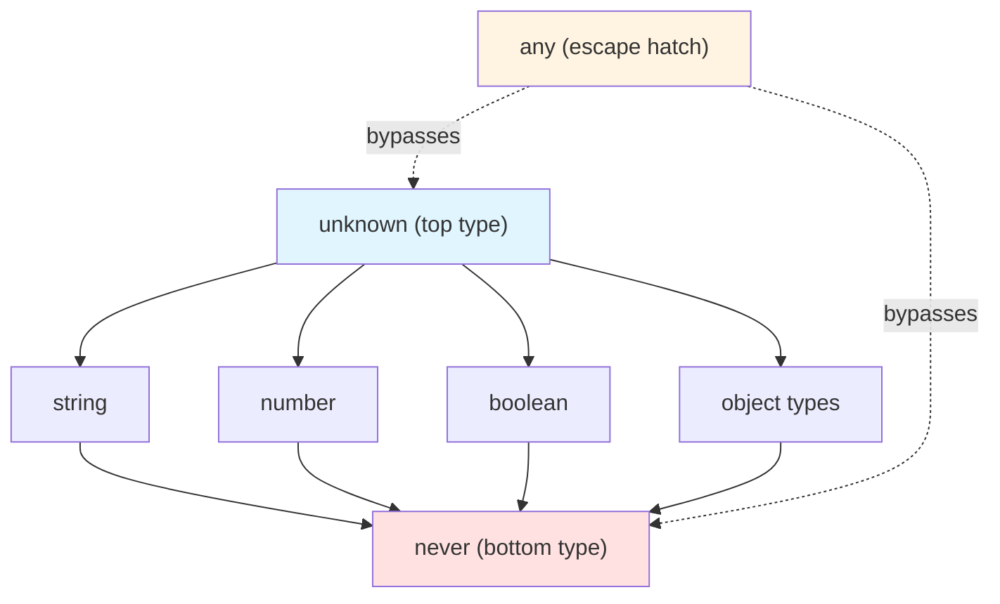

TypeScript's type system has three "special" types that sit at the edges
of the type lattice: **`any`**, **`unknown`**, and **`never`**. They're
often misunderstood, but they're essential for expressing concepts like
"opt-out of type checking" (`any`), "accept anything but force narrowing"
(`unknown`), and "this code is unreachable" (`never`). A fourth type,
**`void`**, is also worth understanding in relation to these three.

This chapter answers: **What is `any` and when should you (not) use it?**
**How is `unknown` different?** **What does `never` represent?** **How do
these types relate to each other?**

<svg
  viewBox="0 0 640 230"
  role="img"
  aria-label="Three stalls side by side: a wild storm of dots that leaks across its own boundary, a locked blue crate with a keyhole while a visitor hovers above, and a spot where only a dotted outline with a faint afterglow remains — any ignores the rules, unknown demands a check first, never holds nothing at all"
  style={{ display: "block", width: "100%", maxWidth: "640px", height: "auto", margin: "2.5rem auto" }}
>
  <g fill="currentColor" opacity="0.2">
    <circle cx="235" cy="36" r="2" />
    <circle cx="235" cy="62" r="2" />
    <circle cx="235" cy="88" r="2" />
    <circle cx="235" cy="114" r="2" />
    <circle cx="235" cy="140" r="2" />
    <circle cx="235" cy="166" r="2" />
    <circle cx="235" cy="192" r="2" />
    <circle cx="425" cy="36" r="2" />
    <circle cx="425" cy="62" r="2" />
    <circle cx="425" cy="88" r="2" />
    <circle cx="425" cy="114" r="2" />
    <circle cx="425" cy="140" r="2" />
    <circle cx="425" cy="166" r="2" />
    <circle cx="425" cy="192" r="2" />
  </g>
  <g style={{ color: "var(--ds-yellow-500)" }} fill="currentColor">
    <path d="M70 130 C80 86 140 70 170 96 C196 118 180 160 140 162 C112 164 96 146 104 126" fillOpacity="0.14" />
    <circle cx="100" cy="80" r="5" />
    <circle cx="156" cy="64" r="4" fillOpacity="0.8" />
    <circle cx="186" cy="110" r="6" fillOpacity="0.9" />
    <circle cx="80" cy="140" r="4" fillOpacity="0.7" />
    <circle cx="140" cy="172" r="5" fillOpacity="0.8" />
    <circle cx="196" cy="160" r="3.5" fillOpacity="0.6" />
    <circle cx="60" cy="100" r="3" fillOpacity="0.5" />
    <circle cx="252" cy="74" r="4" fillOpacity="0.7" />
    <circle cx="266" cy="180" r="3" fillOpacity="0.5" />
  </g>
  <g style={{ color: "var(--ds-red-500)" }} fill="currentColor">
    <circle cx="124" cy="108" r="6" fillOpacity="0.85" />
    <circle cx="170" cy="140" r="3.5" fillOpacity="0.6" />
  </g>
  <g style={{ color: "var(--ds-blue-500)" }} fill="currentColor">
    <circle cx="92" cy="174" r="4" fillOpacity="0.7" />
    <circle cx="206" cy="76" r="4" fillOpacity="0.6" />
    <rect x="276" y="90" width="110" height="78" rx="10" />
    <rect x="276" y="78" width="110" height="20" rx="9" fillOpacity="0.75" />
  </g>
  <g fill="var(--ds-white)">
    <circle cx="331" cy="122" r="6" />
    <path d="M331 126 L337 144 L325 144 Z" />
  </g>
  <g style={{ color: "var(--ds-green-500)" }} fill="currentColor">
    <circle cx="331" cy="40" r="9" />
  </g>
  <g fill="currentColor" opacity="0.3">
    <circle cx="331" cy="58" r="2.5" />
    <circle cx="331" cy="68" r="2.5" />
  </g>
  <g fill="currentColor" opacity="0.3">
    <circle cx="538" cy="115" r="2.5" />
    <circle cx="533.4" cy="127.7" r="2.5" />
    <circle cx="520" cy="133" r="2.5" />
    <circle cx="506.6" cy="127.7" r="2.5" />
    <circle cx="502" cy="115" r="2.5" />
    <circle cx="506.6" cy="102.3" r="2.5" />
    <circle cx="520" cy="97" r="2.5" />
    <circle cx="533.4" cy="102.3" r="2.5" />
  </g>
  <g style={{ color: "var(--ds-red-500)" }} fill="currentColor">
    <circle cx="520" cy="115" r="3.5" fillOpacity="0.25" />
    <circle cx="547" cy="86" r="2" fillOpacity="0.3" />
    <circle cx="556" cy="76" r="1.8" fillOpacity="0.2" />
  </g>
</svg>

## The type hierarchy: top and bottom

Imagine the type system as a lattice. At the very top sits a type that
accepts *every* value — the **top type**. At the very bottom sits a type
that accepts *no* values — the **bottom type**. Every other type falls
somewhere in between.

- **`unknown`** is the true top type: every value is assignable to
  `unknown`.
- **`never`** is the bottom type: no value is assignable to `never`, and
  `never` is assignable to every type.
- **`any`** is the *escape hatch*: it bypasses the type system entirely.

## `any`: the escape hatch

The type `any` disables type checking. A value of type `any` can be
assigned to anything, and anything can be assigned to `any`. You can call
any method, access any property, and the compiler won't complain:

<CodeBlock
  adapter="typescript"
  files={[
    {
      filename: "main.ts",
      starterCode: `let x: any = 42;
console.log("x:", x);

x = "hello";
console.log("x:", x);

x = true;
console.log("x:", x);

// You can call methods that don't exist (will fail at runtime):
// x.nonExistentMethod();  // No compile error, but runtime error

console.log("any bypasses all type checking");
`,
    },
  ]}
/>

**When is `any` acceptable?**
- During migration from JavaScript to TypeScript, when you don't yet have
  time to type everything.
- When working with truly dynamic data (e.g., JSON from an external API
  you don't control, where the shape is unknown).
- When calling legacy JavaScript libraries without type definitions.

**When is `any` dangerous?**
- Everywhere else. It's a trapdoor: once a value becomes `any`, the
  compiler loses all knowledge of its type. Bugs slip through.

<CodeBlock
  adapter="typescript"
  files={[
    {
      filename: "main.ts",
      starterCode: `function double(x: any): any {
  return x * 2;
}

console.log("double(5):", double(5)); // 10
console.log("double('5'):", double("5")); // NaN (no compile error!)
console.log("double(true):", double(true)); // 2 (true coerces to 1)
`,
    },
  ]}
/>

The function `double` compiles without errors, but it produces nonsense
at runtime when passed non-numbers. This is exactly what TypeScript is
supposed to prevent. **Avoid `any` whenever possible.**

## `unknown`: the safe top type

The type `unknown` is the *type-safe* alternative to `any`. Like `any`,
it accepts every value — but unlike `any`, you can't *do* anything with
an `unknown` value until you narrow it:

<CodeBlock
  adapter="typescript"
  files={[
    {
      filename: "main.ts",
      starterCode: `let x: unknown = 42;
console.log("x:", x);

x = "hello";
console.log("x:", x);

x = true;
console.log("x:", x);

// But you can't use it without narrowing:
// console.log(x.length);  // ❌ Object is of type 'unknown'
`,
    },
  ]}
/>

To use an `unknown` value, you must prove its type via narrowing:

<CodeBlock
  adapter="typescript"
  files={[
    {
      filename: "main.ts",
      starterCode: `function process(value: unknown): void {
  if (typeof value === "string") {
    console.log("String length:", value.length); // ✅ value is narrowed to string
  } else if (typeof value === "number") {
    console.log("Number squared:", value * value); // ✅ value is narrowed to number
  } else {
    console.log("Unknown type:", value);
  }
}

process("hello");
process(42);
process(true);
`,
    },
  ]}
/>

**What bugs does this prevent?** It forces you to handle the "I don't
know what this is" case explicitly. You can't accidentally call a method
that doesn't exist. This is far safer than `any`.

**When to use `unknown`:**
- When you truly don't know the type of a value (e.g., parsing JSON,
  reading from an external API).
- As the parameter type for generic utilities that accept any value but
  require narrowing before use.

Compare `any` vs `unknown` side by side:

<CodeBlock
  adapter="typescript"
  files={[
    {
      filename: "main.ts",
      starterCode: `function dangerousAny(x: any): number {
  return x.length; // No error, but crashes if x is a number
}

function safeUnknown(x: unknown): number {
  if (typeof x === "string" || Array.isArray(x)) {
    return x.length;
  }
  return 0;
}

console.log("safeUnknown('hello'):", safeUnknown("hello"));
console.log("safeUnknown(42):", safeUnknown(42));
console.log("safeUnknown([1,2,3]):", safeUnknown([1, 2, 3]));
`,
    },
  ]}
/>

The `safeUnknown` function is longer, but it's correct — it handles all
cases without crashing.

## `never`: the empty type

The type `never` represents the **empty set** — a type with no values. No
value is assignable to `never` (except `never` itself). Where does this
come up?

### Functions that never return

These functions throw or loop forever, so they don't have a return value at all:

<CodeBlock
  adapter="typescript"
  files={[
    {
      filename: "main.ts",
      starterCode: `function throwError(message: string): never {
  throw new Error(message);
}

function infiniteLoop(): never {
  while (true) {
    // Loop forever
  }
}

// These functions have no return value — they don't return at all
console.log("About to throw...");
try {
  throwError("Something went wrong");
} catch (e: any) {
  console.log("Caught:", e.message);
}
`,
    },
  ]}
/>

### Impossible branches in control flow

<CodeBlock
  adapter="typescript"
  files={[
    {
      filename: "main.ts",
      starterCode: `function assertNever(x: never): never {
  throw new Error("Unexpected value: " + x);
}

type Shape = { kind: "circle" } | { kind: "square" };

function area(shape: Shape): number {
  switch (shape.kind) {
    case "circle":
      return 0; // Placeholder
    case "square":
      return 0; // Placeholder
    default:
      // If you add a new Shape variant, this line errors:
      return assertNever(shape);
  }
}

console.log("area({ kind: 'circle' }):", area({ kind: "circle" }));
`,
    },
  ]}
/>

In the `default` branch, `shape` is type `never` — the compiler has
eliminated all possible cases, so no value can reach here. If you add a
new variant (say, `{ kind: "triangle" }`), the `default` line will
error, forcing you to handle it.

### Intersection of disjoint types

<CodeBlock
  adapter="typescript"
  files={[
    {
      filename: "main.ts",
      starterCode: `type Impossible = string & number;
// Impossible is 'never' — no value is both a string and a number

// const x: Impossible = "hello";  // ❌ Type 'string' is not assignable to type 'never'

console.log("string & number is never:", true);
`,
    },
  ]}
/>
**Why is `never` useful?** It lets you express "this code is
unreachable" or "this type is impossible" in a way the compiler
understands. When you see `never`, it's a signal that the compiler has
proven something can't happen.

## `void`: the "no useful return value" type

The type `void` means "this function is called for its side effects, not
its return value." It's not quite the same as `undefined` (though
functions that return `void` typically return `undefined` at runtime):

<CodeBlock
  adapter="typescript"
  files={[
    {
      filename: "main.ts",
      starterCode: `function logMessage(message: string): void {
  console.log("LOG:", message);
  // No return statement, or 'return;' with no value
}

const result = logMessage("Hello, TypeScript!");
console.log("result is:", result); // undefined
`,
    },
  ]}
/>

`void` is a signal to readers (and the compiler) that the function's
return value doesn't matter. You *can* assign the result to a variable,
but the compiler won't let you use it in a meaningful way:

<CodeBlock
  adapter="typescript"
  files={[
    {
      filename: "main.ts",
      starterCode: `function doNothing(): void {
  return;
}

const x = doNothing();
console.log("x:", x); // undefined

// You can't do much with it:
// console.log(x.length);  // ❌ Object is of type 'void'
`,
    },
  ]}
/>

`void` is the conventional return type for event handlers, loggers, and
other side-effect functions.

We drew the line between `void` and `undefined` back in
[Functions and Signatures](./functions-and-signatures), so just the
one-sentence recap here: `void` says "callers shouldn't use this
return value at all," while `undefined` makes the absence of a value
an explicit, inspectable part of the contract. What's new on this
page is seeing where `void` sits in the lattice — it's a deliberate
blind spot, not a real point on the `unknown`-to-`never` axis.

## Type relationships: assignability

Here's how the four types relate in terms of assignability:

- **`any`** bypasses the type system: you can assign `any` to anything,
  and anything to `any`.
- **`unknown`** is the top type: you can assign anything to `unknown`,
  but you can't assign `unknown` to anything (without narrowing).
- **`never`** is the bottom type: you can't assign anything to `never`,
  but you can assign `never` to anything (this is useful for
  exhaustiveness checking).
- **`void`** is a return-type-only marker: you can assign `undefined` to
  `void`, but not vice versa.

<CodeBlock
  adapter="typescript"
  files={[
    {
      filename: "main.ts",
      starterCode: `let a: any = 42;
let u: unknown = 42;
let n: never; // You can't construct a never value, so we leave it uninitialized

// any ↔ anything
a = u;
u = a;

// unknown ← anything, but unknown → nothing (without narrowing)
u = 42;
u = "hello";
// let x: string = u;  // ❌ Type 'unknown' is not assignable to type 'string'

// never ← nothing (except never), but never → anything
// n = 42;  // ❌ Type 'number' is not assignable to type 'never'
// let y: string = n;  // ✅ (if n were somehow assigned, which it can't be)

console.log("Type relationships demonstrated");
`,
    },
  ]}
/>

<svg
  viewBox="0 0 640 230"
  role="img"
  aria-label="A fountain of basins: values rain from the wide top pool into the middle pools, the tiny basin at the bottom receives nothing, yet faint streams rise from it back to every pool above — anything fits in unknown, nothing fits in never, and never fits anywhere"
  style={{ display: "block", width: "100%", maxWidth: "480px", height: "auto", margin: "2.5rem auto" }}
>
  <g fill="currentColor" opacity="0.1">
    <path d="M120 40 L520 40 L504 78 L136 78 Z" />
    <path d="M150 120 L300 120 L288 152 L162 152 Z" />
    <path d="M340 120 L490 120 L478 152 L352 152 Z" />
  </g>
  <g fill="currentColor" opacity="0.14">
    <path d="M290 196 L350 196 L344 218 L296 218 Z" />
  </g>
  <g style={{ color: "var(--ds-blue-500)" }} fill="currentColor">
    <circle cx="200" cy="60" r="7" />
    <circle cx="380" cy="58" r="7" />
    <circle cx="400" cy="136" r="7" />
    <circle cx="430" cy="136" r="7" />
  </g>
  <g style={{ color: "var(--ds-green-500)" }} fill="currentColor">
    <circle cx="260" cy="58" r="7" />
    <circle cx="440" cy="60" r="7" />
    <circle cx="200" cy="136" r="7" />
    <circle cx="240" cy="136" r="7" />
  </g>
  <g style={{ color: "var(--ds-yellow-500)" }} fill="currentColor">
    <circle cx="320" cy="62" r="7" />
  </g>
  <g fill="currentColor" opacity="0.25">
    <circle cx="225" cy="92" r="2.5" />
    <circle cx="225" cy="106" r="2.5" />
    <circle cx="415" cy="92" r="2.5" />
    <circle cx="415" cy="106" r="2.5" />
  </g>
  <g fill="currentColor" opacity="0.3">
    <circle cx="284" cy="186" r="2" />
    <circle cx="272" cy="170" r="2" />
    <circle cx="260" cy="154" r="2" />
    <circle cx="356" cy="186" r="2" />
    <circle cx="368" cy="170" r="2" />
    <circle cx="380" cy="154" r="2" />
  </g>
</svg>

## Practice: a safe JSON parser

Let's solidify these concepts with a challenge. You'll write a function
that parses JSON and uses `unknown` to ensure type safety.

<ChallengeCard
  adapter="typescript"
  title="Type-Safe JSON Parser"
  instructions={`Implement \`parseJSON(text: string): unknown\` that wraps \`JSON.parse\` and returns \`unknown\` (not \`any\`). Then implement \`getString(value: unknown): string\` that returns the value if it's a string, or throws an error otherwise. Test with valid and invalid inputs.`}
  files={[
    {
      filename: "main.ts",
      starterCode: `function parseJSON(text: string): unknown {
  return JSON.parse(text);
}

function getString(value: unknown): string {
  // Your code here
  return "";
}

const validJSON = parseJSON('"hello"');
console.log("Parsed string:", getString(validJSON));

const invalidJSON = parseJSON("42");
try {
  console.log(getString(invalidJSON));
} catch (e: any) {
  console.log("Error:", e.message);
}
`,
      solutionCode: `function parseJSON(text: string): unknown {
  return JSON.parse(text);
}

function getString(value: unknown): string {
  if (typeof value === "string") {
    return value;
  }
  throw new Error("Expected string, got " + typeof value);
}

const validJSON = parseJSON('"hello"');
console.log("Parsed string:", getString(validJSON));

const invalidJSON = parseJSON("42");
try {
  console.log(getString(invalidJSON));
} catch (e: any) {
  console.log("Error:", e.message);
}
`,
    },
  ]}
  tests={[
    {
      id: "valid-string",
      name: "Parses valid string",
      description: "getString(parseJSON('\"hello\"')) === 'hello'",
      code: `
const result = getString(parseJSON('"hello"'));
if (result !== "hello") throw new Error("Expected 'hello', got " + result);
`,
    },
    {
      id: "invalid-number",
      name: "Throws on number",
      description: "getString(parseJSON('42')) throws",
      code: `
try {
  getString(parseJSON('42'));
  throw new Error("Expected getString to throw");
} catch (e: any) {
  if (!e.message.includes("Expected string")) throw new Error("Wrong error message");
}
`,
    },
  ]}
/>

## When to use each type

**Use `any` when:**
- You're migrating JavaScript to TypeScript and need a temporary escape
  hatch.
- You're interacting with truly dynamic code (e.g., a library without
  types).
- You understand the risks and have a plan to narrow or refine later.

**Use `unknown` when:**
- You don't know the type at compile time (e.g., parsing JSON, reading
  user input).
- You want to force yourself (or consumers) to narrow before use.
- You're writing generic utilities that accept any value.

**Use `never` when:**
- A function never returns (throws or loops forever).
- You want exhaustiveness checking in a `switch` or `if/else` chain.
- You're expressing "this type is uninhabited" (e.g., intersection of
  disjoint types).

**Use `void` when:**
- A function is called for side effects, not its return value.
- You're defining callback signatures (e.g., event handlers).

## Check your understanding

<MultipleChoice
  markdown={`What is the key difference between \`any\` and \`unknown\`?

- \`unknown\` is deprecated, use \`any\`
  > \`unknown\` is a first-class type introduced in TypeScript 3.0 as the safe counterpart to \`any\`; it is not deprecated.
- \`any\` is type-safe, \`unknown\` is not
  > It is the opposite: \`any\` disables type checking entirely, while \`unknown\` requires you to narrow before use.
- [o] \`any\` bypasses type checking, \`unknown\` forces narrowing
  > \`unknown\` is the type-safe alternative to \`any\`.
- They are identical
  > They differ fundamentally: \`any\` lets you call any method or access any property without checks, while \`unknown\` blocks all such operations until the type is narrowed.

\`unknown\` accepts any value but blocks operations until you narrow the type.`}
/>

<MultipleChoice
  markdown={`What does the \`never\` type represent?

- A function that returns nothing (\`void\`)
  > That describes \`void\`, not \`never\`. A \`void\` function returns normally but produces no useful value, whereas a \`never\` function never returns at all.
- A value that is \`null\` or \`undefined\`
  > \`null\` and \`undefined\` are their own distinct types; \`never\` is the empty type that contains no values at all.
- [o] A type with no values (the empty set)
  > \`never\` is the bottom type — no value can inhabit it.
- A value that is both \`string\` and \`number\`
  > An intersection of disjoint primitives like \`string & number\` does resolve to \`never\`, but \`never\` itself represents the empty set, not a combined value.

\`never\` appears in unreachable code paths, functions that never return, and impossible type intersections.`}
/>

## Summary

`any` is the escape hatch — it disables type checking entirely. Use it
sparingly, and only when you have no better option. `unknown` is the
type-safe top type — it accepts any value but forces you to narrow before
use. `never` is the bottom type — it represents impossible values,
unreachable code, and exhaustiveness checks. `void` is a return-type
marker for side-effect functions.

Together, these four types let you express the full range of type
constraints: "accept anything" (`unknown`), "accept nothing" (`never`),
"don't care about the return" (`void`), and "opt-out of type checking"
(`any`). Mastering them is essential for writing precise, safe TypeScript
code.

This concludes the **Core Type System** chapter. You've now seen
primitives, arrays, tuples, objects, interfaces, type aliases, literals,
functions, unions, intersections, narrowing, and the special types
`any`/`unknown`/`never`/`void`. In the next chapters, we'll build on this
foundation to explore generics, advanced type patterns, and type-driven
architecture.
