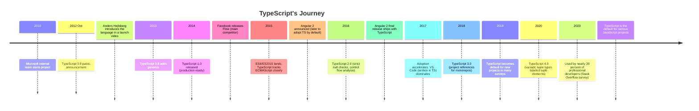

JavaScript was never designed for what we ask of it. In May 1995,
Netscape gave a programmer named **Brendan Eich ten days** to build a
scripting language for the browser, something forgiving and small,
meant for sprinkling a little interactivity onto web pages. It worked
far better than anyone planned. The AJAX revolution of 2004–2005
(Gmail, Google Maps) turned web pages into applications; **Node.js**
in 2009 carried JavaScript onto servers; and by 2010 the ten-day
prototype language was running codebases of hundreds of thousands of
lines, maintained by teams of dozens. (The full, decade-by-decade
version of that story is great reading, and it lives in this
course's appendix:
[The Evolution of JavaScript](./evolution-of-javascript). You don't
need it to continue, what you need is the problem it created.)

The problem was that JavaScript's forgiving nature stops being
charming at scale. Run this, it executes without a single
complaint:

<CodeBlock
  adapter="typescript"
  files={[
    {
      filename: "main.ts",
      starterCode: `// Four lines of perfectly legal JavaScript chaos:
console.log("5" + 3); // "53"  (string concatenation)
console.log("5" - 3); // 2     (numeric subtraction!)
console.log(5 + null); // 5    (null quietly becomes 0)
console.log(5 + undefined); // NaN

// And the classic: a typo that nobody will notice for months.
const user = { name: "Alice", age: 30, email: "alice@example.com" };
console.log(user.emial); // undefined, no error, no warning
`,
    },
  ]}
/>

That last line is the one that ruins weekends. `user.emial` is not an
error in JavaScript, it is merely a property that doesn't exist, so
you get `undefined`, which flows silently through your program until
some distant function calls `.toLowerCase()` on it and pages you at
3am. In a 1,000-line script you'd spot it. In a 100,000-line
application split across dozens of modules and maintained by a
rotating cast of developers, these bugs are a tax on everything:
refactoring means manually hunting down every call site and hoping;
onboarding means absorbing tribal knowledge about what shape each
function secretly expects; "Find All References" barely works
because the editor can't reason about a language this dynamic.

Teams tried workarounds, JSDoc comments that nothing enforced,
linters that couldn't reason about types, runtime assertions that
bloated every function. None of it solved the core problem:
**JavaScript had no static type system**, so nothing could check,
before the code ran, whether a variable held a string or a number,
or whether an object actually had a `save()` method.

<Figure
  slug="tsx-birth-of-typescript-cutout"
  alt="A scaffolding frame of type rails being fitted around an existing loose block tower on a platform"
/>

## The early experiments

Several teams tried to bring types to JavaScript:

**Google's Closure Compiler** (2009) used JSDoc annotations (`/** @type {number} */`) to add optional type checking. It worked for Google's massive internal codebase, but it was clunky, types lived in comments, not the language itself. The annotations were verbose, the error messages cryptic, and adoption outside Google was minimal.

**Facebook's Flow** (2014) was a true static type checker for JavaScript. You added type annotations (`let x: number = 5`), and Flow checked them. It was fast, pragmatic, and integrated well with React. But it required a build step, the ecosystem was small, and Facebook's internal priorities meant external users often felt like second-class citizens.

Both tools pointed toward the same insight: **JavaScript developers wanted types, but they wanted them to feel like a natural extension of the language, not a bolt-on.** The syntax had to be clean. The tooling had to be excellent. The migration path had to be gradual, you couldn't force a million-line codebase to convert overnight.

## Enter Anders Hejlsberg

In 2010, a small team at Microsoft started sketching a solution. Leading the project was **Anders Hejlsberg**, a legendary language designer. Hejlsberg had created **Turbo Pascal** in the 1980s, a fast, elegant compiler that made programming accessible to a generation of developers. At Borland, he built **Delphi**, a visual development environment beloved for its productivity. At Microsoft, he was the chief architect of **C#**, a statically typed language designed for the .NET platform.

Hejlsberg understood types deeply. He also understood *pragmatism*. C# had shown that a well-designed type system could catch bugs early, enable powerful tooling, and scale to massive codebases, all without getting in the developer's way.

But JavaScript wasn't C#. JavaScript was already deployed on millions of websites, in npm packages, in Node.js servers. You couldn't replace it. You had to *extend* it.

## The design constraints

The Microsoft team set ambitious goals:

1. **TypeScript must be a strict superset of JavaScript.** Every valid JavaScript program is a valid TypeScript program. You can take any `.js` file, rename it to `.ts`, and it compiles. Types are *optional annotations* on top of existing code.

2. **TypeScript must compile to clean, readable JavaScript.** The output should look like code a human would write, not obfuscated machine-generated noise. Existing tools (bundlers, minifiers, test runners) must work unchanged.

3. **TypeScript must embrace JavaScript's idioms.** JavaScript uses *structural typing* (duck typing): if an object has a `quack()` method, it's a duck, regardless of its class. TypeScript would follow suit, not force Java-style nominal classes.

4. **TypeScript must enable world-class editor tooling.** Autocomplete, refactoring, inline error checking, these had to be first-class features, not afterthoughts. The compiler's type checker would double as a *language service* for IDEs.

5. **TypeScript must be gradual.** You can't convert a 100,000-line codebase overnight. TypeScript files can import plain JavaScript. Teams can adopt TypeScript one module at a time, getting value incrementally.

These constraints ruled out many design choices. TypeScript couldn't be a new language (it had to be JavaScript-plus-types). It couldn't change runtime behavior (types are erased at compile time). It couldn't require a complex build pipeline (just run `tsc`, get `.js` files).

## The October 2012 announcement

On October 1, 2012, Microsoft unveiled **TypeScript 0.8** to the public, with Hejlsberg introducing the language on camera and showing how a simple JavaScript object could gain type safety with a single annotation:

<CodeBlock
  adapter="typescript"
  files={[
    {
      filename: "main.ts",
      starterCode: `// Plain JavaScript, valid TypeScript with no changes
const user = {
  name: "Alice",
  age: 30,
};

console.log(user.name); // Works fine
console.log(user.emial); // Typo! But JS doesn't care, undefined

// Now let's add a type annotation
interface User {
  name: string;
  age: number;
}

const typedUser: User = {
  name: "Bob",
  age: 25,
};

console.log(typedUser.name); // Still works
// Uncomment the next line to see the type error:
// console.log(typedUser.emial); // Error: Property 'emial' does not exist on type 'User'
`,
    },
  ]}
/>

That commented-out last line is the whole pitch. In an editor, `typedUser.emial` gets a red squiggle the instant you type it, and `tsc` refuses to build until it's fixed: *Property 'emial' does not exist on type 'User'. Did you mean 'email'?*, the compiler even guesses the fix. That's the magic Hejlsberg demonstrated: **types as documentation that the compiler enforces.**

The initial reaction was mixed. JavaScript purists worried Microsoft was trying to "embrace, extend, extinguish" their beloved language. Skeptics pointed out that Closure Compiler and other tools had tried annotations before. Why would this succeed?

But TypeScript had advantages the others lacked:

- **Microsoft's investment in tooling.** Visual Studio and the nascent VS Code editor (itself written in TypeScript) offered unparalleled TypeScript support.
- **The language service architecture.** TypeScript's compiler exposed APIs that *any* editor could use, not just Microsoft's. Atom, Sublime, Vim, Emacs, and WebStorm all gained rich TypeScript support.
- **Hejlsberg's vision.** TypeScript wasn't a research project or an internal tool leaked to the public. It was designed from day one to be a pragmatic, community-driven language for real-world JavaScript.

## The slow climb

Adoption didn't explode overnight. In 2013 and 2014, TypeScript was a curiosity. Most JavaScript developers stuck with plain JS or Closure Compiler. Flow launched in 2014 and briefly looked like it might win the "types for JavaScript" race, it was backed by Facebook, used in React Native, and felt lighter-weight.

But TypeScript steadily improved:

- **0.9 (2013)**: Generics landed, enabling type-safe data structures and APIs.
- **1.0 (2014)**: The first "production-ready" release, signaling stability.
- **1.5 (2015)**: ES6 support, classes, modules, destructuring, async/await.
- **2.0 (2016)**: Strict null checks and sophisticated control flow analysis.

Each release made the language more powerful and more usable. The tooling got faster. The error messages got clearer. The ecosystem grew.

## The React and Angular turning points

Two events turbocharged TypeScript's adoption:

1. **VS Code** (released 2015, written in TypeScript) became the most popular code editor in the world. Millions of developers were now using a tool built with TypeScript, getting a taste of its power.

2. **Angular 2** (final release 2016) adopted TypeScript as its primary language. Angular 1 had been written in plain JavaScript, but the Angular team, collaborating with Microsoft, chose TypeScript for the reboot. Suddenly, every Angular developer was a TypeScript developer.

Around the same time, the React community began migrating from Flow to TypeScript. The DefinitelyTyped project (community-maintained type definitions for JavaScript libraries) exploded, covering thousands of npm packages. If you used Lodash, Express, or React, TypeScript could type-check your usage.

By 2018, TypeScript had crossed a tipping point. New projects defaulted to TypeScript. Experienced teams migrated legacy codebases incrementally. Even hardcore "JavaScript is fine" holdouts admitted that autocomplete and refactoring support were game-changers.

## Why TypeScript succeeded

Looking back, TypeScript's success came from getting the fundamentals right:

**It respected JavaScript.** TypeScript didn't fight the language. It embraced prototypes, structural typing, and JavaScript's idioms. You could write JavaScript-style code and gradually add types where they mattered most.

**It prioritized developer experience.** From day one, the focus was on tooling: autocomplete, instant error feedback, safe refactoring. The compiler was fast, the error messages were clear, and the integration with editors was seamless.

**It scaled gracefully.** You could adopt TypeScript one file at a time. A small team could start with `any` everywhere and tighten strictness as they learned. A large team could enforce `strict` mode from day one.

**It stayed close to ECMAScript.** TypeScript tracked the JavaScript standard closely. When ES6 added classes and modules, TypeScript supported them immediately. When ES2017 added async/await, TypeScript was ready. The gap between "TypeScript features" and "JavaScript features" stayed narrow.

**It had momentum.** Microsoft invested heavily, but the community took ownership. Thousands of contributors improved the compiler, wrote type definitions, created tutorials, and built tools. TypeScript became bigger than Microsoft.

## The modern landscape

Today, TypeScript is the default for serious JavaScript development. It powers:

- **Frontend frameworks**: React, Vue, Angular, Svelte, Solid all have first-class TypeScript support
- **Backend frameworks**: Express, Fastify, NestJS, tRPC, Deno (Deno is TypeScript-first by design)
- **Tools and libraries**: VS Code, Jest, Storybook, ESLint, Prettier
- **Platforms**: AWS CDK, Terraform CDK, GitHub Actions

The 2023 Stack Overflow Developer Survey found that nearly **39%** of professional developers use TypeScript, more than C, C++, or Go, and it has ranked among the survey's most admired languages year after year.

The question is no longer "Should we use TypeScript?" but "How strict should our `tsconfig.json` be?"

## From crisis to confidence

The pain of late-2000s JavaScript, the 3am pager alerts, the refactoring nightmares, the onboarding friction, drove the creation of TypeScript. But TypeScript didn't just solve those problems. It transformed how we think about JavaScript.

With types, JavaScript became a language you could *reason about*. The compiler became a pair-programming partner, catching mistakes as you typed. Refactoring became safe. Documentation became executable. Onboarding became faster because new developers could navigate the codebase with autocomplete and go-to-definition.

TypeScript proved that you didn't have to abandon JavaScript to get safety and tooling. You just had to meet it where it was, and layer types on top.

<Callout type="info" title="The structural type system">
One of TypeScript's most distinctive features is its **structural type system** (also called duck typing). Unlike Java or C#, where two classes are compatible only if one explicitly inherits from the other, TypeScript checks whether objects have the *same shape*. If an object has all the properties a function expects, TypeScript accepts it, regardless of how it was created. We'll explore this deeply in later pages, but it's worth noting now: this design choice is what makes TypeScript feel like JavaScript, not like Java-in-JS-clothing.
</Callout>

---

<MultipleChoice
  markdown={`What was the key design constraint that made TypeScript different from previous attempts to add types to JavaScript?

- TypeScript used a faster compiler than Flow or Closure Compiler
  > Compiler speed was not the defining constraint; the key decision was to make TypeScript a strict superset of JavaScript so existing code required no rewrites.
- [o] TypeScript had to be a strict superset of JavaScript, so any valid JS is valid TS
  > This "JavaScript-plus-types" philosophy meant developers could rename \`.js\` to \`.ts\` and gradually add annotations. Older tools like Closure Compiler required extensive rewrites or non-standard syntax.
- TypeScript was the first language to add type annotations to JavaScript
  > Both Closure Compiler (2009) and Flow (2014) added type annotations to JavaScript before or alongside TypeScript's public launch in 2012.
- TypeScript only worked with Microsoft's Visual Studio editor
  > TypeScript's compiler exposed a language service API that any editor could use, which allowed Atom, Vim, WebStorm, and others to gain rich TypeScript support early on.

The superset constraint, combined with clean compilation to readable JavaScript, structural typing, and excellent tooling, made TypeScript feel like a natural extension of JavaScript, not a replacement.`}
/>
