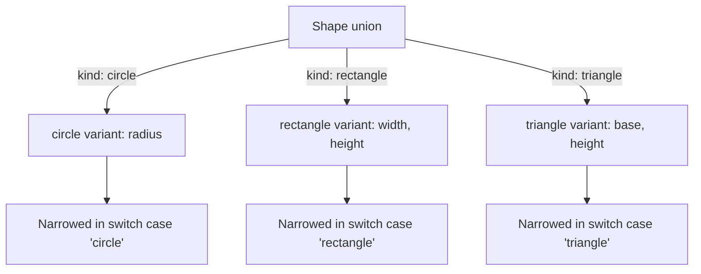
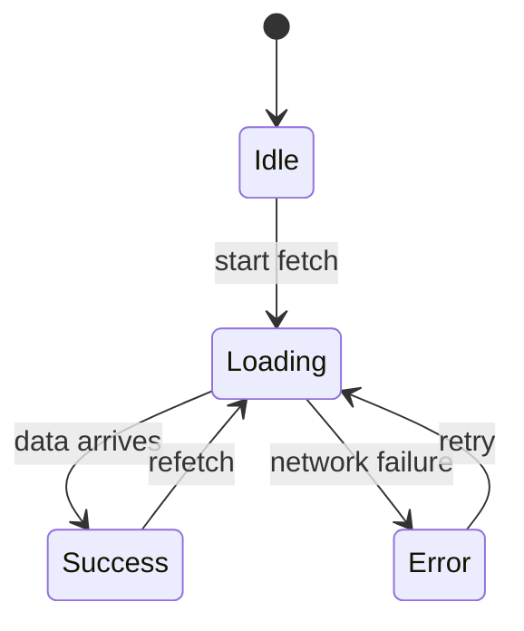

Discriminated unions are the single most useful pattern in modern TypeScript. They let you model **variants**, states, events, results, commands, where each variant has different data, and the compiler helps you handle every case exhaustively.

The idea: define a union of object types, each with a **discriminant** field (a tag like `kind` or `type`) that uniquely identifies the variant. TypeScript's control-flow analysis narrows the union based on the discriminant, so inside a `switch` or `if` statement, you know exactly which variant you're handling, and the compiler proves you didn't miss any.

This is how you model state machines, API responses, domain events, parser results, and anything else with "one of several possibilities." Let's see why discriminated unions are so powerful.

<Figure
  slug="tsx-discriminated-unions-cutout"
  alt="Three variant blocks on a platform each carrying a distinct shaped tag, a reader gate sorting them by tag alone"
/>

## The discriminant field

A discriminated union is a union of object types that share a common property, the **discriminant**, with distinct literal values for each variant.

<CodeBlock
  adapter="typescript"
  files={[
    {
      filename: "main.ts",
      starterCode: `type Shape =
  | { kind: "circle"; radius: number }
  | { kind: "rectangle"; width: number; height: number }
  | { kind: "triangle"; base: number; height: number };

function area(shape: Shape): number {
  switch (shape.kind) {
    case "circle":
      // TypeScript knows: shape is { kind: "circle"; radius: number }
      return Math.PI * shape.radius ** 2;
    case "rectangle":
      // TypeScript knows: shape is { kind: "rectangle"; width: number; height: number }
      return shape.width * shape.height;
    case "triangle":
      // TypeScript knows: shape is { kind: "triangle"; base: number; height: number }
      return 0.5 * shape.base * shape.height;
  }
}

const circle: Shape = { kind: "circle", radius: 10 };
const rect: Shape = { kind: "rectangle", width: 20, height: 15 };

console.log(\`Circle area: \${area(circle).toFixed(2)}\`);
console.log(\`Rectangle area: \${area(rect)}\`);
`,
    },
  ]}
/>

The `kind` field is the **discriminant** (also called a **tag**). Each variant has a different literal value: `"circle"`, `"rectangle"`, or `"triangle"`. When you check `shape.kind === "circle"`, TypeScript narrows the type to `{ kind: "circle"; radius: number }`, so it knows `shape.radius` exists and is safe to access.

This is called **narrowing by discriminant**. The compiler tracks which variant you're in and gives you precise autocomplete and error checking for that variant's fields.



<Callout type="info" title="Why 'kind' or 'type'?">
You can name the discriminant field anything you want, but `kind` and `type` are conventional. Some teams use `tag`, `variant`, or `_type` (with an underscore to avoid clashing with JavaScript's `type` keyword in older contexts). Pick one and stick with it across your codebase.
</Callout>

## Exhaustiveness checking

The real power of discriminated unions is **exhaustiveness checking**: the compiler can verify you've handled *every* variant. If you add a new variant later and forget to update a `switch` statement, the compiler catches it.

Here's the trick: assign the unhandled case to `never`. If you've covered all variants, the code is unreachable and `never` is satisfied. If you missed a variant, the compiler complains that the leftover type isn't assignable to `never`.

<CodeBlock
  adapter="typescript"
  files={[
    {
      filename: "main.ts",
      starterCode: `type Status =
  | { kind: "idle" }
  | { kind: "loading" }
  | { kind: "success"; data: string }
  | { kind: "error"; message: string };

function render(status: Status): string {
  switch (status.kind) {
    case "idle":
      return "Waiting to start...";
    case "loading":
      return "Loading...";
    case "success":
      return \`Success: \${status.data}\`;
    case "error":
      return \`Error: \${status.message}\`;
    default:
      // Exhaustiveness check: if we missed a case, this line errors
      const _exhaustive: never = status;
      return _exhaustive;
  }
}

console.log(render({ kind: "idle" }));
console.log(render({ kind: "success", data: "All done!" }));
console.log(render({ kind: "error", message: "Network failure" }));
`,
    },
  ]}
/>

In the `default` case, we try to assign `status` to a variable of type `never`. If every variant has been handled, `status` is type `never` (the "empty" type), so the assignment succeeds. If we forgot a case, `status` still has a type (the unhandled variant), and assigning it to `never` fails with a compile error, under `tsc`, deleting the `"error"` case from the function above produces *Type '\{ kind: "error"; message: string; \}' is not assignable to type 'never'*, an error message that names the exact variant you forgot.

<Callout type="success" title="Add a variant, get a compile error">
This is the dream: you add a new variant to the union (e.g., `| { kind: "cancelled" }`), and every `switch` statement that handles `Status` lights up with an error until you add the new case. The compiler becomes your refactoring assistant.
</Callout>

## Modeling state machines

Discriminated unions shine when modeling **state machines**, systems that can be in one of several states, each with different valid data.

Consider a data-fetching flow: you start idle, transition to loading, and then land in either success or error. Each state has its own data:

<CodeBlock
  adapter="typescript"
  files={[
    {
      filename: "main.ts",
      starterCode: `type FetchState<T> =
  | { status: "idle" }
  | { status: "loading" }
  | { status: "success"; data: T }
  | { status: "error"; error: string };

function describeFetch<T>(state: FetchState<T>): string {
  switch (state.status) {
    case "idle":
      return "Not started yet.";
    case "loading":
      return "Fetching data...";
    case "success":
      return \`Loaded: \${JSON.stringify(state.data)}\`;
    case "error":
      return \`Failed: \${state.error}\`;
  }
}

// Simulate a fetch lifecycle
const idle: FetchState<number> = { status: "idle" };
const loading: FetchState<number> = { status: "loading" };
const success: FetchState<number> = { status: "success", data: 42 };
const error: FetchState<number> = { status: "error", error: "Network timeout" };

console.log(describeFetch(idle));
console.log(describeFetch(loading));
console.log(describeFetch(success));
console.log(describeFetch(error));
`,
    },
  ]}
/>

This pattern is often called **RemoteData** (borrowed from Elm). It makes illegal states unrepresentable: you can't have `status: "success"` without `data`, and you can't have `status: "error"` without an `error` message. Contrast this with a naive approach:

```ts
// ❌ Bad: allows impossible states
type BadFetchState<T> = {
  loading: boolean;
  data: T | null;
  error: string | null;
};
```

With the naive version, you can end up with `loading: false, data: null, error: null` (which state is that?) or `loading: true, data: "some data", error: "some error"` (a success *and* an error at the same time?). The discriminated union enforces that exactly one variant is active at a time.



<Callout type="warning" title="Avoid boolean soup">
When you see multiple booleans (`isLoading`, `isSuccess`, `isError`) or nullable fields that represent mutually exclusive states, it's a sign you should use a discriminated union instead. The compiler will enforce that only one state is active.
</Callout>

## Domain events

Discriminated unions are perfect for modeling **domain events**, things that happen in your application, where each event carries different data.

<CodeBlock
  adapter="typescript"
  files={[
    {
      filename: "main.ts",
      starterCode: `type AppEvent =
  | { type: "user-logged-in"; userId: string; timestamp: number }
  | { type: "user-logged-out"; userId: string }
  | { type: "page-viewed"; path: string; referrer: string | null }
  | { type: "error-occurred"; message: string; stack: string };

function logEvent(event: AppEvent): void {
  switch (event.type) {
    case "user-logged-in":
      console.log(
        \`[\${new Date(event.timestamp).toISOString()}] User \${event.userId} logged in\`,
      );
      break;
    case "user-logged-out":
      console.log(\`User \${event.userId} logged out\`);
      break;
    case "page-viewed":
      console.log(
        \`Page viewed: \${event.path} (referrer: \${event.referrer || "none"})\`,
      );
      break;
    case "error-occurred":
      console.log(\`Error: \${event.message}\`);
      console.log(\`Stack: \${event.stack}\`);
      break;
    default:
      const _exhaustive: never = event;
      throw new Error(\`Unhandled event: \${_exhaustive}\`);
  }
}

// Simulate events
logEvent({ type: "user-logged-in", userId: "u123", timestamp: Date.now() });
logEvent({ type: "page-viewed", path: "/dashboard", referrer: "/home" });
logEvent({ type: "user-logged-out", userId: "u123" });
logEvent({
  type: "error-occurred",
  message: "DB connection lost",
  stack: "at ...",
});
`,
    },
  ]}
/>

Each event is self-describing: the `type` field tells you what happened, and the rest of the fields carry event-specific data. You can pass these events to an analytics service, a logger, or an event-sourcing store, and the consumer can handle each type appropriately.

## Multi-file example: RemoteData ADT

Let's build a more complete example across multiple files. We'll define a `RemoteData<T>` type in one module and a set of helpers in another.

<CodeBlock
  adapter="typescript"
  entryFilename="main.ts"
  files={[
    {
      filename: "main.ts",
      starterCode: `import { RemoteData, isLoading, isSuccess, getData } from "./remoteData";

// Simulate a fetch flow
let state: RemoteData<string> = { status: "idle" };
console.log("Initial:", JSON.stringify(state));

state = { status: "loading" };
console.log("Loading:", isLoading(state));

state = { status: "success", data: "Hello, TypeScript!" };
console.log("Success:", isSuccess(state));
console.log("Data:", getData(state));

state = { status: "error", error: "Network timeout" };
console.log("Error:", JSON.stringify(state));
`,
    },
    {
      filename: "remoteData.ts",
      starterCode: `// A discriminated union for async data
export type RemoteData<T> =
  | { status: "idle" }
  | { status: "loading" }
  | { status: "success"; data: T }
  | { status: "error"; error: string };

// Type guards
export function isLoading<T>(
  state: RemoteData<T>,
): state is { status: "loading" } {
  return state.status === "loading";
}

export function isSuccess<T>(
  state: RemoteData<T>,
): state is { status: "success"; data: T } {
  return state.status === "success";
}

// Safe accessor
export function getData<T>(state: RemoteData<T>): T | null {
  return state.status === "success" ? state.data : null;
}
`,
    },
  ]}
/>

The `remoteData.ts` module defines the union and a few helpers. The `main.ts` module imports them and simulates a fetch lifecycle. Notice how the type guards (`isLoading`, `isSuccess`) narrow the type so you can safely access variant-specific fields.

<Callout type="info" title="Type guards refresh">
A **type guard** is a function that returns `x is SomeType`. When you call it in an `if` statement, TypeScript narrows the type of `x` to `SomeType` in the true branch. We covered this in the [Type Narrowing](./type-narrowing) chapter, discriminated unions and type guards work together beautifully.
</Callout>

## Challenge: Modeling a notification system

Now it's your turn. You'll model a notification system with multiple notification types, then write a function to render each one.

<ChallengeCard
  adapter="typescript"
  title="Notification renderer"
  instructions={`You're building a notification system. Notifications can be:
- \`info\`: just a message
- \`warning\`: a message and a severity level (1-5)
- \`error\`: a message and a stack trace

**Your tasks:**
1. In \`notification.ts\`, define a discriminated union \`Notification\` with a \`type\` discriminant.
2. In \`main.ts\`, implement \`renderNotification\` to return a formatted string for each variant.
3. The test will check that all three variants render correctly.`}
  entryFilename="main.ts"
  files={[
    {
      filename: "main.ts",
      starterCode: `import { Notification } from "./notification";

export function renderNotification(notif: Notification): string {
  // TODO: switch on notif.type and return a formatted string
  return "";
}

// Test cases
const info: Notification = { type: "info", message: "System updated" };
const warning: Notification = {
  type: "warning",
  message: "Low disk space",
  severity: 3,
};
const error: Notification = {
  type: "error",
  message: "Crash",
  stack: "at line 42",
};

console.log(renderNotification(info));
console.log(renderNotification(warning));
console.log(renderNotification(error));
`,
      solutionCode: `import { Notification } from "./notification";

export function renderNotification(notif: Notification): string {
  switch (notif.type) {
    case "info":
      return \`[INFO] \${notif.message}\`;
    case "warning":
      return \`[WARN] \${notif.message} (severity: \${notif.severity})\`;
    case "error":
      return \`[ERROR] \${notif.message} | Stack: \${notif.stack}\`;
    default:
      const _exhaustive: never = notif;
      return _exhaustive;
  }
}

const info: Notification = { type: "info", message: "System updated" };
const warning: Notification = {
  type: "warning",
  message: "Low disk space",
  severity: 3,
};
const error: Notification = {
  type: "error",
  message: "Crash",
  stack: "at line 42",
};

console.log(renderNotification(info));
console.log(renderNotification(warning));
console.log(renderNotification(error));
`,
    },
    {
      filename: "notification.ts",
      starterCode: `// TODO: Define a discriminated union Notification with:
// - { type: "info"; message: string }
// - { type: "warning"; message: string; severity: number }
// - { type: "error"; message: string; stack: string }

export type Notification = { type: "info"; message: string };
`,
      solutionCode: `export type Notification =
  | { type: "info"; message: string }
  | { type: "warning"; message: string; severity: number }
  | { type: "error"; message: string; stack: string };
`,
    },
  ]}
  tests={[
    {
      id: "info",
      name: "Renders info notification",
      description: "renderNotification(info) includes '[INFO]'",
      code: `
        const { renderNotification } = require("./main");
        const info = { type: "info", message: "Test" };
        const result = renderNotification(info);
        if (!result.includes("[INFO]") || !result.includes("Test")) {
          throw new Error(\`Expected '[INFO] Test', got: \${result}\`);
        }
      `,
    },
    {
      id: "warning",
      name: "Renders warning with severity",
      description: "renderNotification(warning) includes severity",
      code: `
        const { renderNotification } = require("./main");
        const warning = { type: "warning", message: "Low memory", severity: 4 };
        const result = renderNotification(warning);
        if (!result.includes("[WARN]") || !result.includes("4")) {
          throw new Error(\`Expected '[WARN]' and '4', got: \${result}\`);
        }
      `,
    },
    {
      id: "error",
      name: "Renders error with stack",
      description: "renderNotification(error) includes stack trace",
      code: `
        const { renderNotification } = require("./main");
        const error = { type: "error", message: "Crash", stack: "at line 10" };
        const result = renderNotification(error);
        if (!result.includes("[ERROR]") || !result.includes("at line 10")) {
          throw new Error(\`Expected '[ERROR]' and 'at line 10', got: \${result}\`);
        }
      `,
    },
  ]}
/>

## Multiple choice check

<MultipleChoice
  markdown={`What happens if you add a new variant to a discriminated union but forget to handle it in a \`switch\` statement with exhaustiveness checking?

- The new variant is ignored, and the \`default\` case handles it silently.
  > No. If you have exhaustiveness checking, the \`default\` case tries to assign the value to \`never\`. If a variant is unhandled, this fails at compile time, not runtime.
- The code compiles and runs, but crashes at runtime when the new variant is encountered.
  > No. With exhaustiveness checking (\`const _exhaustive: never = value\`), the code won't even *compile* if you miss a case. The compiler catches it at build time.
- [o] The code fails to compile because the unhandled variant isn't assignable to \`never\`.
  > The exhaustiveness check tries to assign the leftover variant to \`never\`. If any variant is unhandled, it still has a type, and assigning it to \`never\` is a type error. This is exactly what we want: the compiler forces you to handle every case.

Exhaustiveness checking is the key benefit of discriminated unions. When you add a new variant, every \`switch\` that handles the union must be updated to handle the new case, or the code won't compile. This turns runtime bugs into compile-time errors.`}
/>

## When to use discriminated unions

Discriminated unions are the right choice whenever you have:

- **Mutually exclusive states.** Loading vs. success vs. error. Draft vs. published vs. archived.
- **Domain events.** UserLoggedIn vs. UserLoggedOut vs. PasswordReset. Each event has its own payload.
- **Commands or actions.** AddItem vs. RemoveItem vs. ClearCart. Each command has different parameters.
- **Parser results.** Success vs. SyntaxError vs. EOF. Each outcome carries different data.

The pattern is always the same: define a union of object types with a shared discriminant field, use `switch` or `if` to narrow by the discriminant, and add exhaustiveness checking in the `default` case to catch missing variants.

<Callout type="success" title="The most powerful pattern">
If you learn one advanced TypeScript pattern, make it discriminated unions. They combine the flexibility of unions with the precision of narrowing, and they make illegal states unrepresentable. You'll use them everywhere once you see how they simplify state management and domain modeling.
</Callout>

## Recap

Discriminated unions let you model variants, states, events, commands, results, where each variant has different data and a unique tag. The compiler uses the tag (the **discriminant**) to narrow the union, so you get precise type checking and autocomplete for each variant.

**Key takeaways:**

- **Discriminant field:** A shared property with distinct literal values (e.g., `kind: "circle" | "rectangle"`).
- **Narrowing by discriminant:** `switch` or `if` checks on the discriminant narrow the union to a single variant.
- **Exhaustiveness checking:** Assign the unhandled case to `never` to force the compiler to verify all variants are covered.
- **State machines:** Model async states, fetch flows, and UI states as discriminated unions to make illegal states unrepresentable.
- **Domain events:** Model events as discriminated unions to ensure each event carries the right payload.

Discriminated unions are the backbone of type-safe state management in TypeScript. They're concise, composable, and compiler-verified. Master them, and you'll write cleaner, safer code.

Next: [Modeling Domains with Types](./modeling-domains-with-types), where we take the principles from discriminated unions and apply them to real-world domain modeling, evolving sloppy types into precise, self-documenting data structures that make illegal states impossible.
