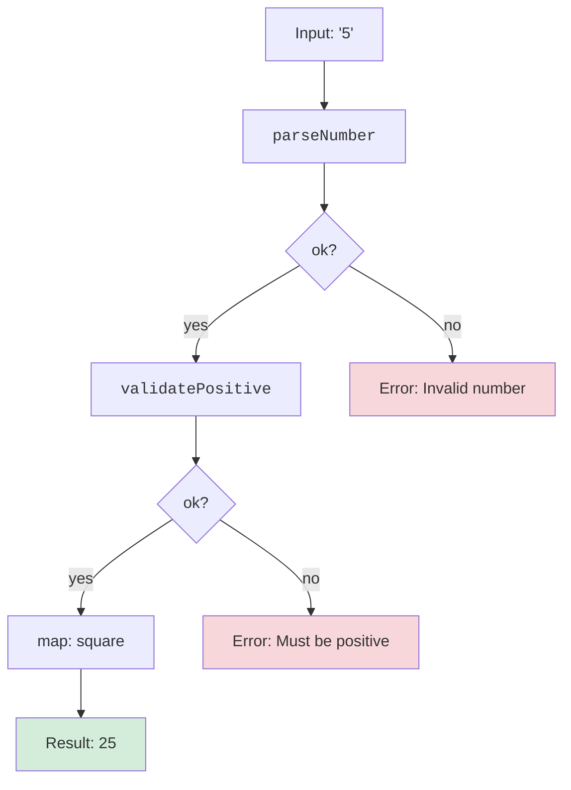

Traditional error handling in JavaScript relies on `throw` and `catch`. But exceptions have a fatal flaw: they're **invisible in types**. A function's signature doesn't tell you what errors it might throw, so you either handle every possible exception defensively (slow, verbose) or forget to handle them at all (bugs).

TypeScript inherits this problem. But there's a better way, borrowed from functional languages like Rust, Haskell, and OCaml: **model errors as values**. Instead of throwing, return a discriminated union that explicitly represents success or failure. The compiler then forces you to handle both cases.

In this chapter, you'll learn the **`Result<T, E>` pattern**, a type-safe alternative to exceptions. You'll build combinators that compose error-prone operations, and you'll see when to use `Result` vs. when to still throw.

<svg
  viewBox="0 0 640 270"
  role="img"
  aria-label="Two corridors: in the upper one a walker strolls toward a trapdoor already swinging open beneath an unbroken-looking floor, while the lower corridor ends honestly at two marked doors, one green and one red — exceptions hide failure in the floor, Result puts both outcomes in plain sight"
  style={{ display: "block", width: "100%", maxWidth: "640px", height: "auto", margin: "2.5rem auto" }}
>
  <g fill="currentColor" opacity="0.2">
    <rect x="80" y="88" width="270" height="6" rx="3" />
    <rect x="408" y="88" width="152" height="6" rx="3" />
  </g>
  <g style={{ color: "var(--ds-blue-500)" }} fill="currentColor">
    <circle cx="180" cy="76" r="9" />
  </g>
  <g fill="currentColor" opacity="0.25">
    <circle cx="216" cy="76" r="2.5" />
    <circle cx="244" cy="76" r="2.5" />
    <circle cx="272" cy="76" r="2.5" />
  </g>
  <g style={{ color: "var(--ds-red-500)" }} fill="currentColor">
    <path d="M350 90 L406 90 L390 126 L334 126 Z" fillOpacity="0.3" />
    <circle cx="376" cy="150" r="5" fillOpacity="0.55" />
    <circle cx="378" cy="168" r="2.5" fillOpacity="0.35" />
  </g>
  <g fill="currentColor" opacity="0.2">
    <rect x="80" y="185" width="240" height="6" rx="3" />
  </g>
  <g style={{ color: "var(--ds-green-500)" }} fill="currentColor">
    <circle cx="250" cy="173" r="9" />
    <rect x="430" y="138" width="44" height="58" rx="8" />
  </g>
  <g style={{ color: "var(--ds-red-500)" }} fill="currentColor">
    <rect x="430" y="208" width="44" height="56" rx="8" fillOpacity="0.85" />
  </g>
  <g fill="var(--ds-white)">
    <circle cx="464" cy="168" r="3.5" />
    <circle cx="464" cy="236" r="3.5" />
  </g>
  <g fill="currentColor" opacity="0.3">
    <circle cx="332" cy="178" r="2.5" />
    <circle cx="358" cy="168" r="2.5" />
    <circle cx="384" cy="158" r="2.5" />
    <circle cx="408" cy="152" r="2.5" />
    <circle cx="332" cy="194" r="2.5" />
    <circle cx="358" cy="204" r="2.5" />
    <circle cx="384" cy="216" r="2.5" />
    <circle cx="408" cy="226" r="2.5" />
  </g>
</svg>

---

## The Problem with Exceptions

Consider a parser that might fail:

```ts
function parseJSON(input: string): any {
  return JSON.parse(input); // Throws SyntaxError if invalid
}
```

The signature says it returns `any`, but it doesn't mention that it can *throw*. Callers have no way to know:
- What exception types might be thrown?
- When should I catch?
- Did the maintainer forget to document this?

This leads to two failure modes:
1. **Over-catching**: Wrap everything in `try/catch`, slowing code and hiding real bugs.
2. **Under-catching**: Forget to catch, and the exception propagates to production.

Exceptions also break composition. You can't easily chain operations, collect multiple errors, or defer error handling. You must handle them *right now*, or let them bubble.

---

## The Solution: `Result<T, E>`

A **`Result<T, E>`** is a discriminated union representing either success (with a value of type `T`) or failure (with an error of type `E`):

```ts
type Result<T, E> =
  | { ok: true; value: T }
  | { ok: false; error: E };
```

Functions return `Result` instead of throwing. Callers must check `.ok` to access the value or error, and TypeScript enforces this at compile time.

<CodeBlock
  adapter="typescript"
  files={[
    {
      filename: "main.ts",
      starterCode: `type Result<T, E> = { ok: true; value: T } | { ok: false; error: E };

function parseNumber(input: string): Result<number, string> {
  const n = Number(input);
  if (isNaN(n)) {
    return { ok: false, error: \`Invalid number: "\${input}"\` };
  }
  return { ok: true, value: n };
}

const result1 = parseNumber("42");
if (result1.ok) {
  console.log(\`Parsed: \${result1.value}\`);
} else {
  console.log(\`Error: \${result1.error}\`);
}

const result2 = parseNumber("abc");
if (result2.ok) {
  console.log(\`Parsed: \${result2.value}\`);
} else {
  console.log(\`Error: \${result2.error}\`);
}
`,
    },
  ]}
/>

Now the signature **documents** that parsing might fail, and the compiler **enforces** that you handle both cases. No silent failures, no forgotten catches.

---

## Building Helper Functions

Raw `if (result.ok)` checks get verbose. Let's build combinators to make `Result` ergonomic.

### `map<T, E, U>(result: Result<T, E>, fn: (value: T) => U): Result<U, E>`

Transforms the success value if present, otherwise propagates the error:

<CodeBlock
  adapter="typescript"
  files={[
    {
      filename: "main.ts",
      starterCode: `type Result<T, E> = { ok: true; value: T } | { ok: false; error: E };

function map<T, E, U>(result: Result<T, E>, fn: (value: T) => U): Result<U, E> {
  if (result.ok) {
    return { ok: true, value: fn(result.value) };
  }
  return result;
}

function parseNumber(input: string): Result<number, string> {
  const n = Number(input);
  if (isNaN(n)) {
    return { ok: false, error: \`Invalid number: "\${input}"\` };
  }
  return { ok: true, value: n };
}

const result = parseNumber("42");
const doubled = map(result, (n) => n * 2);

if (doubled.ok) {
  console.log(\`Doubled: \${doubled.value}\`);
} else {
  console.log(\`Error: \${doubled.error}\`);
}
`,
    },
  ]}
/>

`map` lets you transform success values without manually unpacking and repacking the `Result`.

---

### `andThen<T, E, U>(result: Result<T, E>, fn: (value: T) => Result<U, E>): Result<U, E>`

Chains operations that also return `Result`:

<CodeBlock
  adapter="typescript"
  files={[
    {
      filename: "main.ts",
      starterCode: `type Result<T, E> = { ok: true; value: T } | { ok: false; error: E };

function andThen<T, E, U>(
  result: Result<T, E>,
  fn: (value: T) => Result<U, E>,
): Result<U, E> {
  if (result.ok) {
    return fn(result.value);
  }
  return result;
}

function parseNumber(input: string): Result<number, string> {
  const n = Number(input);
  if (isNaN(n)) {
    return { ok: false, error: \`Invalid number: "\${input}"\` };
  }
  return { ok: true, value: n };
}

function sqrt(n: number): Result<number, string> {
  if (n < 0) {
    return { ok: false, error: "Cannot take square root of negative number" };
  }
  return { ok: true, value: Math.sqrt(n) };
}

const result = parseNumber("16");
const sqrtResult = andThen(result, sqrt);

if (sqrtResult.ok) {
  console.log(\`Square root: \${sqrtResult.value}\`);
} else {
  console.log(\`Error: \${sqrtResult.error}\`);
}
`,
    },
  ]}
/>

`andThen` (also called `flatMap` or `bind` in other languages) flattens nested `Result`s, letting you chain operations cleanly.

---

### `unwrapOr<T, E>(result: Result<T, E>, defaultValue: T): T`

Extracts the value or returns a default:

<CodeBlock
  adapter="typescript"
  files={[
    {
      filename: "main.ts",
      starterCode: `type Result<T, E> = { ok: true; value: T } | { ok: false; error: E };

function unwrapOr<T, E>(result: Result<T, E>, defaultValue: T): T {
  if (result.ok) {
    return result.value;
  }
  return defaultValue;
}

function parseNumber(input: string): Result<number, string> {
  const n = Number(input);
  if (isNaN(n)) {
    return { ok: false, error: \`Invalid number: "\${input}"\` };
  }
  return { ok: true, value: n };
}

const result = parseNumber("abc");
const value = unwrapOr(result, 0);
console.log(\`Value: \${value}\`); // 0
`,
    },
  ]}
/>

Useful when you want a fallback without explicitly checking `.ok`.

---

## Composing Operations with `Result`

Let's build a pipeline that parses input, validates it, and computes a result:

<svg
  viewBox="0 0 640 190"
  role="img"
  aria-label="A green value hops from station to station along the upper success rail, but the moment a hop turns red it slides onto the bypass rail and coasts past every remaining station to the red exit — andThen short-circuits the rest of the chain on the first failure"
  style={{ display: "block", width: "100%", maxWidth: "520px", height: "auto", margin: "2.5rem auto" }}
>
  <g style={{ color: "var(--ds-blue-500)" }} fill="currentColor">
    <rect x="100" y="50" width="80" height="40" rx="12" fillOpacity="0.8" />
    <rect x="260" y="50" width="80" height="40" rx="12" fillOpacity="0.8" />
    <rect x="420" y="50" width="80" height="40" rx="12" fillOpacity="0.8" />
  </g>
  <g style={{ color: "var(--ds-green-500)" }} fill="currentColor">
    <circle cx="62" cy="70" r="8" />
    <circle cx="205" cy="70" r="3" fillOpacity="0.6" />
    <circle cx="228" cy="70" r="3" fillOpacity="0.6" />
    <path d="M548 70 A12 12 0 1 1 572 70 A12 12 0 1 1 548 70 Z M553 70 A7 7 0 1 0 567 70 A7 7 0 1 0 553 70 Z" fillRule="evenodd" />
  </g>
  <g style={{ color: "var(--ds-red-500)" }} fill="currentColor">
    <circle cx="320" cy="108" r="7" fillOpacity="0.9" />
    <circle cx="348" cy="124" r="2.5" fillOpacity="0.5" />
    <circle cx="380" cy="136" r="2.5" fillOpacity="0.5" />
    <circle cx="414" cy="144" r="2.5" fillOpacity="0.5" />
    <circle cx="448" cy="148" r="2.5" fillOpacity="0.5" />
    <circle cx="482" cy="150" r="2.5" fillOpacity="0.5" />
    <circle cx="514" cy="150" r="2.5" fillOpacity="0.5" />
    <path d="M548 150 A12 12 0 1 1 572 150 A12 12 0 1 1 548 150 Z M553 150 A7 7 0 1 0 567 150 A7 7 0 1 0 553 150 Z" fillRule="evenodd" />
  </g>
  <g fill="currentColor" opacity="0.25">
    <circle cx="365" cy="70" r="3" />
    <circle cx="388" cy="70" r="3" />
  </g>
</svg>

<CodeBlock
  adapter="typescript"
  files={[
    {
      filename: "main.ts",
      starterCode: `type Result<T, E> = { ok: true; value: T } | { ok: false; error: E };

function map<T, E, U>(result: Result<T, E>, fn: (value: T) => U): Result<U, E> {
  return result.ok ? { ok: true, value: fn(result.value) } : result;
}

function andThen<T, E, U>(
  result: Result<T, E>,
  fn: (value: T) => Result<U, E>,
): Result<U, E> {
  return result.ok ? fn(result.value) : result;
}

function parseNumber(input: string): Result<number, string> {
  const n = Number(input);
  return isNaN(n)
    ? { ok: false, error: \`Invalid number: "\${input}"\` }
    : { ok: true, value: n };
}

function validatePositive(n: number): Result<number, string> {
  return n > 0
    ? { ok: true, value: n }
    : { ok: false, error: "Number must be positive" };
}

function computeSquare(input: string): Result<number, string> {
  const parsed = parseNumber(input);
  const validated = andThen(parsed, validatePositive);
  return map(validated, (n) => n * n);
}

const result1 = computeSquare("5");
console.log(result1); // { ok: true, value: 25 }

const result2 = computeSquare("-5");
console.log(result2); // { ok: false, error: "Number must be positive" }

const result3 = computeSquare("abc");
console.log(result3); // { ok: false, error: 'Invalid number: "abc"' }
`,
    },
  ]}
/>

Notice:
1. Each step is a separate function that returns `Result`.
2. `andThen` chains steps that might fail.
3. `map` transforms the final success value.
4. Errors propagate automatically — no manual `if` checks at every step.



---

## Multi-File Example: Parser with `Result`

Let's organize a parser into modules:

<CodeBlock
  adapter="typescript"
  entryFilename="main.ts"
  files={[
    {
      filename: "main.ts",
      starterCode: `import { parseConfig } from "./parser";

const input1 = '{"port":3000,"host":"localhost"}';
const result1 = parseConfig(input1);

if (result1.ok) {
  console.log(\`Config: port=\${result1.value.port}, host=\${result1.value.host}\`);
} else {
  console.log(\`Error: \${result1.error}\`);
}

const input2 = "invalid json";
const result2 = parseConfig(input2);

if (result2.ok) {
  console.log(\`Config: port=\${result2.value.port}, host=\${result2.value.host}\`);
} else {
  console.log(\`Error: \${result2.error}\`);
}
`,
    },
    {
      filename: "parser.ts",
      starterCode: `import { Result } from "./result";

export type Config = {
  port: number;
  host: string;
};

export function parseConfig(input: string): Result<Config, string> {
  try {
    const obj = JSON.parse(input);
    if (typeof obj.port === "number" && typeof obj.host === "string") {
      return { ok: true, value: { port: obj.port, host: obj.host } };
    }
    return { ok: false, error: "Missing or invalid fields" };
  } catch (e) {
    return { ok: false, error: "Invalid JSON" };
  }
}
`,
    },
    {
      filename: "result.ts",
      starterCode: `export type Result<T, E> = { ok: true; value: T } | { ok: false; error: E };

export function map<T, E, U>(
  result: Result<T, E>,
  fn: (value: T) => U,
): Result<U, E> {
  return result.ok ? { ok: true, value: fn(result.value) } : result;
}

export function andThen<T, E, U>(
  result: Result<T, E>,
  fn: (value: T) => Result<U, E>,
): Result<U, E> {
  return result.ok ? fn(result.value) : result;
}
`,
    },
  ]}
/>

Here:
- `result.ts` defines `Result` and its helpers.
- `parser.ts` uses `Result` to return success or error.
- `main.ts` handles the result explicitly.

This structure scales: any module can return `Result`, and consumers can compose with `map`/`andThen`.

---

## Challenge: Implement `Result.map` and Use It

<ChallengeCard
  adapter="typescript"
  title="Result.map"
  instructions={`Complete the implementation of \`map\` in \`result.ts\`, then use it in \`main.ts\` to transform a parsed number by doubling it.

**Hint**: If \`result.ok\`, apply \`fn\` to \`result.value\` and return a new success \`Result\`. Otherwise, return the error unchanged.`}
  entryFilename="main.ts"
  files={[
    {
      filename: "main.ts",
      starterCode: `import { Result, map } from "./result";
import { parseNumber } from "./parser";

const result = parseNumber("21");
const doubled = map(result, (n) => n * 2);

if (doubled.ok) {
  console.log(doubled.value); // Should print 42
} else {
  console.log(\`Error: \${doubled.error}\`);
}
`,
    },
    {
      filename: "parser.ts",
      starterCode: `import { Result } from "./result";

export function parseNumber(input: string): Result<number, string> {
  const n = Number(input);
  return isNaN(n)
    ? { ok: false, error: \`Invalid number: "\${input}"\` }
    : { ok: true, value: n };
}
`,
    },
    {
      filename: "result.ts",
      starterCode: `export type Result<T, E> = { ok: true; value: T } | { ok: false; error: E };

export function map<T, E, U>(
  result: Result<T, E>,
  fn: (value: T) => U,
): Result<U, E> {
  // Implement
  return { ok: false, error: "Not implemented" as any };
}
`,
      solutionCode: `export type Result<T, E> = { ok: true; value: T } | { ok: false; error: E };

export function map<T, E, U>(
  result: Result<T, E>,
  fn: (value: T) => U,
): Result<U, E> {
  if (result.ok) {
    return { ok: true, value: fn(result.value) };
  }
  return result;
}
`,
    },
  ]}
  tests={[
    {
      id: "out",
      name: "Outputs 42",
      description: "stdout equals 42",
      expect: { stdoutEquals: "42" },
    },
  ]}
/>

---

## When to Still Use Exceptions

`Result` isn't always the answer. Use exceptions for:
- **Programmer errors**: Bugs that should never happen in correct code (e.g., `assert`, null dereference). These should crash during development, not be handled gracefully.
- **Unrecoverable failures**: Out-of-memory, stack overflow, or critical infrastructure failures that you can't reasonably handle.
- **Third-party code**: If a library throws, you might catch at the boundary and convert to `Result`.

Use `Result` for:
- **Expected failures**: Validation errors, missing files, network timeouts, user input errors — anything that's part of normal operation.
- **Composable operations**: When you want to chain multiple steps and handle errors uniformly.
- **Explicit contracts**: When the caller *must* know a function can fail.

---

## Comparison to Other Languages

This pattern isn't new:
- **Rust**: `Result<T, E>` is built into the language, with `?` syntax for early returns.
- **Haskell**: `Either` represents `Left` (error) or `Right` (success).
- **OCaml**: `result` is a standard library type.
- **Go**: Multiple return values `(value, error)` force explicit checks (though not type-safe).

TypeScript doesn't have special syntax, but discriminated unions and type narrowing give you the same guarantees.

---

## Multiple Choice: `Result` vs. Exceptions

<MultipleChoice
  markdown={`What's the main advantage of \`Result<T, E>\` over exceptions?

- Faster runtime performance
  > \`Result\` has similar performance to exceptions; the benefit is static safety, not speed.
- [o] Errors are visible in the type signature and must be handled
  > The return type \`Result<T, E>\` documents that the function can fail, and the compiler forces you to check \`.ok\` before accessing the value.
- Easier to write
  > \`Result\` requires more boilerplate (but combinators help). The payoff is correctness.

Exceptions are invisible in types; \`Result\` makes errors explicit and unignorable.`}
/>

---

## Multiple Choice: Chaining with `andThen`

<MultipleChoice
  markdown={`Given:
\`\`\`ts
const result = parseNumber("4");
const sqrtResult = andThen(result, sqrt);
\`\`\`
What happens if \`parseNumber\` returns an error?

- \`sqrt\` is called with the error
  > \`andThen\` only calls \`fn\` if the result is \`ok\`. Errors short-circuit.
- [o] \`sqrt\` is not called; the error propagates
  > \`andThen\` checks \`result.ok\`. If false, it returns the error immediately without calling \`sqrt\`.
- The program throws an exception
  > \`Result\` doesn't throw. Errors are returned as values.

\`andThen\` provides automatic error propagation, similar to \`await\` for promises.`}
/>

---

## Summary

You've learned how to:
- Model errors as **values** with `Result<T, E>`.
- Build **combinators** (`map`, `andThen`, `unwrapOr`) for composable error handling.
- **Chain operations** without manual error checks at every step.
- Organize `Result`-based code across modules.
- Decide when to use `Result` vs. exceptions.

`Result` shifts error handling from runtime guesswork to compile-time guarantees. Errors become part of your contract, visible in types and enforced by the compiler. This is a cornerstone of type-driven design: **make illegal states unrepresentable**.

---

**Next**: [Scalable Architecture](./scalable-architecture) — structuring large TypeScript systems with layered architecture and dependency inversion.
