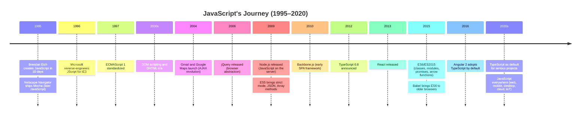

<Callout type="info" title="An optional deep dive">
This appendix is the long version of the history that
[The Birth of TypeScript](./birth-of-typescript) compresses into a
paragraph. Nothing later in the course depends on it — it's here for
readers who want the whole saga of how JavaScript grew from a
ten-day prototype into the substrate of modern software.
</Callout>

In 1995, the web was young. Websites were static documents — text, images, and hyperlinks. Netscape Communications, riding high on the success of its Navigator browser, saw an opportunity: what if pages could *respond* to the user? What if forms could validate themselves before submission? What if you could build interactive experiences without waiting for a server round-trip?

<IllustrationPrompt subject="Brendan Eich" photo />

Netscape hired a programmer named **Brendan Eich** and gave him ten days to create a scripting language that would run inside the browser. The constraints were tight: it had to be easy to learn, forgiving, and fast to prototype. It had to appeal to amateur programmers, not just systems engineers. It had to complement Java, Netscape's bet for "serious" programming on the web.

In May 1995, Eich delivered **Mocha** (soon renamed JavaScript), a small, dynamic language inspired by Scheme, Self, and Java. It was never meant to scale beyond a few hundred lines of form validation. It was a *prototype*, and it showed.

<svg
  viewBox="0 0 640 230"
  role="img"
  aria-label="Geological cross-section: sediment layers laid down era by era thicken into a tall wedge, a tiny lightning-bolt fossil rests in the oldest thin band, and a red fissure cracks the newest, heaviest layers — JavaScript's growth outpacing its scripting foundations"
  style={{ display: "block", width: "100%", maxWidth: "640px", height: "auto", margin: "2.5rem auto" }}
>
  <g fill="currentColor">
    <rect x="28" y="202" width="584" height="5" rx="2.5" opacity="0.25" />
    <circle cx="48" cy="36" r="3" opacity="0.18" />
    <circle cx="200" cy="52" r="2.5" opacity="0.18" />
    <circle cx="300" cy="30" r="3" opacity="0.18" />
    <circle cx="170" cy="196" r="3" opacity="0.3" />
    <circle cx="230" cy="180" r="3" opacity="0.3" />
    <circle cx="350" cy="166" r="3" opacity="0.3" />
  </g>
  <g style={{ color: "var(--ds-blue-500)" }} fill="currentColor">
    <path d="M40 202 L600 202 L600 182 C410 178 200 188 40 194 Z" fillOpacity="0.15" />
    <path d="M90 190.5 C260 185 430 179 600 182 L600 160 C430 156 270 168 90 190.5 Z" fillOpacity="0.24" />
    <path d="M160 184 C320 174 460 158 600 160 L600 136 C460 132 330 148 160 184 Z" fillOpacity="0.34" />
    <path d="M240 172 C380 156 480 134 600 136 L600 110 C490 106 390 124 240 172 Z" fillOpacity="0.48" />
    <path d="M330 158 C440 136 500 108 600 110 L600 82 C510 78 450 96 330 158 Z" fillOpacity="0.65" />
  </g>
  <g style={{ color: "var(--ds-yellow-500)" }} fill="currentColor">
    <path d="M100 188 L110 188 L104 194 L110 194 L97 204 L102 196 L96 196 Z" />
    <circle cx="84" cy="64" r="9" fillOpacity="0.8" />
  </g>
  <g style={{ color: "var(--ds-green-500)" }} fill="currentColor">
    <circle cx="402" cy="150" r="3.5" />
    <circle cx="416" cy="145" r="3.5" />
    <circle cx="430" cy="140" r="3.5" />
  </g>
  <g style={{ color: "var(--ds-red-500)" }} fill="currentColor">
    <path d="M556 84 L548 110 L558 134 L546 160 L554 184 L549 202 L559 202 L564 184 L556 160 L568 134 L558 110 L565 86 Z" fillOpacity="0.9" />
  </g>
</svg>

## The first decade: scripting toy to DOM workhorse

JavaScript's initial decade was marked by chaos. The language had quirks — `==` vs `===`, automatic semicolon insertion, the infamous `this` binding rules, a prototype chain that confused most programmers. But it had one killer advantage: it was *the only* language that ran in every browser.

By the early 2000s, JavaScript had evolved from a form-validation toy into the **DOM scripting** language. Developers used it to manipulate web pages dynamically, create dropdown menus, and animate elements. But the code was still small — a few script tags, maybe a thousand lines for a large site.

Then came the **AJAX revolution**. In 2004–2005, Google launched Gmail and Google Maps — web applications that felt like desktop software. They loaded once, then used `XMLHttpRequest` to fetch data in the background and update the UI without page reloads. Suddenly, JavaScript wasn't just a scripting language; it was the engine of single-page applications.

The **jQuery era** followed. jQuery, released in 2006, smoothed over browser inconsistencies and made DOM manipulation pleasant. Sites that once had 500 lines of JS now had 5,000. But they were still manageable. You could fit the whole codebase in your head.



## Node.js and the explosion

<IllustrationPrompt subject="Ryan Dahl" photo />

In 2009, **Ryan Dahl** unveiled **Node.js** at JSConf EU. JavaScript could now run *outside* the browser, on the server, in build tools, in command-line utilities. Suddenly, JavaScript was a general-purpose language. npm (Node Package Manager) became the largest package ecosystem in the world. Developers built REST APIs, real-time chat servers, build pipelines, and desktop apps (Electron) in JavaScript.

Codebases exploded. A modern web application might have:

- 50,000+ lines of frontend code (React, Vue, or Angular)
- 30,000+ lines of backend code (Express, Fastify, Nest)
- 200+ npm dependencies
- A dozen microservices
- Multiple teams across time zones

JavaScript went from a toy to the **lingua franca** of software development. It powered mobile apps (React Native), desktop apps (VS Code, Slack), IoT devices, and cloud functions. The language designed for form validation in 1995 was now the foundation of mission-critical systems processing billions of dollars in transactions.

## The maintainability crisis

As codebases grew, the cracks began to show. JavaScript's permissive nature — the same flexibility that made it easy to learn — became a liability at scale.

Consider this snippet:

<CodeBlock
  adapter="typescript"
  files={[
    {
      filename: "main.ts",
      starterCode: `// JavaScript's quirks can surprise you
console.log("5" + 3); // "53" (string concatenation)
console.log("5" - 3); // 2 (numeric subtraction!)
console.log(5 + null); // 5 (null coerces to 0)
console.log(5 + undefined); // NaN (undefined coerces to NaN)

// Accessing non-existent properties silently returns undefined
const user = { name: "Alice", age: 30 };
console.log(user.emial); // undefined — typo goes unnoticed!
`,
    },
  ]}
/>

Run that code. The output is *legal* JavaScript, but most of it is probably not what you wanted. The `"5" + 3` vs `"5" - 3` asymmetry trips up beginners and veterans alike. The `user.emial` typo doesn't throw an error — it just returns `undefined`, and your bug propagates through the system until some distant function calls `.toLowerCase()` on `undefined` and crashes at 3am.

These problems are manageable in a 1,000-line script. But in a 100,000-line application, split across dozens of modules, maintained by a rotating cast of developers, they become **catastrophic**.

Imagine refactoring a function signature:

```typescript
// Before:
function getUserDetails(id) {
  return database.query("SELECT * FROM users WHERE id = ?", id);
}

// After: you add a second parameter
function getUserDetails(id, includeOrders) {
  const user = database.query("SELECT * FROM users WHERE id = ?", id);
  if (includeOrders) {
    user.orders = database.query("SELECT * FROM orders WHERE user_id = ?", id);
  }
  return user;
}
```

In JavaScript, the **50 call sites** scattered across your codebase still compile and run. They just pass `undefined` for the second argument. Some code paths work. Some don't. You won't know until a user reports a bug — or worse, until data gets corrupted silently.

<svg
  viewBox="0 0 640 180"
  role="img"
  aria-label="A function bar gains a third yellow socket while the six caller chips below still supply only two filled dots each; in two of them the empty third slot glows red — call sites that silently break after a signature change"
  style={{ display: "block", width: "100%", maxWidth: "520px", height: "auto", margin: "2.5rem auto" }}
>
  <g style={{ color: "var(--ds-blue-500)" }} fill="currentColor">
    <rect x="240" y="20" width="160" height="36" rx="12" />
  </g>
  <g style={{ color: "var(--ds-yellow-500)" }} fill="currentColor">
    <circle cx="362" cy="38" r="7" />
  </g>
  <g fill="var(--ds-white)">
    <circle cx="278" cy="38" r="6" />
    <circle cx="320" cy="38" r="6" />
  </g>
  <g fill="currentColor" opacity="0.2">
    <circle cx="135" cy="92" r="2.5" />
    <circle cx="228" cy="92" r="2.5" />
    <circle cx="320" cy="92" r="2.5" />
    <circle cx="412" cy="92" r="2.5" />
    <circle cx="505" cy="92" r="2.5" />
    <rect x="62" y="118" width="76" height="30" rx="10" />
    <rect x="155" y="118" width="76" height="30" rx="10" />
    <rect x="248" y="118" width="76" height="30" rx="10" />
    <rect x="341" y="118" width="76" height="30" rx="10" />
    <rect x="434" y="118" width="76" height="30" rx="10" />
  </g>
  <g style={{ color: "var(--ds-blue-500)" }} fill="currentColor">
    <circle cx="82" cy="133" r="5" />
    <circle cx="100" cy="133" r="5" />
    <circle cx="175" cy="133" r="5" />
    <circle cx="193" cy="133" r="5" />
    <circle cx="268" cy="133" r="5" />
    <circle cx="286" cy="133" r="5" />
    <circle cx="361" cy="133" r="5" />
    <circle cx="379" cy="133" r="5" />
    <circle cx="454" cy="133" r="5" />
    <circle cx="472" cy="133" r="5" />
  </g>
  <g fill="currentColor" opacity="0.18">
    <circle cx="118" cy="133" r="5" />
    <circle cx="304" cy="133" r="5" />
    <circle cx="490" cy="133" r="5" />
  </g>
  <g style={{ color: "var(--ds-red-500)" }} fill="currentColor">
    <circle cx="211" cy="133" r="5" fillOpacity="0.85" />
    <circle cx="397" cy="133" r="5" fillOpacity="0.85" />
  </g>
</svg>

## The search for safety

By the early 2010s, large JavaScript projects were drowning in runtime errors that should have been caught at compile time:

- **Typos in property names** (`user.emial` instead of `user.email`)
- **Wrong number of arguments** to functions
- **Type mismatches** (passing a string to a function expecting a number)
- **Refactoring nightmares** (rename a function, miss a call site, ship a bug)

Teams tried workarounds:

- **JSDoc comments** (`/** @param {number} x */`) — but they weren't checked by anything
- **Unit tests** — but you can't test every code path
- **Linters** (JSHint, ESLint) — but they couldn't reason about types
- **Runtime assertions** (`if (typeof x !== 'number') throw new Error(...)`) — defensive and verbose

None of these solved the core problem: **JavaScript had no static type system**. The language couldn't tell you, before you ran the code, whether a variable was a string or a number, whether a function expected two arguments or three, whether an object had a `save()` method or not.

Developers craved the **autocomplete**, **refactoring safety**, and **early error detection** they'd seen in Java, C#, and other statically typed languages. They wanted the **flexibility** of JavaScript with the **rigor** of a compiler.

The stage was set for a new tool — one that would bring static types to JavaScript without breaking the millions of lines of JS already written. One that would let you adopt types gradually, module by module, file by file. One that would treat JavaScript as a first-class citizen, not a compilation target to be abandoned.

## The turning point

By 2012, JavaScript had conquered the world. But the codebases built on it were fragile. Refactoring was terrifying. Onboarding new developers took weeks because the implicit contracts — "this function expects a number, that one expects an object with `name` and `email` fields" — existed only in comments, wikis, and tribal knowledge.

The industry needed a way to make JavaScript **safe** without making it **different**. The solution would have to be *optional*, *gradual*, and *pragmatic*. It would have to compile to readable JavaScript so existing tooling still worked. It would have to integrate with editors so developers got instant feedback.

That solution, as you know from the rest of this course, was
**TypeScript** — the story told in
[The Birth of TypeScript](./birth-of-typescript), back where your
journey started.

---

<MultipleChoice
  markdown={`Why did JavaScript's maintainability problems worsen as codebases grew larger?

- JavaScript became slower over time
  > JavaScript's runtime performance actually improved dramatically over this period as V8 and other engines advanced; the problem was correctness and tooling, not speed.
- [o] The lack of static type checking made it hard to catch errors across many modules
  > In large codebases, typos, refactoring mistakes, and type mismatches that JavaScript can't catch at compile time lead to runtime bugs. The bigger the project, the harder it is to track these issues manually.
- Browsers stopped supporting older JavaScript features
  > Browsers continued to support legacy JavaScript features; the problem was JavaScript's inherent lack of type safety, not changing browser compatibility.
- JavaScript doesn't support asynchronous programming
  > JavaScript has supported asynchronous programming through callbacks, Promises, and async/await; asynchrony was not the source of the maintainability crisis described here.

As projects scale from 1,000 to 100,000+ lines of code, the inability to verify types, function signatures, and property names *before* running the code becomes a major source of bugs and fragility.`}
/>
