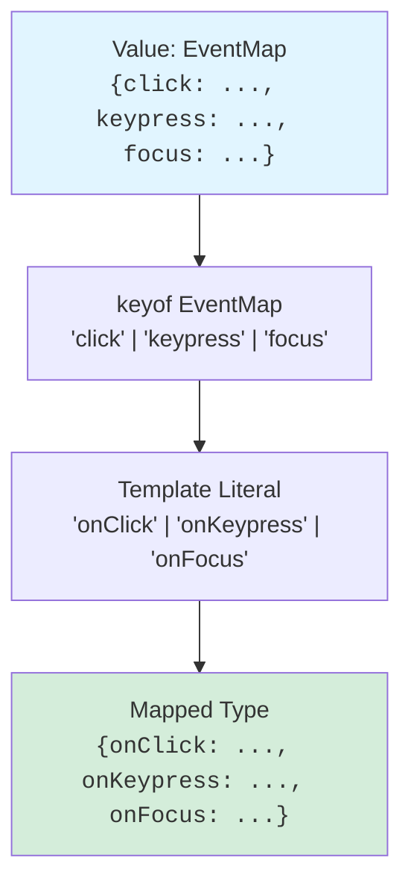

You've learned how to transform and filter types with [mapped and conditional types](./mapped-and-conditional-types). But where do types come from in the first place? Often, they come from *values* — runtime constants, configuration objects, or string literals. TypeScript gives you three powerful operators to bridge the gap between values and types:

1. **`keyof T`** — produces a union of an object type's keys.
2. **`typeof value`** — lifts a runtime value into the type world.
3. **Template literal types** — builds new string literal types from existing ones, with full string manipulation.

Together, these tools let you derive types from your code's structure, ensuring that types and values stay in sync automatically. You'll build event systems, configuration validators, and API contracts where the types are generated from your data, not manually duplicated.

<svg
  viewBox="0 0 640 230"
  role="img"
  aria-label="A cabinet wears three shaped keyholes — circle, square, and triangle — and the ring beside it holds exactly three matching keys, with only a dotted ghost where a fourth would hang — keyof lifts an object's true keys into a type, no more and no fewer"
  style={{ display: "block", width: "100%", maxWidth: "640px", height: "auto", margin: "2.5rem auto" }}
>
  <g style={{ color: "var(--ds-blue-500)" }} fill="currentColor">
    <rect x="80" y="40" width="200" height="160" rx="14" />
  </g>
  <g fill="var(--ds-white)">
    <circle cx="135" cy="85" r="14" />
    <rect x="191" y="71" width="28" height="28" rx="5" />
    <path d="M135 138 L151 166 L119 166 Z" />
  </g>
  <g fill="currentColor" opacity="0.45">
    <path d="M394 70 A26 26 0 1 1 446 70 A26 26 0 1 1 394 70 Z M400 70 A20 20 0 1 0 440 70 A20 20 0 1 0 400 70 Z" fillRule="evenodd" />
  </g>
  <g fill="currentColor" opacity="0.3">
    <circle cx="402" cy="104" r="2.5" />
    <circle cx="420" cy="101" r="2.5" />
    <circle cx="442" cy="104" r="2.5" />
  </g>
  <g style={{ color: "var(--ds-green-500)" }} fill="currentColor">
    <circle cx="390" cy="122" r="11" />
    <rect x="386" y="132" width="8" height="40" rx="3" />
    <rect x="394" y="158" width="8" height="6" rx="2" />
  </g>
  <g style={{ color: "var(--ds-yellow-500)" }} fill="currentColor">
    <rect x="409" y="112" width="22" height="22" rx="5" />
    <rect x="416" y="134" width="8" height="42" rx="3" />
    <rect x="424" y="162" width="8" height="6" rx="2" />
  </g>
  <g style={{ color: "var(--ds-blue-500)" }} fill="currentColor">
    <path d="M470 110 L483 132 L457 132 Z" />
    <rect x="466" y="132" width="8" height="40" rx="3" />
    <rect x="474" y="158" width="8" height="6" rx="2" />
  </g>
  <g fill="currentColor" opacity="0.18">
    <circle cx="540" cy="112" r="2.5" />
    <circle cx="550" cy="120" r="2.5" />
    <circle cx="552" cy="132" r="2.5" />
    <circle cx="546" cy="143" r="2.5" />
    <circle cx="534" cy="146" r="2.5" />
    <circle cx="526" cy="138" r="2.5" />
    <circle cx="526" cy="124" r="2.5" />
    <circle cx="540" cy="158" r="2.5" />
    <circle cx="540" cy="172" r="2.5" />
  </g>
</svg>

---

## `keyof T`: The Keys of a Type

The **`keyof`** operator takes an object type and produces a union of its keys (as string or number literal types).

<CodeBlock
  adapter="typescript"
  files={[
    {
      filename: "main.ts",
      starterCode: `type User = { id: number; name: string; email: string };

type UserKeys = keyof User;

const key1: UserKeys = "id"; // OK
const key2: UserKeys = "name"; // OK
// const key3: UserKeys = "age"; // Error: not a key of User
console.log(key1, key2);
`,
    },
  ]}
/>

`keyof User` resolves to `"id" | "name" | "email"`. This is useful when you want to accept any valid key of an object, but reject invalid ones:

<CodeBlock
  adapter="typescript"
  files={[
    {
      filename: "main.ts",
      starterCode: `type User = { id: number; name: string; email: string };

function getProperty<T, K extends keyof T>(obj: T, key: K): T[K] {
  return obj[key];
}

const user: User = { id: 1, name: "Alice", email: "alice@example.com" };
const name = getProperty(user, "name"); // Type: string
const id = getProperty(user, "id"); // Type: number
console.log(name, id);
`,
    },
  ]}
/>

Notice that `T[K]` is an **indexed access type**: the type of property `K` in `T`. Since `K extends keyof T`, TypeScript knows `K` is a valid key, and can look up its type.

---

## `typeof value`: From Values to Types

The **`typeof`** operator (in a type context) takes a runtime value and produces its type. This lets you derive types from constants, configuration objects, or function declarations.

<CodeBlock
  adapter="typescript"
  files={[
    {
      filename: "main.ts",
      starterCode: `const config = {
  apiUrl: "https://api.example.com",
  timeout: 5000,
  retries: 3,
};

type Config = typeof config;

const newConfig: Config = {
  apiUrl: "https://api2.example.com",
  timeout: 10000,
  retries: 5,
};

console.log(newConfig);
`,
    },
  ]}
/>

`typeof config` produces `{ apiUrl: string; timeout: number; retries: number }`. If you add or remove properties from `config`, the type automatically reflects the change.

<svg
  viewBox="0 0 640 190"
  role="img"
  aria-label="A solid green square on the ground projects a beam up through the dotted cloud line, where its hollow twin appears in the type sky — typeof lifts a runtime value into the world of types"
  style={{ display: "block", width: "100%", maxWidth: "460px", height: "auto", margin: "2.5rem auto" }}
>
  <g fill="currentColor" opacity="0.2">
    <rect x="100" y="170" width="440" height="4" rx="2" />
  </g>
  <g fill="currentColor" opacity="0.18">
    <circle cx="120" cy="92" r="2.5" />
    <circle cx="150" cy="92" r="2.5" />
    <circle cx="180" cy="92" r="2.5" />
    <circle cx="210" cy="92" r="2.5" />
    <circle cx="240" cy="92" r="2.5" />
    <circle cx="270" cy="92" r="2.5" />
    <circle cx="300" cy="92" r="2.5" />
    <circle cx="330" cy="92" r="2.5" />
    <circle cx="360" cy="92" r="2.5" />
    <circle cx="390" cy="92" r="2.5" />
    <circle cx="420" cy="92" r="2.5" />
    <circle cx="450" cy="92" r="2.5" />
    <circle cx="480" cy="92" r="2.5" />
    <circle cx="510" cy="92" r="2.5" />
  </g>
  <g style={{ color: "var(--ds-blue-500)" }} fill="currentColor">
    <path d="M282 170 L318 170 L342 36 L258 36 Z" fillOpacity="0.1" />
  </g>
  <g style={{ color: "var(--ds-green-500)" }} fill="currentColor">
    <rect x="282" y="134" width="36" height="36" rx="6" />
    <path d="M278 18 L322 18 L322 62 L278 62 Z M286 26 L314 26 L314 54 L286 54 Z" fillRule="evenodd" fillOpacity="0.55" />
  </g>
  <g style={{ color: "var(--ds-yellow-500)" }} fill="currentColor">
    <circle cx="560" cy="36" r="10" />
  </g>
</svg>

You can also use `typeof` with functions:

<CodeBlock
  adapter="typescript"
  files={[
    {
      filename: "main.ts",
      starterCode: `function greet(name: string): string {
  return \`Hello, \${name}!\`;
}

type GreetType = typeof greet;

const anotherGreet: GreetType = (name) => \`Hi, \${name}!\`;
console.log(anotherGreet("Alice"));
`,
    },
  ]}
/>

---

## Combining `keyof` and `typeof`

When you have a *value* (not a type), you can combine `typeof` and `keyof` to get its keys:

<CodeBlock
  adapter="typescript"
  files={[
    {
      filename: "main.ts",
      starterCode: `const routes = {
  home: "/",
  about: "/about",
  contact: "/contact",
};

type RouteKey = keyof typeof routes;

const key: RouteKey = "home"; // OK
// const invalid: RouteKey = "profile"; // Error
console.log(key);
`,
    },
  ]}
/>

Here, `typeof routes` lifts the object into a type, and `keyof` extracts `"home" | "about" | "contact"`. This pattern is common for configuration objects, enums, and lookup tables.

---

## Template Literal Types

TypeScript 4.1 introduced **template literal types**, which let you construct new string literal types by interpolating existing types. The syntax mirrors JavaScript template literals:

<CodeBlock
  adapter="typescript"
  files={[
    {
      filename: "main.ts",
      starterCode: `type Greeting = "Hello" | "Hi";
type Name = "Alice" | "Bob";

type Message = \`\${Greeting}, \${Name}!\`;

const msg1: Message = "Hello, Alice!"; // OK
const msg2: Message = "Hi, Bob!"; // OK
// const msg3: Message = "Hey, Alice!"; // Error: "Hey" is not in Greeting
console.log(msg1, msg2);
`,
    },
  ]}
/>

When you interpolate a union, TypeScript distributes over it, producing all combinations:

<svg
  viewBox="0 0 640 200"
  role="img"
  aria-label="Two blue prefix chips cross three yellow suffix chips in a small multiplication table, minting six two-tone combination chips — a template literal type generates every pairing automatically"
  style={{ display: "block", width: "100%", maxWidth: "480px", height: "auto", margin: "2.5rem auto" }}
>
  <g style={{ color: "var(--ds-yellow-500)" }} fill="currentColor">
    <rect x="210" y="24" width="64" height="24" rx="12" />
    <rect x="306" y="24" width="64" height="24" rx="12" />
    <rect x="402" y="24" width="64" height="24" rx="12" />
  </g>
  <g style={{ color: "var(--ds-blue-500)" }} fill="currentColor">
    <rect x="90" y="84" width="64" height="24" rx="12" />
    <rect x="90" y="144" width="64" height="24" rx="12" />
  </g>
  <g fill="currentColor" opacity="0.2">
    <circle cx="180" cy="36" r="3" />
    <circle cx="180" cy="96" r="3" />
    <circle cx="180" cy="156" r="3" />
  </g>
  <g style={{ color: "var(--ds-blue-500)" }} fill="currentColor">
    <path d="M222 84 L242 84 L242 108 L222 108 A12 12 0 0 1 222 84 Z" />
    <path d="M318 84 L338 84 L338 108 L318 108 A12 12 0 0 1 318 84 Z" />
    <path d="M414 84 L434 84 L434 108 L414 108 A12 12 0 0 1 414 84 Z" />
    <path d="M222 144 L242 144 L242 168 L222 168 A12 12 0 0 1 222 144 Z" />
    <path d="M318 144 L338 144 L338 168 L318 168 A12 12 0 0 1 318 144 Z" />
    <path d="M414 144 L434 144 L434 168 L414 168 A12 12 0 0 1 414 144 Z" />
  </g>
  <g style={{ color: "var(--ds-yellow-500)" }} fill="currentColor">
    <path d="M242 84 L262 84 A12 12 0 0 1 262 108 L242 108 Z" />
    <path d="M338 84 L358 84 A12 12 0 0 1 358 108 L338 108 Z" />
    <path d="M434 84 L454 84 A12 12 0 0 1 454 108 L434 108 Z" />
    <path d="M242 144 L262 144 A12 12 0 0 1 262 168 L242 168 Z" />
    <path d="M338 144 L358 144 A12 12 0 0 1 358 168 L338 168 Z" />
    <path d="M434 144 L454 144 A12 12 0 0 1 454 168 L434 168 Z" />
  </g>
</svg>

<CodeBlock
  adapter="typescript"
  files={[
    {
      filename: "main.ts",
      starterCode: `type Event = "click" | "focus" | "blur";

type EventHandler = \`on\${Event}\`;

const handler1: EventHandler = "onclick"; // OK
const handler2: EventHandler = "onfocus"; // OK
// const handler3: EventHandler = "onhover"; // Error
console.log(handler1, handler2);
`,
    },
  ]}
/>

---

## Intrinsic String Manipulation Types

TypeScript provides four built-in utility types for manipulating string literals:

- **`Uppercase<S>`** — converts `S` to uppercase.
- **`Lowercase<S>`** — converts `S` to lowercase.
- **`Capitalize<S>`** — capitalizes the first character.
- **`Uncapitalize<S>`** — lowercases the first character.

<CodeBlock
  adapter="typescript"
  files={[
    {
      filename: "main.ts",
      starterCode: `type LoudGreeting = Uppercase<"hello">;
type QuietGreeting = Lowercase<"HELLO">;
type Capitalized = Capitalize<"typescript">;
type Uncapitalized = Uncapitalize<"TypeScript">;

const loud: LoudGreeting = "HELLO";
const quiet: QuietGreeting = "hello";
const cap: Capitalized = "Typescript";
const uncap: Uncapitalized = "typeScript";

console.log(loud, quiet, cap, uncap);
`,
    },
  ]}
/>

These are especially useful in template literals:

<CodeBlock
  adapter="typescript"
  files={[
    {
      filename: "main.ts",
      starterCode: `type Event = "click" | "focus";

type EventHandler = \`on\${Capitalize<Event>}\`;

const handler1: EventHandler = "onClick"; // OK
const handler2: EventHandler = "onFocus"; // OK
console.log(handler1, handler2);
`,
    },
  ]}
/>

---

## Practical Example: Type-Safe Event Handlers

Let's build a type-safe event system where handler names are derived from event names:

<CodeBlock
  adapter="typescript"
  files={[
    {
      filename: "main.ts",
      starterCode: `type EventMap = {
  click: { x: number; y: number };
  keypress: { key: string };
  focus: { elementId: string };
};

type EventName = keyof EventMap;

type HandlerName<E extends EventName> = \`on\${Capitalize<E>}\`;

type Handlers = {
  [E in EventName as HandlerName<E>]: (payload: EventMap[E]) => void;
};

const handlers: Handlers = {
  onClick: (payload) => console.log("Clicked at", payload.x, payload.y),
  onKeypress: (payload) => console.log("Key pressed:", payload.key),
  onFocus: (payload) => console.log("Focused element:", payload.elementId),
};

handlers.onClick({ x: 10, y: 20 });
handlers.onKeypress({ key: "Enter" });
handlers.onFocus({ elementId: "input-1" });
`,
    },
  ]}
/>

Notice how:
1. `EventMap` defines the payload types for each event.
2. `HandlerName<E>` transforms event names (`"click"`) into handler names (`"onClick"`).
3. The mapped type `Handlers` iterates over event names and remaps them to handler names, assigning each a function type that accepts the correct payload.

This pattern ensures that if you add a new event to `EventMap`, the corresponding handler is automatically required in `Handlers`, with the correct payload type. No manual duplication.

---

## Filtering Keys by Value Type

You can combine `keyof`, template literals, and conditional types to filter keys based on their value types. For example, extracting only the string properties:

<CodeBlock
  adapter="typescript"
  files={[
    {
      filename: "main.ts",
      starterCode: `type User = {
  id: number;
  name: string;
  email: string;
  active: boolean;
};

type StringKeys<T> = {
  [K in keyof T]: T[K] extends string ? K : never;
}[keyof T];

type UserStringKeys = StringKeys<User>;

const key1: UserStringKeys = "name"; // OK
const key2: UserStringKeys = "email"; // OK
// const key3: UserStringKeys = "id"; // Error
console.log(key1, key2);
`,
    },
  ]}
/>

Here's how it works:
1. The mapped type produces `{ id: never; name: "name"; email: "email"; active: never }`.
2. Indexing with `[keyof T]` extracts the values: `never | "name" | "email" | never`.
3. `never` vanishes from the union, leaving `"name" | "email"`.

---

## Challenge: Build `EventHandlerMap<T>`

<ChallengeCard
  adapter="typescript"
  title="EventHandlerMap<T>"
  instructions={`Given an event map like \`{ click: {...}, focus: {...} }\`, build a type that maps each event name to a handler function name (prefixed with \`on\` and capitalized), with the correct payload type.

For example:
\`\`\`ts
type Events = { click: { x: number }; focus: { id: string } };
type Handlers = EventHandlerMap<Events>;
// Result: { onClick: (payload: { x: number }) => void; onFocus: (payload: { id: string }) => void }
\`\`\`

**Hints**:
- Use a mapped type with key remapping: \`[E in keyof T as ...]\`.
- Use a template literal to build the handler name: \`\`on\${Capitalize<E>}\`\`.
- The value type should be a function \`(payload: T[E]) => void\`.`}
  files={[
    {
      filename: "main.ts",
      starterCode: `// Replace the right-hand side with a key-remapping mapped type
type EventHandlerMap<T> = T;

type Events = { click: { x: number }; focus: { id: string } };
type Handlers = EventHandlerMap<Events>;

const handlers: Handlers = {
  onClick: (payload) => console.log("Clicked at", payload.x),
  onFocus: (payload) => console.log("Focused:", payload.id),
};

handlers.onClick({ x: 10 });
handlers.onFocus({ id: "input-1" });
`,
      solutionCode: `type EventHandlerMap<T> = {
  [E in keyof T as \`on\${Capitalize<string & E>}\`]: (payload: T[E]) => void;
};

type Events = { click: { x: number }; focus: { id: string } };
type Handlers = EventHandlerMap<Events>;

const handlers: Handlers = {
  onClick: (payload) => console.log("Clicked at", payload.x),
  onFocus: (payload) => console.log("Focused:", payload.id),
};

handlers.onClick({ x: 10 });
handlers.onFocus({ id: "input-1" });
`,
    },
  ]}
  tests={[
    {
      id: "t1",
      name: "Generates correct handler names",
      description: "onClick and onFocus exist",
      code: `type Events = { click: { x: number }; focus: { id: string } };
type Handlers = EventHandlerMap<Events>;
const h: Handlers = {
  onClick: (p) => {},
  onFocus: (p) => {},
};
if (!h.onClick || !h.onFocus) throw new Error("Handler names incorrect");`,
    },
  ]}
/>

---

## Multiple Choice: `keyof typeof`

<MultipleChoice
  markdown={`Given:
\`\`\`ts
const colors = { red: "#f00", green: "#0f0", blue: "#00f" };
type ColorName = keyof typeof colors;
\`\`\`
What is \`ColorName\`?

- \`string\`
  > \`keyof\` produces a union of literal types, not the broad \`string\` type.
- [o] \`"red" | "green" | "blue"\`
  > \`typeof colors\` lifts the object to a type, and \`keyof\` extracts its keys as a union.
- \`"#f00" | "#0f0" | "#00f"\`
  > Those are the *values*, not the keys.

This pattern is essential for deriving types from configuration objects.`}
/>

---

## Multiple Choice: Template Literal Distribution

<MultipleChoice
  markdown={`Given:
\`\`\`ts
type Prefix = "get" | "set";
type Prop = "Name" | "Age";
type Combined = \`\${Prefix}\${Prop}\`;
\`\`\`
How many string literal types does \`Combined\` contain?

- 2
  > Template literals distribute over unions, producing the Cartesian product.
- [o] 4
  > The result is \`"getName" | "getAge" | "setName" | "setAge"\`. Each \`Prefix\` is combined with each \`Prop\`.
- 8
  > There are only 2 prefixes and 2 props, so 2 × 2 = 4 combinations.

Template literals distribute over unions, creating all possible combinations.`}
/>

---

## Summary

You've learned how to:
- Use **`keyof T`** to extract a union of object keys.
- Use **`typeof value`** to lift runtime values into the type world.
- Combine `keyof` and `typeof` to derive types from configuration objects.
- Build new string literal types with **template literals**.
- Manipulate strings with **`Uppercase`, `Lowercase`, `Capitalize`, `Uncapitalize`**.
- Create type-safe mappings between related string-based concepts (events → handlers).

These tools let you write types that are *computed* from your code's structure, rather than manually maintained in parallel. When you change a configuration object or add a new event, the types update automatically — the compiler becomes your co-maintainer.

---

**Next**: [Branded Types](./branded-types) — adding nominal typing to TypeScript's structural system to prevent mixing semantically distinct values.
