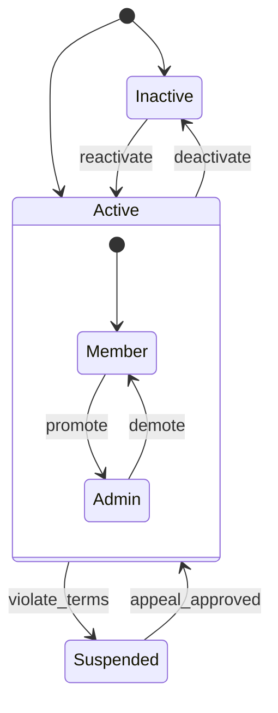

The difference between mediocre TypeScript and great TypeScript often comes down to **how you model your domain**. A well-designed type system doesn't just catch typos, it makes *entire classes of bugs impossible*. This is the idea behind **making illegal states unrepresentable**: if a combination of values doesn't make sense in your domain, the type system shouldn't allow it to exist.

This chapter is the capstone of type-driven design. We'll take sloppy, bug-prone type definitions and evolve them into precise, self-documenting structures that use discriminated unions, literal types, and careful narrowing to eliminate invalid states. By the end, you'll see how the compiler can enforce your business logic at compile time, long before any code runs.

<Figure
  slug="tsx-modeling-domains-cutout"
  alt="A socket board on a platform where every impossible pairing of tokens is physically blocked from fitting"
/>

## The problem: boolean soup

Let's start with a common anti-pattern. Suppose you're modeling a user in a multi-tenant application:

```ts
// ❌ Bad: allows nonsensical combinations
type User = {
  id: string;
  name: string;
  isActive: boolean;
  isAdmin: boolean;
  isSuspended: boolean;
  suspensionReason: string | null;
};
```

At first glance, this looks fine. But think about the combinations it allows:

- `isActive: true, isSuspended: true`, Is the user active or suspended? Both?
- `isSuspended: false, suspensionReason: "Violated terms"`, The user isn't suspended, but there's a suspension reason?
- `isAdmin: true, isActive: false`, An inactive admin? Does that mean they still have admin privileges?

These are **illegal states**: combinations that don't make sense in your domain. The type system isn't helping you, it's allowing garbage in, and you'll have to write defensive code everywhere to check for these contradictions.

<CodeBlock
  adapter="typescript"
  files={[
    {
      filename: "main.ts",
      starterCode: `// The bad model
type BadUser = {
  id: string;
  name: string;
  isActive: boolean;
  isAdmin: boolean;
  isSuspended: boolean;
  suspensionReason: string | null;
};

// Now we have to check for nonsense at runtime
function canAccessAdmin(user: BadUser): boolean {
  if (user.isSuspended) {
    console.log("User is suspended, no admin access");
    return false;
  }
  if (!user.isActive) {
    console.log("User is inactive, no admin access");
    return false;
  }
  if (user.isAdmin) {
    console.log("User has admin access");
    return true;
  }
  console.log("User is not an admin");
  return false;
}

// We can create nonsensical states
const messyUser: BadUser = {
  id: "u123",
  name: "Alice",
  isActive: true,
  isAdmin: true,
  isSuspended: true, // ❌ Active AND suspended?
  suspensionReason: null, // ❌ Suspended but no reason?
};

canAccessAdmin(messyUser);
`,
    },
  ]}
/>

The function `canAccessAdmin` has to guard against impossible states. This is a sign your types aren't pulling their weight.

## The solution: discriminated unions

The fix is to model the user's **status** as a discriminated union. A user can be in exactly one state at a time: active, suspended, or inactive. Each state carries its own data.

<CodeBlock
  adapter="typescript"
  files={[
    {
      filename: "main.ts",
      starterCode: `type UserStatus =
  | { status: "active"; role: "member" | "admin" }
  | { status: "suspended"; reason: string }
  | { status: "inactive" };

type GoodUser = {
  id: string;
  name: string;
  statusInfo: UserStatus;
};

function canAccessAdmin(user: GoodUser): boolean {
  switch (user.statusInfo.status) {
    case "active":
      if (user.statusInfo.role === "admin") {
        console.log("User has admin access");
        return true;
      }
      console.log("User is not an admin");
      return false;
    case "suspended":
      console.log(\`User is suspended: \${user.statusInfo.reason}\`);
      return false;
    case "inactive":
      console.log("User is inactive");
      return false;
    default:
      const _exhaustive: never = user.statusInfo;
      return _exhaustive;
  }
}

// Now illegal states are unrepresentable
const alice: GoodUser = {
  id: "u123",
  name: "Alice",
  statusInfo: { status: "active", role: "admin" },
};

const bob: GoodUser = {
  id: "u456",
  name: "Bob",
  statusInfo: { status: "suspended", reason: "Violated terms" },
};

console.log("Alice:", canAccessAdmin(alice));
console.log("Bob:", canAccessAdmin(bob));
`,
    },
  ]}
/>

Now the compiler enforces that:

- An `"active"` user always has a `role` (member or admin).
- A `"suspended"` user always has a `reason`.
- An `"inactive"` user has neither, just the status.

You can't create a user who is both active and suspended. You can't forget the suspension reason. The type system has encoded your business logic.



<Callout type="success" title="Encode invariants in types">
Whenever you find yourself writing comments like "if isSuspended is true, suspensionReason must not be null," that's a sign you should encode the invariant in the type system instead. Use a discriminated union to make the valid combinations explicit and the invalid ones impossible.
</Callout>

## Evolving a sloppy type: the Order example

Let's walk through a more complex example: an e-commerce order. The naive version uses optional fields:

```ts
// ❌ Bad: optional fields create ambiguity
type SloppyOrder = {
  id: string;
  items: Array<{ productId: string; quantity: number }>;
  status: "draft" | "submitted" | "paid" | "shipped" | "cancelled";
  paymentId?: string;
  shippingAddress?: string;
  trackingNumber?: string;
  cancellationReason?: string;
};
```

This allows nonsense like:

- `status: "draft", paymentId: "pay123"`, A draft with a payment ID?
- `status: "shipped", trackingNumber: undefined`, Shipped but no tracking?
- `status: "paid", cancellationReason: "Out of stock"`, Paid *and* cancelled?

The type is too loose. Let's tighten it with a discriminated union:

<CodeBlock
  adapter="typescript"
  entryFilename="main.ts"
  files={[
    {
      filename: "main.ts",
      starterCode: `import { Order, summarize } from "./order";

const draft: Order = {
  id: "ord-001",
  items: [{ productId: "p1", quantity: 2 }],
  state: { status: "draft" },
};

const submitted: Order = {
  id: "ord-002",
  items: [{ productId: "p2", quantity: 1 }],
  state: { status: "submitted", shippingAddress: "123 Main St" },
};

const paid: Order = {
  id: "ord-003",
  items: [{ productId: "p3", quantity: 3 }],
  state: {
    status: "paid",
    paymentId: "pay-789",
    shippingAddress: "456 Oak Ave",
  },
};

const shipped: Order = {
  id: "ord-004",
  items: [{ productId: "p4", quantity: 1 }],
  state: {
    status: "shipped",
    paymentId: "pay-101",
    shippingAddress: "789 Elm St",
    trackingNumber: "TRK-555",
  },
};

const cancelled: Order = {
  id: "ord-005",
  items: [{ productId: "p5", quantity: 2 }],
  state: { status: "cancelled", reason: "Out of stock" },
};

console.log(summarize(draft));
console.log(summarize(submitted));
console.log(summarize(paid));
console.log(summarize(shipped));
console.log(summarize(cancelled));
`,
    },
    {
      filename: "order.ts",
      starterCode: `type OrderItem = {
  productId: string;
  quantity: number;
};

type OrderState =
  | { status: "draft" }
  | { status: "submitted"; shippingAddress: string }
  | { status: "paid"; paymentId: string; shippingAddress: string }
  | {
      status: "shipped";
      paymentId: string;
      shippingAddress: string;
      trackingNumber: string;
    }
  | { status: "cancelled"; reason: string };

export type Order = {
  id: string;
  items: OrderItem[];
  state: OrderState;
};

export function summarize(order: Order): string {
  const itemCount = order.items.reduce((sum, item) => sum + item.quantity, 0);
  const prefix = \`Order \${order.id} (\${itemCount} items)\`;

  switch (order.state.status) {
    case "draft":
      return \`\${prefix}: Draft\`;
    case "submitted":
      return \`\${prefix}: Submitted to \${order.state.shippingAddress}\`;
    case "paid":
      return \`\${prefix}: Paid (payment: \${order.state.paymentId})\`;
    case "shipped":
      return \`\${prefix}: Shipped (tracking: \${order.state.trackingNumber})\`;
    case "cancelled":
      return \`\${prefix}: Cancelled (\${order.state.reason})\`;
    default:
      const _exhaustive: never = order.state;
      return _exhaustive;
  }
}
`,
    },
  ]}
/>

Now each state carries exactly the data it needs:

- `"draft"`: No extra fields.
- `"submitted"`: Has a `shippingAddress` (required to submit).
- `"paid"`: Has both `paymentId` and `shippingAddress`.
- `"shipped"`: Has `paymentId`, `shippingAddress`, and `trackingNumber`.
- `"cancelled"`: Has a `reason`.

You can't forget the tracking number when marking an order as shipped. You can't have a draft with a payment ID. The compiler enforces the business logic.

<Callout type="info" title="Redundancy is fine">
Notice that `shippingAddress` appears in multiple variants. That's okay! Each variant is self-contained. The alternative, trying to share fields with inheritance or intersection types, often leads to more complexity than it's worth.
</Callout>

## Replacing booleans with variants

Booleans are often a code smell. If you see a boolean flag that changes the meaning of other fields, consider replacing it with a discriminated union.

**Before:**

```ts
type PaymentMethod = {
  isCreditCard: boolean;
  cardNumber?: string; // only if isCreditCard is true
  bankAccount?: string; // only if isCreditCard is false
};
```

**After:**

```ts
type PaymentMethod =
  | { type: "credit-card"; cardNumber: string }
  | { type: "bank-account"; accountNumber: string };
```

The `type` discriminant replaces the boolean, and now the compiler knows which field to expect.

<CodeBlock
  adapter="typescript"
  files={[
    {
      filename: "main.ts",
      starterCode: `type PaymentMethod =
  | { type: "credit-card"; cardNumber: string; cvv: string }
  | { type: "bank-account"; accountNumber: string; routingNumber: string }
  | { type: "paypal"; email: string };

function processPayment(method: PaymentMethod, amount: number): string {
  switch (method.type) {
    case "credit-card":
      return \`Charged \${amount} to card ending in \${method.cardNumber.slice(-4)}\`;
    case "bank-account":
      return \`Debited \${amount} from account \${method.accountNumber}\`;
    case "paypal":
      return \`Sent \${amount} to PayPal account \${method.email}\`;
    default:
      const _exhaustive: never = method;
      return _exhaustive;
  }
}

console.log(
  processPayment(
    { type: "credit-card", cardNumber: "4111111111111111", cvv: "123" },
    99.99,
  ),
);
console.log(
  processPayment(
    { type: "bank-account", accountNumber: "123456", routingNumber: "987654" },
    50.0,
  ),
);
console.log(
  processPayment({ type: "paypal", email: "alice@example.com" }, 25.0),
);
`,
    },
  ]}
/>

Each payment method is a distinct variant with its own fields. No optional properties, no runtime checks for "is this a credit card or a bank account?", the type tells you.

## Literal types for constrained values

Sometimes a field can only take a few valid values. Use **literal types** instead of unconstrained strings or numbers.

<CodeBlock
  adapter="typescript"
  files={[
    {
      filename: "main.ts",
      starterCode: `type Priority = "low" | "medium" | "high" | "urgent";

type Task = {
  id: string;
  title: string;
  priority: Priority; // not just 'string'
};

function escalate(task: Task): Task {
  const nextPriority: Record<Priority, Priority> = {
    low: "medium",
    medium: "high",
    high: "urgent",
    urgent: "urgent", // already max
  };

  return {
    ...task,
    priority: nextPriority[task.priority],
  };
}

let task: Task = { id: "t1", title: "Fix bug", priority: "low" };
console.log("Initial priority:", task.priority);

task = escalate(task);
console.log("After escalation:", task.priority);

task = escalate(task);
console.log("After another escalation:", task.priority);
`,
    },
  ]}
/>

If you used `priority: string`, the compiler wouldn't catch typos like `"urgent!"` or `"URGENT"`. The literal union restricts the value to the valid set, and the compiler verifies exhaustiveness when you map over them.

## Challenge: Refining a weak model

Now it's your turn. You'll take a sloppy type and refine it into a discriminated union that makes illegal states unrepresentable.

<ChallengeCard
  adapter="typescript"
  title="Refining a BlogPost model"
  instructions={`You're modeling blog posts. The current \`BadPost\` type uses optional fields, allowing nonsense like a draft with a published date or a published post with no slug.

**Your tasks:**
1. In \`post.ts\`, define a \`PostState\` discriminated union with three variants:
   - \`"draft"\`: no extra fields
   - \`"published"\`: requires \`slug: string\` and \`publishedAt: number\`
   - \`"archived"\`: requires \`archivedAt: number\`
2. Define a \`Post\` type with \`id\`, \`title\`, and \`state: PostState\`.
3. In \`main.ts\`, implement \`describePost\` to return a formatted string for each state.
4. The tests will verify all three states render correctly.`}
  entryFilename="main.ts"
  files={[
    {
      filename: "main.ts",
      starterCode: `import { Post } from "./post";

export function describePost(post: Post): string {
  // TODO: switch on post.state.status and return a formatted string
  return "";
}

const draft: Post = {
  id: "p1",
  title: "My Draft",
  state: { status: "draft" },
};

const published: Post = {
  id: "p2",
  title: "Published Article",
  state: {
    status: "published",
    slug: "published-article",
    publishedAt: Date.now(),
  },
};

const archived: Post = {
  id: "p3",
  title: "Old Post",
  state: { status: "archived", archivedAt: Date.now() - 86400000 },
};

console.log(describePost(draft));
console.log(describePost(published));
console.log(describePost(archived));
`,
      solutionCode: `import { Post } from "./post";

export function describePost(post: Post): string {
  switch (post.state.status) {
    case "draft":
      return \`\${post.title} (draft)\`;
    case "published":
      return \`\${post.title} (published at /\${post.state.slug})\`;
    case "archived":
      return \`\${post.title} (archived)\`;
    default:
      const _exhaustive: never = post.state;
      return _exhaustive;
  }
}

const draft: Post = {
  id: "p1",
  title: "My Draft",
  state: { status: "draft" },
};

const published: Post = {
  id: "p2",
  title: "Published Article",
  state: {
    status: "published",
    slug: "published-article",
    publishedAt: Date.now(),
  },
};

const archived: Post = {
  id: "p3",
  title: "Old Post",
  state: { status: "archived", archivedAt: Date.now() - 86400000 },
};

console.log(describePost(draft));
console.log(describePost(published));
console.log(describePost(archived));
`,
    },
    {
      filename: "post.ts",
      starterCode: `// TODO: Define PostState as a discriminated union
type PostState = { status: "draft" };

export type Post = {
  id: string;
  title: string;
  state: PostState;
};
`,
      solutionCode: `type PostState =
  | { status: "draft" }
  | { status: "published"; slug: string; publishedAt: number }
  | { status: "archived"; archivedAt: number };

export type Post = {
  id: string;
  title: string;
  state: PostState;
};
`,
    },
  ]}
  tests={[
    {
      id: "draft",
      name: "Describes draft post",
      description: "describePost(draft) includes 'draft'",
      code: `
        const { describePost } = require("./main");
        const draft = { id: "p1", title: "Test", state: { status: "draft" } };
        const result = describePost(draft);
        if (!result.includes("draft")) {
          throw new Error(\`Expected 'draft', got: \${result}\`);
        }
      `,
    },
    {
      id: "published",
      name: "Describes published post with slug",
      description: "describePost(published) includes the slug",
      code: `
        const { describePost } = require("./main");
        const published = { id: "p2", title: "Article", state: { status: "published", slug: "my-slug", publishedAt: 123 } };
        const result = describePost(published);
        if (!result.includes("my-slug")) {
          throw new Error(\`Expected 'my-slug' in result, got: \${result}\`);
        }
      `,
    },
    {
      id: "archived",
      name: "Describes archived post",
      description: "describePost(archived) includes 'archived'",
      code: `
        const { describePost } = require("./main");
        const archived = { id: "p3", title: "Old", state: { status: "archived", archivedAt: 456 } };
        const result = describePost(archived);
        if (!result.includes("archived")) {
          throw new Error(\`Expected 'archived', got: \${result}\`);
        }
      `,
    },
  ]}
/>

## Multiple choice check

<MultipleChoice
  markdown={`You're modeling a feature flag with three possible states: *disabled*, *enabled for everyone*, or *enabled for a specific percentage of users* (only this last state carries a percentage value).

Which type definition makes illegal states **unrepresentable**?

- \`type Flag = { enabled: boolean; percentage?: number }\`
  > This allows \`enabled: false, percentage: 50\` (disabled but with a percentage?) and \`enabled: true, percentage: undefined\` (enabled for everyone, or for a percentage that wasn't given?). The type is ambiguous.
- [o] \`type Flag = { kind: "disabled" } | { kind: "enabled-all" } | { kind: "enabled-percentage"; percentage: number }\`
  > Each state is a distinct variant. Disabled has no percentage, enabled-all has no percentage, and enabled-percentage requires a percentage. Illegal states cannot be represented.
- \`type Flag = { kind: "disabled" | "enabled-all" | "enabled-percentage"; percentage?: number }\`
  > This allows \`kind: "disabled", percentage: 50\` (disabled but with a percentage?). The discriminant and the optional field are independent, so invalid combinations are possible.

Discriminated unions eliminate ambiguity by making each state explicit and self-contained. If a field only makes sense in one state, include it in that state's variant, not as a shared optional field.`}
/>

## Principles of domain modeling

As you design types for your application, keep these principles in mind:

1. **Make illegal states unrepresentable.** If two fields are mutually exclusive, don't use booleans or optionals, use a discriminated union.
2. **Use literal types for constrained values.** If a field can only be `"low" | "medium" | "high"`, don't type it as `string`.
3. **Encode business rules in types.** If a shipped order must have a tracking number, put `trackingNumber` in the `"shipped"` variant, not as an optional field on the base type.
4. **Avoid boolean soup.** Multiple booleans (`isX`, `isY`, `isZ`) are usually a sign you need a discriminated union.
5. **Prefer specificity over flexibility.** It's better to have a type that's "too narrow" and refine it later than to have a type that's "too loose" and allows garbage.

<Callout type="warning" title="Balance precision and pragmatism">
Don't go overboard. If a field genuinely is optional in all contexts (like a user's middle name), use `middleName?: string`. The goal isn't to eliminate every `?` or `| null`, it's to eliminate *invalid combinations* of fields that represent logically impossible states.
</Callout>

## Recap

Type-driven design is about encoding your domain's invariants in the type system so the compiler can enforce them. When you model states, events, commands, or any other variant data, use **discriminated unions** to make each case explicit. When you have constrained values, use **literal types** to restrict the valid set. When you see optional fields that only make sense in certain states, factor them into state-specific variants.

The payoff is massive: fewer runtime checks, better autocomplete, clearer code, and entire categories of bugs that become compile-time errors. When you add a new variant, every `switch` that handles the union lights up with an error until you handle the new case. The compiler becomes your refactoring partner.

**Key takeaways:**

- **Make illegal states unrepresentable.** Use discriminated unions to model mutually exclusive states.
- **Replace booleans with variants.** If a boolean changes the meaning of other fields, use a discriminant instead.
- **Use literal types for constrained values.** `"low" | "medium" | "high"` is better than `string`.
- **Exhaustiveness checking:** Add `const _exhaustive: never = x` in the default case to catch missing variants.

Next up: [Generics Basics](./generics-basics), where we explore how to write reusable, type-safe code that works with any type, without losing type information to `any`.
