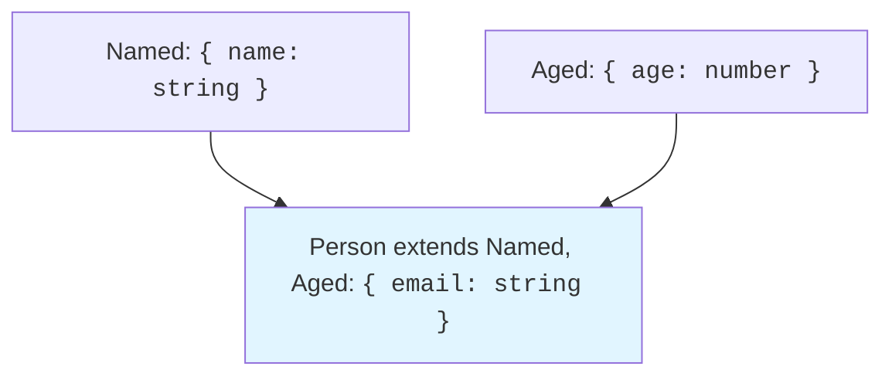

Objects are the workhorses of JavaScript, key-value maps that bundle
related data and behavior. TypeScript brings *structure* to these bundles
by letting you declare the **shape** of an object: which properties it
has, what type each property holds, whether a property is optional or
readonly. The compiler then enforces this shape everywhere the object is
used, catching typos, missing properties, and type mismatches before they
reach production.

This chapter covers **object type literals**, **interfaces**, the
difference between `interface` and `type`, and how TypeScript's
**structural type system** makes objects compatible based on their shape,
not their declared name.

<Figure
  slug="tsx-objects-interfaces-cutout"
  alt="A contract plate on a platform describing three sockets, an object block resting on it matching each one"
/>

## Object type literals

The simplest way to type an object is an **object type literal**, a
curly-brace block listing the property names and their types:

<CodeBlock
  adapter="typescript"
  files={[
    {
      filename: "main.ts",
      starterCode: `const point: { x: number; y: number } = { x: 10, y: 20 };

console.log("point:", point);
console.log("x:", point.x);
console.log("y:", point.y);
`,
    },
  ]}
/>

**What the compiler now knows:** `point` has exactly two properties, `x`
and `y`, both `number`s. If you write `point.z`, the compiler rejects it,
`z` does not exist on type `{ x: number; y: number }`.

You can nest object types arbitrarily:

<CodeBlock
  adapter="typescript"
  files={[
    {
      filename: "main.ts",
      starterCode: `const user: {
  name: string;
  age: number;
  address: {
    street: string;
    city: string;
  };
} = {
  name: "Alice",
  age: 30,
  address: {
    street: "123 Main St",
    city: "Wonderland",
  },
};

console.log("user:", user);
console.log("city:", user.address.city);
`,
    },
  ]}
/>

Object type literals are useful for one-off types (like function
parameters), but they quickly become verbose. That's where `interface`
and `type` aliases come in.

## Interfaces: naming object shapes

An **interface** is a named object type. You declare it once, then reuse
the name wherever you need that shape:

<CodeBlock
  adapter="typescript"
  files={[
    {
      filename: "main.ts",
      starterCode: `interface Point {
  x: number;
  y: number;
}

const origin: Point = { x: 0, y: 0 };
const end: Point = { x: 100, y: 50 };

console.log("origin:", origin);
console.log("end:", end);
`,
    },
  ]}
/>

Interfaces make your code self-documenting: the name `Point` conveys
intent better than `{ x: number; y: number }` repeated everywhere.

<Figure
  slug="tsx-objects-and-interfaces-inline-cutout"
  alt="A crate whose face is a panel of shaped sockets, and a contract card beside it showing exactly those shapes"
/>

You can also define methods in interfaces:

<CodeBlock
  adapter="typescript"
  files={[
    {
      filename: "main.ts",
      starterCode: `interface Rectangle {
  width: number;
  height: number;
  area(): number;
}

const rect: Rectangle = {
  width: 10,
  height: 20,
  area() {
    return this.width * this.height;
  },
};

console.log("rect:", rect);
console.log("area:", rect.area());
`,
    },
  ]}
/>

**What bugs does this prevent?** If you forget to implement `area`, or if
`area` returns a `string` instead of a `number`, the compiler raises an
error. The interface acts as a contract between the object and its
consumers.

## Optional properties

A property marked with `?` is **optional**, it may be present or absent:

<CodeBlock
  adapter="typescript"
  files={[
    {
      filename: "main.ts",
      starterCode: `interface User {
  name: string;
  age?: number; // optional
}

const alice: User = { name: "Alice", age: 30 };
const bob: User = { name: "Bob" }; // no age, that's fine

console.log("alice:", alice);
console.log("bob:", bob);

// Accessing an optional property gives T | undefined
if (bob.age !== undefined) {
  console.log("Bob's age:", bob.age);
} else {
  console.log("Bob's age is unknown");
}
`,
    },
  ]}
/>

The type of `bob.age` is `number | undefined`, so you must narrow before
treating it as a pure `number`. This forces you to handle the "missing
property" case explicitly, preventing `TypeError`s at runtime.

## Readonly properties

A `readonly` property can be set once (during initialization) but not
reassigned:

<CodeBlock
  adapter="typescript"
  files={[
    {
      filename: "main.ts",
      starterCode: `interface Config {
  readonly apiUrl: string;
  timeout: number;
}

const config: Config = {
  apiUrl: "https://api.example.com",
  timeout: 5000,
};

console.log("config:", config);

// You can modify non-readonly properties:
config.timeout = 10000;
console.log("Updated timeout:", config.timeout);

// But readonly properties are locked:
// config.apiUrl = "https://evil.com";  // ❌ Cannot assign to 'apiUrl' because it is a read-only property
`,
    },
  ]}
/>

`readonly` is a **compile-time** guarantee; it doesn't affect the
runtime. But it documents intent and prevents accidental mutations in your
codebase.

## Index signatures

An **index signature** says "this object can have any property name
(matching a given pattern), and all such properties have type `T`":

<CodeBlock
  adapter="typescript"
  files={[
    {
      filename: "main.ts",
      starterCode: `interface StringMap {
  [key: string]: string;
}

const translations: StringMap = {
  hello: "Hola",
  goodbye: "Adiós",
  thanks: "Gracias",
};

console.log("translations:", translations);
console.log("hello in Spanish:", translations.hello);
console.log("goodbye in Spanish:", translations.goodbye);
`,
    },
  ]}
/>

The index signature `[key: string]: string` means "any property name (a
string) maps to a `string` value." This is useful for dictionaries or
configuration objects where you don't know the keys in advance.

You can also have `[key: number]: T` for array-like objects, or combine
an index signature with named properties:

<CodeBlock
  adapter="typescript"
  files={[
    {
      filename: "main.ts",
      starterCode: `interface MixedMap {
  count: number; // specific property
  [key: string]: number; // any other property is a number
}

const data: MixedMap = {
  count: 10,
  apple: 5,
  banana: 7,
};

console.log("data:", data);
console.log("count:", data.count);
console.log("apple:", data.apple);
`,
    },
  ]}
/>

**Caveat:** If you have an index signature, *all* named properties must
be compatible with it. In the example above, `count` is a `number`, which
matches the index signature `[key: string]: number`. If `count` were a
`string`, the compiler would reject it.

## Interface extension

Interfaces can **extend** other interfaces, inheriting their properties:

<CodeBlock
  adapter="typescript"
  files={[
    {
      filename: "main.ts",
      starterCode: `interface Animal {
  name: string;
  age: number;
}

interface Dog extends Animal {
  breed: string;
}

const fido: Dog = {
  name: "Fido",
  age: 3,
  breed: "Labrador",
};

console.log("fido:", fido);
console.log("name:", fido.name);
console.log("breed:", fido.breed);
`,
    },
  ]}
/>

`Dog` inherits `name` and `age` from `Animal`, then adds `breed`. This is
a powerful way to model hierarchies: you define base properties once, then
specialize as needed.

You can extend multiple interfaces at once:

<CodeBlock
  adapter="typescript"
  files={[
    {
      filename: "main.ts",
      starterCode: `interface Named {
  name: string;
}

interface Aged {
  age: number;
}

interface Person extends Named, Aged {
  email: string;
}

const alice: Person = {
  name: "Alice",
  age: 30,
  email: "alice@example.com",
};

console.log("alice:", alice);
`,
    },
  ]}
/>

This is called **multiple inheritance** (in a structural sense). The
compiler merges all the properties from all the extended interfaces.

## Declaration merging

One unique feature of interfaces (that `type` aliases lack) is
**declaration merging**. If you declare the same interface name twice,
TypeScript merges the declarations:

<CodeBlock
  adapter="typescript"
  files={[
    {
      filename: "main.ts",
      starterCode: `interface User {
  name: string;
}

interface User {
  age: number;
}

// The merged interface is { name: string; age: number }
const user: User = { name: "Alice", age: 30 };

console.log("user:", user);
`,
    },
  ]}
/>

This is useful when augmenting third-party types (e.g., adding custom
properties to `Window` or `NodeJS.Process`). But it can also be
confusing, so use it sparingly. Declaration merging is one of the main
reasons to prefer `interface` over `type` for public APIs, if users need
to extend your types, they can re-declare the interface in their own
code.

## `interface` vs `type`: when to use which

Both `interface` and `type` can describe object shapes, but they have
subtle differences:

1. **Declaration merging:** Only `interface` supports it. If you're
   defining a public API and want users to be able to extend it, use
   `interface`.
2. **Unions and intersections:** `type` can express union and
   intersection types (`type Foo = A | B` or `type Bar = A & B`).
   `interface` cannot.
3. **Performance:** TypeScript's type checker is slightly faster with
   interfaces (because it can cache them by name), but the difference is
   negligible in most codebases.
4. **Convention:** Many teams use `interface` for object shapes and
   `type` for unions, primitives, and computed types. But this is not a
   hard rule.

Here's a side-by-side comparison:

<CodeBlock
  adapter="typescript"
  files={[
    {
      filename: "main.ts",
      starterCode: `// Using interface
interface PointI {
  x: number;
  y: number;
}

// Using type
type PointT = {
  x: number;
  y: number;
};

const p1: PointI = { x: 10, y: 20 };
const p2: PointT = { x: 30, y: 40 };

console.log("p1 (interface):", p1);
console.log("p2 (type):", p2);
`,
    },
  ]}
/>

For object shapes, the choice is mostly stylistic. But remember: if you
need unions or intersections, you must use `type`.

## Structural typing: duck typing for the type system

TypeScript uses **structural typing** (also called "duck typing"): two
types are compatible if they have the same shape, regardless of their
name. This is different from **nominal typing** (used by Java, C#, etc.),
where types are compatible only if they have the same name or explicit
inheritance.

<CodeBlock
  adapter="typescript"
  files={[
    {
      filename: "main.ts",
      starterCode: `interface Point2D {
  x: number;
  y: number;
}

interface Vector2D {
  x: number;
  y: number;
}

const point: Point2D = { x: 10, y: 20 };
const vector: Vector2D = point; // ✅ Allowed! Same shape.

console.log("point:", point);
console.log("vector:", vector);
`,
    },
  ]}
/>

Even though `Point2D` and `Vector2D` are different names, they're
structurally identical (both have `x: number` and `y: number`), so
they're interchangeable. This is a key feature of TypeScript: **types are
about shape, not name.**

You can also assign an object with *extra* properties to a type with
fewer properties (in most contexts):

<CodeBlock
  adapter="typescript"
  files={[
    {
      filename: "main.ts",
      starterCode: `interface Named {
  name: string;
}

const user = { name: "Alice", age: 30 };
const named: Named = user; // ✅ 'user' has at least 'name'

console.log("named:", named);
console.log("named.name:", named.name);
// console.log(named.age);  // ❌ Property 'age' does not exist on type 'Named'
`,
    },
  ]}
/>

The object `user` has both `name` and `age`, but `Named` only requires
`name`. So the assignment is valid. This is called **excess property
checking** in object literals, but it's looser when you assign an
existing variable.

## Nested interfaces and complex shapes

Real-world objects often nest several layers deep. Interfaces handle this
gracefully:

<CodeBlock
  adapter="typescript"
  files={[
    {
      filename: "main.ts",
      starterCode: `interface Address {
  street: string;
  city: string;
  country: string;
}

interface Company {
  name: string;
  address: Address;
}

interface Employee {
  id: number;
  name: string;
  company: Company;
}

const emp: Employee = {
  id: 1,
  name: "Alice",
  company: {
    name: "ACME Corp",
    address: {
      street: "123 Main St",
      city: "Metropolis",
      country: "USA",
    },
  },
};

console.log("employee:", emp);
console.log("company name:", emp.company.name);
console.log("city:", emp.company.address.city);
`,
    },
  ]}
/>

The compiler tracks the entire structure. If you misspell
`emp.company.address.cty`, you get a compile-time error, not a runtime
`undefined`.

## Practice: a user profile system

Let's solidify these concepts with a challenge. You'll define interfaces
for a user profile with optional properties and nested objects, then
implement a function that pretty-prints the profile.

<ChallengeCard
  adapter="typescript"
  title="User Profile Formatter"
  instructions={`Define an interface \`Profile\` with the following properties: \`username: string\`, \`email: string\`, \`age?: number\` (optional), and \`settings: { theme: string; notifications: boolean }\` (nested object). Then implement the function \`formatProfile(profile: Profile): string\` that returns a formatted string like "Username: alice, Email: alice@example.com, Theme: dark". The test checks that the output contains the username and theme.`}
  files={[
    {
      filename: "main.ts",
      starterCode: `interface Profile {
  // Define the interface here
}

function formatProfile(profile: Profile): string {
  // Your code here
  return "";
}

const alice: Profile = {
  username: "alice",
  email: "alice@example.com",
  settings: { theme: "dark", notifications: true },
};

console.log(formatProfile(alice));
`,
      solutionCode: `interface Profile {
  username: string;
  email: string;
  age?: number;
  settings: {
    theme: string;
    notifications: boolean;
  };
}

function formatProfile(profile: Profile): string {
  return \`Username: \${profile.username}, Email: \${profile.email}, Theme: \${profile.settings.theme}\`;
}

const alice: Profile = {
  username: "alice",
  email: "alice@example.com",
  settings: { theme: "dark", notifications: true },
};

console.log(formatProfile(alice));
`,
    },
  ]}
  tests={[
    {
      id: "format",
      name: "Formats profile correctly",
      description: "Output contains username and theme",
      code: `
const alice = { username: "alice", email: "alice@example.com", settings: { theme: "dark", notifications: true } };
const output = formatProfile(alice);
if (!output.includes("alice") || !output.includes("dark")) {
  throw new Error("Expected output to contain username and theme");
}
`,
    },
  ]}
/>

## Check your understanding

<MultipleChoice
  markdown={`What does the \`?\` mean in an interface property like \`age?: number;\`?

- The property is readonly
  > Readonly properties are marked with the \`readonly\` keyword before the property name, not with \`?\`.
- The property is deprecated
  > TypeScript has no built-in syntax for marking properties as deprecated; that is handled by JSDoc comments or linting rules, not by \`?\`.
- The property is required but can be \`null\`
  > A property that can be \`null\` is annotated as \`prop: T | null\`, not with \`?\`. The \`?\` means the property may be omitted entirely, not that it can hold \`null\`.
- [o] The property is optional and may be absent
  > The \`?\` marks a property as optional, so it may be present or missing entirely.

An optional property has type \`T | undefined\`, and you must handle both cases when accessing it.`}
/>

<MultipleChoice
  markdown={`Given two interfaces with identical properties but different names, can you assign a value of one type to a variable of the other type?

- [o] Yes, TypeScript uses structural typing
  > Types are compatible if they have the same shape, regardless of their name.
- Only if one explicitly extends the other
  > Explicit \`extends\` is not required for compatibility in TypeScript; two unrelated interfaces with identical properties are fully assignable to each other.
- No, TypeScript uses nominal typing
  > TypeScript uses structural typing, not nominal typing. Nominal typing (as in Java or C#) requires an explicit inheritance relationship, but TypeScript only requires matching shapes.
- Only if both are declared as \`type\` aliases
  > The \`interface\` vs \`type\` distinction does not affect structural compatibility; shape alone determines assignability.

This is a core feature of TypeScript: shape matters, not name.`}
/>

## Summary

Objects are the building blocks of most TypeScript programs. By defining
their shape with object type literals or interfaces, you tell the
compiler what properties exist and what type each holds. The compiler
enforces this shape at every access, catching typos and type mismatches
before they reach production.

Interfaces support optional properties (`?`), readonly properties
(`readonly`), index signatures (`[key: string]: T`), extension
(`extends`), and declaration merging. TypeScript's structural type system
means compatibility is based on shape, not name, a powerful and flexible
model.

In the next chapter, [Type Aliases and
Literals](./type-aliases-and-literals), we'll see how `type` aliases
differ from interfaces, and how literal types let you express *specific*
values in the type system.
