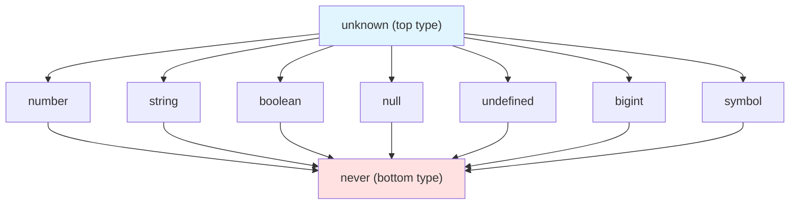

TypeScript's type system begins with **primitives** — the atomic,
indivisible types that represent single values. If you already know
JavaScript, you've used these types hundreds of times: numbers, strings,
booleans, `null`, `undefined`. TypeScript gives you a way to *name* these
types in your code, so the compiler can verify that a variable holding a
number never accidentally receives a string.

This chapter answers three questions: **What are the primitive types?**
**How does the compiler track them?** **What bugs does this prevent?**

<svg
  viewBox="0 0 640 240"
  role="img"
  aria-label="Seven atoms drift in a field: blue, green, and yellow nuclei with orbiting electrons, a double-ringed heavyweight, a one-of-a-kind red atom with a sparkle, a deliberately hollow ring, and a barely-there ghost — the primitive types as the indivisible atoms of the type system"
  style={{ display: "block", width: "100%", maxWidth: "640px", height: "auto", margin: "2.5rem auto" }}
>
  <g fill="currentColor" opacity="0.15">
    <circle cx="60" cy="40" r="3" />
    <circle cx="600" cy="60" r="3" />
    <circle cx="330" cy="20" r="2.5" />
    <circle cx="610" cy="214" r="3" />
    <circle cx="40" cy="120" r="2.5" />
  </g>
  <g style={{ color: "var(--ds-blue-500)" }} fill="currentColor">
    <path d="M120 84 A30 30 0 1 1 180 84 A30 30 0 1 1 120 84 Z M123 84 A27 27 0 1 0 177 84 A27 27 0 1 0 123 84 Z" fillRule="evenodd" fillOpacity="0.3" />
    <circle cx="150" cy="84" r="15" />
    <circle cx="171" cy="63" r="4" />
    <circle cx="129" cy="105" r="4" />
    <path d="M186 178 A34 34 0 1 1 254 178 A34 34 0 1 1 186 178 Z M189 178 A31 31 0 1 0 251 178 A31 31 0 1 0 189 178 Z" fillRule="evenodd" fillOpacity="0.25" />
    <path d="M174 178 A46 46 0 1 1 266 178 A46 46 0 1 1 174 178 Z M177 178 A43 43 0 1 0 263 178 A43 43 0 1 0 177 178 Z" fillRule="evenodd" fillOpacity="0.14" />
    <circle cx="220" cy="178" r="17" fillOpacity="0.85" />
    <circle cx="266" cy="178" r="4" />
    <circle cx="220" cy="132" r="4" />
  </g>
  <g style={{ color: "var(--ds-green-500)" }} fill="currentColor">
    <path d="M303 76 A27 27 0 1 1 357 76 A27 27 0 1 1 303 76 Z M306 76 A24 24 0 1 0 354 76 A24 24 0 1 0 306 76 Z" fillRule="evenodd" fillOpacity="0.3" />
    <circle cx="330" cy="76" r="13" />
    <circle cx="352" cy="58" r="3.5" />
    <circle cx="366" cy="46" r="3" />
    <circle cx="380" cy="36" r="2.5" />
  </g>
  <g style={{ color: "var(--ds-yellow-500)" }} fill="currentColor">
    <path d="M446 64 A24 24 0 1 1 494 64 A24 24 0 1 1 446 64 Z M449 64 A21 21 0 1 0 491 64 A21 21 0 1 0 449 64 Z" fillRule="evenodd" fillOpacity="0.35" />
    <circle cx="470" cy="64" r="11" />
    <circle cx="494" cy="64" r="4.5" />
    <circle cx="446" cy="64" r="4.5" />
  </g>
  <g fill="currentColor">
    <path d="M376 170 A14 14 0 1 1 404 170 A14 14 0 1 1 376 170 Z M382 170 A8 8 0 1 0 398 170 A8 8 0 1 0 382 170 Z" fillRule="evenodd" opacity="0.45" />
    <circle cx="96" cy="190" r="8" opacity="0.1" />
    <path d="M80 190 A16 16 0 1 1 112 190 A16 16 0 1 1 80 190 Z M82 190 A14 14 0 1 0 110 190 A14 14 0 1 0 82 190 Z" fillRule="evenodd" opacity="0.07" />
  </g>
  <g style={{ color: "var(--ds-red-500)" }} fill="currentColor">
    <path d="M500 170 A20 20 0 1 1 540 170 A20 20 0 1 1 500 170 Z M503 170 A17 17 0 1 0 537 170 A17 17 0 1 0 503 170 Z" fillRule="evenodd" fillOpacity="0.3" />
    <circle cx="520" cy="170" r="9" />
    <path d="M551 142 L554 150 L562 153 L554 156 L551 164 L548 156 L540 153 L548 150 Z" />
  </g>
</svg>

## The seven primitive types

JavaScript has seven primitive types. TypeScript provides a corresponding
type annotation for each:

1. **`number`** — all numeric values, integers and floats alike
2. **`string`** — text values
3. **`boolean`** — `true` or `false`
4. **`null`** — the intentional absence of a value
5. **`undefined`** — uninitialized or missing values
6. **`bigint`** — arbitrarily large integers (ES2020+)
7. **`symbol`** — unique, immutable identifiers

Here's a simple demonstration of each:

<CodeBlock
  adapter="typescript"
  files={[
    {
      filename: "main.ts",
      starterCode: `const count: number = 42;
const greeting: string = "Hello, TypeScript";
const isActive: boolean = true;
const empty: null = null;
const notYetDefined: undefined = undefined;
const huge: bigint = 9007199254740991n;
const id: symbol = Symbol("unique");

console.log("number:", count);
console.log("string:", greeting);
console.log("boolean:", isActive);
console.log("null:", empty);
console.log("undefined:", notYetDefined);
console.log("bigint:", huge);
console.log("symbol:", typeof id);
`,
    },
  ]}
/>

**What the compiler now knows:** Every one of these variables has a fixed
type. If you later try to assign `greeting = 99`, TypeScript raises a
compile-time error — it knows `greeting` is a `string`, and `99` is a
`number`.

## Type inference vs explicit annotation

You don't *always* need to write the type. TypeScript infers it from the
value:

<CodeBlock
  adapter="typescript"
  files={[
    {
      filename: "main.ts",
      starterCode: `// Inferred as number
let x = 10;

// Inferred as string
let message = "Inferred!";

// Inferred as boolean
let flag = false;

console.log("x is", typeof x);
console.log("message is", typeof message);
console.log("flag is", typeof flag);
`,
    },
  ]}
/>

The compiler sees `x = 10` and concludes `x: number`. No annotation
required. But when you want to **document intent** or when the right-hand
side is ambiguous, you can (and should) annotate explicitly:

<CodeBlock
  adapter="typescript"
  files={[
    {
      filename: "main.ts",
      starterCode: `// Explicit annotation clarifies intent
let userId: number;
userId = 12345;

// Without annotation, the compiler would infer 'any' or complain
let data: string | undefined;
data = undefined;
data = "Loaded";

console.log("userId:", userId);
console.log("data:", data);
`,
    },
  ]}
/>

**What bugs does this prevent?** If you accidentally assign `userId =
"abc"`, the compiler halts compilation. The type annotation acts as a
machine-checked contract.

## The difference between `number` and `Number`

JavaScript has both a primitive `number` type and a wrapper object
`Number`. TypeScript mirrors this distinction, but **you should almost
always use lowercase `number`**. The capitalized `Number` refers to the
wrapper object, which is almost never what you want:

```ts
// Good: primitive type
let count: number = 42;

// Bad: object wrapper (deprecated in TypeScript)
let boxed: Number = new Number(42);
```

The same rule applies to `string` vs `String` and `boolean` vs `Boolean`.
Always use the lowercase primitive types. The capitalized versions exist
only for edge cases (like when you need to call `String.fromCharCode`
directly) and should not appear in type annotations.

**Why does TypeScript flag the capitalized versions?** Because the wrapper
objects behave differently. `typeof (new Number(42))` is `"object"`, not
`"number"`. Mixing them leads to subtle bugs. The compiler steers you
toward the primitive types by making the wrappers a lint warning in most
configurations.

## The `null` and `undefined` divide

JavaScript has two ways to represent "no value": `null` and `undefined`.
TypeScript treats them as distinct types:

<CodeBlock
  adapter="typescript"
  files={[
    {
      filename: "main.ts",
      starterCode: `let a: null = null;
let b: undefined = undefined;

// You cannot swap them without explicit union types
// a = undefined;  // ❌ Type 'undefined' is not assignable to type 'null'

console.log("a:", a);
console.log("b:", b);
`,
    },
  ]}
/>

In practice, `undefined` means "never initialized" or "missing property,"
while `null` means "intentionally empty." By giving each its own type,
TypeScript forces you to be explicit about which kind of emptiness you
expect.

<svg
  viewBox="0 0 640 180"
  role="img"
  aria-label="Two kinds of nothing: on the left a solid pedestal holds an empty bowl with a green placed marker, on the right only a dotted outline shows where a bowl would stand — null is emptiness on purpose, undefined is a value that never arrived"
  style={{ display: "block", width: "100%", maxWidth: "480px", height: "auto", margin: "2.5rem auto" }}
>
  <g style={{ color: "var(--ds-blue-500)" }} fill="currentColor">
    <path d="M120 70 L220 70 C218 102 196 118 170 118 C144 118 122 102 120 70 Z" fillOpacity="0.85" />
    <rect x="160" y="118" width="20" height="22" rx="4" fillOpacity="0.6" />
    <rect x="130" y="140" width="80" height="10" rx="5" fillOpacity="0.4" />
  </g>
  <g style={{ color: "var(--ds-green-500)" }} fill="currentColor">
    <path d="M156 50 A14 14 0 1 1 184 50 A14 14 0 1 1 156 50 Z M162 50 A8 8 0 1 0 178 50 A8 8 0 1 0 162 50 Z" fillRule="evenodd" />
  </g>
  <g fill="currentColor" opacity="0.22">
    <circle cx="420" cy="70" r="3" />
    <circle cx="446" cy="74" r="3" />
    <circle cx="470" cy="84" r="3" />
    <circle cx="488" cy="100" r="3" />
    <circle cx="496" cy="116" r="3" />
    <circle cx="500" cy="70" r="3" />
    <circle cx="474" cy="74" r="3" />
    <circle cx="424" cy="100" r="3" />
    <circle cx="432" cy="116" r="3" />
    <circle cx="460" cy="120" r="3" />
    <circle cx="460" cy="140" r="3" />
    <circle cx="436" cy="150" r="2.5" />
    <circle cx="484" cy="150" r="2.5" />
  </g>
  <g fill="currentColor" opacity="0.12">
    <rect x="80" y="160" width="480" height="4" rx="2" />
  </g>
</svg>

**Strict null checks:** By default (in `strict` mode), TypeScript does
*not* allow `null` or `undefined` to inhabit other types. A variable of
type `number` cannot hold `null` unless you explicitly declare it as
`number | null`. This is a major source of TypeScript's safety — the
billion-dollar mistake (null pointer errors) becomes a compile-time issue,
not a runtime crash.

## Literal types: a preview

Every primitive value is also a *literal type*. The number `42` is not
just a `number` — it's *specifically* the number `42`. TypeScript can
track this:

<CodeBlock
  adapter="typescript"
  files={[
    {
      filename: "main.ts",
      starterCode: `// The type is literally the string "north"
const direction = "north";

// The type is literally the number 42
const answer = 42;

// The type is literally the boolean true
const yes = true;

console.log("direction:", direction);
console.log("answer:", answer);
console.log("yes:", yes);
`,
    },
  ]}
/>

When you declare a variable with `const`, TypeScript infers the *literal*
type. When you use `let`, it infers the broader primitive type (because
`let` allows reassignment). We'll explore literal types in depth in
[Type Aliases and Literals](./type-aliases-and-literals), but the key
insight is this: **TypeScript's type system is more precise than "just a
number" — it can track the exact value when the code makes that
guarantee.**

## BigInt and Symbol

Modern JavaScript (ES2020+) includes two more primitives: `bigint` for
arbitrarily large integers, and `symbol` for unique identifiers.

**`bigint`** handles integers beyond JavaScript's safe integer range
(`Number.MAX_SAFE_INTEGER`, which is 2<sup>53</sup> − 1). You write them
with an `n` suffix:

<CodeBlock
  adapter="typescript"
  files={[
    {
      filename: "main.ts",
      starterCode: `const big: bigint = 123456789012345678901234567890n;
const alsoBig = BigInt("999999999999999999");

console.log("big:", big);
console.log("alsoBig:", alsoBig);
console.log("Sum:", big + 1n);
`,
    },
  ]}
/>

**`symbol`** creates a unique, immutable value. No two symbols are equal,
even if they have the same description:

<CodeBlock
  adapter="typescript"
  files={[
    {
      filename: "main.ts",
      starterCode: `const sym1: symbol = Symbol("id");
const sym2: symbol = Symbol("id");

console.log("sym1 === sym2:", sym1 === sym2); // false
console.log("typeof sym1:", typeof sym1);
`,
    },
  ]}
/>

Symbols are rarely used in beginner code, but they're essential for
metaprogramming (like defining well-known symbols such as
`Symbol.iterator`). TypeScript tracks them as the type `symbol`.

## Primitive type hierarchy (a mental model)

Imagine the type system as a lattice. At the very top sits `unknown` (the
type that accepts *any* value). At the very bottom sits `never` (the type
with *no* values). Primitive types occupy the middle:



Every primitive is a subtype of `unknown` and a supertype of `never`.
We'll explore `unknown` and `never` in detail later (see
[Any, Unknown, Never](./any-unknown-never)), but for now, remember: **the
primitive types are the middle layer**, neither maximally permissive
(like `unknown`) nor maximally restrictive (like `never`).

## Why primitive types matter

Consider a JavaScript function that calculates the area of a rectangle:

```js
function area(width, height) {
  return width * height;
}
```

Nothing stops you from calling `area("10", 5)` — JavaScript will coerce
the string `"10"` to a number, and you'll get `50`. But what if the string
were `"10px"`? You'd get `NaN`. The bug hides until runtime.

Now add types:

<CodeBlock
  adapter="typescript"
  files={[
    {
      filename: "main.ts",
      starterCode: `function area(width: number, height: number): number {
  return width * height;
}

// Correct usage
console.log("Area:", area(10, 5));

// Incorrect usage (uncomment to see compile error):
// console.log(area("10", 5));
`,
    },
  ]}
/>

The line `area("10", 5)` is a **compile-time error**. The compiler knows
that `"10"` is a `string`, and `area` requires `number`. The bug is caught
before you ever run the code.

**This is the core value proposition of primitive types:** They turn
category errors (passing the wrong kind of data) into compile-time errors,
not runtime `NaN` or `TypeError` exceptions.

## Practice: temperature converter

Let's solidify these concepts with a small challenge. You'll write a
function that converts Celsius to Fahrenheit. The twist: the compiler
should enforce that both input and output are numbers.

<ChallengeCard
  adapter="typescript"
  title="Celsius to Fahrenheit"
  instructions={`Implement the function \`celsiusToFahrenheit(c: number): number\` that converts a Celsius temperature to Fahrenheit. The formula is \`F = C × 9/5 + 32\`. The test will verify that 0°C = 32°F and 100°C = 212°F.`}
  files={[
    {
      filename: "main.ts",
      starterCode: `function celsiusToFahrenheit(c: number): number {
  // Your code here
  return 0;
}

console.log("0°C =", celsiusToFahrenheit(0), "°F");
console.log("100°C =", celsiusToFahrenheit(100), "°F");
`,
      solutionCode: `function celsiusToFahrenheit(c: number): number {
  return (c * 9) / 5 + 32;
}

console.log("0°C =", celsiusToFahrenheit(0), "°F");
console.log("100°C =", celsiusToFahrenheit(100), "°F");
`,
    },
  ]}
  tests={[
    {
      id: "freezing",
      name: "Converts 0°C to 32°F",
      description: "celsiusToFahrenheit(0) === 32",
      code: `if (celsiusToFahrenheit(0) !== 32) throw new Error("Expected 32, got " + celsiusToFahrenheit(0));`,
    },
    {
      id: "boiling",
      name: "Converts 100°C to 212°F",
      description: "celsiusToFahrenheit(100) === 212",
      code: `if (celsiusToFahrenheit(100) !== 212) throw new Error("Expected 212, got " + celsiusToFahrenheit(100));`,
    },
  ]}
/>

## Check your understanding

<MultipleChoice
  markdown={`Which of the following is the correct way to annotate a variable that holds a number in TypeScript?

- \`let x: Number = 10;\`
  > \`Number\` (capitalized) refers to the JavaScript wrapper object, not the primitive type. TypeScript discourages using the wrapper types in annotations.
- [o] \`let x: number = 10;\`
  > Always use the lowercase primitive type \`number\`.
- \`let x: num = 10;\`
  > \`num\` is not a valid TypeScript type; the correct primitive type name is lowercase \`number\`.
- \`let x = Number(10);\`
  > This is a valid JavaScript expression, but it omits the type annotation entirely; the inferred type would be \`number\` only because TypeScript can see the return type of \`Number()\`, and it does not demonstrate explicit annotation syntax.

The capitalized \`Number\` refers to the object wrapper, which is almost never what you want. The lowercase \`number\` is the primitive type.`}
/>

<MultipleChoice
  markdown={`What is the type of the variable \`x\` after this declaration: \`const x = 42;\`?

- \`number\` (the general number type)
  > \`let\` bindings get the wider \`number\` type, but \`const\` bindings receive the narrower literal type because the value can never be reassigned.
- [o] \`42\` (the literal type)
  > When you use \`const\`, TypeScript infers the literal type because the value cannot change.
- \`any\`
  > TypeScript does not infer \`any\` for a \`const\` initialized with a numeric literal; it infers the precise literal type \`42\`.
- \`unknown\`
  > \`unknown\` is the safe top type that must be narrowed before use; TypeScript does not infer it for numeric literals.

TypeScript's inference is precise: \`const\` bindings get literal types, while \`let\` bindings get the broader primitive type.`}
/>

## Summary

Primitive types are the atoms of TypeScript's type system. By annotating
variables with `number`, `string`, `boolean`, `null`, `undefined`,
`bigint`, or `symbol`, you tell the compiler what kind of data a variable
can hold. The compiler then enforces these annotations at every assignment
and function call, catching category errors before they become runtime
bugs.

In the next chapter, [Arrays and Tuples](./arrays-and-tuples), we'll see
how to build compound types from these primitives — collections of values
whose shape and length the compiler can verify.
