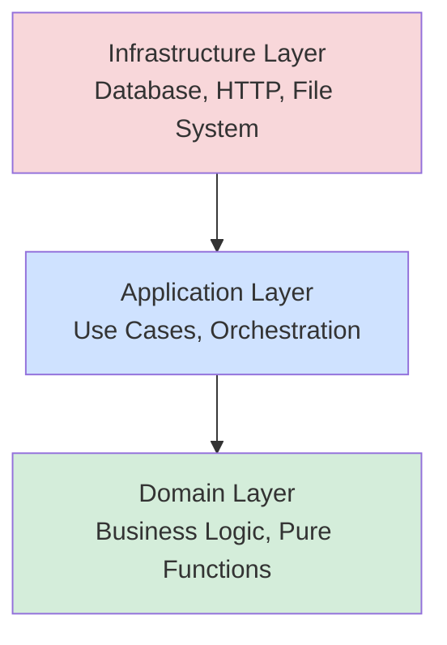
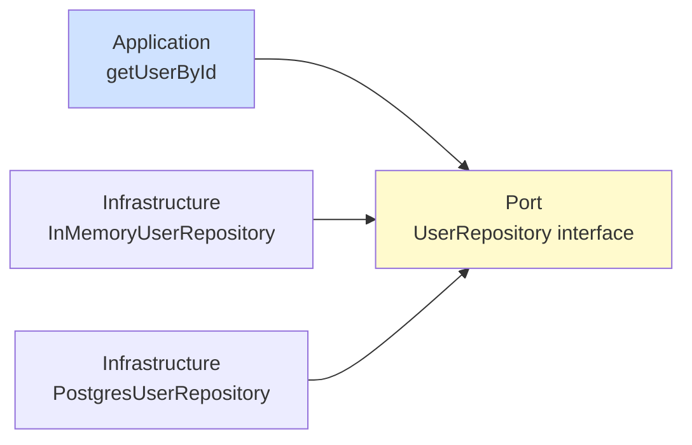

As codebases grow, they become harder to navigate, test, and change. Functions depend on other functions, modules import from everywhere, and changes ripple unpredictably. Without structure, you end up with a tangled mess where every change risks breaking something distant.

This chapter introduces **layered architecture** — a pattern for organizing code into distinct layers (domain, application, infrastructure) with clear boundaries and dependencies flowing in one direction. You'll learn how to use **TypeScript's type system** to enforce these boundaries, prevent circular dependencies, and make large systems understandable and maintainable.

<svg
  viewBox="0 0 640 250"
  role="img"
  aria-label="A temple in cross-section: the yellow roof of infrastructure rests on blue application columns standing on a deep green domain foundation, weather dots kept outside; one column is only a dotted outline — a port — with its green implementation sliding in from the side — layers depend downward and the foundation knows nothing above it"
  style={{ display: "block", width: "100%", maxWidth: "640px", height: "auto", margin: "2.5rem auto" }}
>
  <g fill="currentColor" opacity="0.2">
    <circle cx="200" cy="24" r="3" />
    <circle cx="320" cy="12" r="3" />
    <circle cx="440" cy="24" r="3" />
    <circle cx="566" cy="60" r="3" />
    <circle cx="76" cy="60" r="3" />
    <circle cx="600" cy="140" r="3" />
    <circle cx="40" cy="160" r="3" />
  </g>
  <g style={{ color: "var(--ds-yellow-500)" }} fill="currentColor">
    <path d="M104 100 L320 38 L536 100 Z" fillOpacity="0.85" />
  </g>
  <g style={{ color: "var(--ds-blue-500)" }} fill="currentColor">
    <rect x="164" y="100" width="40" height="12" rx="4" fillOpacity="0.5" />
    <rect x="254" y="100" width="40" height="12" rx="4" fillOpacity="0.5" />
    <rect x="344" y="100" width="40" height="12" rx="4" fillOpacity="0.5" />
    <rect x="434" y="100" width="40" height="12" rx="4" fillOpacity="0.5" />
    <rect x="170" y="112" width="28" height="78" rx="6" fillOpacity="0.8" />
    <rect x="260" y="112" width="28" height="78" rx="6" fillOpacity="0.8" />
    <rect x="440" y="112" width="28" height="78" rx="6" fillOpacity="0.8" />
  </g>
  <g fill="currentColor" opacity="0.3">
    <circle cx="364" cy="120" r="2.5" />
    <circle cx="364" cy="136" r="2.5" />
    <circle cx="364" cy="152" r="2.5" />
    <circle cx="364" cy="168" r="2.5" />
    <circle cx="364" cy="184" r="2.5" />
    <circle cx="352" cy="120" r="2.5" />
    <circle cx="352" cy="136" r="2.5" />
    <circle cx="352" cy="152" r="2.5" />
    <circle cx="352" cy="168" r="2.5" />
    <circle cx="352" cy="184" r="2.5" />
  </g>
  <g style={{ color: "var(--ds-green-500)" }} fill="currentColor">
    <circle cx="404" cy="152" r="8" />
    <circle cx="422" cy="152" r="2.5" fillOpacity="0.5" />
    <circle cx="436" cy="152" r="2.5" fillOpacity="0.35" />
    <rect x="120" y="190" width="400" height="30" rx="8" fillOpacity="0.85" />
    <rect x="100" y="220" width="440" height="14" rx="7" fillOpacity="0.5" />
  </g>
</svg>

---

## The Problem: Tangled Dependencies

Consider a typical application without layering:

```
user-service.ts → database.ts → config.ts → user-service.ts
     ↓                ↓               ↓
order-service.ts → http-client.ts → logger.ts
```

Everything depends on everything else. Testing is hard (you need to mock the database, HTTP, and logger). Changing one module breaks others unpredictably. The codebase becomes a **big ball of mud**.

---

## Layered Architecture

A **layered architecture** divides code into three (or more) layers:

1. **Domain layer**: Pure business logic and types. No I/O, no frameworks, no infrastructure. Just functions and data structures that model your problem domain.
2. **Application layer**: Use cases that orchestrate domain logic. Defines *what* the system does, but not *how* it talks to the outside world.
3. **Infrastructure layer**: Concrete implementations of I/O: databases, HTTP clients, file systems, third-party APIs.

Dependencies flow in one direction: Infrastructure → Application → Domain. The domain knows nothing about infrastructure.



---

## Domain Layer: Pure Business Logic

The domain layer contains types and functions that model your problem. It depends on *nothing* outside itself.

<CodeBlock
  adapter="typescript"
  files={[
    {
      filename: "main.ts",
      starterCode: `// domain.ts
export type User = {
  id: string;
  name: string;
  email: string;
};

export function validateEmail(email: string): boolean {
  return email.includes("@");
}

export function createUser(
  id: string,
  name: string,
  email: string,
): User | null {
  if (!validateEmail(email)) {
    return null;
  }
  return { id, name, email };
}

const user = createUser("user-1", "Alice", "alice@example.com");
console.log(user);
`,
    },
  ]}
/>

Notice:
- No imports. No database, no HTTP, no file system.
- Pure functions: given the same inputs, they return the same outputs.
- Easy to test: no mocks needed.

---

## Application Layer: Use Cases

The application layer orchestrates domain logic to fulfill use cases. It defines *interfaces* (contracts) for infrastructure, but doesn't implement them.

<CodeBlock
  adapter="typescript"
  entryFilename="main.ts"
  files={[
    {
      filename: "main.ts",
      starterCode: `import { getUserById } from "./application";
import { InMemoryUserRepository } from "./infrastructure";

const repo = new InMemoryUserRepository();
repo.save({ id: "user-1", name: "Alice", email: "alice@example.com" });

const result = getUserById(repo, "user-1");
console.log(result); // User | null
`,
    },
    {
      filename: "application.ts",
      starterCode: `import { User } from "./domain";

// Port: an interface the application depends on
export interface UserRepository {
  findById(id: string): User | null;
}

// Use case: retrieve a user
export function getUserById(repo: UserRepository, id: string): User | null {
  return repo.findById(id);
}
`,
    },
    {
      filename: "domain.ts",
      starterCode: `export type User = {
  id: string;
  name: string;
  email: string;
};
`,
    },
    {
      filename: "infrastructure.ts",
      starterCode: `import { User } from "./domain";
import { UserRepository } from "./application";

// Adapter: a concrete implementation of the port
export class InMemoryUserRepository implements UserRepository {
  private users: Map<string, User> = new Map();

  save(user: User): void {
    this.users.set(user.id, user);
  }

  findById(id: string): User | null {
    return this.users.get(id) || null;
  }
}
`,
    },
  ]}
/>

Here:
- `application.ts` defines `UserRepository` (a **port** — an interface).
- `infrastructure.ts` provides `InMemoryUserRepository` (an **adapter** — a concrete implementation).
- `main.ts` wires them together.

This is **dependency inversion**: the application depends on an abstraction (the interface), not a concrete implementation. You can swap `InMemoryUserRepository` for `PostgresUserRepository` without changing `application.ts`.



---

## Dependency Inversion in TypeScript

Dependency inversion is simple in TypeScript: define an interface (or a function type) in the application layer, and require implementations to match.

<CodeBlock
  adapter="typescript"
  files={[
    {
      filename: "main.ts",
      starterCode: `// Application layer defines the contract
type Logger = {
  log(message: string): void;
};

function processOrder(logger: Logger, orderId: string): void {
  logger.log(\`Processing order \${orderId}\`);
  // ... business logic ...
  logger.log(\`Order \${orderId} completed\`);
}

// Infrastructure provides implementations
const consoleLogger: Logger = {
  log(message: string) {
    console.log(message);
  },
};

const noOpLogger: Logger = {
  log() {
    // Do nothing (useful for tests)
  },
};

processOrder(consoleLogger, "order-123");
processOrder(noOpLogger, "order-456");
`,
    },
  ]}
/>

The application layer doesn't import a concrete logger. It defines what a logger *looks like* (the `Logger` type), and accepts any implementation. Tests can pass a no-op or in-memory logger; production can pass a file logger or cloud logger.

---

## Enforcing Boundaries with Modules

Use module boundaries to enforce layering:
- The **domain** module exports only domain types and functions.
- The **application** module exports use cases and ports (interfaces).
- The **infrastructure** module exports adapters (implementations of ports).

<CodeBlock
  adapter="typescript"
  entryFilename="main.ts"
  files={[
    {
      filename: "main.ts",
      starterCode: `import { createOrder } from "./application";
import { InMemoryOrderRepository } from "./infrastructure";

const repo = new InMemoryOrderRepository();
const order = createOrder(repo, "order-1", 99.99);

if (order) {
  console.log(\`Created order \${order.orderId} with total $\${order.total}\`);
  repo.save(order);
  console.log(\`Saved order \${order.orderId}\`);
} else {
  console.log("Failed to create order");
}
`,
    },
    {
      filename: "domain.ts",
      starterCode: `export type Order = {
  orderId: string;
  total: number;
};

export function buildOrder(orderId: string, total: number): Order | null {
  if (total <= 0) {
    return null;
  }
  return { orderId, total };
}
`,
    },
    {
      filename: "application.ts",
      starterCode: `import { Order, buildOrder } from "./domain";

// Port: defined by application, implemented by infrastructure
export interface OrderRepository {
  save(order: Order): void;
}

// Use case
export function createOrder(
  repo: OrderRepository,
  orderId: string,
  total: number,
): Order | null {
  const order = buildOrder(orderId, total);
  if (order) {
    repo.save(order);
  }
  return order;
}
`,
    },
    {
      filename: "infrastructure.ts",
      starterCode: `import { Order } from "./domain";
import { OrderRepository } from "./application";

export class InMemoryOrderRepository implements OrderRepository {
  private orders: Order[] = [];

  save(order: Order): void {
    this.orders.push(order);
  }

  getAll(): Order[] {
    return this.orders;
  }
}
`,
    },
  ]}
/>

Notice:
- `domain.ts` has no imports. It's pure.
- `application.ts` imports from `domain`, defines ports, and orchestrates.
- `infrastructure.ts` imports from both `domain` and `application`, providing concrete implementations.
- `main.ts` wires everything together (this is the **composition root**).

---

## Barrel Files for Clean Exports

A **barrel file** (`index.ts`) re-exports only the public API of a module, hiding internal details:

<svg
  viewBox="0 0 640 180"
  role="img"
  aria-label="Three scattered trails of exports pour into one barrel that has a single tap, from which one green stream leaves; a faint extra trail stops outside the barrel wall — a barrel file gathers a module's public surface into one import path and keeps internals inside"
  style={{ display: "block", width: "100%", maxWidth: "480px", height: "auto", margin: "2.5rem auto" }}
>
  <g style={{ color: "var(--ds-blue-500)" }} fill="currentColor">
    <circle cx="80" cy="44" r="6" />
    <circle cx="118" cy="52" r="5" fillOpacity="0.7" />
    <circle cx="156" cy="62" r="4" fillOpacity="0.5" />
    <circle cx="80" cy="90" r="6" />
    <circle cx="122" cy="90" r="5" fillOpacity="0.7" />
    <circle cx="164" cy="90" r="4" fillOpacity="0.5" />
    <circle cx="80" cy="136" r="6" />
    <circle cx="118" cy="128" r="5" fillOpacity="0.7" />
    <circle cx="156" cy="118" r="4" fillOpacity="0.5" />
    <circle cx="194" cy="80" r="3.5" fillOpacity="0.4" />
    <circle cx="194" cy="100" r="3.5" fillOpacity="0.4" />
  </g>
  <g fill="currentColor" opacity="0.15">
    <path d="M250 40 C242 40 236 46 236 54 L236 126 C236 134 242 140 250 140 L350 140 C358 140 364 134 364 126 L364 54 C364 46 358 40 350 40 Z" />
  </g>
  <g fill="currentColor" opacity="0.3">
    <rect x="236" y="62" width="128" height="6" rx="3" />
    <rect x="236" y="112" width="128" height="6" rx="3" />
  </g>
  <g fill="currentColor" opacity="0.35">
    <rect x="364" y="82" width="22" height="14" rx="4" />
  </g>
  <g style={{ color: "var(--ds-green-500)" }} fill="currentColor">
    <circle cx="412" cy="89" r="6" />
    <circle cx="448" cy="89" r="5" fillOpacity="0.7" />
    <circle cx="484" cy="89" r="4" fillOpacity="0.5" />
    <circle cx="518" cy="89" r="3.5" fillOpacity="0.35" />
  </g>
  <g fill="currentColor" opacity="0.18">
    <circle cx="280" cy="160" r="3" />
    <circle cx="310" cy="164" r="3" />
    <circle cx="340" cy="160" r="3" />
  </g>
</svg>

<CodeBlock
  adapter="typescript"
  entryFilename="main.ts"
  files={[
    {
      filename: "main.ts",
      starterCode: `import { createUser } from "./user";

const user = createUser("user-1", "Alice", "alice@example.com");
if (user) {
  console.log(\`Created: \${user.name}\`);
}
`,
    },
    {
      filename: "user/index.ts",
      starterCode: `// Public API
export { createUser } from "./application";
export type { User } from "./domain";
// Internal helpers are not exported
`,
    },
    {
      filename: "user/domain.ts",
      starterCode: `export type User = {
  id: string;
  name: string;
  email: string;
};

export function validateEmail(email: string): boolean {
  return email.includes("@");
}
`,
    },
    {
      filename: "user/application.ts",
      starterCode: `import { User, validateEmail } from "./domain";

export function createUser(
  id: string,
  name: string,
  email: string,
): User | null {
  if (!validateEmail(email)) {
    return null;
  }
  return { id, name, email };
}
`,
    },
  ]}
/>

Consumers import from `./user`, not `./user/domain` or `./user/application`. This keeps internal structure private and allows refactoring without breaking consumers.

---

## Making Impossible States Unrepresentable

Use types to enforce invariants at module boundaries. For example, ensure that an `Order` can only be created through a validated constructor:

<CodeBlock
  adapter="typescript"
  files={[
    {
      filename: "main.ts",
      starterCode: `declare const OrderBrand: unique symbol;
type Order = {
  orderId: string;
  total: number;
  readonly __brand: typeof OrderBrand;
};

function createOrder(orderId: string, total: number): Order | null {
  if (total <= 0 || orderId.trim() === "") {
    return null;
  }
  return { orderId, total, __brand: OrderBrand } as any;
}

function calculateTax(order: Order): number {
  return order.total * 0.1;
}

const order = createOrder("order-1", 100);
if (order) {
  console.log(\`Tax: $\${calculateTax(order)}\`);
}

// const badOrder = { orderId: "bad", total: -1 };
// calculateTax(badOrder); // Error: missing __brand
`,
    },
  ]}
/>

Here, `Order` is a [branded type](./branded-types). You can't construct an `Order` without going through `createOrder`, which validates inputs. Invalid orders are impossible to represent in the type system.

---

## Challenge: Implement a Layered Todo Service

<ChallengeCard
  adapter="typescript"
  title="Layered Todo Service"
  instructions={`Build a layered todo service:
- \`domain.ts\`: Define \`Todo\` (id: string, title: string, done: boolean) and a \`toggleTodo\` function.
- \`application.ts\`: Define \`TodoRepository\` interface with \`findById\` and \`save\` methods. Implement \`toggleTodoById(repo, id)\` that retrieves, toggles, and saves.
- \`infrastructure.ts\`: Implement \`InMemoryTodoRepository\`.
- \`main.ts\`: Create a todo, toggle it, and print the result.`}
  entryFilename="main.ts"
  files={[
    {
      filename: "main.ts",
      starterCode: `import { toggleTodoById } from "./application";
import { InMemoryTodoRepository } from "./infrastructure";

const repo = new InMemoryTodoRepository();
repo.save({ id: "todo-1", title: "Learn TypeScript", done: false });

const toggled = toggleTodoById(repo, "todo-1");
if (toggled) {
  console.log(\`Todo: \${toggled.title}, done: \${toggled.done}\`);
} else {
  console.log("Todo not found");
}
`,
    },
    {
      filename: "domain.ts",
      starterCode: `export type Todo = {
  id: string;
  title: string;
  done: boolean;
};

export function toggleTodo(todo: Todo): Todo {
  // Implement
  return todo;
}
`,
      solutionCode: `export type Todo = {
  id: string;
  title: string;
  done: boolean;
};

export function toggleTodo(todo: Todo): Todo {
  return { ...todo, done: !todo.done };
}
`,
    },
    {
      filename: "application.ts",
      starterCode: `import { Todo, toggleTodo } from "./domain";

export interface TodoRepository {
  findById(id: string): Todo | null;
  save(todo: Todo): void;
}

export function toggleTodoById(repo: TodoRepository, id: string): Todo | null {
  // Implement
  return null;
}
`,
      solutionCode: `import { Todo, toggleTodo } from "./domain";

export interface TodoRepository {
  findById(id: string): Todo | null;
  save(todo: Todo): void;
}

export function toggleTodoById(repo: TodoRepository, id: string): Todo | null {
  const todo = repo.findById(id);
  if (!todo) {
    return null;
  }
  const toggled = toggleTodo(todo);
  repo.save(toggled);
  return toggled;
}
`,
    },
    {
      filename: "infrastructure.ts",
      starterCode: `import { Todo } from "./domain";
import { TodoRepository } from "./application";

export class InMemoryTodoRepository implements TodoRepository {
  private todos: Map<string, Todo> = new Map();

  findById(id: string): Todo | null {
    return this.todos.get(id) || null;
  }

  save(todo: Todo): void {
    this.todos.set(todo.id, todo);
  }
}
`,
    },
  ]}
  tests={[
    {
      id: "out",
      name: "Toggles todo",
      description: "done: true appears in output",
      expect: { stdoutContains: "done: true" },
    },
  ]}
/>

---

## Module Path Aliases (Brief Mention)

In large projects, relative imports (`../../domain`) become unwieldy. TypeScript's `paths` in `tsconfig.json` lets you define aliases:

```json
{
  "compilerOptions": {
    "baseUrl": ".",
    "paths": {
      "@domain/*": ["src/domain/*"],
      "@application/*": ["src/application/*"]
    }
  }
}
```

Then you can write:
```ts
import { User } from "@domain/user";
import { getUserById } from "@application/user-use-cases";
```

This makes imports consistent and easier to refactor. (Details vary by build tool; consult your tooling docs.)

---

## Monorepo Type Sharing (Teaser)

In a **monorepo** (multiple packages in one repo), you can share types across packages. For example, a `@myapp/types` package exports domain types, and both `@myapp/server` and `@myapp/client` depend on it.

This ensures the frontend and backend agree on data shapes at compile time. Tools like npm workspaces, Yarn workspaces, or pnpm workspaces make this seamless.

We won't dive into monorepo tooling here, but know that TypeScript's type system scales to multi-package architectures.

---

## Multiple Choice: Dependency Direction

<MultipleChoice
  markdown={`In a layered architecture, which layer should the domain layer depend on?

- The application layer
  > The domain is the *innermost* layer; it depends on nothing outside itself.
- [o] Nothing (it's pure)
  > The domain layer contains pure business logic and types. It has no dependencies on infrastructure or application layers.
- The infrastructure layer
  > Infrastructure depends on domain, not the other way around.

Keeping the domain pure makes it testable, reusable, and easy to reason about.`}
/>

---

## Multiple Choice: Dependency Inversion

<MultipleChoice
  markdown={`What does "dependency inversion" mean in this context?

- The application layer is at the bottom
  > The physical layer order doesn't matter. Dependency *direction* matters.
- [o] The application depends on an interface, not a concrete implementation
  > Dependency inversion means high-level modules (application) depend on abstractions (interfaces), not low-level modules (infrastructure). This allows swapping implementations.
- The domain depends on the infrastructure
  > That would violate layering. The domain should never depend on infrastructure.

Dependency inversion decouples layers, making the system flexible and testable.`}
/>

---

## Summary

You've learned how to:
- Structure code into **layers** (domain, application, infrastructure).
- Keep the **domain layer pure** and free of dependencies.
- Use **interfaces (ports)** to define contracts in the application layer.
- Provide **concrete implementations (adapters)** in the infrastructure layer.
- Apply **dependency inversion** to decouple layers.
- Use **barrel files** to control what's exported.
- Enforce **invariants** with branded types and smart constructors.

Layered architecture makes large systems comprehensible. Each layer has a single responsibility, and dependencies flow in one direction. TypeScript's type system enforces these boundaries at compile time, catching violations before they become runtime bugs.

---

**Next**: [Static Analysis in Action](./static-analysis-in-action) — exploring what the TypeScript compiler actually proves for you.
