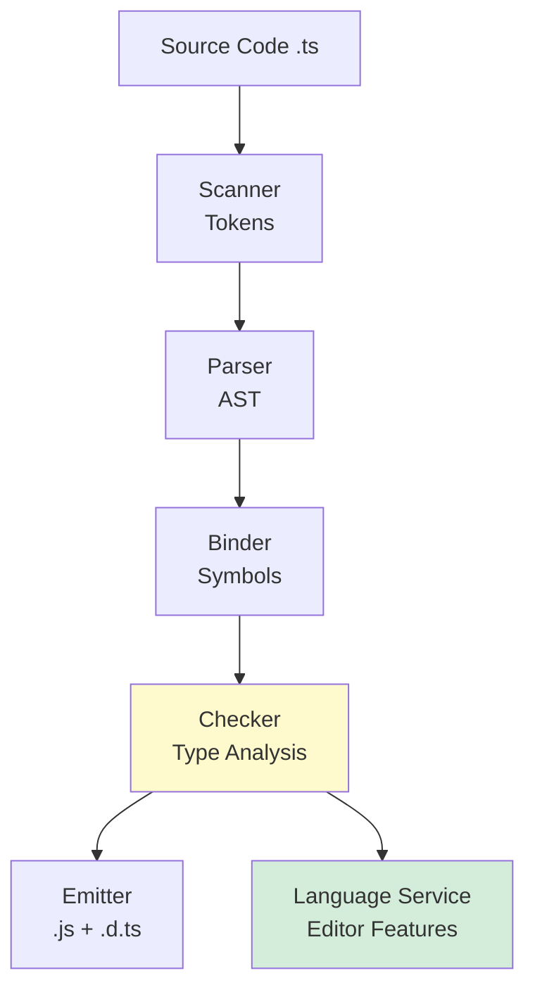

You've written types, modeled domains, and structured architectures. But what does the TypeScript compiler *actually do* with all that information? What guarantees does it provide? And how does it power the editor experience that makes TypeScript so productive?

This chapter reveals the compiler's inner workings: how it catches bugs at compile time, enables refactoring with confidence, proves exhaustiveness, and drives the language service that powers autocomplete, go-to-definition, and instant feedback in your editor.

<svg
  viewBox="0 0 640 230"
  role="img"
  aria-label="Parcels ride a belt through a translucent scanning arch on their way to the departure flag: inside the arch one parcel turns see-through and reveals a red flaw, while cleared parcels carry green rings — static analysis inspects code before it ever ships"
  style={{ display: "block", width: "100%", maxWidth: "640px", height: "auto", margin: "2.5rem auto" }}
>
  <g fill="currentColor" opacity="0.2">
    <rect x="50" y="160" width="540" height="8" rx="4" />
  </g>
  <g fill="currentColor" opacity="0.15">
    <circle cx="90" cy="178" r="4" />
    <circle cx="170" cy="178" r="4" />
    <circle cx="250" cy="178" r="4" />
    <circle cx="330" cy="178" r="4" />
    <circle cx="410" cy="178" r="4" />
    <circle cx="490" cy="178" r="4" />
  </g>
  <g fill="currentColor" opacity="0.25">
    <rect x="110" y="118" width="52" height="42" rx="6" />
    <rect x="190" y="126" width="44" height="34" rx="6" />
    <rect x="430" y="118" width="48" height="42" rx="6" />
    <rect x="510" y="126" width="40" height="34" rx="6" />
  </g>
  <g style={{ color: "var(--ds-blue-500)" }} fill="currentColor">
    <path d="M260 160 L260 60 Q260 36 284 36 L356 36 Q380 36 380 60 L380 160 L352 160 L352 64 Q352 60 348 60 L292 60 Q288 60 288 64 L288 160 Z" fillOpacity="0.35" />
    <rect x="288" y="60" width="64" height="100" fillOpacity="0.08" />
    <rect x="288" y="102" width="64" height="5" fillOpacity="0.3" />
  </g>
  <g fill="currentColor" opacity="0.12">
    <rect x="296" y="118" width="48" height="42" rx="6" />
  </g>
  <g style={{ color: "var(--ds-red-500)" }} fill="currentColor">
    <path d="M320 128 L324 136 L333 137 L326 143 L329 152 L320 147 L311 152 L314 143 L307 137 L316 136 Z" fillOpacity="0.9" />
  </g>
  <g style={{ color: "var(--ds-green-500)" }} fill="currentColor">
    <path d="M445 100 A9 9 0 1 1 463 100 A9 9 0 1 1 445 100 Z M448.5 100 A5.5 5.5 0 1 0 459.5 100 A5.5 5.5 0 1 0 448.5 100 Z" fillRule="evenodd" />
    <circle cx="530" cy="108" r="5" />
  </g>
  <g style={{ color: "var(--ds-yellow-500)" }} fill="currentColor">
    <rect x="586" y="118" width="4" height="42" rx="2" />
    <path d="M590 120 L612 127 L590 134 Z" />
  </g>
</svg>

---

## What the Compiler Proves

When you run `tsc` (the TypeScript compiler), it doesn't just transform `.ts` files into `.js`. It performs **static analysis** — reasoning about your code without running it — and proves (or disproves) properties:

1. **Type safety**: Every value matches the types you've declared. No accidental `string` where a `number` is expected.
2. **Null safety**: With `strictNullChecks`, you can't access `.length` on a value that might be `null` or `undefined`.
3. **Exhaustiveness**: In discriminated unions, the compiler checks that you've handled every case.
4. **Structural compatibility**: When you assign a value to a variable, the compiler proves the shapes match.

These proofs eliminate entire classes of bugs. Let's see them in action.

---

## Type Safety: Catching Typos and Mismatches

<CodeBlock
  adapter="typescript"
  files={[
    {
      filename: "main.ts",
      starterCode: `type User = { id: number; name: string };

function greet(user: User): string {
  return \`Hello, \${user.name}!\`;
}

const user: User = { id: 1, name: "Alice" };
console.log(greet(user));

// const badUser = { id: "1", name: "Bob" }; // Error: id is string, not number
// console.log(greet(badUser));
`,
    },
  ]}
/>

If you uncomment the last two lines, the compiler catches the type mismatch before you ever run the code. This prevents runtime errors like `NaN` from arithmetic on a string.

---

## Null Safety with `strictNullChecks`

Without `strictNullChecks`, `null` and `undefined` are assignable to any type. This is a source of countless runtime crashes.

With `strictNullChecks` enabled (part of `strict` mode), the compiler forces you to check for `null`/`undefined` before accessing properties:

<CodeBlock
  adapter="typescript"
  files={[
    {
      filename: "main.ts",
      starterCode: `function getLength(s: string | null): number {
  // return s.length; // Error: s is possibly null
  if (s === null) {
    return 0;
  }
  return s.length; // OK: s is narrowed to string
}

console.log(getLength("hello")); // 5
console.log(getLength(null)); // 0
`,
    },
  ]}
/>

The compiler tracks the control flow and **narrows** `s` from `string | null` to `string` after the `null` check. This is called **control flow analysis**.

---

## Exhaustiveness Checking

When you have a discriminated union and switch on the discriminant, the compiler checks that you've handled every case. If you add a new variant and forget to handle it, the compiler catches it.

<CodeBlock
  adapter="typescript"
  files={[
    {
      filename: "main.ts",
      starterCode: `type Shape =
  | { kind: "circle"; radius: number }
  | { kind: "rectangle"; width: number; height: number };

function area(shape: Shape): number {
  switch (shape.kind) {
    case "circle":
      return Math.PI * shape.radius ** 2;
    case "rectangle":
      return shape.width * shape.height;
    default:
      // This branch is unreachable: all cases are handled
      const _exhaustive: never = shape;
      throw new Error(\`Unhandled shape: \${_exhaustive}\`);
  }
}

console.log(area({ kind: "circle", radius: 5 }));
console.log(area({ kind: "rectangle", width: 10, height: 20 }));
`,
    },
  ]}
/>

The `never` type is a bottom type — a type with no values. If all cases are handled, `shape` in the `default` branch has type `never`, and the assignment succeeds. If you add a new variant (e.g., `{ kind: "triangle"; ... }`) and don't handle it, `shape` won't be `never`, and the compiler errors.

Let's see what happens if we add a new shape:

```ts
type Shape =
  | { kind: "circle"; radius: number }
  | { kind: "rectangle"; width: number; height: number }
  | { kind: "triangle"; base: number; height: number }; // New!

function area(shape: Shape): number {
  switch (shape.kind) {
    case "circle":
      return Math.PI * shape.radius ** 2;
    case "rectangle":
      return shape.width * shape.height;
    default:
      const _exhaustive: never = shape; // Error: Type 'triangle' is not assignable to 'never'
      throw new Error(`Unhandled shape: ${_exhaustive}`);
  }
}
```

The compiler forces you to add a `case "triangle"` branch. This guarantees you won't forget to handle new cases.

---

## Refactor Safety

One of TypeScript's superpowers is **refactoring confidence**. When you rename a type, function, or property, the compiler finds every usage and tells you what to update.

Let's see a refactor in action:

<CodeBlock
  adapter="typescript"
  files={[
    {
      filename: "main.ts",
      starterCode: `type User = { id: number; fullName: string };

function greet(user: User): string {
  return \`Hello, \${user.fullName}!\`;
}

function displayUser(user: User): void {
  console.log(\`User: \${user.fullName} (ID: \${user.id})\`);
}

const user: User = { id: 1, fullName: "Alice" };
greet(user);
displayUser(user);
console.log("Refactor completed");
`,
    },
  ]}
/>

Suppose you rename `fullName` to `name`. Every place that accesses `.fullName` becomes a compile error, forcing you to update it. No silent bugs, no missed spots. The compiler is your safety net.

---

## The Pipeline, Revisited

Back in [How TypeScript Works](./how-typescript-works), near the very start of the course, we walked through the compiler's stages — scanner, parser, binder, checker, emitter — when most of them were still abstractions. Now you can read the same diagram with different eyes: every guarantee on this page is the **Checker** doing its job, and everything you've learned since (narrowing, discriminated unions, generics, mapped types) is vocabulary the checker reasons in.



Notice the arrow this chapter cares about: the checker feeds two consumers. The **emitter** uses it once per build. The **language service** uses it *continuously* — every keystroke in your editor re-runs the same analysis, which is why the red squiggle under `user.emial`, the autocomplete dropdown, "Find All References," and project-wide rename are not separate features bolted onto your editor. They are one type checker, asked different questions. When you rename `fullName` to `name` and twelve files light up with errors, that's static analysis acting as a refactoring engine: the compiler has a complete, always-current map of every place each symbol flows, so nothing can hide.

<Callout type="info" title="The Editor Is Your Compiler">
With TypeScript, the editor *is* the compiler. Every red squiggle, autocomplete suggestion, and refactor command is driven by the same type analysis that runs at build time. This tight integration is what makes TypeScript so productive.
</Callout>

---

## Practical Example: Refactoring a Function Signature

Let's refactor a function signature and see how the compiler guides us:

<CodeBlock
  adapter="typescript"
  files={[
    {
      filename: "main.ts",
      starterCode: `type User = { id: number; name: string };

// Original signature
function getUser(id: number): User {
  return { id, name: "Alice" };
}

// Callers
const user1 = getUser(1);
const user2 = getUser(2);
console.log(user1, user2);
`,
    },
  ]}
/>

Now suppose we change the signature to accept an options object instead of a bare `id`:

<CodeBlock
  adapter="typescript"
  files={[
    {
      filename: "main.ts",
      starterCode: `type User = { id: number; name: string };

// New signature
function getUser(options: { id: number; includeEmail?: boolean }): User {
  return { id: options.id, name: "Alice" };
}

// Old callers now error:
// const user1 = getUser(1); // Error: Argument of type 'number' is not assignable to parameter of type '{ id: number; ... }'

// Fixed callers:
const user1 = getUser({ id: 1 });
const user2 = getUser({ id: 2, includeEmail: true });
console.log(user1, user2);
`,
    },
  ]}
/>

The compiler tells you exactly which call sites need updating. No manual search, no chance of missing one. This scales to codebases with hundreds of thousands of lines.

---

## Dead Code Detection

The `never` type helps detect unreachable code. If a branch is provably unreachable, the compiler can infer `never`:

<CodeBlock
  adapter="typescript"
  files={[
    {
      filename: "main.ts",
      starterCode: `function processValue(value: number): string {
  if (value > 0) {
    return "positive";
  } else if (value < 0) {
    return "negative";
  } else {
    return "zero";
  }
  // Unreachable code: all cases are handled
}

console.log(processValue(5));
console.log(processValue(-3));
console.log(processValue(0));
`,
    },
  ]}
/>

If you add another `else` after the `value === 0` case, it's unreachable, and the compiler can warn you.

<svg
  viewBox="0 0 640 170"
  role="img"
  aria-label="A bright dotted route runs straight through, while a faint spur drops away to a node nothing ever reaches, ringed in red — the compiler proves that code after a return or an impossible branch can never run"
  style={{ display: "block", width: "100%", maxWidth: "460px", height: "auto", margin: "2.5rem auto" }}
>
  <g style={{ color: "var(--ds-blue-500)" }} fill="currentColor">
    <circle cx="70" cy="70" r="4" />
    <circle cx="115" cy="70" r="4" />
    <circle cx="160" cy="70" r="4" />
    <circle cx="205" cy="70" r="4" />
    <circle cx="250" cy="70" r="4" />
    <circle cx="295" cy="70" r="4" />
    <circle cx="340" cy="70" r="4" />
    <circle cx="385" cy="70" r="4" />
    <circle cx="430" cy="70" r="4" />
    <circle cx="475" cy="70" r="4" />
    <circle cx="520" cy="70" r="4" />
  </g>
  <g style={{ color: "var(--ds-green-500)" }} fill="currentColor">
    <circle cx="565" cy="70" r="9" />
  </g>
  <g fill="currentColor" opacity="0.2">
    <circle cx="312" cy="96" r="3" />
    <circle cx="336" cy="116" r="3" />
    <circle cx="358" cy="134" r="3" />
  </g>
  <g fill="currentColor" opacity="0.12">
    <circle cx="390" cy="144" r="10" />
  </g>
  <g style={{ color: "var(--ds-red-500)" }} fill="currentColor">
    <path d="M376 144 A14 14 0 1 1 404 144 A14 14 0 1 1 376 144 Z M379 144 A11 11 0 1 0 401 144 A11 11 0 1 0 379 144 Z" fillRule="evenodd" fillOpacity="0.45" />
  </g>
</svg>

---

## Challenge: Exhaustive Discriminated Union

<ChallengeCard
  adapter="typescript"
  title="Exhaustive Payment Handling"
  instructions={`Define a discriminated union \`Payment\` with three variants: \`{ method: "cash" }\`, \`{ method: "card"; last4: string }\`, \`{ method: "crypto"; address: string }\`.

Write a function \`processPayment(payment: Payment): string\` that handles all three cases and returns a description. Use a \`default\` branch with a \`never\` check to ensure exhaustiveness.`}
  files={[
    {
      filename: "main.ts",
      starterCode: `type Payment = any; // Replace 'any' with the discriminated union

function processPayment(payment: Payment): string {
  return "Not implemented";
}

console.log(processPayment({ method: "cash" }));
console.log(processPayment({ method: "card", last4: "1234" }));
console.log(processPayment({ method: "crypto", address: "0xabc" }));
`,
      solutionCode: `type Payment =
  | { method: "cash" }
  | { method: "card"; last4: string }
  | { method: "crypto"; address: string };

function processPayment(payment: Payment): string {
  switch (payment.method) {
    case "cash":
      return "Processing cash payment";
    case "card":
      return \`Processing card payment (card ending \${payment.last4})\`;
    case "crypto":
      return \`Processing crypto payment (address \${payment.address})\`;
    default:
      const _exhaustive: never = payment;
      throw new Error(\`Unhandled payment method: \${_exhaustive}\`);
  }
}

console.log(processPayment({ method: "cash" }));
console.log(processPayment({ method: "card", last4: "1234" }));
console.log(processPayment({ method: "crypto", address: "0xabc" }));
`,
    },
  ]}
  tests={[
    {
      id: "cash",
      name: "Handles cash",
      description: "cash payment processed",
      code: `const result = processPayment({ method: "cash" });
if (!result.toLowerCase().includes("cash")) throw new Error("Cash not handled");`,
    },
    {
      id: "card",
      name: "Handles card",
      description: "card payment processed",
      code: `const result = processPayment({ method: "card", last4: "1234" });
if (!result.toLowerCase().includes("card")) throw new Error("Card not handled");`,
    },
    {
      id: "crypto",
      name: "Handles crypto",
      description: "crypto payment processed",
      code: `const result = processPayment({ method: "crypto", address: "0xabc" });
if (!result.toLowerCase().includes("crypto")) throw new Error("Crypto not handled");`,
    },
  ]}
/>

---

## Multiple Choice: Control Flow Analysis

<MultipleChoice
  markdown={`Given:
\`\`\`ts
function getLength(s: string | null): number {
  if (s === null) {
    return 0;
  }
  return s.length;
}
\`\`\`
Why does \`s.length\` compile without error in the second \`return\`?

- Because \`.length\` is always safe
  > \`.length\` is not safe on \`null\`. The compiler needs to narrow the type.
- [o] Because the compiler narrows \`s\` to \`string\` after the \`null\` check
  > Control flow analysis tracks the \`if (s === null)\` check and infers that \`s\` is \`string\` (not \`null\`) in the else branch.
- Because of a type cast
  > There's no cast here. The compiler infers the narrowing automatically.

Control flow analysis is one of TypeScript's most powerful features, eliminating null-reference errors.`}
/>

---

## Summary

You've learned:
- What the compiler **proves**: type safety, null safety, exhaustiveness, structural compatibility.
- How **control flow analysis** narrows types based on runtime checks.
- How **exhaustiveness checking** ensures you handle all discriminated union cases.
- How **refactoring** is safe because the compiler finds every affected usage.
- The **compiler pipeline**: Scanner → Parser → Binder → Checker → Emitter + Language Service.
- How the **language service** powers your editor with autocomplete, go-to-definition, and refactoring.

Static analysis shifts bugs leftward — from runtime (where they're expensive and dangerous) to compile time (where they're cheap and safe). The TypeScript compiler doesn't just translate your code; it *proves properties* about it. And the editor integration means you get this feedback instantly, as you type.

---

**Next**: [Next Steps](./next-steps) — where to go from here on your TypeScript journey.
