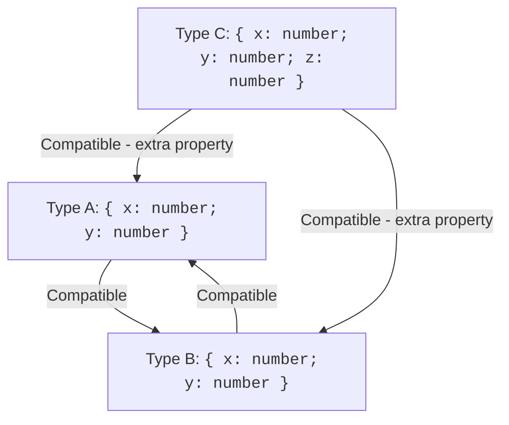
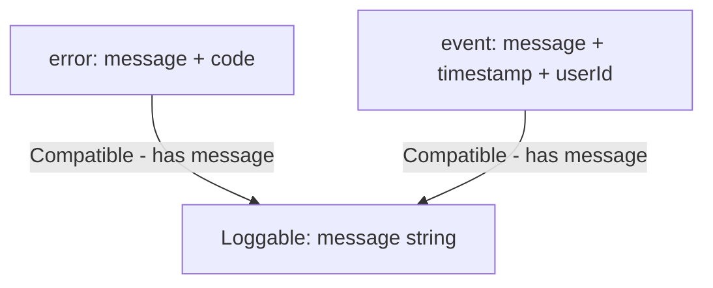

Most programmers learning TypeScript come from languages like Java, C#, or C++ where types are **nominal**: two types are compatible only if they have the same *name*. If `class Dog` and `class Cat` both have a `name` property, you still can't pass a `Dog` where a `Cat` is expected — the compiler checks the class name, not the structure.

TypeScript takes a different approach. It uses **structural typing** (also called **duck typing** for compilers): two types are compatible if they have the same *shape*. If it walks like a duck and quacks like a duck, the compiler treats it as a duck — even if it's technically a goose.

This makes TypeScript remarkably flexible and composable. You can reuse types across unrelated modules without needing a shared base class or interface. But it also has surprising edge cases, especially around object literals. Let's explore how structural typing works and when it bites.

<svg
  viewBox="0 0 640 240"
  role="img"
  aria-label="Two completely different builds — one stacked from blocks, one molded in a single piece — cast exactly the same notched shadow, joined by a dotted trail of equivalence, while a third object's plain shadow matches nothing — the compiler compares the shapes things cast, not what they are called"
  style={{ display: "block", width: "100%", maxWidth: "640px", height: "auto", margin: "2.5rem auto" }}
>
  <g style={{ color: "var(--ds-yellow-500)" }} fill="currentColor">
    <circle cx="320" cy="32" r="11" />
    <circle cx="344" cy="18" r="2.5" fillOpacity="0.6" />
    <circle cx="296" cy="18" r="2.5" fillOpacity="0.6" />
    <circle cx="320" cy="6" r="2.5" fillOpacity="0.6" />
  </g>
  <g fill="currentColor" opacity="0.22">
    <rect x="60" y="190" width="520" height="4" rx="2" />
  </g>
  <g style={{ color: "var(--ds-blue-500)" }} fill="currentColor">
    <rect x="120" y="150" width="64" height="40" rx="8" />
    <circle cx="152" cy="130" r="20" />
  </g>
  <g style={{ color: "var(--ds-green-500)" }} fill="currentColor">
    <path d="M420 190 L420 158 C420 132 436 118 452 118 C468 118 484 132 484 158 L484 190 Z" />
  </g>
  <g fill="currentColor" opacity="0.2">
    <path d="M116 198 L140 198 A12 7 0 0 0 164 198 L200 198 L200 210 L116 210 Z" />
    <path d="M412 198 L436 198 A12 7 0 0 0 460 198 L496 198 L496 210 L412 210 Z" />
  </g>
  <g style={{ color: "var(--ds-green-500)" }} fill="currentColor">
    <circle cx="240" cy="204" r="2.5" fillOpacity="0.6" />
    <circle cx="280" cy="204" r="2.5" fillOpacity="0.6" />
    <circle cx="320" cy="204" r="2.5" fillOpacity="0.6" />
    <circle cx="360" cy="204" r="2.5" fillOpacity="0.6" />
  </g>
  <g style={{ color: "var(--ds-red-500)" }} fill="currentColor">
    <rect x="548" y="158" width="52" height="32" rx="6" />
    <path d="M544 198 L606 198 L606 210 L544 210 Z" fillOpacity="0.25" />
  </g>
</svg>

## Shape-based compatibility

In TypeScript, a type is compatible with another if it has *at least* the required properties, with the correct types. The name doesn't matter.

<CodeBlock
  adapter="typescript"
  files={[
    {
      filename: "main.ts",
      starterCode: `interface Point {
  x: number;
  y: number;
}

interface Vector {
  x: number;
  y: number;
}

function printPoint(p: Point) {
  console.log(\`Point: (\${p.x}, \${p.y})\`);
}

// Even though origin is typed as Vector, it's compatible with Point
const origin: Vector = { x: 0, y: 0 };
printPoint(origin); // ✅ OK — same shape!

// An object literal with the same shape also works
printPoint({ x: 10, y: 20 }); // ✅ OK
`,
    },
  ]}
/>

`Point` and `Vector` are structurally identical — both have `x: number` and `y: number`. So the compiler treats them as interchangeable. This is **structural compatibility**: if the shapes match, the types match.

Contrast this with a nominal system like Java:

```java
// Java (nominal typing)
class Point { int x, y; }
class Vector { int x, y; }

void printPoint(Point p) { /*...*/ }

Vector v = new Vector();
printPoint(v); // ❌ Compile error: incompatible types
```

Even though `Point` and `Vector` have identical fields, Java rejects the call because the *names* differ. TypeScript doesn't care about names — only structure.



## Why structural typing matters

This design choice unlocks powerful patterns:

1. **No coordination required.** Two teams can independently define `interface User { id: string; name: string }` and `interface Account { id: string; name: string }`, and they'll interoperate automatically. No need for a shared base type.
2. **Easy testing and mocking.** You can pass any object with the right shape to a function, even if it's a plain object literal or a test stub. No need to extend a base class or implement an interface explicitly.
3. **Gradual migration.** When refactoring, you can introduce new types with the same shape and swap them in without rewriting call sites.

<CodeBlock
  adapter="typescript"
  files={[
    {
      filename: "main.ts",
      starterCode: `// Two unrelated interfaces with the same shape
interface DatabaseUser {
  id: string;
  name: string;
}

interface ApiUser {
  id: string;
  name: string;
}

function welcomeUser(user: DatabaseUser) {
  console.log(\`Welcome, \${user.name}!\`);
}

// An ApiUser works seamlessly
const apiUser: ApiUser = { id: "123", name: "Ada" };
welcomeUser(apiUser); // ✅ OK

// So does a plain object literal
welcomeUser({ id: "456", name: "Grace" }); // ✅ OK
`,
    },
  ]}
/>

This is why TypeScript is often described as having **duck typing for compilers**: "If it looks like a duck and quacks like a duck, it's a duck."

The phrase has a real lineage, and it's older than any programming language. The "duck test" — *if it looks like a duck, swims like a duck, and quacks like a duck, it's probably a duck* — was a piece of American folk reasoning long before computing. The Python community adopted it around 2000 to describe their language's habit of caring only about what an object can *do*, never what class it claims to be; Alex Martelli's postings on the comp.lang.python newsgroup are usually credited with cementing the term. TypeScript's contribution was to take this runtime philosophy and make a *compiler* enforce it: you get duck typing's flexibility, but the quack-check happens before the program ever runs.

<Callout type="info" title="Contrast with Go's interfaces">
Go also uses structural typing for interfaces, but it's stricter: a type must implement *all* methods of an interface to satisfy it. TypeScript is more permissive — extra properties are fine, and even functions can be structurally compatible if their parameter and return types align.
</Callout>

## Excess property checking: the surprise

Structural typing says "extra properties are OK," but TypeScript has a special rule for **object literals** that seems to contradict this.

<CodeBlock
  adapter="typescript"
  files={[
    {
      filename: "main.ts",
      starterCode: `interface Config {
  host: string;
  port: number;
}

function connect(config: Config) {
  console.log(\`Connecting to \${config.host}:\${config.port}\`);
}

// ✅ OK: Extra property on a named variable
const myConfig = { host: "localhost", port: 3000, timeout: 5000 };
connect(myConfig);

// ❌ Would error: Extra property on an object literal
// connect({ host: "localhost", port: 3000, timeout: 5000 });
// Uncomment above to see: Object literal may only specify known properties

// But this works if we annotate the variable first:
const configWithTimeout: Config = { host: "localhost", port: 3000 };
connect(configWithTimeout);
`,
    },
  ]}
/>

Wait — why does `myConfig` work but the inline literal would fail? This is **excess property checking**, a special-case carveout that TypeScript applies *only* to **fresh object literals**. The goal is to catch typos and accidental properties:

```ts
// Typo: "prot" instead of "port"
connect({ host: "localhost", prot: 3000 }); // ❌ Error caught!
```

Without excess property checking, this typo would slip through: `prot` is an extra property, and structural typing normally allows extra properties. The compiler would accept it, `config.port` would be `undefined` at runtime, and you'd get a confusing error much later.

So TypeScript adds a **freshness** check: when you pass an object literal directly to a function or assign it to a typed variable, the compiler rejects any properties not declared in the target type. This is a deliberate break from pure structural typing to improve ergonomics.

<Callout type="warning" title="Fresh vs. non-fresh">
An object literal is "fresh" when it's created inline as an argument or assignment. Once you store it in a variable (even without a type annotation), it loses freshness and reverts to structural compatibility. This is why `myConfig` above works — by the time it reaches `connect`, it's no longer a fresh literal.
</Callout>

<svg
  viewBox="0 0 640 210"
  role="img"
  aria-label="Two journeys for the same parcel with an extra yellow ribbon: handed straight to the blue portal it is stopped by a red bar, but after first resting on a pallet it glides through untouched — fresh object literals get strict excess-property checks while stored variables do not"
  style={{ display: "block", width: "100%", maxWidth: "520px", height: "auto", margin: "2.5rem auto" }}
>
  <g fill="currentColor" opacity="0.25">
    <circle cx="180" cy="70" r="2.5" />
    <circle cx="220" cy="70" r="2.5" />
    <circle cx="260" cy="70" r="2.5" />
    <circle cx="300" cy="70" r="2.5" />
    <circle cx="244" cy="150" r="2.5" />
    <circle cx="284" cy="150" r="2.5" />
    <circle cx="324" cy="150" r="2.5" />
    <circle cx="364" cy="150" r="2.5" />
  </g>
  <g style={{ color: "var(--ds-green-500)" }} fill="currentColor">
    <rect x="352" y="52" width="36" height="36" rx="6" />
    <rect x="148" y="132" width="36" height="36" rx="6" />
    <rect x="488" y="132" width="36" height="36" rx="6" />
    <circle cx="556" cy="124" r="5" />
  </g>
  <g style={{ color: "var(--ds-yellow-500)" }} fill="currentColor">
    <rect x="352" y="64" width="36" height="8" rx="4" />
    <rect x="148" y="144" width="36" height="8" rx="4" />
    <rect x="488" y="144" width="36" height="8" rx="4" />
  </g>
  <g style={{ color: "var(--ds-red-500)" }} fill="currentColor">
    <rect x="402" y="50" width="6" height="40" rx="3" />
  </g>
  <g style={{ color: "var(--ds-blue-500)" }} fill="currentColor">
    <path d="M424 70 A26 26 0 1 1 476 70 A26 26 0 1 1 424 70 Z M431 70 A19 19 0 1 0 469 70 A19 19 0 1 0 431 70 Z" fillRule="evenodd" />
    <path d="M424 150 A26 26 0 1 1 476 150 A26 26 0 1 1 424 150 Z M431 150 A19 19 0 1 0 469 150 A19 19 0 1 0 431 150 Z" fillRule="evenodd" />
  </g>
  <g fill="currentColor" opacity="0.2">
    <rect x="136" y="170" width="72" height="10" rx="5" />
  </g>
</svg>

### Bypassing excess property checking

If you genuinely need extra properties, you have a few options:

<CodeBlock
  adapter="typescript"
  files={[
    {
      filename: "main.ts",
      starterCode: `interface Config {
  host: string;
  port: number;
}

function connect(config: Config) {
  console.log(\`Connecting to \${config.host}:\${config.port}\`);
}

// Option 1: Store in a variable first (removes freshness)
const cfg1 = { host: "localhost", port: 3000, timeout: 5000 };
connect(cfg1); // ✅ OK

// Option 2: Use a type assertion
connect({ host: "localhost", port: 3000, timeout: 5000 } as Config); // ✅ OK

// Option 3: Add an index signature to the interface (opt-in to extras)
interface FlexibleConfig {
  host: string;
  port: number;
  [key: string]: unknown; // allow any extra properties
}

function connectFlexible(config: FlexibleConfig) {
  console.log(\`Connecting to \${config.host}:\${config.port}\`);
}

connectFlexible({ host: "localhost", port: 3000, timeout: 5000 }); // ✅ OK
`,
    },
  ]}
/>

Each approach has trade-offs. Type assertions (`as Config`) are a last resort — they silence the compiler but don't make your code safer. Index signatures are better when you genuinely expect arbitrary properties (like a config object with plugin options). Storing in a variable is the cleanest if you're just working around the freshness check.

## Structural typing in practice

Let's see a realistic example. Suppose you're building a logging system and want to accept anything with a `message` property:

<CodeBlock
  adapter="typescript"
  files={[
    {
      filename: "main.ts",
      starterCode: `interface Loggable {
  message: string;
}

function log(item: Loggable) {
  console.log(\`[LOG] \${item.message}\`);
}

// These all work — same shape!
log({ message: "Server started" });

const error = { message: "Database connection failed", code: 500 };
log(error);

const event = {
  message: "User logged in",
  timestamp: Date.now(),
  userId: "123",
};
log(event);
`,
    },
  ]}
/>

None of these objects explicitly "implement" `Loggable`. They just happen to have a `message: string` property, so they're compatible. This is structural typing in action: the `log` function works with *any* object that has the right shape, without needing a shared base class or interface declaration.



## Simulating nominal typing

Sometimes structural typing is *too* loose. Suppose you're modeling user IDs and product IDs as strings:

```ts
type UserId = string;
type ProductId = string;

function deleteUser(id: UserId) { /*...*/ }
deleteUser(productId); // ❌ Logic error, but type-checks!
```

Both are just `string` under the hood, so TypeScript treats them as interchangeable. This is dangerous — you could accidentally pass a product ID where a user ID is expected.

The solution is **branded types** (also called **opaque types** or **nominal types**). You add a fake property that exists only at compile time to make the types structurally distinct:

```ts
type UserId = string & { readonly __brand: "UserId" };
type ProductId = string & { readonly __brand: "ProductId" };

function deleteUser(id: UserId) { /*...*/ }

const userId = "user-123" as UserId;
const productId = "prod-456" as ProductId;

deleteUser(userId);    // ✅ OK
deleteUser(productId); // ❌ Error: ProductId is not assignable to UserId
```

The `__brand` property doesn't exist at runtime (JavaScript ignores it), but at compile time it makes `UserId` and `ProductId` structurally different. This is a manual workaround to get nominal-like behavior in a structural system.

We'll explore branded types in more detail in the [Branded Types](./branded-types) chapter. For now, just know that structural typing is the default, but you can opt into nominal checks when you need them.

<Callout type="success" title="Best of both worlds">
TypeScript's structural typing gives you flexibility by default, but you can layer on nominal checks (via branding) when you need to prevent accidental mixing of logically distinct types. This is more flexible than a purely nominal system, where you're locked in from the start.
</Callout>

## Challenge: Structural compatibility

Let's test your understanding. The function below is typed against a small `LogEntry` interface, and — thanks to structural typing — the program feeds it objects that were never declared as `LogEntry` but happen to have the right shape (plus extra fields). Your job is just the body.

<ChallengeCard
  adapter="typescript"
  title="A structurally typed log formatter"
  instructions={`Implement the body of \`formatEntry\` so it returns the entry's level in uppercase, wrapped in square brackets, followed by a space and the message — exactly like \`[INFO] App started\`.

Note the two objects passed in \`main.ts\`: neither was declared as a \`LogEntry\`, and both carry extra properties (\`uptimeMs\`, \`stack\`). Structural typing accepts them anyway, because each has at least \`level\` and \`message\`.`}
  files={[
    {
      filename: "main.ts",
      starterCode: `interface LogEntry {
  level: string;
  message: string;
}

function formatEntry(entry: LogEntry): string {
  // Your code here: return "[LEVEL] message", e.g. "[INFO] App started"
  return "";
}

// Structural typing in action: not declared as LogEntry, extra
// properties included — both are accepted because the shape fits.
const boot = { level: "info", message: "App started", uptimeMs: 12 };
const crash = { level: "error", message: "Crash", stack: "at main.ts:1" };

console.log(formatEntry(boot));
console.log(formatEntry(crash));
`,
      solutionCode: `interface LogEntry {
  level: string;
  message: string;
}

function formatEntry(entry: LogEntry): string {
  return \`[\${entry.level.toUpperCase()}] \${entry.message}\`;
}

const boot = { level: "info", message: "App started", uptimeMs: 12 };
const crash = { level: "error", message: "Crash", stack: "at main.ts:1" };

console.log(formatEntry(boot));
console.log(formatEntry(crash));
`,
    },
  ]}
  tests={[
    {
      id: "info",
      name: "Formats a plain entry",
      description: "formatEntry({level:'info',message:'Test'}) === '[INFO] Test'",
      code: `const r = formatEntry({ level: "info", message: "Test" });
if (r !== "[INFO] Test") throw new Error("Expected '[INFO] Test', got: " + r);`,
    },
    {
      id: "extra",
      name: "Accepts extra properties",
      description: "An object with extra fields formats the same way",
      code: `const e = { level: "warn", message: "Low memory", extra: 123 };
const r = formatEntry(e);
if (r !== "[WARN] Low memory") throw new Error("Expected '[WARN] Low memory', got: " + r);`,
    },
  ]}
/>

## Multiple choice check

<MultipleChoice
  markdown={`Given these two interfaces:

\`\`\`ts
interface Dog {
  name: string;
  breed: string;
}

interface Pet {
  name: string;
}
\`\`\`

Which statement is **true** in TypeScript's structural type system?

- Both \`Dog\` and \`Pet\` are assignable to each other because they share the \`name\` property.
  > Sharing one property isn't enough for mutual assignability — \`Pet\` has no \`breed\`, so it can't be used where a \`Dog\` is required.
- [o] \`Dog\` is assignable to \`Pet\` because it has all required properties (and more).
  > A \`Dog\` has everything a \`Pet\` needs (\`name\`), plus extra (\`breed\`). Structural typing allows extra properties.
- \`Pet\` is assignable to \`Dog\` because \`Dog\` is more specific.
  > No. A \`Pet\` doesn't have a \`breed\` property, so it can't satisfy \`Dog\`. Structural typing requires *at least* the declared properties.
- Neither is assignable to the other because they have different names.
  > No. TypeScript uses structural typing, not nominal typing. Names don't matter — only the shape (properties and their types).

In structural typing, type \`A\` is assignable to type \`B\` if \`A\` has *at least* all the properties of \`B\` with compatible types. Extra properties on \`A\` are fine. This is why \`Dog\` (which has \`name\` and \`breed\`) can be used anywhere a \`Pet\` (which only needs \`name\`) is expected.`}
/>

## Recap

TypeScript's structural type system checks compatibility by **shape**, not **name**. If two types have the same structure (the same properties with the same types), they're interchangeable — even if they were defined in completely separate modules with no shared ancestry.

**Key takeaways:**

- **Structural compatibility:** Two types are compatible if one has all the properties of the other (with the right types). Extra properties are allowed.
- **Excess property checking:** A special rule for *fresh object literals* that rejects undeclared properties to catch typos. Once a literal is stored in a variable, it reverts to normal structural rules.
- **Duck typing for compilers:** If it has the right shape, it fits — no need for explicit `implements` declarations.
- **Simulating nominal types:** When structural typing is too loose (e.g., `UserId` vs. `ProductId` both being strings), you can use branded types to make logically distinct types structurally distinct.

Structural typing makes TypeScript composable and flexible. You can define types in isolation and have them work together automatically. But it also requires care: always be aware of what shape you're actually checking, and use branding or more precise types when you need to prevent accidental misuse.

Next: [Discriminated Unions](./discriminated-unions), where we combine structural typing with a "tag" field to model state machines, domain events, and other variants — the most powerful pattern in modern TypeScript.
