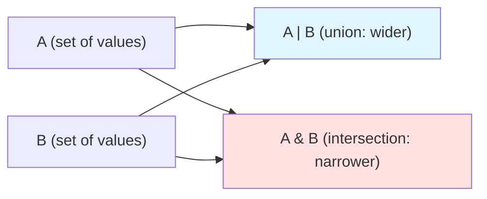

So far, we've built types one piece at a time: primitives, objects,
arrays, functions. But real-world APIs often need to express "this *or*
that" (a value can be one of several types) or "this *and* that" (a value
must satisfy multiple constraints at once). TypeScript provides **union
types** (`A | B`) and **intersection types** (`A & B`) to handle these
cases. They're the set-theoretic building blocks for expressing complex,
precise types.

This chapter covers: **union types**, **intersection types**,
**set-theoretic intuition**, **when intersections produce `never`**, and
**designing APIs with unions**.

<Figure
  slug="tsx-unions-intersections-cutout"
  alt="Two overlapping rings on a platform, one holding the tokens of either ring and one only the tokens in the shared overlap"
/>

## Union types: "this or that"

A **union type** `A | B` represents a value that is *either* type `A`
*or* type `B` (or both, if they overlap):

<CodeBlock
  adapter="typescript"
  files={[
    {
      filename: "main.ts",
      starterCode: `type StringOrNumber = string | number;

let value: StringOrNumber = "hello";
console.log("value:", value);

value = 42;
console.log("value:", value);

// value = true;  // ❌ Type 'boolean' is not assignable to type 'string | number'
`,
    },
  ]}
/>

**What the compiler now knows:** `value` can be a `string` or a `number`,
but nothing else. If you try to assign a `boolean`, the compiler rejects
it.

Unions shine when a function can accept multiple input types:

<CodeBlock
  adapter="typescript"
  files={[
    {
      filename: "main.ts",
      starterCode: `function printId(id: string | number): void {
  console.log("ID:", id);
}

printId(123);
printId("abc-456");
// printId(true);  // ❌ Argument of type 'boolean' is not assignable
`,
    },
  ]}
/>

This is far more precise than using `any` (which disables all type
checking) or creating separate overloads for `string` and `number`.

## Working with union types: narrowing required

When you have a union, the compiler doesn't know *which* member it is at
any given moment. So you can only call methods or access properties that
exist on *all* members:

<CodeBlock
  adapter="typescript"
  files={[
    {
      filename: "main.ts",
      starterCode: `function printLength(value: string | number): void {
  // console.log(value.length);  // ❌ Property 'length' does not exist on type 'number'
  console.log("value:", value);
}

printLength("hello");
printLength(42);
`,
    },
  ]}
/>

The line `value.length` fails because `number` doesn't have a `length`
property. To access `length`, you must **narrow** the type (we'll cover
narrowing in detail in [Type Narrowing](./type-narrowing)):

<CodeBlock
  adapter="typescript"
  files={[
    {
      filename: "main.ts",
      starterCode: `function printLength(value: string | number): void {
  if (typeof value === "string") {
    console.log("Length:", value.length); // ✅ value is narrowed to string
  } else {
    console.log("Number:", value); // ✅ value is narrowed to number
  }
}

printLength("hello");
printLength(42);
`,
    },
  ]}
/>

The `typeof` check tells the compiler "in this branch, `value` is a
`string`." The compiler tracks this and allows `value.length`.

## Intersection types: "this and that"

An **intersection type** `A & B` represents a value that is *both* type
`A` *and* type `B` simultaneously:

<CodeBlock
  adapter="typescript"
  files={[
    {
      filename: "main.ts",
      starterCode: `type Named = { name: string };
type Aged = { age: number };
type Person = Named & Aged;

const alice: Person = { name: "Alice", age: 30 };
console.log("alice:", alice);
console.log("name:", alice.name);
console.log("age:", alice.age);

// Missing a property causes an error:
// const bob: Person = { name: "Bob" };  // ❌ Property 'age' is missing
`,
    },
  ]}
/>

The type `Person` has *both* the `name` property from `Named` *and* the
`age` property from `Aged`. Intersections merge object types.

Intersections are useful for **mixins**, combining multiple interfaces
or types into one:

<CodeBlock
  adapter="typescript"
  files={[
    {
      filename: "main.ts",
      starterCode: `interface Timestamped {
  createdAt: Date;
  updatedAt: Date;
}

interface Identifiable {
  id: string;
}

type Entity = Timestamped & Identifiable & { name: string };

const entity: Entity = {
  id: "abc-123",
  name: "Widget",
  createdAt: new Date(),
  updatedAt: new Date(),
};

console.log("entity:", entity);
`,
    },
  ]}
/>

The resulting type has all the properties from all three constituents.

## Set-theoretic intuition: unions widen, intersections narrow

Think of types as sets of values. A union `A | B` is the *union* of the
two sets (all values that are in A, or in B, or in both). An intersection
`A & B` is the *intersection* of the two sets (only values that are in
*both* A and B).

<Figure
  slug="tsx-unions-and-intersections-inline-cutout"
  alt="Two overlapping outlines on a board, one lamp lighting everything either outline covers and another lighting only where they overlap"
/>

**Unions widen** the set of possible values: `string | number` accepts
more values than just `string` or just `number`. **Intersections narrow**
the set: `Named & Aged` accepts only values that satisfy *both*
constraints.

For primitive types, intersections can produce an *empty* set:

<CodeBlock
  adapter="typescript"
  files={[
    {
      filename: "main.ts",
      starterCode: `type Impossible = string & number;
// Impossible is 'never', no value is both a string and a number

// const x: Impossible = "hello";  // ❌ Type 'string' is not assignable to type 'never'
// const y: Impossible = 42;       // ❌ Type 'number' is not assignable to type 'never'

console.log("Impossible is never:", true);
`,
    },
  ]}
/>

`string & number` is `never` (the bottom type) because no value can be
both a string and a number. This is a compile-time error, the compiler
knows the type is uninhabited.

## Discriminated unions: tagged unions for type-safe variants

A **discriminated union** (also called a "tagged union") is a union of
object types, each with a *discriminator* field (a literal type) that
uniquely identifies the variant:

<CodeBlock
  adapter="typescript"
  files={[
    {
      filename: "main.ts",
      starterCode: `type Circle = { kind: "circle"; radius: number };
type Rectangle = { kind: "rectangle"; width: number; height: number };
type Shape = Circle | Rectangle;

function area(shape: Shape): number {
  if (shape.kind === "circle") {
    // In this branch, shape is narrowed to Circle
    return Math.PI * shape.radius ** 2;
  } else {
    // In this branch, shape is narrowed to Rectangle
    return shape.width * shape.height;
  }
}

const circle: Shape = { kind: "circle", radius: 10 };
const rect: Shape = { kind: "rectangle", width: 20, height: 30 };

console.log("Circle area:", area(circle).toFixed(2));
console.log("Rectangle area:", area(rect));
`,
    },
  ]}
/>

The field `kind` is the **discriminator**. By checking `shape.kind`, the
compiler narrows `shape` to the correct variant. This is incredibly
powerful for modeling state machines, API responses, and other variant
data.

**What bugs does this prevent?** Without the discriminator, you'd have to
manually check which properties exist (e.g., `"radius" in shape`). With
discriminated unions, the compiler does it for you, and the narrowing is
*exhaustive*, if you add a new variant, the compiler will tell you
everywhere you need to handle it.

## Exhaustiveness checking with discriminated unions

When you handle all cases of a discriminated union, the compiler can
verify that you haven't missed any. This is called **exhaustiveness
checking**:

<CodeBlock
  adapter="typescript"
  files={[
    {
      filename: "main.ts",
      starterCode: `type Success = { status: "success"; data: string };
type Failure = { status: "failure"; error: string };
type Pending = { status: "pending" };
type Result = Success | Failure | Pending;

function handleResult(result: Result): string {
  if (result.status === "success") {
    return \`Data: \${result.data}\`;
  } else if (result.status === "failure") {
    return \`Error: \${result.error}\`;
  } else {
    // In this branch, result is narrowed to Pending
    return "Still loading...";
  }
}

const ok: Result = { status: "success", data: "All good!" };
const err: Result = { status: "failure", error: "Something broke" };
const pending: Result = { status: "pending" };

console.log(handleResult(ok));
console.log(handleResult(err));
console.log(handleResult(pending));
`,
    },
  ]}
/>

If you add a fourth variant (say, `Timeout`) to `Result`, the compiler
will complain in `handleResult`, the `else` branch no longer handles all
cases. This forces you to update the code.

A common idiom for exhaustiveness checking is to use a `never`-typed
variable in the final `else`:

<CodeBlock
  adapter="typescript"
  files={[
    {
      filename: "main.ts",
      starterCode: `type Status = "success" | "failure" | "pending";

function logStatus(status: Status): void {
  if (status === "success") {
    console.log("Success!");
  } else if (status === "failure") {
    console.log("Failure!");
  } else if (status === "pending") {
    console.log("Pending...");
  } else {
    // If you add a new variant, this line will error:
    const _exhaustive: never = status;
    console.log("Unreachable:", _exhaustive);
  }
}

logStatus("success");
`,
    },
  ]}
/>

If `status` is not fully handled, the line `const _exhaustive: never =
status` will error, because `status` won't be `never` (it will be the
unhandled variant).

## Union of function types

You can also have unions of function types, though this is less common:

<CodeBlock
  adapter="typescript"
  files={[
    {
      filename: "main.ts",
      starterCode: `type StringFunc = (x: string) => string;
type NumberFunc = (x: number) => number;
type Func = StringFunc | NumberFunc;

const toUpper: Func = (x: string) => x.toUpperCase();
const double: Func = (x: number) => x * 2;

console.log("toUpper:", toUpper("hello"));
console.log("double:", double(21));
`,
    },
  ]}
/>

When calling a `Func`, the compiler doesn't know which variant it is, so
you can only call it with arguments that satisfy *all* overloads (in this
case, none exist, so it's tricky to use). Function unions are often
better expressed with overloads or generics.

<Figure
  slug="tsx-unions-and-intersections-union-types-this-inline-cutout"
  alt="Two overlapping outlines with a lamp lighting everything either one covers"
/>

## Intersection of object types: merging properties

When you intersect two object types, the result has *all* properties from
both:

<CodeBlock
  adapter="typescript"
  files={[
    {
      filename: "main.ts",
      starterCode: `type Positioned = { x: number; y: number };
type Colored = { color: string };
type Sprite = Positioned & Colored;

const player: Sprite = { x: 10, y: 20, color: "red" };
console.log("player:", player);
`,
    },
  ]}
/>

This is equivalent to declaring an interface that extends both:

<CodeBlock
  adapter="typescript"
  files={[
    {
      filename: "main.ts",
      starterCode: `interface PositionedI {
  x: number;
  y: number;
}
interface ColoredI {
  color: string;
}
interface SpriteI extends PositionedI, ColoredI {}

const enemy: SpriteI = { x: 100, y: 200, color: "blue" };
console.log("enemy:", enemy);
`,
    },
  ]}
/>

Both approaches are valid; choose based on style and whether you need
`type` features (like unions).

## When intersections conflict: `never`

If you intersect two types with conflicting properties, the result is
`never`:

<CodeBlock
  adapter="typescript"
  files={[
    {
      filename: "main.ts",
      starterCode: `type A = { value: string };
type B = { value: number };
type Conflict = A & B;
// Conflict is { value: string & number }, which is { value: never }

// You cannot construct a valid Conflict value:
// const x: Conflict = { value: "hello" };  // ❌
// const y: Conflict = { value: 42 };       // ❌

console.log("Conflict type is uninhabited");
`,
    },
  ]}
/>

The property `value` must be both `string` and `number`, which is
impossible. So `Conflict` is effectively `never`. The compiler will catch
this at declaration time in most cases.

## Designing APIs with unions: flexibility and safety

Unions let you model flexible APIs without sacrificing type safety. For
example, a function that accepts a configuration object *or* a simple
string:

<CodeBlock
  adapter="typescript"
  files={[
    {
      filename: "main.ts",
      starterCode: `type Config = { host: string; port: number };
type Input = Config | string;

function connect(input: Input): void {
  if (typeof input === "string") {
    console.log("Connecting to:", input);
  } else {
    console.log(\`Connecting to \${input.host}:\${input.port}\`);
  }
}

connect("localhost:3000");
connect({ host: "example.com", port: 443 });
`,
    },
  ]}
/>

This is more ergonomic than forcing callers to always provide a full
`Config` object, but still type-safe, you can't pass a `boolean` or an
array.

## Practice: a result type with discriminated union

Let's solidify these concepts with a challenge. You'll define a `Result`
type for error handling (similar to Rust's `Result<T, E>`), then
implement functions that construct and consume it.

<ChallengeCard
  adapter="typescript"
  title="Result Type for Error Handling"
  instructions={`Define a discriminated union \`Result<T> = { ok: true; value: T } | { ok: false; error: string }\`. Implement two functions: \`success<T>(value: T): Result<T>\` (constructs a success result) and \`unwrap<T>(result: Result<T>): T\` (returns the value if ok, throws an error otherwise). Test with \`unwrap(success(42))\` (should return 42) and \`unwrap({ ok: false, error: "fail" })\` (should throw).`}
  files={[
    {
      filename: "main.ts",
      starterCode: `type Result<T> = { ok: true; value: T } | { ok: false; error: string };

function success<T>(value: T): Result<T> {
  // Your code here
  return { ok: true, value };
}

function unwrap<T>(result: Result<T>): T {
  // Your code here
  if (result.ok) {
    return result.value;
  }
  throw new Error(result.error);
}

console.log("unwrap(success(42)):", unwrap(success(42)));

try {
  unwrap({ ok: false, error: "Something went wrong" });
} catch (e: any) {
  console.log("Caught error:", e.message);
}
`,
      solutionCode: `type Result<T> = { ok: true; value: T } | { ok: false; error: string };

function success<T>(value: T): Result<T> {
  return { ok: true, value };
}

function unwrap<T>(result: Result<T>): T {
  if (result.ok) {
    return result.value;
  }
  throw new Error(result.error);
}

console.log("unwrap(success(42)):", unwrap(success(42)));

try {
  unwrap({ ok: false, error: "Something went wrong" });
} catch (e: any) {
  console.log("Caught error:", e.message);
}
`,
    },
  ]}
  tests={[
    {
      id: "success-case",
      name: "Unwraps success",
      description: "unwrap(success(42)) === 42",
      code: `if (unwrap(success(42)) !== 42) throw new Error("Expected 42");`,
    },
    {
      id: "failure-case",
      name: "Throws on failure",
      description: "unwrap({ok:false,...}) throws",
      code: `
try {
  unwrap({ ok: false, error: "fail" });
  throw new Error("Expected unwrap to throw");
} catch (e: any) {
  if (!e.message.includes("fail")) throw new Error("Expected error message to contain 'fail'");
}
`,
    },
  ]}
/>

## Check your understanding

<MultipleChoice
  markdown={`What does the union type \`string | number\` represent?

- A value that is neither a string nor a number
  > A union type expands what is acceptable; it cannot exclude both members. A type that excludes certain types uses negation patterns or \`never\`, not a union.
- A value that is both a string and a number
  > A value that must satisfy both types simultaneously is an intersection (\`string & number\`), which is \`never\` for primitives because no value can be both.
- A value that is only a string
  > The union \`string | number\` accepts both strings and numbers, not just strings. A type of only \`string\` would be annotated as \`string\` alone.
- [o] A value that is either a string or a number
  > Union types represent "this or that", the value can be either member of the union.

Union types widen the set of acceptable values.`}
/>

<MultipleChoice
  markdown={`What does the intersection type \`A & B\` represent for two object types A and B?

- [o] A value that has all properties from both A and B
  > Intersection types merge properties, the result must satisfy both constraints.
- A value that is compatible with neither A nor B
  > An intersection narrows the set of valid values by requiring both constraints, but any valid value of \`A & B\` is still assignable to both \`A\` and \`B\` individually.
- A value that is either A or B
  > "Either A or B" describes a union (\`A | B\`), not an intersection. An intersection requires a value to satisfy both types at once.
- A value that has no properties
  > An intersection of two object types combines their properties; it does not remove them. A type with no properties would be \`{}\` or \`Record<never, never>\`.

Intersections narrow the set of acceptable values by requiring both constraints to be met.`}
/>

## Summary

Union types (`A | B`) let you express "this *or* that," widening the set
of acceptable values. Intersection types (`A & B`) let you express "this
*and* that," narrowing the set to values that satisfy both constraints.
Discriminated unions (tagged unions) use literal types as discriminators
to enable type-safe variant handling with exhaustiveness checking.

Unions are essential for flexible APIs: a function can accept multiple
input types without losing precision. Intersections are essential for
mixins and combining constraints. Together, they're the building blocks
for complex, expressive type systems.

In the next chapter, [Type Narrowing](./type-narrowing), we'll see how
the compiler tracks control flow to refine union types, how `typeof`,
`instanceof`, `in`, and custom type guards let you safely work with
values of union types.
