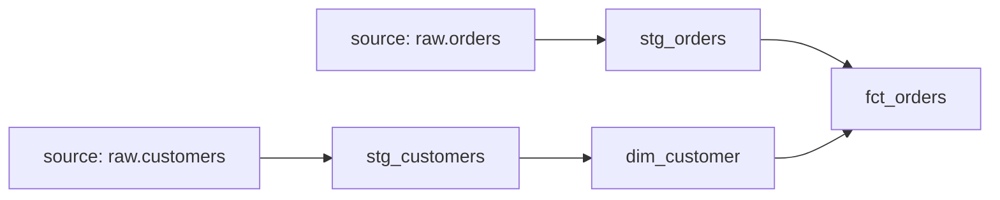

dbt is the tool Analytics Engineer interviews assume. Review the Q&A,
then the concept checks.

> **Note:** dbt compiles these models to your warehouse's SQL dialect, so the SQL below is illustrative. Dataslope's runnable SQL playground uses **DuckDB**.

## Q&A

### What is dbt, and what does it actually do?

dbt is the **T** in extract, load, transform (ELT): you write
transformations as `SELECT` statements ("models"), and dbt handles
building them **in order** in your warehouse, managing dependencies,
materializations, tests, and docs. It brings software practices —
version control, modularity, testing, continuous integration (CI) — to
SQL analytics. It transforms data already in the warehouse; it doesn't
move data (that's EL tools).

### What do `ref()` and `source()` do?

`ref('stg_orders')` references another **model**; `source('raw', 'orders')`
references a declared raw **source** table. Both let dbt build the
dependency graph — a **Directed Acyclic Graph (DAG)** — so it knows
build order and can swap schemas between dev and prod. Hardcoding table
names breaks lineage and environment handling.

Here `fct_orders` builds from two upstream models via `ref()`, so dbt
adds edges from `stg_orders` and `stg_customers` and runs them first:

```sql
-- models/marts/fct_orders.sql
SELECT
    o.order_id,
    o.ordered_at,
    c.customer_name
FROM {{ ref('stg_orders') }}    AS o   -- references another model
JOIN {{ ref('stg_customers') }} AS c   ON c.customer_id = o.customer_id;
```

By contrast, `source('raw', 'orders')` points at a declared raw table
(the `raw` source, `orders` table) rather than a dbt-built model:

```sql
-- Referencing a raw source table
SELECT * FROM {{ source('raw', 'orders') }}
```

### Compare the materializations: view, table, incremental, ephemeral.

- **view** — re-runs the SQL on every query; cheap to build, slower reads.
- **table** — built once per run; fast reads, recomputed fully each run.
- **incremental** — only processes **new/changed** rows on each run; essential for large append-mostly tables.
- **ephemeral** — inlined as a CTE into downstream models; not materialized or queryable on its own.

### How do dbt tests work?

Tests **assert** conditions and fail the run when violated — they don't
modify data. Built-in **schema tests** (`unique`, `not_null`,
`accepted_values`, `relationships`) guard keys and referential integrity;
**singular tests** are custom SQL that should return zero rows. They
encode your assumptions so bad data fails loudly.

### When do you use an incremental model, and what's the catch?

Use it when a table is large and mostly **appends** (events, logs), so
full rebuilds are too slow/expensive. The catch: you need a reliable way
to identify new rows (a timestamp/id via `is_incremental()`), correct
handling of late-arriving/updated rows, and an occasional **full
refresh** to repair drift.

### How does an incremental model actually filter new rows?

The `is_incremental()` macro returns `true` only when the model already exists in the warehouse and the run is not a full refresh. You use it in a `WHERE` clause to limit rows to those newer than the max value already loaded.

Below, the `config()` marks the model `incremental`, and the
`is_incremental()` guard keeps only `events` rows whose `event_at`
exceeds the max already loaded:

```sql
-- models/fct_events.sql
{{
  config(materialized='incremental', unique_key='event_id')
}}

SELECT *
FROM {{ source('raw', 'events') }}


  WHERE event_at > (SELECT MAX(event_at) FROM {{ this }})

```

`{{ this }}` refers to the current model's table in the warehouse.

### What is `dbt snapshot`, and what SCD type does it implement?

`dbt snapshot` implements **Slowly Changing Dimension (SCD) Type 2**: it checks a source table for changed rows on each run and inserts new history rows with `dbt_valid_from` and `dbt_valid_to` timestamps rather than overwriting. You configure it with a `strategy` — `timestamp` (compares an `updated_at` column) or `check` (compares a list of columns). Snapshots are defined in `.sql` files under the `snapshots/` directory.

This `snap_customers` snapshot uses the `timestamp` strategy on the
`updated_at` column, keyed by `customer_id`, to record history of the
raw `customers` source:

```sql

  {{
    config(
      target_schema='snapshots',
      unique_key='customer_id',
      strategy='timestamp',
      updated_at='updated_at',
    )
  }}
  SELECT * FROM {{ source('raw', 'customers') }}

```

### What are seeds in dbt?

Seeds are **CSV files** checked into the repository and loaded into the warehouse as tables via `dbt seed`. They are appropriate for small, rarely-changing reference data (country codes, cost center mappings) that has no upstream source system. They should not be used for large or frequently-changing data.

### What is the difference between `dbt run`, `dbt test`, and `dbt build`?

- `dbt run` — executes model SQL and materializes results.
- `dbt test` — runs schema and singular tests against already-materialized models.
- `dbt build` — combines both in dependency order: for each node it runs the model, then immediately tests it before moving to downstream nodes. It also runs seeds and snapshots. `dbt build` is the preferred CI command.

### What are generic (schema) tests vs. singular tests?

**Generic tests** (`unique`, `not_null`, `accepted_values`, `relationships`) are configured in YAML and applied to columns across many models. **Singular tests** are standalone `.sql` files that return rows when the test fails. Use singular tests for complex, business-specific assertions that don't fit a generic pattern.

This YAML attaches generic tests to `fct_orders`: `unique` and
`not_null` on `order_id`, an `accepted_values` allowlist on `status`,
and a `relationships` check tying `customer_id` back to `dim_customer`:

```yaml
# models/schema.yml — generic tests on fct_orders
models:
  - name: fct_orders
    columns:
      - name: order_id
        tests:
          - unique
          - not_null
      - name: status
        tests:
          - accepted_values:
              values: ['placed', 'shipped', 'delivered', 'cancelled']
      - name: customer_id
        tests:
          - relationships:
              to: ref('dim_customer')
              field: customer_id
```

The singular test below is just a query: any `fct_orders` row with a
negative `amount` is returned, so a non-empty result fails the run:

```sql
-- tests/assert_no_negative_amounts.sql — singular test (returns rows on failure)
SELECT order_id, amount
FROM {{ ref('fct_orders') }}
WHERE amount < 0
```

### How do macros work in dbt?

Macros are **reusable Jinja functions** defined in `.sql` files under the `macros/` directory. They generate SQL dynamically, accept arguments, and can be called from models, other macros, or schema tests. They enable don't repeat yourself (DRY) SQL — for example, a macro that generates a `CASE WHEN` block for currency conversion.

The `cents_to_dollars` macro takes a `column_name` argument and emits
the division expression, so models call it instead of repeating the
`/ 100.0` arithmetic:

```sql
-- macros/cents_to_dollars.sql

  ({{ column_name }} / 100.0)


-- Usage in a model:
-- SELECT {{ cents_to_dollars('amount_cents') }} AS amount_usd
```

### What are dbt packages, and how do you add one?

Packages are **shared dbt projects** (macros, models, tests) installed from the dbt Hub or a Git repo. You declare them in `packages.yml` and run `dbt deps` to install. The most common package is `dbt_utils`, which provides macros like `surrogate_key`, `pivot`, and `date_spine`.

This `packages.yml` pins `dbt-labs/dbt_utils` to version `1.1.1`; `dbt
deps` then fetches that exact release into the project:

```yaml
# packages.yml
packages:
  - package: dbt-labs/dbt_utils
    version: 1.1.1
```

### What is source freshness, and how do you configure it?

Source freshness checks whether a raw source table has been updated recently enough. You declare a `loaded_at_field` (timestamp column) and `freshness` thresholds (`warn_after`, `error_after`) in `sources.yml`, then run `dbt source freshness`. It alerts you when upstream data pipelines are late before bad data propagates through your models.

Here the `orders` source measures lag from its `_loaded_at` column,
warning after 6 hours and erroring after 12:

```yaml
sources:
  - name: raw
    tables:
      - name: orders
        loaded_at_field: _loaded_at
        freshness:
          warn_after: {count: 6, period: hour}
          error_after: {count: 12, period: hour}
```

### What are exposures in dbt?

Exposures declare **downstream consumers** of your dbt models — dashboards, machine learning (ML) models, reverse extract, transform, load (ETL) pipelines — in YAML. They appear in the lineage DAG so you can see which models feed which business artifacts, assess the impact of changes, and communicate dependencies to stakeholders.

This exposure registers a `weekly_revenue_dashboard` that `depends_on`
`fct_orders` and `dim_customer`, so those models show an edge to the
dashboard in lineage:

```yaml
exposures:
  - name: weekly_revenue_dashboard
    type: dashboard
    owner:
      email: analyst@company.com
    depends_on:
      - ref('fct_orders')
      - ref('dim_customer')
```

### How does dbt manage documentation and lineage?

dbt generates a **documentation site** (`dbt docs generate` + `dbt docs serve`) from YAML descriptions on models and columns, plus markdown doc blocks. The site includes an **interactive DAG** showing all model dependencies derived from `ref()` and `source()` calls — giving you lineage from raw source to business intelligence (BI) exposure automatically.

### What are environments and targets in dbt?

A **target** is a named warehouse connection configuration (database, schema, credentials). An **environment** groups targets together — typically `dev` (each developer's own schema) and `prod` (the production schema). The key pattern is that `ref()` automatically resolves to the correct schema for the active target, so models reference each other correctly in both environments without code changes.

### What is the `{{ this }}` variable in dbt?

`{{ this }}` is a Jinja variable that refers to the **currently executing model's relation** (schema + table name) in the warehouse. It is most commonly used inside incremental models to reference the existing table for filtering new rows.

### How do you run only a subset of models in dbt?

Use **node selection syntax** with `dbt run --select`. You can select by model name, directory, tag, or graph operators. The `+` operator selects upstream or downstream nodes.

These three invocations show the common selectors: the `+fct_orders`
graph operator, the `marts` directory path, and the `tag:nightly`
tag selector:

```bash
# Run one model and all its upstream dependencies
dbt run --select +fct_orders

# Run all models in the marts directory
dbt run --select marts

# Run models tagged "nightly"
dbt run --select tag:nightly
```

### What is the `unique_key` config on an incremental model, and what does it control?

`unique_key` tells dbt how to **handle duplicate rows** when merging new data into an incremental model. If a new row's key already exists in the target table, dbt will `MERGE`/`UPDATE` (upsert) rather than inserting a duplicate. Without `unique_key`, dbt only appends; with it, dbt uses a MERGE strategy (or DELETE+INSERT on warehouses that lack MERGE).

Setting `unique_key='event_id'` in the `config()` below means a
re-loaded `event_id` upserts in place instead of appending a duplicate
to `fct_events`:

```sql
-- models/fct_events.sql — incremental with upsert on event_id
{{
  config(
    materialized='incremental',
    unique_key='event_id'
  )
}}

SELECT event_id, user_id, event_at, event_type
FROM {{ source('raw', 'events') }}


  WHERE event_at > (SELECT MAX(event_at) FROM {{ this }})

```

### What is a dbt model contract?

A **model contract** enforces that a model's output schema (column names, data types, and constraints) matches a declared specification. If the model's SQL produces a different shape, the run fails. Contracts are defined in YAML with `contract: {enforced: true}` and column-level `data_type` declarations. They are useful for models with downstream consumers who depend on a stable interface.

With `enforced: true`, dbt fails the run unless `fct_orders` emits
`order_id` as `bigint` (and `not_null`) and `amount_usd` as `numeric`:

```yaml
models:
  - name: fct_orders
    config:
      contract:
        enforced: true
    columns:
      - name: order_id
        data_type: bigint
        constraints:
          - type: not_null
      - name: amount_usd
        data_type: numeric
```

### How does CI for dbt typically work?

On a pull request, CI runs `dbt build --select state:modified+` — building and testing only models changed in the PR plus their downstream dependents. This uses **state comparison** (`--state`) against the production manifest artifact to determine what changed. It catches breakage early without rebuilding every model, keeping CI fast.

### What is the `dbt-project.yml` file, and what does it control?

`dbt_project.yml` is the root configuration file. It defines the project name, dbt version, model directories, and **default configurations** for models by directory path (materialization, tags, schema overrides). Configurations cascade: project-level defaults are overridden by directory-level, then model-level `config()` blocks.

### What is an ephemeral model, and when should you use it?

An ephemeral model is **not materialized** — it is compiled as a CTE and injected into any model that references it. Use ephemeral models for intermediate logic that is referenced only once or twice and does not need to be queryable directly. Avoid them when the same logic is referenced by many downstream models (the CTE is duplicated each time) or when you need to test the intermediate result directly.

The `materialized='ephemeral'` config means `int_orders_cleaned` is
never built as its own object; this cleanup SELECT is inlined as a CTE
wherever a downstream model `ref()`s it:

```sql
-- models/intermediate/int_orders_cleaned.sql
{{ config(materialized='ephemeral') }}

SELECT
    order_id,
    customer_id,
    amount_cents / 100.0 AS amount_usd
FROM {{ source('raw', 'orders') }}
WHERE amount_cents > 0
```

### How do you pass variables into dbt models?

Use `var()` in Jinja to reference variables defined in `dbt_project.yml` under `vars:` or passed on the CLI with `--vars`. This enables environment-aware logic without code changes.

In the model, `var("start_date")` injects the variable's value into the
`WHERE` filter at compile time:

```sql
-- In a model
WHERE order_date >= '{{ var("start_date") }}'
```

At run time, `--vars` supplies that `start_date` value as JSON,
overriding any default set in `dbt_project.yml`:

```bash
# Override on the CLI
dbt run --vars '{"start_date": "2024-01-01"}'
```

### What is the difference between `dbt run --full-refresh` and a normal incremental run?

A normal incremental run filters source data to only new/changed rows using your `is_incremental()` logic and merges them into the existing table. `--full-refresh` drops and rebuilds the table from scratch, ignoring `is_incremental()` entirely. Use full refresh periodically to correct drift, remove deleted rows, or apply schema changes.

### What does `dbt source freshness` check, and how is it different from a dbt test?

`dbt source freshness` checks the **recency of raw source data** — whether upstream data has landed in time — before transformation runs. A regular dbt test checks the **quality of already-transformed model output** (nulls, uniqueness, etc.). Source freshness is a pre-transformation check; tests are post-transformation checks.

### How do you version a dbt model?

dbt supports **model versioning** natively (v1.5+): you declare multiple versions of a model in YAML with a `versions:` key, each potentially pointing to a different SQL file. Downstream models can pin to a specific version using `ref('model_name', version=1)`. This lets you roll out breaking schema changes gradually without forcing all consumers to migrate at once.

### What is the dbt lineage DAG, and how is it built?

The DAG (Directed Acyclic Graph) is constructed automatically by parsing every `ref()` and `source()` call across all model files. Each call creates a directed edge from the referenced model to the current model. dbt uses the DAG to determine execution order, parallelize independent branches, and power the documentation lineage view.

A typical slice of that graph — raw sources flowing through staging models into marts — looks like this:



### How do you handle environment-specific schemas in dbt?

Use the `generate_schema_name` macro (customizable) and the `schema` config. In dev, most teams append the developer's name to the schema (`dbt_alice_staging`) to avoid conflicts. In prod, the schema is the standard name. The default behavior uses the `target.schema` from the profile plus any model-level schema override.

### What is `dbt debug`, and when do you use it?

`dbt debug` tests your **connection configuration** — it validates the `profiles.yml` and confirms dbt can connect to the warehouse. Use it when setting up a new environment or troubleshooting connection errors before spending time diagnosing model logic.

### What are dbt's four built-in generic tests, and what does each check?

- `unique` — every value in the column is distinct (no duplicates).
- `not_null` — no `NULL` values exist in the column.
- `accepted_values` — every value is in a declared allowed list.
- `relationships` — every value in a column has a matching row in a referenced model (referential integrity).

## Concept checks

<MultipleChoice
  markdown={`A dbt model is queried constantly by dashboards and is expensive to compute, but its source updates only nightly. Best default materialization?

- \`view\`
  > A view re-runs the SQL on every query, pushing the expensive computation onto every dashboard load.
- [o] \`table\`
  > Compute once per nightly run, serve fast reads all day — the right trade-off for an expensive, frequently-read, slowly-changing model.
- \`ephemeral\`
  > Ephemeral models are inlined as CTEs and aren't queryable on their own, so dashboards can't read them.
- It doesn't matter; they perform identically.
  > Materializations have very different read/compute trade-offs.`}
/>

<MultipleChoice
  markdown={`Why reference an upstream model with \`ref('stg_orders')\` instead of a hardcoded \`analytics.stg_orders\`?

- It runs the query faster.
  > \`ref\` doesn't change runtime performance; it changes how dbt builds the project.
- [o] dbt builds the dependency graph from \`ref\`/\`source\`, so it knows build order and can manage dev/prod environments.
  > \`ref\` is how dbt learns dependencies, enabling correct run ordering, lineage, and schema swapping.
- It lets you skip writing tests.
  > Testing is orthogonal to \`ref\`.
- It converts the model to a view automatically.
  > \`ref\` has nothing to do with materialization choice.`}
/>

<MultipleChoice
  markdown={`A \`unique\` + \`not_null\` test on a model's \`id\` column gives you what?

- It deduplicates the column automatically during the run.
  > dbt tests **assert**; they don't modify data. A failure surfaces the problem to fix upstream.
- [o] A check that fails the run if \`id\` has duplicates or nulls — guarding the model's grain and key integrity.
  > These schema tests validate that \`id\` is a valid primary key and fail loudly when violated.
- A guarantee the source system can never produce bad data.
  > Tests catch bad data after the fact; they can't constrain the source.
- A performance index on \`id\`.
  > Tests aren't indexes; they don't change physical storage.`}
/>
