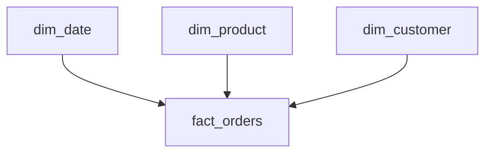

The Analytics Engineer's craft is turning raw tables into clean,
well-grained dimensional models. Review the Q&A, then build a mart.

<Figure
  slug="interview-analytics-engineer-dimensional-modeling-cutout"
  alt="A central fact block on a platform with four dimension blocks radiating from it like a star, each joined by a short rail"
/>

> **SQL dialect:** the runnable challenge on this page executes in your browser on **DuckDB**, so the SQL below targets DuckDB. It is standard SQL except where noted.

## Q&A

### What are fact and dimension tables?

A **fact** table records measurable **events** at a defined grain (one
row per order line) with numeric **measures** and foreign keys.
**Dimension** tables hold the descriptive attributes you slice by
(customer, product, date). Facts answer "how much/how many"; dimensions
answer "by what."

### What is the grain, and why pin it down first?

The grain is what **one row represents**. Declaring it ("one row per
order line item") up front keeps measures additive and prevents
double-counting. Every column then either describes that grain or is a
measure at that grain.

<Callout type="tip" title="Interview tip">
State the grain in a single sentence ("one row per order line item")
before you talk about measures or keys. Interviewers read a clearly
declared grain as the signal that you can model dimensionally.
</Callout>

### Star vs snowflake?

**Star** keeps dimensions denormalized (one table each) for simple, fast
joins, the Business Intelligence (BI) default. **Snowflake** normalizes
dimensions into sub-tables, reducing redundancy at the cost of more joins.
Prefer star unless a dimension is huge or genuinely shared.

A star schema is exactly that shape, one central fact table surrounded by
single-table dimensions:



The query below is a textbook star-schema read: the central `fact_orders`
table joins directly to two single-table dimensions (`dim_date` and
`dim_product`) on their surrogate keys, then sums revenue grouped by the
descriptive attributes those dimensions provide. Because each dimension is
one flat table, there are no extra hops, exactly the simplicity that makes
the star the default shape.

<SqlCodeBlock
  dialect="duckdb"
  initSql={`CREATE TABLE dim_date AS SELECT * FROM (VALUES
  (1, DATE '2024-01-15'), (2, DATE '2024-01-16'), (3, DATE '2024-01-17'),
  (4, DATE '2024-01-18'), (5, DATE '2024-01-19'), (6, DATE '2024-01-20')
) AS t(date_sk, full_date);

CREATE TABLE dim_product AS SELECT * FROM (VALUES
  (10, 'Electronics'), (11, 'Books'), (12, 'Home'),
  (13, 'Garden'), (14, 'Toys'), (15, 'Sports')
) AS t(product_sk, category);

CREATE TABLE fact_orders AS SELECT * FROM (VALUES
  (1001, 1, 10, 299.99), (1002, 1, 11, 19.99), (1003, 2, 10, 499.00),
  (1004, 3, 12, 89.50),  (1005, 2, 11, 14.99), (1006, 1, 13, 65.00),
  (1007, 2, 14, 35.00),  (1008, 3, 15, 120.00), (1009, 4, 10, 189.99),
  (1010, 4, 11, 27.50),  (1011, 4, 12, 210.00), (1012, 5, 13, 92.50),
  (1013, 5, 14, 62.25),  (1014, 5, 15, 145.00), (1015, 6, 10, 550.00),
  (1016, 6, 11, 39.75),  (1017, 6, 12, 165.30), (1018, 1, 14, 48.00),
  (1019, 2, 13, 73.60),  (1020, 3, 10, 315.75), (1021, 4, 15, 88.40),
  (1022, 5, 11, 18.25),  (1023, 6, 13, 145.00), (1024, 3, 14, 54.90)
) AS t(order_id, order_date_sk, product_sk, amount);`}
  starterCode={`-- Classic star-schema join: fact + two dimensions
SELECT
    d.full_date,
    p.category,
    SUM(f.amount) AS revenue
FROM fact_orders f
JOIN dim_date    d ON d.date_sk    = f.order_date_sk
JOIN dim_product p ON p.product_sk = f.product_sk
GROUP BY d.full_date, p.category
ORDER BY d.full_date, p.category;`}
/>

### What is a surrogate key, and why prefer it over a natural key?

A **surrogate key** is a synthetic, meaningless identifier (an integer or
hash) for a dimension row, independent of the source's **natural key**.
It's stable across source changes, enables Slowly Changing Dimension (SCD)
Type 2 (each version gets its own surrogate), and keeps fact joins fast and
decoupled from business identifiers.

The query below derives a surrogate key by hashing the natural key
(`customer_id`) and carries the natural key alongside it, so downstream
facts can join on the stable `customer_sk` while you can still trace back
to the source identifier:

```sql
-- Hash-based surrogate key (DuckDB: md5 returns a hex string)
SELECT
    md5(customer_id::TEXT)  AS customer_sk,  -- surrogate
    customer_id,                              -- natural key
    customer_name,
    region
FROM stg_customers;
```

### How do staging, intermediate, and mart layers differ?

- **Staging**, one model per source table; light cleaning/renaming/typing, no business logic.
- **Intermediate**, reusable business logic, joins, and reshaping.
- **Marts**, final, consumable tables (facts + dimensions) for BI.

This layering keeps transformations modular, testable, and DRY.

### What are the three types of fact tables?

- **Transaction fact**, one row per discrete event (order placed, click, payment). The most common type; naturally append-only.
- **Periodic snapshot**, one row per entity per time period (account balance on the last day of each month). Captures state at regular intervals even when nothing changed.
- **Accumulating snapshot**, one row per business process instance (one row per order), updated in-place as the instance moves through milestones. Multiple date FKs mark each stage.

### What is the difference between additive, semi-additive, and non-additive measures?

**Additive** measures (revenue, quantity) can be summed across all dimensions. **Semi-additive** measures (account balance, inventory level) can be summed across some dimensions (products, stores) but not time, summing balances across months gives a meaningless number. **Non-additive** measures (ratios, percentages, distinct counts) cannot be summed across any dimension and must be recalculated from grain-level rows.

### What is SCD Type 1, and when should you use it?

SCD Type 1 **overwrites** the old attribute value with the new one, preserving no history. Use it when historical accuracy doesn't matter, correcting a typo in a name, for example, or when the business explicitly only cares about the current state.

### What is SCD Type 2, and how is it implemented?

SCD Type 2 adds a **new row** for each attribute change, preserving the full history. Each row gets its own surrogate key plus `valid_from`, `valid_to`, and `is_current` columns. Fact rows joined to their surrogate key automatically reflect the attribute values that were true at event time.

Follow-ups usually go to what that costs. Type 1 keeps one row per entity
forever; Type 2 keeps one row per *version*, so the table grows with the
churn rate and every query has to say which version it means:

<Chart slug="scd2-row-growth" />

The runnable example below makes this tangible. The `initSql` setup seeds a
`dim_customer` in which customer 42 has **two** versions, an `East` row
valid through 2023-06-14 and a `West` row valid afterward, and the comment
header above it shows that row layout at a glance. The query then joins
each order to the version that was current on its `order_date`, using the
predicate `f.order_date BETWEEN c.valid_from AND c.valid_to`. The output
attributes the 2022 order to `East` and the 2024 order to `West`: that
`BETWEEN` against the validity window is exactly the mechanism that makes
Type 2 history queryable point-in-time.

<SqlCodeBlock
  dialect="duckdb"
  initSql={`-- SCD Type 2 row layout: customer moved from East to West
-- customer_sk  customer_id  region  valid_from    valid_to      is_current
--  1001         42           East    2020-01-01    2023-06-14    FALSE
--  1002         42           West    2023-06-15    9999-12-31    TRUE
CREATE TABLE dim_customer AS SELECT * FROM (VALUES
  (1001, 42, 'Acme Corp', 'East', DATE '2020-01-01', DATE '2023-06-14', FALSE),
  (1002, 42, 'Acme Corp', 'West', DATE '2023-06-15', DATE '9999-12-31', TRUE),
  (1003, 99, 'Globex', 'North', DATE '2021-03-01', DATE '9999-12-31', TRUE),
  (1004, 17, 'Initech', 'South', DATE '2019-04-01', DATE '2022-08-31', FALSE),
  (1005, 17, 'Initech', 'East', DATE '2022-09-01', DATE '9999-12-31', TRUE),
  (1006, 23, 'Umbrella', 'West', DATE '2020-06-15', DATE '2023-01-31', FALSE),
  (1007, 23, 'Umbrella', 'North', DATE '2023-02-01', DATE '9999-12-31', TRUE),
  (1008, 31, 'Hooli', 'East', DATE '2021-01-01', DATE '9999-12-31', TRUE),
  (1009, 55, 'Stark Ind', 'South', DATE '2018-03-01', DATE '2021-11-30', FALSE),
  (1010, 55, 'Stark Ind', 'West', DATE '2021-12-01', DATE '2023-09-30', FALSE),
  (1011, 55, 'Stark Ind', 'North', DATE '2023-10-01', DATE '9999-12-31', TRUE),
  (1012, 68, 'Wayne Ent', 'East', DATE '2020-02-01', DATE '9999-12-31', TRUE),
  (1013, 74, 'Cyberdyne', 'West', DATE '2019-09-01', DATE '2022-04-30', FALSE),
  (1014, 74, 'Cyberdyne', 'South', DATE '2022-05-01', DATE '9999-12-31', TRUE),
  (1015, 86, 'Tyrell Corp', 'North', DATE '2021-07-01', DATE '9999-12-31', TRUE),
  (1016, 91, 'Soylent', 'South', DATE '2020-10-01', DATE '2023-03-31', FALSE),
  (1017, 91, 'Soylent', 'East', DATE '2023-04-01', DATE '9999-12-31', TRUE),
  (1018, 12, 'Massive Dyn', 'West', DATE '2019-01-01', DATE '9999-12-31', TRUE),
  (1019, 28, 'Aperture', 'North', DATE '2021-05-01', DATE '2022-12-31', FALSE),
  (1020, 28, 'Aperture', 'South', DATE '2023-01-01', DATE '9999-12-31', TRUE),
  (1021, 39, 'Vandelay', 'East', DATE '2020-08-01', DATE '9999-12-31', TRUE),
  (1022, 47, 'Duff Beer', 'West', DATE '2018-11-01', DATE '2021-06-30', FALSE),
  (1023, 47, 'Duff Beer', 'North', DATE '2021-07-01', DATE '9999-12-31', TRUE),
  (1024, 63, 'Gringotts', 'South', DATE '2022-02-01', DATE '9999-12-31', TRUE)
) AS t(customer_sk, customer_id, customer_name, region, valid_from, valid_to, is_current);

CREATE TABLE fact_orders AS SELECT * FROM (VALUES
  (5001, 42, DATE '2022-05-10', 1200.00), (5002, 42, DATE '2024-02-20', 850.00),
  (5003, 99, DATE '2023-11-01', 320.00),  (5004, 17, DATE '2021-07-14', 640.00),
  (5005, 17, DATE '2023-03-08', 415.00),  (5006, 23, DATE '2022-04-19', 980.00),
  (5007, 23, DATE '2023-08-22', 275.00),  (5008, 31, DATE '2022-10-05', 1530.00),
  (5009, 55, DATE '2020-06-11', 720.00),  (5010, 55, DATE '2022-09-27', 460.00),
  (5011, 55, DATE '2024-01-16', 1105.00), (5012, 68, DATE '2023-05-30', 385.00),
  (5013, 74, DATE '2021-03-24', 890.00),  (5014, 74, DATE '2023-12-09', 540.00),
  (5015, 86, DATE '2022-11-18', 1250.00), (5016, 91, DATE '2021-12-02', 305.00),
  (5017, 91, DATE '2024-03-15', 770.00),  (5018, 12, DATE '2022-06-07', 1420.00),
  (5019, 28, DATE '2022-03-21', 195.00),  (5020, 28, DATE '2023-09-13', 660.00),
  (5021, 39, DATE '2023-02-26', 1080.00), (5022, 47, DATE '2020-09-04', 425.00),
  (5023, 47, DATE '2023-06-17', 935.00),  (5024, 63, DATE '2023-10-28', 580.00)
) AS t(order_id, customer_id, order_date, amount);`}
  starterCode={`-- Join a fact to the historically-correct dimension row
SELECT
    f.order_id,
    c.region       AS region_at_order_time,
    f.amount
FROM fact_orders f
JOIN dim_customer c
    ON  c.customer_id = f.customer_id
    AND f.order_date BETWEEN c.valid_from AND c.valid_to
ORDER BY f.order_id;`}
/>

When you instead want only the **current** state of each customer, not the
full history, you filter on the `is_current` flag, which is `TRUE` for
exactly one row per entity. That turns the versioned dimension back into a
simple "latest value" lookup:

```sql
-- Read only the present state of each customer (one row per entity)
SELECT
    customer_sk,      -- surrogate key
    customer_id,      -- natural key
    customer_name,
    region,
    valid_from,
    valid_to,
    is_current
FROM dim_customer
WHERE is_current = TRUE;
```

### What is SCD Type 3, and what is its main limitation?

SCD Type 3 adds a **second column** to track the previous value (e.g., `region` and `prev_region`). It lets you compare current vs. one prior state without joining to history rows, but it only stores one level of history and becomes awkward if you need to track more than one change.

### What is SCD Type 0?

SCD Type 0 means the attribute **never changes**, the original value is kept forever and no update mechanism exists. Natural keys, date-of-birth, or original channel attribution are typical examples.

### What is a conformed dimension?

A conformed dimension is shared across **multiple fact tables or subject areas** with the same keys and attribute definitions. `dim_date` and `dim_customer` are classic examples. Conformed dimensions allow you to drill across facts (combining metrics from different processes in one query) without distorting comparisons.

### What is a degenerate dimension?

A degenerate dimension is a dimensional attribute stored directly in the fact table rather than in a separate dimension table, because it has no descriptive attributes of its own. An order number or invoice number is the canonical example, it provides grouping ability but carries no extra columns worth their own table.

The query below groups by `order_number` straight off the fact table, there is no `dim_order` to join, showing how a degenerate dimension still supports grouping even though it lives on the fact:

```sql
-- order_number lives in the fact table (degenerate dimension)
-- No separate dim_order table exists
SELECT
    order_number,               -- degenerate dimension, grouping only
    SUM(line_amount) AS total
FROM fact_order_lines
GROUP BY order_number;
```

### What is a role-playing dimension?

A role-playing dimension is a single physical dimension table used **multiple times** in the same fact table under different aliases. A `dim_date` table might be joined three times to `fact_orders` as `order_date`, `ship_date`, and `delivery_date`, each a "role."

In the query below, `dim_date` is joined to `fact_orders` three separate times under three aliases (`od`, `sd`, `dd`), each turning a different date key into a readable date. One physical table plays three roles in a single result:

<SqlCodeBlock
  dialect="duckdb"
  initSql={`CREATE TABLE dim_date AS SELECT * FROM (VALUES
  (1, DATE '2024-03-01'), (2, DATE '2024-03-03'), (3, DATE '2024-03-07'),
  (4, DATE '2024-03-10'), (5, DATE '2024-03-12'), (6, DATE '2024-03-15'),
  (7, DATE '2024-03-17'), (8, DATE '2024-03-19'), (9, DATE '2024-03-21'),
  (10, DATE '2024-03-24'), (11, DATE '2024-03-26'), (12, DATE '2024-03-28'),
  (13, DATE '2024-03-30'), (14, DATE '2024-04-02'), (15, DATE '2024-04-04'),
  (16, DATE '2024-04-06'), (17, DATE '2024-04-09'), (18, DATE '2024-04-11'),
  (19, DATE '2024-04-13'), (20, DATE '2024-04-16'), (21, DATE '2024-04-18'),
  (22, DATE '2024-04-20'), (23, DATE '2024-04-23'), (24, DATE '2024-04-25'),
  (25, DATE '2024-04-27'), (26, DATE '2024-04-30')
) AS t(date_sk, full_date);

CREATE TABLE fact_orders AS SELECT * FROM (VALUES
  (101, 1, 2, 3),    (102, 3, 4, 5),    (103, 4, 5, 6),
  (104, 2, 3, 5),    (105, 5, 6, 8),    (106, 6, 7, 9),
  (107, 7, 9, 10),   (108, 8, 9, 11),   (109, 9, 10, 12),
  (110, 10, 12, 13), (111, 11, 12, 14), (112, 12, 13, 15),
  (113, 13, 14, 16), (114, 14, 15, 17), (115, 15, 17, 18),
  (116, 16, 17, 19), (117, 17, 18, 20), (118, 18, 20, 21),
  (119, 19, 20, 22), (120, 20, 21, 23), (121, 21, 23, 24),
  (122, 22, 23, 25), (123, 23, 24, 26), (124, 24, 25, 26)
) AS t(order_id, order_date_sk, ship_date_sk, delivery_date_sk);`}
  starterCode={`-- Role-playing dimension: dim_date joined three times under different aliases
SELECT
    o.order_id,
    od.full_date   AS order_date,
    sd.full_date   AS ship_date,
    dd.full_date   AS delivery_date
FROM fact_orders o
JOIN dim_date od ON od.date_sk = o.order_date_sk
JOIN dim_date sd ON sd.date_sk = o.ship_date_sk
JOIN dim_date dd ON dd.date_sk = o.delivery_date_sk
ORDER BY o.order_id;`}
/>

### What is a junk dimension?

A junk dimension bundles **miscellaneous low-cardinality flags and indicators** that don't belong to any natural dimension into a single table. Instead of cluttering the fact with many boolean columns (is_promo, is_gift_wrap, is_expedited), you create all combinations as rows in a junk dimension and store only its foreign key in the fact.

### What is a factless fact table?

A factless fact table records **events or coverage** with no numeric measure, just foreign keys. Examples: student course enrollments (the fact is attendance, not a count), or a coverage fact listing which products are on promotion in which stores on which days. You derive counts by querying "how many rows match this criteria."

Because there is no measure to sum, you answer questions by **counting rows**. The query below counts how many distinct products were on promotion in one store over a week, the kind of coverage question a factless fact exists to answer:

```sql
-- Factless fact: which products were on promotion per store per day
-- fact_promotion_coverage(date_sk, store_sk, product_sk), no measures

-- "How many distinct products were promoted in store 5 last week?"
SELECT COUNT(*) AS promoted_products
FROM fact_promotion_coverage pc
JOIN dim_date d ON d.date_sk = pc.date_sk
WHERE pc.store_sk = 5
  AND d.full_date BETWEEN '2024-01-01' AND '2024-01-07';
```

### What is a bridge table, and when do you need one?

A bridge table resolves **many-to-many relationships** between a fact and a dimension. For example, an order can have multiple promotions, and a promotion can apply to multiple orders. The bridge table contains (order_sk, promotion_sk) pairs with an optional weighting factor. It avoids row multiplication in the fact while still allowing drill-down to all related dimension members.

The row multiplication is worth seeing, because the wrong answer does not
look wrong. A join that matches each order several times inflates every
`SUM` by the same factor, and the result set is a perfectly ordinary size:

<Chart slug="join-fanout-rows" />

The query below joins `fact_orders` to `dim_promotion` *through* the `bridge_order_promotion` table and multiplies each order's amount by the bridge's `weight_factor`. That weighting splits one order's value across its promotions (0.6 / 0.4 for order 201) instead of double-counting the full amount once per promotion:

<SqlCodeBlock
  dialect="duckdb"
  initSql={`CREATE TABLE dim_promotion AS SELECT * FROM (VALUES
  (1, 'Summer Sale'), (2, 'Loyalty 10%'), (3, 'Flash Deal'),
  (4, 'Free Shipping'), (5, 'Bundle Discount'), (6, 'Referral Credit')
) AS t(promotion_sk, promotion_name);

CREATE TABLE fact_orders AS SELECT * FROM (VALUES
  (201, 1001, 500.00), (202, 1002, 200.00), (203, 1003, 350.00),
  (204, 1004, 275.00), (205, 1005, 620.00), (206, 1006, 145.00),
  (207, 1007, 890.00), (208, 1008, 310.00), (209, 1009, 465.00),
  (210, 1010, 180.00), (211, 1011, 725.00), (212, 1012, 240.00)
) AS t(order_sk, order_id, amount);

CREATE TABLE bridge_order_promotion AS SELECT * FROM (VALUES
  (201, 1, 0.6), (201, 2, 0.4), (202, 1, 1.0), (203, 3, 1.0),
  (204, 2, 0.5), (204, 4, 0.5), (205, 1, 0.7), (205, 5, 0.3),
  (206, 4, 1.0), (207, 2, 0.4), (207, 3, 0.3), (207, 6, 0.3),
  (208, 5, 1.0), (209, 1, 0.5), (209, 6, 0.5), (210, 3, 1.0),
  (211, 2, 0.25), (211, 4, 0.25), (211, 5, 0.25), (211, 6, 0.25),
  (212, 1, 0.8), (212, 3, 0.2), (203, 6, 0.0), (202, 4, 0.0)
) AS t(order_sk, promotion_sk, weight_factor);`}
  starterCode={`-- Bridge table join: list each order with all applied promotions
SELECT
    f.order_id,
    p.promotion_name,
    f.amount * b.weight_factor AS allocated_amount
FROM fact_orders f
JOIN bridge_order_promotion b  ON b.order_sk    = f.order_sk
JOIN dim_promotion          p  ON p.promotion_sk = b.promotion_sk
ORDER BY f.order_id, p.promotion_name;`}
/>

### How does Kimball's approach differ from Inmon's?

**Kimball** is bottom-up: build dimensional models (star schemas) directly for each business process; marts can be built independently and conformed together. **Inmon** is top-down: first build a normalized enterprise data warehouse (3NF), then derive departmental data marts from it. Kimball delivers value faster; Inmon produces a single consistent source of truth but requires more upfront effort.

### What is normalization in 3NF, and why does dimensional modeling deliberately avoid it for dimensions?

Third Normal Form (3NF) eliminates all non-key dependencies and redundancy to optimize for write performance and consistency. Dimensional modeling denormalizes dimensions intentionally, collapsing hierarchies into one wide table, to minimize joins, simplify BI tool queries, and improve query readability at the cost of some redundancy.

### What is a wide (one-big-table) approach, and when is it appropriate?

A wide table (one big table) pre-joins dimensions into the fact, producing a single flat table with all attributes. It maximizes query speed and simplifies BI tooling, but loses the flexibility of separate dimension tables and makes maintenance harder. It is appropriate for highly performance-sensitive use cases or for serving tools that struggle with joins.

### How do you handle late-arriving dimension records?

When a fact row arrives before its matching dimension row exists, you either use a **placeholder/default dimension row** (unknown member) and later run a correction job to update fact rows once the dimension record lands, or you hold (buffer) the fact rows until the dimension catches up. The important thing is never to drop the fact row, because the event happened.

### How do you handle late-arriving facts?

Late-arriving facts should still be loaded at their correct event time using their correct dimension keys (pointing to whatever the dimension's state was at that time in SCD2). Periodic snapshot facts may need to be regenerated for the affected period; accumulating snapshots are simply updated in place.

### What is a mini-dimension?

A mini-dimension extracts **rapidly changing attributes** from a large dimension into a separate smaller table with its own surrogate key. For example, customer demographics (age band, income band) might change frequently, while name and address stay stable. The mini-dimension is stored separately and pointed to by the fact, avoiding constant SCD2 row proliferation in the main customer dimension.

### How would you model a many-to-many relationship between customers and accounts in a bank data warehouse?

Use a **bridge table**, `bridge_customer_account(account_sk, customer_sk, ownership_pct)`, between `dim_customer` and `fact_account_balance`. Each account can belong to multiple customers and vice versa. The optional weighting column allows metrics to be allocated proportionally across co-owners.

### What is the purpose of a date dimension, and what columns does it typically include?

`dim_date` pre-calculates every calendar attribute for each date so queries avoid repetitive `EXTRACT` or `DATE_TRUNC` calls. Typical columns: `date_sk`, `full_date`, `year`, `quarter`, `month`, `month_name`, `week_of_year`, `day_of_week`, `day_name`, `is_weekend`, `is_holiday`, `fiscal_year`, `fiscal_quarter`. Having it allows simple filtering like `WHERE dim_date.is_holiday = TRUE`.

### When would you choose a periodic snapshot over a transaction fact?

Choose a periodic snapshot when you need to **track status at regular intervals** regardless of whether a transaction occurred. Bank account balances, inventory levels, and subscription statuses are classic cases, you need the value at month-end even if no transaction happened that month. The transaction fact tells you what changed; the periodic snapshot tells you what the state was.

### What does "drilling across" mean in dimensional modeling?

Drilling across means **combining metrics from two or more fact tables** in a single report. It works by querying each fact independently using conformed dimensions (same keys, same grain for the shared dimension), then outer-joining the result sets on the conformed dimension keys. Because dimensions are conformed, the join is valid and the metrics are comparable.

### How do you handle a slowly changing measure in a fact table?

Measures in fact tables are generally fixed at event time and should not change. If a value must be corrected, prefer inserting a reversing row (negative adjustment) plus the corrected row rather than updating in place. For true restated history (e.g., revenue re-recognized under new rules), version the fact or store the restatement as a separate measure column.

### What are the trade-offs of using a hash surrogate key vs. a sequence integer?

**Hash surrogates** (e.g., `MD5(natural_key)`) are deterministic, you can compute the same key in any environment without a central sequence, which helps distributed/incremental builds. **Integer sequences** are more compact, faster for joins, and easier to debug, but require a coordination mechanism. Hashes can collide (rare but possible) and are larger in storage. Most modern data warehouses use either approach; hashes are common in dbt pipelines.

The two queries below contrast the approaches: the first hashes the natural key (computable anywhere, no central counter), while the second assigns a sequential integer with `row_number()` (compact and human-readable, but dependent on a single ordering pass):

```sql
-- Hash surrogate (DuckDB): deterministic, no sequence needed
SELECT md5(customer_id::TEXT) AS customer_sk, customer_id, customer_name
FROM stg_customers;

-- Integer surrogate (DuckDB): compact, human-readable
SELECT row_number() OVER (ORDER BY customer_id) AS customer_sk,
       customer_id, customer_name
FROM stg_customers;
```

### What is the difference between a fact's grain and its level of aggregation?

**Grain** is the finest level of detail stored in the fact table (one row per order line). **Aggregation level** refers to how high you've rolled up the data for a particular query or mart. A mart can aggregate the grain-level fact to the category-day level, but the underlying fact retains order-line grain. Confusing the two leads to double-counting when joining at the wrong level.

### Why should you avoid storing percentages or ratios directly in fact tables?

Percentages and ratios are **non-additive**, summing a margin percentage across orders gives a meaningless number. Instead, store the additive components (gross_revenue, cost_of_goods_sold) and let the BI layer or mart compute the ratio. This preserves flexibility and correctness across any grouping.

### What is the difference between a confirmed vs. a conformed dimension?

This is a vocabulary check: the correct term is **conformed** dimension (consistent definition and keys shared across facts/subject areas). "Confirmed" is not a standard dimensional modeling term. A conformed dimension like `dim_date` means the same thing in every mart, so metrics from different facts can be joined on it.

## Concept checks

<MultipleChoice
  markdown={`A mart has **one row per category** (revenue per category). In dimensional terms, what's the "grain" of this table?

- One row per product.
  > Products are rolled up into categories here, so product isn't the grain.
- [o] One row per category.
  > Grain is the level of detail one row represents. After \`GROUP BY category\`, each row is exactly one category.
- Grain doesn't apply to aggregated tables.
  > Every table has a grain, defining it (here, per category) is the first modeling step.
- One row per order.
  > That's the grain of the *source* fact table; the mart aggregates orders away.`}
/>

## Challenges

<SqlChallengeCard
  dialect="duckdb"
  title="Revenue by category"
  instructions={`Two tables are loaded: \`fact_orders\` (\`order_id\`, \`product_id\`, \`amount\`) and \`dim_product\` (\`product_id\`, \`category\`). Build a mart of **total revenue per category**: join the fact to the dimension and sum \`amount\`. Columns: \`category\`, \`revenue\`. Sort by \`revenue\` descending.`}
  initSql={`CREATE TABLE dim_product AS SELECT * FROM (VALUES
  (1, 'Books'), (2, 'Books'), (3, 'Electronics'), (4, 'Home'),
  (5, 'Books'), (6, 'Electronics'), (7, 'Home'), (8, 'Garden'),
  (9, 'Garden'), (10, 'Toys'), (11, 'Toys'), (12, 'Sports')
) AS t(product_id, category);

CREATE TABLE fact_orders AS SELECT * FROM (VALUES
  (1001, 1, 20.00),  (1002, 2, 15.00),  (1003, 3, 200.00),
  (1004, 3, 150.00), (1005, 4, 60.00),  (1006, 1, 25.00),
  (1007, 5, 32.50),  (1008, 6, 480.00), (1009, 7, 120.00),
  (1010, 8, 65.00),  (1011, 9, 92.50),  (1012, 10, 35.00),
  (1013, 11, 62.25), (1014, 12, 145.00), (1015, 2, 18.25),
  (1016, 3, 315.75), (1017, 4, 210.00), (1018, 5, 27.00),
  (1019, 6, 199.99), (1020, 7, 88.40),  (1021, 8, 145.00),
  (1022, 10, 48.00), (1023, 11, 55.50), (1024, 12, 73.60)
) AS t(order_id, product_id, amount);`}
  starterCode={`-- Join the fact to the dimension, then aggregate by category.
SELECT
  p.category
  -- , revenue here
FROM fact_orders f
-- join dim_product, group, order;`}
  solutionSql={`SELECT
  p.category,
  SUM(f.amount) AS revenue
FROM fact_orders f
JOIN dim_product p ON p.product_id = f.product_id
GROUP BY p.category
ORDER BY revenue DESC;`}
  tests={[
    { id: "row_count", name: "One row per category", description: "Three categories → three rows", expectedRowCount: 6 },
    { id: "columns", name: "Has the required columns", description: "category and revenue", expectedColumnsInclude: ["category", "revenue"] },
  ]}
/>

## Go deeper

- [Database Design with PostgreSQL](/courses/database-design-postgresql)
- [SQL Analytics with DuckDB](/courses/sql-analytics-duckdb)
