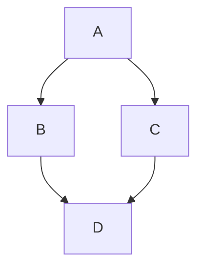

The core of a coding interview. Review the Q&A, take the concept checks,
then solve the three challenges, they run against a test suite in your
browser.

<Figure
  slug="interview-backend-engineer-algorithms-cutout"
  alt="A branching binary tree of blocks on a platform beside a sorted rail of ascending bars, a small pointer marking the middle bar"
/>

## Q&A

### What is Big-O notation, and why do interviewers care?

Big-O describes how an algorithm's time or space grows with input size
**n**, ignoring constants, $O(1)$, $O(\log n)$, $O(n)$, $O(n \log n)$,
$O(n^2)$, … Interviewers care because it predicts whether a solution
scales: an $O(n^2)$ double loop that's fine for 100 items melts at
1,000,000. The usual game is "make this brute-force $O(n^2)$ into $O(n)$
with the right data structure."

### When do you reach for a hash map?

When you need **$O(1)$ average lookup/insert by key**, membership tests,
counting frequencies, grouping, or "have I seen this before?" It's what
turns many $O(n^2)$ "compare all pairs" problems into a single $O(n)$ pass
(see Two Sum below).

### Array vs linked list, trade-offs?

**Arrays**: $O(1)$ random access by index, cache-friendly, but $O(n)$
insert/delete in the middle. **Linked lists**: $O(1)$ insert/delete given
the node, but $O(n)$ access and poor cache locality. Most day-to-day code
favors dynamic arrays; linked lists shine for frequent splice operations
or as building blocks (queues, least-recently-used (LRU) caches).

### When is a stack the right structure?

When the problem is about the **most recently seen** item, matching/
nesting (parentheses), undo, backtracking, or depth-first search (DFS).
Its last-in-first-out (LIFO) order encodes "close the thing you opened
last," which a counter can't (see Valid Parentheses).

### Recursion vs iteration?

Recursion expresses naturally-recursive structure (trees, divide and
conquer) clearly, but each call uses stack frames, deep recursion can
overflow (Python's default limit is ~1000). Iteration (often with an
explicit stack/queue) avoids that and is usually faster by a constant
factor. Convert recursion to iteration when depth can be large.

### What is amortized O(1) and when does it apply?

Amortized analysis spreads the cost of occasional expensive operations
across many cheap ones. A dynamic array (Python `list`) appends in
amortized $O(1)$: most appends are $O(1)$, but every doubling resize is
$O(n)$. Because doublings become exponentially rare, the average
per-operation cost stays $O(1)$. Similarly, a hash table rehash is
amortized $O(1)$ per insert.

### What are the time complexities of heap operations?

A binary heap supports `insert` in $O(\log n)$ (bubble up), `extract-min`
or `extract-max` in $O(\log n)$ (sift down), and `peek` in $O(1)$.
Building a heap from n elements is $O(n)$ via heapify, not
$O(n \log n)$, because most nodes are near the leaves and travel very
little. Python's `heapq` module is a min-heap. The snippet below uses
`heapify` to build the heap in place, then `heappush` and `heappop` to
add and remove the smallest element.

<CodeBlock
  adapter="python"
  files={[
    {
      filename: "main.py",
      starterCode: `import heapq
h = [5, 3, 8, 1]
heapq.heapify(h)       # O(n) in-place
heapq.heappush(h, 2)   # O(log n)
print(heapq.heappop(h))  # 1, O(log n)`,
    },
  ]}
/>

### How does a priority queue differ from a regular queue?

A queue is first-in-first-out (FIFO), elements leave in insertion order.
A priority queue always removes the element with the highest (or lowest)
priority, regardless of insertion order. It is commonly implemented with a
heap, giving $O(\log n)$ push and pop. Use it for Dijkstra's algorithm,
task schedulers, and merge-k-sorted-lists.

### What is a deque, and when should you prefer it over a list?

A deque (double-ended queue) supports $O(1)$ append and pop from **both**
ends. Python's `collections.deque` is implemented as a doubly-linked list
of fixed-size blocks. Use it when you need a sliding-window buffer, a
breadth-first search (BFS) queue, or any "add to one end, remove from
other end" pattern. `list.pop(0)` is $O(n)$ and should be replaced with
`deque.popleft()`.

### Walk me through BFS vs DFS, when do you choose each?

BFS uses a queue and explores level by level, guaranteeing the
**shortest path** in an unweighted graph. DFS uses a stack (or recursion)
and dives deep first, natural for cycle detection, topological sort,
connected components, and backtracking. BFS memory usage can be $O(n)$ at
the widest level; DFS memory is proportional to depth.

The example graph below has `A` branching to `B` and `C`, which both lead
to `D`; breadth-first search visits it level by level as `A, B, C, D`:

The `bfs` function below uses a `deque` as the queue and a `visited` set so
each node is enqueued at most once.

<CodeBlock
  adapter="python"
  files={[
    {
      filename: "main.py",
      starterCode: `from collections import deque

def bfs(graph, start):
    visited, q = {start}, deque([start])
    order = []
    while q:
        node = q.popleft()
        order.append(node)
        for nb in graph[node]:
            if nb not in visited:
                visited.add(nb)
                q.append(nb)
    return order

graph = {"A": ["B", "C"], "B": ["D"], "C": ["D"], "D": []}
print(bfs(graph, "A"))  # ['A', 'B', 'C', 'D']`,
    },
  ]}
/>

### How do you detect a cycle in a directed graph?

Use DFS with a **three-color** (or two-set) approach: track nodes as
unvisited, in the current recursion stack, or fully visited. A back edge,
an edge to a node already on the current stack, means a cycle exists.
Alternatively, run Kahn's topological-sort algorithm; if the output
contains fewer than n nodes, there is a cycle.

<CodeBlock
  adapter="python"
  files={[
    {
      filename: "main.py",
      starterCode: `def has_cycle(graph):
    WHITE, GRAY, BLACK = 0, 1, 2
    color = {n: WHITE for n in graph}

    def dfs(node):
        color[node] = GRAY
        for nb in graph[node]:
            if color[nb] == GRAY:   # back edge → cycle
                return True
            if color[nb] == WHITE and dfs(nb):
                return True
        color[node] = BLACK
        return False

    return any(dfs(n) for n in graph if color[n] == WHITE)

acyclic = {"A": ["B"], "B": ["C"], "C": []}
cyclic  = {"A": ["B"], "B": ["C"], "C": ["A"]}
print(has_cycle(acyclic))  # False
print(has_cycle(cyclic))   # True`,
    },
  ]}
/>

### What is topological sort, and when is it applicable?

Topological sort orders the nodes of a **directed acyclic graph (DAG)**
so every edge goes from earlier to later. It's used for build-dependency
resolution, course prerequisites, and task scheduling. Kahn's algorithm
(iteratively remove nodes with in-degree 0) or DFS post-order both work
in $O(V + E)$. The `topo_sort` function below implements the Kahn variant:
it builds an `in_degree` map, seeds a queue with the zero-in-degree nodes,
then peels them off one layer at a time.

<CodeBlock
  adapter="python"
  files={[
    {
      filename: "main.py",
      starterCode: `from collections import deque

def topo_sort(graph):            # graph: {node: [neighbors]}
    in_degree = {n: 0 for n in graph}
    for neighbors in graph.values():
        for nb in neighbors:
            in_degree[nb] += 1

    queue = deque(n for n, d in in_degree.items() if d == 0)
    order = []
    while queue:
        node = queue.popleft()
        order.append(node)
        for nb in graph[node]:
            in_degree[nb] -= 1
            if in_degree[nb] == 0:
                queue.append(nb)
    return order  # len < V → cycle exists

# Task dependencies: A→C, B→C, C→D
graph = {"A": ["C"], "B": ["C"], "C": ["D"], "D": []}
print(topo_sort(graph))  # e.g. ['A', 'B', 'C', 'D']`,
    },
  ]}
/>

### Explain Dijkstra's algorithm and its complexity.

Dijkstra finds the shortest path from a source to all other nodes in a
graph with **non-negative** edge weights. It uses a min-heap of
`(distance, node)` pairs. Each node is processed once; each edge
relaxation costs $O(\log V)$ for the heap update. Total:
$O((V + E)\log V)$. It fails with negative weights, use Bellman-Ford
there. In the `dijkstra` function below, the `dist` dict holds the best
known distance and the stale-entry check (`if d > dist.get(u, ...)`) skips
heap entries that have already been improved.

<CodeBlock
  adapter="python"
  files={[
    {
      filename: "main.py",
      starterCode: `import heapq

def dijkstra(graph, src):
    # graph: {node: [(neighbor, weight), ...]}
    dist = {src: 0}
    heap = [(0, src)]
    while heap:
        d, u = heapq.heappop(heap)
        if d > dist.get(u, float("inf")):
            continue
        for v, w in graph.get(u, []):
            nd = d + w
            if nd < dist.get(v, float("inf")):
                dist[v] = nd
                heapq.heappush(heap, (nd, v))
    return dist

graph = {
    "A": [("B", 1), ("C", 4)],
    "B": [("C", 2), ("D", 5)],
    "C": [("D", 1)],
    "D": [],
}
print(dijkstra(graph, "A"))  # {'A': 0, 'B': 1, 'C': 3, 'D': 4}`,
    },
  ]}
/>

### What is a BST and what are its operation complexities?

A binary search tree (BST) stores keys so that every left subtree node is
smaller and every right subtree node is larger. Search, insert, and delete
are all $O(h)$ where h is the tree height. For a balanced tree
h = $O(\log n)$; a degenerate (sorted-input) tree has h = $O(n)$. Balanced
BST variants like AVL trees and red-black trees guarantee $O(\log n)$. The
`bst_insert` function below walks left or right by comparison until it
finds an empty slot, and `bst_search` follows the same path to locate a
key.

<CodeBlock
  adapter="python"
  files={[
    {
      filename: "main.py",
      starterCode: `class BSTNode:
    def __init__(self, val):
        self.val, self.left, self.right = val, None, None

def bst_insert(root, val):
    if root is None:
        return BSTNode(val)
    if val < root.val:
        root.left = bst_insert(root.left, val)
    elif val > root.val:
        root.right = bst_insert(root.right, val)
    return root

def bst_search(root, val):
    if root is None or root.val == val:
        return root
    return bst_search(root.left if val < root.val else root.right, val)

root = None
for v in [5, 3, 7, 1, 4]:
    root = bst_insert(root, v)

found = bst_search(root, 4)
print(found.val if found else None)   # 4
print(bst_search(root, 9))            # None`,
    },
  ]}
/>

### What are the three DFS tree traversals?

In-order (left → root → right) visits BST nodes in **sorted** order.
Pre-order (root → left → right) is useful for serializing a tree.
Post-order (left → right → root) is useful for deletion or evaluating
expression trees. All three are $O(n)$. The `inorder` function below
recurses left, prints the current node, then recurses right, yielding the
keys in ascending order.

<CodeBlock
  adapter="python"
  files={[
    {
      filename: "main.py",
      starterCode: `class BSTNode:
    def __init__(self, val):
        self.val, self.left, self.right = val, None, None

def bst_insert(root, val):
    if root is None:
        return BSTNode(val)
    if val < root.val:
        root.left = bst_insert(root.left, val)
    else:
        root.right = bst_insert(root.right, val)
    return root

def inorder(node):
    if node:
        inorder(node.left)
        print(node.val)
        inorder(node.right)

root = None
for v in [5, 3, 7, 1, 4]:
    root = bst_insert(root, v)

inorder(root)  # prints 1 3 4 5 7 in sorted order`,
    },
  ]}
/>

### What is a trie, and what problems is it suited for?

A trie (prefix tree) stores strings character by character in a tree.
Lookup, insert, and prefix search are all $O(L)$ where L is the key
length, independent of how many keys are stored. It excels at
autocomplete, spell-check, and IP routing tables. The trade-off is higher
memory than a hash map for sparse key sets.

### Binary search, prerequisites and common mistakes?

Binary search requires a **sorted, random-access** collection. The classic
mistake is the off-by-one error in the loop bounds (`lo < hi` vs `lo <= hi`)
and the midpoint overflow: use `mid = lo + (hi - lo) // 2` rather than
`(lo + hi) // 2` (matters in languages with fixed-width integers). Variants
find the leftmost or rightmost insertion point. The `binary_search`
function below uses the `lo <= hi` convention and halves the search range
each iteration, returning the index or `-1`.

<CodeBlock
  adapter="python"
  files={[
    {
      filename: "main.py",
      starterCode: `def binary_search(arr, target):
    lo, hi = 0, len(arr) - 1
    while lo <= hi:
        mid = lo + (hi - lo) // 2
        if arr[mid] == target:
            return mid
        elif arr[mid] < target:
            lo = mid + 1
        else:
            hi = mid - 1
    return -1

arr = [1, 3, 5, 7, 9, 11]
print(binary_search(arr, 7))   # 3
print(binary_search(arr, 6))   # -1`,
    },
  ]}
/>

### Explain the two-pointer technique and give an example.

Two pointers start at opposite ends (or both at the start) and converge
to avoid a nested loop. For "find pair summing to target in a sorted
array," one pointer at the left and one at the right narrows the window
in $O(n)$ instead of $O(n^2)$. The same idea works for removing
duplicates, palindrome checks, and merging sorted arrays. The
`two_sum_sorted` function below moves `lo` up when the sum is too small
and `hi` down when it is too large.

<CodeBlock
  adapter="python"
  files={[
    {
      filename: "main.py",
      starterCode: `def two_sum_sorted(nums, target):
    lo, hi = 0, len(nums) - 1
    while lo < hi:
        s = nums[lo] + nums[hi]
        if s == target:
            return (lo, hi)
        elif s < target:
            lo += 1
        else:
            hi -= 1
    return None

print(two_sum_sorted([1, 2, 3, 4, 6], 6))   # (1, 3)
print(two_sum_sorted([1, 2, 3, 4, 6], 10))  # None`,
    },
  ]}
/>

### What is the sliding-window technique?

A sliding window maintains a contiguous subarray (or substring) of
variable or fixed size, expanding and shrinking it rather than recomputing
from scratch. It reduces many $O(n^2)$ substring problems to $O(n)$. For
example, "longest substring without repeating characters" expands the
right pointer and shrinks the left when a duplicate enters the window,
exactly what `length_of_longest_substring` does below using the `seen`
map of last-seen indices.

<CodeBlock
  adapter="python"
  files={[
    {
      filename: "main.py",
      starterCode: `def length_of_longest_substring(s):
    seen = {}
    left = best = 0
    for right, ch in enumerate(s):
        if ch in seen and seen[ch] >= left:
            left = seen[ch] + 1   # shrink window past the duplicate
        seen[ch] = right
        best = max(best, right - left + 1)
    return best

print(length_of_longest_substring("abcabcbb"))  # 3 ("abc")
print(length_of_longest_substring("bbbbb"))     # 1 ("b")
print(length_of_longest_substring("pwwkew"))    # 3 ("wke")`,
    },
  ]}
/>

### Explain merge sort and its complexity.

Merge sort divides the array in half, recursively sorts each half, then
merges the two sorted halves in $O(n)$. The recurrence
$T(n) = 2\,T(n/2) + O(n)$ solves to $O(n \log n)$ by the Master Theorem.
It is **stable** and performs well on linked lists, but requires $O(n)$
extra space for the merge step. It is the basis for Python's Timsort. The
`merge_sort` function below recurses on `arr[:mid]` and `arr[mid:]`, then
the while-loop interleaves the two sorted halves into `result`.

<CodeBlock
  adapter="python"
  files={[
    {
      filename: "main.py",
      starterCode: `def merge_sort(arr):
    if len(arr) <= 1:
        return arr
    mid = len(arr) // 2
    left = merge_sort(arr[:mid])
    right = merge_sort(arr[mid:])
    result, i, j = [], 0, 0
    while i < len(left) and j < len(right):
        if left[i] <= right[j]:
            result.append(left[i]); i += 1
        else:
            result.append(right[j]); j += 1
    return result + left[i:] + right[j:]

print(merge_sort([38, 27, 43, 3, 9, 82, 10]))  # [3, 9, 10, 27, 38, 43, 82]`,
    },
  ]}
/>

### How does quicksort work, and what is its worst-case?

Quicksort picks a pivot, partitions elements into smaller and larger
groups, and recurses. Average case is $O(n \log n)$, but worst case is
$O(n^2)$ when the pivot is always the smallest or largest element (e.g.,
sorted input with a naive "pick last" pivot). Randomized pivot selection
makes worst case extremely unlikely in practice. Quicksort is in-place
($O(\log n)$ stack space) unlike merge sort. The `quicksort` function
below chooses a random `pivot` and recurses on the `lo` and `hi`
partitions around it.

<CodeBlock
  adapter="python"
  files={[
    {
      filename: "main.py",
      starterCode: `import random

def quicksort(arr):
    if len(arr) <= 1:
        return arr
    pivot = arr[random.randint(0, len(arr) - 1)]
    lo = [x for x in arr if x < pivot]
    mid = [x for x in arr if x == pivot]
    hi = [x for x in arr if x > pivot]
    return quicksort(lo) + mid + quicksort(hi)

random.seed(42)
print(quicksort([3, 6, 8, 10, 1, 2, 1]))  # [1, 1, 2, 3, 6, 8, 10]`,
    },
  ]}
/>

### When is heapsort preferable?

Heapsort is $O(n \log n)$ worst-case and $O(1)$ extra space, no
recursion, no merge buffer. It is less cache-friendly than quicksort in
practice, so real libraries rarely use it alone. Its main advantage is the
guaranteed $O(n \log n)$ with constant space, useful for embedded or
memory-constrained systems.

### What makes a sort "stable," and why does it matter?

A stable sort preserves the relative order of elements that compare as
equal. It matters when sorting by multiple keys sequentially, e.g., sort
by last name first, then by first name: a stable sort on first name
preserves the last-name ordering among ties. Python's built-in sort
(Timsort) is stable; heapsort is not.

### Explain memoization vs tabulation in dynamic programming.

**Memoization** is top-down dynamic programming (DP): recursively solve
sub-problems and cache results so each is computed once. **Tabulation** is
bottom-up: fill a table iteratively in dependency order. Memoization is
often easier to write (matches the recursive definition) but has
call-stack overhead. Tabulation avoids that and can be optimized to use
$O(1)$ space when only the last row is needed. Below, `fib` uses
`@lru_cache` to memoize, while `fib_tab` rolls two variables `a, b`
bottom-up with no recursion.

<CodeBlock
  adapter="python"
  files={[
    {
      filename: "main.py",
      starterCode: `# Memoization, Fibonacci
from functools import lru_cache

@lru_cache(maxsize=None)
def fib(n):
    if n < 2:
        return n
    return fib(n - 1) + fib(n - 2)

# Tabulation, Fibonacci
def fib_tab(n):
    a, b = 0, 1
    for _ in range(n):
        a, b = b, a + b
    return a

print(fib(10))      # 55
print(fib_tab(10))  # 55`,
    },
  ]}
/>

### What are classic DP problems you should know?

The canonical list: Fibonacci, Climbing Stairs, Coin Change (min coins),
Longest Common Subsequence, Longest Increasing Subsequence, 0/1 Knapsack,
Edit Distance, Word Break, and Matrix Chain Multiplication. Each teaches
a different DP state design pattern.

### What is a greedy algorithm and when is it safe to use?

A greedy algorithm always picks the locally optimal choice at each step.
It is safe when the problem has the **greedy-choice property** (a local
optimum leads to a global optimum) and **optimal substructure**. Classic
examples: Activity Selection, Huffman Coding, Dijkstra, and making change
with canonical coin systems. When greedy is not provably correct, DP or
backtracking is needed.

### Explain backtracking and give a use case.

Backtracking is systematic trial-and-error: build candidates incrementally
and abandon ("prune") a branch as soon as it cannot lead to a valid
solution. It is used for N-Queens, Sudoku solver, permutations,
combinations, and subset generation. The worst-case time is exponential,
but pruning makes practical performance far better. The `permutations`
function below grows `path` one element at a time and calls `path.pop()`
to undo each choice before trying the next.

<CodeBlock
  adapter="python"
  files={[
    {
      filename: "main.py",
      starterCode: `def permutations(nums):
    res = []
    def bt(path, remaining):
        if not remaining:
            res.append(path[:])
            return
        for i, n in enumerate(remaining):
            path.append(n)
            bt(path, remaining[:i] + remaining[i+1:])
            path.pop()
    bt([], nums)
    return res

print(permutations([1, 2, 3]))
# [[1,2,3],[1,3,2],[2,1,3],[2,3,1],[3,1,2],[3,2,1]]`,
    },
  ]}
/>

### What is divide and conquer, and how does it differ from DP?

Divide and conquer splits the problem into independent sub-problems, solves
them recursively, and combines the results. Sub-problems **do not overlap**,
so no caching is needed. Dynamic programming is for problems where
sub-problems **do overlap** and solutions are reused. Merge sort and binary
search are divide and conquer; Fibonacci and Knapsack are DP.

### How do bit manipulation tricks speed up algorithms?

Bit ops (AND, OR, XOR, shifts) are single CPU instructions. Useful tricks:
`n & (n - 1)` clears the lowest set bit (test if power of two: `n & (n-1) == 0`),
`x ^ x == 0` cancels pairs (find the single non-duplicate in $O(n)$ time
and $O(1)$ space), and left-shifting by k multiplies by $2^k$. Bit sets
can represent subsets in $O(1)$ space per subset. The `single_number`
function below XORs every element together so the duplicates cancel and
the lone value remains.

<CodeBlock
  adapter="python"
  files={[
    {
      filename: "main.py",
      starterCode: `# Find single non-duplicate element
def single_number(nums):
    result = 0
    for n in nums:
        result ^= n
    return result

print(single_number([4, 1, 2, 1, 2]))  # 4
print(single_number([2, 2, 1]))         # 1`,
    },
  ]}
/>

### What is the time and space complexity of a hash set?

Average-case: $O(1)$ insert, delete, and lookup; $O(n)$ space. Worst-case
(all keys collide) degrades to $O(n)$ per operation. Python's `set` uses
open addressing with pseudo-random probing and resizes when the load
factor exceeds ~2/3, maintaining near-$O(1)$ average performance.

### How does a balanced BST differ from a heap?

Both are tree-based, but a balanced BST (AVL, red-black) maintains a
sorted order across the entire tree, giving $O(\log n)$ for predecessor,
successor, and range queries. A heap only guarantees the parent-child
relationship (min or max at root), so it cannot answer "all elements
between a and b" efficiently. Use a heap when you only need the min/max;
use a balanced BST for ordered iteration or range queries.

### What is the Master Theorem?

The Master Theorem solves recurrences of the form

$$T(n) = a\,T(n/b) + O(n^d)$$

by comparing $d$ against $\log_b a$ across three cases:

- $d > \log_b a \Rightarrow O(n^d)$
- $d = \log_b a \Rightarrow O(n^d \log n)$
- $d < \log_b a \Rightarrow O(n^{\log_b a})$

For merge sort $a = 2$, $b = 2$, $d = 1$: since $d = \log_2 2 = 1$, we are
in the middle case, so $O(n \log n)$.

### Explain the difference between in-place and out-of-place algorithms.

An in-place algorithm uses only $O(1)$ (or $O(\log n)$ for call stack)
extra memory beyond the input. Out-of-place algorithms allocate auxiliary
structures proportional to input size. Quicksort is in-place; merge sort
is out-of-place. The trade-off is memory overhead vs simplicity and
sometimes performance (cache effects).

### What graph representation should you use, adjacency list vs matrix?

An adjacency **list** uses $O(V + E)$ space and is efficient for sparse
graphs; iterating over neighbors is $O(\text{degree})$. An adjacency
**matrix** uses $O(V^2)$ space but gives $O(1)$ edge-existence checks. For
most interview problems (sparse graphs), an adjacency list (dict of lists)
is preferred.

### What is Kahn's algorithm and what does it detect?

Kahn's algorithm iteratively removes nodes with in-degree 0 from a DAG,
appending them to the topological order. It runs in $O(V + E)$. If the
final order contains fewer than V nodes, at least one cycle exists and a
full topological sort is impossible. It is an alternative to DFS-based
topological sort and naturally detects cycles. The `kahns` function below
takes an edge list, computes each node's `in_deg`, and drains the
zero-in-degree queue, comparing `len(order)` against `num_nodes` to
report a cycle.

<CodeBlock
  adapter="python"
  files={[
    {
      filename: "main.py",
      starterCode: `from collections import deque

def kahns(num_nodes, edges):
    in_deg = [0] * num_nodes
    adj = [[] for _ in range(num_nodes)]
    for u, v in edges:
        adj[u].append(v)
        in_deg[v] += 1
    q = deque(i for i in range(num_nodes) if in_deg[i] == 0)
    order = []
    while q:
        u = q.popleft()
        order.append(u)
        for v in adj[u]:
            in_deg[v] -= 1
            if in_deg[v] == 0:
                q.append(v)
    return order  # len < num_nodes → cycle detected

# 4 nodes: 0→2, 1→2, 2→3
edges = [(0, 2), (1, 2), (2, 3)]
order = kahns(4, edges)
print(order)                          # e.g. [0, 1, 2, 3]
print("cycle?" , len(order) < 4)     # False`,
    },
  ]}
/>

## Concept checks

<MultipleChoice
  markdown={`Your first Two Sum solution uses two nested loops, O(n²). How does a single pass with a hash map bring it to O(n)?

- It can't; comparing all pairs is fundamentally O(n²).
  > A hash map avoids comparing all pairs by checking each number once against what you've already seen.
- Sort the array first, then binary search for each complement.
  > Sorting is O(n log n) and loses the original indices the question asks for, slower and more bookkeeping.
- Use recursion to divide the array in half.
  > Divide-and-conquer doesn't apply cleanly and wouldn't beat the O(n) hash-map scan.
- [o] As you scan, store each value's index in a dict and check whether \`target - num\` is already in it.
  > Each lookup/insert is O(1) average, so one pass over n elements is O(n) time (O(n) space), the standard optimal Two Sum.`}
/>

<MultipleChoice
  markdown={`Why is a **stack** the right structure for Valid Parentheses, rather than counting brackets?

- A queue (FIFO) would work just as well.
  > FIFO matches the *oldest* open bracket, the opposite of nesting; \`"([)]"\` would be accepted incorrectly.
- You need a hash map, not a stack.
  > A map helps look up the matching pair, but the stack enforces correct nesting order.
- [o] A stack enforces ordering, each closer must match the **most recently opened** bracket (LIFO).
  > LIFO matching catches interleaved brackets like \`"([)]"\` that a counter would wrongly accept.
- Counting is fine; the bracket counts just have to be equal.
  > Equal counts aren't enough: \`"([)]"\` has matching counts but is invalid because the nesting order is wrong.`}
/>

## Challenges

<ChallengeCard
  adapter="python"
  title="Two Sum"
  instructions={`Implement \`two_sum(nums, target)\`. Return the **indices** of the two numbers that add up to \`target\`, as a list of two ints. Exactly one valid answer exists; either order is fine.

Example: \`two_sum([2, 7, 11, 15], 9)\` → \`[0, 1]\`.`}
  files={[
    {
      filename: "main.py",
      starterCode: `def two_sum(nums, target):
    # Return the indices of the two numbers that add up to target.
    pass`,
      solutionCode: `def two_sum(nums, target):
    seen = {}
    for i, n in enumerate(nums):
        if target - n in seen:
            return [seen[target - n], i]
        seen[n] = i
    return []`,
    },
  ]}
  tests={[
    { id: "returns_pair", name: "Returns a pair of indices", description: "two_sum returns two indices", code: `r = two_sum([2, 7, 11, 15], 9)
assert r is not None, "Function returned None"
assert len(r) == 2, f"Expected 2 indices, got {len(r)}"` },
    { id: "basic", name: "Finds 2 + 7 = 9", description: "indices 0 and 1", code: `assert sorted(two_sum([2, 7, 11, 15], 9)) == [0, 1]` },
    { id: "middle", name: "A pair not at the start", description: "indices 1 and 2", code: `assert sorted(two_sum([3, 2, 4], 6)) == [1, 2]` },
    { id: "duplicates", name: "Handles duplicate values", description: "indices 0 and 1", code: `assert sorted(two_sum([3, 3], 6)) == [0, 1]` },
  ]}
/>

<ChallengeCard
  adapter="python"
  title="Valid Anagram"
  instructions={`Implement \`is_anagram(s, t)\`. Return \`True\` if \`t\` is an anagram of \`s\` (same characters with the same counts, any order), else \`False\`. Two empty strings are anagrams.`}
  files={[
    {
      filename: "main.py",
      starterCode: `def is_anagram(s, t):
    # Return True if t is an anagram of s.
    pass`,
      solutionCode: `from collections import Counter

def is_anagram(s, t):
    return Counter(s) == Counter(t)`,
    },
  ]}
  tests={[
    { id: "basic_true", name: "listen / silent", description: "Same letters reordered → True", code: `assert is_anagram("listen", "silent") is True` },
    { id: "basic_false", name: "rat / car", description: "Different letters → False", code: `assert is_anagram("rat", "car") is False` },
    { id: "length_mismatch", name: "Different lengths → False", description: "An extra character can't be an anagram", code: `assert is_anagram("a", "ab") is False` },
    { id: "empty", name: "Two empty strings", description: "Edge case → True", code: `assert is_anagram("", "") is True` },
  ]}
/>

<ChallengeCard
  adapter="python"
  title="Valid Parentheses"
  instructions={`Implement \`is_valid(s)\` for a string of only \`()\`, \`[]\`, \`{}\`. Return \`True\` if every opener is closed by the matching type in the correct order, else \`False\`. Empty is valid.`}
  files={[
    {
      filename: "main.py",
      starterCode: `def is_valid(s):
    # Return True if the brackets are balanced and correctly nested.
    pass`,
      solutionCode: `def is_valid(s):
    pairs = {")": "(", "]": "[", "}": "{"}
    stack = []
    for ch in s:
        if ch in "([{":
            stack.append(ch)
        elif ch in pairs:
            if not stack or stack.pop() != pairs[ch]:
                return False
    return len(stack) == 0`,
    },
  ]}
  tests={[
    { id: "simple", name: "Simple pair", description: '"()" → True', code: `assert is_valid("()") is True` },
    { id: "all_types", name: "All three types", description: '"()[]{}" → True', code: `assert is_valid("()[]{}") is True` },
    { id: "wrong_close", name: "Mismatched close", description: '"(]" → False', code: `assert is_valid("(]") is False` },
    { id: "interleaved", name: "Bad nesting", description: '"([)]" → False', code: `assert is_valid("([)]") is False` },
    { id: "nested", name: "Correct nesting", description: '"{[]}" → True', code: `assert is_valid("{[]}") is True` },
    { id: "empty", name: "Empty string", description: "→ True", code: `assert is_valid("") is True` },
  ]}
/>

## Go deeper

- [Python Basics](/courses/python-basics)
- [Mastering DSA in C++](/courses/mastering-dsa-cpp)
