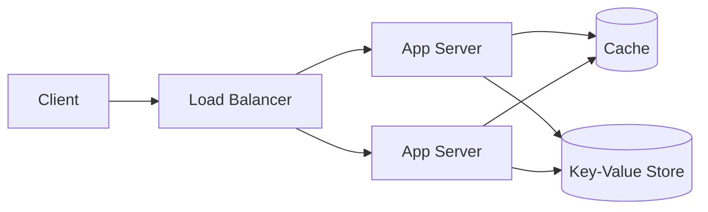

System design interviews test whether you can turn a vague product ("design
a URL shortener") into a scalable architecture, reason about trade-offs, and
back your choices with rough numbers. There is no single right answer, the
interviewer is watching how you think.

<Figure
  slug="interview-backend-engineer-system-design-cutout"
  alt="A platform of connected components, a splitter fanning request capsules to three identical server blocks, a cache drawer, and a queue chute leading to a storage disc"
/>

## Q&A

### How do you approach an open-ended system design question?

Do not start drawing boxes. First **clarify requirements**: functional
(what the system must do) and non-functional (scale, latency, availability,
consistency). Then do **capacity estimation**, define the **API**, sketch a
**high-level design**, and only then drill into the bottlenecks. State your
assumptions out loud, the interviewer will correct you if you are off.

### What back-of-the-envelope numbers should you estimate?

Convert product scale into load. From daily active users and actions per
user you get **requests per second** (QPS); from object size and retention
you get **storage**. A handy trick: 1 million requests/day is roughly 12
QPS. Distinguish **average** QPS from **peak** (often 2–3x average), and
compute the **read/write ratio**, most consumer systems are read-heavy
(100:1 or more), which drives caching and replica decisions.

### What is a load balancer and how does it distribute traffic?

A load balancer sits in front of a pool of servers and spreads requests so
no single machine is overwhelmed. Common algorithms: **round-robin**,
**least-connections**, and **consistent hashing** (keeps a given key on the
same server, important for sticky caches). It also does **health checks**,
removing dead servers from rotation, which is what turns a fleet of stateless
app servers into a highly available tier.

### Horizontal vs vertical scaling, which do you reach for?

**Vertical scaling** (a bigger machine) is simple but has a ceiling and a
single point of failure. **Horizontal scaling** (more machines behind a load
balancer) scales nearly without limit and adds redundancy, but requires your
app tier to be **stateless** so any server can handle any request. Push
session state into a shared cache or database so you can scale out freely.

### Explain the cache-aside pattern.

Cache-aside (lazy loading) is the default caching strategy: on a read, the
app checks the cache first; on a **miss**, it reads the database, writes the
result back into the cache, and returns it. Writes update the database and
**invalidate** (or update) the cached entry. It keeps only requested data
hot and tolerates cache failures gracefully, but the first request for any
key always pays the miss penalty.

```text
read(key):
  value = cache.get(key)
  if value is None:            # cache miss
      value = db.query(key)
      cache.set(key, value, ttl=300)
  return value
```

### What cache eviction policies exist, and when does each fit?

When a cache fills, it must evict. **LRU** (least recently used) discards the
entry untouched for the longest, a good general default matching temporal
locality. **LFU** (least frequently used) keeps popular keys even after a
quiet spell. **FIFO** evicts in insertion order regardless of use. **TTL**
(time-to-live) expires entries after a fixed duration, bounding staleness
independent of memory pressure. Most systems combine an LRU policy with a TTL.

### Why is cache invalidation hard?

Because there are two copies of the truth and they drift. Set a **TTL** too
long and users see stale data; too short and you lose the cache's benefit.
Write-through (update cache and DB together) keeps them consistent at write
cost; write-behind batches writes for speed but risks data loss on crash.
The classic quip, "there are only two hard things in computer science: cache
invalidation and naming things", is about exactly this trade-off.

### What is database replication and what does it buy you?

Replication keeps copies of the data on multiple nodes. In **leader-follower**
(primary-replica) replication, writes go to the leader and are streamed to
read-only followers. This scales **reads** (fan them out to replicas) and
adds **availability** (promote a follower if the leader dies). The catch is
**replication lag**: a read from a follower may not yet reflect the latest
write, so a user can fail to see their own update.

### What is sharding, and how does it differ from partitioning?

**Partitioning** splits one large table into smaller pieces; **sharding** is
horizontal partitioning spread across **separate database servers**, each
holding a subset of rows keyed by a **shard key** (e.g. `user_id`). It scales
writes and storage beyond one machine. The costs: **cross-shard queries** and
joins become expensive, and a poorly chosen shard key creates **hot spots**.
Pick a key with high cardinality and even access distribution.

### Explain the CAP theorem.

In the presence of a network **P**artition, a distributed system must choose
between **C**onsistency (every read sees the latest write) and
**A**vailability (every request gets a non-error response). You cannot have
both during a partition. A **CP** system (e.g. a leader-based store) rejects
requests to stay consistent; an **AP** system (e.g. Dynamo-style) keeps
serving and reconciles later. Since partitions are unavoidable, CAP is really
a choice between C and A when one occurs.

### What consistency models should you know?

**Strong consistency**: every read reflects the most recent write (as if one
copy). **Eventual consistency**: replicas converge given no new writes, but a
read may be stale in the meantime. Useful middle grounds: **read-your-writes**
(you always see your own updates) and **monotonic reads** (you never see time
go backwards). Consumer feeds tolerate eventual consistency; a bank balance
usually needs strong.

### When do you introduce a message queue?

A queue (Kafka, RabbitMQ, SQS) **decouples** producers from consumers and
absorbs bursts. Use it to smooth spikes (buffer writes), run slow work
**asynchronously** (send email, transcode video) off the request path, and
fan work out to multiple workers. It trades immediate consistency for
throughput and resilience, and forces you to handle **at-least-once**
delivery by making consumers **idempotent**.

### How does rate limiting work?

Rate limiting caps how many requests a client may make in a window, to
protect the system and enforce fairness. The **token bucket** algorithm
refills tokens at a fixed rate up to a cap; each request spends a token and
is rejected (HTTP 429) when the bucket is empty, this allows short bursts.
The **leaky bucket** processes at a constant rate, smoothing output. Simpler
**fixed-** and **sliding-window counters** trade accuracy for cheapness.

### What is a CDN and when do you use one?

A **content delivery network** caches static assets (images, JS, CSS, video)
on edge servers geographically close to users. It cuts latency, offloads
traffic from your origin, and absorbs spikes. Use it for anything static or
cacheable; dynamic, user-specific responses generally bypass it (or use short
edge TTLs). CDNs are the cheapest large win for a read-heavy, globally
distributed product.

### Design a URL shortener at a high level.

Generate a short unique key per long URL (base-62 of an auto-increment ID, or
a hash), store the mapping, and redirect on lookup. Reads massively outnumber
writes, so a **cache** in front of the database handles most redirects. A
stateless app tier behind a load balancer scales horizontally:



Storage is modest (a few hundred bytes per URL), so the design is dominated
by read QPS and cache hit rate, not by disk.

### Design a news feed, fan-out on write or on read?

**Fan-out on write** (push): when a user posts, write the post ID into each
follower's precomputed feed. Reads are then a cheap lookup, but a celebrity
with millions of followers causes a write storm. **Fan-out on read** (pull):
assemble the feed at request time by querying the people you follow, cheap
writes but expensive reads. Real systems use a **hybrid**: push for normal
users, pull for celebrities, then merge.

### What is a single point of failure, and how do you remove one?

A single point of failure (SPOF) is any component whose failure takes down
the system, one database, one load balancer, one cache. Remove it with
**redundancy**: multiple app servers, replicated databases with failover,
load balancers in active-passive pairs, and multi-availability-zone
deployment. The goal is that no single machine's death causes an outage.

### SQL or NoSQL at scale, how do you choose?

Choose **SQL** when you need strong consistency, multi-row transactions, and
flexible ad-hoc queries with joins, and your data is relational. Choose
**NoSQL** (key-value, document, wide-column) when you need to scale writes
horizontally, have a simple access pattern known in advance, or store
schema-flexible documents, accepting weaker consistency and limited joins.
Many systems use both: SQL for core transactional data, NoSQL for high-volume
logs, sessions, or feeds.

## Concept checks

<MultipleChoice
  markdown={`Under the **cache-aside** pattern, what happens on a cache **miss**?

- The database write is skipped to save latency.
  > On a miss there is no write to skip; the app reads the DB and populates the cache.
- The cache automatically fetches the value from the database on its own.
  > That describes read-through caching, where the cache library loads on miss. Cache-aside puts that logic in the application.
- [o] The app reads from the database, writes the value back into the cache, then returns it.
  > That is exactly cache-aside (lazy loading): only requested keys get cached, and the next read for that key is a hit.
- The request fails and the client must retry against the database directly.
  > A miss is normal, not an error; the app transparently falls back to the database.`}
/>

<MultipleChoice
  markdown={`During a network **partition**, the CAP theorem says a distributed system must sacrifice one of two guarantees. Which two?

- Durability and availability.
  > Durability is not one of CAP's three letters; the theorem is about consistency, availability, and partition tolerance.
- Latency and throughput.
  > Those are performance properties, not the CAP trade-off, which is about correctness during a partition.
- Consistency and partition tolerance.
  > Partition tolerance is not optional in a real network; the forced choice during a partition is between consistency and availability.
- [o] Consistency and availability.
  > With a partition unavoidable (the P), you must choose: stay consistent and reject some requests (CP), or stay available and risk stale reads (AP).`}
/>

<MultipleChoice
  markdown={`A celebrity with 50 million followers posts. Why does pure **fan-out on write** struggle here?

- [o] A single post triggers writes into 50 million follower feeds, a write storm.
  > Push fan-out does work proportional to follower count per post, which is why celebrities are handled with pull (fan-out on read) in a hybrid design.
- Follower feeds would show the post out of order.
  > Ordering is solvable; the real problem is the sheer number of writes one post generates.
- The post cannot be stored because it exceeds the database row limit.
  > Post size is unrelated; the issue is the volume of feed-insert writes.
- Reads become too slow because each follower must query the celebrity live.
  > That is the fan-out-on-read problem; fan-out on write makes reads cheap, not slow.`}
/>

## Go deeper

- [Database Design with PostgreSQL](/courses/database-design-postgresql)
- [SQL Analytics with DuckDB](/courses/sql-analytics-duckdb)
