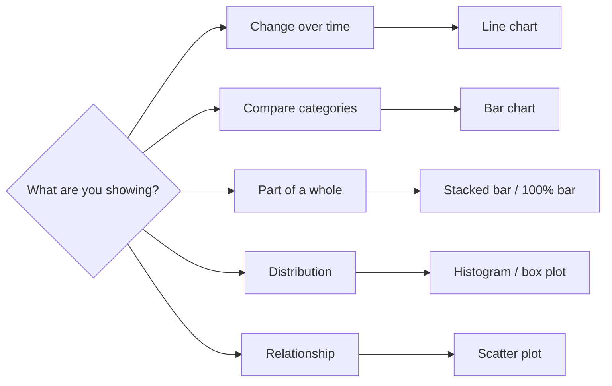

Analysts are hired to turn data into decisions, and a chart is how the
decision gets made. Interviews probe whether you can **pick the right
chart**, **avoid misleading the reader**, and **tell a clear story**.
This is a concept page: Q&A plus concept checks, no runnable code.

<Figure
  slug="interview-data-analyst-data-visualization-cutout"
  alt="Three plain chart plaques standing in a row on a platform, one of bars, one of a rising line, one a circular disc split into wedges, beside a small stand of color swatches"
/>

## Q&A

### How do you choose the right chart for a question?

Start from the **question**, not the chart. Match the visual encoding to
what you're comparing:

The encoding should make the answer readable at a glance; if the reader
has to work to decode it, the chart is wrong.

The ranking underneath most of these decisions: position is read most
accurately, then length, then angle, then area, and color last.

<Chart slug="encoding-accuracy" />

### When is a pie chart appropriate, and when not?

A pie chart shows parts of a single whole, and only works with **2–4
slices** that sum to 100%. Beyond that, humans compare angles poorly, and
a **bar chart** (sorted descending) is easier to read. Never use pie
charts to compare across groups or over time.

Five shares, twice. Ranking them by angle is genuinely hard; by length
it is immediate.

<Chart slug="pie-vs-bar" />

The slice count is the other half of the answer, and it is usually what
kills a pie before the channel does.

<Chart slug="pie-slice-count" />

### Line chart or bar chart?

The question is about the **x-axis**, not the numbers. Use a **line**
when x is ordered and continuous, typically time: the connecting segment
asserts that the quantity existed in between and passed through those
values, which is true of months. Use **bars** for discrete categories,
where there is no "between" and no order to take a slope against.

The same six numbers, both marks, both kinds of axis. Only one of the
four is wrong, and it is wrong for a reason worth being able to say out
loud.

<Chart slug="line-vs-bar-four-cases" />

That leaves the case interviewers actually push on: x is ordered, so
both marks are honest, now choose. Bars compare a value to its
neighbour; a line carries a shape. The longer the series, the more
certainly the shape is what the reader came for.

<Chart slug="line-vs-bar-series-length" />

### When does a log scale earn its place?

When the reader's question is about **rates of change** rather than
levels, or when the series span orders of magnitude. On a log axis equal
percentage changes are equal distances, so a constant growth rate is a
straight line and the steeper line is the faster-growing one whatever its
size. The obligation is to **label it**, because a reader who misses the
scale reads the ratios wrong.

Two series, one two orders of magnitude below the other, on a linear
axis. It answers exactly one question: which is bigger.

<Chart slug="log-scale-percent-change" />

The same numbers on a log axis, where the smaller series is visibly the
faster-growing one.

<Chart slug="log-scale-percent-change-log" />

### What's the difference between a histogram and a bar chart?

A **bar chart** compares discrete categories; bar order is arbitrary. A
**histogram** shows the distribution of a **continuous** variable by
binning its range and counting observations per bin, its x-axis is
numeric and ordered, and bin width is a real choice.

One table of support tickets answering two questions. Everything that
differs between these charts, the gaps, the sorting, the bins, comes
from what sits on x.

<Chart slug="histogram-vs-bar-chart" />

Why the distinction is worth holding onto: sorting bars descending is a
good habit on a bar chart and a click that deletes the finding on a
histogram.

<Chart slug="histogram-sorted-like-a-bar-chart" />

### How do you choose a histogram's bin width?

There is no correct answer, which is the answer: the bin width is a
parameter you chose, so the honest move is to try several and report a
shape that survives all of them. Rules of thumb (Sturges, Freedman-Diaconis)
give a starting point, not a verdict.

<Chart slug="histogram-bin-width" />

### How can a truncated y-axis mislead a reader?

Starting a **bar chart** axis above zero exaggerates differences: a bar
twice as tall can represent a 3% difference. Because a bar's **length**
encodes the value, bar charts should almost always start at zero.

Five scores within five points of each other, drawn from zero and then
on an axis starting near the top of the range.

<Chart slug="bar-truncation" />

<Chart slug="bar-truncation-cropped" />

### So a non-zero baseline is always wrong?

No, it's specifically a bar-chart rule. **Line charts** encode value by
position, not length, so a zoomed axis is acceptable and often necessary
to see meaningful variation (e.g., a stock price or a conversion rate
hovering near a baseline). The obligation is to **label the axis clearly**
so the reader knows the scale.

One axis floored at 92, two marks. On the left it is a lie; on the right
it is an editorial choice, and nothing about the axis changed.

<Chart slug="zero-baseline-bars-not-lines" />

### What is a dual-axis chart, and what's the risk?

A dual-axis chart plots two series against two different y-scales. The
danger is that you can slide the scales to manufacture a correlation or a
"crossover" that isn't real, the relationship shown is an artifact of
arbitrary axis choices. Prefer indexing both series to a common baseline,
or use two aligned panels.

Both panels below hold the same two series and the same left axis. Only
the right-hand one differs, and they support opposite conclusions.

<Chart slug="dual-axis-illusion" />

### What other ways do charts commonly mislead?

Cherry-picked date ranges that hide the fuller trend; inverted or omitted
axes; unequal bin widths; missing data filled with zeroes; and quantities
encoded as area, radius or 3D volume. The fix is honest encodings and
labeled scales.

The hardest one to catch, because nothing on the chart is false. Ten
years going nowhere, then the four months someone would show you
instead.

<Chart slug="cherry-picked-window" />

<Chart slug="cherry-picked-window-zoom" />

An axis can also be correctly labeled and still upside down, at which
point a rise draws as a fall.

<Chart slug="inverted-y-axis" />

And the one that is usually an accident rather than a trick: a gap in the
data filled with zeroes, which draws a collapse and a recovery that never
happened.

<Chart slug="missing-as-zero" />

### Why are 3D effects and area encodings a problem?

Both break the link between the mark and the number. Give a bar depth and
its top face becomes a parallelogram, so its front and back edges meet the
axis at two different values and nothing says which one to read. Size a
circle by setting its **radius** to the value and every ratio is squared,
because what the eye reads is **area**.

<Chart slug="chartjunk-3d-bars" />

<Chart slug="bubble-area-vs-radius" />

### What makes a dashboard effective?

Show only the metrics decision-makers act on, and group related KPIs.
Establish visual hierarchy, the most important number is biggest and
top-left (where eyes land first). Keep scales and colors consistent, label
data freshness, and cut anything that doesn't earn its place. Design for
the audience: an executive summary differs from an ops monitoring view.

Why top-left is not a preference: attention falls away down the page
faster than it falls away across it.

<Chart slug="dashboard-reading-order" />

And the failure mode of every dashboard that has been alive for two
years. Panels only ever get added, and the second line is the one nobody
measures.

<Chart slug="dashboard-metric-creep" />

### What's the difference between a dashboard and a report?

A **dashboard** is a living, continuously updated view for monitoring,
"what's happening now?" A **report** answers a specific question once (or
periodically) with narrative and context, and is read linearly.
Dashboards drive operational decisions; reports drive deeper analysis and
stakeholder communication.

### How do you tell a story with data?

Lead with the **takeaway**, then support it. Structure it like an
argument: context ("conversion was flat all quarter"), the insight ("then
checkout latency spiked"), and the implication ("so we should fix
latency"). One chart per point, each with a title that states the
conclusion, not just the variables. Guide attention with annotations
rather than making the reader hunt.

What "a title that states the conclusion" buys, with nothing else
changed: same bars, same axis, same color, one different sentence.

<Chart slug="title-carries-the-finding" />

### What is the data-ink ratio, and why does it matter?

Tufte's idea: maximize the share of ink that encodes data, minimize
decoration ("chartjunk"). Drop gridline clutter, heavy borders,
backgrounds, and 3D effects so the data stands out. A clean chart isn't
just prettier, it's faster and more accurate to read.

The test is deletion: remove a mark and ask what the reader can no longer
work out. If the answer is nothing, it was spending attention without
paying for it.

<Chart slug="data-ink-ratio" />

### How do you choose a color palette for a chart?

Match palette type to data type. **Categorical** data uses distinct hues
(kept few, 6–8 max). **Sequential** data (low→high) uses a single hue
ramping in lightness. **Diverging** data with a meaningful midpoint
(e.g., profit vs loss) uses two hues meeting at a neutral center. Reserve
a bold accent color for the one series you want to emphasize.

The three families, each also shown carrying data it cannot describe. A
palette is an assertion about the structure of the variable.

<Chart slug="color-scale-families" />

The most common mistake, drawn: a rainbow ramp invents bands where the
data is smooth.

<Chart slug="rainbow-vs-sequential" />

### Why cap a categorical palette at six or eight colors?

Because past that, the palette runs out and starts again, and nothing in
the chart says so: two unrelated groups end up sharing a color. The fix
is fewer levels (collect the tail into "other"), or a facet, or a channel
that isn't color.

<Chart slug="color-category-limit" />

### How do you make visualizations accessible?

About 8% of men have red-green color vision deficiency, so **don't encode
meaning by color alone**. Use colorblind-safe palettes, add a secondary
cue (labels, patterns, position, direct annotation), and ensure sufficient
contrast. Test by viewing in grayscale: if the chart still reads, it's
robust.

The same chart in a default palette and a colorblind-safe one, each
shown as a red-green viewer sees it.

<Chart slug="colorblind-safe" />

The stronger fix, because it doesn't depend on the reader's vision at
all: carry the grouping on a second channel, and the color becomes a
convenience rather than the message.

<Chart slug="redundant-encoding-helps" />

### How do Tableau, Power BI, and Looker differ?

All are BI tools for dashboards and self-serve analytics, with different
centers of gravity. **Tableau** emphasizes flexible, exploratory
visualization. **Power BI** integrates tightly with the Microsoft/Excel
stack and is cost-effective there. **Looker** defines metrics as code in
a modeling layer (LookML) on top of the warehouse, favoring governed,
consistent definitions. The analyst skill, framing the question and
validating the numbers, transfers across all of them.

### What is a scatter plot good for, and how do you handle overplotting?

Scatter plots reveal the **relationship** between two continuous
variables, correlation, clusters, outliers. When points pile up and hide
density, reduce **overplotting** with transparency (alpha), smaller
markers, jitter, sampling, or a 2D density/hex-bin plot instead.

Four relationships a scatter reads at a glance. The fourth is the one to
remember: an obvious pattern whose correlation is near zero.

<Chart slug="correlation-scatters" />

Four thousand points, drawn opaque and then at a tenth of the opacity.
Nothing about the data changed.

<Chart slug="overplotting-alpha" />

### How do you visualize a part-to-whole breakdown over time?

Use a **stacked area** or **stacked bar** chart to show composition
changing across periods; a **100% stacked** version emphasizes shifting
proportions rather than absolute totals. If the reader needs to track one
segment precisely, small-multiple line charts read more accurately than a
stack.

Three questions, three charts, one dataset. The middle channel is flat
all year, and only the third panel is willing to say so.

<Chart slug="part-to-whole-over-time" />

### How do annotations improve a chart?

Annotations state the takeaway directly on the chart, mark the launch
date, label the outlier, call out the peak, so the reader doesn't have to
infer it. A well-annotated chart survives being pasted into a doc without
the presenter, which is exactly how charts travel through an organization.

The same twelve numbers, drawn the same way, with one difference: the
right-hand panel says what the analyst already knew.

<Chart slug="annotation-directs-attention" />

## Concept checks

<MultipleChoice
  markdown={`A bar chart's y-axis starts at 95, not 0. Two bars read 96 and 98. What's the problem?

- Nothing, starting the axis higher makes small differences visible.
  > For *bar* charts, length encodes the value, so a truncated baseline visually exaggerates a tiny ~2% difference into a dramatic one.
- [o] The truncated baseline exaggerates the difference; bar charts should start at zero.
  > Because bar length is the encoding, a zero baseline keeps the visual proportional to the data. (A line chart could justifiably zoom in.)
- The colors are the issue.
  > Color isn't what's misleading here; the truncated length axis is.
- The bars should be a pie chart instead.
  > A pie chart wouldn't fix the distortion and is worse for reading two close values; the fix is the axis baseline.`}
/>

<MultipleChoice
  markdown={`You need to compare revenue across 12 product categories. Which chart reads most accurately?

- [o] A bar chart sorted by revenue descending.
  > Bars share a common baseline, so lengths are easy to compare, and sorting makes the ranking obvious at a glance.
- A pie chart with 12 slices.
  > Twelve slices force angle comparisons humans do poorly; small slices are indistinguishable.
- A single stacked bar with 12 segments.
  > One stacked bar makes it hard to compare segments that don't share a baseline; individual bars are clearer.
- A line chart across the 12 categories.
  > A line implies an ordered, continuous trajectory between categories that doesn't exist.`}
/>

<MultipleChoice
  markdown={`Your BI tool offers "sort bars descending" on every chart. On which of these is clicking it a mistake?

- A bar chart of revenue by product category.
  > Sorting is the right call here: categories have no inherent order, and sorting hands the reader the ranking for free.
- A bar chart of survey responses by region.
  > Regions are unordered labels, so sorting by value is safe and usually an improvement.
- [o] A histogram, because the horizontal position of a bar is a measurement rather than a label.
  > On a bar chart the x position is a lookup key and moving it costs nothing. On a histogram it is the value being binned, so sorting throws away the distribution and leaves a descending ramp, which is the shape of every sorted histogram.
- Both bar charts, because sorting always hides the natural order.
  > Neither of those has a natural order to hide; the one chart with an ordered x-axis is the histogram.`}
/>

<MultipleChoice
  markdown={`Two products' user counts are plotted together: one has 20,000 users growing 5% a month, the other 400 growing 30% a month. On a linear axis, what does the reader miss?

- Nothing; the larger product is bigger and that's the finding.
  > That is the only question a linear axis answers here, and it isn't the one about growth.
- [o] That the smaller product is growing much faster, because its whole range is a flat line near the axis.
  > A linear axis encodes levels, so the 400-user series is compressed into the bottom of the frame. A log axis makes equal percentage changes equal distances, and the faster grower becomes the steeper line.
- The axis should have been truncated to show both.
  > Truncating shifts the window without fixing the compression, and on a bar chart it would distort the lengths outright.
- The two series should never share a chart.
  > They can share one perfectly well; the fix is the scale type, not splitting the chart.`}
/>

<MultipleChoice
  markdown={`A dashboard encodes "pass" as green and "fail" as red, with no other cue. Why is this an accessibility problem?

- [o] Red-green color vision deficiency is common, so meaning encoded by color alone is lost for those users.
  > Roughly 8% of men can't reliably distinguish red from green; add a label, icon, or position cue so color isn't the only signal.
- Dashboards shouldn't use color at all.
  > Color is fine and useful, it just shouldn't be the *only* channel carrying meaning.
- Green and red can't appear in the same chart.
  > They can; the fix is a redundant non-color cue, not banning the colors.
- Red and green are low-contrast on every screen.
  > Contrast varies by shade; the core issue is relying on hue alone, not contrast per se.`}
/>

## Go deeper

- [Intro to Data Visualization with Plotly](/courses/intro-data-viz-plotly)
- [Seaborn Foundations](/courses/seaborn-foundations)
- [Mastering ggplot2](/courses/mastering-ggplot2)
