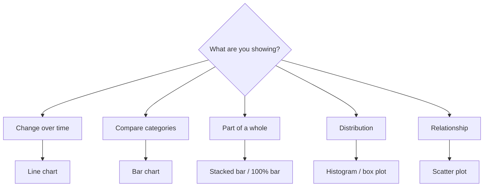

Analysts are hired to turn data into decisions, and a chart is how the
decision gets made. Interviews probe whether you can **pick the right
chart**, **avoid misleading the reader**, and **tell a clear story**.
This is a concept page: Q&A plus concept checks, no runnable code.

<Figure
  slug="interview-data-analyst-data-visualization-cutout"
  alt="Three plain chart plaques standing in a row on a platform, one of bars, one of a rising line, one a circular disc split into wedges, beside a small stand of colour swatches"
/>

## Q&A

### How do you choose the right chart for a question?

Start from the **question**, not the chart. Match the visual encoding to
what you're comparing:

The encoding should make the answer readable at a glance; if the reader
has to work to decode it, the chart is wrong.

### When is a pie chart appropriate, and when not?

A pie chart shows parts of a single whole, and only works with **2–4
slices** that sum to 100%. Beyond that, humans compare angles poorly, and
a **bar chart** (sorted descending) is easier to read. Never use pie
charts to compare across groups or over time.

### Line chart or bar chart?

Use a **line** for a continuous trend over time, the connecting line
implies order and continuity. Use **bars** to compare discrete
categories, where there's no meaningful "between" two bars. Plotting
unordered categories as a line falsely implies a trajectory.

### What's the difference between a histogram and a bar chart?

A **bar chart** compares discrete categories; bar order is arbitrary. A
**histogram** shows the distribution of a **continuous** variable by
binning its range and counting observations per bin, its x-axis is
numeric and ordered, and bin width is a real choice that changes the
story.

### How can a truncated y-axis mislead a reader?

Starting a **bar chart** axis above zero exaggerates differences: a bar
twice as tall can represent a 3% difference. Because a bar's **length**
encodes the value, bar charts should almost always start at zero.

### So a non-zero baseline is always wrong?

No, it's specifically a bar-chart rule. **Line charts** encode value by
position, not length, so a zoomed axis is acceptable and often necessary
to see meaningful variation (e.g., a stock price or a conversion rate
hovering near a baseline). The obligation is to **label the axis clearly**
so the reader knows the scale.

### What is a dual-axis chart, and what's the risk?

A dual-axis chart plots two series against two different y-scales. The
danger is that you can slide the scales to manufacture a correlation or a
"crossover" that isn't real, the relationship shown is an artifact of
arbitrary axis choices. Prefer indexing both series to a common baseline,
or use two aligned panels.

### What other ways do charts commonly mislead?

Cherry-picked date ranges that hide the fuller trend; encoding a quantity
by **area or radius** when readers perceive length (doubling a circle's
radius quadruples its area); 3D effects that distort proportions; inverted
or omitted axes; and unequal bin widths. The fix is honest encodings and
labeled scales.

### What makes a dashboard effective?

Show only the metrics decision-makers act on, and group related KPIs.
Establish visual hierarchy, the most important number is biggest and
top-left (where eyes land first). Keep scales and colors consistent, label
data freshness, and cut anything that doesn't earn its place. Design for
the audience: an executive summary differs from an ops monitoring view.

### What's the difference between a dashboard and a report?

A **dashboard** is a living, continuously updated view for monitoring,
"what's happening now?" A **report** answers a specific question once (or
periodically) with narrative and context, and is read linearly.
Dashboards drive operational decisions; reports drive deeper analysis and
stakeholder communication.

### How do you tell a story with data?

Lead with the **takeaway**, then support it. Structure it like an
argument: context ("conversion was flat all quarter"), the insight ("then
checkout latency spiked"), and the implication ("so we should fix
latency"). One chart per point, each with a title that states the
conclusion, not just the variables. Guide attention with annotations
rather than making the reader hunt.

### What is the data-ink ratio, and why does it matter?

Tufte's idea: maximize the share of ink that encodes data, minimize
decoration ("chartjunk"). Drop gridline clutter, heavy borders,
backgrounds, and 3D effects so the data stands out. A clean chart isn't
just prettier, it's faster and more accurate to read.

### How do you choose a color palette for a chart?

Match palette type to data type. **Categorical** data uses distinct hues
(kept few, 6–8 max). **Sequential** data (low→high) uses a single hue
ramping in lightness. **Diverging** data with a meaningful midpoint
(e.g., profit vs loss) uses two hues meeting at a neutral center. Reserve
a bold accent color for the one series you want to emphasize.

### How do you make visualizations accessible?

About 8% of men have red-green color vision deficiency, so **don't encode
meaning by color alone**. Use colorblind-safe palettes, add a secondary
cue (labels, patterns, position, direct annotation), and ensure sufficient
contrast. Test by viewing in grayscale: if the chart still reads, it's
robust.

### How do Tableau, Power BI, and Looker differ?

All are BI tools for dashboards and self-serve analytics, with different
centers of gravity. **Tableau** emphasizes flexible, exploratory
visualization. **Power BI** integrates tightly with the Microsoft/Excel
stack and is cost-effective there. **Looker** defines metrics as code in
a modeling layer (LookML) on top of the warehouse, favoring governed,
consistent definitions. The analyst skill, framing the question and
validating the numbers, transfers across all of them.

### What is a scatter plot good for, and how do you handle overplotting?

Scatter plots reveal the **relationship** between two continuous
variables, correlation, clusters, outliers. When points pile up and hide
density, reduce **overplotting** with transparency (alpha), smaller
markers, jitter, sampling, or a 2D density/hex-bin plot instead.

### How do you visualize a part-to-whole breakdown over time?

Use a **stacked area** or **stacked bar** chart to show composition
changing across periods; a **100% stacked** version emphasizes shifting
proportions rather than absolute totals. If the reader needs to track one
segment precisely, small-multiple line charts read more accurately than a
stack.

### How do annotations improve a chart?

Annotations state the takeaway directly on the chart, mark the launch
date, label the outlier, call out the peak, so the reader doesn't have to
infer it. A well-annotated chart survives being pasted into a doc without
the presenter, which is exactly how charts travel through an organization.

## Concept checks

<MultipleChoice
  markdown={`A bar chart's y-axis starts at 95, not 0. Two bars read 96 and 98. What's the problem?

- Nothing, starting the axis higher makes small differences visible.
  > For *bar* charts, length encodes the value, so a truncated baseline visually exaggerates a tiny ~2% difference into a dramatic one.
- [o] The truncated baseline exaggerates the difference; bar charts should start at zero.
  > Because bar length is the encoding, a zero baseline keeps the visual proportional to the data. (A line chart could justifiably zoom in.)
- The bars should be a pie chart instead.
  > A pie chart wouldn't fix the distortion and is worse for reading two close values; the fix is the axis baseline.
- The colors are the issue.
  > Color isn't what's misleading here; the truncated length axis is.`}
/>

<MultipleChoice
  markdown={`You need to compare revenue across 12 product categories. Which chart reads most accurately?

- A pie chart with 12 slices.
  > Twelve slices force angle comparisons humans do poorly; small slices are indistinguishable.
- [o] A bar chart sorted by revenue descending.
  > Bars share a common baseline, so lengths are easy to compare, and sorting makes the ranking obvious at a glance.
- A single stacked bar with 12 segments.
  > One stacked bar makes it hard to compare segments that don't share a baseline; individual bars are clearer.
- A line chart across the 12 categories.
  > A line implies an ordered, continuous trajectory between categories that doesn't exist.`}
/>

<MultipleChoice
  markdown={`A dashboard encodes "pass" as green and "fail" as red, with no other cue. Why is this an accessibility problem?

- Red and green are low-contrast on every screen.
  > Contrast varies by shade; the core issue is relying on hue alone, not contrast per se.
- [o] Red-green color vision deficiency is common, so meaning encoded by color alone is lost for those users.
  > Roughly 8% of men can't reliably distinguish red from green; add a label, icon, or position cue so color isn't the only signal.
- Green and red can't appear in the same chart.
  > They can; the fix is a redundant non-color cue, not banning the colors.
- Dashboards shouldn't use color at all.
  > Color is fine and useful, it just shouldn't be the *only* channel carrying meaning.`}
/>

## Go deeper

- [Intro to Data Visualization with Plotly](/courses/intro-data-viz-plotly)
- [Seaborn Foundations](/courses/seaborn-foundations)
- [Mastering ggplot2](/courses/mastering-ggplot2)
