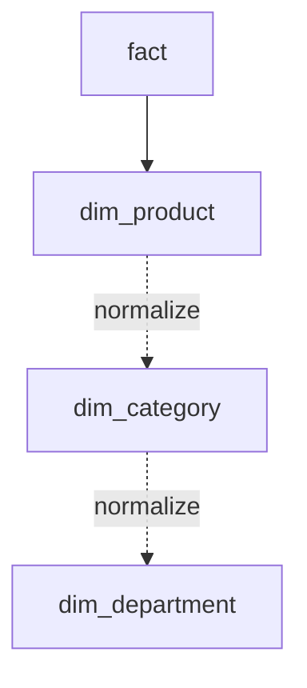

How you **model** data is tested as heavily as SQL syntax. These cover
the warehouse-modeling vocabulary interviewers expect.

## Q&A

### Normalization vs denormalization — what's the trade-off?

**Normalization** removes redundancy by splitting data into related
tables (each fact stored once) — great for OLTP write integrity.
**Denormalization** repeats data to avoid joins — common in analytics,
where reads dominate. The trade-off: denormalizing buys read speed at the
cost of storage and the risk of copies disagreeing (update anomalies).

The block below contrasts a normalized `customers`/`orders` design with a
denormalized `orders_wide`, then shows the `JOIN` the normalized layout
requires to recover the customer `name` and `city`.

```sql
-- Normalized (3NF): customer stored once, referenced by foreign key
-- customers(customer_id, name, city)
-- orders(order_id, customer_id, amount)

-- Denormalized: customer attributes repeated on every order row
-- orders_wide(order_id, customer_name, customer_city, amount)

-- The normalized version requires a join to get the name; the
-- denormalized version reads faster but risks stale copies if the
-- customer's city changes.
SELECT o.order_id, c.name, c.city, o.amount
FROM orders o
JOIN customers c ON c.customer_id = o.customer_id;
```

### Star vs snowflake schema?

A **star** schema has a central fact table joined directly to
**denormalized** dimension tables — simple, fast, fewer joins. A
**snowflake** further **normalizes** dimensions into sub-tables (e.g.
product → category → department) — less redundancy but more joins. Stars
are the default for **Business Intelligence (BI)**; snowflake when
dimensions are large or shared.

A star keeps each dimension in one table (the solid edge); a snowflake
splits that dimension further into a normalized chain (the dotted edges):



### What are fact and dimension tables?

A **fact** table stores measurable **events** at a defined grain (one row
per order line), with numeric **measures** (quantity, amount) and foreign
keys to dimensions. **Dimension** tables hold the descriptive context you
filter and group by (customer, product, date).

### What is the "grain" of a table, and why define it first?

The grain is **what one row represents** (one order? one order line? one
customer-day?). Defining it first prevents double-counting and ambiguous
aggregations — every measure and foreign key must make sense at that
grain.

### How do you preserve history when a dimension attribute changes (SCD)?

Use a **Slowly Changing Dimension (SCD)**:

- **Type 1** — overwrite (no history).
- **Type 2** — add a new row with effective-date ranges + a "current" flag (full history; facts join to the version that was current at the time).
- **Type 3** — keep a "previous value" column (limited history).

Type 2 is the standard when point-in-time accuracy matters.

The example below builds a Type 2 `dim_customer` (with `valid_from`,
`valid_to`, and `is_current`) and joins `fact_orders` to it on the date
range, so each order resolves to the `city` that was current when it was
placed.

<SqlCodeBlock
  dialect="duckdb"
  initSql={`CREATE TABLE dim_customer (
  customer_key INTEGER,
  customer_id  INTEGER,
  city         VARCHAR,
  valid_from   DATE,
  valid_to     DATE,
  is_current   BOOLEAN
);
INSERT INTO dim_customer VALUES
  (1001, 42, 'Boston', DATE '2022-01-01', DATE '2024-03-14', false),
  (1087, 42, 'Austin', DATE '2024-03-15', DATE '9999-12-31', true),
  (2001, 99, 'Denver', DATE '2023-06-01', DATE '9999-12-31', true);

CREATE TABLE fact_orders (
  order_id    INTEGER,
  customer_id INTEGER,
  order_date  DATE,
  amount      DECIMAL(10,2)
);
INSERT INTO fact_orders VALUES
  (101, 42, DATE '2023-05-10', 350.00),
  (102, 42, DATE '2024-06-01', 200.00),
  (103, 99, DATE '2024-01-15', 500.00);`}
  starterCode={`-- Point-in-time join: each order sees the city that was current when placed.
SELECT f.order_id, f.order_date, d.city, f.amount
FROM fact_orders f
JOIN dim_customer d
  ON  d.customer_id = f.customer_id
  AND f.order_date BETWEEN d.valid_from AND d.valid_to
ORDER BY f.order_id;`}
/>

### What is 1NF, 2NF, and 3NF?

**First Normal Form (1NF):** each column holds a single atomic value; no repeating groups or arrays in a column. **Second Normal Form (2NF):** 1NF plus every non-key column depends on the **entire** primary key (eliminates partial dependencies — relevant when the key is composite). **Third Normal Form (3NF):** 2NF plus no non-key column depends on another non-key column (eliminates transitive dependencies). OLTP schemas are typically designed to 3NF; analytical schemas often intentionally violate higher normal forms for query performance.

### What are the three types of fact tables?

1. **Transaction fact** — one row per discrete event (an order, a click). The most common type.
2. **Periodic snapshot** — one row per entity per time period (account balance at end of each month), capturing state at regular intervals.
3. **Accumulating snapshot** — one row per business process instance (a loan application) with multiple date stamps updated as the process advances through stages.

### What is a surrogate key, and why prefer it over a natural key?

A **surrogate key** is a system-generated identifier (auto-increment integer or UUID) with no business meaning. It is preferred because natural keys (customer email, product code) can change, be reused, or be long strings that make joins expensive. Surrogate keys are stable, compact, and immune to upstream business logic changes, which is especially important for SCD Type 2 where multiple rows represent the same entity.

The query below joins `fact_orders` to `dim_product` on the surrogate
`product_key` rather than the natural `product_code`, illustrating why the
integer key keeps the join stable even when the business code changes.

```sql
-- Surrogate key join: fact holds a compact integer key pointing to the
-- exact dimension version that was current at the time of the event.
SELECT f.order_id, f.amount, p.product_name, p.category
FROM fact_orders f
JOIN dim_product p ON p.product_key = f.product_key;
-- product_key is the surrogate (e.g. 8821), not the natural product_code
-- ('SKU-XYZ'), which may have been reassigned or renamed over time.
```

### What is a conformed dimension?

A dimension shared — with identical structure and values — across multiple fact tables and data marts. For example, a `dim_date` used by both `fact_sales` and `fact_inventory` allows users to drill across both subjects consistently. Conformed dimensions are the foundation of an enterprise data warehouse "bus architecture."

### What is the difference between additive, semi-additive, and non-additive measures?

- **Additive:** can be summed across any dimension (e.g., revenue, units sold).
- **Semi-additive:** can be summed across some dimensions but not all — typically not time (e.g., account balance can be summed across accounts but averaging or taking a point-in-time snapshot is correct across time).
- **Non-additive:** cannot be meaningfully summed across any dimension (e.g., ratios, percentages, distinct counts). Store the numerator and denominator separately and compute the ratio in the query.

### What is OLTP vs OLAP, and how does schema design differ?

**OLTP (Online Transaction Processing)** serves many concurrent short read/write transactions — normalized (3NF) to minimize redundancy and lock contention. **OLAP (Online Analytical Processing)** serves complex analytical queries over large data volumes — typically denormalized (star/snowflake) to minimize joins and maximize columnar scan efficiency. OLTP rows are narrow and updated frequently; OLAP tables are wide and mostly append-only.

### What is SCD Type 0?

**Type 0** means the attribute **never changes** — it is fixed at the time the dimension row is created and any upstream changes are ignored. Useful for attributes that are definitionally immutable, such as a customer's original sign-up date or a product's first release year. No special logic is needed; a simple insert-once strategy suffices.

### How does SCD Type 2 work in practice?

When an attribute changes, you close the existing row by setting its `valid_to` date (or `is_current = false`) and insert a new row with the updated value and a new `valid_from` date. Facts that occurred before the change still join to the old dimension row via the surrogate key, preserving point-in-time accuracy. Queries for the current state filter `WHERE is_current = true`.

The two statements below implement that change for `customer_id = 42`: an
`UPDATE` closes the current row by setting `valid_to` and `is_current =
false`, then an `INSERT` adds the new `Austin` version as the current row.

```sql
-- Step 1: close the existing row
UPDATE dim_customer
SET valid_to = CURRENT_DATE - INTERVAL '1 day',
    is_current = false
WHERE customer_id = 42 AND is_current = true;

-- Step 2: insert the new version
INSERT INTO dim_customer
  (customer_id, city, valid_from, valid_to, is_current)
VALUES
  (42, 'Austin', CURRENT_DATE, DATE '9999-12-31', true);
```

### What is a degenerate dimension?

A dimension attribute stored **directly on the fact table** rather than in a separate dimension table, because it has no other attributes worth modeling (e.g., an order number or invoice number). It is a dimension for slicing data but too simple to warrant its own table.

### What is a junk dimension?

A single dimension table that consolidates multiple low-cardinality flag or indicator columns that would otherwise clutter the fact table (e.g., payment method, is_gift, is_first_order, channel). Combining them avoids adding many foreign keys to the fact table and keeps the model clean.

### What is a role-playing dimension?

A single physical dimension table used multiple times in the same schema under different logical names. A common example is `dim_date` used as `order_date_key`, `ship_date_key`, and `delivery_date_key` in the same fact table. Each role is typically exposed as a separate view or alias in the BI layer.

### What is a bridge table and when do you need one?

A **bridge table** (also called an association table) resolves **many-to-many** relationships between a fact table and a dimension — for example, an order that belongs to multiple promotions simultaneously. The bridge table has a surrogate key, the fact foreign key, and the dimension foreign key. Without it you would either fan out fact rows (inflating counts) or store comma-separated lists (violating 1NF).

The query below joins `fact_orders` through `order_promotion_bridge` to
`dim_promotion`, showing how an order tied to multiple promotions fans out
into one row per promotion.

```sql
-- Bridge table: one row per (order, promotion) pair
-- order_promotion_bridge(order_key, promo_key)

SELECT f.order_id, p.promo_name, f.amount
FROM fact_orders f
JOIN order_promotion_bridge b ON b.order_key = f.order_key
JOIN dim_promotion p          ON p.promo_key  = b.promo_key;
-- An order with 3 promotions produces 3 rows here;
-- use a weighting factor on the bridge to distribute amounts if needed.
```

### What is the difference between a wide table and a narrow table approach in analytics?

A **wide table** (one row per entity, many columns) is fully denormalized — fast to query, easy to understand in a BI tool, but adds columns for every new attribute and can become unwieldy. A **narrow table** keeps fewer columns per row and uses keys to join to attribute tables, more normalized and flexible but requiring more joins. Modern cloud warehouses with columnar storage and cheap compute tolerate wide tables well; the trade-off is schema evolution vs query simplicity.

### What is a data vault, and when would you choose it over a star schema?

A **data vault** separates hubs (business keys), links (relationships), and satellites (descriptive attributes with full history). It is optimized for auditable, historized ingestion from many source systems and for incremental loading without touching historical data. Choose it when auditability, source traceability, and parallel team development across many sources matter more than query simplicity. Star schemas are simpler to query and preferred when the modeled domain is stable and BI self-service is the primary goal.

### What does "grain mismatch" mean, and how do you fix it?

A grain mismatch occurs when you join two fact tables at different grains — for example, a daily budget table joined to a transaction-level sales table — causing double-counting or incorrect aggregations. Fix it by aggregating the finer-grain table to match the coarser grain before joining, or by storing both at a common grain in a separate bridging step.

The example below has transaction-grain `fact_sales` and daily-grain
`fact_budget`; the query rolls `fact_sales` up to one row per
`sale_date`/`region` in a Common Table Expression first, so the join to
`fact_budget` compares like grains instead of double-counting budget rows.

<SqlCodeBlock
  dialect="duckdb"
  initSql={`CREATE TABLE fact_sales (
  sale_date DATE,
  region    VARCHAR,
  amount    DECIMAL(10,2)
);
INSERT INTO fact_sales VALUES
  (DATE '2024-01-01', 'North', 120.00),
  (DATE '2024-01-01', 'North',  80.00),
  (DATE '2024-01-01', 'South', 200.00),
  (DATE '2024-01-02', 'North', 150.00),
  (DATE '2024-01-02', 'South',  90.00);

CREATE TABLE fact_budget (
  sale_date DATE,
  region    VARCHAR,
  budget    DECIMAL(10,2)
);
INSERT INTO fact_budget VALUES
  (DATE '2024-01-01', 'North', 250.00),
  (DATE '2024-01-01', 'South', 180.00),
  (DATE '2024-01-02', 'North', 160.00),
  (DATE '2024-01-02', 'South', 100.00);`}
  starterCode={`-- Correct: pre-aggregate sales to the same daily grain, then join.
WITH daily_sales AS (
  SELECT sale_date, region, SUM(amount) AS total_sales
  FROM fact_sales
  GROUP BY sale_date, region
)
SELECT b.sale_date, b.region, b.budget, ds.total_sales
FROM fact_budget b
JOIN daily_sales ds
  ON ds.sale_date = b.sale_date AND ds.region = b.region
ORDER BY b.sale_date, b.region;`}
/>

### What are slowly-changing dimension types 4 and 6?

**Type 4** offloads historical values to a separate "mini-dimension" or history table, while the main dimension keeps only current values — used when historical attributes are large or queried infrequently. **Type 6** ("hybrid") combines Types 1, 2, and 3: it versions rows like Type 2 but also carries a current-value column on every row (like Type 1) so the latest attribute is always available without an extra join for users who only need current state.

### How do you handle late-arriving dimension members?

Create a **dummy or unknown dimension row** (e.g., surrogate key = -1) to stand in for the missing member. Facts that arrive before the dimension record is available reference this placeholder. Once the true dimension row is inserted, you can optionally update the fact table's foreign key in a reconciliation step — or accept the unknown row as the historical truth if strict point-in-time accuracy is required.

### What is a factless fact table?

A fact table with **no numeric measures** — it records only that an event happened (e.g., a student attending a class, a promotion being applied to a product). It is used for coverage or eligibility analysis: which products were covered by a promotion? which students attended which sessions?

### What is a mini-dimension?

A mini-dimension extracts **rapidly changing attributes** from a large, slow-moving dimension into a smaller, separate dimension. This avoids exploding the main dimension with Type 2 rows on every attribute change. For example, customer age band and income tier might change frequently, so they are placed in a mini-dimension with its own surrogate key on the fact table.

### What is a snapshot vs insert-only fact table strategy?

An **insert-only** strategy appends a new row for every state change, preserving full history at the cost of storage and requiring aggregation to get current state. A **snapshot** strategy keeps one row per entity (overwriting or appending periodic rows) for easy current-state queries but discards intermediate changes. The right choice depends on whether you need auditable change history or only current/periodic state.

### What is the difference between a bus matrix and a data mart?

A **bus matrix** (or enterprise bus matrix) is a planning artifact that maps business processes (rows) against conformed dimensions (columns), documenting which dimensions are shared across which subject areas. A **data mart** is the physical implementation — a subset of the warehouse focused on one business domain (e.g., sales, finance). Conformed dimensions in the bus matrix allow data marts to be combined ("drilled across") without double-counting.

### Why use a date dimension table instead of date functions?

A `dim_date` table pre-computes every calendar attribute — fiscal week, quarter, holiday flag, day-of-week name — so analysts can filter and group by any combination without writing date-arithmetic functions inline. It also lets the business encode custom fiscal calendars, retail weeks, or regional holidays once and share them universally, rather than scattering business-specific date logic across every query.

The query below joins `fact_orders` to `dim_date` and groups by the
pre-computed `fiscal_quarter` while filtering out holidays with
`is_holiday = false` — no inline date arithmetic required.

<SqlCodeBlock
  dialect="duckdb"
  initSql={`CREATE TABLE dim_date (
  date_key        INTEGER,
  calendar_date   DATE,
  fiscal_quarter  VARCHAR,
  is_holiday      BOOLEAN,
  day_of_week_name VARCHAR
);
INSERT INTO dim_date VALUES
  (20240101, DATE '2024-01-01', 'Q1', true,  'Monday'),
  (20240102, DATE '2024-01-02', 'Q1', false, 'Tuesday'),
  (20240115, DATE '2024-01-15', 'Q1', false, 'Monday'),
  (20240401, DATE '2024-04-01', 'Q2', false, 'Monday'),
  (20240415, DATE '2024-04-15', 'Q2', false, 'Monday');

CREATE TABLE fact_orders (
  order_id       INTEGER,
  order_date_key INTEGER,
  amount         DECIMAL(10,2)
);
INSERT INTO fact_orders VALUES
  (1, 20240101,  50.00),
  (2, 20240102, 200.00),
  (3, 20240115, 175.00),
  (4, 20240401, 300.00),
  (5, 20240415,  90.00);`}
  starterCode={`SELECT d.fiscal_quarter, SUM(f.amount) AS revenue
FROM fact_orders f
JOIN dim_date d ON d.date_key = f.order_date_key
WHERE d.is_holiday = false
GROUP BY d.fiscal_quarter
ORDER BY d.fiscal_quarter;`}
/>

### What is the difference between a measure and a metric?

A **measure** is a raw numeric column on a fact table (e.g., `revenue`, `quantity`). A **metric** is a derived, business-defined calculation built from one or more measures (e.g., "average order value = revenue / orders"). Measures live in the physical model; metrics live in the semantic/BI layer or in documented SQL logic. Confusing the two leads to inconsistent definitions across teams.

### What is the purpose of a surrogate key sequence vs a UUID?

An **auto-increment integer** surrogate key is compact, fast to join, and naturally ordered — ideal for dimension tables in a warehouse. A **UUID** (128-bit) is globally unique across systems and generated client-side without a sequence, making it better for distributed systems where multiple sources insert concurrently. The trade-off: UUIDs are larger, slower to join, and fragment indexes more than integers.

### How do you model a many-to-many relationship between facts and dimensions?

Use a **bridge table**: a separate table with one row per (fact, dimension) combination. For example, if an order can be associated with multiple promotions, the bridge table `order_promotion_bridge` holds `(order_key, promo_key)` pairs. The fact table joins to the bridge, which joins to the promotion dimension. A **weighting factor** column on the bridge can distribute additive measures proportionally across the associated dimension members.

The query below multiplies `f.amount` by the bridge's `weight` before
summing, so each promotion in `dim_promotion` receives only its
proportional share of revenue rather than the full order amount.

```sql
-- Bridge table with optional weighting factor (sums to 1.0 per order)
-- order_promotion_bridge(order_key, promo_key, weight)

SELECT p.promo_name,
       SUM(f.amount * b.weight) AS attributed_revenue
FROM fact_orders f
JOIN order_promotion_bridge b ON b.order_key = f.order_key
JOIN dim_promotion p          ON p.promo_key  = b.promo_key
GROUP BY p.promo_name;
```

## Concept checks

<MultipleChoice
  markdown={`An analytics table repeats the full customer name and address on **every** order row ("denormalized"). What's the main trade-off?

- It saves storage at the cost of correctness.
  > Denormalization generally *increases* storage (repeated data) — it isn't a storage win.
- [o] Faster reads (no join needed) at the cost of redundancy and update anomalies.
  > It trades write-time/consistency concerns for read performance — common and often correct in analytics.
- It guarantees the data is always consistent.
  > The opposite: repeating data risks the copies disagreeing (update anomalies).
- It only matters for OLTP systems, never analytics.
  > Denormalization is *especially* common in analytics/warehouse modeling.`}
/>

<MultipleChoice
  markdown={`A customer moves to a new city. You must keep historical orders attributed to the city they lived in **at the time**, while new orders use the new city. Which approach fits?

- SCD Type 1 (overwrite the old value).
  > Type 1 overwrites history, so past orders would all show the new city — losing the point-in-time truth.
- [o] SCD Type 2 (new dimension row with effective-date ranges and a current flag).
  > Type 2 versions the dimension so each fact joins to the row current when it occurred — the standard way to preserve history.
- Delete the customer and re-insert them.
  > That breaks referential integrity with historical facts and still loses the time context.
- Store the city only on the fact table and drop the dimension.
  > That denormalizes away the dimension and doesn't give you versioned history or a clean current view.`}
/>

## Go deeper

- [Database Design with PostgreSQL](/learn/database-design-postgresql)
