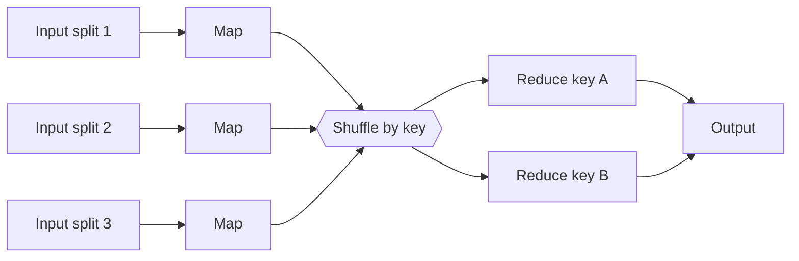

Once data outgrows one machine, interviews shift to **how work is split
across a cluster**: the MapReduce mental model, Spark's execution model,
and the shuffles that dominate cost. These questions are concept-heavy,
you reason about a plan, not write runnable Spark here.

<Figure
  slug="interview-data-engineer-distributed-processing-cutout"
  alt="One large block on a platform splitting into four identical worker blocks that each process a share and merge back into a single result block"
/>

## Q&A

### What is the MapReduce mental model?

MapReduce splits a job into two phases connected by a shuffle. **Map**
runs in parallel over input partitions, emitting `(key, value)` pairs.
The framework **shuffles** so all values for a key land together, then
**Reduce** aggregates each key's values. It scales because map tasks are
independent (embarrassingly parallel) and the framework handles
partitioning, sorting, and fault tolerance. The cost is the shuffle:
moving data across the network between map and reduce.



### What is the difference between a Spark RDD and a DataFrame?

An **RDD (Resilient Distributed Dataset)** is a low-level, distributed
collection of objects with functional transformations (`map`, `filter`,
`reduceByKey`), untyped to Spark and not optimized. A **DataFrame** is a
distributed table with a schema; operations go through the **Catalyst
optimizer** and **Tungsten** execution engine, which apply predicate
pushdown, column pruning, and code generation. Prefer DataFrames (or
Datasets) for almost everything, they are faster and let Spark reason
about your query. Drop to RDDs only for custom logic the DataFrame API
can't express.

### What is the difference between a transformation and an action in Spark?

**Transformations** (`select`, `filter`, `join`, `groupBy`) are **lazy**:
they build up a logical plan but do no work. **Actions** (`count`,
`collect`, `show`, `write`) trigger execution, Spark compiles the plan,
schedules stages, and runs them. Nothing computes until an action is
called.

```python
# pyspark: transformations are lazy, nothing runs yet
df = spark.read.parquet("s3://bucket/events")
filtered = df.filter(df.status == "active")   # transformation
grouped = filtered.groupBy("region").count()  # transformation

grouped.show()   # ACTION - now Spark plans and executes everything above
```

### Why does Spark use lazy evaluation?

Deferring execution until an action lets the optimizer see the **whole
plan** at once and rewrite it: push filters down to the scan (read less
data), prune unused columns, collapse chained maps, and pick join
strategies. If Spark executed each step eagerly, it couldn't reorder or
fuse operations. Laziness is what makes whole-query optimization possible.

### What is a partition in Spark, and why does partition count matter?

A **partition** is the unit of parallelism, one task processes one
partition on one core. Too **few** partitions underuses the cluster and
risks out-of-memory on large partitions; too **many** creates scheduling
overhead and tiny tasks. A rough target is a few hundred MB per partition
and at least as many partitions as total cores (often 2-4x). `repartition`
reshuffles to a target count; `coalesce` reduces count **without** a full
shuffle (useful before writing output).

### What is a shuffle, and why is it expensive?

A **shuffle** redistributes data across partitions so rows sharing a key
end up together, required by `groupBy`, `join`, `distinct`, and
`repartition`. It is expensive because it writes intermediate data to
disk, serializes it, and moves it over the **network** between executors,
by far the most costly operation in a Spark job. Minimizing shuffles
(and the data volume shuffled) is the core of Spark tuning.

Why it is expensive, in one figure: a shuffle turns memory access into
disk and network access, and those are four and five orders of magnitude
further away.

<Chart slug="memory-latency-ladder" />

### What is the difference between narrow and wide dependencies?

A **narrow** dependency means each parent partition feeds **at most one**
child partition (`map`, `filter`, `union`), no shuffle, and it pipelines
within a stage. A **wide** dependency means a child partition depends on
**many** parent partitions (`groupByKey`, `join`, `distinct`), which
forces a shuffle. Spark's DAG scheduler draws **stage boundaries exactly
at wide dependencies**, so counting wide transformations tells you how
many shuffle stages a job has.

```python
# Narrow: pipelined, no shuffle
df.filter(df.amount > 0).withColumn("tax", df.amount * 0.1)

# Wide: forces a shuffle and a new stage
df.groupBy("user_id").sum("amount")
```

### What is data skew, and how do you fix it?

**Skew** is when a few partitions hold far more data than the rest,
usually because a join or group key is unevenly distributed (a null key, a
"guest" user, one huge customer). Those straggler tasks dominate runtime
while other cores sit idle. Fixes: **salting** (append a random suffix to
the hot key to spread it across partitions, then aggregate in two steps);
filtering or handling null/sentinel keys separately; enabling Spark's
**Adaptive Query Execution (AQE)** skew-join handling, which splits large
partitions automatically.

Skew is the reason an average partition size tells you nothing about how
long a stage takes. Four groups with an identical mean and four
different shapes:

<Chart slug="bar-hides-distribution" />

### What is a broadcast join and when should you use it?

A **broadcast (map-side) join** ships a **small** table in full to every
executor, so the large table is joined locally with **no shuffle**. Use it
when one side fits comfortably in executor memory (a dimension or lookup
table). It replaces an expensive shuffle join with a cheap local hash
lookup. Spark auto-broadcasts tables under
`spark.sql.autoBroadcastJoinThreshold`, or you can hint it:

```python
from pyspark.sql.functions import broadcast

# Force the small dimension table to be broadcast, avoiding a shuffle
result = large_facts.join(broadcast(small_dim), "product_id")
```

### What is a sort-merge join, and how does it differ from a broadcast join?

A **sort-merge join** is Spark's default for two large tables: it shuffles
both sides on the join key, sorts each partition, then merges them
linearly. It handles arbitrary sizes but pays for two shuffles + sorts. A
**broadcast join** avoids the shuffle entirely by replicating the small
side. Rule of thumb: broadcast when one side is small; sort-merge when
both are large.

### What is a stage and a task in Spark's execution model?

Spark compiles a job into **stages** separated by shuffle boundaries
(wide dependencies). Each stage is a set of **tasks**, one per partition,
that run the same narrow-transformation pipeline in parallel. A **job** is
triggered by one action and may contain several stages run in dependency
order. Reading the stage graph in the Spark UI tells you where shuffles
and skew are.

### How does Spark achieve fault tolerance?

Through **lineage**: an RDD/DataFrame records the sequence of
transformations that produced it, not the data itself. If a partition is
lost (an executor dies), Spark **recomputes** just that partition from its
parents rather than restarting the job. **Checkpointing** truncates a very
long lineage by persisting to reliable storage, avoiding expensive
recomputation chains.

### What does caching/persisting do, and when is it worth it?

`cache()` / `persist()` keeps a DataFrame's computed partitions in memory
(or memory+disk) so **repeated** actions reuse them instead of recomputing
the whole lineage. It's worth it when the same intermediate result is
consumed multiple times, an iterative algorithm, or a base table joined in
several branches. It is **not** worth it for a result used once; caching
then just wastes memory. Remember caching is itself lazy: it populates on
the first action.

### Why avoid `collect()` on a large DataFrame?

`collect()` pulls **every** row to the driver's memory, a large result
will OOM the driver and defeats the point of distributing the work. Use it
only for small results. To inspect data use `show(n)` or `take(n)`; to
persist results, `write` them out in parallel from the executors rather
than collecting to the driver first.

A related tail effect: a stage waits for its slowest task, so a small
per-task chance of being slow becomes near-certainty across enough
partitions.

<Chart slug="tail-latency-fanout" />

### What is `groupByKey` vs `reduceByKey`, and why does it matter?

`reduceByKey` combines values **locally on each partition first**
(map-side combine) and only shuffles the partial aggregates, far less
network traffic. `groupByKey` shuffles **all** values for each key before
combining, moving much more data and risking OOM on hot keys. Prefer
`reduceByKey` / `aggregateByKey` (or DataFrame `groupBy().agg()`, which
combines locally) whenever the aggregation is associative.

### How is Spark different from classic Hadoop MapReduce?

Hadoop MapReduce writes intermediate results to disk (HDFS) **between
every** map and reduce, which is slow for multi-step and iterative jobs.
Spark keeps intermediates in **memory** across stages and only spills to
disk under pressure, making multi-stage pipelines and iterative algorithms
(ML, graph) much faster. Spark also offers a richer API (DataFrames, SQL,
streaming) and whole-query optimization, where MapReduce exposes only map
and reduce.

### What is predicate and projection pushdown?

**Predicate pushdown** applies filters as early as possible, ideally at
the file scan, so the reader skips row groups or partitions that can't
match (using Parquet/ORC min-max statistics). **Projection pushdown**
reads only the columns the query references. Both cut I/O dramatically and
are automatic for Spark DataFrames over columnar formats, one more reason
to prefer DataFrames over RDDs and Parquet over CSV.

## Concept checks

<MultipleChoice
  markdown={`You run a series of \`filter\` and \`select\` transformations on a Spark DataFrame, but the Spark UI shows no job running. Why?

- \`filter\` and \`select\` run only on the driver, so the UI shows nothing.
  > They run distributed across executors, but only after an action triggers the plan.
- You must call \`cache()\` before any transformation executes.
  > Caching is optional and also lazy; it's the action, not caching, that starts execution.
- [o] Transformations are lazy; no job runs until an **action** (like \`count\` or \`write\`) is called.
  > Spark only builds a logical plan for transformations and executes it when an action forces materialization.
- Spark is broken or the cluster is down.
  > Nothing is wrong: transformations don't trigger execution on their own.`}
/>

<MultipleChoice
  markdown={`A job joins a 2 TB fact table with a 20 MB country lookup table and is dominated by shuffle time. What's the highest-impact fix?

- Cache both tables in memory before joining.
  > Caching doesn't avoid the shuffle; you'd still shuffle 2 TB on the join key.
- Convert the DataFrames to RDDs and use \`groupByKey\`.
  > That drops the Catalyst optimizer and \`groupByKey\` shuffles even more, the opposite of what's needed.
- Repartition the fact table into more partitions.
  > More partitions may help parallelism but doesn't remove the shuffle caused by the join itself.
- [o] Broadcast the 20 MB lookup table so the join happens locally with no shuffle.
  > A broadcast join replicates the small side to every executor, eliminating the shuffle of the 2 TB table.`}
/>

<MultipleChoice
  markdown={`One task in a \`groupBy("user_id")\` stage runs for 40 minutes while the other 200 tasks finish in seconds. What's the most likely cause?

- The cluster has too few cores.
  > Too few cores would slow tasks uniformly, not create one 40-minute straggler among fast tasks.
- The DataFrame wasn't cached.
  > Caching affects re-use across actions, not the imbalance within a single shuffle stage.
- [o] Data skew: one \`user_id\` (e.g. a null or a huge account) holds most of the rows, so its partition is enormous.
  > A hot key concentrates data into a single partition, making one task do most of the work while others idle.
- Lazy evaluation is delaying the other tasks.
  > Laziness governs when the plan runs, not how work is distributed once a stage executes.`}
/>

## Go deeper

- [Data Analysis with Python & pandas](/courses/data-analysis-python-pandas), the single-node columnar model Spark scales out.
- [SQL Analytics with DuckDB](/courses/sql-analytics-duckdb), predicate pushdown and columnar scans in practice.
