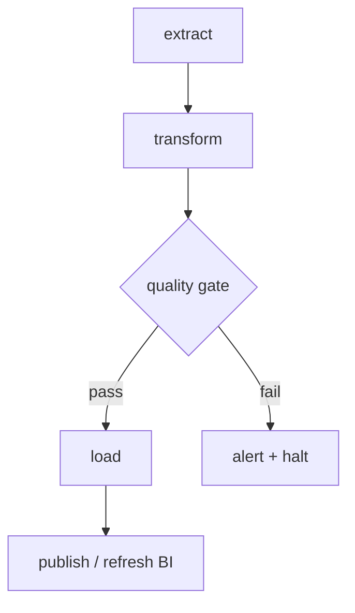

The reliability half of the job: getting the right tasks to run in the
right order, recover from failure, and catch bad data before it reaches
consumers. Interviewers want to hear that you design pipelines to be
**re-runnable and observable**, not just correct on the happy path.

<Figure
  slug="interview-data-engineer-orchestration-and-reliability-cutout"
  alt="A directed graph of task nodes on a platform connected by arrows, a small clock dial driving the first node and a retry loop curling back into one of them"
/>

## Q&A

### What does an orchestrator give you over cron?

A **DAG (Directed Acyclic Graph)** of tasks with explicit dependencies, so
steps run only after their upstreams succeed, plus retries, backfills,
scheduling, monitoring, and lineage. Cron just fires a command at a time
with no dependency awareness, no retry, and no visibility into whether the
data it depended on is actually ready. Airflow, Dagster, and Prefect model
the **graph** and the **run history**, cron models neither.



### What is a DAG, and what are common anti-patterns?

A **DAG** defines a workflow's tasks and their dependency edges (no
cycles). Common anti-patterns: (1) **expensive work at parse time** (API
calls in the DAG file) that slows the scheduler on every parse; (2)
**monolithic tasks** that do too much, making retries costly and failures
coarse; (3) **non-idempotent tasks** that corrupt state on partial
re-runs; (4) **passing large data through XComs**, XComs are for small
metadata; write big payloads to object storage and pass the path.

```python
# Anti-pattern: a huge result serialized into the XCom DB
@task
def extract():
    return fetch_million_rows()      # avoid

# Better: write to storage, pass only the path (tiny XCom)
@task
def extract():
    path = "s3://bucket/staging/{{ ds }}.parquet"
    write_parquet(fetch_million_rows(), path)
    return path
```

### Why is idempotency the foundation of reliable pipelines?

An **idempotent** task produces the same final state whether it runs once
or five times, which is exactly what makes **retries and backfills safe**.
Achieve it with **partition overwrite** (delete-then-insert the target
slice) or **upsert by key** (`MERGE` / `ON CONFLICT`) instead of blind
`INSERT`, which duplicates rows on re-run. Without idempotency, every retry
risks double-counting, so you can't safely automate recovery.

```python
# Idempotent partition overwrite: re-running any date is safe.
@task
def load_day(ds: str):              # ds injected by the scheduler
    run_sql(f"""
        DELETE FROM events_clean WHERE event_date = '{ds}';
        INSERT INTO events_clean
        SELECT * FROM events_raw WHERE event_date = '{ds}';
    """)
```

The failure it prevents compounds. Without idempotent writes, a retry
after a partial success does not repair the run, it duplicates part of
it.

<Chart slug="idempotency-retry-storm" />

### What is a backfill, and how do you design for it?

A **backfill** reprocesses historical data, to populate a new table, fix a
bug, or apply a schema change. Design for it by making pipelines
**parameterized by date range** and **idempotent**, so each partition runs
independently and re-runs safely. In Airflow, `catchup=True` with a
sensible `start_date` schedules the historical runs; partitioned assets do
this in Dagster. Backfilling years of data often needs **throttling** so
you don't overwhelm source systems or the warehouse.

Backfills are also where image build time starts to matter, and layer
ordering is the whole game: a dependency install placed after a source
copy is re-run on every commit.

<Chart slug="docker-layer-cache" />

### How should you configure retries, and what shouldn't you retry?

Set a small `retries` count with **exponential backoff** for **transient**
failures (network blips, rate limits, brief unavailability). Do **not**
blindly retry deterministic failures (bad SQL, schema mismatch, validation
errors), they'll just fail again and waste time/money. And only retry
tasks that are **idempotent**; retrying a non-idempotent task can duplicate
data. Pair retries with alerting so repeated failures surface instead of
silently exhausting attempts.

```python
default_args = {
    "retries": 3,
    "retry_delay": timedelta(minutes=5),
    "retry_exponential_backoff": True,
    "max_retry_delay": timedelta(minutes=30),
}
```

### What are data-quality checks, and where do they belong in a DAG?

Data-quality checks validate expectations **before** data flows
downstream: row-count thresholds, null-rate limits, uniqueness, referential
integrity (all foreign keys resolve), value ranges, schema conformance, and
freshness. Place them as **gate tasks** between load and publish so a
failure **halts** the run (a circuit breaker) rather than letting bad data
reach dashboards. Tools: dbt tests, Great Expectations, Soda.

### What is a circuit breaker in a pipeline?

A **circuit breaker** stops a pipeline from propagating bad data when a
quality check fails, it fails fast, alerts, and halts further processing
instead of polluting downstream tables. It is implemented as a
quality-gate task the DAG must pass before continuing. The point is to
contain a data-quality incident to one table rather than fanning it out to
every dependent asset and dashboard.

The point of opening the circuit is not to fail faster, it is to stop
sending load to something that cannot recover while it is under load.

<Chart slug="circuit-breaker-states" />

### What is an SLA in a pipeline, and how do you enforce it?

An **SLA (Service Level Agreement)** is a commitment that a dataset is
ready by a certain time ("`daily_orders` is fresh by 06:00 UTC"). Enforce
it with (1) **SLA/deadline callbacks** that alert when a task misses its
target; (2) **freshness monitoring** in the warehouse (`MAX(updated_at)`
checks, or dbt source freshness); (3) **priority** so critical pipelines
get compute ahead of low-priority jobs. Track the SLA as an **objective
(SLO)** you measure over time, not just a one-off alert.

### What is data freshness, and how do you monitor it?

**Freshness** is how recently a dataset was successfully updated relative
to expectation. Monitor it by comparing `MAX(event_time)` or a load
timestamp against `now()` and alerting when the gap exceeds a threshold, a
table that "succeeded" but is hours stale is a silent failure a green DAG
won't catch. Freshness checks catch **missing** data that passed row-level
validation, complementing quality checks that inspect the data present.

### How do you manage dependencies between separate pipelines?

When pipeline B depends on pipeline A's output, avoid guessing with a cron
offset. Options: (1) a **sensor** that waits for A's completion or its
output to land (a file, a partition, a marker); (2) a **dataset/asset
trigger** where B runs when A publishes the dataset it consumes (Airflow
Datasets, Dagster assets); (3) merging both into one DAG if they're tightly
coupled. Explicit data dependencies beat time-based coupling, which breaks
whenever A runs late.

```python
# Sensor in reschedule mode frees the worker slot between checks.
wait_for_export = S3KeySensor(
    task_id="wait_for_export",
    bucket_key="exports/{{ ds }}/orders.parquet",
    mode="reschedule",
    poke_interval=300,
    timeout=7200,
)
```

### What is a sensor, and why prefer reschedule mode?

A **sensor** is a task that polls a condition (does this file exist? has
the upstream partition landed?) and blocks until it's true or times out. In
the default `poke` mode a sensor **holds a worker slot** the whole time it
waits, which can deadlock a pool of long-waiting sensors. `mode="reschedule"`
releases the slot between checks, freeing capacity for real work. Use
reschedule (or deferrable/async sensors) for anything that waits more than
briefly.

### What should you monitor and alert on in data pipelines?

Beyond task success/failure: **runtime/duration** (a job that runs 3x
longer signals trouble), **data freshness**, **volume anomalies** (row
counts far from normal), **quality-check pass rates**, and **consumer-facing
SLAs**. Alerts should be **actionable and de-duplicated**, route to the
owning team, avoid paging on self-healing transient retries, and include
enough context (which table, which partition, which check) to act
immediately. Alert fatigue from noisy alerts is itself a reliability risk.

### What is dead-letter handling in a pipeline?

A **dead-letter** destination captures records (or whole tasks) that
**can't be processed**, malformed rows, schema violations, records failing
validation, so the pipeline keeps moving instead of failing entirely on a
few bad inputs. The dead-letter set is then inspected, corrected, and
optionally reprocessed. It separates "this batch has a few bad rows" from
"stop everything," and preserves the bad data for debugging instead of
silently dropping it.

### How do you make a pipeline observable and debuggable?

Emit **structured logs** with run/partition identifiers, record **lineage**
(which sources feed which assets) so you can answer "why did this metric
change?" and "what breaks if I drop this column?", track **run metadata**
(rows processed, duration, check results) as first-class data, and keep
**idempotent, partitioned** runs so you can re-run a single failed slice
in isolation. Observability is what turns a 2 a.m. failure into a scoped,
fixable incident.

### What is the difference between retries, backfills, and reruns?

**Retries** re-attempt a **failed** task within a single run, for
transient errors. A **rerun** re-executes an already-completed run (same
logical date), usually after a code or data fix. A **backfill** executes
**historical** runs that never ran, or re-runs a range of past dates. All
three are only safe on **idempotent** tasks, which is why idempotency
underpins every reliability feature.

## Concept checks

<MultipleChoice
  markdown={`A nightly load is sometimes retried after a partial failure. To make retries safe, the task deletes the target date's partition and re-inserts it. What property does this give the task?

- Higher throughput.
  > Delete-then-insert isn't about speed; it's about correctness when the task runs more than once.
- Exactly-once delivery from the source.
  > That concerns upstream messaging semantics; this only controls how *your* write behaves on re-run.
- It removes the need for scheduling.
  > You still schedule it; idempotency just makes the retries and backfills the scheduler triggers safe.
- [o] Idempotency, re-running produces the same final state instead of duplicating rows.
  > Overwriting the partition means a retry converges to the correct result rather than appending duplicates.`}
/>

<MultipleChoice
  markdown={`An Airflow DAG finished green, but a downstream dashboard shows yesterday's numbers. The load task "succeeded" yet wrote no new rows because the source was empty. Which check would have caught this?

- A larger worker pool.
  > Compute capacity has nothing to do with detecting stale or missing data.
- [o] A freshness/row-count check that fails when \`MAX(updated_at)\` is stale or the row count is abnormally low.
  > Freshness and volume checks catch "succeeded but stale/empty," the silent failures a green run hides.
- More task retries.
  > Retrying a task that succeeds (just with no data) changes nothing; it isn't a transient failure.
- Switching the schedule from daily to hourly.
  > Running more often just reproduces the same silent success more frequently; it doesn't detect it.`}
/>

<MultipleChoice
  markdown={`A batch of 1M records contains ~50 malformed rows that throw on parse. What's the most reliable design?

- Silently drop any row that fails to parse.
  > Dropping loses the records with no record of what failed, making data loss invisible and undebuggable.
- Retry the whole batch repeatedly until it passes.
  > Deterministic parse failures won't pass on retry; you'd loop forever without handling the bad rows.
- Let the task crash on the first bad row so nothing bad gets through.
  > That blocks the entire batch on a handful of bad rows and can wedge the pipeline on a poison record.
- [o] Route the malformed rows to a dead-letter destination and process the rest, then inspect and replay the dead-letters.
  > Dead-lettering isolates the bad rows so the good 999,950 flow through, while preserving the failures for debugging.`}
/>

## Go deeper

- [SQL Analytics with DuckDB](/courses/sql-analytics-duckdb), the transformation queries orchestrators schedule.
- [Database Design with PostgreSQL](/courses/database-design-postgresql), the transactional guarantees behind idempotent writes.
