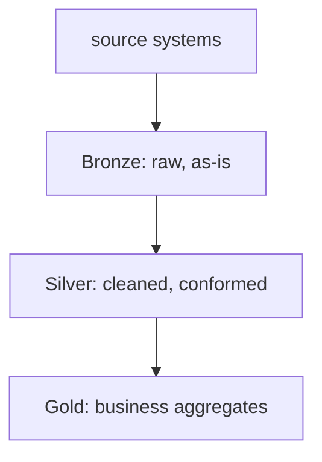

The systems half of a Data Engineer interview: moving data reliably and
cheaply at scale. These are the recurring "how would you build it?"
themes.

<Figure
  slug="interview-data-engineer-pipelines-cutout"
  alt="A segmented pipeline on a platform carrying cubes from a source tank through a filter section into a partitioned storage bay"
/>

## Q&A

### Batch vs streaming, how do you choose?

**Batch** processes bounded chunks on a schedule, simple, cheap,
easy to reprocess; latency is minutes-to-hours. **Streaming** processes
events continuously, low latency, but more operationally complex
(state, ordering, exactly-once). Choose by the **latency requirement**:
dashboards refreshed hourly → batch; fraud/alerting that needs seconds →
streaming. Many systems do both (lambda/kappa).

### What does it mean for a pipeline to be idempotent, and why does it matter?

Running it twice produces the **same** final state as running it once.
This makes retries and backfills safe after partial failures. Achieve it
by **overwriting** a target partition or **upserting** by key
(`MERGE`/delete-then-insert) instead of blind `INSERT` (which would
duplicate rows on a re-run).

The block below shows both patterns: an `ON CONFLICT (order_id)` upsert
into `orders`, and a delete-then-insert that replaces a single
`event_date` partition of `events` from `events_stage`.

```sql
-- Idempotent upsert: re-running with the same source data is safe.
INSERT INTO orders (order_id, status, updated_at)
SELECT order_id, status, updated_at
FROM orders_stage
ON CONFLICT (order_id)
DO UPDATE SET
  status     = EXCLUDED.status,
  updated_at = EXCLUDED.updated_at;

-- DuckDB / partition-overwrite pattern: delete the partition, re-insert.
DELETE FROM events WHERE event_date = '2024-06-01';
INSERT INTO events SELECT * FROM events_stage WHERE event_date = '2024-06-01';
```

### Why partition large tables, and what makes a good partition key?

Partitioning lets the engine **prune**, skip files/partitions that can't
match a query, cutting scan cost dramatically. A good key is one queries
**filter on** (usually a date like `event_date`) with even, not-too-small
partitions. Too-granular partitioning creates many tiny files (the
"small files problem") and hurts performance.

The query below filters `events` on `event_date = '2024-06-01'` so only
that day's rows are scanned, and the trailing comment shows how wrapping
`event_date` in `YEAR(...)` would defeat pruning.

<SqlCodeBlock
  dialect="duckdb"
  initSql={`CREATE TABLE events (
  event_date  DATE,
  user_id     INTEGER,
  event_type  VARCHAR
);
INSERT INTO events VALUES
  (DATE '2024-06-01', 1, 'click'), (DATE '2024-06-01', 1, 'click'),
  (DATE '2024-06-01', 2, 'view'),  (DATE '2024-06-01', 3, 'view'),
  (DATE '2024-06-01', 3, 'click'), (DATE '2024-06-01', 4, 'purchase'),
  (DATE '2024-06-01', 5, 'view'),  (DATE '2024-06-01', 2, 'click'),
  (DATE '2024-06-02', 1, 'purchase'), (DATE '2024-06-02', 3, 'click'),
  (DATE '2024-06-02', 4, 'view'),  (DATE '2024-06-02', 5, 'click'),
  (DATE '2024-06-02', 6, 'view'),  (DATE '2024-06-02', 2, 'purchase'),
  (DATE '2024-06-03', 2, 'click'), (DATE '2024-06-03', 6, 'click'),
  (DATE '2024-06-03', 7, 'view'),  (DATE '2024-06-03', 1, 'view'),
  (DATE '2024-06-04', 3, 'purchase'), (DATE '2024-06-04', 7, 'click'),
  (DATE '2024-06-04', 8, 'view'),  (DATE '2024-06-05', 4, 'click'),
  (DATE '2024-06-05', 8, 'purchase'), (DATE '2024-06-05', 5, 'view');`}
  starterCode={`-- Only the 2024-06-01 "partition" is read; other dates are skipped.
SELECT user_id, event_type, COUNT(*) AS cnt
FROM events
WHERE event_date = '2024-06-01'
GROUP BY user_id, event_type
ORDER BY user_id, event_type;

-- Pruning DEFEAT: wrapping the column in a function prevents pruning.
-- WHERE YEAR(event_date) = 2024   -- avoid this pattern`}
/>

### What does an orchestrator (Airflow/Dagster) give you over cron?

A **Directed Acyclic Graph (DAG)** of tasks with explicit dependencies,
so steps run in the right order and only after upstreams succeed; plus
retries, backfills, scheduling, monitoring, and lineage. Cron just fires
a command at a time with no dependency awareness or recovery.

The Airflow example below declares `extract`, `transform`, and `load`
tasks and wires them with `load(transform(extract()))`, so the scheduler
derives the dependency order from that call rather than from cron timing.

```python
from airflow.decorators import dag, task
from datetime import datetime

@dag(schedule="@daily", start_date=datetime(2024, 1, 1), catchup=False)
def orders_pipeline():
    @task
    def extract(): ...

    @task
    def transform(raw): ...

    @task
    def load(clean): ...

    load(transform(extract()))  # explicit dependency chain

orders_pipeline()
```

### Why is Parquet preferred over CSV for analytics?

Parquet is **columnar** and compressed: queries read only the columns
they need (less I/O), compression is far better (typed columns), and it
carries a schema + statistics enabling predicate pushdown. CSV is
row-oriented, untyped, and must be fully scanned.

### What is the small files problem and how do you fix it?

Writing many tiny files (e.g., one Parquet file per minute instead of one per day) creates massive metadata overhead, the engine spends more time listing and opening files than reading data. Fixes include **compaction jobs** (periodic rewrites that merge small files into fewer large ones), adjusting partition granularity, and using table formats like Delta Lake or Apache Iceberg that manage file manifests efficiently.

### What is exactly-once vs at-least-once delivery semantics?

**At-least-once** means the system retries until a message is acknowledged,
so duplicates are possible. It does not promise delivery through unlimited
outages or retention expiry. **Exactly-once** means each input has one effect
on the defined output, not that application code literally executes only once.
The guarantee has a boundary: a broker transaction may cover consumed offsets
and produced records while excluding an email, API call, or external database.
End-to-end exactly-once therefore needs transactional participation or an
idempotent write at every side effect. Many systems use at-least-once delivery
with idempotent consumers because that contract is simpler to extend across
system boundaries.

### What is Change Data Capture (CDC) and when do you use it?

CDC tracks row-level changes (inserts, updates, deletes) in a source database, typically by reading the database's write-ahead log (WAL), and propagates them downstream in near real time. Use it when you need low-latency replication of transactional data to a warehouse or lake without polling the source table, and when you must capture deletes (which a simple `WHERE updated_at > last_run` query misses).

The config below sets up a Debezium Postgres connector that reads the WAL
(`plugin.name: pgoutput`) for the `public.orders` table and publishes
change events to Kafka topics under the `cdc` prefix.

```yaml
# Debezium connector config (Kafka Connect), streams Postgres WAL events
# to a Kafka topic as JSON change events with op: "c" / "u" / "d"
name: postgres-source
config:
  connector.class: io.debezium.connector.postgresql.PostgresConnector
  database.hostname: db.example.com
  database.dbname: app_db
  table.include.list: public.orders
  plugin.name: pgoutput
  topic.prefix: cdc
```

### What is a watermark in a streaming pipeline?

A **watermark** is the engine's estimate that most or all events earlier than
an event-time threshold have arrived. It is progress information, not proof:
networks and producers can still deliver an older event later. A common policy
derives it from the maximum event time observed minus an allowed delay, though
the exact algorithm is engine-specific. The watermark lets an engine emit or
retire window state without waiting forever. An event behind that threshold is
late and may be dropped, sent to a side output, or used to revise a previously
emitted result, depending on the trigger, allowed-lateness, and sink settings.

### How do you handle late-arriving data in streaming?

Common strategies: (1) set a generous **allowed lateness window** so the engine holds state longer before finalizing; (2) emit **early, on-time, and late** triggers and update downstream results when late events arrive; (3) use an **upsert/merge** in the sink so late arrivals correct prior results rather than duplicating them. The right choice depends on how late data can be and how important its inclusion is to correctness.

### What is a backfill and how do you design for it?

A **backfill** reprocesses historical data through a pipeline, usually to populate a new table, fix a bug, or apply a schema change. Design for it by making pipelines **parameterized by date range** and **idempotent** (safe to run multiple times). In Airflow, set `catchup=True` and choose a sensible `start_date`; in Dagster, use partitioned assets. Backfills of years of data may require throttling to avoid overwhelming source systems.

The `process_partition` task below takes the run's logical date `ds` and
deletes-then-reinserts only that `event_date` slice of `events_clean`, so
re-running any single day is safe (idempotent).

```python
# Parameterize the pipeline by logical date so each run is independent
# and the same date can be re-run safely (idempotent).
@task
def process_partition(ds: str):  # ds = "2024-06-01" injected by Airflow
    run_sql(f"""
        DELETE FROM events_clean WHERE event_date = '{ds}';
        INSERT INTO events_clean
        SELECT * FROM events_raw WHERE event_date = '{ds}';
    """)
```

### What is ETL vs ELT?

**ETL (Extract, Transform, Load)** transforms data before loading it into the target, common when the target system has limited compute or strict schema requirements. **ELT (Extract, Load, Transform)** loads raw data first, then transforms it inside the warehouse, the modern default because cloud warehouses have abundant compute and SQL transformations (dbt) run fast in-place. ELT makes raw data available for re-transformation without re-extraction.

### What is a lakehouse and how does it differ from a data warehouse?

A **data warehouse** stores structured, processed data in a proprietary format optimized for SQL queries (e.g., Snowflake, BigQuery, Redshift). A **data lake** stores raw data in open formats (Parquet, Optimized Row Columnar (ORC), Avro) on cheap object storage. A **lakehouse** adds a transactional metadata layer (Delta Lake, Apache Iceberg, Apache Hudi) on top of lake storage, giving you ACID transactions, schema enforcement, time travel, and efficient updates, warehouse-like reliability on lake-like open storage at lower cost.

### What is Apache Avro and when is it preferred over Parquet?

Avro is a **row-oriented** binary serialization format defined by a writer's
schema. An Avro object container file stores the schema in its header, but an
individual binary record is not self-describing and usually carries no field
names or types. Messaging systems commonly put a schema identifier in an
envelope and retrieve the schema from a registry. Avro is one popular Kafka
serialization choice, alongside JSON, Protobuf, and others; Kafka itself does
not require Avro. Prefer it when compact full-record serialization and explicit
reader/writer schema evolution matter. Prefer Parquet when queries read a
subset of columns from analytical data.

### What is ORC and how does it compare to Parquet?

ORC is another columnar format, like Parquet it supports compression and predicate pushdown, and it originated in the Hive/Hadoop ecosystem. ORC has historically had slightly better compression for string-heavy data and stronger native support in Hive/Presto; Parquet has broader ecosystem support (Spark, Pandas, BigQuery, Snowflake). In practice, Parquet is the more portable choice for modern stacks.

### What is schema evolution, and how do Parquet and Avro handle it?

Schema evolution is the ability to change a schema (add, rename, remove, or change-type columns) without breaking existing readers or rewriting existing data. Parquet supports adding and dropping columns safely; changing types or renaming columns may break older readers. Avro handles evolution more formally via compatibility rules (backward, forward, full) enforced by a **schema registry**, making it the better choice when many independent services must agree on a schema.

### What is a DAG in Airflow, and what are common anti-patterns?

A **DAG** defines the set of tasks and their dependencies for a workflow. Common anti-patterns: (1) **dynamic DAGs generated at parse time** with expensive API calls, they slow the scheduler; (2) **tasks that do too much**, large monolithic tasks make retries expensive; (3) **no idempotency**, tasks that fail partway through corrupt state; (4) **passing large data through XComs**, XComs are for small metadata, not DataFrames; use external storage.

The two `extract` versions below contrast returning a million rows
directly into the XCom database against writing them to S3 and returning
only the `path` string, keeping the XCom payload tiny.

```python
# Anti-pattern: XCom used to pass a large result set
@task
def extract():
    return fetch_million_rows()   # serialized into XCom DB, avoid

# Better: write to S3/GCS and pass only the path
@task
def extract():
    path = "s3://bucket/staging/run_id.parquet"
    write_parquet(fetch_million_rows(), path)
    return path                   # tiny string in XCom, fine
```

### What is a task vs a sensor in Airflow?

A **task** performs an action (run SQL, call an API, submit a Spark job). A **sensor** is a special task that polls a condition (does this S3 file exist? has the upstream DAG succeeded?) and blocks until it is true or times out. Sensors hold a worker slot while polling; for long-waiting sensors, use `mode='reschedule'` so the slot is freed between polls.

The `S3KeySensor` below blocks until the daily `orders.parquet` export
lands in the `data-lake` bucket, polling every 5 minutes in
`reschedule` mode and failing after a 2-hour `timeout`.

```python
from airflow.sensors.s3_key_sensor import S3KeySensor

wait_for_file = S3KeySensor(
    task_id="wait_for_daily_export",
    bucket_name="data-lake",
    bucket_key="exports/{{ ds }}/orders.parquet",
    mode="reschedule",   # frees the worker slot between poke intervals
    poke_interval=300,   # check every 5 minutes
    timeout=7200,        # fail after 2 hours
)
```

### How does Dagster model pipelines differently from Airflow?

Dagster uses **software-defined assets** as the primary abstraction: you declare the data assets a function produces (a table, a file) and Dagster infers the dependency graph from asset lineage rather than explicit task wiring. This makes lineage and freshness tracking first-class. Airflow is more task-centric (what to run and when); Dagster is more asset-centric (what data exists and how it was produced). Dagster also has stronger typing and testing primitives.

### What is data quality testing in a pipeline context?

Data quality tests validate that data meets expectations before it flows downstream. Common checks: row count thresholds, null rate limits, referential integrity (all foreign keys exist), value range checks, schema conformance, and freshness (data is not too stale). Tools like dbt tests, Great Expectations, and Soda run these checks as pipeline steps and fail the job or alert on violations, preventing bad data from reaching consumers.

### What is dbt and where does it fit in an ELT pipeline?

**dbt (data build tool)** is a transformation framework that runs SQL `SELECT` statements against a warehouse and materializes the results as tables or views. It handles dependency ordering (via `ref()` calls), incremental models, testing, documentation, and lineage. It occupies the "T" in ELT, after raw data is loaded into the warehouse, dbt transforms it into clean, modeled tables for analytics.

The model below builds `fct_orders` by joining `stg_orders` to the
`dim_customer` and `dim_date` models through `ref()` calls, which is how
dbt infers the build order across these models.

```sql
-- models/marts/fct_orders.sql
-- dbt materializes this SELECT as a table; ref() wires the dependency graph.
SELECT
  o.order_id,
  o.amount,
  c.customer_name,
  d.fiscal_quarter
FROM {{ ref('stg_orders') }} o
JOIN {{ ref('dim_customer') }} c ON c.customer_id = o.customer_id
JOIN {{ ref('dim_date') }}    d ON d.date_key     = o.order_date_key
```

### What is a Medallion architecture (Bronze/Silver/Gold)?

A layered data lake or lakehouse design:

- **Bronze**, raw, unmodified source data, preserved as-is for reprocessing.
- **Silver**, cleaned, deduplicated, conformed data; joins applied; a reliable "single source of truth."
- **Gold**, business-level aggregates and denormalized tables optimized for specific BI or ML use cases.

Each layer is idempotent, gold can always be rebuilt from silver, silver from bronze:



### What is a Lambda vs Kappa architecture?

**Lambda** runs two parallel paths: a **batch layer** for accurate historical processing and a **speed layer** for low-latency streaming results, with a **serving layer** merging both. It is complex to maintain because logic must be written twice. **Kappa** uses a **single streaming path** for all data, historical reprocessing is done by replaying the event log (e.g., Kafka). Kappa is simpler when the streaming framework can handle batch semantics; Lambda is a fallback when streaming accuracy or replay isn't feasible.

### What are common cost optimization strategies for cloud data pipelines?

Key levers: (1) **partition pruning and predicate pushdown**, read less data; (2) **right-sizing compute**, auto-scaling clusters, spot/preemptible instances for batch; (3) **columnar compressed formats** (Parquet/ORC) over CSV; (4) **incremental processing** instead of full reloads; (5) **caching** intermediate results that are queried repeatedly; (6) **storage tiering**, move cold data to cheaper storage classes; (7) **query result caching** at the warehouse layer; (8) minimizing data shuffles in distributed engines (Spark/Flink).

### What is the "fan-out" problem in pipelines?

Fan-out occurs when a single upstream change triggers many downstream recomputations, for example, a correction to a dimension table invalidating thousands of downstream aggregations. Manage it with **selective invalidation** (only recompute affected partitions), **dependency graphs** that identify minimal recomputation scope, and **change data capture** that propagates only delta changes rather than full refreshes.

### How do you handle schema changes from source systems without breaking downstream?

Strategies: (1) **land raw data in a schema-on-read layer** (Bronze) so changes don't break ingestion; (2) use a **schema registry** (Confluent, AWS Glue) with enforced compatibility rules for streaming sources; (3) add **schema validation steps** at ingestion that alert and halt on breaking changes; (4) write downstream transformations to be **column-selective** (avoid `SELECT *`) so extra source columns are ignored.

### What is a circuit breaker pattern in data engineering?

A **circuit breaker** stops a pipeline from propagating bad data downstream when a quality check fails, analogous to an electrical circuit breaker. The pipeline fails fast, alerts the team, and halts further processing rather than letting corrupt or anomalous data silently pollute dependent tables and dashboards. It is implemented as a quality gate task that the DAG must pass before proceeding.

### What is data lineage and why does it matter?

**Data lineage** tracks the origin, movement, and transformation of data from source to final table, which source systems feed which raw tables, which transformations produce which downstream assets, and which dashboards consume them. It matters for debugging ("why did this metric change?"), impact analysis ("if I drop this column, what breaks?"), regulatory compliance (GDPR data provenance), and onboarding new engineers who need to understand the data flow.

### What is an SLA in a data pipeline, and how do you enforce it?

An **SLA (Service Level Agreement)** in pipeline context is a commitment that a table or dataset will be ready by a certain time (e.g., "the daily_orders table is ready by 06:00 UTC"). Enforce it by: setting **SLA callbacks** in Airflow that trigger alerts when a task misses its deadline; monitoring **data freshness** in the warehouse (e.g., `MAX(updated_at)` checks); and using **priority queues** to ensure critical pipelines get compute resources ahead of lower-priority jobs.

### What is event time vs processing time in streaming?

**Event time** is when the event actually occurred in the real world (recorded in the event payload). **Processing time** is when the event is processed by the streaming engine. They diverge because of network delays, mobile offline events, and batched uploads. Correct window aggregations (e.g., "clicks per minute") must use event time; processing time is simpler but gives misleading results for out-of-order or late data.

## Concept checks

<MultipleChoice
  markdown={`A nightly job sometimes gets re-run after a partial failure. Why make it **idempotent** (e.g. overwrite the partition / \`MERGE\` by key)?

- It guarantees the upstream data is correct.
  > It only controls *your* write behavior on re-run; upstream quality is separate.
- [o] Re-running produces the same final result instead of duplicating or double-counting rows.
  > An idempotent write means a retry converges to the correct state rather than appending duplicates.
- It makes the job run faster.
  > Idempotency is about correctness on re-runs, not speed.
- It removes the need for any scheduling.
  > You still schedule it; idempotency just makes retries and backfills safe.`}
/>

<MultipleChoice
  markdown={`A 2 TB events table is almost always queried with \`WHERE event_date = '…'\`. What's the highest-impact change?

- Store it as one giant file.
  > A single file prevents pruning and parallelism; you want partitioned, reasonably-sized files.
- [o] Partition (and/or order) the table by \`event_date\` so queries prune to one day's files.
  > Partitioning on the common filter lets the engine skip the other ~99.9% of data, a massive I/O win.
- Convert it to CSV for portability.
  > CSV is row-oriented and untyped, it would *increase* scan cost, the opposite of what's needed.
- Add every column to a single composite index.
  > Warehouse scan cost is dominated by data read; partition pruning + columnar format matter far more than a wide index.`}
/>

## Go deeper

- [SQL Analytics with DuckDB](/courses/sql-analytics-duckdb), querying Parquet directly.
