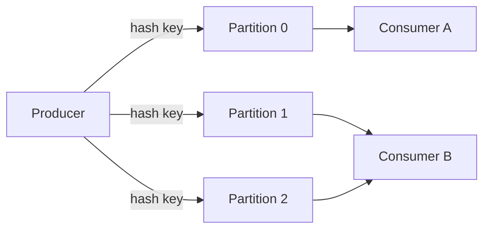

Streaming interviews test whether you understand **continuous,
unbounded** data: how a log like Kafka distributes work, what delivery
guarantees actually mean, and how you aggregate over time correctly when
events arrive late and out of order.

<Figure
  slug="interview-data-engineer-streaming-cutout"
  alt="A continuous belt of cubes flowing across a platform through three fixed-width window gates, one late cube arriving behind the others through a side chute"
/>

## Q&A

### Batch vs streaming, how do you choose?

**Batch** processes bounded chunks on a schedule, simple, cheap, trivially
reprocessable, with minutes-to-hours latency. **Streaming** processes
events continuously with sub-second-to-seconds latency but adds
operational complexity: state, ordering, late data, and delivery
guarantees. Choose by the **latency requirement** the business actually
needs: an hourly dashboard is batch; fraud detection or real-time alerting
is streaming. Don't pay streaming's complexity tax unless low latency is a
real requirement.

### What are Kafka topics, partitions, and offsets?

A **topic** is a named, append-only log of messages. Each topic is split
into **partitions**, the unit of parallelism and ordering: messages within
a partition are strictly ordered and each has a monotonically increasing
**offset** (its position). There is **no global order** across
partitions, only within one. A message's partition is chosen by its key's
hash (or round-robin if keyless), so all messages with the same key land
in the same partition and stay ordered relative to each other.

### What is a consumer group, and how does it scale consumption?

A **consumer group** is a set of consumers that jointly read a topic:
Kafka assigns each partition to **exactly one** consumer in the group, so
work is split without duplication. Parallelism is capped by the partition
count, adding consumers beyond the number of partitions leaves some idle.
Different groups reading the same topic each get **all** messages
independently (pub/sub), which is how you fan a stream out to multiple
independent pipelines.

### What are consumer offsets and why commit them?

An **offset commit** records how far a consumer group has processed each
partition, stored in Kafka. On restart or rebalance, consumption resumes
from the last committed offset instead of the beginning. **When** you
commit determines your delivery semantics: commit **after** processing for
at-least-once (a crash before commit replays the message); commit
**before** processing risks losing messages (at-most-once).

### What is the difference between at-least-once, at-most-once, and exactly-once?

- **At-most-once**, commit/ack before processing: no duplicates, but
  messages can be **lost** on failure.
- **At-least-once**, process then commit: no loss, but **duplicates** on
  retry. The common default.
- **Exactly-once**, every message affects the result precisely once,
  requiring coordination (transactions, idempotent writes) between
  producer, broker, and consumer.

Most systems run at-least-once and make the **consumer idempotent** rather
than pay exactly-once's overhead.

### How do you make a consumer idempotent?

Design writes so reprocessing the same message twice yields the same
state: **upsert by a natural or message key** (or `MERGE`) instead of blind
insert, or **deduplicate on an idempotency key** (message id / offset) you
persist. Then at-least-once delivery is safe, a replayed message overwrites
with identical data or is skipped as already-seen, giving effectively-once
results without distributed transactions.

### What is exactly-once processing in Kafka, and how is it achieved?

Kafka supports exactly-once **within the Kafka ecosystem** via
**idempotent producers** (dedup retries using a producer id + sequence
number) and **transactions** that atomically commit produced messages
**and** consumer offsets together (the "consume-transform-produce" loop).
End-to-end exactly-once to an **external** sink still requires that sink to
participate transactionally or to accept idempotent writes, Kafka's
guarantee doesn't automatically extend past its own boundary.

### What is windowing, and what are the main window types?

Windowing groups an unbounded stream into finite buckets so you can
aggregate over time. The main types:

- **Tumbling**, fixed-size, non-overlapping (every 5 minutes). Each event
  falls in exactly one window.
- **Sliding (hopping)**, fixed-size but overlapping by a slide interval
  (a 10-minute window every 1 minute). Events can belong to several.
- **Session**, dynamic windows bounded by a **gap of inactivity**: events
  are grouped until a quiet period, then the window closes. Great for
  user-activity sessionization.

### What is event time vs processing time?

**Event time** is when the event actually occurred (a timestamp in the
payload). **Processing time** is when the engine handles it. They diverge
due to network delay, retries, mobile offline buffering, and backpressure.
Correct time-based aggregations ("clicks per minute") must use **event
time**, otherwise out-of-order and late data land in the wrong window.
Processing time is simpler but only acceptable when exact temporal
accuracy doesn't matter.

### What is a watermark?

A **watermark** is the engine's estimate that "all events with event time
before T have (probably) arrived," letting it **close and emit** windows
without waiting forever. It is typically set as `max_seen_event_time -
allowed_lateness`. The watermark trades **latency vs completeness**: a
larger lateness margin catches more stragglers but holds windows (and
state) open longer before producing results.

### How do you handle late-arriving data?

Options, usually combined: (1) set an **allowed-lateness** window so the
engine keeps state and updates results when late events arrive; (2) route
data later than that to a **side output / dead-letter** for separate
handling instead of silently dropping it; (3) make the sink **upsert** so a
late event **corrects** the prior window result rather than duplicating it.
The right choice depends on how late data can be and how much its inclusion
matters to correctness.

### What is backpressure, and how do streaming systems handle it?

**Backpressure** is when a consumer can't keep up with the incoming rate.
Log-based systems like Kafka absorb it naturally: the log is durable
storage, so consumers read at their own pace and simply fall behind
(growing **consumer lag**) rather than dropping data. Push-based systems
propagate backpressure upstream to slow producers. Monitoring **consumer
lag** (offset distance between latest and committed) is the key health
signal, rising lag means you need more partitions/consumers or faster
processing.

### Why does the number of partitions matter in Kafka?

Partitions set the **maximum consumer parallelism** and the **ordering
granularity**. More partitions means more throughput and more consumers
can share the load, but also more overhead (open file handles, longer
rebalances, more end-to-end latency) and only **per-partition** ordering.
You can increase partitions later but not decrease them, and adding
partitions changes key-to-partition mapping, which can break ordering
assumptions for existing keys. Size partitions for peak throughput with
headroom.

### What is log compaction in Kafka?

**Log compaction** retains, for each key, at least the **latest** value
and garbage-collects older values, instead of expiring by time/size. This
turns a topic into a durable **changelog / snapshot** of current state per
key (e.g. latest profile per user), useful for rebuilding state stores or
CDC-style tables. It complements normal time-based retention rather than
replacing it.

### How does a streaming join differ from a batch join?

Both inputs are unbounded, so the engine can't wait for "all" rows. A
**stream-stream** join buffers each side's recent events within a
**time-bounded window** and matches across them, bounding state by the
window rather than the full history. A **stream-table** join enriches each
event against a (possibly compacted) lookup table/state store. State size
and watermark-driven expiry are the central concerns that don't exist in a
batch join.

### What is a dead-letter queue in a streaming pipeline?

A **dead-letter queue (DLQ)** is a separate topic/destination where the
consumer routes messages it **cannot process**, malformed payloads, schema
violations, or records that repeatedly fail, so the main stream keeps
flowing instead of stalling on a poison message. The DLQ is then inspected,
fixed, and optionally replayed. Without it, one bad message can block a
partition indefinitely or cause an infinite retry loop.

## Concept checks

<MultipleChoice
  markdown={`A Kafka topic has 3 partitions. Your consumer group has 5 consumers. What happens?

- All 5 consumers read all partitions, so each message is processed 5 times.
  > Within one group each partition goes to exactly one consumer; messages aren't duplicated across the group.
- [o] 3 consumers each own one partition; the other 2 sit idle.
  > Parallelism is capped by partition count, so extra consumers in the same group get no partitions.
- Kafka automatically splits each partition to use all 5 consumers.
  > Partitions aren't subdivided among consumers in a group; one partition maps to one consumer.
- The group fails to start because consumers outnumber partitions.
  > It starts fine; the surplus consumers are simply unassigned and act as standby capacity.`}
/>

<MultipleChoice
  markdown={`Your pipeline delivers at-least-once, so a record can be replayed after a crash. What's the standard way to keep results correct anyway?

- Switch every sink to at-most-once so nothing is duplicated.
  > At-most-once avoids duplicates by risking **data loss**, usually worse than the duplicates you're trying to handle.
- [o] Make the consumer idempotent, upsert by key or dedup on an idempotency key so a replay converges to the same state.
  > Idempotent writes make reprocessing safe, giving effectively-once results without distributed transactions.
- Add more partitions to the topic.
  > Partitioning affects parallelism and ordering, not whether a replayed message double-counts.
- Increase the consumer's memory.
  > Memory doesn't change delivery semantics; duplicates still corrupt the result without idempotency.`}
/>

<MultipleChoice
  markdown={`You aggregate "purchases per 5-minute window." Some events arrive up to 90 seconds late due to mobile buffering. Which design is correct?

- Aggregate by processing time and finalize each window immediately.
  > Processing time puts late mobile events in the wrong window, undercounting the window they truly belong to.
- [o] Aggregate by **event time** with a watermark that allows ~90s of lateness before closing the window.
  > Event-time windowing plus an allowed-lateness margin lets late events land in their correct window before it's finalized.
- Drop any event whose processing time is after the window end.
  > That discards exactly the late-but-valid events you need, biasing the counts low.
- Use a session window keyed on nothing.
  > Session windows model gaps of activity, not fixed 5-minute buckets; they don't address the event-time/lateness issue.`}
/>

## Go deeper

- [Time Series Analysis with Python](/courses/time-series-analysis-python), windowing and resampling over time.
- [SQL Analytics with DuckDB](/courses/sql-analytics-duckdb), the aggregation logic behind windowed queries.
